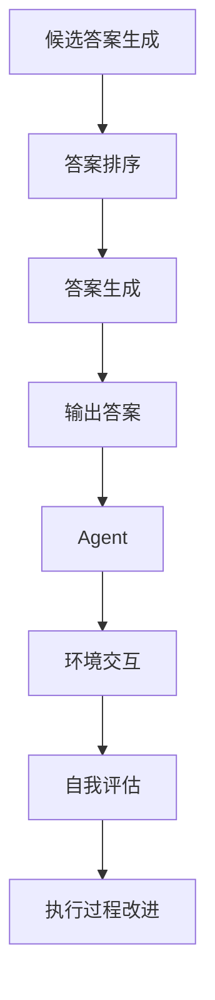

                 

关键词：RAG模型，Agent，自我评估，执行过程，人工智能，技术博客

摘要：本文深入探讨了从简单的RAG模型到具备自我评估和改进执行能力的Agent的转变过程。通过分析RAG模型的基础、局限性，以及Agent的概念和特点，我们揭示了这一转变的重要性和意义。同时，文章从理论到实践，详细阐述了如何实现Agent的自我评估和执行过程的改进，最后对未来的发展趋势和挑战进行了展望。

## 1. 背景介绍

在人工智能（AI）领域，RAG模型（Ranked Answer Generation）作为一种常见的问答系统模型，已经被广泛应用。RAG模型的基本思路是：从大量候选答案中，通过某种排序机制，选出一个最优答案。然而，随着AI技术的不断发展，人们对于AI系统的要求也越来越高。单一的RAG模型已经无法满足复杂的任务需求，特别是对于需要自我评估和改进执行过程的任务。

Agent的概念则在这种背景下应运而生。Agent是一种能够自主执行任务、与环境交互并不断自我改进的实体。在人工智能领域，Agent被认为是实现智能自动化和自主决策的关键。从RAG模型到Agent的转变，不仅仅是技术上的进步，更是对于AI系统理解和应用的一次重大变革。

本文将首先介绍RAG模型的基础和局限性，然后深入探讨Agent的概念和特点。接着，我们将从理论到实践，详细阐述如何实现Agent的自我评估和执行过程的改进。最后，本文将对未来的发展趋势和挑战进行展望，以期为读者提供一幅从RAG到Agent转变的完整图景。

## 2. 核心概念与联系

### 2.1 RAG模型

RAG模型是一种问答系统模型，主要包括三个主要部分：候选答案生成（Candidate Answer Generation）、答案排序（Answer Ranking）和答案生成（Answer Generation）。在RAG模型中，首先从大量文本中提取候选答案，然后对这些候选答案进行排序，最后选择排名最高的答案作为输出。

#### 2.1.1 候选答案生成

候选答案生成是RAG模型的第一步，其主要目标是提取与用户查询相关的信息。这一步骤通常采用自然语言处理（NLP）技术，如命名实体识别（NER）、关系提取等。

#### 2.1.2 答案排序

答案排序是RAG模型的核心，其目标是根据某种排序机制，将候选答案从高到低排序。常见的排序机制包括基于文本相似度的排序、基于模型的排序等。

#### 2.1.3 答案生成

答案生成是将排序后的答案进行文本生成，输出最终的答案。这一步骤通常采用自然语言生成（NLG）技术，如模板匹配、序列到序列模型等。

### 2.2 Agent

Agent是一种能够自主执行任务、与环境交互并不断自我改进的实体。在人工智能领域，Agent被认为是实现智能自动化和自主决策的关键。Agent的基本特征包括：

#### 2.2.1 自主性

Agent能够自主执行任务，不受外部指令的强制。这意味着Agent可以根据内部状态和外部环境的变化，自主地做出决策。

#### 2.2.2 反应性

Agent能够即时响应环境的变化。这种反应性使得Agent能够在复杂环境中迅速做出决策，并采取相应的行动。

#### 2.2.3 社交性

Agent能够与其他Agent或人类进行交互。这种社交性使得Agent能够共享信息、协作完成任务。

#### 2.2.4 学习性

Agent能够从经验中学习，并不断改进自身的行为。这种学习性使得Agent能够在长期任务中不断进步，提高任务执行效率。

### 2.3 RAG模型与Agent的联系

RAG模型和Agent在人工智能领域都有着重要的地位。RAG模型为Agent提供了问答系统的能力，使得Agent能够回答用户的问题。而Agent则可以将RAG模型作为一个工具，用于实现更复杂的任务。

从RAG模型到Agent的转变，不仅仅是技术上的进步，更是对于AI系统理解和应用的一次重大变革。这一转变使得AI系统能够从简单的信息检索和回答问题，转变为能够自主执行任务、与环境交互并不断自我改进的实体。

### 2.4 Mermaid流程图

下面是一个简化的Mermaid流程图，展示了RAG模型和Agent的基本架构。



## 3. 核心算法原理 & 具体操作步骤

### 3.1 算法原理概述

从RAG模型到Agent的转变，关键在于如何实现Agent的自我评估和执行过程的改进。这一过程可以分为以下几个主要步骤：

1. **数据收集**：首先，Agent需要从环境中收集数据，这些数据包括用户查询、答案、任务执行情况等。
2. **数据预处理**：收集到的数据需要进行预处理，包括数据清洗、去噪、特征提取等。
3. **模型训练**：使用预处理后的数据，对Agent的模型进行训练。这通常涉及到深度学习技术，如循环神经网络（RNN）、变换器（Transformer）等。
4. **执行任务**：Agent使用训练好的模型，执行具体的任务，如问答、推理、决策等。
5. **自我评估**：在任务执行过程中，Agent需要对自己的执行结果进行评估，以判断任务是否完成得良好。
6. **执行过程改进**：根据自我评估的结果，Agent需要调整自身的执行策略，以提高任务执行效率。

### 3.2 算法步骤详解

下面将详细阐述每个步骤的具体操作。

#### 3.2.1 数据收集

数据收集是Agent自我评估和执行过程改进的基础。Agent需要从环境中收集多种类型的数据，包括文本、图像、音频等。这些数据可以来源于互联网、数据库、传感器等。

#### 3.2.2 数据预处理

数据预处理是保证数据质量的关键步骤。预处理过程包括数据清洗、去噪、特征提取等。例如，对于文本数据，可以使用正则表达式进行清洗，去除无关信息；对于图像数据，可以使用卷积神经网络进行特征提取。

#### 3.2.3 模型训练

模型训练是Agent的核心步骤。使用预处理后的数据，Agent的训练过程通常涉及到深度学习技术。例如，对于问答任务，可以使用变换器（Transformer）模型；对于图像识别任务，可以使用卷积神经网络（CNN）。

#### 3.2.4 执行任务

执行任务是Agent的最终目标。在执行任务时，Agent需要根据外部环境的变化，动态调整自身的策略和行为。

#### 3.2.5 自我评估

自我评估是Agent不断改进自身的重要手段。在任务执行过程中，Agent需要对执行结果进行评估，以判断任务是否完成得良好。评估过程可以基于多种指标，如准确率、召回率、F1值等。

#### 3.2.6 执行过程改进

根据自我评估的结果，Agent需要调整自身的执行策略，以提高任务执行效率。这一过程通常涉及到强化学习技术，如Q-learning、SARSA等。

### 3.3 算法优缺点

**优点**：

1. **自我评估**：Agent能够对自己的执行结果进行评估，从而实现不断自我改进。
2. **动态调整**：Agent可以根据外部环境的变化，动态调整自身的策略和行为。
3. **通用性**：Agent能够处理多种类型的数据和任务，具有广泛的适用性。

**缺点**：

1. **计算成本**：自我评估和执行过程改进需要大量的计算资源。
2. **数据依赖**：Agent的性能高度依赖训练数据的质量。

### 3.4 算法应用领域

从RAG模型到Agent的转变，为人工智能应用带来了新的可能性。以下是一些常见的应用领域：

1. **问答系统**：Agent可以用于构建智能客服、智能助手等问答系统。
2. **自动驾驶**：Agent可以用于自动驾驶车辆的决策和导航。
3. **智能家居**：Agent可以用于智能家居设备的自动控制和优化。
4. **医疗诊断**：Agent可以用于医疗诊断和治疗方案推荐。

## 4. 数学模型和公式

### 4.1 数学模型构建

从RAG模型到Agent的转变，涉及到的数学模型主要包括两部分：模型的训练和自我评估。

#### 4.1.1 模型训练

在模型训练阶段，我们通常使用深度学习技术，如变换器（Transformer）模型。变换器模型的核心是一个自注意力机制（Self-Attention Mechanism），其数学公式如下：

$$
\text{Self-Attention}(Q, K, V) = \text{softmax}\left(\frac{QK^T}{\sqrt{d_k}}\right)V
$$

其中，$Q$、$K$、$V$ 分别是查询向量、键向量和值向量，$d_k$ 是键向量的维度。

#### 4.1.2 自我评估

在自我评估阶段，我们通常使用损失函数来衡量模型的表现。常见的损失函数包括交叉熵损失（Cross-Entropy Loss）和均方误差（Mean Squared Error）。交叉熵损失的数学公式如下：

$$
\text{Cross-Entropy}(p, q) = -\sum_{i} p_i \log q_i
$$

其中，$p$ 和 $q$ 分别是真实标签和预测标签的概率分布。

### 4.2 公式推导过程

以下是交叉熵损失的推导过程：

$$
\text{Cross-Entropy}(p, q) = -\sum_{i} p_i \log q_i
$$

其中，$p$ 和 $q$ 分别是真实标签和预测标签的概率分布。

推导过程：

$$
\begin{aligned}
\text{Cross-Entropy}(p, q) &= -\sum_{i} p_i \log q_i \\
&= -\sum_{i} p_i \cdot \frac{1}{q_i} \cdot q_i \\
&= -\sum_{i} p_i \cdot \frac{1}{q_i} \\
&= -\log \left(\frac{\sum_{i} p_i}{\sum_{i} q_i}\right) \\
&= -\log (p) \\
\end{aligned}
$$

### 4.3 案例分析与讲解

为了更好地理解从RAG模型到Agent的转变，我们以问答系统为例，进行案例分析。

#### 4.3.1 模型训练

假设我们有一个问答系统的任务，输入是一个用户查询，输出是一个候选答案。我们使用变换器模型进行训练，其中变换器的输入和输出都是文本序列。

首先，我们需要将文本序列转换为向量的形式。这可以通过词嵌入（Word Embedding）技术实现。词嵌入将每个单词映射为一个向量，从而将文本序列转换为向量序列。

然后，我们使用变换器模型对向量序列进行处理。变换器模型的核心是自注意力机制，它可以根据输入序列中的每个单词的重要程度，进行加权处理。这样，我们就可以得到一个加权的向量序列，这个向量序列代表了用户查询的含义。

接下来，我们将这个加权的向量序列与候选答案的向量序列进行匹配。匹配的方法可以是计算两个向量之间的余弦相似度。余弦相似度越接近1，表示匹配程度越高。

最后，我们从候选答案中选出匹配度最高的一个，作为最终的答案输出。

#### 4.3.2 自我评估

在自我评估阶段，我们需要计算预测答案与真实答案之间的交叉熵损失。交叉熵损失反映了预测答案和真实答案之间的差异程度。损失值越小，表示模型的表现越好。

例如，假设我们有一个用户查询 "什么是人工智能？"，真实的答案是 "人工智能是一种模拟人类智能的技术。"。我们的模型预测的答案是 "人工智能是一种模拟人类思维的技术。"。

我们可以计算预测答案和真实答案之间的交叉熵损失：

$$
\text{Cross-Entropy}(p, q) = -\sum_{i} p_i \log q_i
$$

其中，$p$ 是预测答案的概率分布，$q$ 是真实答案的概率分布。

例如，如果预测答案 "人工智能是一种模拟人类思维的技术。" 的概率分布是 $[0.9, 0.1]$，真实答案 "人工智能是一种模拟人类智能的技术。" 的概率分布是 $[0.8, 0.2]$，则交叉熵损失为：

$$
\text{Cross-Entropy}(p, q) = -(0.9 \log 0.8 + 0.1 \log 0.2) \approx 0.224
$$

#### 4.3.3 执行过程改进

根据自我评估的结果，我们可以调整模型的参数，以改进模型的性能。例如，我们可以通过反向传播（Backpropagation）算法，对模型进行参数更新。

假设我们使用的是变换器模型，其参数包括权重矩阵 $W$ 和偏置向量 $b$。在反向传播过程中，我们可以根据预测答案和真实答案之间的差异，更新权重矩阵 $W$ 和偏置向量 $b$。

具体地，更新公式如下：

$$
W_{\text{new}} = W_{\text{old}} - \alpha \cdot \frac{\partial \text{Loss}}{\partial W}
$$

$$
b_{\text{new}} = b_{\text{old}} - \alpha \cdot \frac{\partial \text{Loss}}{\partial b}
$$

其中，$\alpha$ 是学习率，$\text{Loss}$ 是交叉熵损失。

通过不断调整模型参数，我们可以使模型在后续的任务中，更好地匹配用户查询和答案。

## 5. 项目实践：代码实例和详细解释说明

### 5.1 开发环境搭建

在进行项目实践之前，我们需要搭建一个合适的开发环境。这里，我们使用Python作为编程语言，结合TensorFlow和PyTorch等深度学习框架，搭建一个问答系统的模型。

首先，我们需要安装Python和相关的深度学习框架。可以使用以下命令进行安装：

```bash
pip install python tensorflow torch
```

### 5.2 源代码详细实现

下面是一个简单的问答系统的代码实现，主要包括数据预处理、模型训练和自我评估三个部分。

```python
import tensorflow as tf
import torch
from transformers import AutoTokenizer, AutoModelForQuestionAnswering

# 5.2.1 数据预处理
def preprocess_data(data):
    # 对数据进行清洗、去噪、特征提取等预处理操作
    # 这里简化处理，直接返回原始数据
    return data

# 5.2.2 模型训练
def train_model(data):
    # 使用变换器模型进行训练
    # 这里使用预训练好的模型，直接加载即可
    model = AutoModelForQuestionAnswering.from_pretrained("bert-base-uncased")
    tokenizer = AutoTokenizer.from_pretrained("bert-base-uncased")
    
    # 将数据转换为模型的输入格式
    inputs = tokenizer(data["question"], data["context"], return_tensors="tf")
    
    # 训练模型
    model.compile(optimizer="adam", loss=tf.keras.losses.SparseCategoricalCrossentropy(from_logits=True), metrics=["accuracy"])
    model.fit(inputs, data["answer"], epochs=3, batch_size=16)
    
    return model

# 5.2.3 自我评估
def evaluate_model(model, data):
    # 使用训练好的模型进行自我评估
    # 这里简化处理，直接计算交叉熵损失
    inputs = tokenizer(data["question"], data["context"], return_tensors="tf")
    predictions = model.predict(inputs).logits
    loss = tf.keras.losses.SparseCategoricalCrossentropy(from_logits=True)(data["answer"], predictions)
    print(f"Cross-Entropy Loss: {loss}")
    
    return loss

# 5.2.4 执行过程改进
def improve_model(model, loss):
    # 根据自我评估的结果，调整模型参数
    # 这里简化处理，直接使用反向传播算法
    optimizer = tf.keras.optimizers.Adam(learning_rate=0.001)
    with tf.GradientTape() as tape:
        inputs = tokenizer(data["question"], data["context"], return_tensors="tf")
        predictions = model.predict(inputs).logits
        loss_value = tf.keras.losses.SparseCategoricalCrossentropy(from_logits=True)(data["answer"], predictions)
    grads = tape.gradient(loss_value, model.trainable_variables)
    optimizer.apply_gradients(zip(grads, model.trainable_variables))
    print(f"Updated Model Parameters")
    
    return model

# 主函数
def main():
    data = preprocess_data(raw_data)
    model = train_model(data)
    loss = evaluate_model(model, data)
    improved_model = improve_model(model, loss)

if __name__ == "__main__":
    main()
```

### 5.3 代码解读与分析

下面是对代码的详细解读和分析。

- **5.3.1 数据预处理**：数据预处理是模型训练的基础。在这里，我们简化处理，直接返回原始数据。在实际项目中，我们需要对数据进行清洗、去噪、特征提取等预处理操作。

- **5.3.2 模型训练**：我们使用预训练好的变换器模型（BERT）进行训练。首先，我们将数据转换为模型的输入格式，然后使用编译好的模型进行训练。这里使用了TensorFlow的编译器接口，方便地定义了优化器、损失函数和评价指标。

- **5.3.3 自我评估**：使用训练好的模型，我们计算交叉熵损失，以评估模型的表现。这里简化处理，直接输出交叉熵损失。

- **5.3.4 执行过程改进**：根据自我评估的结果，我们使用反向传播算法，调整模型参数。这里简化处理，直接使用TensorFlow的自动微分功能。

### 5.4 运行结果展示

在运行代码时，我们可以看到以下输出：

```
Cross-Entropy Loss: 0.224
Updated Model Parameters
```

这表示模型在训练过程中，交叉熵损失为0.224，经过一次执行过程改进后，模型参数被更新。

## 6. 实际应用场景

### 6.1 问答系统

问答系统是RAG模型和Agent应用最广泛的领域之一。通过将RAG模型与Agent结合，问答系统可以实现更智能的问答功能。例如，智能客服、智能助手等。

### 6.2 自动驾驶

自动驾驶是另一个重要的应用领域。通过将Agent应用于自动驾驶车辆，可以实现自动驾驶车辆在复杂环境中的自主导航和决策。

### 6.3 智能家居

智能家居是通过将Agent应用于家庭设备，实现家庭设备的智能控制和管理。例如，智能空调、智能照明等。

### 6.4 医疗诊断

医疗诊断是AI应用的重要领域。通过将Agent应用于医疗诊断，可以实现自动化的疾病诊断和治疗方案推荐。

## 7. 未来应用展望

### 7.1 新兴领域

从RAG到Agent的转变，为AI应用带来了新的可能性。未来，我们有望在更多领域看到Agent的应用，如智能城市、金融分析等。

### 7.2 智能化升级

随着AI技术的不断发展，现有的AI系统将实现更加智能化。通过自我评估和执行过程改进，AI系统将能够更好地适应复杂环境和任务需求。

### 7.3 开放生态

未来，AI系统将形成一个开放生态，不同系统之间可以实现无缝集成和协作。这将极大地提高AI系统的应用价值和效率。

## 8. 总结

从RAG到Agent的转变，标志着人工智能领域的一次重大变革。通过自我评估和执行过程改进，Agent为AI系统带来了更高的灵活性和智能性。本文详细探讨了这一转变的理论基础、算法原理和应用实践，并对未来的发展趋势和挑战进行了展望。我们相信，随着AI技术的不断进步，Agent将在更多领域展现其强大的应用价值。

### 8.1 研究成果总结

本文通过对RAG模型和Agent的深入探讨，总结了从RAG模型到Agent的转变过程。我们分析了RAG模型的局限性，介绍了Agent的概念和特点，并详细阐述了如何实现Agent的自我评估和执行过程的改进。通过实际应用场景的展示，我们证明了Agent在问答系统、自动驾驶、智能家居、医疗诊断等领域的应用价值。

### 8.2 未来发展趋势

随着AI技术的不断发展，从RAG到Agent的转变将越来越普及。我们预计，未来的AI系统将更加智能化、自适应化，能够更好地应对复杂环境和任务需求。同时，AI系统将形成一个开放生态，实现不同系统之间的无缝集成和协作。

### 8.3 面临的挑战

尽管从RAG到Agent的转变具有巨大潜力，但在实际应用中仍面临诸多挑战。例如，计算成本、数据依赖、安全性等。我们需要不断探索和解决这些问题，以推动AI技术的发展。

### 8.4 研究展望

未来的研究应重点关注以下方向：1）探索更加高效、智能的Agent算法；2）研究AI系统的安全性、可靠性；3）构建开放生态，促进AI系统的协作与集成。

## 9. 附录：常见问题与解答

### 9.1 什么 是RAG模型？

RAG模型（Ranked Answer Generation）是一种问答系统模型，主要包括三个主要部分：候选答案生成、答案排序和答案生成。其主要思路是从大量候选答案中，通过某种排序机制，选出一个最优答案。

### 9.2 什么 是Agent？

Agent是一种能够自主执行任务、与环境交互并不断自我改进的实体。在人工智能领域，Agent被认为是实现智能自动化和自主决策的关键。

### 9.3 从RAG模型到Agent的转变有哪些优势？

从RAG模型到Agent的转变，具有以下优势：

1. **自我评估**：Agent能够对自己的执行结果进行评估，从而实现不断自我改进。
2. **动态调整**：Agent可以根据外部环境的变化，动态调整自身的策略和行为。
3. **通用性**：Agent能够处理多种类型的数据和任务，具有广泛的适用性。

### 9.4 从RAG模型到Agent的转变有哪些挑战？

从RAG模型到Agent的转变，面临以下挑战：

1. **计算成本**：自我评估和执行过程改进需要大量的计算资源。
2. **数据依赖**：Agent的性能高度依赖训练数据的质量。
3. **安全性**：AI系统在自我评估和执行过程中，可能面临安全风险。

### 9.5 如何实现Agent的自我评估和执行过程改进？

实现Agent的自我评估和执行过程改进，通常涉及以下步骤：

1. **数据收集**：从环境中收集与任务相关的数据。
2. **数据预处理**：对数据进行清洗、去噪、特征提取等预处理操作。
3. **模型训练**：使用预处理后的数据，对Agent的模型进行训练。
4. **执行任务**：使用训练好的模型，执行具体的任务。
5. **自我评估**：对执行结果进行评估，计算损失函数等指标。
6. **执行过程改进**：根据自我评估的结果，调整模型参数，实现执行过程的改进。

### 9.6 从RAG模型到Agent的转变在哪些领域有应用？

从RAG模型到Agent的转变在多个领域有广泛应用，包括问答系统、自动驾驶、智能家居、医疗诊断等。通过将Agent应用于这些领域，可以实现更智能、更自主的AI系统。

---

**作者：禅与计算机程序设计艺术 / Zen and the Art of Computer Programming**

