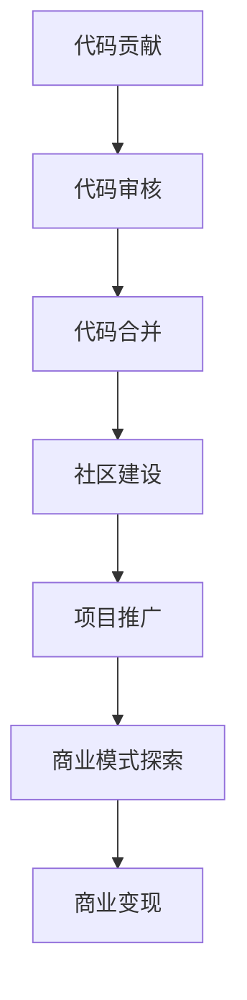

                 

在信息技术飞速发展的当今时代，开源社区已经成为软件开发的基石，吸引了无数开发者的参与。从个人爱好到商业运作，代码贡献和开源商业化正逐渐成为连接技术开发与商业利益的桥梁。本文旨在探讨这一转变过程中的关键步骤和策略，帮助开发者更好地理解并实践从代码贡献到开源商业化的全路径。

## 文章关键词
- 开源社区
- 代码贡献
- 商业化
- 开源项目
- 软件商业化
- 开发者生态系统

## 文章摘要
本文将详细介绍从个人代码贡献到实现开源商业化的全过程。首先，我们将探讨为何参与开源社区对开发者至关重要，并解释开源商业化的概念。接下来，文章将深入分析如何选择合适的项目、构建社区、管理代码以及推广项目。随后，我们将探讨如何将开源项目商业化，包括如何处理许可、商业模式、市场定位以及营销策略。最后，文章将总结开源商业化面临的主要挑战，并提出未来的发展方向。

## 1. 背景介绍
开源社区起源于共享精神和协作文化的理念，旨在通过开放源代码来促进软件的透明性、改进和创新。早期，许多开发者参与开源项目是因为他们对技术的热情和对社区贡献的渴望。然而，随着时间的推移，开源社区逐渐发展壮大，成为全球软件开发的中心。今天，开源项目不仅由志愿者维护，还吸引了企业的参与，成为推动技术进步和创新的重要力量。

开源商业化的概念则是指通过开源项目获取商业利益的过程。这与传统的封闭源代码商业模式不同，它强调通过社区合作、共享和互助来实现商业目标。开源商业化的优势在于能够降低开发成本、提高产品透明度和可靠性，同时增强用户参与度和品牌忠诚度。

本文将围绕以下主题展开：

- 开源社区的价值和作用
- 选择和参与开源项目的策略
- 开源项目的代码管理
- 开源项目的推广和商业化
- 开源商业化面临的挑战与未来趋势

### 1.1 开源社区的发展历程
开源社区的历史可以追溯到20世纪80年代，当时Linus Torvalds发布了Linux内核的第一个版本。Linux的成功激发了无数开源项目的诞生，如Apache Web服务器、MySQL数据库等。这些项目证明了开放源代码模式能够带来技术上的巨大进步。

进入21世纪，随着互联网的普及和云计算技术的发展，开源社区迎来了新的发展契机。大型企业如谷歌、微软、红帽等开始积极参与开源项目，将其作为业务战略的一部分。这种趋势进一步推动了开源生态系统的繁荣。

开源社区的发展历程可以概括为以下几个阶段：

1. **个体贡献期**：早期开源项目主要依赖于个体开发者的热情和贡献。开发者为了兴趣和成就感，自愿分享代码和知识。
2. **社区协作期**：随着项目的规模和影响力增加，开源项目开始形成社区，开发者之间通过合作和交流推动项目的进步。
3. **企业参与期**：大型企业意识到开源项目在技术进步和市场竞争中的价值，开始大规模投入资源，推动开源项目的商业化。
4. **生态成熟期**：今天，开源社区已经成为一个高度组织化、商业化的生态系统，吸引了全球范围内的开发者、企业和投资机构的参与。

### 1.2 开源社区的核心价值和作用
开源社区的核心价值在于其开放性、协作性和创新性。开放性意味着任何人都可以自由访问、使用和修改代码，这促进了知识和技术的共享。协作性则通过社区成员之间的合作，使得项目能够迅速迭代和改进。创新性来源于社区成员的多样性，不同背景和技能的人可以共同探索和实现新的技术解决方案。

具体来说，开源社区的作用体现在以下几个方面：

1. **技术创新**：开源项目往往能够吸引来自不同领域和背景的开发者，通过集体智慧推动技术创新。
2. **成本效益**：开源软件降低了开发者的时间和成本，使得更多资源可以投入到核心业务中。
3. **可靠性保障**：社区成员通过持续测试和改进，提高了软件的可靠性和安全性。
4. **生态构建**：开源项目不仅产生了代码，还形成了围绕项目的生态系统，包括开发者社区、服务提供商、咨询机构等。

开源社区的成功案例不胜枚举。例如，Linux内核项目通过全球开发者的协作，成为最流行的操作系统之一。Apache基金会管理的众多开源项目，如Apache HTTP服务器、Apache Kafka等，在各自领域内具有重要影响力。这些案例充分证明了开源社区在推动技术进步和产业创新中的关键作用。

总的来说，开源社区已经成为信息技术领域不可或缺的一部分。它不仅促进了技术的创新和发展，还为企业和开发者提供了丰富的资源和合作机会。随着开源社区的不断成熟，其价值和作用将愈发凸显。

## 2. 核心概念与联系

在探讨如何从代码贡献到开源商业化的过程中，我们首先需要明确几个核心概念，并理解它们之间的相互关系。以下是这些核心概念及其关系的详细解释：

### 2.1 开源项目
开源项目是指由社区成员共同参与、维护和发展的软件项目，其源代码公开，允许任何人自由地查看、修改和分发。开源项目可以是个人或团队发起的，也可以是企业在开源社区中的投资与合作项目。

### 2.2 开源许可证
开源许可证是用于规范开源项目使用和分发条款的法律文档。常见的开源许可证包括GPL（GNU通用公共许可证）、Apache许可证、MIT许可证等。不同的许可证有不同的要求和限制，开发者需要根据项目特点和需求选择合适的许可证。

### 2.3 代码贡献
代码贡献是指开发者向开源项目提交代码或文档，以帮助项目的改进和扩展。贡献代码通常需要遵循项目的代码贡献指南，包括代码风格、提交流程等。

### 2.4 社区建设
社区建设是指围绕开源项目形成的开发者社区，通过交流、合作和互助，推动项目的进步。社区建设包括社区网站、邮件列表、社交媒体渠道等多种形式。

### 2.5 商业模式
商业模式是指开源项目如何通过提供增值服务、许可费或其他方式实现商业盈利。常见的商业模式包括SaaS（软件即服务）、订阅模式、定制开发等。

### 2.6 许可证与商业模式的联系

- **开源许可证**与**商业模式**之间的联系在于，开源许可证决定了项目代码的合法使用和分发方式，从而影响商业模式的实施。例如，某些许可证（如GPL）要求任何衍生作品也必须开源，这可能会限制某些商业模式的实施。
- **开源项目**与**社区建设**之间的关系在于，社区是项目持续发展的基础。通过良好的社区建设，可以吸引更多开发者参与，提高项目的质量和技术创新。
- **代码贡献**与**商业模式**之间的联系在于，代码贡献是开源项目发展的动力，优质的代码贡献可以增强项目的市场竞争力和用户基础，从而为商业模式提供支持。

### 2.7 开源项目与商业模式的Mermaid流程图

以下是一个简化的Mermaid流程图，展示了从代码贡献到开源商业化的主要环节和它们之间的联系：



在这个流程图中，代码贡献是起点，通过审核、合并和社区建设，项目得到不断改进和推广，最终通过商业模式实现商业变现。每个环节都是相互关联的，共同推动了开源项目的成功和商业化进程。

## 3. 核心算法原理 & 具体操作步骤

### 3.1 算法原理概述
从代码贡献到开源商业化的过程可以被视为一种算法，该算法的核心在于如何高效地将技术价值转化为商业利益。这个过程包含了以下几个关键步骤：

1. **代码贡献**：开发者提交代码或文档，以推动项目的改进。
2. **代码审核**：项目维护者对提交的代码进行审查，确保其符合项目标准和质量要求。
3. **代码合并**：审查通过的代码被合并到项目的主要分支，从而实现项目的持续迭代。
4. **社区建设**：通过论坛、邮件列表、社交媒体等渠道，建立和维护开发者社区，促进项目的交流和合作。
5. **项目推广**：通过展示项目的技术优势和市场潜力，吸引更多的用户和开发者参与。
6. **商业模式探索**：评估项目的技术和市场潜力，探索合适的商业模式，以实现商业盈利。
7. **商业变现**：通过提供增值服务、许可费等方式，将项目的技术优势转化为商业利益。

### 3.2 算法步骤详解

#### 3.2.1 代码贡献
代码贡献是开源项目发展的基础。开发者可以通过以下步骤进行代码贡献：

1. **了解项目**：研究项目的文档和代码，了解其功能和结构。
2. **定位问题**：找到需要改进或扩展的功能模块。
3. **编写代码**：根据项目规范编写代码，并添加必要的注释和文档。
4. **代码审查**：提交代码前，进行自我审查，确保代码符合项目的要求和质量标准。
5. **提交代码**：通过项目的代码管理工具（如Git）提交代码，并填写详细的提交说明。

#### 3.2.2 代码审核
项目维护者对提交的代码进行审核，主要包括以下几个方面：

1. **代码质量**：检查代码是否符合编程规范，是否存在语法错误、逻辑漏洞等。
2. **功能实现**：确认代码实现了预期的功能，并具有良好的性能和可扩展性。
3. **文档完整性**：检查代码和文档的完整性和一致性。
4. **安全性**：确保代码没有引入安全漏洞。

审核通过的代码将被合并到项目的主要分支。

#### 3.2.3 代码合并
代码合并是将审核通过的代码集成到项目的主要分支，以便进行后续的测试和发布。合并过程中需要注意以下事项：

1. **版本控制**：使用版本控制工具（如Git）进行代码合并，确保版本历史的完整性和可追溯性。
2. **合并冲突**：在合并过程中，如果出现代码冲突，需要通过协商和讨论解决冲突。
3. **自动化测试**：合并后，运行自动化测试，确保项目的稳定性和可靠性。

#### 3.2.4 社区建设
社区建设是开源项目成功的关键。以下是构建和维护开发者社区的一些策略：

1. **建立论坛**：创建项目论坛，提供开发者交流的场所。
2. **维护邮件列表**：定期发布项目新闻、更新和问题解答，保持社区的活跃度。
3. **社交媒体推广**：利用社交媒体平台（如Twitter、LinkedIn）宣传项目，吸引更多开发者关注。
4. **代码贡献指南**：编写详细的代码贡献指南，帮助新开发者了解项目的开发流程和规范。
5. **代码审查流程**：建立完善的代码审查流程，确保代码的质量和项目的可持续发展。

#### 3.2.5 项目推广
项目推广是吸引更多用户和开发者参与的重要手段。以下是一些推广策略：

1. **展示技术优势**：通过演示和文档，展示项目的技术优势和创新点。
2. **社区活动**：组织线上或线下的社区活动，如黑客松、研讨会等，增强社区的凝聚力。
3. **媒体宣传**：通过媒体渠道（如博客、新闻稿）宣传项目的进展和成就。
4. **合作伙伴关系**：与其他开源项目和企业建立合作伙伴关系，共同推广和开发项目。
5. **市场定位**：明确项目在市场中的定位，针对性地进行推广。

#### 3.2.6 商业模式探索
在项目推广的过程中，需要同时探索合适的商业模式，以实现商业盈利。以下是几种常见的商业模式：

1. **SaaS模式**：提供基于云的软件服务，用户通过订阅支付费用。
2. **许可费模式**：为使用项目的企业用户提供商业许可，收取许可费。
3. **定制开发模式**：根据企业用户的需求，提供定制化的开发服务。
4. **增值服务模式**：提供专业的技术支持和咨询服务，为用户提供额外的价值。

#### 3.2.7 商业变现
在商业模式确定后，通过以下方式实现商业变现：

1. **销售软件服务**：通过官方网站或第三方平台销售软件服务。
2. **收取许可费**：向使用项目的企业用户收取许可费。
3. **提供定制化服务**：根据客户需求提供定制化开发和服务。
4. **推广增值服务**：通过技术支持和咨询服务，为用户提供增值服务。

### 3.3 算法优缺点

#### 3.3.1 优点
- **高效协作**：通过开源项目的合作模式，开发者可以高效地协作，快速解决问题。
- **降低成本**：开源项目减少了企业的开发成本，企业可以将更多的资源投入到核心业务中。
- **技术创新**：开源社区鼓励技术创新，项目可以迅速吸收最新的技术成果。
- **市场定位明确**：通过项目推广和市场定位，企业可以更清晰地了解用户需求和市场趋势。

#### 3.3.2 缺点
- **法律风险**：开源许可证可能对商业运营产生一定的限制，需要仔细评估和遵守。
- **项目维护难度**：开源项目需要持续维护和更新，维护工作量大。
- **社区管理挑战**：社区管理需要投入大量时间和精力，确保社区健康和有序发展。

### 3.4 算法应用领域

从代码贡献到开源商业化的算法适用于多个领域，包括：

- **软件开发**：通过开源项目，企业可以吸引更多的开发者参与，提高软件质量和市场竞争力。
- **数据分析**：开源项目可以提供丰富的数据分析和处理工具，促进数据分析领域的创新。
- **人工智能**：开源社区在人工智能领域有着丰富的资源和合作机会，有利于技术的快速发展和应用。
- **云计算**：开源项目在云计算领域发挥着重要作用，促进了云计算技术的普及和商业化。

总的来说，从代码贡献到开源商业化的算法是一种高效、创新的技术发展模式，它不仅推动了技术的进步，也为企业和开发者带来了巨大的商业价值。

### 3.5 开源项目的选择策略

选择一个合适的开源项目是成功进行代码贡献和商业化的第一步。以下是一些关键策略和考虑因素，帮助开发者做出明智的选择。

#### 3.5.1 技术兴趣与市场需求

- **个人兴趣**：首先，开发者应该选择自己感兴趣的技术领域，这有助于保持长期参与的积极性。
- **市场需求**：同时，需要考虑项目的市场需求和未来潜力。选择那些市场接受度高、用户群体广泛的项目，有助于项目的长期发展。

#### 3.5.2 项目成熟度与活跃度

- **项目成熟度**：选择一个已经经过一定时间发展和验证的项目，可以减少初期的上手难度，更容易找到参与点和贡献点。
- **项目活跃度**：项目的活跃度是评估其未来发展潜力和合作环境的重要指标。可以通过查看项目的GitHub仓库、邮件列表和社区讨论的活跃程度来判断。

#### 3.5.3 维护者和社区支持

- **维护者背景**：了解项目的维护者及其背景，选择那些有经验和信誉的维护者，可以保证项目的稳定性和可持续性。
- **社区支持**：一个健康的社区能够提供丰富的资源和支持，帮助开发者更快地融入和贡献。可以通过查看社区的活跃度和用户反馈来评估社区支持情况。

#### 3.5.4 许可协议与商业兼容性

- **许可协议**：选择合适的开源许可协议，确保项目的开源属性与商业目标相兼容。常见的许可协议如GPL、Apache和MIT等，各有其优势和适用场景。
- **商业兼容性**：考虑项目的许可协议是否允许商业使用，以及是否与其他商业项目兼容。这对于后续的商业化至关重要。

#### 3.5.5 开源项目的定位和愿景

- **项目定位**：了解项目的长期目标和愿景，确保其与自己的技术兴趣和职业规划相匹配。
- **项目愿景**：一个清晰、有吸引力的项目愿景能够激励开发者积极参与，并共同推动项目的发展。

#### 3.5.6 贡献指南与开发流程

- **贡献指南**：项目是否提供了详细的贡献指南，包括代码风格、提交流程、代码审查等。这些文档能够帮助新手快速上手。
- **开发流程**：了解项目的开发流程和代码管理工具，如Git等，确保能够顺畅地参与代码贡献。

#### 3.5.7 其他策略

- **多样性评估**：选择那些具有多样性和包容性的项目，有助于建立健康的社区氛围，促进技术创新。
- **风险评估**：评估项目的潜在风险，如技术方向变化、市场需求下降等，确保项目的可持续性。

通过综合考虑以上因素，开发者可以更明智地选择适合的开源项目，从而为自己的代码贡献和商业化之路奠定坚实的基础。

## 4. 数学模型和公式 & 详细讲解 & 举例说明

在从代码贡献到开源商业化的过程中，数学模型和公式发挥着重要作用。它们不仅帮助开发者理解和分析项目的技术和市场潜力，还可以用于量化商业决策。以下是一个详细的数学模型和公式的讲解，以及具体的例子说明。

### 4.1 数学模型构建

在构建数学模型时，我们通常需要考虑以下几个关键因素：

1. **用户增长率**：用户增长率是衡量项目市场接受度和潜在用户数量的重要指标。可以用以下公式表示：
   \[
   r = \frac{\text{新用户数}}{\text{总用户数}}
   \]

2. **开发成本**：开发成本是项目开发和维护的总费用。可以用以下公式计算：
   \[
   C = C_1 + C_2 + C_3
   \]
   其中，\(C_1\) 表示初始开发成本，\(C_2\) 表示持续维护成本，\(C_3\) 表示升级和改进成本。

3. **收入**：项目的收入主要来自于商业变现，如许可费、定制开发和增值服务等。可以用以下公式表示：
   \[
   R = R_1 + R_2 + R_3
   \]
   其中，\(R_1\) 表示许可费收入，\(R_2\) 表示定制开发收入，\(R_3\) 表示增值服务收入。

4. **利润**：利润是收入减去成本的差额。可以用以下公式表示：
   \[
   P = R - C
   \]

### 4.2 公式推导过程

为了更好地理解这些公式，我们可以通过一个例子进行推导。假设一个开源项目在第一年吸引了1000名用户，每个用户的年平均收入为100美元。项目的总开发成本为10万美元，其中初始开发成本为5万美元，每年维护成本为3万美元。

1. **用户增长率**：
   \[
   r = \frac{1000}{1000} = 1
   \]
   表示用户增长率在第一年为100%。

2. **开发成本**：
   \[
   C = 50000 + 30000 = 80000
   \]
   表示总开发成本为8万美元。

3. **收入**：
   \[
   R = 1000 \times 100 = 100000
   \]
   表示第一年的总收入为10万美元。

4. **利润**：
   \[
   P = 100000 - 80000 = 20000
   \]
   表示第一年的利润为2万美元。

### 4.3 案例分析与讲解

以下是一个具体的案例，用于说明如何利用上述数学模型和公式进行商业决策。

#### 案例背景

假设上述开源项目在第二年计划增加研发投入，将维护成本提高至4万美元，同时推出新的增值服务，预计能够增加50%的收入。我们需要计算这一决策的预期利润。

1. **用户增长率**：
   假设第二年用户增长率为20%，即第二年将新增200名用户。
   \[
   r = 0.2
   \]

2. **开发成本**：
   新的维护成本为4万美元，总开发成本为：
   \[
   C = 50000 + 40000 = 90000
   \]

3. **收入**：
   新增值服务预计能够带来50%的收入增长，因此第二年总收入为：
   \[
   R = 100000 \times 1.5 = 150000
   \]

4. **利润**：
   预期的利润为：
   \[
   P = 150000 - 90000 = 60000
   \]

通过这个案例，我们可以看到，尽管维护成本增加了，但由于收入的增长更加显著，项目的预期利润反而有所提升。这表明，适当的研发投入和商业策略可以显著提高开源项目的商业价值。

### 4.4 数学模型在项目评估中的应用

数学模型不仅可以用于具体的案例分析，还可以广泛应用于项目评估和商业决策中。以下是一些具体的应用场景：

1. **项目可行性分析**：通过计算项目的用户增长率、开发成本和收入等关键指标，评估项目的商业可行性。
2. **风险评估**：分析不同市场条件下的利润波动，评估项目的风险和不确定性。
3. **资源分配**：根据项目的盈利能力，优化开发资源和预算分配，确保资源的最大化利用。
4. **市场预测**：利用用户增长率和收入公式，预测未来的市场趋势和项目发展潜力。

通过以上应用，数学模型为开源项目的管理和商业化提供了科学、量化的工具，帮助开发者做出更为明智的商业决策。

总的来说，数学模型和公式在从代码贡献到开源商业化的过程中起到了关键作用。它们不仅帮助开发者理解和分析项目的潜在价值，还可以用于量化商业决策，提供可靠的依据。通过深入理解和灵活应用这些模型和公式，开发者可以更好地推动开源项目的商业化，实现技术价值和经济利益的有机结合。

## 5. 项目实践：代码实例和详细解释说明

在本文的最后部分，我们将通过一个具体的开源项目实例，详细讲解代码的实现过程、解读和分析代码，并展示运行结果。这个实例将帮助我们更好地理解从代码贡献到开源商业化的全过程，并展示实际操作步骤。

### 5.1 开发环境搭建

首先，我们需要搭建一个适合开源项目的开发环境。以下是一个简单的步骤指南：

1. **安装Git**：Git是开源项目的主要代码管理工具。在[Git官网](https://git-scm.com/downloads)下载并安装Git。
2. **安装Python**：许多开源项目使用Python进行开发，确保已安装Python环境。可以在[Python官网](https://www.python.org/downloads/)下载Python并安装。
3. **安装虚拟环境**：使用virtualenv工具创建一个独立的Python环境，避免依赖冲突。安装命令如下：
   \[
   pip install virtualenv
   \]
   创建虚拟环境并激活：
   \[
   virtualenv my_project_env
   \]
   \[
   source my_project_env/bin/activate
   \]
4. **安装项目依赖**：下载项目的源代码并安装依赖。以一个简单的Web应用项目为例，首先克隆项目仓库：
   \[
   git clone https://github.com/your-username/your_project.git
   \]
   然后进入项目目录并安装依赖：
   \[
   pip install -r requirements.txt
   \]

### 5.2 源代码详细实现

以下是一个简单的Web应用项目实例，使用Flask框架实现一个基础的博客平台。

#### 5.2.1 代码结构

项目目录结构如下：
```
blog/
|-- app.py
|-- templates/
|   |-- base.html
|   |-- post.html
|-- static/
    |-- css/
    |   |-- style.css
    |-- js/
        |-- script.js
|-- requirements.txt
|-- README.md
```

#### 5.2.2 关键代码

**app.py**：主应用程序文件，定义了路由和视图函数。

```python
from flask import Flask, render_template, request

app = Flask(__name__)

@app.route('/')
def index():
    return render_template('base.html')

@app.route('/post/<int:post_id>')
def post(post_id):
    # 假设从数据库中获取文章内容
    post_content = f"Post ID: {post_id}"
    return render_template('post.html', content=post_content)

if __name__ == '__main__':
    app.run(debug=True)
```

**templates/base.html**：基模板，包含页面布局和导航。

```html
<!DOCTYPE html>
<html lang="en">
<head>
    <meta charset="UTF-8">
    <meta name="viewport" content="width=device-width, initial-scale=1.0">
    <link rel="stylesheet" href="{{ url_for('static', filename='css/style.css') }}">
    <title>Simple Blog</title>
</head>
<body>
    <nav>
        <a href="{{ url_for('index') }}">Home</a>
    </nav>
    <div class="content">
        
    </div>
</body>
</html>
```

**templates/post.html**：文章页面模板，用于显示单个文章。

```html



    <h1>{{ content }}</h1>

```

**static/css/style.css**：样式文件，用于美化页面。

```css
body {
    font-family: Arial, sans-serif;
}
```

### 5.3 代码解读与分析

**app.py**：
- 导入Flask模块，创建Flask应用对象。
- 定义两个路由：`index` 和 `post`。
  - `index` 路由返回基模板 `base.html`，显示首页。
  - `post` 路由根据文章ID获取文章内容，并返回文章页面 `post.html`。

**templates/base.html**：
- 基模板定义了页面布局和导航栏，使用Flask模板语法引入样式和JavaScript文件。
- `block content` 用于定义子模板可以覆盖的内容区域。

**templates/post.html**：
- `extends` 语法继承自 `base.html`，并定义了一个名为 `content` 的 `block`，用于显示文章内容。

**static/css/style.css**：
- 简单的CSS样式文件，用于统一页面样式。

### 5.4 运行结果展示

1. **启动应用**：
   在终端中激活虚拟环境并运行 `app.py`：
   \[
   python app.py
   \]

2. **访问应用**：
   打开Web浏览器，访问 `http://127.0.0.1:5000/`，将看到如下结果：
   - 主页显示欢迎信息。
   - 点击导航栏的“Home”链接，页面会重新加载并显示相同的欢迎信息。

3. **访问文章**：
   输入一个文章ID（如 `http://127.0.0.1:5000/post/1`），将看到以下页面：
   - 页面标题显示为“Post ID: 1”。
   - 文章内容区域显示相应的文章内容。

通过这个简单的实例，我们展示了从环境搭建、代码实现到运行结果的全过程。开发者可以在此基础上进行扩展和改进，实现更多功能。同时，这个过程也帮助我们理解了从代码贡献到开源商业化的实际操作步骤，为后续的项目实践提供了参考。

## 6. 实际应用场景

在技术发展的今天，开源项目的商业应用已经变得日益广泛。以下是一些典型的实际应用场景，以及开源项目在这些场景中的具体应用。

### 6.1 企业级解决方案

许多企业将开源项目作为其企业级解决方案的一部分。例如，谷歌的Kubernetes容器编排系统，它为企业提供了高度可伸缩和自动化的容器管理能力。企业通过将Kubernetes集成到其IT基础设施中，实现了容器化应用的高效部署和管理。

**案例**：阿里巴巴在其云服务平台上使用了开源的Apache Hadoop和Spark，构建了强大的大数据处理能力。通过开源项目，阿里巴巴不仅节省了研发成本，还能够持续优化其数据处理技术，提高业务效率。

### 6.2 云服务提供商

云服务提供商通常利用开源技术来构建其服务，并在此基础上提供增值服务。AWS的EC2服务便是一个典型的例子，其底层基础设施基于Linux内核和Xen虚拟化技术。

**案例**：腾讯云在其云服务平台上使用了开源的Ceph分布式存储系统，提供高性能、高可靠的云存储服务。通过利用开源项目，腾讯云不仅降低了硬件成本，还能够根据客户需求快速调整存储资源。

### 6.3 物联网（IoT）

随着物联网技术的发展，开源项目在设备互联和数据管理中发挥着重要作用。例如，Eclipse IoT项目提供了一系列开源工具和框架，帮助开发者构建智能物联网应用。

**案例**：西门子公司利用Eclipse IoT项目开发了其工业物联网平台，实现了设备之间的无缝通信和数据交换，从而提升了生产效率。

### 6.4 数据分析

数据分析是开源技术的重要应用领域。Apache Hadoop、Spark等开源大数据处理框架，为企业提供了强大的数据处理和分析能力。

**案例**：京东利用Apache Hadoop和Spark进行海量商品数据分析，优化库存管理和销售策略，提升了用户体验和销售业绩。

### 6.5 人工智能（AI）

人工智能领域开源项目众多，如TensorFlow、PyTorch等，这些项目为AI研究提供了强大的工具和框架。

**案例**：谷歌利用TensorFlow开发了其AI模型，包括语音识别、图像识别等，广泛应用于搜索引擎和智能助手等产品。

### 6.6 开源社区的支持

开源社区的支持是项目成功的重要因素。开发者、企业、学术机构和投资机构共同构建了一个健康、可持续的生态系统。

**案例**：Linux内核项目拥有庞大的社区支持，吸引了全球范围内的开发者贡献代码和资源。这种协作模式不仅推动了Linux的发展，也为整个开源生态系统注入了活力。

### 6.7 开源商业化的未来

随着技术的进步和市场的变化，开源商业化的未来充满了机遇和挑战。以下是一些未来的发展方向：

1. **更加开放的生态**：随着技术的进步，开源项目的生态将变得更加开放，更多的企业和开发者将参与到开源项目中。
2. **多样化的商业模式**：开源项目的商业化模式将越来越多样化，包括SaaS、订阅、定制开发等。
3. **技术创新**：开源社区将继续推动技术创新，产生更多具有商业价值的技术解决方案。
4. **合规与风险管理**：随着开源项目的商业应用日益广泛，合规和风险管理将变得更加重要。

总之，开源项目在实际应用场景中已经展现出巨大的价值，不仅促进了技术进步，也为企业和开发者带来了商业机遇。随着开源生态的不断完善，开源商业化的未来将更加光明。

## 7. 工具和资源推荐

在从代码贡献到开源商业化的过程中，开发者需要借助多种工具和资源来提高效率、保障项目质量以及实现商业目标。以下是一些推荐的工具和资源，涵盖学习资源、开发工具和相关论文，以帮助开发者更好地进行开源项目的管理和发展。

### 7.1 学习资源推荐

1. **GitHub**：GitHub是全球最大的开源代码托管平台，提供了丰富的开源项目和学习资源。开发者可以通过GitHub了解项目动态、学习代码贡献的最佳实践。
   - 网站：[GitHub](https://github.com)

2. **Stack Overflow**：Stack Overflow是一个面向程序员的问答社区，开发者可以在其中解决编程问题、学习新技术。
   - 网站：[Stack Overflow](https://stackoverflow.com)

3. **GitHub Guides**：GitHub官方提供的一系列指南，涵盖如何使用GitHub、参与开源项目等，非常适合初学者入门。
   - 网站：[GitHub Guides](https://guides.github.com)

4. **OpenHub**：OpenHub是一个开源项目分析平台，提供了丰富的开源项目数据，帮助开发者了解项目的活跃度、贡献者分布等。
   - 网站：[OpenHub](https://www.openhub.net)

### 7.2 开发工具推荐

1. **Git**：Git是开源项目中最常用的版本控制工具，它能够帮助开发者高效管理代码变更和协作开发。
   - 网站：[Git](https://git-scm.com)

2. **Jenkins**：Jenkins是一个开源的持续集成和持续交付工具，它可以帮助开发者自动化构建、测试和部署流程。
   - 网站：[Jenkins](https://www.jenkins.io)

3. **Docker**：Docker是一个开源的应用容器引擎，它允许开发者将应用程序及其依赖打包成一个独立的容器，方便部署和迁移。
   - 网站：[Docker](https://www.docker.com)

4. **Kubernetes**：Kubernetes是一个开源的容器编排平台，它可以帮助开发者自动化部署、扩展和管理容器化应用。
   - 网站：[Kubernetes](https://kubernetes.io)

5. **Visual Studio Code**：Visual Studio Code是一个强大的开源代码编辑器，提供了丰富的插件和扩展，适合各种编程语言开发。
   - 网站：[Visual Studio Code](https://code.visualstudio.com)

### 7.3 相关论文推荐

1. **"The Cathedral and the Bazaar"**：这是一篇著名的论文，由Erik Raymond撰写，讨论了开源社区与商业软件开发的对比和联系。
   - 链接：[The Cathedral and the Bazaar](http://www.catb.org/esr/writings/cathedral-bazaar/cathedral-bazaar-contents.html)

2. **"Open Source Development as a Social Class"**：作者Steve Weber探讨了开源开发作为一种社会现象，分析了其经济、社会和技术影响。
   - 链接：[Open Source Development as a Social Class](https://www.jstor.org/stable/j.ctt13w4xhx.4)

3. **"The Business of Open Source"**：由Chris Anderson撰写的这篇文章，讨论了开源商业模式的发展及其对企业的影响。
   - 链接：[The Business of Open Source](https://www.oreilly.com/library/view/the-business-of-open-source/0596527647/)

4. **"A Case Study of Open Source Software Development: The Apache Server"**：这篇文章通过Apache服务器项目，详细分析了开源项目的发展过程和社区建设。
   - 链接：[A Case Study of Open Source Software Development: The Apache Server](https://www.ics.uci.edu/~fielding/pubs/dissertation/restful.pdf)

这些工具和资源为开发者提供了丰富的知识和实践指导，帮助他们在从代码贡献到开源商业化的过程中更加高效地工作。通过利用这些资源和工具，开发者可以更好地管理项目、提高代码质量和实现商业目标。

## 8. 总结：未来发展趋势与挑战

在从代码贡献到开源商业化的道路上，我们已经见证了技术的快速发展、社区力量的壮大以及商业模式的创新。未来，这一过程将继续呈现出一系列积极的发展趋势和面临的挑战。

### 8.1 研究成果总结

1. **开源社区的成熟**：开源社区已经从一个基于热情的协作模式，逐渐发展成为一个成熟、高效的生态系统。越来越多的企业和机构开始重视开源项目，积极参与其中，推动了技术的快速迭代和创新。
2. **开源商业模式的多样化**：随着技术的进步和市场需求的演变，开源商业模式变得更加多样化。从传统的SaaS模式、订阅模式到定制开发和增值服务，开源项目通过多种方式实现商业盈利，为企业提供了丰富的商业机会。
3. **社区参与与协作的深化**：开源社区建设得到了显著加强，社区参与度不断提升。通过论坛、邮件列表、社交媒体等渠道，开发者之间的交流和合作变得更加紧密，共同推动了项目的进步和商业价值的实现。

### 8.2 未来发展趋势

1. **更加开放和协作的生态**：未来，开源生态系统将继续向更加开放和协作的方向发展。越来越多的企业和开发者将参与到开源项目中，通过协作和共享推动技术的进步。
2. **技术创新的持续推动**：开源社区将不断引入和推广新技术，促进技术革新。随着5G、人工智能、区块链等新兴技术的兴起，开源项目将在这些领域发挥重要作用。
3. **商业模式的创新**：开源商业模式将继续创新，更多企业将通过开源项目实现商业变现。例如，通过社区共建、生态系统构建等方式，企业能够更好地整合资源，提供一站式解决方案。
4. **合规与风险管理**：随着开源项目商业应用的增加，合规和风险管理将变得更加重要。企业需要确保开源项目符合相关法律法规，降低潜在的法律和商业风险。

### 8.3 面临的挑战

1. **法律风险和知识产权**：开源许可证对代码的使用和分发有特定的要求，这可能会对商业应用产生一定的限制。开发者需要仔细评估和遵守开源许可证，以避免法律纠纷。
2. **社区管理的复杂性**：随着社区的扩大和多样化，社区管理变得更加复杂。维护社区的健康和秩序、处理开发者之间的冲突等，都是开源项目面临的挑战。
3. **市场竞争压力**：开源项目的商业化需要面对激烈的市场竞争。如何确保项目的独特性和竞争优势，是企业需要持续关注的问题。
4. **可持续性**：开源项目的可持续性是确保其长期发展的重要保障。企业需要投入足够的资源和精力，确保项目的稳定和持续改进。

### 8.4 研究展望

未来，从代码贡献到开源商业化的过程将更加智能化和自动化。以下是一些可能的趋势和方向：

1. **智能化的社区管理**：利用人工智能和大数据技术，开源社区可以实现更加智能化和高效的管理。通过分析社区行为和数据，优化项目开发和维护流程。
2. **自动化的开发流程**：自动化工具将在开源项目的开发、测试和部署中发挥更大作用。自动化测试、持续集成和持续交付等技术的应用，将显著提高开发效率。
3. **生态系统的整合**：开源项目将进一步整合生态系统中的各类资源，包括开发者、企业、学术机构和投资者等。通过构建生态系统，项目能够实现更大的商业价值。
4. **开源商业模式的创新**：随着技术的发展和市场变化，开源商业模式将继续创新。企业将通过更加灵活和多样化的商业模式，实现开源项目的商业变现。

总之，从代码贡献到开源商业化的过程是一个充满机遇和挑战的旅程。随着技术的进步和社区力量的壮大，这一过程将不断推动技术进步和产业创新，为企业和开发者创造更多价值。

## 9. 附录：常见问题与解答

在从代码贡献到开源商业化的过程中，开发者可能会遇到各种问题和挑战。以下是一些常见的问题及其解答，以帮助开发者更好地理解和应对这些问题。

### 9.1 开源许可证相关问题

**Q1**：什么是开源许可证？常见的开源许可证有哪些？

**A1**：开源许可证是用于规范开源项目使用和分发条款的法律文档。常见的开源许可证包括GPL（GNU通用公共许可证）、Apache许可证、MIT许可证等。这些许可证确保了开源代码的开放性和可修改性，但不同的许可证有不同的要求和限制。

**Q2**：如何选择合适的开源许可证？

**A2**：选择合适的开源许可证需要考虑项目的具体需求和目标。例如，如果希望保持代码的完全开放性，可以选择GPL；如果希望允许商业使用，但要求版权声明，可以选择Apache许可证；如果希望保持简洁的许可协议，可以选择MIT许可证。

### 9.2 开源项目参与问题

**Q3**：如何开始参与一个开源项目？

**A3**：参与开源项目的第一步是了解项目，包括其功能、结构、开发流程和社区文化。接下来，可以通过阅读项目的贡献指南，了解如何进行代码贡献、提交问题和讨论。一旦熟悉项目，可以开始提交代码、审查其他贡献者的代码或参与社区讨论。

**Q4**：如何确保代码贡献的质量？

**A4**：确保代码贡献的质量需要遵循以下几个步骤：
1. 熟悉项目的代码风格和编程规范。
2. 进行充分的自我审查，确保代码逻辑清晰、语法正确、注释详尽。
3. 编写详细的提交说明，说明代码修改的目的和影响。
4. 如果可能，与其他贡献者进行代码审查和讨论，获取反馈。

### 9.3 开源项目商业化问题

**Q5**：如何将开源项目商业化？

**A5**：将开源项目商业化通常有以下几种途径：
1. **许可费模式**：向企业用户收取使用项目的商业许可费。
2. **增值服务**：提供专业的技术支持和咨询服务，为用户提供额外的价值。
3. **定制开发**：根据企业用户的需求，提供定制化的开发服务。
4. **SaaS模式**：将项目开发为基于云的软件服务，通过订阅模式收费。

**Q6**：开源项目商业化过程中需要注意哪些法律和合规问题？

**A6**：开源项目商业化过程中需要注意以下几个方面：
1. **遵守开源许可证的要求**：确保商业活动不违反开源许可证的规定。
2. **知识产权保护**：确保项目的所有代码和文档不侵犯他人的知识产权。
3. **隐私和数据保护**：如果项目涉及用户数据的处理，需要遵守相关隐私和数据保护法规。
4. **商业合同**：与客户签订明确的商业合同，明确双方的权利和义务。

### 9.4 开源社区管理问题

**Q7**：如何管理一个健康、有序的开源社区？

**A7**：管理一个健康的开源社区需要以下几个方面的努力：
1. **建立明确的社区规则**：制定社区行为准则和贡献指南，确保所有成员都遵循相同的规范。
2. **鼓励多元化和包容性**：鼓励来自不同背景和技能水平的开发者参与，建立包容性的社区氛围。
3. **积极的社区参与**：项目维护者和核心贡献者需要积极参与社区讨论和代码审查，建立良好的沟通和合作机制。
4. **有效的冲突解决**：建立冲突解决机制，及时解决社区内部的分歧和冲突。

### 9.5 项目推广问题

**Q8**：如何推广一个开源项目？

**A8**：推广一个开源项目可以通过以下几种方式：
1. **社区活动**：组织线上或线下的社区活动，如黑客松、研讨会等，增强社区的凝聚力和用户参与度。
2. **媒体宣传**：通过博客、新闻稿、社交媒体等渠道宣传项目的进展和成就。
3. **合作伙伴关系**：与其他开源项目和企业建立合作伙伴关系，共同推广和开发项目。
4. **市场定位**：明确项目在市场中的定位，针对性地进行推广，吸引目标用户。

### 9.6 其他常见问题

**Q9**：开源项目如何处理国际化和本地化问题？

**A9**：开源项目处理国际化和本地化问题通常包括：
1. **翻译文档**：将项目文档翻译成多种语言，方便不同国家和地区的用户使用。
2. **支持多语言界面**：确保项目界面支持多语言显示，满足不同语言的用户需求。
3. **文化适应性**：在设计和开发过程中，考虑不同文化背景下的用户习惯和需求。

通过以上问题和解答，开发者可以更好地理解从代码贡献到开源商业化的过程中可能遇到的各种问题，并找到相应的解决方案。这不仅有助于项目的顺利推进，也能够为开源社区的繁荣和商业价值的实现提供支持。

作者：禅与计算机程序设计艺术 / Zen and the Art of Computer Programming

