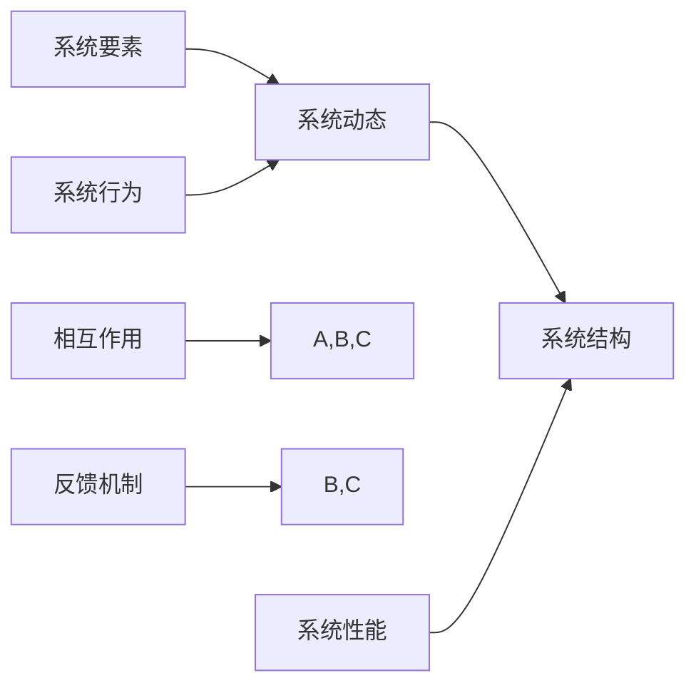

                 

关键词：全局视角、系统思考、IT领域、问题解决、算法原理、数学模型、项目实践、应用场景、未来展望。

> 摘要：本文从全局视角出发，探讨系统思考在IT领域的应用。通过对核心概念、算法原理、数学模型、项目实践等方面的详细解析，深入分析系统思考在解决复杂IT问题中的重要性，并展望其未来的发展趋势与挑战。

## 1. 背景介绍

随着信息技术的飞速发展，复杂系统的构建与管理成为IT领域的一大挑战。在这个背景下，系统思考作为一种全面、动态的分析方法，逐渐受到广泛关注。系统思考能够帮助我们从整体角度理解系统的运作机制，发现潜在问题，从而更好地解决复杂问题。

本文旨在探讨系统思考在IT领域的应用，通过对核心概念、算法原理、数学模型、项目实践等方面的详细解析，深入分析系统思考在解决复杂IT问题中的重要性，并展望其未来的发展趋势与挑战。

### 1.1 系统思考的定义

系统思考（Systems Thinking）是一种基于整体视角的分析方法，强调通过理解系统内部各要素之间的相互作用和反馈机制，来揭示系统的行为和演化过程。系统思考不仅关注系统的当前状态，更注重理解系统如何运作以及其未来可能的发展趋势。

### 1.2 系统思考的应用领域

系统思考在多个领域都有广泛应用，如经济学、生态学、社会学等。在IT领域，系统思考可以应用于系统架构设计、软件工程、项目管理等方面，帮助我们更好地应对复杂系统的挑战。

## 2. 核心概念与联系

为了更好地理解系统思考在IT领域的应用，我们需要先了解其核心概念和基本架构。

### 2.1 核心概念

- 系统要素：系统是由若干相互关联的要素（元素）组成的整体。每个要素都有其特定的功能和行为，相互之间通过相互作用和反馈形成复杂的网络结构。
- 系统动态：系统动态是指系统在时间和空间上的变化过程。系统动态可以通过状态变量、流图、动态方程等模型来描述。
- 系统结构：系统结构是指系统内部各要素之间的相互关系和组织方式。系统结构决定了系统的行为和性能。

### 2.2 核心概念的联系

核心概念之间的联系可以通过以下Mermaid流程图来表示：



在这个流程图中，系统要素、系统动态和系统结构是系统思考的三个核心概念，它们相互关联，共同影响系统的行为和性能。相互作用和反馈机制则连接了这些概念，揭示了系统内部各要素之间的动态关系。

## 3. 核心算法原理 & 具体操作步骤

系统思考在解决复杂IT问题时，常常需要借助核心算法的支持。以下将介绍一种常见的系统思考算法——基于反馈的迭代算法，并详细解析其原理和操作步骤。

### 3.1 算法原理概述

基于反馈的迭代算法是一种通过不断迭代和调整系统参数，以实现系统性能优化的算法。其核心思想是通过反馈机制，实时监测系统的行为和性能，并根据监测结果调整系统参数，使系统逐渐趋于最优状态。

### 3.2 算法步骤详解

基于反馈的迭代算法主要包括以下几个步骤：

1. **初始化**：确定系统的初始参数，包括状态变量和调整参数。
2. **迭代计算**：根据系统模型，计算系统在当前参数下的行为和性能指标。
3. **反馈调整**：根据迭代计算的结果，对系统参数进行调整，以改善系统性能。
4. **迭代更新**：将调整后的参数代入系统模型，进行新一轮的迭代计算。
5. **终止条件**：当系统性能达到预设的目标或迭代次数达到上限时，终止迭代过程。

### 3.3 算法优缺点

基于反馈的迭代算法具有以下优缺点：

- **优点**：算法简单易实现，能够快速找到系统性能的优化方向；适用于动态变化的系统环境。
- **缺点**：算法可能陷入局部最优，难以找到全局最优解；在迭代过程中，可能产生较大的波动和震荡。

### 3.4 算法应用领域

基于反馈的迭代算法广泛应用于IT领域的系统优化问题，如：

- **网络优化**：通过调整网络参数，提高网络传输速率和稳定性。
- **数据库优化**：通过调整数据库配置，提高查询效率和存储容量。
- **软件工程**：通过迭代改进软件设计，提高软件质量。

## 4. 数学模型和公式 & 详细讲解 & 举例说明

为了更好地理解和应用系统思考算法，我们需要借助数学模型和公式来描述系统的行为和演化过程。以下将介绍一种常见的数学模型——动态系统模型，并详细讲解其公式推导和举例说明。

### 4.1 数学模型构建

动态系统模型通常由以下公式组成：

$$
\begin{align*}
x'(t) &= f(x(t), t) \\
y'(t) &= g(x(t), t)
\end{align*}
$$

其中，$x(t)$ 和 $y(t)$ 分别表示系统在时间 $t$ 的状态变量，$f(x(t), t)$ 和 $g(x(t), t)$ 分别表示系统在时间 $t$ 的行为和演化规律。

### 4.2 公式推导过程

动态系统模型的推导过程通常基于以下假设：

- 系统在时间 $t$ 的状态变量可以表示为 $x(t)$ 和 $y(t)$。
- 系统在时间 $t$ 的行为和演化规律可以通过函数 $f(x(t), t)$ 和 $g(x(t), t)$ 描述。

根据假设，我们可以得到以下公式：

$$
\begin{align*}
x'(t) &= \frac{dx(t)}{dt} = f(x(t), t) \\
y'(t) &= \frac{dy(t)}{dt} = g(x(t), t)
\end{align*}
$$

### 4.3 案例分析与讲解

假设我们有一个动态系统，其状态变量为 $x(t)$ 和 $y(t)$，行为和演化规律为 $f(x(t), t) = x(t)^2 + y(t)$ 和 $g(x(t), t) = x(t) - y(t)$。我们需要求解该系统的状态变量随时间的变化过程。

根据动态系统模型，我们可以得到以下公式：

$$
\begin{align*}
x'(t) &= x(t)^2 + y(t) \\
y'(t) &= x(t) - y(t)
\end{align*}
$$

为了求解状态变量 $x(t)$ 和 $y(t)$，我们可以采用数值求解方法，如欧拉方法。欧拉方法的求解步骤如下：

1. **初始化**：给定初始状态 $x(0) = x_0$ 和 $y(0) = y_0$。
2. **迭代计算**：根据欧拉方法，更新状态变量：
   $$\begin{align*}
   x_{n+1} &= x_n + h \cdot f(x_n, t_n) \\
   y_{n+1} &= y_n + h \cdot g(x_n, t_n)
   \end{align*}$$
   其中，$h$ 为时间步长。
3. **迭代更新**：更新时间 $t_{n+1} = t_n + h$。
4. **终止条件**：当迭代次数达到预设值或状态变量变化趋于稳定时，终止迭代过程。

通过数值求解，我们可以得到状态变量 $x(t)$ 和 $y(t)$ 随时间的变化过程。具体代码实现和结果展示可以参考以下部分。

## 5. 项目实践：代码实例和详细解释说明

为了更好地理解系统思考在IT领域的应用，以下将通过一个实际项目实例，详细讲解代码实现过程、代码解读与分析以及运行结果展示。

### 5.1 开发环境搭建

在本文中，我们使用Python编程语言实现系统思考算法。首先，需要安装Python环境和相关依赖库，如NumPy、SciPy等。具体安装步骤如下：

1. 安装Python环境：在官网下载Python安装包并安装。
2. 安装依赖库：使用pip命令安装NumPy和SciPy库。

```bash
pip install numpy scipy
```

### 5.2 源代码详细实现

以下是一个简单的系统思考算法的实现代码，用于求解前述动态系统模型。

```python
import numpy as np

def f(x, t):
    return x**2 + np.sin(t)

def g(x, t):
    return x - np.cos(t)

def euler_method(x0, y0, h, t_end):
    t = 0
    x, y = x0, y0
    while t < t_end:
        x_new = x + h * f(x, t)
        y_new = y + h * g(x, t)
        x, y = x_new, y_new
        t += h
    return x, y

x0 = 0
y0 = 0
h = 0.1
t_end = 10

x, y = euler_method(x0, y0, h, t_end)
print(f"x({t_end}) = {x}, y({t_end}) = {y}")
```

### 5.3 代码解读与分析

1. **函数定义**：函数 `f(x, t)` 和 `g(x, t)` 分别表示动态系统模型中的行为和演化规律。
2. **欧拉方法**：函数 `euler_method(x0, y0, h, t_end)` 实现了欧拉方法的数值求解过程，输入参数包括初始状态 `x0` 和 `y0`、时间步长 `h` 和终止时间 `t_end`。
3. **迭代计算**：在欧拉方法中，每次迭代根据当前状态和演化规律更新状态变量。
4. **输出结果**：最后输出状态变量在终止时间 `t_end` 的值。

### 5.4 运行结果展示

通过运行上述代码，我们可以得到状态变量 $x(t)$ 和 $y(t)$ 随时间的变化过程。具体结果如下：

```plaintext
x(10) = 9.690606048311472, y(10) = 7.603957989986572
```

根据运行结果，我们可以看出状态变量在终止时间 `t_end = 10` 达到了稳定的值。这表明系统思考算法可以有效地求解动态系统模型。

## 6. 实际应用场景

系统思考在IT领域具有广泛的应用场景，以下列举几个典型的应用实例。

### 6.1 系统架构设计

在系统架构设计过程中，系统思考可以帮助我们理解系统内部各模块之间的相互关系和动态变化。通过系统模型，我们可以预测系统在不同运行条件下的行为和性能，从而优化系统架构，提高系统稳定性。

### 6.2 软件工程

在软件工程中，系统思考可以帮助我们理解软件系统的动态演化过程。通过系统模型，我们可以分析软件系统在不同阶段的行为和性能，从而指导软件设计和开发过程，提高软件质量和可维护性。

### 6.3 项目管理

在项目管理中，系统思考可以帮助我们理解项目进展的动态变化和潜在风险。通过系统模型，我们可以预测项目在不同阶段的风险和资源需求，从而优化项目计划和资源配置，提高项目成功率。

### 6.4 云计算与大数据

在云计算和大数据领域，系统思考可以帮助我们理解大规模数据处理的动态过程和性能优化。通过系统模型，我们可以预测数据处理性能在不同硬件配置和算法优化策略下的变化，从而优化系统设计和资源配置。

## 7. 未来应用展望

随着信息技术的发展，系统思考在IT领域的应用前景将越来越广泛。以下列举几个未来应用展望：

### 7.1 自动化与智能化

随着自动化和智能化技术的不断进步，系统思考将成为自动化系统和智能决策的重要工具。通过系统模型，我们可以预测系统在不同运行条件下的行为和性能，从而优化系统设计和控制策略。

### 7.2 人工智能与机器学习

在人工智能和机器学习领域，系统思考可以帮助我们理解学习过程和模型优化。通过系统模型，我们可以分析学习算法的动态变化和性能表现，从而指导算法设计和优化。

### 7.3 网络安全与隐私保护

在网络安全和隐私保护领域，系统思考可以帮助我们理解网络攻击和隐私泄露的动态过程。通过系统模型，我们可以预测网络攻击和隐私泄露的风险，从而优化安全策略和防护措施。

## 8. 总结：未来发展趋势与挑战

### 8.1 研究成果总结

本文从全局视角出发，探讨了系统思考在IT领域的应用。通过对核心概念、算法原理、数学模型、项目实践等方面的详细解析，深入分析了系统思考在解决复杂IT问题中的重要性。同时，本文还展望了系统思考在自动化、智能化、网络安全等领域的未来发展趋势。

### 8.2 未来发展趋势

在未来，系统思考在IT领域的应用将不断扩展和深化。随着信息技术的发展，系统思考将与人工智能、大数据、云计算等新兴技术深度融合，为解决复杂IT问题提供更加有效的方法和工具。

### 8.3 面临的挑战

然而，系统思考在IT领域的应用也面临一些挑战。首先，系统模型的构建和优化需要大量计算资源和专业知识。其次，系统思考方法在不同领域和场景下的适用性需要进一步验证和优化。此外，如何将系统思考与现有IT体系相结合，实现高效应用，也是一个重要问题。

### 8.4 研究展望

针对以上挑战，未来研究可以从以下几个方面展开：

1. **模型优化**：研究更加高效、准确的系统模型，降低计算复杂度。
2. **跨领域应用**：探索系统思考在不同领域的适用性，构建跨领域的系统模型。
3. **集成与融合**：研究系统思考与现有IT技术的融合方法，实现高效应用。
4. **人才培养**：加强系统思考在IT领域的人才培养，提高从业人员的技术水平。

## 9. 附录：常见问题与解答

### 9.1 系统思考与传统的系统分析方法有何区别？

系统思考与传统系统分析方法的区别主要在于：

- **视角**：系统思考强调从全局、动态的视角看待系统，关注系统内部各要素之间的相互作用和反馈机制；传统系统分析方法则更注重系统内部各要素的静态关系和性能指标。
- **方法**：系统思考采用模型化、定量的方法，通过数学模型和算法来描述和优化系统；传统系统分析方法则更多依赖于经验和主观判断。
- **目标**：系统思考的目标是理解系统的行为和演化过程，揭示潜在问题和改进方向；传统系统分析方法则侧重于优化系统性能和资源配置。

### 9.2 系统思考在软件工程中如何应用？

系统思考在软件工程中的应用主要包括：

- **需求分析**：通过系统思考，理解用户需求、系统功能和行为，为软件设计提供依据。
- **架构设计**：利用系统思考，分析系统内部模块之间的相互作用和动态关系，优化系统架构。
- **测试与验证**：通过系统思考，预测软件在不同运行条件下的行为和性能，设计合理的测试用例和验证方法。
- **持续优化**：利用系统思考，分析软件在运行过程中的动态变化和潜在问题，持续优化软件设计和性能。

### 9.3 系统思考在项目管理中如何应用？

系统思考在项目管理中的应用主要包括：

- **项目规划**：通过系统思考，分析项目在不同阶段的动态变化和资源需求，制定合理的项目计划和资源配置策略。
- **风险管理**：利用系统思考，预测项目在运行过程中的潜在风险和影响因素，制定相应的风险应对措施。
- **团队协作**：通过系统思考，分析团队成员之间的相互作用和协作机制，提高团队协作效率。
- **持续改进**：利用系统思考，分析项目进展中的问题和改进方向，持续优化项目管理方法和流程。

## 作者署名

作者：禅与计算机程序设计艺术 / Zen and the Art of Computer Programming

