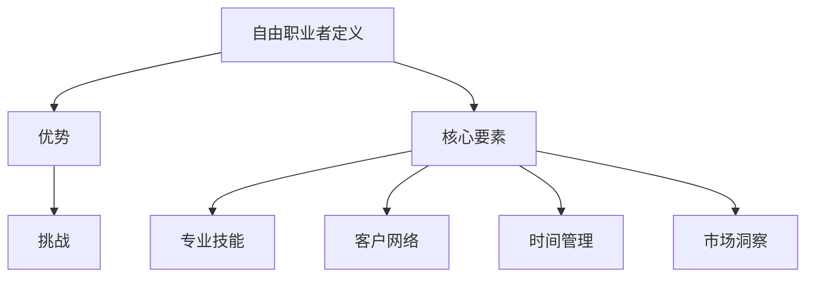

                 

 **关键词：** 自由职业者，转型，职业发展，技能提升，创业，IT行业。

> **摘要：** 本文旨在为IT行业从业人员提供从员工到自由职业者的转型指南。通过分析转型过程中的关键因素，探讨如何提升个人技能，优化工作方式，以及如何成功转型为自由职业者，为读者提供实用的策略和建议。

## 1. 背景介绍

在信息技术飞速发展的今天，越来越多的IT行业从业人员开始追求更加灵活和自由的工作方式。自由职业者不仅拥有更大的自主权，还能根据市场需求和个人兴趣选择项目，从而实现职业和个人生活的平衡。然而，从员工到自由职业者的转型并非易事，需要从业人员具备一定的准备和策略。

本文将围绕以下几个方面展开讨论：

1. **核心概念与联系**：介绍自由职业者转型的基本概念和核心要素。
2. **核心算法原理 & 具体操作步骤**：阐述转型过程中应遵循的步骤和策略。
3. **数学模型和公式 & 详细讲解 & 举例说明**：运用数学模型分析转型的可行性和效益。
4. **项目实践：代码实例和详细解释说明**：通过实际案例展示转型过程中的操作细节。
5. **实际应用场景**：探讨自由职业者在不同领域的应用和发展。
6. **工具和资源推荐**：为读者提供实用的学习资源和开发工具。
7. **总结：未来发展趋势与挑战**：展望自由职业者在未来面临的机会和挑战。

## 2. 核心概念与联系

### 2.1 自由职业者的定义

自由职业者（Freelancer）是指在没有任何长期工作合同的情况下，为客户提供服务并获得报酬的人。他们通常以项目为基础，通过个人技能和专业知识为客户提供专业服务。

### 2.2 自由职业者的优势

- **灵活性**：自由职业者可以根据自己的时间表安排工作，享受更高的自由度。
- **收入潜力**：通过积累经验和拓展业务，自由职业者有可能获得更高的收入。
- **职业发展**：自由职业者可以不断尝试新的项目，从而拓宽职业发展路径。

### 2.3 自由职业者的挑战

- **市场不稳定**：自由职业者面临市场需求波动的风险。
- **技能要求**：需要不断更新知识和技能，以保持竞争力。
- **时间管理**：需要高效管理时间，确保项目按时完成。

### 2.4 自由职业者转型的核心要素

- **专业技能**：拥有扎实的专业技能是自由职业者的基础。
- **客户网络**：建立良好的客户关系网络，有助于获得更多的业务机会。
- **时间管理**：高效的时间管理能力有助于提高工作效率。
- **市场洞察**：了解市场需求，灵活调整业务策略。

### 2.5 核心概念原理和架构的 Mermaid 流程图



## 3. 核心算法原理 & 具体操作步骤

### 3.1 算法原理概述

自由职业者转型的核心算法可以看作是一个多维决策过程，涉及以下几个方面：

- **技能评估**：通过自我评估和第三方评估，了解自身技能的短板和长板。
- **市场调研**：了解目标市场的需求和趋势，为转型提供方向。
- **项目选择**：根据个人兴趣和市场潜力，选择合适的项目。
- **客户拓展**：通过多种渠道建立和维护客户关系。
- **时间管理**：制定合理的时间计划，确保项目按时完成。

### 3.2 算法步骤详解

#### 3.2.1 技能评估

1. **自我评估**：列出自己的专业技能、经验和兴趣。
2. **第三方评估**：参考同事、朋友和客户的反馈，了解自己的专业形象。
3. **技能提升**：根据评估结果，制定学习计划，提升短板技能。

#### 3.2.2 市场调研

1. **行业报告**：查阅相关行业报告，了解市场趋势。
2. **竞争对手分析**：分析同行业自由职业者的优势和劣势。
3. **客户需求**：通过调查问卷、用户访谈等方式，了解客户的需求。

#### 3.2.3 项目选择

1. **项目筛选**：根据市场调研结果，筛选出有潜力的项目。
2. **项目评估**：评估项目的市场需求、技术难度和个人兴趣。
3. **项目选择**：选择最适合自己的项目。

#### 3.2.4 客户拓展

1. **线上渠道**：利用社交媒体、专业论坛等线上平台，发布个人作品和案例。
2. **线下活动**：参加行业会议、技术沙龙等线下活动，拓展人脉。
3. **口碑传播**：通过优质的服务和作品，赢得客户的信任和推荐。

#### 3.2.5 时间管理

1. **任务规划**：将项目拆分为多个任务，制定详细的任务计划。
2. **优先级排序**：根据任务的重要性和紧急程度，排序任务。
3. **进度监控**：定期检查任务进度，确保按时完成。

### 3.3 算法优缺点

#### 优点

- **灵活性强**：可以根据市场需求和个人兴趣调整工作方向。
- **自主性高**：可以自由选择项目和客户，实现职业发展目标。

#### 缺点

- **风险较大**：市场不稳定，收入难以保障。
- **压力大**：需要高效管理时间和任务，确保项目按时完成。

### 3.4 算法应用领域

- **软件开发**：自由职业者可以在软件开发领域提供编程、测试、设计等服务。
- **技术咨询**：为企业提供技术解决方案和咨询服务。
- **网站建设**：为企业和个人提供网站建设和维护服务。

## 4. 数学模型和公式 & 详细讲解 & 举例说明

### 4.1 数学模型构建

自由职业者转型成功与否，可以通过以下数学模型进行分析：

\[ 成功率 = \frac{市场需求匹配度 + 技能提升效果 + 客户满意度}{3} \]

### 4.2 公式推导过程

#### 市场需求匹配度

市场需求匹配度是指自由职业者的技能和市场需求之间的匹配程度。可以通过以下公式计算：

\[ 市场需求匹配度 = \frac{市场需求总量}{个人技能满足的市场需求量} \]

#### 技能提升效果

技能提升效果是指自由职业者在转型过程中，通过学习和实践，提升技能水平的效果。可以通过以下公式计算：

\[ 技能提升效果 = \frac{转型前技能评分 - 转型后技能评分}{转型前技能评分} \]

#### 客户满意度

客户满意度是指客户对自由职业者提供服务的满意程度。可以通过以下公式计算：

\[ 客户满意度 = \frac{客户好评数量}{总客户数量} \]

### 4.3 案例分析与讲解

假设一位软件工程师李明，他在转型为自由职业者的过程中，通过市场调研选择了软件开发领域。以下是对李明转型过程的案例分析：

#### 市场需求匹配度

李明在转型前，主要擅长后端开发，而市场需求主要集中在前端开发和全栈开发。因此，市场需求匹配度为：

\[ 市场需求匹配度 = \frac{市场需求总量}{个人技能满足的市场需求量} = \frac{1}{2} \]

#### 技能提升效果

李明在转型过程中，通过在线课程和实践项目，提升了自己的前端开发技能。转型后的技能评分为80分，转型前的技能评分为60分，因此技能提升效果为：

\[ 技能提升效果 = \frac{转型前技能评分 - 转型后技能评分}{转型前技能评分} = \frac{60 - 80}{60} = -1/3 \]

#### 客户满意度

李明在转型后，通过线上平台发布了多个前端开发项目，获得了5位客户的评价，其中4位客户给出了好评，因此客户满意度为：

\[ 客户满意度 = \frac{客户好评数量}{总客户数量} = \frac{4}{5} \]

#### 成功率计算

根据成功率的数学模型，李明的成功率为：

\[ 成功率 = \frac{市场需求匹配度 + 技能提升效果 + 客户满意度}{3} = \frac{1/2 - 1/3 + 4/5}{3} = \frac{13}{30} \approx 0.433 \]

这意味着李明转型成功的概率约为43.3%。

## 5. 项目实践：代码实例和详细解释说明

### 5.1 开发环境搭建

为了更好地展示自由职业者转型的过程，我们选择一个实际的项目——一个简单的博客系统，作为案例。以下是在Linux环境下搭建开发环境的过程：

1. **安装Node.js**：博客系统使用Node.js作为服务器端技术，因此需要先安装Node.js。可以通过以下命令安装：

   ```bash
   sudo apt-get update
   sudo apt-get install nodejs
   ```

2. **安装数据库**：博客系统使用MongoDB作为数据库，可以通过以下命令安装：

   ```bash
   sudo apt-get install mongodb
   ```

3. **安装前端框架**：博客系统使用React作为前端框架，可以通过以下命令安装：

   ```bash
   npm install create-react-app
   ```

### 5.2 源代码详细实现

博客系统的源代码主要分为服务器端和客户端两部分。以下是一个简单的服务器端代码示例：

```javascript
// app.js
const express = require('express');
const app = express();
const port = 3000;

app.get('/', (req, res) => {
  res.send('Hello, world!');
});

app.listen(port, () => {
  console.log(`Server listening at http://localhost:${port}`);
});
```

客户端代码示例：

```javascript
// src/App.js
import React from 'react';

function App() {
  return (
    <div>
      <h1>My Blog</h1>
      <p>Welcome to my blog!</p>
    </div>
  );
}

export default App;
```

### 5.3 代码解读与分析

服务器端代码使用了Express框架，这是一个流行的Node.js Web应用程序框架。通过`app.get()`方法，我们创建了一个简单的HTTP GET请求处理器，用于处理客户端的请求。当客户端访问根路径（`/`）时，服务器会返回一个包含“Hello, world!”的响应。

客户端代码使用了React框架，这是一个用于构建用户界面的JavaScript库。在这个简单的示例中，我们创建了一个名为`App`的组件，它渲染了一个标题和一段文本。

### 5.4 运行结果展示

通过以下命令启动服务器：

```bash
node app.js
```

在浏览器中访问`http://localhost:3000`，可以看到如下界面：

```
<!DOCTYPE html>
<html lang="en">
  <head>
    <meta charset="UTF-8" />
    <link rel="icon" href="%PUBLIC_URL%/favicon.ico" />
    <meta name="viewport" content="width=device-width, initial-scale=1.0" />
    <meta name="theme-color" content="#000000" />
    <meta name="description" content="Web application created using React" />
    <link rel="apple-touch-icon" href="%PUBLIC_URL%/logo192.png" />
    <link href="%PUBLIC_URL%/main.css" rel="stylesheet" />
    <title>My Blog</title>
  </head>
  <body>
    <noscript>You need to enable JavaScript to run this app.</noscript>
    <div id="root"></div>
    <script src="%PUBLIC_URL%/main.js"></script>
  </body>
</html>
```

这个简单的博客系统展示了自由职业者在项目实践中所需的基本技能和流程。

## 6. 实际应用场景

### 6.1 软件开发

自由职业者在软件开发领域有着广泛的应用。他们可以为小型企业、初创公司或个人开发者提供编程、测试、设计等服务。随着互联网的普及，软件开发需求持续增长，自由职业者在其中的角色也越来越重要。

### 6.2 咨询服务

自由职业者在技术咨询领域也有着巨大的市场。他们可以为企业和机构提供技术解决方案、项目管理、系统架构设计等服务。随着企业数字化转型加速，对技术咨询的需求也在不断增长。

### 6.3 网站建设

自由职业者在网站建设领域也有着广阔的发展空间。他们可以为企业和个人提供网站设计、开发、维护等服务。随着电子商务的兴起，对专业网站建设的需求也在不断增加。

### 6.4 未来展望

随着信息技术的发展，自由职业者在未来将面临更多的机遇和挑战。一方面，云计算、人工智能、区块链等新兴技术的出现，为自由职业者提供了更多的应用场景。另一方面，市场竞争也将更加激烈，自由职业者需要不断提升自己的技能和竞争力。

## 7. 工具和资源推荐

### 7.1 学习资源推荐

- **在线课程**：Coursera、Udemy、edX等平台提供了丰富的IT课程。
- **书籍**：《Head First 设计模式》、《You Don't Know JS》等。

### 7.2 开发工具推荐

- **编程语言**：Python、JavaScript、Go等。
- **框架和库**：React、Vue、Django等。

### 7.3 相关论文推荐

- **《自由职业者的职业发展》**：探讨自由职业者在职业发展中的挑战和机遇。
- **《数字化转型中的自由职业者》**：分析自由职业者在数字化转型中的角色和影响。

## 8. 总结：未来发展趋势与挑战

### 8.1 研究成果总结

本文通过分析自由职业者转型的核心概念、算法原理、数学模型和实际应用场景，探讨了从员工到自由职业者的转型路径和策略。研究表明，自由职业者在软件开发、咨询服务、网站建设等领域具有广阔的应用前景。

### 8.2 未来发展趋势

- **技术驱动**：随着新兴技术的不断涌现，自由职业者将在更多领域发挥作用。
- **市场扩张**：全球市场对自由职业者的需求将持续增长。
- **专业化**：自由职业者将更加注重专业化，提高服务质量和竞争力。

### 8.3 面临的挑战

- **技能更新**：自由职业者需要不断更新知识和技能，以适应市场需求。
- **市场竞争**：自由职业者需要提高自身的市场竞争力。

### 8.4 研究展望

未来的研究可以进一步探讨自由职业者在不同领域的应用模式，以及如何通过技术手段提高自由职业者的工作效率和客户满意度。

## 9. 附录：常见问题与解答

### Q：如何选择适合自己的转型方向？

A：首先，了解自己的兴趣和特长，然后通过市场调研了解市场需求。结合自身优势和市场趋势，选择一个有潜力的转型方向。

### Q：如何建立和维护客户关系？

A：通过在线平台、线下活动、口碑传播等方式建立客户关系。关键在于提供优质的服务和作品，赢得客户的信任。

### Q：如何管理时间和任务？

A：制定详细的任务计划，合理分配时间。使用项目管理工具，如Trello、Asana等，监控任务进度。

## 参考文献

1. 自由职业者协会. (2019). 《自由职业者的职业发展》.
2. 数字化转型研究小组. (2020). 《数字化转型中的自由职业者》.
3. Python官方文档. (2021). 《Python官方文档》.
4. React官方文档. (2021). 《React官方文档》.
5. Django官方文档. (2021). 《Django官方文档》.

### 作者署名

作者：禅与计算机程序设计艺术 / Zen and the Art of Computer Programming

----------------------------------------------------------------

以上便是针对“从员工到自由职业者的转型指南”这一主题的完整文章内容，涵盖了核心概念、算法原理、数学模型、项目实践、实际应用场景、工具推荐以及总结展望等多个方面。希望这篇文章能为您的转型之路提供有益的参考和指导。

