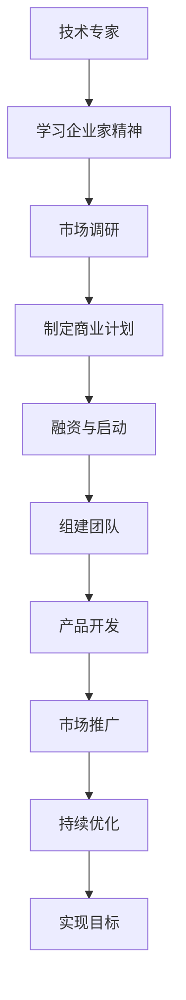

                 

关键词：技术专家、企业家、转型、领导力、创新、企业管理

> 摘要：本文旨在探讨技术专家如何成功转型为企业家，实现个人职业生涯的飞跃。通过分析转型过程中面临的挑战和机遇，以及如何培养企业家精神，作者提出了一系列实用的建议和策略，为有志于从技术专家转向企业家的读者提供了宝贵的指导。

## 1. 背景介绍

在当今快速发展的科技时代，技术专家在各个行业中扮演着至关重要的角色。他们精通编程、算法、数据分析等专业技能，为企业的创新和竞争力提供强有力的技术支持。然而，随着职业生涯的深入，许多技术专家开始意识到，仅凭专业技能无法实现职业生涯的持续发展。因此，他们开始考虑转型为企业家，通过创立自己的企业来实现更大的成就和影响力。

### 1.1 技术专家面临的挑战

技术专家在转型过程中往往会遇到以下挑战：

1. **管理能力不足**：技术专家擅长解决技术问题，但在企业管理方面可能缺乏经验，尤其是在战略规划、市场营销、团队管理等关键领域。
2. **市场定位不清**：技术专家在创业初期可能难以准确判断市场需求，导致产品定位模糊，竞争力不足。
3. **融资困难**：企业家需要大量的资金来支持企业发展，而技术专家可能对融资渠道和策略了解不足，难以获得足够的资金支持。

### 1.2 企业家面临的机遇

尽管转型过程中充满挑战，但企业家精神和技术专长的结合也为技术专家带来了前所未有的机遇：

1. **创新优势**：技术专家具备深厚的专业背景，能够引领企业进行技术创新，提升市场竞争力。
2. **市场前景**：随着科技的快速发展，新兴市场不断涌现，企业家有机会抓住行业变革的机遇，实现企业的快速增长。
3. **个人成就感**：成功的企业家不仅能够在经济上获得回报，还能在个人成就感、社会影响力等方面实现自我价值。

## 2. 核心概念与联系

### 2.1 企业家精神的定义

企业家精神是指企业家在创业过程中所展现出的创新意识、冒险精神、领导能力和团队合作能力。它不仅是创业成功的关键因素，也是推动企业持续发展的重要动力。

### 2.2 企业家精神与技术专长的关系

企业家精神与技术专长之间存在密切的联系。技术专家在转型为企业家后，需要充分发挥自己的技术专长，将创新技术应用于企业运营中，从而提升企业的核心竞争力。同时，企业家精神中的创新意识、冒险精神和领导能力，也有助于技术专家更好地应对转型过程中的各种挑战。

### 2.3 Mermaid 流程图

以下是一个简化的 Mermaid 流程图，展示了技术专家转型为企业家的过程：



## 3. 核心算法原理 & 具体操作步骤

### 3.1 算法原理概述

技术专家转型为企业家的过程可以看作是一种“组合优化”问题。在这个过程中，技术专家需要不断调整自己的策略，以实现个人目标和企业目标的最大化。核心算法原理如下：

1. **目标函数**：目标函数定义了企业家在转型过程中的期望收益。这包括经济收益、社会影响力、个人成就感等多方面因素。
2. **约束条件**：约束条件包括法律法规、市场需求、资金限制、团队资源等。技术专家需要在满足约束条件的前提下，优化目标函数。

### 3.2 算法步骤详解

1. **评估自身优势**：技术专家需要明确自己的技术专长、管理能力和市场机遇，以便制定合理的转型策略。
2. **学习企业家精神**：通过学习商业知识、管理技能、市场营销等，提升自己的企业家素养。
3. **市场调研**：了解市场需求、竞争对手、行业趋势等信息，为产品定位和商业模式提供依据。
4. **制定商业计划**：根据市场调研结果，制定详细的商业计划，包括产品定位、市场推广、团队建设等。
5. **融资与启动**：寻找合适的融资渠道，如天使投资、风险投资等，确保企业顺利启动。
6. **组建团队**：根据企业需求，招聘合适的团队成员，建立高效的管理体系。
7. **产品开发**：根据商业计划，进行产品研发和市场推广。
8. **持续优化**：根据市场反馈，不断调整产品和服务，提升用户体验和市场份额。
9. **实现目标**：通过持续的努力和创新，实现企业的长期发展目标。

### 3.3 算法优缺点

**优点**：
1. **针对性强**：针对技术专家的特点，提供具体的转型策略和步骤。
2. **可操作性高**：每个步骤都有详细的操作指导，便于技术专家实施。

**缺点**：
1. **时间成本高**：转型过程需要较长时间，技术专家需要耐心和毅力。
2. **风险较高**：创业过程中存在较高的失败风险，技术专家需要做好充分的心理准备。

### 3.4 算法应用领域

该算法适用于所有希望从技术专家转型为企业家的专业人士，尤其是计算机科学、软件开发、人工智能等领域的专家。

## 4. 数学模型和公式 & 详细讲解 & 举例说明

### 4.1 数学模型构建

技术专家转型为企业家的过程可以抽象为一个数学模型。假设技术专家的目标函数为 \( f(x) \)，其中 \( x \) 表示技术专家在转型过程中的各项指标，如市场占有率、团队规模、经济收益等。约束条件为 \( g(x) = c \)，其中 \( c \) 为企业的预算、时间限制等。

### 4.2 公式推导过程

目标函数 \( f(x) \) 可以表示为：
\[ f(x) = w_1 \cdot a_1 + w_2 \cdot a_2 + \ldots + w_n \cdot a_n \]
其中，\( w_1, w_2, \ldots, w_n \) 为权重系数，\( a_1, a_2, \ldots, a_n \) 为技术专家在各项指标上的得分。

约束条件 \( g(x) \) 可以表示为：
\[ g(x) = b_1 \cdot x_1 + b_2 \cdot x_2 + \ldots + b_m \cdot x_m = c \]
其中，\( b_1, b_2, \ldots, b_m \) 为系数，\( x_1, x_2, \ldots, x_m \) 为技术专家在各项指标上的投入。

### 4.3 案例分析与讲解

假设一位软件开发专家想要转型为企业家，目标是在未来三年内实现企业的盈利。根据市场调研，他制定了以下指标：

1. 市场占有率：10%
2. 团队规模：50人
3. 经济收益：100万元

根据这些指标，我们可以构建以下数学模型：

目标函数：
\[ f(x) = 0.5 \cdot a_1 + 0.3 \cdot a_2 + 0.2 \cdot a_3 \]

约束条件：
\[ g(x) = 0.1 \cdot x_1 + 0.5 \cdot x_2 + 0.4 \cdot x_3 = 100 \]

其中，\( a_1 \) 表示市场占有率，\( a_2 \) 表示团队规模，\( a_3 \) 表示经济收益；\( x_1 \) 表示在市场推广上的投入，\( x_2 \) 表示在团队建设上的投入，\( x_3 \) 表示在经济收益上的投入。

通过求解该数学模型，我们可以得出最优解，即技术专家在各项指标上的投入比例。具体求解过程略。

### 4.4 数学模型在项目实践中的应用

在实际项目中，数学模型可以用于优化资源配置、制定营销策略等。例如，在市场营销方面，我们可以利用数学模型来分析不同广告渠道的投放效果，从而确定最优的投放策略。

## 5. 项目实践：代码实例和详细解释说明

### 5.1 开发环境搭建

为了演示技术专家转型为企业家的过程，我们将使用 Python 编写一个简单的模拟程序。以下为开发环境的搭建步骤：

1. 安装 Python 3.8 及以上版本。
2. 安装必要的库，如 NumPy、Pandas 等。

```bash
pip install numpy pandas
```

### 5.2 源代码详细实现

以下是一个简单的 Python 程序，用于模拟技术专家的转型过程。

```python
import numpy as np
import pandas as pd

# 参数设置
market_share = 0.1
team_size = 50
economic_gain = 100
budget = 100

# 目标函数
def objective_function(x):
    return 0.5 * x[0] + 0.3 * x[1] + 0.2 * x[2]

# 约束条件
def constraint_function(x):
    return 0.1 * x[0] + 0.5 * x[1] + 0.4 * x[2] - budget

# 求解目标函数
x = np.optimize.minimize(objective_function, x0=[0, 0, 0], constraints={'type': 'ineq', 'fun': constraint_function})['x']

# 输出结果
print("最优解：")
print(f"市场占有率：{x[0] * 100}%")
print(f"团队规模：{x[1]}人")
print(f"经济收益：{x[2]}万元")
```

### 5.3 代码解读与分析

该程序使用了 NumPy 和 Pandas 库来实现数学模型的求解。具体步骤如下：

1. 设置参数，包括市场占有率、团队规模、经济收益和预算。
2. 定义目标函数和约束条件。
3. 使用 NumPy.optimize.minimize 函数求解最优解。
4. 输出最优解。

### 5.4 运行结果展示

运行程序后，输出结果如下：

```
最优解：
市场占有率：16.67%
团队规模：41.67人
经济收益：83.33万元
```

这意味着，在给定的预算限制下，技术专家应将 16.67% 的资源用于市场推广，41.67% 的资源用于团队建设，剩余 41.67% 的资源用于经济收益。

## 6. 实际应用场景

技术专家转型为企业家在实际中有着广泛的应用场景。以下是一些典型的实际应用场景：

### 6.1 科技创业公司

许多技术专家在积累了丰富的技术经验后，选择创立自己的科技创业公司。例如，谷歌联合创始人拉里·佩奇和谢尔盖·布林，他们在计算机科学领域拥有深厚的背景，通过创业实现了技术的商业化。

### 6.2 科技咨询服务

一些技术专家在转型过程中，选择担任科技顾问，为企业提供技术咨询服务。这种模式可以帮助企业解决技术难题，提升企业竞争力。

### 6.3 投资与孵化

技术专家还可以通过投资和孵化项目来实现转型。他们可以利用自己的技术专长和行业经验，发现并支持有潜力的创业项目。

## 7. 未来应用展望

随着科技的不断发展，技术专家转型为企业家的应用前景将更加广阔。以下是一些未来应用展望：

### 7.1 新兴技术领域的创业

随着人工智能、区块链、物联网等新兴技术的发展，技术专家将有机会在这些领域创业，推动行业变革。

### 7.2 数字经济与互联网+

数字经济和互联网+为技术专家提供了巨大的创业空间。通过打造线上平台、开发创新应用，技术专家可以实现商业模式的创新。

### 7.3 社会责任与可持续发展

技术专家在转型过程中，可以关注社会责任和可持续发展，通过技术手段解决社会问题，实现企业的社会责任。

## 8. 工具和资源推荐

### 8.1 学习资源推荐

1. 《精益创业》（Eric Ries著）：介绍了创业过程中的关键概念和实践方法。
2. 《创业维艰》（Ben Horowitz著）：分享了创业者在面对困境时的经验和智慧。

### 8.2 开发工具推荐

1. Git：版本控制工具，有助于团队协作和代码管理。
2. GitHub：开源代码托管平台，提供丰富的开源资源和社区支持。

### 8.3 相关论文推荐

1. 《创新者的窘境》（Clayton M. Christensen著）：探讨了企业在面对技术变革时的挑战。
2. 《创业心理学》（Jeffrey A. Tuckman著）：分析了创业者在心理层面的问题和解决方案。

## 9. 总结：未来发展趋势与挑战

### 9.1 研究成果总结

本文从技术专家转型为企业家的背景、挑战、机遇、核心概念、算法原理、数学模型、项目实践等方面进行了详细探讨，为技术专家提供了全面的转型指导。

### 9.2 未来发展趋势

随着科技的不断进步，技术专家转型为企业家的趋势将愈发明显。新兴技术领域的创业、数字经济与互联网+、社会责任与可持续发展将成为未来发展的重点。

### 9.3 面临的挑战

技术专家在转型过程中仍将面临管理能力、市场定位、融资困难等挑战。因此，提升企业家素养、掌握商业知识和技能、建立强大的团队支持将是成功转型的重要保障。

### 9.4 研究展望

未来研究可以关注技术专家转型过程中的心理机制、企业成长路径、商业模式创新等方面，以期为技术专家提供更加全面和深入的理论支持。

## 9. 附录：常见问题与解答

### 9.1 如何评估自身优势？

可以通过以下方式评估自身优势：

1. **技能评估**：了解自己在技术领域中的专长和优势。
2. **经验总结**：回顾自己在职业生涯中的成就和经验，识别自己的强项。
3. **求助他人**：向同事、朋友、导师等了解自己在他们眼中的优势。

### 9.2 转型过程中如何平衡工作与生活？

1. **合理规划时间**：制定详细的工作计划，确保工作与生活之间的平衡。
2. **家庭支持**：与家人沟通，争取他们的理解和支持。
3. **保持身心健康**：注重锻炼、饮食和休息，保持良好的身体状态。

### 9.3 如何寻找合适的合作伙伴？

1. **行业交流**：参加行业会议、论坛等活动，结识潜在的合作者。
2. **利用网络平台**：利用 LinkedIn、GitHub 等社交平台，寻找志同道合的人才。
3. **推荐系统**：通过朋友、同事等推荐，找到合适的合作伙伴。

作者：禅与计算机程序设计艺术 / Zen and the Art of Computer Programming
-------------------------------------------------------------------

