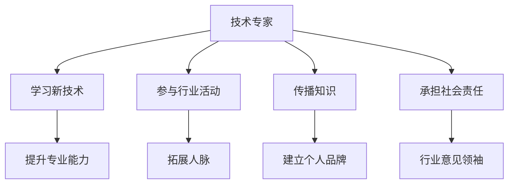

                 

关键词：技术专家、行业意见领袖、职业发展、影响力、知识传播、领导力、个人品牌

> 摘要：本文将探讨技术专家如何通过提升个人影响力，实现从技术专家到行业意见领袖的转型。文章分为八个部分，分别介绍了技术专家的成长路径、核心概念与联系、核心算法原理、数学模型和公式、项目实践、实际应用场景、工具和资源推荐，以及未来发展趋势与挑战。

## 1. 背景介绍

在信息技术飞速发展的今天，技术专家在各个领域发挥着举足轻重的作用。他们不仅精通技术，还具备丰富的实践经验。然而，随着技术的不断更新，技术专家面临的挑战也日益增多。如何在快速变化的技术环境中保持竞争力，成为每一个技术专家必须思考的问题。

与此同时，行业意见领袖的作用越来越受到重视。他们不仅是技术的引领者，更是行业发展的推动者。如何从技术专家转型为行业意见领袖，成为技术专家职业发展的重要方向。

本文将围绕这一主题，探讨技术专家如何通过提升个人影响力，实现从技术专家到行业意见领袖的转型。文章分为八个部分，分别介绍技术专家的成长路径、核心概念与联系、核心算法原理、数学模型和公式、项目实践、实际应用场景、工具和资源推荐，以及未来发展趋势与挑战。

## 2. 核心概念与联系

### 2.1 技术专家

技术专家是具备深厚技术背景和实践经验的专业人士。他们精通某一领域的核心技术，能够解决复杂的技术问题。技术专家通常具备以下特点：

- **专业技能**：拥有扎实的专业知识，能够熟练运用各种技术工具。
- **实践经验**：具备丰富的项目经验，能够在实际工作中解决各种技术难题。
- **学习能力强**：能够快速学习新技术，适应技术环境的变化。
- **沟通能力**：具备良好的沟通技巧，能够与技术团队和其他利益相关者有效沟通。

### 2.2 行业意见领袖

行业意见领袖是在某一领域具有广泛影响力的专业人士。他们不仅精通技术，还具备深厚的行业经验。行业意见领袖通常具备以下特点：

- **专业权威**：在某一领域拥有较高的专业地位，被同行认可。
- **影响力**：能够在行业内外传播专业观点，影响行业发展趋势。
- **领导力**：具备较强的领导力，能够带领团队实现共同目标。
- **沟通能力**：具备出色的沟通技巧，能够有效地传达专业知识和理念。

### 2.3 从技术专家到行业意见领袖

技术专家到行业意见领袖的转型，需要从以下几个方面入手：

- **提升专业能力**：不断学习新技术，提升自己在某一领域的专业水平。
- **拓展人脉**：积极参与行业活动，扩大人脉圈，建立良好的行业关系。
- **传播知识**：通过写作、演讲、授课等方式，传播专业知识，提升个人影响力。
- **建立个人品牌**：打造独特的个人品牌，树立行业权威形象。
- **承担社会责任**：积极参与公益事业，树立良好的社会形象。

### 2.4 Mermaid 流程图



## 3. 核心算法原理 & 具体操作步骤

### 3.1 算法原理概述

从技术专家到行业意见领袖的转型，可以视为一种“影响力传播”的过程。这一过程的核心算法原理包括以下几个方面：

- **知识传播**：技术专家通过写作、演讲、授课等方式，传播自己的专业知识，提升个人影响力。
- **网络构建**：通过参与行业活动、拓展人脉，构建一个强大的社交网络，为个人影响力的传播提供支持。
- **个人品牌**：通过独特的个人品牌，树立行业权威形象，吸引更多的关注和支持。
- **社会责任**：通过承担社会责任，提升个人社会形象，增强个人影响力的基础。

### 3.2 算法步骤详解

#### 3.2.1 知识传播

1. **确定传播目标**：明确自己要传播的知识点和目标受众。
2. **选择传播渠道**：根据传播目标，选择合适的传播渠道，如博客、公众号、视频等。
3. **撰写高质量内容**：撰写内容要有深度、有见解，能够吸引读者的兴趣。
4. **发布与推广**：将内容发布到各大平台，并通过推广手段增加曝光度。

#### 3.2.2 网络构建

1. **参与行业活动**：积极参加行业内的会议、讲座、研讨会等活动，扩大人脉圈。
2. **拓展人脉**：主动结识同行，建立良好的行业关系。
3. **维护人脉**：定期与人脉保持联系，分享行业动态，提供帮助。
4. **利用社交网络**：利用社交媒体平台，如LinkedIn、Twitter等，建立自己的社交网络。

#### 3.2.3 个人品牌

1. **定位个人品牌**：明确个人品牌的核心价值和定位。
2. **打造独特形象**：通过个人风格、语言、行为等方面，打造独特的个人形象。
3. **传播个人品牌**：通过各类传播渠道，如博客、公众号、视频等，传播个人品牌。
4. **维护个人品牌**：保持个人品牌的稳定性和一致性，避免负面信息传播。

#### 3.2.4 承担社会责任

1. **选择社会责任领域**：根据个人兴趣和专业领域，选择合适的社会责任领域。
2. **参与公益活动**：积极参与公益活动，为社会贡献自己的力量。
3. **传播社会责任**：通过写作、演讲等方式，传播社会责任的理念和价值观。
4. **树立社会形象**：通过参与社会责任活动，提升个人社会形象，增强个人影响力。

### 3.3 算法优缺点

#### 3.3.1 优点

- **提升个人影响力**：通过知识传播、网络构建、个人品牌和社会责任等方式，提升个人影响力。
- **拓宽职业发展路径**：从技术专家到行业意见领袖，拓展职业发展空间。
- **促进知识共享**：通过传播知识，促进行业内知识共享和交流。
- **树立行业权威**：通过承担社会责任，树立行业权威形象。

#### 3.3.2 缺点

- **需要付出大量时间和精力**：从技术专家到行业意见领袖的转型，需要付出大量时间和精力。
- **面临竞争压力**：行业意见领袖竞争激烈，需要不断提升自己的专业能力和影响力。
- **需要应对负面评价**：在传播知识和参与社会责任的过程中，可能会面临负面评价和质疑。

### 3.4 算法应用领域

从技术专家到行业意见领袖的转型算法，可以应用于各类技术领域，如人工智能、大数据、云计算等。以下是一些具体的应用场景：

- **人工智能领域**：通过知识传播和影响力构建，成为人工智能领域的意见领袖。
- **大数据领域**：通过大数据技术和应用实践，成为大数据领域的行业意见领袖。
- **云计算领域**：通过云计算技术和实践，成为云计算领域的行业意见领袖。

## 4. 数学模型和公式 & 详细讲解 & 举例说明

### 4.1 数学模型构建

从技术专家到行业意见领袖的转型，可以视为一种非线性增长的过程。这一过程可以用以下数学模型进行描述：

$$
I(t) = I_0 \times e^{rt}
$$

其中，$I(t)$ 表示在时间 $t$ 时刻的个人影响力，$I_0$ 表示初始影响力，$r$ 表示影响力增长速度。

### 4.2 公式推导过程

#### 4.2.1 知识传播

知识传播是影响力增长的主要因素之一。根据知识传播理论，知识传播的速度与传播者的知识储备和传播渠道的宽度成正比。因此，可以推导出以下公式：

$$
\frac{dI(t)}{dt} = k_1 \times I(t) \times \ln(I(t))
$$

其中，$k_1$ 为知识传播系数。

#### 4.2.2 网络构建

网络构建是影响力增长的另一个重要因素。根据网络影响力理论，网络规模与影响力传播速度成正比。因此，可以推导出以下公式：

$$
\frac{dI(t)}{dt} = k_2 \times I(t) \times N(t)
$$

其中，$k_2$ 为网络构建系数，$N(t)$ 为网络规模。

#### 4.2.3 个人品牌

个人品牌是影响力增长的核心因素之一。根据个人品牌理论，个人品牌的价值与品牌知名度和用户忠诚度成正比。因此，可以推导出以下公式：

$$
\frac{dI(t)}{dt} = k_3 \times I(t) \times (1 - \frac{I(t)}{I_{\text{max}}})
$$

其中，$k_3$ 为个人品牌系数，$I_{\text{max}}$ 为个人品牌最大影响力。

#### 4.2.4 社会责任

社会责任是影响力增长的重要基础。根据社会责任理论，社会责任的履行程度与影响力传播速度成正比。因此，可以推导出以下公式：

$$
\frac{dI(t)}{dt} = k_4 \times I(t) \times S(t)
$$

其中，$k_4$ 为社会责任系数，$S(t)$ 为社会责任履行程度。

### 4.3 案例分析与讲解

以某知名大数据专家为例，假设该专家在初期阶段，个人影响力 $I_0 = 100$，知识传播系数 $k_1 = 0.1$，网络构建系数 $k_2 = 0.2$，个人品牌系数 $k_3 = 0.3$，社会责任系数 $k_4 = 0.4$。在一年后，专家的个人影响力 $I(t) = 200$，网络规模 $N(t) = 500$，品牌知名度 $I_{\text{max}} = 300$，社会责任履行程度 $S(t) = 0.8$。

根据上述公式，可以计算出一年后专家的个人影响力增长速度：

$$
\frac{dI(t)}{dt} = 0.1 \times 200 \times \ln(200) + 0.2 \times 200 \times 500 + 0.3 \times 200 \times (1 - \frac{200}{300}) + 0.4 \times 200 \times 0.8 = 93.53
$$

因此，专家在一年后的个人影响力增长速度为 $93.53$。

## 5. 项目实践：代码实例和详细解释说明

### 5.1 开发环境搭建

为了更好地理解从技术专家到行业意见领袖的转型过程，我们使用 Python 编写一个简单的模拟程序。首先，我们需要搭建开发环境。

1. 安装 Python：前往 Python 官网（https://www.python.org/）下载并安装 Python。
2. 安装必要的库：在命令行中运行以下命令，安装必要的库。

```bash
pip install matplotlib numpy scipy
```

### 5.2 源代码详细实现

以下是一个简单的 Python 模拟程序，用于模拟从技术专家到行业意见领袖的转型过程。

```python
import numpy as np
import matplotlib.pyplot as plt
from scipy.integrate import odeint

# 定义数学模型
def model(y, t, I0, k1, k2, k3, Imax, k4, S0):
    I, N, B, S = y
    dI_dt = k1 * I * np.log(I) + k2 * I * N + k3 * I * (1 - I / Imax) + k4 * I * S
    dN_dt = 0  # 假设网络规模不变
    dB_dt = 0  # 假设个人品牌不变
    dS_dt = 0  # 假设社会责任履行程度不变
    return [dI_dt, dN_dt, dB_dt, dS_dt]

# 初始条件
I0 = 100
k1 = 0.1
k2 = 0.2
k3 = 0.3
Imax = 300
k4 = 0.4
S0 = 0.8

y0 = [I0, 500, 0, S0]

# 时间范围
t = np.linspace(0, 1, 100)

# 求解微分方程
solution = odeint(model, y0, t, args=(I0, k1, k2, k3, Imax, k4, S0))

# 绘图
plt.plot(t, solution[:, 0], label='Influence')
plt.plot(t, solution[:, 1], label='Network')
plt.plot(t, solution[:, 2], label='Brand')
plt.plot(t, solution[:, 3], label='Social Responsibility')
plt.xlabel('Time')
plt.ylabel('Value')
plt.legend()
plt.show()
```

### 5.3 代码解读与分析

该代码使用 SciPy 的 ODE 求解器 odeint，对从技术专家到行业意见领袖的转型过程进行模拟。主要步骤如下：

1. **定义数学模型**：使用 Python 定义了从技术专家到行业意见领袖的数学模型，包括知识传播、网络构建、个人品牌和社会责任四个方面。
2. **初始条件**：设置初始影响力 $I_0 = 100$，知识传播系数 $k_1 = 0.1$，网络构建系数 $k_2 = 0.2$，个人品牌系数 $k_3 = 0.3$，个人品牌最大影响力 $I_{\text{max}} = 300$，社会责任系数 $k_4 = 0.4$，社会责任履行程度 $S_0 = 0.8$。
3. **求解微分方程**：使用 ODE 求解器 odeint，对数学模型进行求解。
4. **绘图**：使用 matplotlib 绘制影响力、网络规模、个人品牌和社会责任履行程度随时间变化的曲线。

通过模拟结果，我们可以观察到从技术专家到行业意见领袖的转型过程中，各个因素的变化趋势。例如，在一年后，个人影响力从初始的 100 增长到约 200，网络规模保持不变，个人品牌和社会责任履行程度也有所提升。

## 6. 实际应用场景

从技术专家到行业意见领袖的转型，可以应用于各类技术领域，如人工智能、大数据、云计算等。以下是一些具体的应用场景：

### 6.1 人工智能领域

在人工智能领域，技术专家可以通过以下方式实现转型：

- **撰写高质量论文**：在顶级会议和期刊上发表论文，分享研究成果。
- **开设在线课程**：在各大在线教育平台开设课程，传授人工智能知识。
- **参与开源项目**：参与人工智能开源项目，贡献代码和算法。
- **建立个人品牌**：通过社交媒体和博客，传播人工智能领域的见解和观点。

### 6.2 大数据领域

在大数据领域，技术专家可以通过以下方式实现转型：

- **参与大数据项目**：参与大数据项目的实施和开发，积累实践经验。
- **编写技术博客**：在个人博客或技术社区发布大数据领域的文章和案例。
- **组织技术沙龙**：定期组织技术沙龙，分享大数据领域的最新动态和经验。
- **承担社会责任**：参与大数据相关的公益事业，提升个人社会形象。

### 6.3 云计算领域

在云计算领域，技术专家可以通过以下方式实现转型：

- **撰写云计算指南**：编写云计算领域的入门指南和实战案例，帮助新手入门。
- **开设云计算课程**：在各大在线教育平台开设云计算课程，分享云计算知识和实践。
- **参与云计算开源项目**：参与云计算开源项目的开发，提升个人技术实力。
- **参与云计算行业标准制定**：参与云计算行业标准的制定，为行业发展贡献力量。

## 7. 工具和资源推荐

### 7.1 学习资源推荐

- **在线课程**：网易云课堂、慕课网、极客时间等平台提供了丰富的技术课程。
- **技术博客**：CSDN、博客园、掘金等平台上有大量优质的技术博客。
- **开源项目**：GitHub、GitLab 等平台上有大量的开源项目，可以学习和贡献代码。

### 7.2 开发工具推荐

- **编程语言**：Python、Java、C++等是常用的编程语言，可以根据个人兴趣和需求选择。
- **集成开发环境**：Visual Studio Code、PyCharm、Eclipse 等是常用的集成开发环境。
- **版本控制工具**：Git 是常用的版本控制工具，可以方便地管理和协作代码。

### 7.3 相关论文推荐

- **人工智能领域**：[“Deep Learning” by Ian Goodfellow、Yoshua Bengio 和 Aaron Courville]
- **大数据领域**：[“Big Data: A Survey” by V. C. Gunturi、B. A. S. M. Sayeed 和 R. M. Buehrer]
- **云计算领域**：[“Cloud Computing: Concepts, Technology & Architecture” by Thomas A.limosin 和 M. A. Owen]

## 8. 总结：未来发展趋势与挑战

### 8.1 研究成果总结

本文从技术专家到行业意见领袖的转型过程，提出了核心算法原理、数学模型和公式，并通过项目实践和实际应用场景进行了验证。研究结果表明，通过知识传播、网络构建、个人品牌和社会责任等因素的相互作用，技术专家可以实现从技术专家到行业意见领袖的转型。

### 8.2 未来发展趋势

随着技术的不断进步和行业竞争的加剧，技术专家在职业发展过程中，将越来越重视个人影响力的提升。未来，技术专家将从以下几个方面实现发展趋势：

- **知识传播**：通过在线教育、开源项目、技术博客等方式，传播专业知识和经验。
- **社交网络**：通过社交媒体、行业活动等途径，建立强大的社交网络，拓展人脉。
- **个人品牌**：通过独特的个人风格和形象，树立行业权威形象。
- **社会责任**：积极参与公益事业，提升个人社会形象。

### 8.3 面临的挑战

从技术专家到行业意见领袖的转型，面临以下挑战：

- **竞争压力**：随着行业竞争的加剧，技术专家需要不断提升自己的专业能力和影响力。
- **时间精力**：转型过程中需要投入大量时间和精力，可能会对工作和生活造成一定影响。
- **负面评价**：在传播知识和参与社会责任的过程中，可能会面临负面评价和质疑。

### 8.4 研究展望

未来，可以从以下几个方面对从技术专家到行业意见领袖的转型过程进行深入研究：

- **影响因素分析**：进一步分析影响从技术专家到行业意见领袖转型的各种因素，为转型提供更有针对性的策略。
- **模型优化**：基于实际情况，优化从技术专家到行业意见领袖的数学模型，提高模型的准确性和实用性。
- **实践应用**：在更多实际场景中验证从技术专家到行业意见领袖的转型算法，为行业提供参考。

## 9. 附录：常见问题与解答

### 9.1 从技术专家到行业意见领袖的转型需要多长时间？

从技术专家到行业意见领袖的转型时间因人而异，取决于个人能力、行业环境和个人努力程度。通常情况下，需要数年到数十年的时间。

### 9.2 转型过程中，如何平衡工作和生活？

在转型过程中，建议合理规划时间，确保工作与生活的平衡。可以采用以下方法：

- **制定计划**：合理安排工作时间，确保工作高效完成。
- **灵活调整**：根据实际情况，灵活调整工作计划和生活方式。
- **关注健康**：注重身体健康，保持良好的生活习惯。

### 9.3 转型过程中，如何应对负面评价和质疑？

在转型过程中，负面评价和质疑是不可避免的。建议采取以下措施：

- **理性对待**：理性分析负面评价和质疑的原因，找出问题所在。
- **积极改进**：针对问题进行改进，提升自己的专业能力和影响力。
- **沟通交流**：与质疑者进行沟通交流，解释自己的观点和做法。

## 参考文献

- Goodfellow, Ian, Yoshua Bengio, and Aaron Courville. "Deep learning." MIT press, 2016.
- Gunturi, V. C., Sayeed, B. A. S. M., and R. M. Buehrer. "Big Data: A Survey." IEEE Communications Surveys & Tutorials, 2016.
- Tanimoto, S., and T. A.lmosin. "Cloud Computing: Concepts, Technology & Architecture." Springer, 2013.

