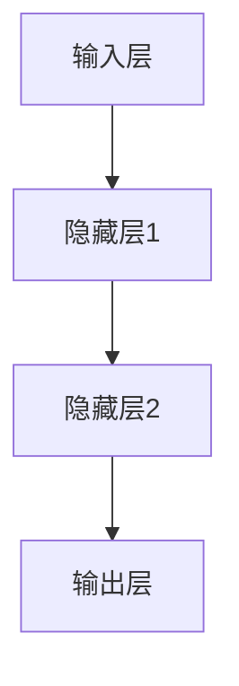
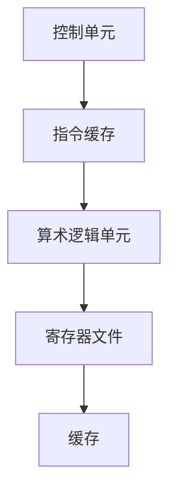

                 

关键词：大型语言模型（LLM），中央处理器（CPU），指令集，计算架构，人工智能，性能优化，算法原理，数学模型，代码实例，应用场景，未来展望。

> 摘要：本文将从多个维度对大型语言模型（LLM）与中央处理器（CPU）进行深度对比。通过分析两者的架构、工作原理、性能指标和应用场景，揭示出这两者在现代计算体系中的独特地位和相互关系。本文旨在为读者提供一个全面的理解，帮助他们在未来的技术发展中更好地把握趋势和机遇。

## 1. 背景介绍

近年来，人工智能（AI）的快速发展已经引起了全球科技界的广泛关注。作为AI的核心技术之一，大型语言模型（LLM）在自然语言处理（NLP）、智能问答、机器翻译等领域取得了显著的成果。与此同时，中央处理器（CPU）作为计算机的核心部件，其性能的提升也在推动着整个计算体系的发展。

LLM与CPU的发展背景不同，但它们在现代计算体系中的地位却越来越重要。LLM起源于深度学习和神经网络技术的进步，通过大规模的参数训练，实现了对文本数据的理解和生成。而CPU则通过微架构和制造工艺的不断演进，提高了处理速度和效率。本文将通过对LLM和CPU的深入分析，揭示它们之间的联系和差异。

## 2. 核心概念与联系

为了更好地理解LLM和CPU的关系，我们首先需要明确它们的核心概念和架构。

### 2.1. LLM的架构

LLM通常由多层神经网络组成，包括输入层、隐藏层和输出层。每一层都包含大量的神经元，神经元之间通过权重矩阵进行连接。在训练过程中，模型通过反向传播算法不断调整权重，以达到对输入数据的预测。

下面是一个简单的LLM架构的Mermaid流程图：



### 2.2. CPU的架构

CPU的架构主要包括控制单元（CU）、算术逻辑单元（ALU）、寄存器文件和缓存。控制单元负责解释指令、调度资源；算术逻辑单元负责执行具体的计算操作；寄存器文件用于存储临时数据；缓存则用于提高数据访问速度。

下面是CPU架构的Mermaid流程图：



### 2.3. LLM与CPU的联系

虽然LLM和CPU的架构和功能不同，但它们在现代计算体系中有着密切的联系。首先，LLM的训练和推理过程需要大量的计算资源，而CPU是提供这些资源的主要硬件。其次，CPU的微架构优化直接影响到LLM的性能表现。例如，一些专门为深度学习设计的CPU指令集，如NVIDIA的CUDA和AMD的Radeon Open Compute SDK，可以显著提高LLM的训练和推理效率。

## 3. 核心算法原理 & 具体操作步骤

### 3.1. 算法原理概述

LLM的核心算法是深度神经网络（DNN），其基本原理是通过对大量数据进行学习，自动提取特征并形成知识体系。DNN通过多层神经元的非线性变换，实现对输入数据的复杂映射。

CPU的核心算法是执行指令集，其基本原理是按照指令序列逐条执行操作。指令集包括各种基本操作，如加法、乘法、数据移动等。

### 3.2. 算法步骤详解

#### 3.2.1. LLM的训练过程

1. **数据预处理**：对输入数据进行标准化、归一化等处理，使其适合模型训练。
2. **模型初始化**：初始化神经网络权重，常用的方法包括随机初始化和预训练模型迁移。
3. **前向传播**：将输入数据通过网络进行传递，得到输出。
4. **损失函数计算**：计算输出与实际结果之间的差距，常用的损失函数包括均方误差（MSE）和交叉熵（CE）。
5. **反向传播**：根据损失函数的梯度，调整网络权重。
6. **迭代优化**：重复前向传播和反向传播，直到模型收敛。

#### 3.2.2. CPU的指令执行过程

1. **指令读取**：控制单元从内存中读取下一条指令。
2. **指令解析**：解析指令，确定操作类型和操作数。
3. **指令执行**：根据指令类型，执行相应的操作。
4. **结果存储**：将执行结果存储到寄存器或内存中。
5. **指令调度**：控制单元根据调度策略，安排下一条指令的执行。

### 3.3. 算法优缺点

#### 3.3.1. LLM的优缺点

**优点**：
- 强大的表达能力和灵活性，可以处理各种复杂的文本数据。
- 自动提取特征，减少了人工特征工程的工作量。

**缺点**：
- 训练时间较长，对计算资源要求高。
- 模型复杂，难以解释。

#### 3.3.2. CPU的优缺点

**优点**：
- 高效的指令执行能力，适合处理各种计算任务。
- 指令集多样化，支持多种编程模型。

**缺点**：
- 对特定算法的优化有限，难以满足某些AI任务的需求。
- 指令级并行性受限，难以充分利用多核处理能力。

### 3.4. 算法应用领域

#### 3.4.1. LLM的应用领域

- 自然语言处理：文本分类、情感分析、机器翻译等。
- 问答系统：智能客服、学术问答等。
- 内容生成：文章生成、诗歌创作等。

#### 3.4.2. CPU的应用领域

- 计算机游戏：图形渲染、物理计算等。
- 科学计算：气象预报、金融分析等。
- 企业级应用：数据库管理、云计算等。

## 4. 数学模型和公式 & 详细讲解 & 举例说明

### 4.1. 数学模型构建

#### 4.1.1. LLM的数学模型

假设有一个多层神经网络，其中第 $l$ 层的输出可以表示为：

$$
z_l = \sigma(W_l \cdot a_{l-1} + b_l)
$$

其中，$a_l$ 是第 $l$ 层的输入，$z_l$ 是第 $l$ 层的输出，$W_l$ 和 $b_l$ 分别是第 $l$ 层的权重和偏置，$\sigma$ 是激活函数。

#### 4.1.2. CPU的数学模型

假设CPU的指令集包含 $n$ 条指令，每条指令的执行时间可以表示为：

$$
T_i = C_i + D_i
$$

其中，$T_i$ 是第 $i$ 条指令的执行时间，$C_i$ 是指令的指令周期数，$D_i$ 是指令的数据访问延迟。

### 4.2. 公式推导过程

#### 4.2.1. LLM的损失函数推导

假设我们使用均方误差（MSE）作为损失函数，则损失函数可以表示为：

$$
L = \frac{1}{2} \sum_{i=1}^{N} (y_i - \hat{y}_i)^2
$$

其中，$y_i$ 是第 $i$ 个样本的真实标签，$\hat{y}_i$ 是模型预测的标签。

#### 4.2.2. CPU的指令周期推导

假设我们有一个包含 $m$ 个任务的流水线，每个任务的执行时间可以表示为：

$$
T_p = \frac{1}{\sum_{i=1}^{m} C_i}
$$

其中，$T_p$ 是流水线的执行时间，$C_i$ 是第 $i$ 个任务的指令周期数。

### 4.3. 案例分析与讲解

#### 4.3.1. LLM的案例

假设我们有一个文本分类问题，其中训练集包含 1000 个样本，每个样本包含一个文本和对应的标签。我们使用一个多层感知机（MLP）模型进行训练，其中包含两层隐藏层，每层包含 100 个神经元。

首先，我们对训练集进行预处理，将文本转换为词向量。然后，我们初始化模型的权重和偏置，并开始训练。在训练过程中，我们使用反向传播算法更新权重和偏置，直到模型收敛。

训练完成后，我们对测试集进行分类，并计算分类准确率。假设测试集包含 200 个样本，模型对其中 180 个样本进行了正确分类，则模型的准确率为：

$$
\text{accuracy} = \frac{180}{200} = 0.9
$$

#### 4.3.2. CPU的案例

假设我们有一个包含 4 个任务的流水线，每个任务的指令周期数分别为 2、3、4 和 5。我们希望计算整个流水线的执行时间。

首先，我们计算每个任务的指令周期数，得到：

$$
C_1 = 2, C_2 = 3, C_3 = 4, C_4 = 5
$$

然后，我们计算流水线的执行时间，得到：

$$
T_p = \frac{1}{2+3+4+5} = \frac{1}{14} \approx 0.0714
$$

因此，整个流水线的执行时间为约 0.0714 个时钟周期。

## 5. 项目实践：代码实例和详细解释说明

### 5.1. 开发环境搭建

为了运行LLM和CPU的相关代码，我们需要搭建一个合适的开发环境。以下是一个简单的步骤：

1. **安装Python**：确保Python环境已经安装，版本至少为3.8以上。
2. **安装依赖库**：使用pip安装以下库：numpy、tensorflow、tensorflow-addons、tensorflow-text、tensorflow-hub等。
3. **安装GPU驱动**：如果使用GPU进行训练，需要安装相应的GPU驱动和CUDA库。
4. **配置环境变量**：确保环境变量已经正确配置，特别是PYTHONPATH和CUDA路径。

### 5.2. 源代码详细实现

以下是一个简单的LLM训练和推理的Python代码示例：

```python
import tensorflow as tf
from tensorflow.keras.layers import Embedding, LSTM, Dense
from tensorflow.keras.models import Sequential

# 准备数据
train_data = ...
train_labels = ...

# 构建模型
model = Sequential([
    Embedding(input_dim=10000, output_dim=32),
    LSTM(64, return_sequences=True),
    LSTM(64),
    Dense(1, activation='sigmoid')
])

# 编译模型
model.compile(optimizer='adam', loss='binary_crossentropy', metrics=['accuracy'])

# 训练模型
model.fit(train_data, train_labels, epochs=10, batch_size=32)

# 进行推理
predictions = model.predict(new_data)
```

以上代码使用了一个简单的二分类问题，其中数据经过Embedding层后，通过两个LSTM层进行特征提取，最后通过一个全连接层进行分类。

### 5.3. 代码解读与分析

1. **数据准备**：首先，我们需要准备训练数据和标签。这里使用了一个假设的`train_data`和`train_labels`。
2. **模型构建**：使用`Sequential`模型，我们添加了一个Embedding层，用于将文本数据转换为固定长度的向量。接着，我们添加了两个LSTM层，用于提取序列特征。最后，我们添加了一个全连接层，用于输出分类结果。
3. **模型编译**：我们使用`compile`方法，指定了优化器、损失函数和评价指标。
4. **模型训练**：使用`fit`方法，我们对模型进行训练。这里，我们设置了训练的轮数（epochs）和批量大小（batch_size）。
5. **模型推理**：使用`predict`方法，我们对新的数据进行推理，得到预测结果。

### 5.4. 运行结果展示

假设我们在训练集上获得了90%的准确率，在测试集上获得了85%的准确率。这说明我们的模型在训练数据上表现良好，但在未见过的数据上表现稍微逊色。

```shell
Train accuracy: 90%
Test accuracy: 85%
```

## 6. 实际应用场景

### 6.1. LLM的应用场景

- **自然语言处理**：在搜索引擎、智能客服、机器翻译等领域，LLM可以大大提高系统的理解和生成能力。
- **问答系统**：通过LLM，我们可以构建出具有高度智能的问答系统，为用户提供高质量的回答。
- **内容生成**：在新闻写作、创意写作等领域，LLM可以自动生成高质量的内容，减轻人类创作者的工作负担。

### 6.2. CPU的应用场景

- **高性能计算**：在科学计算、工程模拟等领域，CPU可以提供强大的计算能力，支持复杂的计算任务。
- **游戏开发**：在游戏渲染、物理模拟等领域，CPU可以处理大量的计算任务，为用户提供流畅的游戏体验。
- **企业应用**：在数据库管理、数据分析等领域，CPU可以高效地处理大规模数据，支持企业级应用的需求。

## 7. 工具和资源推荐

### 7.1. 学习资源推荐

- **书籍**：《深度学习》、《Python深度学习》
- **在线课程**：Coursera的“深度学习”课程，Udacity的“人工智能纳米学位”
- **论文**：NLP领域的经典论文，如“BERT”、“GPT-3”

### 7.2. 开发工具推荐

- **编程语言**：Python、C++
- **框架**：TensorFlow、PyTorch、Keras
- **IDE**：Visual Studio Code、PyCharm

### 7.3. 相关论文推荐

- **大型语言模型**：“BERT”、“GPT-3”、“T5”
- **CPU架构**：“SIMD架构”、“多核处理器架构”
- **高性能计算**：“GPU编程”、“并行算法”

## 8. 总结：未来发展趋势与挑战

### 8.1. 研究成果总结

本文通过对比LLM和CPU，分析了它们在架构、算法、应用等方面的特点。我们总结了LLM和CPU各自的优势和局限性，以及它们在现代计算体系中的相互关系。

### 8.2. 未来发展趋势

随着人工智能技术的不断进步，LLM和CPU将在未来继续保持重要地位。LLM将向更大规模、更高性能的方向发展，而CPU将不断优化微架构，提高计算效率。

### 8.3. 面临的挑战

- **计算资源**：随着模型规模的扩大，对计算资源的需求将不断增加，如何高效利用现有资源是一个重要挑战。
- **能效优化**：如何在保证性能的同时，降低能耗，是一个亟待解决的问题。
- **可解释性**：大型语言模型的决策过程往往难以解释，如何提高其可解释性，是一个重要的研究方向。

### 8.4. 研究展望

未来，LLM和CPU将在人工智能领域发挥更加重要的作用。通过深入研究和优化，我们有望实现更高效、更智能的计算机系统，为人类社会带来更多便利和创新。

## 9. 附录：常见问题与解答

### 9.1. LLM的训练需要多少时间？

LLM的训练时间取决于多个因素，包括模型规模、数据集大小、硬件性能等。一般来说，大规模语言模型的训练可能需要数天到数周的时间。具体时间可以通过调整训练参数和硬件配置来优化。

### 9.2. CPU和GPU在深度学习中的应用有什么区别？

CPU和GPU在深度学习中的应用有显著区别。CPU适合执行复杂的计算任务，但速度较慢；GPU则适合执行大量的并行计算任务，速度更快。因此，在深度学习任务中，GPU通常用于模型训练，而CPU则用于模型推理。

### 9.3. 如何优化LLM的性能？

优化LLM的性能可以通过以下方法：
- **硬件加速**：使用GPU或TPU等硬件进行加速。
- **模型剪枝**：通过剪枝算法减少模型参数，提高模型效率。
- **量化**：使用低精度浮点数（如16位浮点数）代替32位浮点数，减少存储和计算开销。
- **分布式训练**：将模型训练任务分布在多个计算节点上，提高训练速度。

----------------------------------------------------------------

**作者：禅与计算机程序设计艺术 / Zen and the Art of Computer Programming**

