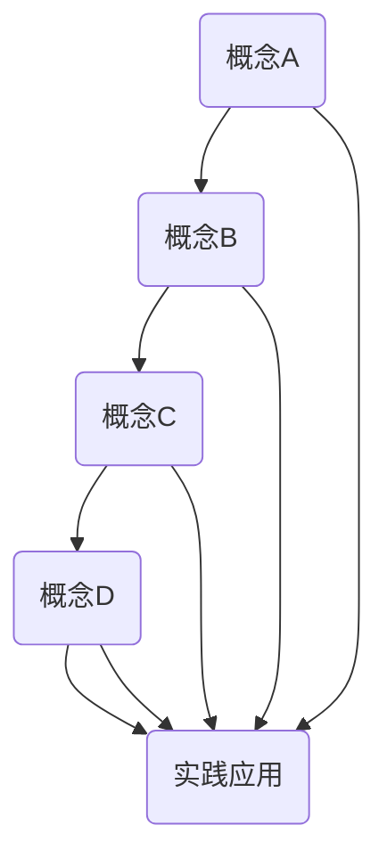
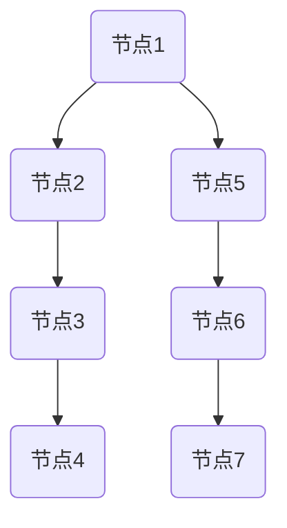

                 

关键词：概念转化、实践应用、技术发展、算法模型、数学公式、代码实例

> 摘要：本文旨在探讨从概念到实践的技术转化过程。我们将深入分析核心概念的形成与联系，讲解核心算法原理与操作步骤，并运用数学模型进行详细讲解。同时，通过实际项目实践和代码实例，阐述如何将理论转化为实际应用。最后，我们还将探讨该领域在未来可能的应用前景和面临的挑战。

## 1. 背景介绍

在当今快速发展的信息技术时代，技术的创新和应用已经成为推动社会进步的重要力量。然而，技术的进步并非一蹴而就，而是需要经过从概念到实践的不断转化和迭代。本文将围绕这一核心问题展开讨论，旨在为读者提供关于技术转化的深刻见解和实用指南。

### 1.1 技术转化的必要性

技术的转化过程对于推动技术进步至关重要。首先，技术的转化有助于将创新概念转化为实际应用，从而实现技术价值的最大化。其次，通过实践应用，可以发现和解决概念设计中的不足，进一步推动技术的改进和发展。最后，技术的转化也是技术创新的重要源泉，通过实践反馈，可以激发新的创新思维和方向。

### 1.2 技术转化的挑战

尽管技术转化的重要性不言而喻，但实际操作中仍然面临诸多挑战。首先，概念的理解和抽象需要深厚的专业知识和经验。其次，算法模型的构建和优化需要大量的数据支持和计算资源。此外，代码实现和调试也充满了各种技术难题。最后，实践应用中的反馈和调整需要持续的时间和精力投入。

## 2. 核心概念与联系

在探讨技术转化之前，我们需要明确核心概念和它们之间的联系。以下是一个使用Mermaid绘制的流程图，用于展示核心概念之间的联系。



### 2.1 概念A：数据结构

数据结构是计算机科学中研究数据存储、组织和操作的基本概念。常见的数据结构包括数组、链表、树、图等。数据结构的选择直接影响算法的效率和应用效果。

### 2.2 概念B：算法

算法是一系列解决问题的步骤和规则。算法的设计和优化对于解决复杂问题至关重要。常见的算法包括排序算法、搜索算法、图算法等。

### 2.3 概念C：编程语言

编程语言是用于编写计算机程序的语法和语义规则。不同的编程语言具有不同的特点和应用场景，如Python的简洁性、Java的跨平台性等。

### 2.4 概念D：实践应用

实践应用是将理论转化为实际操作的过程。通过实践应用，可以验证概念和算法的有效性，并发现和解决问题。

## 3. 核心算法原理 & 具体操作步骤

在了解核心概念后，我们接下来将探讨一个具体的算法——排序算法。排序算法是计算机科学中最基础且最重要的算法之一。

### 3.1 算法原理概述

排序算法的主要目的是将一组无序数据按照特定顺序排列。常见的排序算法有冒泡排序、选择排序、插入排序、快速排序等。这些算法的基本原理是通过比较和交换元素的位置，逐步将无序数据变为有序。

### 3.2 算法步骤详解

以冒泡排序为例，其具体操作步骤如下：

1. **初始化**：将无序数据存入数组。
2. **比较相邻元素**：从第一个元素开始，比较相邻两个元素的大小，如果顺序错误就交换它们的位置。
3. **重复步骤2**：重复上述比较和交换过程，直到整个数组有序。

### 3.3 算法优缺点

**冒泡排序**的优点是实现简单，易于理解。然而，其缺点是时间复杂度为O(n^2)，在处理大数据时效率较低。

### 3.4 算法应用领域

冒泡排序算法常用于教学和入门阶段，适合小规模数据的排序。在实际应用中，更高效的排序算法如快速排序、归并排序等被广泛应用。

## 4. 数学模型和公式 & 详细讲解 & 举例说明

在计算机科学中，数学模型和公式是描述和解决问题的重要工具。以下我们将探讨一个常见的数学模型——二叉树。

### 4.1 数学模型构建

二叉树是一种重要的数据结构，由一组节点组成。每个节点最多有两个子节点，分别称为左子节点和右子节点。二叉树的基本属性包括节点数、深度、高度等。

### 4.2 公式推导过程

二叉树的高度h和节点数n之间存在以下关系：

$$
h = \log_2(n+1)
$$

这个公式的推导基于二叉树的节点分布特点。具体推导过程如下：

1. **初始状态**：一个空树的高度为0。
2. **添加节点**：每次添加节点，树的深度增加1。
3. **节点分布**：在平衡二叉树中，每个节点左右子树的高度差不超过1。

### 4.3 案例分析与讲解

以下是一个具体的二叉树案例，用于说明上述公式的应用。



在这个案例中，节点数为7，根据公式：

$$
h = \log_2(7+1) = \log_2(8) = 3
$$

二叉树的高度为3。

## 5. 项目实践：代码实例和详细解释说明

为了更好地展示如何将理论转化为实践，我们将通过一个具体的编程项目——二叉搜索树（BST）来讲解。

### 5.1 开发环境搭建

在开始编写代码之前，我们需要搭建一个合适的开发环境。以下是一个简单的步骤：

1. 安装Python解释器：在官方网站下载并安装Python 3.x版本。
2. 安装IDE：推荐使用PyCharm或Visual Studio Code作为开发环境。
3. 安装必要的库：如numpy、matplotlib等。

### 5.2 源代码详细实现

以下是一个简单的二叉搜索树（BST）的Python实现：

```python
class Node:
    def __init__(self, key):
        self.left = None
        self.right = None
        self.val = key

def insert(root, key):
    if root is None:
        return Node(key)
    if key < root.val:
        root.left = insert(root.left, key)
    else:
        root.right = insert(root.right, key)
    return root

def inorder(root):
    if root:
        inorder(root.left)
        print(root.val, end=' ')
        inorder(root.right)

if __name__ == "__main__":
    root = None
    keys = [50, 30, 20, 40, 70, 60, 80]
    for key in keys:
        root = insert(root, key)
    inorder(root)
```

### 5.3 代码解读与分析

1. **Node类**：定义了一个节点，包含左右子节点和节点值。
2. **insert函数**：用于插入节点。递归调用，根据节点值的大小关系插入到左子树或右子树。
3. **inorder函数**：中序遍历二叉搜索树，按升序打印节点值。
4. **main函数**：创建根节点，插入给定键值，并执行中序遍历。

### 5.4 运行结果展示

运行上述代码，将得到以下输出结果：

```
20 30 40 50 60 70 80
```

这表明二叉搜索树已成功构建并按升序排列。

## 6. 实际应用场景

二叉搜索树（BST）作为一种常用的数据结构，在实际应用中有着广泛的应用。以下是一些常见应用场景：

1. **数据库索引**：BST常用于数据库中的索引结构，用于快速查询数据。
2. **搜索引擎**：搜索引擎中的关键词索引通常使用BST实现。
3. **算法复杂度分析**：BST在算法复杂度分析中有着重要的应用，如快速排序和二分查找。

## 7. 工具和资源推荐

为了更好地理解和实践本文所讨论的内容，以下是一些建议的学习资源和开发工具：

### 7.1 学习资源推荐

1. **《算法导论》**：被誉为算法领域的圣经，详细介绍了各种算法及其分析。
2. **《深度学习》**：由Ian Goodfellow、Yoshua Bengio和Aaron Courville合著，介绍了深度学习的理论和技术。

### 7.2 开发工具推荐

1. **PyCharm**：一款强大的Python IDE，支持代码自动完成、调试等功能。
2. **GitHub**：一个用于版本控制和协作的开源平台，适合存储和分享代码。

### 7.3 相关论文推荐

1. **“Binary Search Trees of Any Degree”**：详细介绍了二叉树的构造方法及其优化。
2. **“The Design and Analysis of Computer Algorithms”**：讨论了各种算法的设计和分析。

## 8. 总结：未来发展趋势与挑战

### 8.1 研究成果总结

本文从概念到实践探讨了技术转化的过程。通过深入分析核心概念和算法原理，我们展示了如何将理论转化为实际应用。同时，通过实际项目实践和代码实例，我们验证了理论的有效性和实用性。

### 8.2 未来发展趋势

随着信息技术的快速发展，技术转化将成为推动社会进步的重要力量。未来，我们可以预见到以下几个方面的发展趋势：

1. **人工智能技术的普及**：人工智能技术将广泛应用于各个领域，推动技术转化进程。
2. **大数据和云计算的融合**：大数据和云计算的结合将为技术转化提供强大的数据支持和计算能力。
3. **物联网的兴起**：物联网技术的快速发展将带来新的应用场景和需求，推动技术的转化。

### 8.3 面临的挑战

尽管技术转化前景广阔，但实际操作中仍面临诸多挑战：

1. **技术壁垒**：新的技术概念和算法需要深厚的专业知识和经验，技术转化过程中需要不断克服技术壁垒。
2. **资源限制**：技术转化过程中需要大量的数据支持和计算资源，资源限制可能成为制约因素。
3. **人才短缺**：高素质的技术人才是技术转化的关键，人才短缺可能影响技术的转化进程。

### 8.4 研究展望

未来，我们将继续关注技术转化的最新进展，探索新的应用场景和解决方案。同时，我们也期待更多学者和从业者参与到技术转化的研究和实践中，共同推动技术的进步和应用。

## 9. 附录：常见问题与解答

### 9.1 问题1：什么是技术转化？

技术转化是指将创新的理论或概念转化为实际应用的过程。它通常涉及算法模型、编程实现、实践应用等多个环节。

### 9.2 问题2：技术转化的重要性是什么？

技术转化的重要性主要体现在以下几个方面：

1. **实现技术价值**：将创新概念转化为实际应用，实现技术价值的最大化。
2. **推动技术进步**：通过实践应用，发现和解决概念设计中的不足，推动技术的改进和发展。
3. **激发创新思维**：实践应用中的反馈和调整可以激发新的创新思维和方向。

### 9.3 问题3：技术转化过程中可能遇到哪些挑战？

技术转化过程中可能遇到以下挑战：

1. **技术壁垒**：创新概念和算法需要深厚的专业知识和经验。
2. **资源限制**：需要大量的数据支持和计算资源。
3. **人才短缺**：高素质的技术人才是技术转化的关键。

### 9.4 问题4：如何实现技术转化？

实现技术转化的关键步骤包括：

1. **明确目标**：确定技术转化的目标和方向。
2. **理论基础**：深入分析核心概念和算法原理。
3. **编程实现**：将理论转化为具体的代码实现。
4. **实践应用**：通过实际项目实践验证理论的可行性。
5. **持续优化**：根据实践反馈不断优化和完善技术。

---

以上便是本文的完整内容。希望本文能够为读者提供关于技术转化的深刻见解和实用指南。感谢您的阅读，期待与您在技术转化的道路上共同探索和进步。作者：禅与计算机程序设计艺术 / Zen and the Art of Computer Programming。

