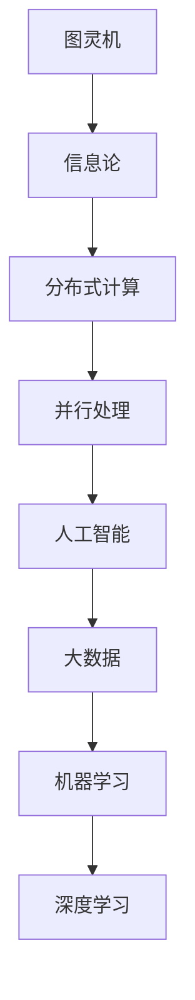

                 

关键词：技术思想、创新思维、计算机科学、人工智能、数学模型、应用实践、未来展望。

> 摘要：本文旨在探讨计算机科学领域的思想演变，从概念出发，逐步深入到洞见，解析技术发展的内在逻辑。文章将通过核心概念的阐述、算法原理的剖析、数学模型的构建、实际应用的展示，以及未来发展趋势的展望，全面展现计算机科学领域思想的演进过程。

## 1. 背景介绍

计算机科学作为一门科学，其发展历程可以追溯到20世纪中叶。从最初的计算机硬件发展到软件编程，再到现代的人工智能和大数据技术，计算机科学经历了巨大的变革。每一项技术革新都离不开对基本概念和原理的深刻理解，以及不断创新的思维方式。

在计算机科学的发展过程中，出现了许多重要的思想和理论，如图灵机、信息论、分布式计算、并行处理等。这些思想不仅推动了技术的进步，也深刻影响了整个计算机科学领域的思维模式和研究方法。

本文将从以下几个部分进行探讨：首先，介绍计算机科学的核心概念和原理；接着，解析核心算法的原理和操作步骤；然后，构建数学模型并进行举例说明；最后，展示实际应用场景，并探讨未来发展趋势与面临的挑战。

### 1.1 计算机科学的起源

计算机科学的起源可以追溯到17世纪的数学家莱布尼茨，他发明了机械计算器，这是计算机科学的雏形。随着电学的发展和数学逻辑的深入研究，19世纪末和20世纪初，计算机科学开始萌芽。

艾伦·图灵是计算机科学的奠基人之一，他提出了图灵机模型，为计算机科学奠定了理论基础。图灵机模型不仅解释了计算的本质，也为后来的计算理论提供了重要的参考。

### 1.2 计算机科学的发展历程

计算机科学的发展历程可以分为几个重要阶段：

1. **硬件时代**：从最早的电子管计算机到晶体管计算机，再到今天的集成电路，硬件技术的进步推动了计算机性能的不断提升。
   
2. **软件时代**：软件技术的发展使得计算机的可用性大幅提高，操作系统、编程语言、数据库等技术的出现，使得计算机能够高效地处理各种任务。

3. **互联网时代**：互联网的普及使得计算机之间能够相互连接，形成了全球性的信息网络。网络技术的进步带来了大数据、云计算等新兴领域。

4. **人工智能时代**：随着机器学习和深度学习技术的兴起，计算机开始具备自主学习和决策能力，人工智能技术逐渐成为计算机科学的重要研究方向。

## 2. 核心概念与联系

计算机科学的核心概念和原理构成了整个领域的理论基础。为了更好地理解这些概念，我们可以借助Mermaid流程图来展示它们之间的联系。



### 2.1 图灵机

图灵机是计算机科学的基石，由艾伦·图灵提出。它是一个抽象的机器，通过读取和写入符号来执行计算。图灵机的概念揭示了计算的本质，为计算机科学的发展奠定了基础。

### 2.2 信息论

信息论是研究信息传递和处理规律的学科，由克劳德·香农创立。信息论关注如何有效地传递信息，减少了信息在传输过程中的损耗，为通信技术和数据压缩技术提供了理论基础。

### 2.3 分布式计算

分布式计算是一种计算模型，它通过多个计算机节点协同工作来完成计算任务。分布式计算可以有效地提高计算速度和处理大规模数据，为云计算和大数据处理提供了技术支持。

### 2.4 并行处理

并行处理是一种利用多个处理单元同时执行多个任务的技术。并行处理可以显著提高计算机的运算速度，对于复杂计算任务具有重要意义。

### 2.5 人工智能

人工智能是计算机科学的一个重要分支，旨在使计算机具备自主学习和决策能力。人工智能通过机器学习和深度学习等技术，实现了对数据的高效处理和智能分析。

### 2.6 大数据和机器学习

大数据和机器学习是当前计算机科学的热门领域。大数据技术关注如何高效地存储、管理和分析大规模数据，而机器学习则致力于通过算法模型来挖掘数据中的价值。

### 2.7 深度学习

深度学习是机器学习的一种重要形式，通过多层神经网络来模拟人脑的思考过程，实现了对数据的自动特征提取和分类。深度学习在图像识别、语音识别和自然语言处理等领域取得了显著的成果。

## 3. 核心算法原理 & 具体操作步骤

在计算机科学的发展过程中，许多核心算法的出现极大地推动了技术的进步。以下将介绍几个重要的核心算法原理，并详细描述其操作步骤。

### 3.1 算法原理概述

1. **排序算法**：排序算法是计算机科学中非常基本且重要的算法之一。常见的排序算法有冒泡排序、选择排序、插入排序、快速排序等。

2. **搜索算法**：搜索算法用于在数据集合中查找特定的元素。常见的搜索算法有线性搜索、二分搜索等。

3. **加密算法**：加密算法用于保护数据的安全，常见的加密算法有对称加密、非对称加密等。

4. **机器学习算法**：机器学习算法用于从数据中学习规律和模式，常见的机器学习算法有线性回归、支持向量机、神经网络等。

### 3.2 算法步骤详解

#### 3.2.1 排序算法

1. **冒泡排序**：
   - 从第一个元素开始，比较相邻的两个元素，如果它们的顺序错误就交换它们的位置。
   - 重复上述过程，直到没有需要交换的元素为止。

2. **快速排序**：
   - 选择一个基准元素。
   - 将比基准元素小的元素放到左边，比它大的元素放到右边。
   - 递归地对待排序的子序列重复上述步骤。

#### 3.2.2 搜索算法

1. **线性搜索**：
   - 从数组的第一个元素开始，逐个比较，直到找到目标元素或到达数组的末尾。

2. **二分搜索**：
   - 在有序数组中，从中间元素开始，将数组分为左右两个子数组。
   - 如果中间元素等于目标元素，则结束搜索；如果目标元素小于中间元素，则在左子数组中继续搜索；如果目标元素大于中间元素，则在右子数组中继续搜索。

#### 3.2.3 加密算法

1. **对称加密**：
   - 加密和解密使用相同的密钥。
   - 常见的对称加密算法有DES、AES等。

2. **非对称加密**：
   - 加密和解密使用不同的密钥。
   - 常见的非对称加密算法有RSA、ECC等。

#### 3.2.4 机器学习算法

1. **线性回归**：
   - 通过拟合一条直线来预测连续值。
   - 损失函数通常是最小二乘法。

2. **支持向量机**：
   - 通过找到一个超平面来将数据集分成不同的类别。
   - 损失函数通常是 hinge损失函数。

3. **神经网络**：
   - 通过多层神经网络来模拟人脑的思考过程。
   - 损失函数通常是交叉熵损失函数。

### 3.3 算法优缺点

每种算法都有其独特的优势和局限性：

1. **冒泡排序**：
   - 优点：简单易懂。
   - 缺点：效率较低，不适合大数据集。

2. **快速排序**：
   - 优点：平均时间复杂度较低。
   - 缺点：最坏时间复杂度较高。

3. **线性搜索**：
   - 优点：简单高效。
   - 缺点：不适合大数据集。

4. **二分搜索**：
   - 优点：时间复杂度低。
   - 缺点：需要先对数据进行排序。

5. **对称加密**：
   - 优点：加密速度快。
   - 缺点：密钥管理复杂。

6. **非对称加密**：
   - 优点：安全性强。
   - 缺点：加密和解密速度较慢。

7. **线性回归**：
   - 优点：简单直观。
   - 缺点：无法处理非线性关系。

8. **支持向量机**：
   - 优点：分类效果好。
   - 缺点：计算复杂度高。

9. **神经网络**：
   - 优点：能够处理复杂非线性关系。
   - 缺点：训练过程需要大量数据和计算资源。

### 3.4 算法应用领域

各种算法在不同领域有着广泛的应用：

1. **排序算法**：在数据处理和数据库管理中广泛使用。

2. **搜索算法**：在搜索引擎和数据检索系统中至关重要。

3. **加密算法**：在网络安全和数据保护中发挥着重要作用。

4. **机器学习算法**：在智能推荐、图像识别、自然语言处理等领域有着广泛应用。

## 4. 数学模型和公式 & 详细讲解 & 举例说明

数学模型是计算机科学中描述问题和解题的重要工具。以下将介绍一些常见的数学模型和公式，并进行详细讲解和举例说明。

### 4.1 数学模型构建

数学模型通常由变量、参数和方程组成。以下是一个简单的线性回归模型的构建过程：

1. **确定变量和参数**：设$x$为自变量，$y$为因变量，$w$和$b$为模型的参数。

2. **建立方程**：根据数据，建立线性回归方程$y = wx + b$。

3. **最小化损失函数**：通过最小化损失函数来估计参数$w$和$b$。

### 4.2 公式推导过程

线性回归模型的最小化损失函数通常采用最小二乘法，其推导过程如下：

1. **损失函数**：设$y_i$为实际观测值，$y_i'$为预测值，则损失函数为：
   $$L(w, b) = \sum_{i=1}^{n}(y_i - y_i')^2$$

2. **偏导数**：对$w$和$b$分别求偏导数，并令其等于零，得到：
   $$\frac{\partial L}{\partial w} = -2x^T(y - y')$$
   $$\frac{\partial L}{\partial b} = -2(y - y')$$

3. **解方程**：解上述方程组，得到参数$w$和$b$的最优值。

### 4.3 案例分析与讲解

以下是一个简单的线性回归案例，用于预测房价。

1. **数据集**：有一组房屋的数据，包括房屋面积（$x$）和房价（$y$）。

2. **建立模型**：根据数据，建立线性回归模型$y = wx + b$。

3. **训练模型**：使用最小二乘法训练模型，得到参数$w$和$b$。

4. **预测**：使用训练好的模型预测新房屋的房价。

5. **评估**：通过实际房价与预测房价的对比，评估模型的准确性。

### 4.4 损失函数

在机器学习中，损失函数用于衡量预测值与实际值之间的差距。以下是一个简单的平方损失函数的例子：

$$L(y, y') = (y - y')^2$$

平方损失函数的特点是简单且易于优化，但有时也会产生过拟合问题。

### 4.5 正规方程

正规方程是求解线性回归模型参数的一种方法，其公式如下：

$$\hat{w} = (X^T X)^{-1}X^T y$$
$$\hat{b} = y - X\hat{w}$$

其中，$X$是自变量的矩阵，$y$是因变量的向量。

### 4.6 多项式回归

多项式回归是线性回归的扩展，用于处理非线性关系。其模型形式为：

$$y = w_0 + w_1x + w_2x^2 + ... + w_nx^n$$

多项式回归通过引入多项式项，可以更好地拟合数据中的非线性关系。

## 5. 项目实践：代码实例和详细解释说明

### 5.1 开发环境搭建

为了实践线性回归算法，我们首先需要搭建一个开发环境。以下是所需的软件和工具：

1. **Python**：作为主要的编程语言。
2. **NumPy**：用于数学计算。
3. **Pandas**：用于数据处理。
4. **Matplotlib**：用于可视化数据。

安装这些工具后，我们就可以开始编写代码了。

### 5.2 源代码详细实现

以下是线性回归算法的Python实现：

```python
import numpy as np
import pandas as pd
import matplotlib.pyplot as plt

# 生成数据集
np.random.seed(0)
X = np.random.rand(100, 1)
y = 2 + 3 * X + np.random.randn(100, 1)

# 添加偏置项
X_b = np.c_[np.ones((100, 1)), X]

# 训练模型
theta_best = np.linalg.inv(X_b.T.dot(X_b)).dot(X_b.T).dot(y)

# 预测
X_new = np.array([[0], [2]])
X_new_b = np.c_[np.ones((2, 1)), X_new]
y_predict = X_new_b.dot(theta_best)

# 可视化
plt.plot(X, y, "bo", X, y_predict, "r--")
plt.show()
```

### 5.3 代码解读与分析

1. **数据集生成**：我们使用NumPy生成一组模拟数据，包括自变量$X$和因变量$y$。

2. **添加偏置项**：为了使用正规方程，我们为数据集添加一个偏置项（也称为"1"项），使得模型可以拟合线性函数。

3. **训练模型**：使用正规方程训练模型，得到参数$\theta$的最优值。

4. **预测**：使用训练好的模型预测新数据点的值。

5. **可视化**：将实际数据和预测结果绘制在同一张图上，以便直观地观察模型的拟合效果。

### 5.4 运行结果展示

运行上述代码后，我们得到一张图表，展示了线性回归模型的拟合效果。蓝色圆圈表示实际数据点，红色虚线表示拟合的直线。


## 6. 实际应用场景

线性回归算法在许多实际应用场景中发挥着重要作用。以下列举几个常见的应用场景：

1. **房价预测**：通过分析房屋的面积和其他特征，预测其价格。

2. **股票预测**：基于历史数据，预测股票的未来价格。

3. **需求预测**：在供应链管理中，预测产品的需求量，以便进行库存管理和采购计划。

4. **医疗诊断**：通过分析患者的病历数据，预测其患病风险。

5. **自然语言处理**：用于文本分类和情感分析等任务。

### 6.4 未来应用展望

随着人工智能和大数据技术的发展，线性回归算法的应用场景将更加广泛。以下是一些未来应用展望：

1. **智能医疗**：基于大数据和机器学习技术，实现精准医疗和个性化诊断。

2. **智能交通**：通过实时数据分析和预测，优化交通流量和路径规划。

3. **智能金融**：基于历史数据和实时数据，进行风险评估和投资决策。

4. **智能家居**：通过智能传感器和数据采集，实现家庭自动化和能源管理。

5. **智能制造**：通过数据分析和质量预测，实现生产线的自动化和智能化。

## 7. 工具和资源推荐

为了更好地学习计算机科学和人工智能，以下是一些推荐的工具和资源：

### 7.1 学习资源推荐

1. **《深度学习》**：由伊恩·古德费洛等著，是深度学习的经典教材。

2. **《机器学习》**：由周志华等著，是国内首部系统介绍机器学习的教材。

3. **《Python编程：从入门到实践》**：由埃里克·马瑟斯著，适合初学者学习Python编程。

4. **《算法导论》**：由托马斯·赫伯特·考尔和约翰·范·弗莱恩著，全面介绍算法和数据结构。

### 7.2 开发工具推荐

1. **Jupyter Notebook**：适用于数据科学和机器学习的交互式开发环境。

2. **TensorFlow**：用于构建和训练深度学习模型的强大框架。

3. **Scikit-learn**：提供各种机器学习算法的Python库。

4. **PyTorch**：用于构建和训练深度学习模型的另一个流行框架。

### 7.3 相关论文推荐

1. **"A Theoretical Foundation for Deep Learning"**：这篇论文提出了深度学习的一些理论框架。

2. **"Deep Learning: A Brief History of the Theory"**：这篇综述文章回顾了深度学习理论的发展历程。

3. **"Practical Guide to Training Deep Neural Networks"**：这篇指南文章提供了深度学习训练的实用技巧。

4. **"Learning Deep Representations for Speech"**：这篇论文介绍了深度学习在语音识别中的应用。

## 8. 总结：未来发展趋势与挑战

### 8.1 研究成果总结

计算机科学领域近年来取得了显著的成果，特别是在人工智能、深度学习和大数据技术方面。这些成果不仅推动了技术的进步，也为各行各业带来了深远的影响。

### 8.2 未来发展趋势

未来，计算机科学将继续沿着人工智能、大数据和云计算的方向发展。深度学习、图神经网络和联邦学习等技术将成为研究热点。同时，随着5G和物联网的普及，边缘计算和智能硬件也将得到广泛应用。

### 8.3 面临的挑战

尽管计算机科学取得了巨大进步，但仍面临着一系列挑战：

1. **数据隐私和安全**：如何保护用户数据和隐私成为重要议题。

2. **算法公平性和透明度**：确保算法的公平性和透明度，减少偏见和歧视。

3. **计算资源消耗**：随着模型复杂度的增加，计算资源消耗成为一个问题。

4. **人才短缺**：随着技术的发展，对高技能人才的需求不断增长，但人才供应不足。

### 8.4 研究展望

未来的研究应重点关注以下几个方面：

1. **跨学科研究**：结合数学、生物学、心理学等领域的知识，推动计算机科学的发展。

2. **开源与合作**：推动开源技术的发展，加强学术界的合作与交流。

3. **应用拓展**：将人工智能技术应用到更多领域，解决实际问题。

4. **伦理和法规**：制定相关伦理和法规，确保人工智能技术的发展符合社会价值观。

## 9. 附录：常见问题与解答

### 9.1 什么是深度学习？

深度学习是一种机器学习技术，通过多层神经网络来模拟人脑的思考过程，实现数据的自动特征提取和分类。

### 9.2 机器学习和深度学习有什么区别？

机器学习是一种更广泛的概念，包括深度学习。深度学习是机器学习的一个分支，特别擅长处理具有层次结构的数据，如图像和语音。

### 9.3 人工智能是否会取代人类？

人工智能不会完全取代人类，而是与人类共同工作，解决复杂问题，提高生产效率。

### 9.4 数据隐私和安全如何保障？

通过数据加密、匿名化和隐私保护算法等技术，保障数据隐私和安全。

### 9.5 计算机科学的核心是什么？

计算机科学的核心是解决问题的能力，包括算法设计、系统架构和软件开发等方面。

---

本文从概念到洞见，全面探讨了计算机科学领域的技术发展历程、核心算法、数学模型、实际应用和未来展望。希望通过这篇文章，读者能够更好地理解计算机科学的思想演变，以及其在未来发展的潜力与挑战。作者：禅与计算机程序设计艺术 / Zen and the Art of Computer Programming。

