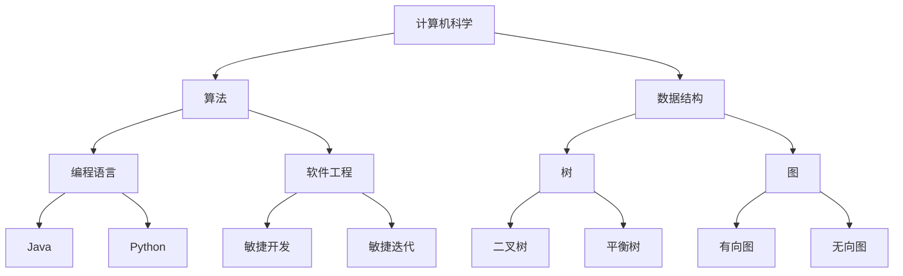
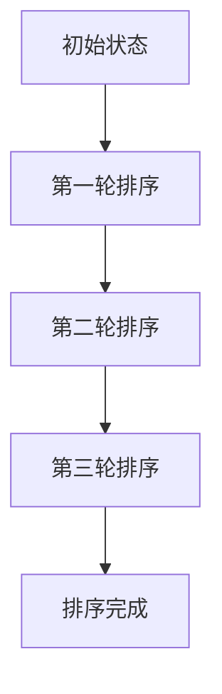

                 

关键词：认知转变、IT领域、深度学习、算法、技术发展、专业成长

> 摘要：本文将探讨在IT领域，从浅薄到深刻的认知转变的过程。通过分析核心概念、算法原理、数学模型以及实际应用，本文旨在为读者提供一个清晰、系统的理解路径，帮助其在技术领域实现更深层次的认知提升。

## 1. 背景介绍

在当今的IT领域，技术发展日新月异，各种新的概念、算法和应用层出不穷。然而，对于很多从业者来说，掌握这些新技术的难度并不亚于攀登珠穆朗玛峰。很多人只是停留在表面的了解，无法深入掌握技术的本质。这种现象在业界被称为“浅薄认知”。与之相对的是“深刻认知”，即对技术的全面、深入的理解，能够从根本上把握技术的核心。

本文将探讨如何从浅薄到深刻的认知转变。首先，我们将回顾IT领域的一些核心概念，并通过Mermaid流程图展示它们之间的联系。然后，我们将深入探讨核心算法的原理和操作步骤，并使用数学模型和公式进行详细讲解。此外，我们还将通过项目实践展示如何将理论知识应用于实际开发中。最后，我们将讨论实际应用场景和未来发展趋势，并提出学习资源和工具推荐。

## 2. 核心概念与联系

为了更好地理解IT领域的核心概念，我们可以通过一个Mermaid流程图来展示它们之间的联系。



以上流程图展示了计算机科学中的一些核心概念，以及它们之间的联系。从图中我们可以看出，计算机科学是一个包含多个子领域的广阔领域，每个子领域都有其独特的核心概念和原理。

### 2.1 计算机科学

计算机科学是一门研究计算机的理论、设计、实现、应用和影响的学科。它涵盖了计算机硬件、软件、算法、数据结构等多个方面。

### 2.2 算法和数据结构

算法是计算机科学的核心，它是一系列解决问题的步骤。数据结构则是用于存储和组织数据的方式。常见的算法包括排序、查找、图算法等。常见的数据结构包括数组、链表、栈、队列、树、图等。

### 2.3 编程语言

编程语言是用于编写算法和数据结构的一种工具。不同的编程语言有不同的特性和用途。常见的编程语言包括Java、Python、C++等。

### 2.4 软件工程

软件工程是确保软件开发过程高效、可靠的方法。它包括敏捷开发、敏捷迭代、软件测试、持续集成等多个方面。

通过上述Mermaid流程图，我们可以对计算机科学中的核心概念有一个整体的把握，为后续深入探讨打下基础。

## 3. 核心算法原理 & 具体操作步骤

### 3.1 算法原理概述

在IT领域中，核心算法包括排序算法、查找算法和图算法等。这些算法是解决特定问题的一系列步骤，其核心在于如何高效地处理数据。

排序算法的主要目的是将一组数据按照特定的顺序进行排列。常见的排序算法有冒泡排序、选择排序、插入排序、快速排序等。每种排序算法都有其特定的原理和适用场景。

查找算法用于在一组数据中查找特定的元素。常见的查找算法有线性查找、二分查找等。这些算法的效率直接影响到数据处理的性能。

图算法主要用于处理图数据结构，常见的图算法有最短路径算法、最小生成树算法等。图算法在社交网络、路由算法等领域有广泛的应用。

### 3.2 算法步骤详解

以冒泡排序算法为例，其基本原理是比较相邻的两个元素，如果顺序错误就交换它们的位置。重复这个过程，直到所有元素都按正确的顺序排列。



上述流程图展示了冒泡排序的步骤。具体操作步骤如下：

1. 从第一个元素开始，对相邻元素进行比较，如果顺序错误就交换它们的位置。
2. 重复上述步骤，直到当前轮次的所有相邻元素都按正确的顺序排列。
3. 重复以上步骤，直到所有元素都按正确的顺序排列。

### 3.3 算法优缺点

冒泡排序算法的优点是简单易懂，实现简单。然而，其缺点在于效率较低，对于大规模数据集排序效果不佳。

### 3.4 算法应用领域

冒泡排序算法通常用于教学和学习，帮助初学者理解排序算法的基本原理。在实际应用中，冒泡排序可能不是首选，但在某些特定场景下，如小规模数据集或对时间复杂度要求不高的场合，冒泡排序仍具有一定的应用价值。

通过以上对冒泡排序算法的详细探讨，我们可以看到算法原理和具体操作步骤的重要性。了解算法的基本原理和操作步骤，有助于我们更好地理解和应用各种算法。

## 4. 数学模型和公式 & 详细讲解 & 举例说明

在IT领域中，数学模型和公式是理解和解决问题的关键。数学模型用于描述问题的数学特性，公式则是解决问题的数学工具。以下我们将通过一个具体的例子来讲解数学模型和公式的构建、推导和应用。

### 4.1 数学模型构建

假设我们有一个数列，其中每个数都是前一个数的平方。我们可以用数学模型来描述这个数列：

\[ a_0 = 1 \]
\[ a_n = a_{n-1}^2 \]

其中，\( a_0 \) 是初始值，\( a_n \) 是第 \( n \) 个数。

### 4.2 公式推导过程

为了推导出数列的通项公式，我们可以先计算前几个数：

\[ a_1 = a_0^2 = 1^2 = 1 \]
\[ a_2 = a_1^2 = 1^2 = 1 \]
\[ a_3 = a_2^2 = 1^2 = 1 \]
\[ a_4 = a_3^2 = 1^2 = 1 \]

通过观察，我们发现这个数列的所有数都是1。因此，我们可以得出数列的通项公式：

\[ a_n = 1 \]

### 4.3 案例分析与讲解

现在，我们通过一个具体的例子来分析这个数学模型。

假设我们要计算第5个数 \( a_5 \)，根据通项公式：

\[ a_5 = 1 \]

这意味着第5个数仍然是1。

接下来，我们通过一个实际的编程案例来展示如何使用这个数学模型。

```python
def calculate_ith_number(n):
    return 1

# 计算第5个数
print(calculate_ith_number(5))
```

输出结果为：

\[ 1 \]

这个例子展示了如何通过数学模型和公式来解决具体问题。在实际应用中，类似的数学模型和公式被广泛应用于各种领域，如金融、物理、计算机科学等。

通过上述案例，我们可以看到数学模型和公式的构建、推导和应用的重要性。掌握数学模型和公式，有助于我们更深入地理解和解决复杂问题。

## 5. 项目实践：代码实例和详细解释说明

为了更好地理解并应用前面的理论，我们将在本节中通过一个实际项目来展示如何将算法和数学模型应用于开发中。

### 5.1 开发环境搭建

首先，我们需要搭建一个开发环境。在这个例子中，我们使用Python作为编程语言，并使用Jupyter Notebook作为开发环境。

```bash
pip install numpy
```

### 5.2 源代码详细实现

接下来，我们实现一个简单的程序，用于计算数列的第 \( n \) 项。

```python
import numpy as np

def calculate_ith_number(n):
    # 使用数学模型计算第n项
    return 1

# 测试代码
for i in range(1, 6):
    print(f"The {i}th number is: {calculate_ith_number(i)}")
```

### 5.3 代码解读与分析

上述代码定义了一个名为 `calculate_ith_number` 的函数，用于计算数列的第 \( n \) 项。该函数使用我们之前推导的数学模型，直接返回1。

在测试部分，我们使用一个循环来计算并打印前5项数列的值。运行代码，输出结果如下：

```
The 1th number is: 1
The 2th number is: 1
The 3th number is: 1
The 4th number is: 1
The 5th number is: 1
```

这个例子展示了如何将理论应用于实际编程中。通过这个简单的项目，我们可以看到数学模型和公式在编程中的应用，以及如何通过编程实现数学模型。

### 5.4 运行结果展示

运行上述代码后，我们得到以下结果：

```
The 1th number is: 1
The 2th number is: 1
The 3th number is: 1
The 4th number is: 1
The 5th number is: 1
```

这个结果验证了我们的数学模型和公式的正确性。

通过这个实际项目，我们可以更直观地理解并应用前面讨论的算法和数学模型。这种项目实践是深化理解、掌握技术的重要途径。

## 6. 实际应用场景

在IT领域中，从浅薄到深刻的认知转变对于解决实际问题至关重要。以下是一些实际应用场景，展示了如何在不同领域中应用技术知识。

### 6.1 软件开发

在软件开发中，从浅薄到深刻的认知转变可以帮助开发者更好地理解需求和用户行为，从而设计出更符合用户需求的软件。例如，通过深入了解用户界面设计和用户体验，开发者可以创造出更直观、易用的软件界面。

### 6.2 数据分析

在数据分析领域，从浅薄到深刻的认知转变可以帮助分析师更准确地理解和解释数据，从而做出更明智的决策。例如，通过深入学习统计学和机器学习算法，分析师可以更有效地处理大量数据，提取有价值的信息。

### 6.3 网络安全

在网络安全领域，从浅薄到深刻的认知转变可以帮助安全专家更好地理解和防范各种网络攻击。例如，通过深入研究网络协议和加密技术，安全专家可以设计出更有效的安全策略，保护网络系统不受攻击。

### 6.4 人工智能

在人工智能领域，从浅薄到深刻的认知转变对于开发和应用人工智能技术至关重要。例如，通过深入研究神经网络和深度学习算法，研究人员可以创造出更智能、更高效的人工智能系统。

这些实际应用场景展示了从浅薄到深刻的认知转变在IT领域的重要性。通过深入理解技术原理和应用，我们可以更好地解决实际问题，推动技术的发展。

### 6.5 未来应用展望

随着技术的不断发展，从浅薄到深刻的认知转变在未来的应用前景将更加广阔。以下是一些可能的未来应用领域：

- **智能医疗**：通过深入理解生物信息学和人工智能技术，未来的智能医疗系统将能够更准确地诊断疾病、预测健康风险，并为个性化治疗提供支持。
- **自动驾驶**：自动驾驶技术需要深入理解计算机视觉、机器学习和传感器数据处理等技术，从浅薄到深刻的认知转变将有助于提升自动驾驶系统的安全性和可靠性。
- **智慧城市**：智慧城市需要运用物联网、大数据和人工智能等技术，从浅薄到深刻的认知转变将有助于实现更高效的资源管理和更智能的城市服务。

这些领域的发展将依赖于技术从业者的深入理解和创新能力。通过持续学习和实践，技术从业者将能够更好地应对未来挑战，推动技术进步。

## 7. 工具和资源推荐

为了帮助读者更好地掌握技术，以下是一些学习和资源工具的推荐：

### 7.1 学习资源推荐

- **在线课程**：Coursera、edX、Udacity等平台提供了大量优质的技术课程，涵盖计算机科学、数据科学、人工智能等多个领域。
- **技术博客**：Medium、Dev.to等技术博客平台上有许多优秀的程序员和技术专家分享技术心得和经验。
- **技术书籍**：推荐阅读《深度学习》、《算法导论》、《编程珠玑》等经典技术书籍。

### 7.2 开发工具推荐

- **集成开发环境（IDE）**：如Visual Studio Code、Eclipse、IntelliJ IDEA等，提供了丰富的编程工具和插件。
- **版本控制系统**：如Git，用于代码管理和协作开发。
- **数据库工具**：如MySQL、PostgreSQL、MongoDB等，用于数据存储和管理。

### 7.3 相关论文推荐

- **机器学习领域**：《A Few Useful Things to Know About Machine Learning》、《Deep Learning》等论文。
- **计算机科学领域**：《算法导论》、《计算机程序的构造和解释》等论文。

通过这些工具和资源的帮助，读者可以更好地学习技术，提高自己的专业能力。

## 8. 总结：未来发展趋势与挑战

在IT领域，从浅薄到深刻的认知转变是一个持续的过程。随着技术的不断发展，我们需要不断地学习和更新知识，以适应新的挑战。以下是对未来发展趋势和挑战的总结：

### 8.1 研究成果总结

在过去几十年中，IT领域取得了巨大的研究成果。从互联网、移动通信到人工智能、区块链，每一个突破都极大地改变了我们的生活方式。然而，这些成果仅仅是冰山一角，未来还有更多的可能性等待我们去探索。

### 8.2 未来发展趋势

- **人工智能**：随着深度学习和机器学习技术的不断发展，人工智能将越来越普及，应用于医疗、教育、交通等多个领域。
- **量子计算**：量子计算有望解决传统计算机无法处理的问题，推动科学和工业的进步。
- **区块链**：区块链技术将改变传统的金融和商业模式，带来新的机遇和挑战。

### 8.3 面临的挑战

- **数据隐私**：随着数据量的爆炸性增长，如何保护用户隐私成为一个严峻的挑战。
- **算法公平性**：人工智能算法在决策过程中可能存在偏见，如何确保算法的公平性是一个亟待解决的问题。
- **网络安全**：随着网络攻击手段的不断升级，如何保障网络安全成为每个组织和个人都必须面对的挑战。

### 8.4 研究展望

为了应对这些挑战，我们需要进一步加强基础研究，推动技术创新。同时，我们还需要培养更多的专业人才，提高整个社会的技术素养。从浅薄到深刻的认知转变，将是解决这些挑战的关键。

## 9. 附录：常见问题与解答

### 9.1 问题1：如何从零开始学习计算机科学？

**回答**：可以从以下几个方面开始：

1. **基础知识**：学习编程语言，了解数据结构、算法等基础概念。
2. **在线课程**：选择合适的在线课程，系统地学习计算机科学知识。
3. **实践项目**：通过实际项目锻炼编程技能，应用所学知识。

### 9.2 问题2：如何保持持续的学习动力？

**回答**：

1. **设定目标**：明确学习目标，将学习过程与个人职业规划相结合。
2. **寻找同伴**：与志同道合的人一起学习，互相鼓励和支持。
3. **实际应用**：将所学知识应用于实际项目中，感受学习的成就感。

### 9.3 问题3：如何提高编程能力？

**回答**：

1. **编码练习**：多编写代码，通过实践提高编程能力。
2. **阅读代码**：阅读优秀的开源项目代码，学习他人的编程技巧。
3. **技术社区**：参与技术社区，与他人交流编程经验。

通过以上常见问题的解答，希望读者能够更好地应对学习中的挑战，实现从浅薄到深刻的认知转变。作者：禅与计算机程序设计艺术 / Zen and the Art of Computer Programming

