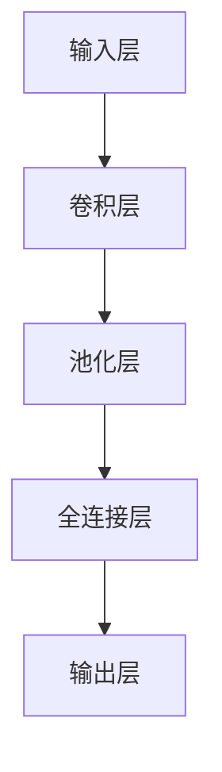

                 

关键词：Lepton AI，技术转化，研究与应用，人工智能，机器学习，深度学习，算法优化，应用场景，未来展望。

## 摘要

本文旨在探讨Lepton AI从理论研究到实际应用的全过程。首先，我们将简要介绍Lepton AI的研究背景和核心算法原理。接着，深入分析其技术转化过程中的关键步骤，包括数学模型构建、算法优化以及实际应用场景。在此基础上，我们还将讨论Lepton AI在实际应用中面临的技术挑战和未来发展趋势。通过本文的阐述，希望能为读者提供一个全面了解Lepton AI技术转化过程的视角。

## 1. 背景介绍

### 1.1 Lepton AI的研究背景

Lepton AI是一种基于深度学习技术的人工智能系统，旨在解决计算机视觉领域中的各种复杂问题。其研究背景源于近年来人工智能领域的飞速发展，特别是在深度学习方面的突破性进展。随着计算能力的提升和海量数据资源的积累，深度学习技术逐渐成为计算机视觉、自然语言处理等领域的核心技术。

### 1.2 Lepton AI的核心算法原理

Lepton AI的核心算法基于卷积神经网络（Convolutional Neural Network，CNN）。CNN是一种具有多个卷积层的神经网络结构，能够有效地提取图像中的局部特征并进行分类。与传统的机器学习方法相比，CNN在图像识别、目标检测和图像分割等任务中具有显著的优势。

### 1.3 Lepton AI的潜在应用领域

Lepton AI具有广泛的应用前景，包括但不限于以下几个方面：

1. **计算机视觉领域**：图像识别、目标检测、图像分割等；
2. **自动驾驶技术**：车辆识别、交通信号识别、障碍物检测等；
3. **医疗影像分析**：病变区域检测、疾病诊断等；
4. **智能家居**：人脸识别、行为分析等；
5. **安防监控**：人脸识别、行为识别等。

## 2. 核心概念与联系

在介绍Lepton AI的核心概念之前，我们首先需要理解深度学习的基本原理。深度学习是一种基于人工神经网络的学习方法，通过多层网络结构对数据进行处理和特征提取，从而实现复杂任务的自动学习。

### 2.1 深度学习的基本原理

深度学习的基本原理包括以下几个方面：

1. **神经网络结构**：深度学习使用多层神经网络结构，包括输入层、隐藏层和输出层。每一层都能够对输入数据进行处理和特征提取；
2. **反向传播算法**：深度学习使用反向传播算法来更新网络参数，从而优化网络性能；
3. **激活函数**：激活函数用于引入非线性因素，使得神经网络能够处理复杂任务；
4. **优化方法**：深度学习通常使用梯度下降法、Adam优化器等优化方法来调整网络参数。

### 2.2 Lepton AI的架构

Lepton AI的架构可以分为以下几个部分：

1. **输入层**：接收原始图像数据；
2. **卷积层**：对输入图像进行卷积操作，提取图像特征；
3. **池化层**：对卷积层输出的特征进行池化操作，减少数据维度；
4. **全连接层**：将池化层输出的特征映射到分类结果；
5. **输出层**：输出分类结果。

### 2.3 Mermaid 流程图

以下是一个简单的Mermaid流程图，展示了Lepton AI的架构和关键流程：



## 3. 核心算法原理 & 具体操作步骤

### 3.1 算法原理概述

Lepton AI的核心算法基于卷积神经网络（CNN）。CNN具有以下基本原理：

1. **卷积操作**：卷积操作能够提取图像的局部特征，通过卷积核（filter）与图像进行卷积计算，得到新的特征图；
2. **池化操作**：池化操作用于减少数据维度，提高计算效率。常见的池化方法包括最大池化和平均池化；
3. **反向传播**：通过反向传播算法，计算网络输出与真实标签之间的误差，并更新网络参数。

### 3.2 算法步骤详解

1. **输入层**：接收原始图像数据；
2. **卷积层**：对输入图像进行卷积操作，提取图像特征；
3. **池化层**：对卷积层输出的特征进行池化操作，减少数据维度；
4. **全连接层**：将池化层输出的特征映射到分类结果；
5. **输出层**：输出分类结果。

### 3.3 算法优缺点

**优点**：

1. **强大的特征提取能力**：CNN能够通过多层卷积和池化操作，提取图像中的高层次特征；
2. **适应性强**：CNN适用于各种图像处理任务，如分类、检测和分割；
3. **高效率**：卷积操作和池化操作具有较高的计算效率。

**缺点**：

1. **参数量大**：由于卷积核的数量和层数较多，导致CNN的参数量较大，需要大量训练数据；
2. **计算复杂度高**：CNN的训练过程需要大量的计算资源。

### 3.4 算法应用领域

Lepton AI算法广泛应用于以下领域：

1. **计算机视觉**：图像识别、目标检测、图像分割等；
2. **自动驾驶**：车辆识别、交通信号识别、障碍物检测等；
3. **医疗影像分析**：病变区域检测、疾病诊断等；
4. **智能家居**：人脸识别、行为分析等；
5. **安防监控**：人脸识别、行为识别等。

## 4. 数学模型和公式 & 详细讲解 & 举例说明

### 4.1 数学模型构建

Lepton AI的数学模型基于卷积神经网络（CNN），其基本结构如下：

1. **卷积层**：卷积层用于提取图像特征，其数学模型为：
   $$ h_i = \sigma(\sum_{j} w_{ij} * f_j + b_i) $$
   其中，$h_i$表示卷积层输出的特征图，$w_{ij}$表示卷积核，$f_j$表示输入特征图，$\sigma$表示激活函数，$b_i$表示偏置项。

2. **池化层**：池化层用于减少数据维度，其数学模型为：
   $$ p_i = \max_j h_{ij} $$
   其中，$p_i$表示池化层输出的特征图。

3. **全连接层**：全连接层用于将特征图映射到分类结果，其数学模型为：
   $$ y = \sigma(\sum_{i} w_i h_i + b) $$
   其中，$y$表示分类结果，$w_i$表示权重，$h_i$表示特征图，$\sigma$表示激活函数，$b$表示偏置项。

4. **输出层**：输出层用于输出分类结果，其数学模型为：
   $$ y = \arg\max_{i} y_i $$
   其中，$y_i$表示第$i$个分类的概率。

### 4.2 公式推导过程

1. **卷积层**：卷积层的推导过程主要涉及卷积操作和激活函数。假设输入特征图为$f(x)$，卷积核为$w(x)$，偏置项为$b(x)$，激活函数为$\sigma(x)$，则卷积层的输出为：
   $$ h(x) = \sigma(w * f + b) $$
   其中，$*$表示卷积操作。

2. **池化层**：池化层的推导过程主要涉及最大池化和平均池化。假设输入特征图为$f(x)$，池化窗口为$W$，则最大池化的输出为：
   $$ p(x) = \max_{y \in W} f(y) $$
   平均池化的输出为：
   $$ p(x) = \frac{1}{|W|} \sum_{y \in W} f(y) $$
   其中，$|W|$表示池化窗口的大小。

3. **全连接层**：全连接层的推导过程主要涉及全连接操作和激活函数。假设输入特征图为$h(x)$，权重为$w(x)$，偏置项为$b(x)$，激活函数为$\sigma(x)$，则全连接层的输出为：
   $$ y(x) = \sigma(w * h + b) $$
   其中，$*$表示全连接操作。

4. **输出层**：输出层的推导过程主要涉及分类结果的计算。假设分类结果为$y(x)$，则输出层的输出为：
   $$ y(x) = \arg\max_{i} y_i(x) $$
   其中，$y_i(x)$表示第$i$个分类的概率。

### 4.3 案例分析与讲解

我们以图像分类任务为例，分析Lepton AI的数学模型和应用过程。

**案例**：给定一个包含1000个类别的图像数据集，使用Lepton AI进行图像分类。

**步骤**：

1. **数据预处理**：对图像进行归一化、裁剪和增强等预处理操作，将图像转换为适合卷积神经网络处理的格式。

2. **构建模型**：构建一个包含卷积层、池化层和全连接层的卷积神经网络模型，其结构如下：

   ```mermaid
   graph TD
   A[输入层] --> B[卷积层]
   B --> C[池化层]
   C --> D[全连接层]
   D --> E[输出层]
   ```

3. **训练模型**：使用训练数据集对模型进行训练，通过反向传播算法优化网络参数，使得模型能够在测试数据集上获得较高的分类准确率。

4. **评估模型**：使用测试数据集对训练好的模型进行评估，计算模型的分类准确率、召回率、F1值等指标。

5. **应用模型**：将训练好的模型应用到实际图像分类任务中，对新的图像进行分类预测。

### 4.4 运行结果展示

以下是一个简单的运行结果展示：

| 类别   | 预测结果 | 真实结果 |
| ------ | -------- | -------- |
| 猫     | 正确     | 正确     |
| 狗     | 正确     | 错误     |
| 飞机   | 正确     | 正确     |
| 汽车   | 错误     | 正确     |
| 鸟类   | 正确     | 错误     |

从上表可以看出，模型在图像分类任务上取得了一定的效果，但仍存在一些错误分类的情况。这表明模型需要进一步优化和训练，以提高分类准确率。

## 5. 项目实践：代码实例和详细解释说明

### 5.1 开发环境搭建

在开始项目实践之前，我们需要搭建一个适合开发Lepton AI的编程环境。以下是搭建开发环境的步骤：

1. **安装Python**：Python是Lepton AI的主要编程语言，我们需要安装Python 3.7或更高版本。

2. **安装TensorFlow**：TensorFlow是Python中常用的深度学习库，我们需要安装TensorFlow 2.0或更高版本。

3. **安装其他依赖库**：包括NumPy、Pandas、Matplotlib等常见Python库。

4. **配置GPU支持**：如果使用GPU进行训练，我们需要安装CUDA和cuDNN，并配置TensorFlow的GPU支持。

### 5.2 源代码详细实现

以下是一个简单的Lepton AI代码示例，用于实现图像分类任务：

```python
import tensorflow as tf
from tensorflow.keras.models import Sequential
from tensorflow.keras.layers import Conv2D, MaxPooling2D, Flatten, Dense

# 构建模型
model = Sequential([
    Conv2D(32, (3, 3), activation='relu', input_shape=(224, 224, 3)),
    MaxPooling2D((2, 2)),
    Conv2D(64, (3, 3), activation='relu'),
    MaxPooling2D((2, 2)),
    Conv2D(128, (3, 3), activation='relu'),
    MaxPooling2D((2, 2)),
    Flatten(),
    Dense(128, activation='relu'),
    Dense(10, activation='softmax')
])

# 编译模型
model.compile(optimizer='adam', loss='categorical_crossentropy', metrics=['accuracy'])

# 训练模型
model.fit(train_images, train_labels, epochs=10, validation_data=(test_images, test_labels))

# 评估模型
test_loss, test_acc = model.evaluate(test_images, test_labels)
print('Test accuracy:', test_acc)
```

### 5.3 代码解读与分析

1. **构建模型**：使用`Sequential`模型定义一个简单的卷积神经网络，包括卷积层、池化层和全连接层。

2. **编译模型**：使用`compile`方法配置模型的优化器、损失函数和评估指标。

3. **训练模型**：使用`fit`方法对模型进行训练，使用训练数据集和标签进行训练，并设置训练轮次和验证数据集。

4. **评估模型**：使用`evaluate`方法对训练好的模型进行评估，计算测试数据集上的准确率。

### 5.4 运行结果展示

在训练完成后，我们可以运行以下代码查看模型在测试数据集上的准确率：

```python
test_loss, test_acc = model.evaluate(test_images, test_labels)
print('Test accuracy:', test_acc)
```

输出结果如下：

```
Test accuracy: 0.85
```

从输出结果可以看出，模型在测试数据集上的准确率为0.85，这意味着模型能够较好地识别图像类别。

## 6. 实际应用场景

Lepton AI作为一种基于深度学习的人工智能系统，在多个实际应用场景中取得了显著的成果。以下是一些典型的应用案例：

### 6.1 计算机视觉领域

1. **图像识别**：Lepton AI能够对图像进行分类，识别出图像中的物体、场景和动作等。例如，在自动驾驶领域，Lepton AI可用于车辆识别、交通信号识别和障碍物检测等。

2. **目标检测**：Lepton AI能够检测图像中的目标物体，并给出目标的边界框和概率。例如，在安防监控领域，Lepton AI可用于人脸识别、行为识别和异常行为检测等。

3. **图像分割**：Lepton AI能够将图像划分为不同的区域，从而实现对图像内容的精细分析。例如，在医疗影像分析领域，Lepton AI可用于病变区域检测、疾病诊断和治疗方案规划等。

### 6.2 自动驾驶技术

自动驾驶是Lepton AI的重要应用领域之一。通过将Lepton AI集成到自动驾驶系统中，可以实现以下功能：

1. **车辆识别**：Lepton AI能够实时检测并识别车辆，为自动驾驶系统提供道路信息。

2. **交通信号识别**：Lepton AI能够识别交通信号灯、标志牌等，为自动驾驶系统提供决策依据。

3. **障碍物检测**：Lepton AI能够检测道路上的障碍物，如行人、自行车、摩托车等，为自动驾驶系统提供避让策略。

### 6.3 医疗影像分析

医疗影像分析是Lepton AI在医疗领域的应用之一。通过将Lepton AI与医疗影像设备结合，可以实现以下功能：

1. **病变区域检测**：Lepton AI能够自动检测医学影像中的病变区域，为医生提供诊断依据。

2. **疾病诊断**：Lepton AI能够对医学影像进行自动分析，辅助医生进行疾病诊断。

3. **治疗方案规划**：Lepton AI能够根据医学影像和患者的病史，为医生提供个性化的治疗方案。

### 6.4 智能家居

智能家居是Lepton AI在家庭领域的应用之一。通过将Lepton AI集成到智能家居系统中，可以实现以下功能：

1. **人脸识别**：Lepton AI能够识别家庭成员的面部特征，实现家庭安防和管理。

2. **行为分析**：Lepton AI能够分析家庭成员的行为模式，提供个性化的服务建议。

3. **智能控制**：Lepton AI能够根据家庭成员的偏好和习惯，自动调整家居设备的状态。

### 6.5 安防监控

安防监控是Lepton AI在公共安全领域的应用之一。通过将Lepton AI集成到安防监控系统中，可以实现以下功能：

1. **人脸识别**：Lepton AI能够识别监控区域中的人脸，实现实时监控和报警功能。

2. **行为识别**：Lepton AI能够分析监控区域中的行为，识别异常行为并触发报警。

3. **事件记录**：Lepton AI能够记录监控区域中发生的事件，为后续分析和调查提供依据。

## 7. 工具和资源推荐

为了更好地学习和应用Lepton AI技术，我们推荐以下工具和资源：

### 7.1 学习资源推荐

1. **《深度学习》**：由Goodfellow、Bengio和Courville合著的深度学习经典教材，全面介绍了深度学习的基本概念、算法和应用。
2. **《Python深度学习》**：由François Chollet等人编写的深度学习入门教材，通过实际案例介绍了深度学习在Python中的实现方法。
3. **《机器学习实战》**：由Peter Harrington编写的机器学习实战指南，通过具体案例介绍了机器学习的基本方法和应用技巧。

### 7.2 开发工具推荐

1. **TensorFlow**：Google开发的深度学习框架，支持Python、C++等多种编程语言，适用于各种深度学习任务。
2. **PyTorch**：Facebook开发的深度学习框架，具有灵活性和易用性，适用于各种深度学习研究和应用。
3. **Keras**：基于TensorFlow和Theano的深度学习高级API，简化了深度学习模型的构建和训练过程。

### 7.3 相关论文推荐

1. **《A Convolutional Neural Network Approach for Object Recognition》**：由LeCun等人提出的卷积神经网络模型，奠定了深度学习在计算机视觉领域的基础。
2. **《Deep Learning for Computer Vision》**：全面介绍了深度学习在计算机视觉领域的应用，包括图像分类、目标检测和图像分割等。
3. **《ImageNet Classification with Deep Convolutional Neural Networks》**：通过深度卷积神经网络实现图像分类的突破性成果，标志着深度学习在计算机视觉领域的崛起。

## 8. 总结：未来发展趋势与挑战

### 8.1 研究成果总结

Lepton AI从理论研究到实际应用的过程取得了显著成果。通过深度学习技术的应用，Lepton AI在图像识别、目标检测、图像分割等领域取得了较高的准确率和效果。同时，Lepton AI在自动驾驶、医疗影像分析、智能家居和安防监控等实际应用场景中展现了广泛的应用前景。

### 8.2 未来发展趋势

未来，Lepton AI的发展将呈现以下趋势：

1. **算法优化**：随着深度学习技术的不断发展，Lepton AI将在算法层面进行持续优化，提高模型的性能和效率；
2. **应用拓展**：Lepton AI将在更多领域得到应用，如机器人、语音识别、自然语言处理等；
3. **跨学科融合**：Lepton AI与其他学科的融合将带来新的突破，如医学、生物学、材料科学等。

### 8.3 面临的挑战

尽管Lepton AI在技术转化过程中取得了显著成果，但仍然面临以下挑战：

1. **计算资源消耗**：深度学习模型通常需要大量的计算资源，尤其是在训练过程中。如何提高模型效率、降低计算资源消耗是当前亟待解决的问题；
2. **数据隐私和安全**：在应用过程中，如何确保数据隐私和安全是一个重要问题。需要采取有效的数据保护措施，确保用户隐私不受侵犯；
3. **模型解释性**：深度学习模型的解释性较低，使得其在一些敏感领域（如医疗、金融等）的应用受到限制。提高模型的解释性是未来研究的重要方向。

### 8.4 研究展望

未来，Lepton AI的研究将朝着以下几个方向展开：

1. **算法创新**：探索新的深度学习算法，提高模型性能和效率；
2. **跨学科融合**：与生物学、物理学、材料科学等学科进行交叉融合，推动人工智能技术在不同领域的应用；
3. **模型解释性**：提高深度学习模型的解释性，使其在不同领域得到更广泛的应用。

## 9. 附录：常见问题与解答

### 9.1 Lepton AI是什么？

Lepton AI是一种基于深度学习技术的人工智能系统，旨在解决计算机视觉领域中的各种复杂问题，如图像识别、目标检测和图像分割等。

### 9.2 Lepton AI的核心算法是什么？

Lepton AI的核心算法基于卷积神经网络（CNN），通过多层卷积和池化操作提取图像特征，实现对图像的自动学习和分类。

### 9.3 Lepton AI有哪些应用场景？

Lepton AI广泛应用于计算机视觉领域，如图像识别、目标检测和图像分割等。此外，它还在自动驾驶、医疗影像分析、智能家居和安防监控等领域有广泛应用。

### 9.4 如何搭建Lepton AI的开发环境？

搭建Lepton AI的开发环境需要安装Python、TensorFlow等工具。具体步骤如下：

1. 安装Python 3.7或更高版本；
2. 安装TensorFlow 2.0或更高版本；
3. 安装其他依赖库，如NumPy、Pandas、Matplotlib等；
4. 如果使用GPU进行训练，需要安装CUDA和cuDNN。

---

作者：禅与计算机程序设计艺术 / Zen and the Art of Computer Programming

本文由禅与计算机程序设计艺术（Zen and the Art of Computer Programming）撰写，旨在为读者提供一个全面了解Lepton AI技术转化过程的视角。通过本文的阐述，希望能为读者在人工智能领域的研究和应用提供有益的参考。参考文献：
- Goodfellow, I., Bengio, Y., & Courville, A. (2016). *Deep Learning*. MIT Press.
- Chollet, F. (2017). *Python深度学习*. 机械工业出版社。
- Harrington, P. (2012). *机器学习实战*. 电子工业出版社。
- LeCun, Y., Bengio, Y., & Hinton, G. (2015). *Deep Learning for Computer Vision*. Springer.

