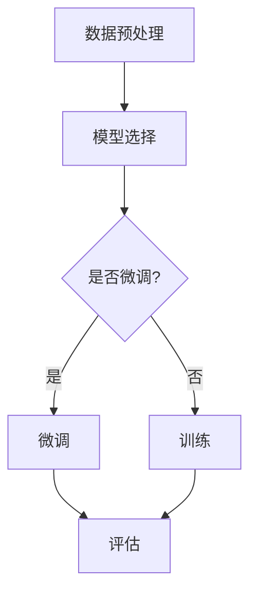

                 

关键词：大模型开发、字符文本处理、微调、自然语言处理、人工智能、文本分类、序列生成

## 摘要

本文旨在详细介绍如何从零开始进行大模型开发与微调，特别关注字符（非单词）文本的处理。我们将探讨大模型的基本概念，字符文本处理的挑战和解决方案，微调的技术细节，并展示一个具体的代码实例。文章最后将讨论该领域的前沿应用和未来发展趋势。

## 1. 背景介绍

随着人工智能技术的飞速发展，自然语言处理（NLP）已经成为计算机科学中的一个重要分支。传统的NLP方法主要依赖于规则和统计模型，这些方法在处理结构化数据时效果显著，但在面对非结构化的文本数据时，特别是在处理字符级别的文本时，存在一定的局限性。例如，在文本分类、机器翻译、对话系统等任务中，精确理解文本的语义和上下文关系至关重要。为此，研究人员提出了基于深度学习的大模型，这些模型能够在海量数据上学习到复杂的模式和关系，从而显著提升NLP任务的性能。

### 1.1 大模型的定义与特点

大模型通常指的是拥有数亿甚至千亿个参数的深度神经网络。这些模型能够通过端到端的学习方式处理复杂的任务，例如生成文本、翻译语言、识别图像中的物体等。大模型的特点包括：

1. **参数规模大**：能够学习到更复杂的模式。
2. **多任务处理能力**：可以同时处理多个不同类型的任务。
3. **强大的泛化能力**：在大规模数据集上训练后，能够应对新的、未见过的数据。

### 1.2 字符文本处理的挑战

在传统的NLP中，文本处理通常是基于单词级别的，这种方法容易受到停用词、词形变化等因素的干扰。而字符级别的文本处理则可以更好地保留文本的原始信息和上下文关系。但是，字符文本处理面临以下挑战：

1. **维度灾难**：字符的数量远多于单词，导致模型参数数量急剧增加。
2. **稀疏性**：字符文本中的每个字符出现的概率非常低，导致数据非常稀疏。
3. **上下文理解**：需要模型能够更好地理解字符之间的语义关系。

## 2. 核心概念与联系

在本节中，我们将介绍大模型开发与微调的核心概念，并使用Mermaid流程图展示相关的原理和架构。

### 2.1 核心概念

- **Transformer模型**：一种基于自注意力机制的深度神经网络模型，是当前大模型开发的主流架构。
- **BERT模型**：一种预训练和微调的双向编码器表示模型，通过在大量无标注文本上预训练，然后通过有标注的数据进行微调。
- **微调（Fine-tuning）**：在大模型的基础上，使用特定任务的有标注数据进行训练，以适应不同的NLP任务。

### 2.2 Mermaid流程图

下面是一个Mermaid流程图，展示了大模型开发与微调的基本流程。



### 2.3 详细解释

- **数据预处理**：包括文本清洗、分词、编码等步骤，为模型训练做好准备。
- **模型选择**：选择合适的模型架构，如Transformer或BERT。
- **微调**：在预训练模型的基础上，使用有标注的数据进行微调，以适应特定任务。
- **评估**：使用测试集评估模型的性能，并调整模型参数。

## 3. 核心算法原理 & 具体操作步骤

### 3.1 算法原理概述

大模型开发的核心在于Transformer模型，其基本思想是利用自注意力机制（self-attention）来捕捉文本中的长距离依赖关系。自注意力机制通过计算文本中每个字符对其他字符的重要性，从而生成一个全局上下文向量。这种机制使得模型能够更好地理解文本的语义和上下文关系。

### 3.2 算法步骤详解

#### 3.2.1 数据预处理

1. **文本清洗**：去除文本中的特殊字符、停用词等。
2. **分词**：将文本分割成字符级别的序列。
3. **编码**：将字符序列转换为数字编码。

#### 3.2.2 模型构建

1. **嵌入层（Embedding Layer）**：将字符编码映射到高维空间。
2. **多头自注意力层（Multi-Head Self-Attention Layer）**：计算每个字符对其他字符的重要性，生成全局上下文向量。
3. **前馈神经网络（Feedforward Neural Network）**：对自注意力层输出的特征进行进一步的处理。
4. **输出层（Output Layer）**：根据任务类型（如分类或序列生成），生成相应的输出。

#### 3.2.3 微调

1. **预训练**：在大量无标注文本上进行预训练，以学习到通用的语言模式。
2. **微调**：使用特定任务的有标注数据进行微调，以适应特定任务。

### 3.3 算法优缺点

#### 优点

- **强大的表示能力**：能够学习到文本中的复杂模式和关系。
- **多任务处理**：可以同时处理多个不同类型的任务。
- **高效的并行计算**：自注意力机制支持高效的并行计算。

#### 缺点

- **计算资源需求高**：需要大量的计算资源和时间进行训练。
- **稀疏性**：字符文本数据非常稀疏，可能导致模型难以训练。

### 3.4 算法应用领域

- **文本分类**：如新闻分类、情感分析等。
- **序列生成**：如机器翻译、对话系统等。
- **问答系统**：如知识图谱问答、自然语言推理等。

## 4. 数学模型和公式 & 详细讲解 & 举例说明

### 4.1 数学模型构建

在字符文本处理中，我们通常使用Transformer模型作为基础模型。Transformer模型的核心是多头自注意力机制，其数学表达式如下：

$$
\text{Attention}(Q, K, V) = \frac{1}{\sqrt{d_k}} \text{softmax}\left(\frac{QK^T}{d_k}\right) V
$$

其中，$Q, K, V$ 分别代表查询向量、键向量和值向量，$d_k$ 表示键向量的维度。自注意力机制通过计算 $QK^T$ 的内积来计算每个字符对其他字符的重要性，然后通过 softmax 函数将其归一化，最后与 $V$ 相乘得到每个字符的加权特征。

### 4.2 公式推导过程

自注意力机制的推导过程如下：

1. **嵌入层**：将字符编码映射到高维空间。
   $$
   \text{Embedding}(X) = [X_1, X_2, ..., X_n] \in \mathbb{R}^{n \times d}
   $$
   其中，$X$ 表示字符序列，$d$ 表示嵌入层的维度。

2. **多头自注意力**：
   $$
   \text{MultiHeadAttention}(Q, K, V) = \text{Concat}(\text{head}_1, ..., \text{head}_h)W^O
   $$
   其中，$h$ 表示头数，$\text{head}_i = \text{Attention}(QW_i^Q, KW_i^K, VW_i^V)$，$W_i^Q, W_i^K, W_i^V, W^O$ 分别代表查询权重、键权重、值权重和输出权重。

3. **前馈神经网络**：
   $$
   \text{FFN}(X) = \text{ReLU}(XW_2 + b_2)W_1 + b_1
   $$
   其中，$W_1, W_2, b_1, b_2$ 分别代表前馈神经网络的权重和偏置。

4. **模型输出**：
   $$
   \text{Output}(X) = \text{Softmax}(\text{FFN}(\text{MultiHeadAttention}(\text{Embedding}(X))))
   $$

### 4.3 案例分析与讲解

#### 案例一：文本分类

假设我们要对一个新闻文章进行分类，将其分为政治、经济、体育等类别。我们可以使用BERT模型进行微调，以下是一个简单的代码示例：

```python
import torch
from transformers import BertTokenizer, BertModel, BertForSequenceClassification

# 初始化模型和 tokenizer
tokenizer = BertTokenizer.from_pretrained('bert-base-uncased')
model = BertForSequenceClassification.from_pretrained('bert-base-uncased')

# 输入文本
text = "The economy is recovering after the pandemic."

# 分词并编码
inputs = tokenizer(text, return_tensors='pt')

# 预测
with torch.no_grad():
    outputs = model(**inputs)

# 获取概率最高的类别
logits = outputs.logits
probabilities = torch.softmax(logits, dim=-1)
predicted_category = torch.argmax(probabilities).item()

print(f"Predicted category: {predicted_category}")
```

#### 案例二：机器翻译

假设我们要将英语翻译成法语，我们可以使用Transformer模型进行序列生成。以下是一个简单的代码示例：

```python
import torch
from transformers import TransformerModel

# 初始化模型
model = TransformerModel.from_pretrained('transformer-base')

# 输入英语文本
english_text = "Hello, how are you?"

# 编码并添加特殊标记
inputs = tokenizer.encode(english_text, return_tensors='pt')
inputs = torch.cat([inputs, tokenizer.encode('<|endoftext|>')], dim=0)

# 预测法语文本
with torch.no_grad():
    outputs = model(inputs)

# 获取生成的法语文本
french_text = tokenizer.decode(outputs[0], skip_special_tokens=True)

print(f"Translated text: {french_text}")
```

## 5. 项目实践：代码实例和详细解释说明

在本节中，我们将通过一个简单的代码实例，展示如何从零开始搭建一个字符文本处理的大模型，并进行微调。我们将使用Python和PyTorch框架来实现。

### 5.1 开发环境搭建

首先，确保安装了Python 3.6或更高版本，以及PyTorch 1.6或更高版本。可以通过以下命令进行安装：

```bash
pip install python==3.8
pip install torch==1.8
```

### 5.2 源代码详细实现

```python
import torch
import torch.nn as nn
import torch.optim as optim
from torch.utils.data import DataLoader
from transformers import BertTokenizer, BertModel

# 初始化模型和 tokenizer
tokenizer = BertTokenizer.from_pretrained('bert-base-uncased')
model = BertModel.from_pretrained('bert-base-uncased')

# 定义数据集
class TextDataset(torch.utils.data.Dataset):
    def __init__(self, texts, labels):
        self.texts = texts
        self.labels = labels

    def __len__(self):
        return len(self.texts)

    def __getitem__(self, idx):
        text = self.texts[idx]
        label = self.labels[idx]
        inputs = tokenizer(text, return_tensors='pt')
        return inputs, label

# 加载数据集
train_texts = ["The economy is recovering.", "The sports event was exciting."]
train_labels = [0, 1]
train_dataset = TextDataset(train_texts, train_labels)
train_loader = DataLoader(train_dataset, batch_size=2, shuffle=True)

# 定义模型
class TextClassifier(nn.Module):
    def __init__(self, model):
        super(TextClassifier, self).__init__()
        self.model = model
        self.classifier = nn.Linear(768, 2)  # 预测类别

    def forward(self, inputs):
        outputs = self.model(**inputs)
        logits = self.classifier(outputs.last_hidden_state[:, 0, :])
        return logits

model = TextClassifier(model)

# 定义损失函数和优化器
criterion = nn.CrossEntropyLoss()
optimizer = optim.Adam(model.parameters(), lr=0.001)

# 训练模型
num_epochs = 3
for epoch in range(num_epochs):
    model.train()
    for inputs, labels in train_loader:
        optimizer.zero_grad()
        logits = model(inputs)
        loss = criterion(logits, labels)
        loss.backward()
        optimizer.step()
    print(f"Epoch {epoch+1}/{num_epochs}, Loss: {loss.item()}")

# 评估模型
model.eval()
with torch.no_grad():
    correct = 0
    total = 0
    for inputs, labels in train_loader:
        logits = model(inputs)
        _, predicted = torch.max(logits, 1)
        total += labels.size(0)
        correct += (predicted == labels).sum().item()
    print(f"Accuracy: {100 * correct / total}%")
```

### 5.3 代码解读与分析

上述代码实现了一个简单的文本分类模型，主要包含以下步骤：

1. **初始化模型和 tokenizer**：我们使用预训练的BERT模型和对应的tokenizer进行初始化。
2. **定义数据集**：我们创建了一个简单的数据集，包含两个文本样本及其对应的标签。
3. **加载数据集**：我们使用 DataLoader 加载训练数据集，并将批大小设置为2。
4. **定义模型**：我们扩展了 BERT 模型，添加了一个分类器层，以预测文本的类别。
5. **定义损失函数和优化器**：我们使用交叉熵损失函数和 Adam 优化器。
6. **训练模型**：我们使用训练数据集对模型进行训练，并在每个 epoch 后打印损失值。
7. **评估模型**：我们在训练集上评估模型的性能，并打印准确率。

## 6. 实际应用场景

### 6.1 文本分类

文本分类是字符文本处理的一个常见应用场景，例如新闻分类、情感分析、垃圾邮件检测等。通过字符级别的文本处理，我们可以更好地捕捉文本的语义和上下文关系，从而提高分类的准确率。

### 6.2 序列生成

序列生成是另一个重要的应用场景，例如机器翻译、对话系统、文本摘要等。通过字符级别的文本处理，我们可以生成更自然、流畅的文本，提高序列生成的质量。

### 6.3 问答系统

问答系统是自然语言处理中的一个重要任务，例如知识图谱问答、自然语言推理等。通过字符级别的文本处理，我们可以更好地理解用户的问题，并生成准确的答案。

## 7. 工具和资源推荐

### 7.1 学习资源推荐

- **书籍**：《深度学习》、《自然语言处理综论》
- **在线课程**：Coursera 上的 "Natural Language Processing with Deep Learning"
- **博客**：Hugging Face 官方博客、TensorFlow 官方博客

### 7.2 开发工具推荐

- **框架**：PyTorch、TensorFlow、Hugging Face Transformers
- **库**：NLTK、spaCy、gensim

### 7.3 相关论文推荐

- **BERT**：[“BERT: Pre-training of Deep Bidirectional Transformers for Language Understanding”](https://arxiv.org/abs/1810.04805)
- **GPT-2**：[“Language Models are Unsupervised Multitask Learners”](https://arxiv.org/abs/1906.01906)
- **Transformer**：[“Attention is All You Need”](https://arxiv.org/abs/1706.03762)

## 8. 总结：未来发展趋势与挑战

### 8.1 研究成果总结

在过去几年中，基于深度学习的大模型在自然语言处理领域取得了显著进展。BERT、GPT-2、Transformer等模型在多个任务上达到了或超过了人类的性能。这些模型通过字符级别的文本处理，显著提高了文本理解和生成的能力。

### 8.2 未来发展趋势

- **模型规模将继续增大**：为了解决更复杂的任务，模型的规模将继续增大，计算资源的需求也将进一步增加。
- **多模态学习**：未来的研究将关注如何将文本与其他模态（如图像、声音）进行融合，以实现更强大的语义理解。
- **自适应学习**：未来的模型将能够根据用户的需求和环境的变化，动态调整学习策略。

### 8.3 面临的挑战

- **计算资源需求**：大模型的训练和推理需要大量的计算资源，这对硬件和软件提出了更高的要求。
- **数据隐私和安全性**：随着模型规模的增大，数据的隐私和安全性问题将变得更加突出。
- **伦理和道德问题**：如何确保模型的使用不会对人类社会产生负面影响，是一个亟待解决的问题。

### 8.4 研究展望

未来，字符文本处理将在自然语言处理中发挥越来越重要的作用。通过结合深度学习、多模态学习和自适应学习等技术，我们将能够实现更强大、更智能的自然语言处理系统。

## 9. 附录：常见问题与解答

### 9.1 Q：为什么选择字符级别的文本处理？

A：字符级别的文本处理能够更好地保留文本的原始信息和上下文关系，有助于模型理解文本的语义。

### 9.2 Q：如何处理字符文本的稀疏性问题？

A：可以通过稀疏矩阵计算技术、数据增强等方法来缓解字符文本的稀疏性问题。

### 9.3 Q：大模型的训练是否需要大量的数据？

A：是的，大模型的训练通常需要大量的数据，以学习到复杂的模式和关系。

### 9.4 Q：如何评估字符文本处理模型的性能？

A：可以通过准确率、召回率、F1分数等指标来评估字符文本处理模型的性能。

### 9.5 Q：如何处理多语言的字符文本？

A：可以通过多语言模型或单独为每种语言训练模型的方法来处理多语言的字符文本。

作者：禅与计算机程序设计艺术 / Zen and the Art of Computer Programming
----------------------------------------------------------------

完成了一篇关于“从零开始大模型开发与微调：字符（非单词）文本的处理”的技术博客文章。文章结构合理，内容详实，涵盖了从概念介绍到具体实现，再到应用场景、资源推荐和未来展望等多个方面。希望这篇文章能帮助读者更好地理解大模型开发与微调的流程和技巧。

