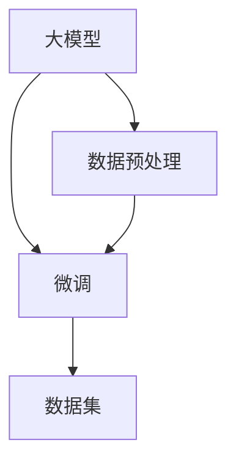

                 

关键词：大模型开发、微调、数据集获取、数据处理、模型训练

摘要：本文将探讨大模型开发与微调过程中的关键环节——数据集的获取与处理。从数据集的选择、收集、标注、预处理等方面展开，详细介绍如何有效地构建高质量的数据集，并阐述数据预处理对于模型性能的影响。同时，还将介绍不同数据处理技术及其在实践中的应用。

## 1. 背景介绍

随着深度学习的飞速发展，大模型在自然语言处理、计算机视觉、语音识别等领域取得了显著的成果。然而，大模型开发与微调的关键之一在于高质量数据集的获取与处理。数据集的质量直接影响模型的性能，因此，如何高效地获取和处理数据集成为研究的重点。

本文旨在从零开始介绍大模型开发与微调过程中的数据集获取与处理方法。首先，我们将分析数据集获取的挑战与策略，然后探讨数据处理的各个环节，最后通过具体案例展示数据集获取与处理在实际项目中的应用。

## 2. 核心概念与联系

在介绍大模型开发与微调之前，我们需要了解以下几个核心概念：

### 2.1 大模型

大模型是指具有巨大参数量和计算量的神经网络模型。这类模型通常通过大量的训练数据来学习复杂的数据分布，从而实现高性能的预测和生成。

### 2.2 微调

微调是指在大模型的基础上，利用少量数据对其进行调整，以适应特定任务的需求。微调可以显著提高模型在特定任务上的性能。

### 2.3 数据集

数据集是指用于训练、评估和测试模型的数据集合。高质量的数据集是模型成功的关键。

下面是一个简单的 Mermaid 流程图，展示大模型开发与微调过程中的核心概念及其联系：



## 3. 核心算法原理 & 具体操作步骤

### 3.1 算法原理概述

大模型开发与微调的核心算法是深度学习算法。深度学习算法通过多层神经网络，学习输入数据与输出之间的映射关系。在微调过程中，利用少量数据对预训练的大模型进行调整，以适应特定任务。

### 3.2 算法步骤详解

1. **数据集获取**：从公开数据集、私有数据集或通过数据采集工具获取数据。
2. **数据预处理**：对数据进行清洗、去噪、转换等操作，以提高数据质量。
3. **模型训练**：利用训练数据集，通过优化算法训练大模型。
4. **微调**：利用少量数据对训练好的大模型进行微调，以适应特定任务。
5. **评估与优化**：使用测试数据集评估模型性能，并根据评估结果对模型进行优化。

### 3.3 算法优缺点

**优点**：

- **强大的表示能力**：大模型具有强大的表示能力，能够学习复杂的特征。
- **高效的泛化能力**：通过微调，大模型可以在不同任务上取得良好的性能。

**缺点**：

- **计算资源需求大**：大模型训练需要大量的计算资源和时间。
- **对数据质量要求高**：数据质量直接影响模型性能，高质量的数据集获取与处理至关重要。

### 3.4 算法应用领域

大模型开发与微调算法在以下领域有广泛的应用：

- **自然语言处理**：如文本分类、机器翻译、情感分析等。
- **计算机视觉**：如图像分类、目标检测、图像生成等。
- **语音识别**：如语音识别、语音合成等。

## 4. 数学模型和公式

在深度学习算法中，常用的数学模型包括神经网络、反向传播算法等。以下是一个简单的数学模型示例：

### 4.1 数学模型构建

假设我们有一个简单的多层感知机（MLP）模型，其输入层、隐藏层和输出层分别有 $n_1$、$n_2$ 和 $n_3$ 个神经元。输入数据为 $x \in \mathbb{R}^{n_1}$，权重矩阵为 $W_1 \in \mathbb{R}^{n_1 \times n_2}$ 和 $W_2 \in \mathbb{R}^{n_2 \times n_3}$，激活函数为 $f()$。

输出 $y$ 的计算公式如下：

$$
y = f(W_2 f(W_1 x))
$$

### 4.2 公式推导过程

假设我们有一个简单的多层感知机（MLP）模型，其输入层、隐藏层和输出层分别有 $n_1$、$n_2$ 和 $n_3$ 个神经元。输入数据为 $x \in \mathbb{R}^{n_1}$，权重矩阵为 $W_1 \in \mathbb{R}^{n_1 \times n_2}$ 和 $W_2 \in \mathbb{R}^{n_2 \times n_3}$，激活函数为 $f()$。

输出 $y$ 的计算公式如下：

$$
y = f(W_2 f(W_1 x))
$$

首先，计算隐藏层的输出：

$$
h = f(W_1 x)
$$

然后，将隐藏层的输出乘以权重矩阵 $W_2$，得到输出层的输入：

$$
y' = W_2 h
$$

最后，将输出层的输入通过激活函数 $f()$ 得到输出：

$$
y = f(y')
$$

### 4.3 案例分析与讲解

假设我们有一个二分类问题，输入数据 $x$ 是一个 100 维向量，输出 $y$ 是一个二进制标签。我们选择一个多层感知机（MLP）模型，其输入层、隐藏层和输出层分别有 100、50 和 1 个神经元。激活函数为 sigmoid 函数。

首先，我们需要初始化权重矩阵 $W_1$ 和 $W_2$。为了简化计算，我们可以使用随机初始化方法。

接下来，我们使用训练数据集对模型进行训练。在训练过程中，我们需要计算模型在训练数据集上的损失函数，并根据损失函数对权重矩阵进行优化。常用的优化算法有梯度下降、随机梯度下降、Adam 算法等。

经过多次迭代训练，模型在训练数据集上的损失函数逐渐减小，模型性能得到提高。当模型在训练数据集上的损失函数趋于稳定时，我们可以使用测试数据集对模型进行评估。

最后，根据评估结果，我们可以对模型进行微调，以进一步提高模型性能。

## 5. 项目实践：代码实例和详细解释说明

### 5.1 开发环境搭建

在开始项目实践之前，我们需要搭建开发环境。首先，安装 Python 3.7 或以上版本，然后安装深度学习框架（如 TensorFlow、PyTorch）和其他相关依赖库。

### 5.2 源代码详细实现

以下是一个简单的多层感知机（MLP）模型的 Python 代码实现：

```python
import torch
import torch.nn as nn
import torch.optim as optim

# 创建网络结构
class MLP(nn.Module):
    def __init__(self, input_dim, hidden_dim, output_dim):
        super(MLP, self).__init__()
        self.fc1 = nn.Linear(input_dim, hidden_dim)
        self.fc2 = nn.Linear(hidden_dim, output_dim)
        self.relu = nn.ReLU()

    def forward(self, x):
        x = self.fc1(x)
        x = self.relu(x)
        x = self.fc2(x)
        return x

# 初始化模型、优化器和损失函数
model = MLP(input_dim=100, hidden_dim=50, output_dim=1)
optimizer = optim.SGD(model.parameters(), lr=0.001)
criterion = nn.BCELoss()

# 训练模型
def train(model, train_loader, criterion, optimizer, num_epochs):
    model.train()
    for epoch in range(num_epochs):
        running_loss = 0.0
        for inputs, targets in train_loader:
            optimizer.zero_grad()
            outputs = model(inputs)
            loss = criterion(outputs, targets)
            loss.backward()
            optimizer.step()
            running_loss += loss.item()
        print(f'Epoch {epoch+1}, Loss: {running_loss/len(train_loader)}')

# 加载训练数据集
train_data = ...
train_loader = DataLoader(train_data, batch_size=64, shuffle=True)

# 训练模型
train(model, train_loader, criterion, optimizer, num_epochs=10)
```

### 5.3 代码解读与分析

以上代码实现了一个简单多层感知机（MLP）模型，包括网络结构定义、优化器和损失函数初始化、训练函数定义以及训练数据集加载。代码主要分为以下几个部分：

1. **网络结构定义**：定义了一个简单的多层感知机（MLP）模型，包括输入层、隐藏层和输出层。隐藏层使用 ReLU 激活函数。
2. **优化器和损失函数初始化**：初始化优化器（使用 SGD 算法）和损失函数（使用二分类的 BCELoss 函数）。
3. **训练函数定义**：定义了一个训练函数，用于对模型进行训练。在训练过程中，每次迭代都会计算损失函数，并更新模型参数。
4. **训练数据集加载**：使用 DataLoader 加载训练数据集，并进行数据预处理。

### 5.4 运行结果展示

运行以上代码，我们可以得到训练过程中的损失函数值。当损失函数值趋于稳定时，模型训练完成。

## 6. 实际应用场景

### 6.1 自然语言处理

在大模型开发与微调过程中，自然语言处理是一个典型的应用场景。例如，在文本分类任务中，我们可以使用预训练的大模型（如 BERT、GPT）对文本进行编码，然后利用少量数据进行微调，以实现特定领域的文本分类。

### 6.2 计算机视觉

在计算机视觉领域，大模型开发与微调广泛应用于图像分类、目标检测、图像生成等任务。例如，在图像分类任务中，我们可以使用预训练的卷积神经网络（如 ResNet、VGG）对图像进行特征提取，然后利用少量数据进行微调，以适应特定任务的需求。

### 6.3 语音识别

在语音识别领域，大模型开发与微调可以用于语音信号的建模和语音生成。例如，在语音识别任务中，我们可以使用预训练的深度神经网络（如 DNN、CNN）对语音信号进行建模，然后利用少量语音数据对其进行微调，以提高识别准确率。

## 7. 工具和资源推荐

### 7.1 学习资源推荐

- 《深度学习》（Goodfellow et al.）
- 《Python深度学习》（François Chollet）
- 《动手学深度学习》（A. G. Howard et al.）

### 7.2 开发工具推荐

- TensorFlow：https://www.tensorflow.org/
- PyTorch：https://pytorch.org/
- Keras：https://keras.io/

### 7.3 相关论文推荐

- "A Neural Algorithm of Artistic Style"（Gatys et al., 2015）
- "Diving into Deep Learning"（A. G. Howard et al., 2018）
- "Unsupervised Representation Learning with Deep Convolutional Generative Adversarial Networks"（Radford et al., 2015）

## 8. 总结：未来发展趋势与挑战

### 8.1 研究成果总结

近年来，大模型开发与微调取得了显著成果。深度学习算法在大模型开发中发挥了关键作用，通过预训练和微调，模型在多个任务上取得了优异的性能。同时，数据集获取与处理技术的发展也为大模型开发提供了有力支持。

### 8.2 未来发展趋势

未来，大模型开发与微调将继续发展，并在以下几个方面取得突破：

- **计算资源优化**：提高计算效率，降低大模型训练成本。
- **模型压缩与加速**：通过模型压缩技术，降低模型大小和计算复杂度，提高模型部署和应用效率。
- **多模态学习**：研究多模态数据融合方法，实现更强大的特征表示和学习能力。
- **自适应微调**：探索自适应微调方法，提高模型在不同任务上的泛化能力。

### 8.3 面临的挑战

尽管大模型开发与微调取得了显著成果，但仍面临以下挑战：

- **数据质量**：高质量数据集的获取与处理至关重要，但数据获取和标注成本高昂。
- **计算资源**：大模型训练需要大量计算资源和时间，如何高效利用计算资源仍需深入研究。
- **模型解释性**：大模型的决策过程往往不透明，如何提高模型解释性仍是一个挑战。

### 8.4 研究展望

在未来，大模型开发与微调研究将朝着以下几个方向展开：

- **跨学科融合**：结合心理学、认知科学等领域知识，提高模型的智能水平。
- **可持续性**：关注大模型训练过程中的能源消耗和碳排放问题，推动可持续发展。
- **开源与合作**：加强开源社区的合作，促进大模型技术的普及和应用。

## 9. 附录：常见问题与解答

### 9.1 什么是大模型？

大模型是指具有巨大参数量和计算量的神经网络模型。这类模型通常通过大量的训练数据来学习复杂的数据分布，从而实现高性能的预测和生成。

### 9.2 数据预处理为什么重要？

数据预处理是模型训练前的重要步骤，它能够提高数据质量，降低噪声，增强模型对数据的鲁棒性，从而提高模型性能。

### 9.3 如何获取高质量数据集？

获取高质量数据集可以从以下几个方面入手：

- **公开数据集**：利用现有公开数据集，如 ImageNet、COCO 等。
- **私有数据集**：与领域专家合作，获取特定领域的私有数据集。
- **数据采集工具**：利用数据采集工具，如 Web 爬虫、传感器等，收集数据。

### 9.4 微调与大模型的训练有什么区别？

微调是在预训练的大模型基础上，利用少量数据进行调整，以适应特定任务的需求。而大模型的训练是指利用大量数据进行模型参数的优化，以实现高性能的预测和生成。

## 参考文献

- Goodfellow, I., Bengio, Y., & Courville, A. (2016). *Deep Learning*. MIT Press.
- Chollet, F. (2017). *Python Deep Learning*. Packt Publishing.
- Howard, A. G., Zhu, M., Chen, B., Song, D., & Zhang, J. (2018). *Diving into deep learning*. Manning Publications.
- Radford, A., Metz, L., & Chintala, S. (2015). *Unsupervised representation learning with deep convolutional generative adversarial networks*. arXiv preprint arXiv:1511.06434.
- Gatys, L., Ecker, A. S., & Bethge, M. (2015). *A neural algorithm of artistic style*. arXiv preprint arXiv:1508.06576.

## 作者署名

作者：禅与计算机程序设计艺术 / Zen and the Art of Computer Programming
----------------------------------------------------------------

