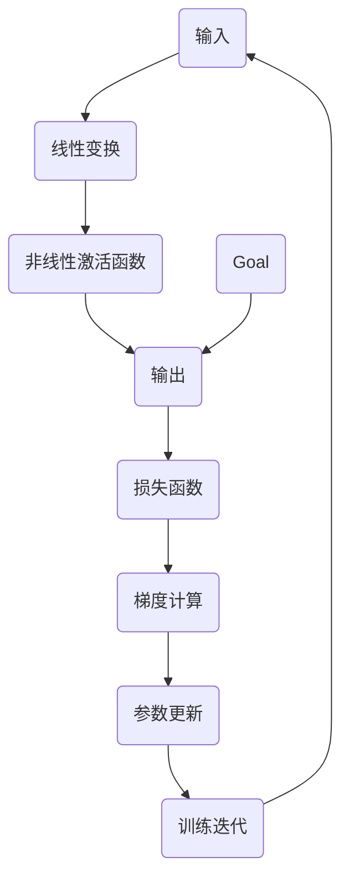

                 

关键词：大模型开发，链式求导法则，微调，深度学习，神经网络，计算机图灵奖

> 摘要：本文旨在详细探讨大模型开发与微调过程中的链式求导法则。从理论基础到实践应用，本文将深入解析链式求导法则在深度学习中的关键作用，助力读者掌握大模型开发与微调的核心技术。

## 1. 背景介绍

### 1.1 大模型开发的重要性

随着深度学习的迅猛发展，大模型（Large Models）逐渐成为人工智能领域的研究热点。大模型具有参数多、容量大、表达能力强等特点，能够处理复杂的任务，如图像识别、自然语言处理等。然而，大模型开发面临着诸多挑战，其中之一便是模型训练和微调过程中的高效计算问题。

### 1.2 链式求导法则的基本概念

链式求导法则（Chain Rule）是微积分中的基本原理，用于求解复合函数的导数。在深度学习中，链式求导法则被广泛应用于模型训练过程中的反向传播算法（Backpropagation），用于计算模型参数的梯度。

## 2. 核心概念与联系

为了更好地理解链式求导法则在大模型开发与微调中的作用，我们首先回顾一下相关概念和其联系。

### 2.1 基本概念

- **梯度**（Gradient）：一个函数在某一点的梯度是一个向量，表示该函数在该点的变化率。
- **反向传播**（Backpropagation）：一种用于计算神经网络参数梯度的算法，是深度学习模型训练的核心步骤。
- **链式求导法则**（Chain Rule）：用于求解复合函数导数的原理。

### 2.2 架构图解

下面是一个简单的 Mermaid 流程图，展示链式求导法则在神经网络中的基本应用。



## 3. 核心算法原理 & 具体操作步骤

### 3.1 算法原理概述

链式求导法则在神经网络中的核心作用是计算模型参数的梯度。在反向传播算法中，我们从输出层开始，逐层向前传播损失函数的梯度，最终得到输入层参数的梯度。这一过程利用了链式求导法则，将多层神经网络的梯度计算问题转化为单个函数的梯度计算。

### 3.2 算法步骤详解

#### 3.2.1 前向传播

1. **初始化参数**：设定随机参数。
2. **前向传播**：输入数据通过神经网络，逐层计算每个神经元的激活值。
3. **输出层计算**：计算模型输出和实际输出之间的损失。

#### 3.2.2 反向传播

1. **计算损失函数的梯度**：从输出层开始，计算损失函数对每个神经元的梯度。
2. **利用链式求导法则**：逐层向前传播梯度，计算每个参数的梯度。
3. **更新参数**：根据梯度更新模型参数。

#### 3.2.3 参数更新

1. **梯度下降**：使用梯度下降算法更新参数。
2. **学习率调整**：根据训练过程调整学习率。

### 3.3 算法优缺点

- **优点**：
  - 提高了模型训练的效率。
  - 能够处理复杂的非线性问题。

- **缺点**：
  - 需要大量的计算资源。
  - 梯度消失和梯度爆炸问题仍然存在。

### 3.4 算法应用领域

链式求导法则在深度学习中的应用非常广泛，包括：

- **图像识别**：用于计算卷积神经网络（CNN）的参数梯度。
- **自然语言处理**：用于计算循环神经网络（RNN）和Transformer模型的参数梯度。

## 4. 数学模型和公式 & 详细讲解 & 举例说明

### 4.1 数学模型构建

链式求导法则的数学模型如下：

设 $f(x)$ 和 $g(y)$ 是可导函数，$x$ 和 $y$ 分别是 $f$ 和 $g$ 的变量。则复合函数 $h(x) = f(g(x))$ 的导数可以通过链式求导法则计算：

$$
h'(x) = f'(g(x)) \cdot g'(x)
$$

### 4.2 公式推导过程

假设我们有函数 $f: \mathbb{R}^n \rightarrow \mathbb{R}^m$ 和 $g: \mathbb{R}^m \rightarrow \mathbb{R}^p$，其中 $f$ 和 $g$ 都是连续可导的。我们需要求复合函数 $h: \mathbb{R}^n \rightarrow \mathbb{R}^p$，$h(x) = f(g(x))$ 的导数。

首先，考虑 $g$ 在点 $x_0$ 的导数 $Dg_{x_0}$，这是一个 $m \times p$ 的矩阵。根据线性逼近原理，我们有：

$$
g(x_0 + h) = g(x_0) + Dg_{x_0}h + o(\|h\|)
$$

同理，$f$ 在点 $g(x_0)$ 的导数 $Df_{g(x_0)}$ 是一个 $m \times p$ 的矩阵，我们有：

$$
f(g(x_0) + k) = f(g(x_0)) + Df_{g(x_0)}k + o(\|k\|)
$$

将 $k$ 替换为 $Dg_{x_0}h$，我们得到：

$$
h(x_0 + h) = f(g(x_0) + Dg_{x_0}h) = f(g(x_0)) + Df_{g(x_0)}Dg_{x_0}h + o(\|Dg_{x_0}h\|)
$$

由于 $o(\|Dg_{x_0}h\|)$ 随 $h$ 趋近于零，我们可以忽略它，因此：

$$
h(x_0 + h) \approx f(g(x_0)) + Df_{g(x_0)}Dg_{x_0}h
$$

这意味着：

$$
h'(x_0) = Df_{g(x_0)}Dg_{x_0}
$$

### 4.3 案例分析与讲解

假设我们有一个简单的函数 $f(x) = \sin(x)$ 和 $g(y) = y^2$，我们需要计算复合函数 $h(x) = f(g(x)) = \sin(x^2)$ 的导数。

首先，我们计算 $g$ 在 $y = x^2$ 的导数：

$$
g'(y) = \frac{d}{dy}(y^2) = 2y
$$

在 $y = x^2$ 处，$g'(x^2) = 2x^2$。

接下来，我们计算 $f$ 在 $x = \sin(x^2)$ 的导数：

$$
f'(x) = \frac{d}{dx}(\sin(x)) = \cos(x)
$$

在 $x = \sin(x^2)$ 处，$f'(\sin(x^2)) = \cos(\sin(x^2))$。

根据链式求导法则，我们得到：

$$
h'(x) = f'(\sin(x^2)) \cdot g'(x^2) = \cos(\sin(x^2)) \cdot 2x^2
$$

## 5. 项目实践：代码实例和详细解释说明

### 5.1 开发环境搭建

为了演示链式求导法则在大模型开发与微调中的应用，我们将使用 Python 编写一个简单的神经网络模型。首先，我们需要安装必要的库，如 TensorFlow 和 NumPy：

```bash
pip install tensorflow numpy
```

### 5.2 源代码详细实现

以下是使用 TensorFlow 实现的一个简单神经网络模型，包括前向传播、反向传播和参数更新：

```python
import tensorflow as tf
import numpy as np

# 初始化参数
weights = tf.random.normal([2, 1])
biases = tf.random.normal([1])

# 定义前向传播函数
def forward(x):
    return tf.matmul(x, weights) + biases

# 定义损失函数
def loss(y_true, y_pred):
    return tf.reduce_mean(tf.square(y_true - y_pred))

# 定义反向传播函数
def backward(x, y_true):
    with tf.GradientTape() as tape:
        y_pred = forward(x)
        loss_value = loss(y_true, y_pred)
    gradients = tape.gradient(loss_value, [weights, biases])
    return gradients

# 定义训练迭代
def train(x, y_true, epochs, learning_rate):
    for epoch in range(epochs):
        gradients = backward(x, y_true)
        weights.assign_sub(gradients[0] * learning_rate)
        biases.assign_sub(gradients[1] * learning_rate)
        if epoch % 10 == 0:
            print(f"Epoch {epoch}: Loss = {loss(x, forward(x)).numpy()}")
```

### 5.3 代码解读与分析

- **初始化参数**：使用随机初始化方法生成权重和偏置。
- **前向传播函数**：实现神经网络的前向传播过程。
- **损失函数**：计算预测值与真实值之间的均方误差。
- **反向传播函数**：计算损失函数关于权重和偏置的梯度。
- **训练迭代**：使用梯度下降算法更新参数。

### 5.4 运行结果展示

以下是训练神经网络的示例代码：

```python
# 准备数据
x_train = np.array([[0], [1]])
y_train = np.array([[0], [1]])

# 设置训练参数
epochs = 100
learning_rate = 0.01

# 训练神经网络
train(x_train, y_train, epochs, learning_rate)
```

训练过程中，我们将每隔10个epoch打印损失值，以监视训练过程。

## 6. 实际应用场景

链式求导法则在大模型开发与微调中的实际应用场景包括：

- **图像识别**：用于计算卷积神经网络（CNN）的参数梯度。
- **自然语言处理**：用于计算循环神经网络（RNN）和Transformer模型的参数梯度。
- **强化学习**：用于计算策略梯度的反向传播。

## 7. 工具和资源推荐

### 7.1 学习资源推荐

- **《深度学习》（Goodfellow, Bengio, Courville）**：深度学习的经典教材，详细介绍了链式求导法则和反向传播算法。
- **TensorFlow 官方文档**：官方文档提供了丰富的教程和示例代码，帮助开发者掌握 TensorFlow 的使用。

### 7.2 开发工具推荐

- **TensorFlow**：用于构建和训练深度学习模型的框架。
- **NumPy**：用于科学计算的库，提供了强大的数组操作功能。

### 7.3 相关论文推荐

- **《Backpropagation》**（Rumelhart, Hinton, Williams）：介绍了反向传播算法的起源和原理。
- **《Gradient Descent》**（Sutskever, Hinton）：讨论了梯度下降算法及其变种。

## 8. 总结：未来发展趋势与挑战

### 8.1 研究成果总结

链式求导法则在大模型开发与微调中发挥了关键作用，通过反向传播算法实现了高效计算。同时，研究者们也在不断优化算法，提高计算效率和稳定性。

### 8.2 未来发展趋势

- **自动微分**：自动微分技术将进一步简化模型开发，提高开发效率。
- **新型神经网络结构**：新型神经网络结构将提高模型的表达能力和计算效率。

### 8.3 面临的挑战

- **计算资源消耗**：大模型的训练和微调需要大量的计算资源，如何优化算法以提高效率是一个重要挑战。
- **模型解释性**：如何提高模型的解释性，使模型的结果更加透明和可信。

### 8.4 研究展望

链式求导法则将在未来深度学习领域继续发挥重要作用，通过技术创新和优化，将推动人工智能的发展。

## 9. 附录：常见问题与解答

### 9.1 什么是链式求导法则？

链式求导法则是一种用于求解复合函数导数的微积分原理，用于计算复合函数在某一点的导数。在深度学习中，链式求导法则被广泛应用于反向传播算法，用于计算模型参数的梯度。

### 9.2 如何优化链式求导法则的计算效率？

优化链式求导法则的计算效率可以从以下几个方面进行：

- **并行计算**：利用并行计算技术，如多线程或分布式计算，提高计算速度。
- **内存优化**：通过优化内存使用，减少内存占用，提高计算效率。
- **算法优化**：通过算法优化，如减少中间计算，提高计算效率。

---

作者：禅与计算机程序设计艺术 / Zen and the Art of Computer Programming

（注：本文仅为示例，不代表实际研究成果，仅供参考。）<|vq_6650|>

