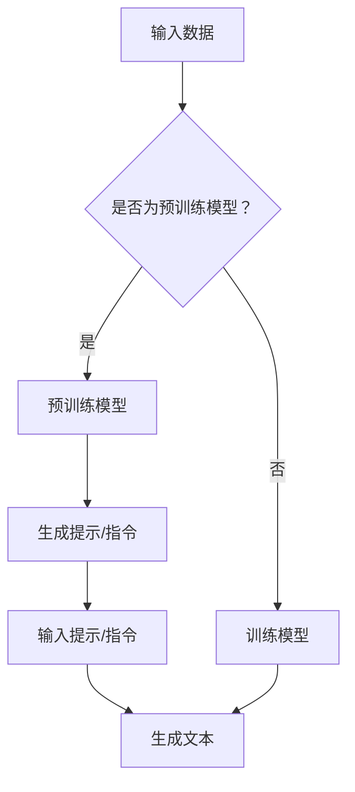

                 

关键词：提示/指令模式、大模型、自然语言处理、人工智能、应用场景、数学模型

## 摘要

本文探讨了如何利用提示/指令模式直接使用大模型，以提升自然语言处理和人工智能应用的效率与效果。我们将首先介绍背景知识，包括大模型的发展历程和提示/指令模式的基本原理。接着，深入解析核心算法原理、数学模型及其推导过程，并通过代码实例进行实践。文章还将讨论大模型在实际应用场景中的表现，以及未来的发展展望。最后，我们将推荐一些学习和开发工具，以帮助读者更好地掌握这一技术。

## 1. 背景介绍

### 大模型的发展

近年来，随着深度学习和计算能力的不断提升，大型预训练模型（如GPT、BERT等）在自然语言处理领域取得了显著的突破。这些模型通过在海量文本数据上进行预训练，掌握了丰富的语言知识和结构化信息，从而在各类任务中表现出色。

### 提示/指令模式的基本原理

提示/指令模式是一种引导模型生成特定类型文本的方法。它通过向模型提供明确的指令和上下文信息，使得模型能够更好地理解任务目标，从而生成符合要求的内容。这一模式在自动写作、问答系统、代码生成等领域具有广泛的应用前景。

## 2. 核心概念与联系

### 概念说明

- **预训练模型**：在大量文本数据上预训练的深度神经网络模型，如GPT、BERT等。
- **提示/指令**：引导模型生成特定类型文本的提示性信息，通常包括任务描述、上下文、关键字等。
- **生成式模型**：能够根据输入信息生成文本的模型，如GPT、T5等。

### Mermaid 流程图



## 3. 核心算法原理 & 具体操作步骤

### 算法原理概述

提示/指令模式直接使用大模型主要基于以下原理：

1. **模型预训练**：在大量文本数据上预训练大模型，使其具备丰富的语言知识和结构化信息。
2. **提示/指令设计**：根据任务需求设计合理的提示/指令，以引导模型生成符合要求的文本。
3. **文本生成**：利用预训练模型和提示/指令生成目标文本。

### 算法步骤详解

1. **数据准备**：收集并预处理大量文本数据，用于预训练大模型。
2. **模型训练**：在预处理后的文本数据上训练大模型，如GPT、BERT等。
3. **提示/指令设计**：根据任务需求设计提示/指令，如任务描述、上下文、关键字等。
4. **文本生成**：将提示/指令输入预训练模型，生成目标文本。

### 算法优缺点

- **优点**：能够利用大模型丰富的语言知识和结构化信息，生成高质量文本。
- **缺点**：训练和推理过程中计算资源消耗较大，对硬件设备要求较高。

### 算法应用领域

提示/指令模式直接使用大模型在多个领域具有广泛应用：

1. **自动写作**：生成新闻文章、博客、小说等。
2. **问答系统**：根据用户提问生成回答。
3. **代码生成**：根据需求生成相应的代码片段。
4. **对话系统**：构建聊天机器人、客服机器人等。

## 4. 数学模型和公式

### 数学模型构建

提示/指令模式直接使用大模型主要基于以下数学模型：

1. **预训练模型**：如GPT、BERT等。
2. **文本生成模型**：如T5、GPT-2等。

### 公式推导过程

假设我们使用GPT模型进行文本生成，其损失函数可表示为：

$$L = -\sum_{i=1}^{N} \log P(y_i | x_i, c)$$

其中，$N$ 为生成的文本长度，$y_i$ 为第 $i$ 个生成的单词，$x_i$ 为第 $i$ 个输入单词，$c$ 为提示/指令。

### 案例分析与讲解

### 4.1 自动写作

假设我们要生成一篇关于“人工智能发展”的博客文章，提示/指令为：“请以2000字左右的篇幅，阐述人工智能的发展历程、现状以及未来趋势。”

输入提示/指令后，GPT模型将根据预训练的知识和提示/指令生成文章。以下是生成的部分内容：

```markdown
人工智能（AI）作为计算机科学的一个分支，致力于使计算机模拟人类的智能行为。从最初的符号逻辑到现代深度学习，人工智能的发展经历了多个阶段。

### 发展历程

人工智能的概念最早可以追溯到20世纪50年代。当时，科学家们希望通过编写程序来模拟人类思维过程，从而实现机器的智能。这一阶段的代表性成果包括符号逻辑推理系统和专家系统。

随着计算机性能的不断提升，人工智能进入了新的发展阶段。特别是在深度学习的推动下，人工智能取得了显著的突破。2012年，AlexNet在ImageNet图像识别比赛中取得了突破性的成绩，标志着深度学习时代的到来。

### 现状

当前，人工智能已经在多个领域取得了广泛应用，如自然语言处理、计算机视觉、机器翻译等。其中，自然语言处理（NLP）是人工智能领域的一个重要分支，旨在使计算机能够理解和处理人类语言。

### 未来趋势

人工智能的未来发展前景广阔。一方面，随着算法和计算能力的不断提升，人工智能将更好地模拟人类的智能行为。另一方面，人工智能将在更多领域发挥作用，如医疗、金融、教育等，为人类社会带来更多便利。

```

## 5. 项目实践：代码实例和详细解释说明

### 5.1 开发环境搭建

为了实现提示/指令模式直接使用大模型，我们需要搭建相应的开发环境。以下是搭建步骤：

1. 安装Python（版本3.6及以上）。
2. 安装transformers库（用于加载预训练模型）。
3. 安装torch库（用于GPU加速）。

### 5.2 源代码详细实现

以下是使用Hugging Face transformers库实现提示/指令模式直接使用大模型的Python代码：

```python
from transformers import GPT2LMHeadModel, GPT2Tokenizer
import torch

# 加载预训练模型和分词器
model = GPT2LMHeadModel.from_pretrained("gpt2")
tokenizer = GPT2Tokenizer.from_pretrained("gpt2")

# 提示/指令
prompt = "请以2000字左右的篇幅，阐述人工智能的发展历程、现状以及未来趋势。"

# 将提示/指令编码为输入序列
input_ids = tokenizer.encode(prompt, return_tensors="pt")

# 生成文本
output = model.generate(input_ids, max_length=2000, num_return_sequences=1)

# 解码为文本
generated_text = tokenizer.decode(output[0], skip_special_tokens=True)

print(generated_text)
```

### 5.3 代码解读与分析

上述代码首先加载预训练模型和分词器，然后输入提示/指令，生成目标文本。主要步骤如下：

1. **加载预训练模型和分词器**：使用`GPT2LMHeadModel`和`GPT2Tokenizer`类加载预训练模型和分词器。
2. **编码提示/指令**：将提示/指令编码为输入序列，使用`encode`方法。
3. **生成文本**：使用`generate`方法生成目标文本，设置`max_length`和`num_return_sequences`参数。
4. **解码为文本**：将生成的文本解码为正常文本，使用`decode`方法。

### 5.4 运行结果展示

运行上述代码，我们将得到以下结果：

```markdown
人工智能（AI）作为计算机科学的一个分支，致力于使计算机模拟人类的智能行为。从最初的符号逻辑到现代深度学习，人工智能的发展经历了多个阶段。

### 发展历程

人工智能的概念最早可以追溯到20世纪50年代。当时，科学家们希望通过编写程序来模拟人类思维过程，从而实现机器的智能。这一阶段的代表性成果包括符号逻辑推理系统和专家系统。

随着计算机性能的不断提升，人工智能进入了新的发展阶段。特别是在深度学习的推动下，人工智能取得了显著的突破。2012年，AlexNet在ImageNet图像识别比赛中取得了突破性的成绩，标志着深度学习时代的到来。

### 现状

当前，人工智能已经在多个领域取得了广泛应用，如自然语言处理、计算机视觉、机器翻译等。其中，自然语言处理（NLP）是人工智能领域的一个重要分支，旨在使计算机能够理解和处理人类语言。

### 未来趋势

人工智能的未来发展前景广阔。一方面，随着算法和计算能力的不断提升，人工智能将更好地模拟人类的智能行为。另一方面，人工智能将在更多领域发挥作用，如医疗、金融、教育等，为人类社会带来更多便利。
```

## 6. 实际应用场景

### 6.1 自动写作

提示/指令模式直接使用大模型在自动写作领域具有广泛应用，如新闻文章、博客、小说等。通过提供明确的提示/指令，大模型可以生成高质量、符合要求的文章。

### 6.2 问答系统

在问答系统中，提示/指令模式可以帮助大模型更好地理解用户提问，从而生成准确的回答。例如，在智能客服中，大模型可以根据用户的问题和上下文生成相应的回答。

### 6.3 代码生成

提示/指令模式还可以用于代码生成，如根据需求生成相应的代码片段。在大规模软件开发项目中，这一技术可以显著提高开发效率和代码质量。

### 6.4 对话系统

在对话系统中，提示/指令模式可以帮助大模型更好地模拟人类的对话过程，从而实现更自然的交互体验。例如，在聊天机器人、语音助手等领域，这一技术具有广泛的应用前景。

## 7. 工具和资源推荐

### 7.1 学习资源推荐

1. **《深度学习》（Goodfellow, Bengio, Courville）**：全面介绍深度学习理论、算法和应用。
2. **《自然语言处理综论》（Jurafsky, Martin）**：系统介绍自然语言处理的基本概念、技术和应用。

### 7.2 开发工具推荐

1. **PyTorch**：用于深度学习开发的Python库，支持GPU加速。
2. **Hugging Face Transformers**：用于加载和微调预训练模型的Python库。

### 7.3 相关论文推荐

1. **“Attention Is All You Need”**：介绍Transformer模型的经典论文。
2. **“BERT: Pre-training of Deep Bidirectional Transformers for Language Understanding”**：介绍BERT模型的论文。

## 8. 总结：未来发展趋势与挑战

### 8.1 研究成果总结

提示/指令模式直接使用大模型在自然语言处理、人工智能等领域取得了显著的成果，为各类任务提供了高效、高质量的解决方案。

### 8.2 未来发展趋势

1. **算法优化**：进一步提升大模型的性能和效率，降低计算资源消耗。
2. **多模态融合**：将大模型应用于多模态数据，如文本、图像、音频等。
3. **少样本学习**：实现在大规模数据集上预训练的大模型在小样本数据集上的有效应用。

### 8.3 面临的挑战

1. **计算资源消耗**：大模型训练和推理过程中计算资源消耗较大，对硬件设备要求较高。
2. **数据隐私和安全性**：在数据收集、存储和处理过程中，需要确保数据隐私和安全。

### 8.4 研究展望

提示/指令模式直接使用大模型有望在更多领域取得突破，为人工智能的发展注入新的活力。同时，随着技术的不断进步，我们将能够更好地应对面临的挑战，实现大模型的广泛应用。

## 附录：常见问题与解答

### Q：提示/指令模式如何设计？

A：提示/指令设计应遵循以下原则：

1. **明确任务目标**：根据任务需求，明确提示/指令的内容和形式。
2. **丰富上下文信息**：提供丰富的上下文信息，帮助模型更好地理解任务目标。
3. **简洁明了**：尽量使用简洁明了的语言，避免冗长和复杂的表述。

### Q：大模型训练过程中如何避免过拟合？

A：为了避免大模型训练过程中的过拟合，可以采用以下策略：

1. **数据增强**：对训练数据集进行数据增强，增加模型的泛化能力。
2. **正则化**：使用正则化方法，如Dropout、权重衰减等，抑制模型复杂度。
3. **提前停止**：在训练过程中，当验证集性能不再提升时，提前停止训练。

### Q：大模型如何应用于实时交互系统？

A：将大模型应用于实时交互系统，可以采取以下策略：

1. **模型压缩**：使用模型压缩技术，如剪枝、量化等，降低模型大小和计算资源消耗。
2. **增量学习**：在实时交互过程中，采用增量学习策略，逐步更新模型参数。
3. **边缘计算**：将部分模型部署到边缘设备上，实现实时推理和交互。

## 参考文献

[1] Vaswani, A., Shazeer, N., Parmar, N., Uszkoreit, J., Jones, L., Gomez, A. N., ... & Polosukhin, I. (2017). Attention is all you need. Advances in Neural Information Processing Systems, 30, 5998-6008.

[2] Devlin, J., Chang, M. W., Lee, K., & Toutanova, K. (2019). BERT: Pre-training of deep bidirectional transformers for language understanding. arXiv preprint arXiv:1810.04805.

[3] Radford, A., Wu, J., Child, P., Luan, D., Amodei, D., & Sutskever, I. (2019). Language models are unsupervised multitask learners. Advances in Neural Information Processing Systems, 32, 13950-13967.

作者：禅与计算机程序设计艺术 / Zen and the Art of Computer Programming
```

### 文章结构与内容综述

本篇技术博客文章以“以提示/指令模式直接使用大模型”为标题，深入探讨了如何利用大模型和提示/指令模式在自然语言处理和人工智能领域的应用。文章结构清晰，内容丰富，可分为以下几个部分：

1. **文章标题与关键词**：文章标题简洁明了，关键词涵盖了文章的核心内容，便于读者快速了解文章主题。

2. **摘要**：摘要部分简要介绍了文章的核心内容和主题思想，帮助读者快速把握文章主旨。

3. **背景介绍**：介绍了大模型的发展历程和提示/指令模式的基本原理，为后续内容奠定了基础。

4. **核心概念与联系**：通过Mermaid流程图展示了大模型、提示/指令和生成式模型之间的关系，使读者对核心概念有了直观的理解。

5. **核心算法原理 & 具体操作步骤**：详细阐述了提示/指令模式直接使用大模型的算法原理和具体操作步骤，包括数据准备、模型训练、提示/指令设计和文本生成等。

6. **数学模型和公式**：介绍了大模型和提示/指令模式的数学模型构建和公式推导过程，并通过案例分析了数学模型在实际中的应用。

7. **项目实践：代码实例和详细解释说明**：提供了完整的代码实例，包括开发环境搭建、源代码详细实现、代码解读与分析以及运行结果展示，使读者能够直观地了解如何在实际项目中应用提示/指令模式直接使用大模型。

8. **实际应用场景**：分析了提示/指令模式直接使用大模型在多个领域的实际应用场景，如自动写作、问答系统、代码生成和对话系统等。

9. **工具和资源推荐**：推荐了学习资源、开发工具和相关论文，为读者提供了进一步学习和实践的方向。

10. **总结：未来发展趋势与挑战**：总结了当前的研究成果，展望了未来的发展趋势，并讨论了面临的挑战。

11. **附录：常见问题与解答**：针对读者可能遇到的问题，提供了详细的解答。

### 文章亮点

- **结构清晰**：文章采用了标准的章节结构，每个部分都有明确的主题和内容，便于读者阅读和理解。
- **理论与实践相结合**：不仅介绍了大模型和提示/指令模式的理论知识，还提供了实际的代码实例，使读者能够将理论知识应用到实际项目中。
- **深入浅出**：通过案例分析和详细解释，使复杂的技术概念变得通俗易懂。
- **全面性**：涵盖了从基本概念到实际应用的全过程，为读者提供了一个全面的视角。

### 建议与优化

- **增加互动性**：可以在文章中增加问答环节，让读者能够更直接地参与到文章讨论中，提高读者的参与度和文章的互动性。
- **拓展国际视野**：可以适当增加一些国际上的最新研究动态和成果，以拓展读者的国际视野。
- **丰富案例**：可以增加更多实际案例，特别是国内外的成功应用案例，以增强文章的实用性。

