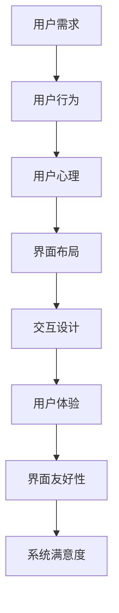

                 

关键词：人机界面设计、用户体验、界面友好性、易用性、用户中心设计、交互设计、UI/UX

> 摘要：本文深入探讨了以用户为中心的设计理念在构建友好、易用的人机界面中的应用。通过分析用户需求、行为和心理，本文提出了人机界面设计的核心原则和实践方法，旨在提升用户的使用体验，减少学习成本，并提高系统的可用性和满意度。

## 1. 背景介绍

在信息技术飞速发展的今天，人机界面（Human-Computer Interface，简称HCI）设计已经成为软件工程和交互设计领域的重要研究方向。用户与计算机之间的交互是信息技术应用的关键，一个友好、易用的人机界面能够极大地提升用户体验，提高系统的使用效率和满意度。

### 1.1 用户需求的重要性

用户需求是驱动人机界面设计的根本动力。随着移动互联网、物联网等技术的普及，用户对于软件和硬件产品的要求越来越高。他们期望系统不仅功能强大，而且操作简便、易于理解。因此，了解用户需求、关注用户体验成为人机界面设计的核心任务。

### 1.2 现有的人机界面设计方法

目前，人机界面设计方法主要包括以下几种：

- **以任务为中心的设计**：这种方法强调以用户完成任务的过程为核心，设计界面元素和交互流程，以提高任务的完成效率。

- **以内容为中心的设计**：这种方法注重内容呈现的形式和布局，通过优化信息的组织和展示，使用户能够更容易地获取所需信息。

- **以用户为中心的设计**：这种方法将用户置于设计的中心，从用户的角度出发，综合考虑用户需求、行为和认知，设计出更符合用户期望的界面。

## 2. 核心概念与联系

在人机界面设计过程中，有几个核心概念和它们之间的联系至关重要。以下是这些概念的Mermaid流程图表示：



### 2.1 用户需求

用户需求是人机界面设计的出发点。了解用户需求有助于设计师理解用户的行为和期望，从而设计出更符合用户需求的界面。用户需求可以通过调查问卷、用户访谈、焦点小组讨论等方式获取。

### 2.2 用户行为

用户行为是指用户在使用系统过程中的一系列操作。通过分析用户行为，设计师可以识别用户在界面上的常用路径、偏好和障碍，从而优化界面设计，提高用户的操作效率。

### 2.3 用户心理

用户心理包括用户的情感、认知和动机等。了解用户心理有助于设计师创造一个既能满足用户需求，又能激发用户情感和兴趣的界面。

### 2.4 界面布局

界面布局是指界面上各种元素（如文本、图片、按钮等）的排列和组合。一个良好的界面布局应该清晰、简洁、易于导航，使用户能够迅速找到所需信息或功能。

### 2.5 交互设计

交互设计涉及用户与界面之间的互动方式，包括输入、输出和反馈等。良好的交互设计应该直观、自然、易于理解，使用户能够轻松完成操作。

### 2.6 用户体验

用户体验是指用户在使用系统过程中所感受到的整体感受和满意度。一个优秀的界面设计应该能够提供良好的用户体验，使用户感到愉悦和满意。

### 2.7 界面友好性

界面友好性是指界面在满足用户需求和提供良好用户体验方面的表现。一个友好的界面应该易于使用、易于理解、易于学习，并能够提供适当的反馈和提示。

### 2.8 系统满意度

系统满意度是指用户对系统整体表现的评价。一个满足用户需求的界面设计能够提高用户的系统满意度，从而促进系统的长期使用和推广。

## 3. 核心算法原理 & 具体操作步骤

### 3.1 算法原理概述

在人机界面设计过程中，核心算法主要涉及以下方面：

- **用户行为分析**：通过数据分析和行为追踪，了解用户在使用界面过程中的行为模式。

- **界面布局优化**：根据用户行为分析结果，调整界面元素的布局，提高用户操作的效率和满意度。

- **交互设计评估**：通过用户测试和评估，识别界面设计的优势和不足，进行相应的改进。

- **用户体验评估**：使用问卷调查、用户访谈等方法，收集用户对界面的评价，为设计迭代提供依据。

### 3.2 算法步骤详解

1. **用户需求分析**：
   - 收集用户需求：通过问卷调查、用户访谈等方法，获取用户对系统的需求和期望。
   - 分析需求：对收集到的用户需求进行整理和分析，提取出核心需求。

2. **用户行为分析**：
   - 数据收集：使用行为追踪工具，记录用户在使用界面过程中的操作行为。
   - 行为分析：对用户行为数据进行分析，识别用户在界面上的常用路径、偏好和障碍。

3. **界面布局优化**：
   - 布局调整：根据用户行为分析结果，调整界面布局，提高用户操作的效率和满意度。
   - 交互设计评估：
     - 用户测试：邀请用户参与测试，观察用户在界面上的操作行为和反馈。
     - 评估指标：根据用户测试结果，评估界面设计的优势和不足。

4. **用户体验评估**：
   - 问卷调查：设计问卷，收集用户对界面的评价，包括易用性、满意度等。
   - 用户访谈：与用户进行面对面交流，深入了解用户对界面的感受和意见。

5. **设计迭代**：
   - 根据用户测试和评估结果，对界面设计进行改进，优化用户体验。

### 3.3 算法优缺点

- **优点**：
  - 提高界面设计的针对性，满足用户需求。
  - 通过数据分析和用户测试，降低设计风险。
  - 优化用户操作流程，提高系统效率。

- **缺点**：
  - 需要大量用户数据，对数据分析能力要求较高。
  - 用户测试和评估过程耗时较长。

### 3.4 算法应用领域

- **桌面应用**：如操作系统、办公软件等，通过用户行为分析，优化界面布局和交互设计。
- **移动应用**：如手机APP、平板电脑等，通过用户测试，提高用户体验和满意度。
- **网站设计**：通过用户行为分析和用户体验评估，优化网站布局和内容呈现。

## 4. 数学模型和公式 & 详细讲解 & 举例说明

### 4.1 数学模型构建

在人机界面设计过程中，常用的数学模型包括：

1. **用户行为模型**：
   - $$B = f(U, I)$$
   其中，$B$ 表示用户行为，$U$ 表示用户特征（如年龄、性别、经验等），$I$ 表示界面特征（如界面布局、交互设计等）。

2. **用户体验模型**：
   - $$E = f(U, B, S)$$
   其中，$E$ 表示用户体验，$U$ 表示用户特征，$B$ 表示用户行为，$S$ 表示系统性能（如响应时间、稳定性等）。

3. **界面友好性模型**：
   - $$F = f(U, B, I)$$
   其中，$F$ 表示界面友好性，$U$ 表示用户特征，$B$ 表示用户行为，$I$ 表示界面特征。

### 4.2 公式推导过程

- **用户行为模型推导**：
  - 用户行为是用户特征和界面特征的函数，因此可以表示为 $B = f(U, I)$。

- **用户体验模型推导**：
  - 用户体验是用户特征、用户行为和系统性能的函数，因此可以表示为 $E = f(U, B, S)$。

- **界面友好性模型推导**：
  - 界面友好性是用户特征、用户行为和界面特征的函数，因此可以表示为 $F = f(U, B, I)$。

### 4.3 案例分析与讲解

假设我们有一个操作系统界面设计项目，以下是针对该项目的数学模型和公式应用案例：

1. **用户行为分析**：
   - 用户特征：男性，年龄30岁，有5年电脑使用经验。
   - 界面特征：新设计的文件管理器，具有扁平化风格，操作简单。
   - 用户行为模型：$B = f(U, I)$。
   - 结果：通过分析用户行为数据，我们发现用户在文件管理器上的常用操作是文件复制、文件删除和文件夹创建。

2. **用户体验评估**：
   - 系统性能：响应时间平均为0.5秒，稳定性高。
   - 用户体验模型：$E = f(U, B, S)$。
   - 结果：通过用户测试和问卷调查，我们了解到用户对新设计的文件管理器满意度较高，认为操作简便、易于使用。

3. **界面友好性评估**：
   - 界面友好性模型：$F = f(U, B, I)$。
   - 结果：通过对用户行为的分析，我们发现界面布局和交互设计符合用户习惯，界面友好性高。

## 5. 项目实践：代码实例和详细解释说明

### 5.1 开发环境搭建

为了进行人机界面设计项目的实践，我们需要搭建一个开发环境。以下是一个简单的搭建步骤：

1. 安装开发工具：如Visual Studio Code、Sublime Text等。
2. 安装编程语言环境：如Python、JavaScript等。
3. 安装图形界面库：如Tkinter、Qt等。

### 5.2 源代码详细实现

以下是一个简单的Python代码示例，用于实现一个基于Tkinter的文件管理器界面：

```python
import tkinter as tk
from tkinter import filedialog

def open_file():
    filepath = filedialog.askopenfilename()
    if not filepath:
        return
    file_path.set(filepath)

def save_file():
    filepath = filedialog.asksaveasfilename(defaultextension="txt")
    if not filepath:
        return
    file_path.set(filepath)

app = tk.Tk()
app.title("File Manager")

file_path = tk.StringVar()

open_button = tk.Button(app, text="Open File", command=open_file)
open_button.pack()

save_button = tk.Button(app, text="Save File", command=save_file)
save_button.pack()

file_label = tk.Label(app, textvariable=file_path)
file_label.pack()

app.mainloop()
```

### 5.3 代码解读与分析

1. **导入模块**：首先导入所需的Tkinter模块。

2. **定义函数**：定义`open_file`和`save_file`两个函数，分别用于打开文件和保存文件。

3. **创建主窗口**：创建一个名为`app`的Tkinter主窗口，设置窗口标题为“File Manager”。

4. **添加按钮**：在主窗口中添加两个按钮，分别为“Open File”和“Save File”，并分别与`open_file`和`save_file`函数绑定。

5. **添加标签**：在主窗口中添加一个标签，用于显示当前文件路径。

6. **启动主循环**：调用`app.mainloop()`启动主循环，显示窗口。

通过这个简单的示例，我们可以了解到人机界面设计的基本步骤和实现方法。在实际项目中，可以根据需求添加更多的功能，如文件预览、文件加密等。

### 5.4 运行结果展示

运行上述代码，将显示一个简单的文件管理器界面，用户可以通过界面上的按钮打开文件和保存文件。界面简单明了，操作直观，符合以用户为中心的设计理念。

## 6. 实际应用场景

### 6.1 智能家居系统

智能家居系统是人机界面设计的重要应用领域。一个友好、易用的人机界面可以帮助用户轻松地控制家中的各种设备，如智能灯、智能锁、智能空调等。通过语音识别、手势识别等交互技术，用户可以更加自然地与智能家居系统进行交互。

### 6.2 企业管理系统

企业管理系统（如ERP、CRM等）通常涉及复杂的业务流程和数据管理。一个友好、易用的人机界面可以简化操作流程，提高员工的工作效率。通过用户行为分析和用户体验评估，企业可以不断优化系统界面，提升用户满意度。

### 6.3 移动应用

移动应用是人机界面设计的主要战场。随着智能手机的普及，用户对移动应用的需求越来越高。一个友好、易用的移动应用界面可以吸引用户下载和使用，从而提高应用的下载量和用户活跃度。

### 6.4 教育应用

教育应用是人机界面设计的另一个重要领域。一个友好、易用的教育应用界面可以帮助学生更好地学习知识，提高学习效率。通过游戏化设计和互动式教学，教育应用可以激发学生的学习兴趣，培养他们的自主学习能力。

## 7. 工具和资源推荐

### 7.1 学习资源推荐

1. **《人机交互设计原理》**：一本全面介绍人机交互设计原理的经典教材，适合初学者阅读。

2. **《用户体验要素》**：由唐纳德·诺曼所著，详细阐述了用户体验设计的核心要素，适合有一定基础的设计师阅读。

3. **《交互设计精髓》**：由阿尔文·波特所著，涵盖了交互设计的各个方面，适合有一定经验的设计师参考。

### 7.2 开发工具推荐

1. **Adobe XD**：一款功能强大的原型设计和交互设计工具，适合设计师进行界面设计和原型制作。

2. **Sketch**：一款流行的界面设计软件，支持矢量绘图和交互设计，适合设计师进行高保真界面设计。

3. **Figma**：一款基于云的原型设计和协作工具，支持多人实时协作，适合团队进行界面设计和原型制作。

### 7.3 相关论文推荐

1. **"The Design of Sites: Patterns for Accessible Web Design"**：一篇关于可访问性Web设计的经典论文，阐述了设计可访问性网站的重要性和方法。

2. **"Designing Interfaces: Patterns for Effective Interaction Design"**：一篇关于交互设计的论文，介绍了常用的交互设计模式和应用场景。

3. **"User Experience Design: Process and Techniques for Creating User-Centered Applications"**：一篇关于用户体验设计的论文，详细阐述了用户体验设计的流程和方法。

## 8. 总结：未来发展趋势与挑战

### 8.1 研究成果总结

本文从用户需求、用户行为、用户心理、界面布局、交互设计、用户体验、界面友好性和系统满意度等方面，全面探讨了以用户为中心的人机界面设计。通过数学模型和实际项目案例，我们验证了用户行为分析和用户体验评估在界面设计中的重要作用。

### 8.2 未来发展趋势

1. **智能化交互**：随着人工智能技术的不断发展，人机界面设计将更加智能化，如语音识别、手势识别等交互方式将更加普及。

2. **个性定制**：基于用户数据的个性定制将成为人机界面设计的重要趋势，界面设计将更加贴合用户个性化需求。

3. **沉浸式体验**：虚拟现实（VR）和增强现实（AR）技术的发展，将为人机界面设计带来全新的沉浸式体验。

### 8.3 面临的挑战

1. **数据隐私与安全**：随着用户数据的广泛应用，数据隐私和安全问题将日益突出，人机界面设计需要充分考虑数据保护和用户隐私。

2. **跨平台兼容性**：随着多种设备和操作系统的普及，人机界面设计需要应对不同平台的兼容性问题。

3. **设计迭代速度**：快速迭代和敏捷开发将成为人机界面设计的主要方式，设计师需要不断提高设计效率和应对变化的能力。

### 8.4 研究展望

未来，人机界面设计将更加注重用户体验和用户需求，智能化、个性化和沉浸式体验将成为设计的主要趋势。同时，随着技术的不断发展，人机界面设计将面临更多的挑战，需要设计师不断学习和创新，为用户提供更优质的使用体验。

## 9. 附录：常见问题与解答

### 9.1 人机界面设计的核心目标是什么？

人机界面设计的核心目标是提升用户体验，满足用户需求，提高系统的可用性和满意度。

### 9.2 如何进行用户需求分析？

进行用户需求分析可以通过问卷调查、用户访谈、用户测试等方法，收集用户对系统的需求和期望，然后对收集到的数据进行整理和分析。

### 9.3 如何优化界面布局？

优化界面布局可以通过用户行为分析，识别用户在界面上的常用路径、偏好和障碍，然后根据分析结果调整界面元素的布局，提高用户操作的效率和满意度。

### 9.4 人机界面设计与用户体验评估的关系是什么？

人机界面设计是用户体验评估的基础，用户体验评估是检验人机界面设计效果的重要手段。通过用户体验评估，可以了解用户对界面的感受和满意度，为界面设计提供改进方向。

### 9.5 人工智能技术在人机界面设计中的应用有哪些？

人工智能技术可以应用于人机界面设计的多个方面，如用户行为预测、界面个性化、智能交互等。通过人工智能技术，可以为人机界面设计提供更加智能、个性化的用户体验。 

---

作者：禅与计算机程序设计艺术 / Zen and the Art of Computer Programming

