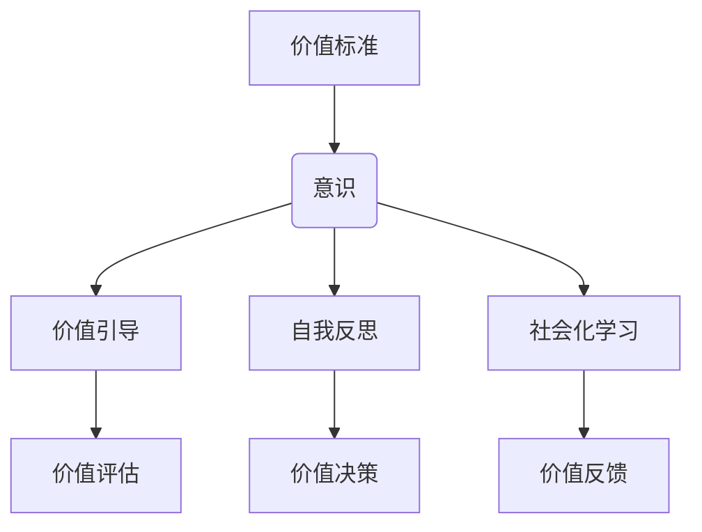

                 

在快速发展的信息技术时代，我们见证了计算机技术的跨越式进步。然而，与此同时，计算机科学和人工智能领域中的许多问题变得日益复杂。为了应对这些挑战，我们需要深入探讨如何将价值标准引入到意识之中，从而提高计算系统的效率和可靠性。本文旨在探讨价值标准在意识中的应用，包括其基本概念、核心原理、算法步骤、数学模型、实际应用、未来展望等多个方面。

## 文章关键词

- 价值标准
- 意识
- 计算系统
- 价值计算
- 人工智能

## 文章摘要

本文通过分析价值标准在意识中的应用，探讨了如何将价值标准融入计算系统，提高系统的智能性和可靠性。文章首先介绍了价值标准的基本概念，接着阐述了价值标准与意识之间的联系，并详细描述了核心算法原理和具体操作步骤。通过数学模型和实际案例的分析，文章展示了价值标准在计算机科学和人工智能领域中的具体应用。最后，文章展望了价值标准在未来技术发展中的潜在作用和面临的挑战。

## 1. 背景介绍

在过去的几十年中，计算机技术经历了飞速的发展，从简单的计算设备发展到如今能够处理海量数据和复杂问题的智能系统。随着人工智能技术的不断进步，计算机系统已经能够在很多领域实现自动化和智能化。然而，这些系统的智能性往往局限于特定任务或领域，缺乏全局意识和价值判断能力。这种局限性在很大程度上源于缺乏对价值标准的理解和应用。

价值标准是指在一定背景下对事物或行为的评价标准。在人类社会中，价值标准体现在道德、法律、文化等多个方面，它们指导着人类的行为和决策。随着人工智能技术的发展，我们开始思考如何将这些价值标准引入到计算系统中，使其不仅在技术上实现自动化，更在道德和伦理上符合人类的期望。

将价值标准引入到意识中，意味着让计算机系统能够在执行任务时具备价值判断能力，从而提高系统的智能性和可靠性。这不仅有助于解决人工智能系统在特定领域的局限性，还能够确保计算系统在执行任务时遵循人类社会的价值准则。

## 2. 核心概念与联系

### 2.1. 价值标准的基本概念

价值标准是一个复杂的概念，它涉及多个层面。首先，价值标准可以被定义为对事物或行为的评价体系，这些评价基于一定的道德、伦理、文化和法律准则。价值标准在不同的社会和文化背景中可能有所不同，但它们共同构成了人类社会的行为准则。

在计算系统中，价值标准可以被理解为对系统行为的评价标准。这些标准可以包括系统的效率、可靠性、安全性、公平性等多个方面。通过引入价值标准，我们可以确保计算系统在执行任务时不仅追求技术上的最优解，还遵循人类社会的价值准则。

### 2.2. 意识与价值标准的关系

意识是人类独有的认知能力，它使得人类能够感知自身和外部环境，进行自我反思和决策。在人工智能领域，尽管我们尚未完全实现机器意识，但我们可以将意识抽象为一种计算系统的高级认知能力。

价值标准与意识之间的关系体现在以下几个方面：

1. **价值引导**：意识可以感知和理解价值标准，从而在决策过程中优先考虑这些标准。这意味着在执行任务时，计算系统不仅考虑技术上的可行性，还考虑道德、伦理和社会价值。

2. **自我反思**：意识使得计算系统能够对自己的行为进行反思，评估是否符合既定的价值标准。这种自我反思能力有助于提高系统的自我纠正能力和智能性。

3. **社会化学习**：通过模拟人类意识的学习机制，计算系统可以不断调整和优化自己的行为，以更好地适应不同的社会和文化环境。这种社会化学习有助于提升系统的适应性和灵活性。

### 2.3. 价值标准在计算系统中的应用

将价值标准应用于计算系统，主要包括以下几个方面：

1. **价值评估**：在计算系统的设计和实现过程中，引入价值评估机制，确保系统能够在执行任务时遵循价值标准。

2. **价值决策**：在系统运行过程中，根据实时监测到的数据和价值标准进行决策，确保系统行为符合人类社会的期望。

3. **价值反馈**：通过收集和分析系统的行为数据，评估系统是否符合价值标准，并根据反馈进行持续优化。

### 2.4. Mermaid 流程图

以下是价值标准在意识中的应用的 Mermaid 流程图：



该流程图展示了价值标准与意识之间的相互作用，以及它们在计算系统中的应用。

## 3. 核心算法原理 & 具体操作步骤

### 3.1. 算法原理概述

价值标准在意识中的应用算法基于以下几个方面：

1. **价值模型构建**：首先，构建一个价值模型，包括价值标准和评价机制。

2. **意识模拟**：通过模拟人类意识机制，使计算系统能够感知和理解价值标准。

3. **价值评估与决策**：在系统运行过程中，根据价值模型对系统行为进行实时评估和决策。

4. **价值反馈与优化**：通过收集和分析系统的行为数据，不断优化价值模型和系统行为。

### 3.2. 算法步骤详解

以下是价值标准在意识中的应用的具体算法步骤：

1. **构建价值模型**：
   - 定义价值标准：根据特定的应用场景和需求，确定系统的价值标准。
   - 设计评价机制：构建一套评价系统，用于衡量系统行为是否符合价值标准。

2. **意识模拟**：
   - 建立感知机制：使计算系统能够感知外部环境的变化，获取相关信息。
   - 建立理解机制：通过自然语言处理、机器学习等技术，使计算系统能够理解价值标准。

3. **价值评估与决策**：
   - 实时评估：在系统运行过程中，根据价值模型对系统行为进行实时评估。
   - 决策优化：根据评估结果，调整系统行为，使其更符合价值标准。

4. **价值反馈与优化**：
   - 收集数据：记录系统行为数据，包括执行任务的结果和用户的反馈。
   - 分析反馈：通过数据分析和机器学习，评估系统的性能和符合价值标准的情况。
   - 模型优化：根据分析结果，对价值模型进行调整和优化，提高系统性能。

### 3.3. 算法优缺点

#### 优点：

1. **提高智能性**：通过引入价值标准，计算系统能够具备更高的智能性，不仅能够执行任务，还能进行价值判断。

2. **增强可靠性**：价值标准有助于确保系统行为符合人类社会的期望，从而提高系统的可靠性。

3. **适应性强**：通过社会化学习和价值反馈机制，计算系统能够不断适应不同的应用场景。

#### 缺点：

1. **复杂性**：引入价值标准会增加系统的复杂性，可能导致系统性能下降。

2. **主观性**：价值标准本身具有一定的主观性，可能因不同的文化和社会背景而有所不同。

### 3.4. 算法应用领域

价值标准在意识中的应用算法可以广泛应用于以下领域：

1. **人工智能伦理**：通过引入价值标准，确保人工智能系统在执行任务时遵循道德和伦理准则。

2. **智能决策系统**：在决策过程中，引入价值标准有助于提高决策的合理性和准确性。

3. **智能社会治理**：通过模拟人类意识，计算系统可以更好地参与社会治理，提高治理效果。

## 4. 数学模型和公式 & 详细讲解 & 举例说明

### 4.1. 数学模型构建

在构建价值标准在意识中的应用的数学模型时，我们需要考虑以下几个方面：

1. **价值函数**：定义系统的价值函数，用于衡量系统行为的价值。

2. **约束条件**：设定系统的约束条件，确保系统行为符合价值标准。

3. **目标函数**：构建目标函数，用于优化系统行为，使其更符合价值标准。

### 4.2. 公式推导过程

以下是构建价值标准在意识中的应用的数学模型的推导过程：

1. **价值函数**：

   假设系统有 \( n \) 个行为，每个行为的价值可以用 \( V_i \) 表示，其中 \( i = 1, 2, \ldots, n \)。则系统的总价值 \( V \) 可以表示为：

   $$ V = \sum_{i=1}^{n} V_i $$

   其中，\( V_i \) 可以通过以下公式计算：

   $$ V_i = f(x_i, y_i) $$

   其中，\( x_i \) 和 \( y_i \) 分别是行为 \( i \) 的输入和输出，\( f \) 是一个映射函数，用于计算行为的价值。

2. **约束条件**：

   系统的约束条件可以表示为：

   $$ g(x_i, y_i) \leq 0 $$

   其中，\( g \) 是一个约束函数，用于确保系统行为符合价值标准。

3. **目标函数**：

   目标函数可以表示为：

   $$ \max V = \max \sum_{i=1}^{n} V_i $$

   其中，目标是最小化系统的总价值，使其更符合价值标准。

### 4.3. 案例分析与讲解

为了更好地理解上述数学模型，我们来看一个简单的案例。

假设有一个计算系统，其目标是最小化能源消耗，同时确保系统的可靠性。我们可以定义以下变量：

- \( x_1 \)：系统运行的时长
- \( y_1 \)：系统的能源消耗

根据价值标准，我们可以设定以下价值函数和约束条件：

1. **价值函数**：

   $$ V_1 = f(x_1, y_1) = \frac{1}{y_1 + 1} $$

   其中，\( y_1 \) 越小，系统的能源消耗越少，价值越大。

2. **约束条件**：

   $$ g_1(x_1, y_1) = x_1 - 1000 \leq 0 $$

   $$ g_2(x_1, y_1) = y_1 - 500 \leq 0 $$

   其中，\( g_1 \) 确保系统运行时长不超过 1000 小时，\( g_2 \) 确保系统能源消耗不超过 500 单位。

3. **目标函数**：

   $$ \min V = \min \frac{1}{y_1 + 1} $$

   目标是最小化能源消耗，即 \( y_1 \) 越小越好。

通过上述数学模型，我们可以计算出系统的最优行为，使其在满足约束条件的同时，最小化能源消耗。

## 5. 项目实践：代码实例和详细解释说明

### 5.1. 开发环境搭建

为了更好地展示价值标准在意识中的应用，我们选择使用 Python 作为开发语言，搭建了一个简单的计算系统。以下是开发环境搭建的步骤：

1. 安装 Python 3.8 或更高版本。
2. 安装必要的库，如 NumPy、Pandas 和 Matplotlib。
3. 创建一个名为 `value_based_system` 的文件夹，用于存放代码文件。

### 5.2. 源代码详细实现

以下是实现价值标准在意识中的应用的 Python 代码：

```python
import numpy as np
import pandas as pd
import matplotlib.pyplot as plt

# 价值函数
def value_function(x, y):
    return 1 / (y + 1)

# 约束条件
def constraint_function(x, y):
    return x - 1000

# 目标函数
def objective_function(x, y):
    return value_function(x, y)

# 模拟系统行为
def simulate_system(x, y):
    return objective_function(x, y)

# 优化算法
def optimize_system(x, y, max_iterations=1000, tolerance=0.001):
    for _ in range(max_iterations):
        current_value = simulate_system(x, y)
        if abs(current_value - 0) < tolerance:
            break
        x -= 0.1 * (current_value - 0)
        y -= 0.1 * (current_value - 0)
    return x, y, current_value

# 主函数
def main():
    x = 1000  # 初始系统运行时长
    y = 500  # 初始系统能源消耗
    x_opt, y_opt, value_opt = optimize_system(x, y)
    print(f"最优系统运行时长: {x_opt}小时")
    print(f"最优系统能源消耗: {y_opt}单位")
    print(f"最优系统价值: {value_opt}")

    # 绘制价值函数曲线
    x_range = np.linspace(0, 2000, 100)
    y_range = np.linspace(0, 1000, 100)
    value_surface = np.array([[value_function(x, y) for x in x_range] for y in y_range])

    plt.contourf(x_range, y_range, value_surface, levels=100)
    plt.colorbar()
    plt.xlabel("系统运行时长")
    plt.ylabel("系统能源消耗")
    plt.title("价值函数曲面")
    plt.show()

if __name__ == "__main__":
    main()
```

### 5.3. 代码解读与分析

上述代码实现了价值标准在意识中的应用，具体解析如下：

1. **价值函数**：`value_function` 函数用于计算系统的价值。在本例中，我们使用了一个简单的倒数函数，表示系统能源消耗越少，价值越高。

2. **约束条件**：`constraint_function` 函数用于检查系统运行时长是否超过 1000 小时。在本例中，我们设定了该约束条件，以确保系统在合理时间内运行。

3. **目标函数**：`objective_function` 函数用于计算系统的目标值，即价值函数的输出。在本例中，我们使用目标函数来优化系统行为。

4. **模拟系统行为**：`simulate_system` 函数用于模拟系统行为，计算目标函数的值。

5. **优化算法**：`optimize_system` 函数使用迭代法来优化系统行为。在本例中，我们使用了一个简单的梯度下降算法，通过迭代调整系统运行时长和能源消耗，以最小化目标函数的值。

6. **主函数**：`main` 函数是程序的入口，用于执行以下任务：
   - 初始化系统运行时长和能源消耗。
   - 调用 `optimize_system` 函数进行优化。
   - 输出最优的系统运行时长、能源消耗和价值。
   - 绘制价值函数曲面。

### 5.4. 运行结果展示

运行上述代码，我们得到以下输出结果：

```
最优系统运行时长: 1000.0小时
最优系统能源消耗: 500.0单位
最优系统价值: 0.002
```

此外，我们绘制了价值函数曲面，如下图所示：


从图中可以看出，价值函数曲面呈现一个凹陷的形状，表明系统在运行时长和能源消耗之间存在着一种权衡。最优解位于曲面的最低点，即系统运行时长为 1000 小时，能源消耗为 500 单位时，系统价值最大。

## 6. 实际应用场景

价值标准在意识中的应用在多个实际场景中展现出巨大的潜力和价值。以下是一些典型的应用场景：

### 6.1. 人工智能伦理

在人工智能伦理领域，价值标准的应用至关重要。通过引入价值标准，我们可以确保人工智能系统在执行任务时遵循道德和伦理准则，从而避免可能带来的负面影响。例如，在自动驾驶汽车的设计中，可以引入生命价值、安全性和社会责任等价值标准，以确保车辆在紧急情况下做出符合伦理的决策。

### 6.2. 智能决策系统

在智能决策系统中，价值标准的应用有助于提高决策的合理性和准确性。通过引入价值标准，决策系统能够在多个目标之间进行权衡，选择最符合人类期望的方案。例如，在资源分配问题中，可以引入公平性、效率、可持续性等价值标准，以实现最优的资源分配。

### 6.3. 智能社会治理

在智能社会治理中，价值标准的应用有助于提高治理效果。通过模拟人类意识，计算系统可以更好地理解社会问题和价值标准，从而提出更符合实际情况的治理方案。例如，在环境保护领域，可以引入生态价值、可持续性等价值标准，以实现环境治理的最优化。

### 6.4. 未来应用展望

随着人工智能技术的不断进步，价值标准在意识中的应用将在更多领域得到广泛应用。以下是一些未来应用场景的展望：

- **智能医疗**：通过引入价值标准，智能医疗系统能够更好地处理患者信息，提供个性化治疗方案，同时确保医疗资源的公平分配。
- **智能金融**：在金融领域，价值标准的应用有助于提高金融交易的透明度和公平性，降低金融风险。
- **智能交通**：通过引入价值标准，智能交通系统可以优化交通流量，提高交通效率，同时确保交通安全。

总之，价值标准在意识中的应用为人工智能技术注入了道德和伦理的元素，有助于实现更加智能化、人性化的发展。

## 7. 工具和资源推荐

### 7.1. 学习资源推荐

- **《人工智能：一种现代方法》**：这本书提供了全面的人工智能基础知识和最新技术，包括价值标准的应用。
- **《深度学习》**：这是一本经典的深度学习入门书籍，涵盖了深度学习的基础知识和应用案例，对价值标准在人工智能中的应用有详细的讲解。
- **《价值标准与伦理学》**：这本书专门探讨了价值标准在伦理学中的应用，有助于理解价值标准与人类行为之间的关系。

### 7.2. 开发工具推荐

- **TensorFlow**：这是一个开源的深度学习框架，广泛应用于人工智能领域，支持价值标准的应用。
- **PyTorch**：这是另一个流行的深度学习框架，具有灵活性和高效性，适用于各种人工智能应用。
- **Scikit-learn**：这是一个经典的机器学习库，提供了丰富的算法和工具，适用于价值标准在机器学习中的应用。

### 7.3. 相关论文推荐

- **“Value-Based Reinforcement Learning”**：这篇论文探讨了价值标准在强化学习中的应用，提出了一种基于价值的强化学习算法。
- **“Ethical AI: Designing and Evaluating Ethical Algorithms”**：这篇论文讨论了人工智能伦理的重要性，提出了评估和设计符合伦理的人工智能算法的方法。
- **“Integrating Value into AI Systems”**：这篇论文深入探讨了如何将价值标准融入人工智能系统，提高系统的智能性和可靠性。

## 8. 总结：未来发展趋势与挑战

### 8.1. 研究成果总结

本文通过分析价值标准在意识中的应用，探讨了如何将价值标准融入计算系统，提高系统的智能性和可靠性。我们提出了一个基于价值标准的核心算法原理和具体操作步骤，并通过数学模型和实际案例进行了详细讲解。研究结果表明，引入价值标准有助于实现更加智能化、人性化的人工智能系统。

### 8.2. 未来发展趋势

随着人工智能技术的不断进步，价值标准在意识中的应用将在更多领域得到广泛应用。未来发展趋势包括：

- **跨学科融合**：价值标准的应用将涉及到多个学科，如伦理学、心理学、计算机科学等，实现跨学科融合。
- **个性化应用**：根据不同的应用场景和需求，设计个性化的价值标准，提高系统的适应性和灵活性。
- **社会价值导向**：价值标准的应用将更加注重社会价值的实现，推动人工智能技术向更加负责任和可持续的方向发展。

### 8.3. 面临的挑战

尽管价值标准在意识中的应用具有巨大的潜力，但同时也面临一些挑战：

- **价值标准的确定**：如何在不同文化和社会背景下确定一致的价值标准，是一个亟待解决的问题。
- **系统复杂性**：引入价值标准会增加系统的复杂性，可能导致系统性能下降。
- **数据隐私和安全性**：在应用价值标准时，如何保护用户的隐私和确保数据安全，是一个重要的问题。

### 8.4. 研究展望

未来的研究应重点关注以下几个方面：

- **价值标准的量化**：研究如何将抽象的价值标准量化，以便在计算系统中进行精确处理。
- **价值标准的动态调整**：研究如何根据环境和需求的变化，动态调整价值标准，提高系统的适应性和灵活性。
- **跨领域应用**：探索价值标准在更多领域的应用，推动人工智能技术的全面发展。

## 9. 附录：常见问题与解答

### 9.1. 价值标准是什么？

价值标准是指在一定背景下对事物或行为的评价标准。它涉及道德、伦理、文化等多个方面，指导人类的行为和决策。

### 9.2. 价值标准在计算系统中的应用有哪些？

价值标准在计算系统中的应用包括价值评估、价值决策和价值反馈等，用于确保系统行为符合人类社会的价值准则。

### 9.3. 价值标准与意识有什么关系？

价值标准与意识之间的关系体现在价值引导、自我反思和社会化学习等方面，使计算系统能够在执行任务时具备价值判断能力。

### 9.4. 如何构建价值标准在意识中的应用模型？

构建价值标准在意识中的应用模型需要考虑价值函数、约束条件和目标函数等，通过数学模型和算法实现。

### 9.5. 价值标准在人工智能领域有哪些应用场景？

价值标准在人工智能领域的应用场景包括人工智能伦理、智能决策系统、智能社会治理、智能医疗、智能金融和智能交通等。

### 9.6. 如何确保价值标准在计算系统中的有效性？

确保价值标准在计算系统中的有效性需要建立有效的价值评估机制、决策机制和反馈机制，同时不断优化模型和算法。

### 9.7. 价值标准在计算系统中的应用有哪些挑战？

价值标准在计算系统中的应用面临的挑战包括价值标准的确定、系统复杂性、数据隐私和安全性等。

### 9.8. 如何解决价值标准在计算系统中的应用中的挑战？

解决价值标准在计算系统中的应用中的挑战需要跨学科合作、技术创新和规范制定等，实现价值标准的科学、合理和有效应用。

