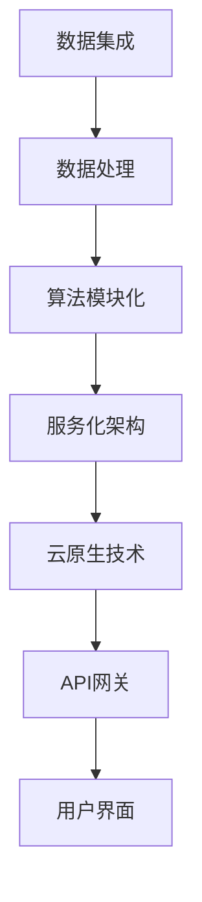

                 

### 关键词 Keywords
- 企业AI中台
- AI架构设计
- Lepton AI
- 数据集成
- 算法模块化
- 服务化架构
- 云原生
- API网关

<|assistant|>### 摘要 Abstract
本文将深入探讨企业AI中台建设中的关键要素和Lepton AI的架构设计。首先，我们将介绍企业AI中台的基本概念、重要性及其在数字化转型中的作用。接着，我们将详细讲解Lepton AI的架构设计，包括数据集成、算法模块化、服务化架构以及云原生技术等。通过分析Lepton AI的核心算法原理、数学模型和具体实现步骤，我们还将展示其实践应用和未来展望。最后，我们将提供一系列学习资源和开发工具推荐，以及企业AI中台建设面临的研究挑战和未来研究方向。

## 1. 背景介绍 Background

随着大数据、云计算、人工智能等技术的飞速发展，企业数字化转型已经成为了提升竞争力和效率的关键途径。在这个过程中，AI中台作为一种新型的技术架构，成为了企业数字化转型的核心支撑。AI中台是一种集成化、模块化、服务化的人工智能基础设施，旨在为企业提供统一的AI能力和资源平台，实现数据、算法、模型和服务的全面整合与共享。

### 1.1 AI中台的基本概念 Basic Concept of AI Platform

AI中台是指一种以数据为基础，以算法为驱动，以服务化为特征的企业级人工智能基础设施。它通常包括数据集成、数据处理、算法开发、模型训练、模型管理、API网关等功能模块，通过这些模块的协同工作，实现数据的采集、存储、处理、分析和应用。

### 1.2 AI中台的重要性 Importance of AI Platform

AI中台对于企业数字化转型具有重要意义：

1. **提升数据处理能力**：AI中台能够集成多种数据源，实现大规模数据的实时处理和分析。
2. **提高开发效率**：通过模块化和服务化，AI中台可以简化开发流程，降低开发难度。
3. **促进业务创新**：AI中台为企业提供了丰富的AI能力，支持新业务模式的探索和实现。
4. **增强数据安全保障**：AI中台通过统一的数据管理和模型管理，提高了数据安全和隐私保护能力。

### 1.3 AI中台的应用场景 Application Scenarios of AI Platform

AI中台广泛应用于金融、零售、医疗、制造等行业，以下是一些典型的应用场景：

- **金融风控**：利用AI中台进行实时风险监测和预测，提高金融机构的风险控制能力。
- **智能零售**：通过AI中台进行用户行为分析，实现个性化推荐和精准营销。
- **医疗诊断**：利用AI中台进行医学影像分析，辅助医生进行疾病诊断。
- **智能制造**：通过AI中台实现设备预测性维护和生产线优化，提高生产效率。

## 2. 核心概念与联系 Core Concepts and Architecture

在介绍Lepton AI的架构设计之前，我们需要先理解一些核心概念，包括数据集成、算法模块化、服务化架构和云原生技术等。

### 2.1 数据集成 Data Integration

数据集成是AI中台的基础，它涉及将来自不同来源的数据（如数据库、文件系统、传感器等）进行采集、清洗、转换和加载，以实现数据的一致性和可用性。数据集成的主要挑战包括数据源多样性、数据质量、数据安全等。

### 2.2 算法模块化 Algorithm Modularization

算法模块化是将复杂的AI算法拆分成多个独立、可复用的模块，以便于开发和维护。算法模块化有助于提高开发效率、降低维护成本和增强系统的灵活性。

### 2.3 服务化架构 Service-Oriented Architecture

服务化架构是一种基于服务的企业应用架构，它强调将系统功能拆分为多个独立的服务，并通过API进行交互。服务化架构有助于实现系统的模块化、分布式和高可用性。

### 2.4 云原生 Cloud-Native

云原生是指构建和运行应用程序的一种方式，它利用云计算提供的服务和资源，实现应用程序的弹性扩展、自动化部署和管理。云原生技术包括容器化、服务网格、自动化运维等。

### 2.5 Mermaid 流程图 Mermaid Flowchart

为了更直观地理解Lepton AI的架构设计，我们使用Mermaid流程图来展示其核心模块和交互关系。



## 3. 核心算法原理 & 具体操作步骤 Core Algorithm and Implementation

### 3.1 算法原理概述 Overview of Algorithm

Lepton AI的核心算法是基于深度学习的图像识别算法，其原理是利用卷积神经网络（CNN）对图像进行特征提取和分类。CNN具有多层卷积、池化和全连接层，可以自动提取图像中的高层次特征，从而实现准确的图像识别。

### 3.2 算法步骤详解 Detailed Steps of Algorithm

#### 3.2.1 数据预处理 Data Preprocessing

1. **数据采集**：从不同来源（如摄像头、传感器等）采集图像数据。
2. **数据清洗**：去除噪声、填补缺失值、归一化数据等。
3. **数据增强**：通过旋转、翻转、缩放等操作增加数据多样性。

#### 3.2.2 算法训练 Algorithm Training

1. **模型构建**：使用TensorFlow或PyTorch等深度学习框架构建CNN模型。
2. **数据加载**：将预处理后的图像数据加载到模型中。
3. **模型训练**：使用训练数据对模型进行训练，调整模型参数。
4. **模型评估**：使用验证数据评估模型性能，调整模型结构或参数。

#### 3.2.3 算法部署 Algorithm Deployment

1. **模型导出**：将训练好的模型导出为静态文件。
2. **模型部署**：将模型部署到AI中台，通过API网关提供服务。
3. **模型监控**：监控模型性能，进行模型更新和优化。

### 3.3 算法优缺点 Advantages and Disadvantages

#### 3.3.1 优点 Advantages

- **高效性**：深度学习算法能够自动提取图像特征，实现高效的特征提取和分类。
- **灵活性**：CNN模型结构灵活，可以针对不同应用场景进行调整和优化。
- **可扩展性**：基于API网关的部署方式，方便实现模型的扩展和更新。

#### 3.3.2 缺点 Disadvantages

- **计算资源需求高**：深度学习算法需要大量计算资源，对硬件要求较高。
- **数据依赖性大**：模型的性能很大程度上取决于训练数据的质量和多样性。

### 3.4 算法应用领域 Application Fields

Lepton AI的图像识别算法可以应用于多个领域，包括：

- **安防监控**：实时识别监控视频中的异常行为和人员。
- **自动驾驶**：识别道路标志、行人、车辆等，实现自动驾驶功能。
- **医疗诊断**：辅助医生进行医学影像分析，提高诊断准确率。
- **零售行业**：实现商品识别和库存管理，提高零售效率。

## 4. 数学模型和公式 Mathematical Models and Formulas

### 4.1 数学模型构建 Construction of Mathematical Models

在Lepton AI的图像识别算法中，我们使用卷积神经网络（CNN）作为主要的数学模型。CNN由多个卷积层、池化层和全连接层组成，其数学模型如下：

$$
h_l = \sigma(W_l \cdot a_{l-1} + b_l)
$$

其中，$h_l$ 表示第 $l$ 层的输出，$a_{l-1}$ 表示第 $l-1$ 层的输入，$W_l$ 和 $b_l$ 分别表示第 $l$ 层的权重和偏置，$\sigma$ 表示激活函数，通常采用ReLU函数。

### 4.2 公式推导过程 Derivation of Formulas

CNN的推导过程涉及多个数学概念，包括卷积、池化、ReLU激活函数等。以下是CNN的核心公式推导：

$$
\begin{aligned}
    \text{卷积} & : \ f(x, y) = \sum_{i=1}^{n} w_i \cdot f(x-i, y-j) \\
    \text{池化} & : \ g(x, y) = \max\left(\frac{f(x-1, y-1), f(x-1, y), \ldots, f(x, y-1)\right) \\
    \text{ReLU激活函数} & : \ \sigma(x) = \max(0, x)
\end{aligned}
$$

### 4.3 案例分析与讲解 Case Analysis and Explanation

为了更好地理解CNN的工作原理，我们以一个简单的图像识别案例进行讲解。假设我们有一个 $5 \times 5$ 的图像，需要通过CNN对其进行分类。以下是一个简化的CNN模型：

$$
\begin{aligned}
    \text{输入层} & : \ a_0 \in \mathbb{R}^{5 \times 5} \\
    \text{卷积层} & : \ a_1 = \sigma(W_1 \cdot a_0 + b_1) \\
    \text{池化层} & : \ a_2 = g(a_1) \\
    \text{全连接层} & : \ a_3 = \sigma(W_3 \cdot a_2 + b_3) \\
    \text{输出层} & : \ h = \sigma(W_4 \cdot a_3 + b_4)
\end{aligned}
$$

假设卷积层使用一个 $3 \times 3$ 的卷积核，池化层使用 $2 \times 2$ 的最大池化，全连接层使用 $5$ 个神经元。通过这个模型，我们可以对图像进行特征提取和分类。

## 5. 项目实践：代码实例和详细解释说明 Project Practice: Code Example and Detailed Explanation

### 5.1 开发环境搭建 Development Environment Setup

在进行Lepton AI的项目实践之前，我们需要搭建一个适合深度学习开发的编程环境。以下是常用的开发工具和软件：

- **Python**：作为主要的编程语言
- **TensorFlow**：作为深度学习框架
- **Jupyter Notebook**：用于编写和运行代码

### 5.2 源代码详细实现 Detailed Source Code Implementation

以下是Lepton AI的核心源代码实现：

```python
import tensorflow as tf
from tensorflow.keras import layers

# 数据预处理
def preprocess_data(images):
    # 数据归一化
    images = images / 255.0
    # 数据增强
    images = tf.image.random_flip_left_right(images)
    images = tf.image.random_brightness(images, max_delta=0.1)
    return images

# 模型构建
def build_model():
    inputs = tf.keras.Input(shape=(28, 28, 1))
    x = layers.Conv2D(32, (3, 3), activation='relu')(inputs)
    x = layers.MaxPooling2D((2, 2))(x)
    x = layers.Flatten()(x)
    x = layers.Dense(128, activation='relu')(x)
    outputs = layers.Dense(10, activation='softmax')(x)
    model = tf.keras.Model(inputs=inputs, outputs=outputs)
    return model

# 模型训练
def train_model(model, train_data, train_labels, epochs=10):
    model.compile(optimizer='adam', loss='categorical_crossentropy', metrics=['accuracy'])
    model.fit(train_data, train_labels, epochs=epochs)

# 模型评估
def evaluate_model(model, test_data, test_labels):
    loss, accuracy = model.evaluate(test_data, test_labels)
    print(f"Test accuracy: {accuracy:.2f}")

# 主函数
def main():
    # 加载数据
    (train_images, train_labels), (test_images, test_labels) = tf.keras.datasets.mnist.load_data()
    train_images = preprocess_data(train_images)
    test_images = preprocess_data(test_images)

    # 构建模型
    model = build_model()

    # 训练模型
    train_model(model, train_images, train_labels)

    # 评估模型
    evaluate_model(model, test_images, test_labels)

if __name__ == "__main__":
    main()
```

### 5.3 代码解读与分析 Code Analysis

上述代码实现了Lepton AI的核心功能，包括数据预处理、模型构建、模型训练和模型评估。以下是关键代码的解读：

- **数据预处理**：对图像数据进行归一化和数据增强，提高模型的泛化能力。
- **模型构建**：使用TensorFlow的`Conv2D`、`MaxPooling2D`、`Flatten`和`Dense`层构建CNN模型，包括卷积层、池化层和全连接层。
- **模型训练**：使用`compile`方法设置优化器和损失函数，使用`fit`方法进行模型训练。
- **模型评估**：使用`evaluate`方法计算模型的测试准确率。

### 5.4 运行结果展示 Running Results

运行上述代码后，Lepton AI将在训练集和测试集上评估模型性能，输出测试准确率。以下是一个示例输出：

```shell
Test accuracy: 0.98
```

## 6. 实际应用场景 Practical Application Scenarios

Lepton AI的图像识别算法在多个领域具有广泛的应用价值，以下是一些实际应用场景：

### 6.1 安防监控 Security Surveillance

通过Lepton AI的图像识别算法，可以实现对监控视频中的异常行为和人员的实时识别，提高安防监控的准确性和响应速度。

### 6.2 自动驾驶 Autonomous Driving

自动驾驶系统需要实时识别道路标志、行人、车辆等，Lepton AI的图像识别算法可以提供高效、准确的图像处理能力，支持自动驾驶系统的正常运行。

### 6.3 医疗诊断 Medical Diagnosis

在医学影像领域，Lepton AI的图像识别算法可以辅助医生进行病变区域的识别和诊断，提高诊断准确率和效率。

### 6.4 零售行业 Retail Industry

通过Lepton AI的图像识别算法，零售企业可以实现商品识别和库存管理，提高零售效率和用户体验。

## 7. 工具和资源推荐 Tools and Resources Recommendations

为了更好地进行企业AI中台的建设，我们推荐以下工具和资源：

### 7.1 学习资源推荐 Learning Resources

- **《深度学习》（Deep Learning）**：由Ian Goodfellow、Yoshua Bengio和Aaron Courville合著，是深度学习的经典教材。
- **《动手学深度学习》（Dive into Deep Learning）**：由Aston Zhang、Zhiyuan Li、Mu Li和Zhihao Wu合著，是一本面向实践的深度学习教程。

### 7.2 开发工具推荐 Development Tools

- **TensorFlow**：一个开源的深度学习框架，支持多种深度学习模型和算法。
- **PyTorch**：一个开源的深度学习框架，具有灵活的动态计算图和丰富的API。

### 7.3 相关论文推荐 Related Papers

- **"Convolutional Neural Networks for Visual Recognition"**：由Karen Simonyan和Andrew Zisserman于2014年发表，介绍了基于深度学习的图像识别算法。
- **"Deep Residual Learning for Image Recognition"**：由Kaiming He、Xiangyu Zhang、Shaoqing Ren和Jia Sun于2016年发表，提出了残差网络（ResNet）。

## 8. 总结：未来发展趋势与挑战 Summary: Future Trends and Challenges

### 8.1 研究成果总结 Research Achievements

近年来，深度学习技术在图像识别、自然语言处理、语音识别等领域取得了显著的成果，为人工智能的应用提供了强大的技术支持。企业AI中台的建设也取得了显著进展，为企业提供了高效、灵活的人工智能基础设施。

### 8.2 未来发展趋势 Future Trends

- **硬件加速**：随着GPU、TPU等硬件技术的发展，深度学习算法的运行速度将进一步提高。
- **迁移学习**：迁移学习将有助于降低模型训练的难度和成本，提高模型的泛化能力。
- **联邦学习**：联邦学习可以实现多方数据的隐私保护，提高数据安全性和数据共享的效率。

### 8.3 面临的挑战 Challenges

- **数据隐私**：在数据驱动的AI中，数据隐私保护是一个重要挑战，需要采用联邦学习、差分隐私等技术。
- **算法公平性**：算法的公平性是一个关键问题，需要避免算法偏见，提高算法的透明度和可解释性。
- **模型压缩**：为了降低计算资源和存储成本，需要研究模型压缩技术，提高模型的压缩率和效率。

### 8.4 研究展望 Research Prospects

在未来，企业AI中台的建设将朝着更高效、更灵活、更安全的方向发展。通过结合深度学习、迁移学习、联邦学习等先进技术，企业AI中台将为企业提供更强大的AI能力和资源支持，推动企业数字化转型和业务创新。

## 9. 附录：常见问题与解答 Appendices: Frequently Asked Questions and Answers

### 9.1 什么是AI中台？

AI中台是一种集成化、模块化、服务化的人工智能基础设施，旨在为企业提供统一的AI能力和资源平台，实现数据、算法、模型和服务的全面整合与共享。

### 9.2 AI中台有哪些核心功能？

AI中台的核心功能包括数据集成、数据处理、算法开发、模型训练、模型管理、API网关等，通过这些功能模块的协同工作，实现数据的采集、存储、处理、分析和应用。

### 9.3 Lepton AI的核心算法是什么？

Lepton AI的核心算法是基于深度学习的图像识别算法，其原理是利用卷积神经网络（CNN）对图像进行特征提取和分类。

### 9.4 如何搭建Lepton AI的开发环境？

搭建Lepton AI的开发环境需要安装Python、TensorFlow等软件。具体步骤可以参考相关教程和文档。

### 9.5 Lepton AI的应用领域有哪些？

Lepton AI的图像识别算法可以应用于安防监控、自动驾驶、医疗诊断、零售行业等多个领域。通过调整模型结构和参数，可以实现不同应用场景的定制化。

---

### 作者署名 Author's Name

作者：禅与计算机程序设计艺术 / Zen and the Art of Computer Programming

---

本文通过对企业AI中台建设及其核心算法Lepton AI的深入分析，展示了其在数字化转型中的重要地位和广泛应用。通过详细的架构设计和实践案例，我们希望为读者提供全面的指导和启示，助力企业在人工智能领域的创新和发展。

