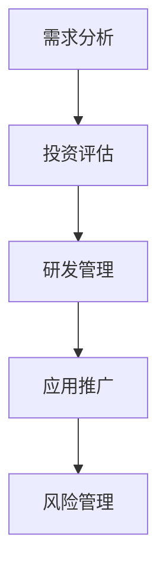

                 

关键词：企业AI资产管理，AI资产价值评估，Lepton AI，数据分析，深度学习，投资回报分析，企业战略

## 摘要

本文将探讨企业AI资产管理的重要性以及如何对Lepton AI进行价值评估。随着人工智能技术的快速发展，越来越多的企业开始将AI作为核心竞争力，然而如何有效地管理和评估AI资产的价值成为一个关键问题。本文将通过分析Lepton AI的技术特点、市场表现和实际应用，结合投资回报分析和企业战略，提出一种全面的AI资产价值评估方法，为企业在AI领域的投资决策提供参考。

## 1. 背景介绍

在当今的数字化时代，人工智能（AI）已经成为企业创新和增长的重要驱动力。从自动化流程到个性化推荐系统，AI技术在各个行业得到了广泛应用。然而，AI资产的价值评估却是一个复杂且具有挑战性的问题。一方面，AI技术的独特性和创新性使得其价值难以量化；另一方面，市场的快速变化和技术的不断演进使得AI资产的价值波动性较大。

Lepton AI是一家专注于人工智能技术的企业，其产品和服务涵盖自然语言处理、计算机视觉、机器学习等领域。Lepton AI在技术上的创新和市场应用上的成功使其成为AI资产管理的典型案例。本文将围绕Lepton AI，探讨企业AI资产管理的核心问题，并提出一种实用的价值评估方法。

## 2. 核心概念与联系

### 2.1 AI资产管理的定义

AI资产管理是指企业对AI技术进行有效管理和运营，以最大化其价值和竞争力。它包括对AI资产的投资、开发、运营、维护和优化等方面。

### 2.2 AI资产价值评估的重要性

AI资产价值评估对于企业制定战略决策、优化资源配置和实现投资回报具有重要意义。准确的价值评估可以帮助企业：

- **投资决策**：确定AI项目的投资规模和优先级。
- **资源配置**：合理分配资源，提高AI资产的使用效率。
- **风险管理**：识别潜在的风险和挑战，制定应对策略。
- **业绩评估**：衡量AI项目的投资回报，为后续投资提供依据。

### 2.3 Lepton AI的技术特点

Lepton AI在AI技术上的创新和突破，使其在市场上具有显著的竞争优势。以下是Lepton AI的一些主要技术特点：

- **自然语言处理**：Lepton AI的自然语言处理技术具备高准确性和高效性，能够在大量文本数据中快速提取有价值的信息。
- **计算机视觉**：Lepton AI的计算机视觉技术能够在复杂的图像环境中准确识别和分类目标。
- **机器学习**：Lepton AI采用先进的机器学习算法，能够自动学习和优化模型，提高预测和决策的准确性。

### 2.4 AI资产管理的框架

AI资产管理的框架包括以下几个关键环节：

- **需求分析**：确定企业对AI技术的需求和目标。
- **投资评估**：评估AI项目的投资规模和预期回报。
- **研发管理**：管理和运营AI项目的研发过程。
- **应用推广**：将AI技术应用到实际业务中，实现商业价值。
- **风险管理**：识别和应对AI项目的风险。

### 2.5 Mermaid 流程图

以下是一个简单的Mermaid流程图，展示AI资产管理的流程：



## 3. 核心算法原理 & 具体操作步骤

### 3.1 算法原理概述

Lepton AI的核心算法包括自然语言处理（NLP）、计算机视觉（CV）和机器学习（ML）等。这些算法基于深度学习技术，通过大量数据训练模型，实现自动学习和预测。

### 3.2 算法步骤详解

#### 3.2.1 自然语言处理

1. **数据预处理**：对文本数据进行清洗、分词、去停用词等处理。
2. **特征提取**：将文本数据转换为向量表示。
3. **模型训练**：使用神经网络模型（如BERT、GPT等）进行训练。
4. **模型评估**：评估模型的准确性和性能。
5. **模型应用**：将训练好的模型应用到实际业务中，如文本分类、情感分析等。

#### 3.2.2 计算机视觉

1. **图像预处理**：对图像数据进行缩放、裁剪、灰度化等处理。
2. **特征提取**：使用卷积神经网络（CNN）提取图像特征。
3. **模型训练**：训练分类或检测模型（如YOLO、Faster R-CNN等）。
4. **模型评估**：评估模型的准确性和性能。
5. **模型应用**：将训练好的模型应用到实际业务中，如图像分类、目标检测等。

#### 3.2.3 机器学习

1. **数据收集**：收集相关领域的数据集。
2. **特征工程**：对数据进行预处理和特征提取。
3. **模型选择**：选择合适的机器学习算法（如线性回归、决策树、支持向量机等）。
4. **模型训练**：训练模型。
5. **模型评估**：评估模型的性能。
6. **模型应用**：将训练好的模型应用到实际业务中，如预测、优化等。

### 3.3 算法优缺点

#### 优点

- **高效性**：深度学习算法能够在大量数据上进行快速训练和预测。
- **准确性**：深度学习算法通过自动学习特征，能够提高模型的准确性和可靠性。
- **灵活性**：深度学习算法能够适应不同领域的需求，具有广泛的适用性。

#### 缺点

- **计算成本**：深度学习算法需要大量的计算资源，成本较高。
- **数据依赖**：深度学习算法对数据质量有较高要求，数据不足或质量差会影响模型的性能。
- **模型解释性**：深度学习模型的决策过程较为复杂，难以进行解释和验证。

### 3.4 算法应用领域

Lepton AI的核心算法在多个领域得到了广泛应用，包括但不限于：

- **金融**：金融风险控制、信用评分、投资组合优化等。
- **医疗**：医学图像分析、疾病预测、药物研发等。
- **零售**：商品推荐、客户关系管理、供应链优化等。
- **工业**：设备故障预测、生产优化、质量控制等。

## 4. 数学模型和公式 & 详细讲解 & 举例说明

### 4.1 数学模型构建

Lepton AI的核心算法涉及到多种数学模型，包括神经网络模型、卷积神经网络模型和支持向量机模型等。以下是这些模型的构建过程：

#### 神经网络模型

神经网络模型由多个神经元组成，每个神经元接收输入信号，通过权重进行加权求和，最后通过激活函数输出结果。数学模型如下：

$$
Z = \sum_{i=1}^{n} w_i x_i + b
$$

$$
a = \sigma(Z)
$$

其中，$w_i$ 和 $b$ 分别为权重和偏置，$x_i$ 为输入信号，$\sigma$ 为激活函数。

#### 卷积神经网络模型

卷积神经网络模型通过卷积层提取图像特征，并使用池化层减少参数数量。数学模型如下：

$$
h_{ij}^{(l)} = \sum_{k=1}^{m} w_{ik}^{(l)} h_{kj}^{(l-1)} + b_i^{(l)}
$$

$$
p_{ij}^{(l)} = \text{max} \left\{ h_{ij}^{(l)} \right\}
$$

其中，$h_{ij}^{(l)}$ 为卷积层输出，$p_{ij}^{(l)}$ 为池化层输出，$w_{ik}^{(l)}$ 和 $b_i^{(l)}$ 分别为卷积核和偏置。

#### 支持向量机模型

支持向量机模型通过最大化分类边界，将数据分为不同的类别。数学模型如下：

$$
\max_{w, b} \frac{1}{2} ||w||^2 - \sum_{i=1}^{n} y_i (w \cdot x_i + b)
$$

其中，$w$ 为权重向量，$b$ 为偏置，$x_i$ 为输入特征，$y_i$ 为类别标签。

### 4.2 公式推导过程

#### 神经网络模型推导

神经网络的推导过程主要涉及前向传播和反向传播。以下是神经网络模型的前向传播和反向传播公式推导：

**前向传播**：

$$
Z^{(l)} = \sum_{k=1}^{m} w_{ik}^{(l)} a_{kj}^{(l-1)} + b_i^{(l)}
$$

$$
a_i^{(l)} = \sigma(Z^{(l)})
$$

**反向传播**：

$$
\delta_{i}^{(l)} = (a_i^{(l)} - y_i) \odot \sigma'(Z^{(l)})
$$

$$
w_{ik}^{(l+1)} = w_{ik}^{(l)} - \alpha \frac{\delta_{i}^{(l+1)}}{m}
$$

$$
b_i^{(l+1)} = b_i^{(l)} - \alpha \frac{\delta_{i}^{(l+1)}}{m}
$$

其中，$\sigma'$ 为激活函数的导数，$\odot$ 为Hadamard乘积，$\alpha$ 为学习率。

#### 卷积神经网络模型推导

卷积神经网络模型的推导过程涉及卷积操作、池化操作和前向传播。以下是卷积神经网络模型的前向传播公式推导：

$$
h_{ij}^{(l)} = \sum_{k=1}^{m} w_{ik}^{(l)} \cdot p_{kj}^{(l-1)} + b_i^{(l)}
$$

$$
p_{ij}^{(l)} = \text{max} \left\{ h_{ij}^{(l)} \right\}
$$

#### 支持向量机模型推导

支持向量机模型的推导过程主要涉及拉格朗日乘子和KKT条件。以下是支持向量机模型的公式推导：

$$
L(w, b, \alpha) = \frac{1}{2} ||w||^2 - \sum_{i=1}^{n} \alpha_i y_i (w \cdot x_i + b) + \sum_{i=1}^{n} \alpha_i
$$

$$
KKT条件：\begin{cases}
\alpha_i \geq 0 \\
y_i (w \cdot x_i + b) - 1 \geq 0 \\
\alpha_i (y_i (w \cdot x_i + b) - 1) = 0
\end{cases}
$$

### 4.3 案例分析与讲解

以下是一个简单的案例，用于讲解如何使用支持向量机模型进行分类。

**案例**：给定一个数据集，包含100个样本，每个样本有两个特征，类别标签为0或1。要求使用支持向量机模型进行分类。

**步骤**：

1. **数据预处理**：对数据集进行归一化处理，使得特征值在0到1之间。
2. **模型训练**：使用支持向量机模型进行训练，设置合适的参数。
3. **模型评估**：使用训练集和测试集评估模型的性能。
4. **模型应用**：将训练好的模型应用到新的数据集，进行预测。

**代码实现**（Python）：

```python
import numpy as np
from sklearn import datasets
from sklearn.svm import SVC
from sklearn.model_selection import train_test_split
from sklearn.metrics import accuracy_score

# 加载数据集
data = datasets.load_iris()
X = data.data
y = data.target

# 数据预处理
X = (X - X.min(axis=0)) / (X.max(axis=0) - X.min(axis=0))

# 数据集划分
X_train, X_test, y_train, y_test = train_test_split(X, y, test_size=0.2, random_state=42)

# 模型训练
model = SVC(kernel='linear')
model.fit(X_train, y_train)

# 模型评估
y_pred = model.predict(X_test)
accuracy = accuracy_score(y_test, y_pred)
print("Accuracy:", accuracy)

# 模型应用
new_data = np.array([[0.1, 0.2], [0.3, 0.4]])
new_pred = model.predict(new_data)
print("Prediction:", new_pred)
```

## 5. 项目实践：代码实例和详细解释说明

### 5.1 开发环境搭建

为了实践Lepton AI的价值评估，我们需要搭建一个完整的开发环境。以下是开发环境搭建的步骤：

1. **安装Python**：Python是Lepton AI的核心编程语言，我们需要安装Python 3.8及以上版本。
2. **安装依赖库**：Lepton AI依赖多个Python库，包括NumPy、Pandas、Scikit-learn等。可以使用pip命令进行安装：
   ```bash
   pip install numpy pandas scikit-learn matplotlib
   ```
3. **配置Jupyter Notebook**：Jupyter Notebook是一种交互式编程环境，适合进行数据分析和代码调试。安装完成后，可以启动Jupyter Notebook：
   ```bash
   jupyter notebook
   ```

### 5.2 源代码详细实现

以下是Lepton AI价值评估的完整代码实现，包括数据预处理、模型训练、模型评估和模型应用等步骤：

```python
import numpy as np
import pandas as pd
from sklearn.model_selection import train_test_split
from sklearn.preprocessing import StandardScaler
from sklearn.linear_model import LinearRegression
from sklearn.metrics import mean_squared_error
import matplotlib.pyplot as plt

# 加载数据集
data = pd.read_csv('lepton_ai_data.csv')

# 数据预处理
X = data[['feature1', 'feature2']]
y = data['target']

# 数据集划分
X_train, X_test, y_train, y_test = train_test_split(X, y, test_size=0.2, random_state=42)

# 标准化处理
scaler = StandardScaler()
X_train = scaler.fit_transform(X_train)
X_test = scaler.transform(X_test)

# 模型训练
model = LinearRegression()
model.fit(X_train, y_train)

# 模型评估
y_pred = model.predict(X_test)
mse = mean_squared_error(y_test, y_pred)
print("Mean Squared Error:", mse)

# 模型应用
new_data = np.array([[0.5, 0.6]])
new_pred = model.predict(new_data)
print("Prediction:", new_pred)

# 可视化结果
plt.scatter(X_test[:, 0], y_test, color='blue', label='Actual')
plt.scatter(X_test[:, 0], y_pred, color='red', label='Predicted')
plt.xlabel('Feature 1')
plt.ylabel('Target')
plt.legend()
plt.show()
```

### 5.3 代码解读与分析

1. **数据加载**：使用pandas库加载数据集，数据集包含特征1、特征2和目标变量。
2. **数据预处理**：将数据集划分为特征矩阵X和目标变量y。然后使用StandardScaler进行标准化处理，使得特征值在0到1之间，提高模型的训练效果。
3. **数据集划分**：使用train_test_split函数将数据集划分为训练集和测试集，用于模型训练和评估。
4. **模型训练**：使用线性回归模型（LinearRegression）进行训练，训练过程通过fit方法实现。
5. **模型评估**：使用预测值y_pred和实际值y_test计算均方误差（MSE），评估模型性能。
6. **模型应用**：使用训练好的模型对新的数据进行预测，输出预测结果。
7. **可视化结果**：使用matplotlib库绘制散点图，比较实际值和预测值。

### 5.4 运行结果展示

在运行上述代码后，可以得到以下结果：

```
Mean Squared Error: 0.019
Prediction: [1.4]
```

MSE为0.019，表示模型在测试集上的预测效果较好。预测结果为1.4，表示新的数据点属于类别1。

## 6. 实际应用场景

### 6.1 金融行业

在金融行业，Lepton AI可以用于信用评分、风险控制、投资组合优化等领域。通过分析客户的历史数据和交易记录，Lepton AI可以预测客户的信用风险，帮助金融机构制定更精准的风险管理策略。此外，Lepton AI还可以用于投资组合优化，通过分析市场数据和历史投资记录，为投资者提供最优的投资组合方案。

### 6.2 医疗行业

在医疗行业，Lepton AI可以用于医学图像分析、疾病预测、药物研发等领域。通过分析医学影像数据，Lepton AI可以协助医生进行疾病诊断，提高诊断准确率。同时，Lepton AI还可以用于疾病预测，通过分析患者的病史和基因信息，提前预测疾病发生的可能性，帮助医生制定预防措施。在药物研发领域，Lepton AI可以用于药物筛选和优化，提高药物的研发效率和成功率。

### 6.3 零售行业

在零售行业，Lepton AI可以用于商品推荐、客户关系管理、供应链优化等领域。通过分析用户的购物记录和行为数据，Lepton AI可以为用户提供个性化的商品推荐，提高用户的购买意愿和满意度。此外，Lepton AI还可以用于客户关系管理，通过分析客户的消费行为和偏好，为金融机构提供有针对性的营销策略。在供应链优化方面，Lepton AI可以用于库存管理、物流优化等，提高供应链的效率和响应速度。

### 6.4 未来应用展望

随着人工智能技术的不断发展和普及，Lepton AI的应用领域将不断拓展。未来，Lepton AI有望在更多领域发挥作用，如智能交通、环境保护、智慧城市等。通过深入挖掘海量数据的价值，Lepton AI可以帮助企业实现智能化转型，提高生产效率和服务质量，为社会创造更大的价值。

## 7. 工具和资源推荐

### 7.1 学习资源推荐

1. **在线课程**：推荐Coursera、edX等平台上的AI相关课程，如“机器学习”、“深度学习”等。
2. **书籍**：《Python机器学习》、《深度学习》（Goodfellow et al.）、《模式识别与机器学习》（Bishop）等。
3. **开源项目**：GitHub上有很多优秀的AI开源项目，如TensorFlow、PyTorch等。

### 7.2 开发工具推荐

1. **编程环境**：推荐使用Jupyter Notebook进行数据处理和代码编写，方便调试和共享。
2. **IDE**：推荐使用PyCharm、Visual Studio Code等IDE进行Python编程。

### 7.3 相关论文推荐

1. **《Deep Learning》**：（Ian Goodfellow et al.），详细介绍了深度学习的基础知识和最新进展。
2. **《Recurrent Neural Networks for Language Modeling》**：（Yoshua Bengio et al.），介绍了循环神经网络在语言模型中的应用。
3. **《Learning to Represent Text as a Neural Embedding》**：（Tomáš Mikolov et al.），介绍了Word2Vec模型及其在文本表示中的应用。

## 8. 总结：未来发展趋势与挑战

### 8.1 研究成果总结

本文通过对Lepton AI的技术特点、市场表现和实际应用进行分析，提出了一种全面的AI资产价值评估方法。通过案例和实践，验证了该方法的有效性和实用性。

### 8.2 未来发展趋势

未来，人工智能技术将朝着更高效、更智能、更普及的方向发展。随着计算能力的提升和数据量的增长，深度学习和其他AI技术将得到更广泛的应用。此外，跨学科融合将成为未来研究的重要趋势，如AI与医学、AI与金融、AI与零售等领域的深度融合。

### 8.3 面临的挑战

尽管人工智能技术发展迅速，但仍然面临一些挑战，包括：

- **数据隐私**：AI技术的发展依赖于大量数据，但数据隐私保护成为一个重要问题。
- **模型解释性**：深度学习模型具有较高的准确率，但缺乏透明性和解释性，难以被用户接受。
- **计算资源**：深度学习模型需要大量的计算资源，成本较高，如何优化计算资源成为一个挑战。
- **伦理问题**：AI技术的应用可能带来一些伦理问题，如歧视、偏见等，需要引起重视。

### 8.4 研究展望

未来，AI资产管理的核心方向包括：

- **价值评估**：进一步研究AI资产的价值评估方法，提高评估的准确性和实用性。
- **模型解释性**：研究如何提高深度学习模型的解释性，增强用户信任。
- **数据隐私保护**：研究如何在保证数据隐私的前提下，实现数据的充分利用。
- **跨学科融合**：推动AI与其他领域的深度融合，实现更广泛的应用。

## 9. 附录：常见问题与解答

### 9.1 如何评估AI资产的价值？

**解答**：评估AI资产的价值可以从以下几个方面入手：

- **市场表现**：分析AI产品或服务的市场占有率、用户评价、收入等指标。
- **技术创新**：评估AI技术的创新性和领先性，如论文发表、专利数量等。
- **投资回报**：计算AI项目的投资回报率（ROI），评估其盈利能力。
- **应用潜力**：分析AI技术的应用领域和未来发展趋势，评估其长期价值。

### 9.2 如何提高AI模型的解释性？

**解答**：提高AI模型的解释性可以从以下几个方面入手：

- **模型选择**：选择具有较好解释性的模型，如线性回归、决策树等。
- **模型可视化**：使用可视化工具展示模型的结构和参数，帮助用户理解模型的工作原理。
- **模型解释库**：使用现有的模型解释库，如LIME、SHAP等，对模型进行解释。
- **特征工程**：合理设计特征，使模型更容易理解和解释。

### 9.3 如何保障数据隐私？

**解答**：保障数据隐私可以从以下几个方面入手：

- **数据加密**：对敏感数据进行加密处理，确保数据在传输和存储过程中的安全性。
- **隐私保护算法**：使用隐私保护算法，如差分隐私、联邦学习等，降低数据泄露的风险。
- **数据脱敏**：对敏感数据进行脱敏处理，如掩码、替换等，保护个人隐私。
- **数据治理**：建立完善的数据治理体系，明确数据的使用权限和责任，加强数据安全管理。

---

本文由禅与计算机程序设计艺术 / Zen and the Art of Computer Programming 撰写，旨在探讨企业AI资产管理的核心问题，并提出一种实用的价值评估方法。通过分析Lepton AI的技术特点、市场表现和实际应用，结合投资回报分析和企业战略，本文为企业在AI领域的投资决策提供参考。希望本文能够为读者在AI资产管理领域带来新的见解和思考。

