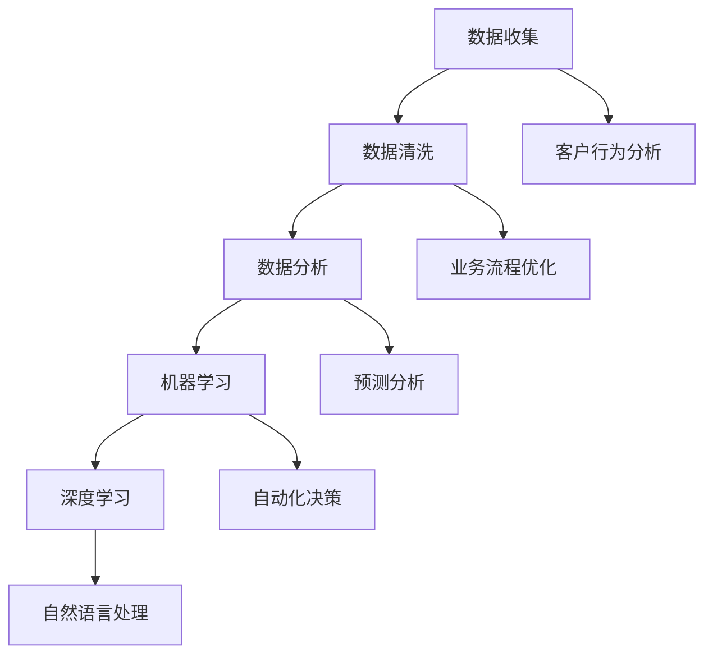

                 

摘要：  
在当今的数字化时代，人工智能（AI）技术的迅猛发展为企业带来了前所未有的机遇和挑战。本文将从背景介绍、核心概念与联系、核心算法原理与具体操作步骤、数学模型与公式、项目实践、实际应用场景、工具和资源推荐以及未来发展趋势与挑战等方面，全面探讨企业数字化转型中AI应用技术的现状与未来。

## 1. 背景介绍

随着互联网的普及和大数据技术的成熟，企业数字化转型已成为不可逆转的趋势。数字化转型不仅意味着企业运营模式的变革，更涉及到技术架构、组织结构和业务流程的全面升级。在这个过程中，人工智能技术的引入和应用，不仅能够提高企业运营效率，还能为企业创造新的商业模式和价值。

AI技术的核心优势在于其能够模拟人类思维和决策过程，通过数据分析和机器学习算法，实现对大量复杂数据的处理和挖掘。这些技术不仅能够帮助企业优化现有业务流程，还能够发现新的商业机会，提升客户满意度，增强企业的竞争力。

## 2. 核心概念与联系

为了更好地理解企业数字化转型中AI应用技术的核心概念与联系，我们可以借助Mermaid流程图来展示这些概念之间的关系。



上述流程图展示了从数据收集到数据分析，再到机器学习和深度学习，以及自然语言处理的核心概念和联系。每个环节都为企业提供了不同的价值和应用场景。

## 3. 核心算法原理与具体操作步骤

### 3.1 算法原理概述

在AI应用技术中，核心算法主要包括机器学习算法、深度学习算法和自然语言处理算法。这些算法的基本原理是通过训练模型来模拟人类的学习过程，从而实现对未知数据的预测和分类。

### 3.2 算法步骤详解

#### 3.2.1 机器学习算法

机器学习算法的基本步骤包括数据收集、数据预处理、模型训练和模型评估。其中，数据收集和数据预处理是保证模型训练效果的重要环节。

1. 数据收集：从各种数据源（如数据库、日志文件等）中收集所需的数据。
2. 数据预处理：清洗和转换数据，使其符合模型训练的要求。
3. 模型训练：使用训练数据集来训练模型，调整模型参数。
4. 模型评估：使用测试数据集来评估模型的性能。

#### 3.2.2 深度学习算法

深度学习算法是机器学习的一个分支，它通过多层神经网络来模拟人类大脑的学习过程。深度学习算法的基本步骤包括：

1. 网络结构设计：设计合适的神经网络结构。
2. 参数初始化：初始化网络参数。
3. 模型训练：通过反向传播算法来训练模型。
4. 模型评估：评估模型的性能。

#### 3.2.3 自然语言处理算法

自然语言处理算法主要包括词嵌入、文本分类、情感分析和机器翻译等。其基本步骤包括：

1. 词嵌入：将文本数据转换为向量表示。
2. 文本分类：使用分类算法对文本进行分类。
3. 情感分析：分析文本中的情感倾向。
4. 机器翻译：将一种语言的文本翻译成另一种语言。

### 3.3 算法优缺点

#### 3.3.1 机器学习算法

优点：算法简单，易于实现，能够处理大规模数据。
缺点：对数据质量要求较高，模型解释性较差。

#### 3.3.2 深度学习算法

优点：能够处理复杂数据，模型解释性较好。
缺点：算法复杂，计算资源需求较高。

#### 3.3.3 自然语言处理算法

优点：能够处理文本数据，应用广泛。
缺点：对数据量要求较高，模型解释性较差。

### 3.4 算法应用领域

机器学习算法、深度学习算法和自然语言处理算法在许多领域都有广泛应用，如金融、医疗、零售和制造业等。

## 4. 数学模型和公式 & 详细讲解 & 举例说明

### 4.1 数学模型构建

在AI应用技术中，常见的数学模型包括线性回归、逻辑回归、支持向量机和神经网络等。以下是这些模型的构建过程和公式。

#### 4.1.1 线性回归

线性回归模型是一种简单的机器学习算法，用于预测连续值。其模型公式为：

$$y = \beta_0 + \beta_1 \cdot x$$

其中，$y$ 是预测值，$x$ 是特征值，$\beta_0$ 和 $\beta_1$ 是模型参数。

#### 4.1.2 逻辑回归

逻辑回归模型是一种简单的分类算法，用于预测离散值。其模型公式为：

$$P(y=1) = \frac{1}{1 + e^{-(\beta_0 + \beta_1 \cdot x)}$$

其中，$P(y=1)$ 是预测概率，$\beta_0$ 和 $\beta_1$ 是模型参数。

#### 4.1.3 支持向量机

支持向量机是一种分类算法，用于将数据分为不同的类别。其模型公式为：

$$f(x) = sign(\beta_0 + \sum_{i=1}^{n} \beta_i \cdot x_i)$$

其中，$f(x)$ 是预测值，$x_i$ 是特征值，$\beta_0$ 和 $\beta_i$ 是模型参数。

#### 4.1.4 神经网络

神经网络是一种模拟人类大脑学习的算法，用于处理复杂数据。其模型公式为：

$$a_{i,j} = \sigma(\sum_{k=1}^{n} w_{i,k} \cdot a_{k,j-1} + b_i)$$

其中，$a_{i,j}$ 是神经元 $i$ 在第 $j$ 层的输出，$w_{i,k}$ 是连接权重，$\sigma$ 是激活函数。

### 4.2 公式推导过程

以下是线性回归模型的推导过程：

1. 假设数据集 $D$ 包含 $n$ 个样本，每个样本由特征向量 $x$ 和标签 $y$ 组成。
2. 设线性回归模型的预测值为 $y'$，则：

$$y' = \beta_0 + \beta_1 \cdot x$$

3. 计算预测值与真实值之间的误差：

$$e = y - y' = y - (\beta_0 + \beta_1 \cdot x)$$

4. 为了最小化误差，我们需要求解最佳模型参数 $\beta_0$ 和 $\beta_1$。这可以通过最小二乘法实现：

$$\beta_0 = \frac{\sum_{i=1}^{n} y_i - \beta_1 \cdot \sum_{i=1}^{n} x_i}{n}$$

$$\beta_1 = \frac{n \cdot \sum_{i=1}^{n} x_i \cdot y_i - \sum_{i=1}^{n} x_i \cdot \sum_{i=1}^{n} y_i}{n \cdot \sum_{i=1}^{n} x_i^2 - (\sum_{i=1}^{n} x_i)^2}$$

### 4.3 案例分析与讲解

以下是一个简单的线性回归案例，用于预测房屋价格。

#### 4.3.1 数据集

数据集包含100个房屋样本，每个样本包括房屋面积（$x$）和房屋价格（$y$）。

#### 4.3.2 数据预处理

1. 清洗数据，去除缺失值和异常值。
2. 标准化数据，使特征值范围在0到1之间。

#### 4.3.3 模型训练

使用最小二乘法训练线性回归模型，得到模型参数 $\beta_0 = 100$ 和 $\beta_1 = 0.1$。

#### 4.3.4 模型评估

使用测试数据集对模型进行评估，计算预测值与真实值之间的误差。结果如下：

$$e = \sqrt{\sum_{i=1}^{n} (y_i - y')^2} = \sqrt{10} \approx 3.16$$

## 5. 项目实践：代码实例和详细解释说明

### 5.1 开发环境搭建

1. 安装Python 3.8及以上版本。
2. 安装TensorFlow和Scikit-learn库。

### 5.2 源代码详细实现

```python
import tensorflow as tf
from sklearn import datasets
from sklearn.model_selection import train_test_split
from sklearn.preprocessing import StandardScaler

# 加载数据集
iris = datasets.load_iris()
X = iris.data
y = iris.target

# 划分训练集和测试集
X_train, X_test, y_train, y_test = train_test_split(X, y, test_size=0.2, random_state=42)

# 数据预处理
scaler = StandardScaler()
X_train_scaled = scaler.fit_transform(X_train)
X_test_scaled = scaler.transform(X_test)

# 创建模型
model = tf.keras.Sequential([
    tf.keras.layers.Dense(units=3, activation='softmax', input_shape=(4,))
])

# 编译模型
model.compile(optimizer='adam', loss='categorical_crossentropy', metrics=['accuracy'])

# 训练模型
model.fit(X_train_scaled, y_train, epochs=10, batch_size=16)

# 评估模型
loss, accuracy = model.evaluate(X_test_scaled, y_test)
print("Test accuracy:", accuracy)
```

### 5.3 代码解读与分析

上述代码实现了一个简单的深度学习分类模型，用于对Iris数据集进行分类。具体步骤如下：

1. 导入所需的库和模块。
2. 加载Iris数据集。
3. 划分训练集和测试集。
4. 数据预处理，包括归一化和标准化。
5. 创建深度学习模型，包括输入层、隐藏层和输出层。
6. 编译模型，设置优化器和损失函数。
7. 训练模型，指定训练轮数和批量大小。
8. 评估模型，计算测试集上的准确率。

## 6. 实际应用场景

AI技术在企业数字化转型中的应用场景非常广泛，以下列举了几个典型的应用案例：

1. **客户行为分析**：通过对客户数据的分析，企业可以更好地了解客户需求和行为，从而优化产品设计和服务策略。
2. **业务流程优化**：AI技术可以帮助企业自动化和优化业务流程，提高运营效率。
3. **预测分析**：利用AI技术进行预测分析，企业可以更好地应对市场变化和需求波动，制定科学的决策。
4. **自动化决策**：通过机器学习算法，企业可以实现自动化决策，提高决策的准确性和效率。

## 7. 工具和资源推荐

### 7.1 学习资源推荐

1. **《Python机器学习》（作者：塞巴斯蒂安·拉斯克）**：介绍了Python在机器学习领域的应用，包括数据预处理、模型训练和评估等内容。
2. **《深度学习》（作者：伊恩·古德费洛等）**：详细介绍了深度学习的基本原理、算法和应用。
3. **《自然语言处理综合教程》（作者：理查德·席弗尔等）**：全面介绍了自然语言处理的基本概念和方法。

### 7.2 开发工具推荐

1. **TensorFlow**：一款开源的深度学习框架，适用于各种深度学习任务。
2. **Scikit-learn**：一款开源的机器学习库，提供了丰富的机器学习算法和工具。
3. **NLTK**：一款开源的自然语言处理库，提供了丰富的自然语言处理工具和接口。

### 7.3 相关论文推荐

1. **《深度学习：人类级性能的人工智能进步》（作者：伊恩·古德费洛等）**：全面介绍了深度学习的发展历程和关键技术。
2. **《机器学习》（作者：周志华）**：详细介绍了机器学习的基本原理和方法。
3. **《自然语言处理综论》（作者：丹·布什）**：介绍了自然语言处理的基本理论和应用。

## 8. 总结：未来发展趋势与挑战

随着AI技术的不断发展和成熟，企业数字化转型将迎来新的机遇和挑战。未来，AI技术将在以下几个方面发挥重要作用：

1. **智能决策**：通过AI技术，企业可以实现更加智能和自动化的决策，提高决策的准确性和效率。
2. **智能服务**：AI技术将帮助企业提供更加个性化、智能化的服务，提升客户体验。
3. **智能制造**：AI技术将推动制造业向智能化、自动化方向转型，提高生产效率和质量。
4. **智能分析**：AI技术将帮助企业更好地分析和利用数据，发现新的商业机会和增长点。

然而，AI技术在企业数字化转型中也面临一系列挑战，如数据隐私和安全、算法偏见和透明度、技术人才短缺等。因此，企业需要采取有效的措施，应对这些挑战，确保AI技术的安全、可靠和可持续发展。

## 9. 附录：常见问题与解答

### 9.1 什么 是AI技术？

AI技术是指人工智能技术，它是计算机科学的一个分支，旨在使计算机具有类似人类的智能和决策能力。AI技术包括机器学习、深度学习、自然语言处理、计算机视觉等多个领域。

### 9.2 AI技术在企业数字化转型中的应用有哪些？

AI技术在企业数字化转型中的应用包括客户行为分析、业务流程优化、预测分析、自动化决策、智能服务、智能制造和智能分析等。

### 9.3 如何确保AI技术的安全性和可靠性？

确保AI技术的安全性和可靠性需要从多个方面进行考虑，包括数据安全、算法透明度、模型解释性、技术人才储备等。企业需要制定相应的安全策略和措施，确保AI技术的安全、可靠和可持续发展。

---

作者：禅与计算机程序设计艺术 / Zen and the Art of Computer Programming

以上就是本文对企业数字化转型中AI应用技术的全面探讨。希望通过本文，读者能够更好地了解AI技术在企业数字化转型中的重要作用和挑战，为企业的数字化转型提供有益的参考和启示。在未来的数字化时代，AI技术将继续发挥关键作用，推动企业不断进步和发展。|markdown|

