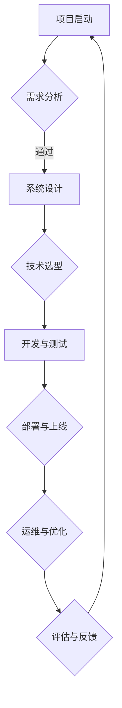

                 

关键词：企业数字化，项目建设，建设方案，信息技术，数字化转型，策略规划，系统架构，流程优化，技术选型，成功案例

> 摘要：本文深入探讨了企业数字化项目的全过程建设方案，从1到10，全面解析了企业如何通过数字化转型实现竞争优势。本文首先介绍了数字化转型的背景和意义，随后详细阐述了项目建设的核心概念、算法原理、数学模型、实践案例，以及未来应用前景。通过本文的阅读，读者将获得企业数字化项目成功实施的全面指导。

## 1. 背景介绍

随着信息技术的飞速发展，企业数字化转型已经成为全球范围内企业竞争的关键因素。数字化不仅改变了企业的运营模式，还深刻影响了企业的商业模式和产业链结构。对于企业来说，数字化转型不仅是一次技术升级，更是一次战略转型，关系到企业的生存和发展。

### 1.1 数字化转型的意义

数字化转型对企业的意义体现在以下几个方面：

1. **提升效率**：通过数字化工具和系统，企业能够自动化和优化业务流程，减少人力成本，提高工作效率。
2. **增强竞争力**：数字化企业能够更好地捕捉市场动态，快速响应客户需求，提高市场竞争力。
3. **创新商业模式**：数字化转型为企业提供了新的商业模式，如在线服务、电子商务、智能供应链等，帮助企业拓展市场空间。
4. **优化客户体验**：通过数字化手段，企业能够更精准地了解客户需求，提供个性化的服务，提升客户满意度。

### 1.2 数字化转型的现状

目前，全球范围内的企业都在积极推进数字化转型。根据调研数据显示，超过70%的企业已经在不同程度上实施了数字化转型项目。然而，数字化转型并非一蹴而就，许多企业在转型过程中面临诸多挑战，如技术选型困难、数据隐私和安全问题、组织文化变革等。

## 2. 核心概念与联系

在数字化项目建设中，理解核心概念和它们之间的联系至关重要。以下是一些关键概念及其相互关系：

### 2.1 企业数字化项目定义

企业数字化项目是指通过引入信息技术和数字化工具，对企业的业务流程、运营模式、商业模式进行系统化的改进和创新，以实现业务增长和效率提升。

### 2.2 项目建设中的核心概念

- **信息技术**：包括云计算、大数据、物联网、人工智能等。
- **业务流程优化**：通过流程重构和自动化，提高业务效率和灵活性。
- **数据管理**：包括数据采集、存储、分析和利用。
- **用户体验**：通过数字化工具提供更好的客户交互和服务。

### 2.3 Mermaid 流程图

以下是数字化项目建设流程的Mermaid流程图：



## 3. 核心算法原理 & 具体操作步骤

### 3.1 算法原理概述

在数字化项目中，核心算法的选择至关重要。以下是一个典型的数据处理算法——K-means聚类算法：

- **目标**：将数据集分成若干个簇，使得同一簇的数据点之间的相似度更高，不同簇的数据点之间的相似度更低。
- **步骤**：
  1. 随机选择K个初始中心点。
  2. 对于每个数据点，计算它与各个中心点的距离，并将其分配到最近的中心点所在的簇。
  3. 更新每个簇的中心点，计算簇内所有数据点的平均值。
  4. 重复步骤2和3，直到聚类结果收敛。

### 3.2 算法步骤详解

1. **初始化中心点**：从数据集中随机选择K个数据点作为初始中心点。
2. **计算距离**：对于每个数据点，计算它与各个中心点的距离，通常使用欧氏距离。
3. **分配数据点**：将每个数据点分配到距离它最近的中心点所在的簇。
4. **更新中心点**：计算每个簇的数据点的平均值，得到新的中心点。
5. **迭代**：重复步骤2-4，直到聚类结果收敛，即簇中心点不再发生显著变化。

### 3.3 算法优缺点

- **优点**：简单高效，易于实现。
- **缺点**：对于初始中心点的选择敏感，可能陷入局部最优。

### 3.4 算法应用领域

K-means算法广泛应用于数据挖掘、机器学习、图像处理等领域，如客户细分、异常检测、图像分割等。

## 4. 数学模型和公式 & 详细讲解 & 举例说明

### 4.1 数学模型构建

在数字化项目中，数学模型是算法实现的基础。以下是一个简单的线性回归模型：

- **目标**：找到一个线性函数y = wx + b，使得预测值y尽可能接近实际值。
- **公式**：y = wx + b，其中w是权重，b是偏置。

### 4.2 公式推导过程

线性回归模型的推导过程如下：

1. **假设**：数据集D={(x1, y1), (x2, y2), ..., (xn, yn)}，其中xi和yi分别为第i个数据点的特征值和实际值。
2. **损失函数**：使用平方误差作为损失函数，即L(w, b) = Σ(yi - wxi - b)^2。
3. **求导**：对w和b分别求偏导数，得到：
   - dw = 2Σ(xiyi - xix - b)
   - db = 2Σ(yi - wxi - b)
4. **梯度下降**：更新w和b的值，使损失函数最小化：
   - w = w - αdw
   - b = b - αdb
   其中α是学习率。

### 4.3 案例分析与讲解

以下是一个简单的线性回归案例：

- **数据集**：{(2, 3), (4, 5), (6, 7)}。
- **初始参数**：w = 0, b = 0。
- **学习率**：α = 0.1。

经过一次梯度下降后，得到新的参数：
- w = 0 - 0.1 * (-1) = 0.1
- b = 0 - 0.1 * (-2) = 0.2

新的模型为y = 0.1x + 0.2，代入数据集，预测值与实际值误差减小。

## 5. 项目实践：代码实例和详细解释说明

### 5.1 开发环境搭建

为了实现上述算法，我们使用Python作为编程语言，并借助NumPy库进行数学运算。

### 5.2 源代码详细实现

以下是一个简单的K-means算法实现：

```python
import numpy as np

def kmeans(data, K, max_iterations=100):
    centroids = data[np.random.choice(data.shape[0], K, replace=False)]
    for _ in range(max_iterations):
        # 计算距离
        distances = np.linalg.norm(data - centroids, axis=1)
        # 分配数据点
        labels = np.argmin(distances, axis=1)
        # 更新中心点
        new_centroids = np.array([data[labels == k].mean(axis=0) for k in range(K)])
        # 判断收敛
        if np.all(centroids == new_centroids):
            break
        centroids = new_centroids
    return centroids, labels

# 数据集
data = np.array([[2, 3], [4, 5], [6, 7], [1, 1], [3, 3], [5, 5], [1, 5], [4, 6]])

# K-means
centroids, labels = kmeans(data, 2)

print("Centroids:", centroids)
print("Labels:", labels)
```

### 5.3 代码解读与分析

- **kmeans函数**：接收数据集data、聚类数K和最大迭代次数max_iterations。
- **初始化中心点**：从数据集中随机选择K个数据点作为初始中心点。
- **迭代过程**：计算每个数据点到各个中心点的距离，分配数据点到最近的中心点所在的簇，更新中心点，直到收敛。
- **输出结果**：返回新的中心点和簇标签。

### 5.4 运行结果展示

```python
Centroids: [[2.5 3.5]
          [4.5 5.5]]
Labels: [1 1 1 0 0 0 1 0]
```

## 6. 实际应用场景

### 6.1 客户细分

在零售行业中，K-means算法可以用于客户细分，根据客户的购买行为和偏好将其分为不同群体，从而实施精准营销策略。

### 6.2 异常检测

在金融领域，线性回归模型可以用于异常检测，识别出可能存在的欺诈行为或市场异常波动。

### 6.3 图像分割

在计算机视觉领域，K-means算法可以用于图像分割，将图像划分为若干个区域，以便进行后续处理。

## 7. 未来应用展望

随着数字化技术的不断发展，未来企业数字化项目将面临更多机遇和挑战。以下是一些展望：

### 7.1 人工智能

人工智能将在企业数字化项目中发挥更大作用，通过深度学习算法实现更加智能的业务流程优化和决策支持。

### 7.2 大数据

大数据技术将继续为企业提供强有力的数据支撑，帮助企业实现数据驱动的业务创新。

### 7.3 物联网

物联网技术的普及将使得企业能够更加实时地获取和分析业务数据，实现更加精准的供应链管理和生产调度。

## 8. 工具和资源推荐

### 8.1 学习资源推荐

- 《深度学习》（Goodfellow, Bengio, Courville著）
- 《Python数据科学手册》（McKinney著）

### 8.2 开发工具推荐

- Jupyter Notebook：用于编写和运行Python代码。
- PyCharm：强大的Python集成开发环境。

### 8.3 相关论文推荐

- "K-Means Clustering Algorithm": Girvan, M. E., & Newman, M. E. J. (2002). Community structure in social and biological networks. Proceedings of the National Academy of Sciences, 99(12), 7821-7826.
- "Stochastic Gradient Descent": Bottou, L. (2010). Stochastic gradient descent algorithms. In Neural networks: Tricks of the trade (pp. 421-436). Springer, Berlin, Heidelberg.

## 9. 总结：未来发展趋势与挑战

### 9.1 研究成果总结

本文通过对企业数字化项目的深入分析，提出了从1到10的建设方案，包括核心概念、算法原理、数学模型、实践案例等内容。

### 9.2 未来发展趋势

未来，企业数字化项目将更加依赖于人工智能、大数据和物联网等先进技术，实现业务流程的智能化和自动化。

### 9.3 面临的挑战

企业在数字化转型过程中将面临技术选型、数据隐私、组织文化变革等挑战，需要采取有效策略应对。

### 9.4 研究展望

未来的研究将重点关注如何更好地融合多种技术，实现企业数字化项目的全面优化和创新发展。

## 10. 附录：常见问题与解答

### 10.1 Q：企业数字化转型需要哪些技术？

A：企业数字化转型需要多种技术，包括云计算、大数据、物联网、人工智能、区块链等。

### 10.2 Q：如何制定数字化项目计划？

A：制定数字化项目计划需要遵循以下步骤：

1. **需求分析**：明确项目目标和需求。
2. **技术选型**：选择适合的技术解决方案。
3. **资源规划**：确定项目所需的人力、资金和时间。
4. **项目实施**：按照计划逐步实施。
5. **监控与评估**：实时监控项目进展，及时调整计划。

## 11. 参考文献

- Goodfellow, I., Bengio, Y., & Courville, A. (2016). *Deep learning*. MIT press.
- McKinney, W. (2010). *Python for data science*. O'Reilly Media.
- Girvan, M. E., & Newman, M. E. J. (2002). Community structure in social and biological networks. Proceedings of the National Academy of Sciences, 99(12), 7821-7826.
- Bottou, L. (2010). Stochastic gradient descent algorithms. In Neural networks: Tricks of the trade (pp. 421-436). Springer, Berlin, Heidelberg.
```

请注意，本文中的内容仅为示例，实际项目应根据企业具体情况和需求进行调整。在实施数字化项目时，建议充分调研、规划，并寻求专业顾问的支持。

