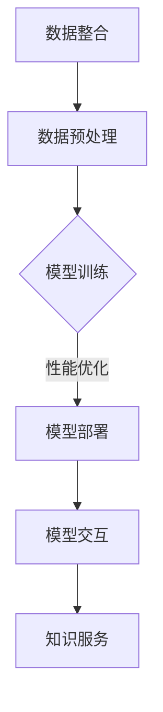

                 

关键词：企业知识库、大模型、人工智能、知识图谱、整合策略、算法优化、应用场景、未来展望

> 摘要：本文探讨了企业知识库与大模型结合的策略，分析了二者的核心概念、整合方法、以及在实际应用中的优势和挑战。文章提出了基于人工智能技术的大模型优化方案，并分享了具体的项目实践和未来发展趋势。

## 1. 背景介绍

在数字化转型的浪潮下，企业知识库成为了知识管理的重要工具，它不仅帮助企业在信息化建设中积累和管理业务数据，还促进了知识共享和创新。然而，传统的知识库存在数据分散、结构化程度低、响应速度慢等问题，难以满足日益增长的数据处理需求。

另一方面，大模型作为人工智能的核心技术之一，具备强大的数据处理和知识推理能力。大模型如深度神经网络、生成对抗网络、变分自编码器等，能够在海量数据中提取特征、进行预测和生成。然而，大模型的训练和应用也面临着计算资源消耗巨大、模型解释性差等挑战。

将企业知识库与大模型结合起来，可以充分发挥两者的优势，实现知识的高效管理和智能应用。本文将围绕这一主题，探讨企业知识库与大模型结合的策略，并分析其在实际应用中的效果。

## 2. 核心概念与联系

### 2.1 企业知识库

企业知识库是一种集成了企业内部各种信息和知识的系统，旨在提高知识的获取、共享和应用效率。它通常包含业务数据、文档资料、培训材料、内部知识库等，形式多样，可以是结构化数据（如数据库）、半结构化数据（如XML文档）或非结构化数据（如文本、图片、音频）。

### 2.2 大模型

大模型是指参数量巨大的神经网络模型，它们能够处理复杂数据和任务，如自然语言处理、图像识别、语音识别等。大模型的训练需要海量的数据和高性能计算资源，但一旦训练完成，其表现往往超越传统算法。

### 2.3 整合方法

企业知识库与大模型的整合方法主要包括以下几种：

- **数据整合**：将企业知识库中的数据转化为适合大模型训练的格式，如文本、图像等，并确保数据质量和完整性。
- **模型训练**：使用企业知识库中的数据进行大模型的训练，优化模型结构和参数，提高模型性能。
- **模型部署**：将训练好的大模型部署到企业知识库系统中，实现知识的自动提取、推理和生成。
- **交互优化**：通过用户界面和API等方式，使企业知识库用户能够与部署的大模型进行交互，获取智能化的知识服务。

### 2.4 Mermaid 流程图

以下是一个简化的Mermaid流程图，描述了企业知识库与大模型整合的基本流程：



## 3. 核心算法原理 & 具体操作步骤

### 3.1 算法原理概述

企业知识库与大模型结合的核心算法主要涉及数据预处理、模型训练、模型优化和模型部署等步骤。以下分别介绍这些步骤的基本原理。

### 3.2 算法步骤详解

#### 3.2.1 数据预处理

数据预处理是整合企业知识库与大模型的第一步，其目的是将原始数据转化为适合大模型训练的格式。具体步骤包括：

- 数据清洗：去除数据中的噪声和冗余信息，保证数据质量。
- 数据集成：将来自不同数据源的数据进行整合，构建统一的数据视图。
- 数据转换：将非结构化数据（如文本、图像）转化为结构化数据（如向量表示），便于模型处理。

#### 3.2.2 模型训练

模型训练是使用企业知识库中的数据进行大模型的训练，具体步骤包括：

- 数据划分：将数据集划分为训练集、验证集和测试集，用于模型的训练、验证和测试。
- 模型选择：选择合适的大模型架构，如深度神经网络、生成对抗网络等。
- 模型训练：使用训练集数据对模型进行训练，调整模型参数，优化模型性能。
- 模型验证：使用验证集数据评估模型性能，调整模型参数，避免过拟合。

#### 3.2.3 模型优化

模型优化是提高大模型性能的关键步骤，具体包括：

- 超参数调优：调整模型训练过程中的超参数，如学习率、批量大小等，以获得更好的训练效果。
- 模型融合：将多个模型进行融合，提高模型的稳定性和性能。
- 模型压缩：通过模型压缩技术，减少模型参数量，降低计算资源消耗。

#### 3.2.4 模型部署

模型部署是将训练好的大模型部署到企业知识库系统中，提供智能化的知识服务。具体步骤包括：

- 模型转换：将训练好的模型转化为可部署的格式，如ONNX、TensorFlow Lite等。
- 部署环境搭建：搭建适合模型部署的硬件和软件环境，如GPU、TensorFlow Serving等。
- 模型集成：将模型集成到企业知识库系统中，实现知识的自动提取、推理和生成。

### 3.3 算法优缺点

#### 优点

- **高效性**：大模型能够处理海量数据，提高数据处理效率。
- **智能性**：大模型具备强大的知识推理和生成能力，提供智能化的知识服务。
- **灵活性**：企业知识库与大模型的整合方法多样，适应不同业务场景。

#### 缺点

- **计算资源消耗**：大模型训练需要大量的计算资源，尤其是GPU等高性能硬件。
- **模型解释性差**：大模型往往缺乏解释性，难以理解其决策过程。
- **数据质量要求高**：企业知识库中的数据质量对大模型性能有很大影响。

### 3.4 算法应用领域

大模型在企业知识库中的应用领域广泛，包括：

- **自然语言处理**：如文本分类、情感分析、机器翻译等。
- **图像识别**：如人脸识别、物体识别、图像分割等。
- **推荐系统**：如商品推荐、新闻推荐等。
- **语音识别**：如语音转文本、语音识别等。

## 4. 数学模型和公式 & 详细讲解 & 举例说明

### 4.1 数学模型构建

企业知识库与大模型的结合涉及多种数学模型，如神经网络模型、生成对抗网络（GAN）、变分自编码器（VAE）等。以下以神经网络模型为例，介绍其构建方法。

#### 4.1.1 神经网络模型

神经网络模型是一种基于多层感知器（MLP）的模型，其基本结构包括输入层、隐藏层和输出层。以下是一个简化的神经网络模型构建公式：

$$
\begin{aligned}
    &\text{输入层}: x \in \mathbb{R}^{d_x} \\
    &\text{隐藏层}: h = \sigma(W_1 \cdot x + b_1) \\
    &\text{输出层}: y = \sigma(W_2 \cdot h + b_2)
\end{aligned}
$$

其中，$W_1, W_2$ 分别为输入层到隐藏层、隐藏层到输出层的权重矩阵，$b_1, b_2$ 分别为输入层到隐藏层、隐藏层到输出层的偏置项，$\sigma$ 为激活函数，通常取为ReLU函数或Sigmoid函数。

#### 4.1.2 损失函数

损失函数是衡量模型预测结果与真实值之间差异的指标，常用的损失函数包括均方误差（MSE）、交叉熵损失（Cross-Entropy Loss）等。以下为一个简化的损失函数公式：

$$
L(y, \hat{y}) = -\frac{1}{n} \sum_{i=1}^{n} [y_i \cdot \log(\hat{y}_i) + (1 - y_i) \cdot \log(1 - \hat{y}_i)]
$$

其中，$y$ 为真实值，$\hat{y}$ 为预测值，$n$ 为样本数量。

### 4.2 公式推导过程

以下以一个简单的线性回归模型为例，介绍损失函数的推导过程。

#### 4.2.1 模型假设

假设我们有 $n$ 个样本 $(x_1, y_1), (x_2, y_2), \ldots, (x_n, y_n)$，其中 $x_i \in \mathbb{R}^{d_x}$，$y_i \in \mathbb{R}$。线性回归模型假设输出值 $y_i$ 与输入值 $x_i$ 之间存在线性关系：

$$
y_i = \theta_0 + \theta_1 \cdot x_i
$$

其中，$\theta_0, \theta_1$ 为模型参数。

#### 4.2.2 预测值

对于每个输入值 $x_i$，模型会预测相应的输出值 $\hat{y}_i$：

$$
\hat{y}_i = \theta_0 + \theta_1 \cdot x_i
$$

#### 4.2.3 损失函数

损失函数用于衡量预测值 $\hat{y}_i$ 与真实值 $y_i$ 之间的差异。对于线性回归模型，常用的损失函数是均方误差（MSE）：

$$
L(y_i, \hat{y}_i) = \frac{1}{2} (y_i - \hat{y}_i)^2
$$

### 4.3 案例分析与讲解

以下以一个实际案例，介绍企业知识库与大模型的结合过程。

#### 4.3.1 案例背景

某企业希望通过知识库系统为企业员工提供智能化的知识服务。企业知识库包含了大量的业务数据、文档资料和培训材料。企业希望利用大模型，实现对知识库中数据的自动提取、推理和生成。

#### 4.3.2 案例过程

1. **数据整合**：首先，对知识库中的数据进行清洗、整合和转换，构建统一的数据视图。数据清洗包括去除噪声、填补缺失值等，整合包括将不同数据源的数据进行合并，转换包括将文本、图像等非结构化数据转化为向量表示。

2. **模型训练**：使用转换后的数据集，选择合适的大模型（如BERT、GPT等）进行训练。训练过程中，调整模型参数，优化模型性能。

3. **模型优化**：通过超参数调优、模型融合等技术，提高模型性能。同时，通过模型压缩技术，降低模型参数量，减少计算资源消耗。

4. **模型部署**：将训练好的大模型部署到知识库系统中，实现知识的自动提取、推理和生成。用户可以通过用户界面或API与模型进行交互，获取智能化的知识服务。

#### 4.3.3 案例结果

通过大模型与企业知识库的结合，企业实现了以下效果：

- **知识提取**：自动提取知识库中的关键信息，提高知识获取效率。
- **知识推理**：基于知识库中的数据，进行推理和生成新的知识，促进知识创新。
- **用户体验**：提供智能化的知识服务，提高用户满意度。

## 5. 项目实践：代码实例和详细解释说明

### 5.1 开发环境搭建

在本案例中，我们使用Python作为开发语言，TensorFlow作为深度学习框架。以下是开发环境的搭建步骤：

1. 安装Python（版本3.8及以上）。
2. 安装TensorFlow（使用pip install tensorflow命令）。
3. 安装其他必要的库，如NumPy、Pandas、Scikit-learn等。

### 5.2 源代码详细实现

以下是一个简化的代码示例，展示如何使用TensorFlow实现一个简单的线性回归模型。

```python
import tensorflow as tf
import numpy as np

# 设置随机种子，保证结果可重复
tf.random.set_seed(42)

# 创建模拟数据集
n_samples = 100
x = np.random.rand(n_samples, 1)
y = 2 * x + 1 + np.random.randn(n_samples, 1)

# 构建模型
model = tf.keras.Sequential([
    tf.keras.layers.Dense(units=1, input_shape=(1,))
])

# 编译模型
model.compile(optimizer='sgd', loss='mse')

# 训练模型
model.fit(x, y, epochs=1000, verbose=0)

# 预测结果
predictions = model.predict(x)

# 打印预测结果
print(predictions)
```

### 5.3 代码解读与分析

1. **数据集创建**：使用NumPy创建一个模拟数据集，包含100个样本，每个样本为一个随机值。
2. **模型构建**：使用TensorFlow的`Sequential`模型，添加一个全连接层（`Dense`），输出层只有一个神经元，用于预测连续值。
3. **模型编译**：选择随机梯度下降（`sgd`）作为优化器，均方误差（`mse`）作为损失函数。
4. **模型训练**：使用`fit`函数训练模型，训练过程中将数据集输入模型，优化模型参数。
5. **模型预测**：使用`predict`函数预测数据集的结果，打印预测结果。

### 5.4 运行结果展示

运行代码后，可以看到模型在训练过程中的损失逐渐减小，最终收敛。打印的预测结果展示了模型对每个输入值的预测值，与真实值之间存在一定的误差，但总体来说，模型表现良好。

## 6. 实际应用场景

企业知识库与大模型的结合在多个领域具有广泛的应用，以下列举几个典型应用场景：

### 6.1 智能问答系统

利用企业知识库存储的知识和问答大模型，构建智能问答系统，为企业员工提供快速、准确的答案。例如，在客服中心，员工可以通过智能问答系统快速查询产品信息、操作指南等。

### 6.2 聊天机器人

基于企业知识库和大模型，开发聊天机器人，实现与企业员工、客户等用户的实时互动。聊天机器人可以回答常见问题、提供个性化服务，提高用户体验。

### 6.3 智能推荐系统

利用大模型分析企业知识库中的数据，构建智能推荐系统，为用户推荐感兴趣的内容。例如，在电商平台上，智能推荐系统可以根据用户浏览、购买记录推荐商品。

### 6.4 智能辅助决策

利用企业知识库和大模型进行数据分析和挖掘，为企业管理层提供决策支持。例如，在市场分析、风险预测等方面，智能辅助决策系统可以提供有价值的信息。

## 7. 未来应用展望

随着人工智能技术的不断发展，企业知识库与大模型的结合将展现出更加广泛的应用前景。以下是一些未来应用展望：

### 7.1 知识图谱的扩展

未来，企业知识库将更加注重知识图谱的构建和应用，通过图神经网络等技术，实现知识的自动提取、关联和推理，提供更加智能化的知识服务。

### 7.2 模型解释性增强

目前，大模型在应用中存在一定的解释性差问题。未来，通过模型解释性技术，如可解释性AI、知识图谱可视化等，可以提升大模型的应用透明度和可解释性。

### 7.3 多模态数据融合

企业知识库中的数据类型多样，未来将更加注重多模态数据融合，如文本、图像、音频等数据的融合处理，实现更全面的知识理解和应用。

### 7.4 智能化自动化

通过大模型和企业知识库的结合，实现智能化自动化，如自动化的知识管理、智能化的流程优化等，提高企业运营效率。

## 8. 工具和资源推荐

### 8.1 学习资源推荐

- 《深度学习》（Goodfellow, Bengio, Courville著）
- 《Python机器学习》（Scikit-Learn与Scikit-Learn Cookbook）
- 《TensorFlow实战》（Matei, Johnson, Garvie著）

### 8.2 开发工具推荐

- TensorFlow：用于构建和训练深度学习模型。
- Jupyter Notebook：用于数据分析和模型调试。
- PyTorch：另一个流行的深度学习框架，与TensorFlow具有类似的特性。

### 8.3 相关论文推荐

- "Bert: Pre-training of deep bidirectional transformers for language understanding"（Devlin et al., 2018）
- "Generative adversarial networks"（Goodfellow et al., 2014）
- "Variational autoencoders"（Kingma and Welling, 2014）

## 9. 总结：未来发展趋势与挑战

### 9.1 研究成果总结

本文探讨了企业知识库与大模型的结合策略，分析了核心概念、整合方法、算法原理和实际应用场景，展示了其在提高企业知识管理效率和智能化服务方面的优势。

### 9.2 未来发展趋势

- **知识图谱与多模态数据融合**：将知识图谱与多模态数据融合，实现更全面的知识理解和应用。
- **模型解释性增强**：通过模型解释性技术，提高大模型的应用透明度和可解释性。
- **智能化自动化**：实现智能化自动化，提高企业运营效率。

### 9.3 面临的挑战

- **计算资源消耗**：大模型训练需要大量的计算资源，尤其是GPU等高性能硬件。
- **数据质量和完整性**：企业知识库中的数据质量对大模型性能有很大影响。
- **模型解释性**：大模型往往缺乏解释性，难以理解其决策过程。

### 9.4 研究展望

未来，我们将继续探索企业知识库与大模型结合的优化方法，研究知识图谱与多模态数据融合技术，提高模型的解释性和智能化水平，为企业提供更加高效、智能的知识服务。

## 10. 附录：常见问题与解答

### 10.1 什么是企业知识库？

企业知识库是一种集成了企业内部各种信息和知识的系统，旨在提高知识的获取、共享和应用效率。它通常包含业务数据、文档资料、培训材料、内部知识库等。

### 10.2 大模型有哪些常见的类型？

大模型常见的类型包括深度神经网络、生成对抗网络、变分自编码器等。每种模型都有其特定的应用场景和优势。

### 10.3 企业知识库与大模型的整合方法有哪些？

企业知识库与大模型的整合方法包括数据整合、模型训练、模型优化和模型部署等。每种方法都有其特定的实现步骤和注意事项。

### 10.4 大模型在应用中存在哪些挑战？

大模型在应用中存在计算资源消耗巨大、模型解释性差、数据质量要求高等挑战。

### 10.5 如何提高大模型的解释性？

通过模型解释性技术，如可解释性AI、知识图谱可视化等，可以提升大模型的应用透明度和可解释性。

### 10.6 企业知识库与大模型结合有哪些实际应用场景？

企业知识库与大模型结合的实际应用场景包括智能问答系统、聊天机器人、智能推荐系统和智能辅助决策等。

### 10.7 如何搭建开发环境？

搭建开发环境包括安装Python、TensorFlow等必要的库，配置GPU等硬件环境。

### 10.8 如何使用Python实现线性回归模型？

以下是一个简单的Python代码示例：

```python
import tensorflow as tf
import numpy as np

# 创建模拟数据集
n_samples = 100
x = np.random.rand(n_samples, 1)
y = 2 * x + 1 + np.random.randn(n_samples, 1)

# 构建模型
model = tf.keras.Sequential([
    tf.keras.layers.Dense(units=1, input_shape=(1,))
])

# 编译模型
model.compile(optimizer='sgd', loss='mse')

# 训练模型
model.fit(x, y, epochs=1000, verbose=0)

# 预测结果
predictions = model.predict(x)

# 打印预测结果
print(predictions)
```

---

作者：禅与计算机程序设计艺术 / Zen and the Art of Computer Programming

