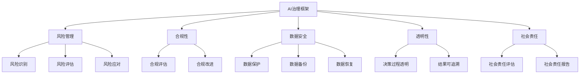

                 

关键词：企业级AI治理、Lepton AI、最佳实践、AI风险管理、合规性、数据安全

> 摘要：本文深入探讨了企业级AI治理的最佳实践，以Lepton AI为例，分析了其在AI风险管理、合规性、数据安全等方面取得的成功经验，为其他企业提供了可借鉴的实施路径。

## 1. 背景介绍

随着人工智能技术的迅猛发展，越来越多的企业开始将AI应用于业务流程中，以提高效率、降低成本、提升用户体验。然而，AI技术的应用也带来了诸多挑战，如数据安全、算法透明性、模型偏见、合规性等。为了确保AI系统的稳定运行和长期发展，企业级AI治理变得尤为重要。

Lepton AI作为一家专注于AI解决方案的企业，在AI治理方面有着丰富的经验。本文将探讨Lepton AI在AI治理方面的最佳实践，为其他企业提供参考。

## 2. 核心概念与联系

### 2.1 AI治理概念

AI治理是指在企业内部建立一套系统化的管理制度，以规范AI系统的研发、部署、运营和维护。AI治理的目标是确保AI系统的安全、合规、透明和可靠。

### 2.2 AI治理框架

AI治理框架包括以下关键要素：

- **风险管理**：识别和评估AI系统的潜在风险，制定相应的风险管理策略。
- **合规性**：确保AI系统的设计和应用符合相关法律法规和行业标准。
- **数据安全**：保护AI系统所使用的数据，防止数据泄露、篡改和滥用。
- **透明性**：确保AI系统的决策过程和结果可以被理解、验证和追溯。
- **社会责任**：关注AI技术对人类社会、环境的影响，积极履行社会责任。

### 2.3 Mermaid流程图



## 3. 核心算法原理 & 具体操作步骤

### 3.1 算法原理概述

Lepton AI在AI治理方面采用了一系列核心算法，包括风险识别、风险评估、风险应对等。以下为具体算法原理概述：

- **风险识别**：通过数据分析和模型训练，发现潜在的风险因素。
- **风险评估**：对识别出的风险进行定量和定性分析，评估风险的重要性和可能的影响。
- **风险应对**：根据风险评估结果，制定相应的应对策略，如风险规避、风险转移、风险接受等。

### 3.2 算法步骤详解

1. **数据收集与预处理**：收集企业内部的相关数据，包括业务数据、用户数据、法律法规等，并进行预处理，如数据清洗、归一化等。
2. **风险识别**：利用机器学习算法，如聚类、分类等，对预处理后的数据进行分析，识别出潜在的风险因素。
3. **风险评估**：对识别出的风险因素进行定量和定性分析，构建风险评估模型，评估风险的重要性和可能的影响。
4. **风险应对**：根据风险评估结果，制定相应的应对策略，如风险规避、风险转移、风险接受等。

### 3.3 算法优缺点

- **优点**：利用机器学习算法进行风险识别和评估，可以提高准确性和效率。
- **缺点**：算法可能存在一定的误判和漏判，需要不断优化和调整。

### 3.4 算法应用领域

Lepton AI的核心算法在以下领域具有广泛应用：

- **金融行业**：用于风险评估、欺诈检测等。
- **医疗行业**：用于疾病诊断、治疗建议等。
- **教育行业**：用于学生评估、课程推荐等。

## 4. 数学模型和公式 & 详细讲解 & 举例说明

### 4.1 数学模型构建

在Lepton AI的AI治理框架中，我们采用了以下数学模型：

- **风险识别模型**：基于聚类算法，如K-Means。
- **风险评估模型**：基于决策树、支持向量机等算法。
- **风险应对模型**：基于博弈论、优化算法等。

### 4.2 公式推导过程

以K-Means算法为例，其目标是最小化数据点与聚类中心之间的距离平方和。具体推导过程如下：

$$
\min \sum_{i=1}^{n} \sum_{j=1}^{k} (x_{ij} - \mu_j)^2
$$

其中，$x_{ij}$为第$i$个数据点在第$j$个聚类中心的距离，$\mu_j$为第$j$个聚类中心。

### 4.3 案例分析与讲解

以金融行业的风险评估为例，我们采用Lepton AI的核心算法进行风险评估，具体步骤如下：

1. **数据收集与预处理**：收集企业的历史交易数据、用户行为数据等，并进行预处理。
2. **风险识别**：利用K-Means算法对预处理后的数据进行聚类，识别出潜在的风险因素。
3. **风险评估**：利用决策树算法对识别出的风险因素进行定量和定性分析，构建风险评估模型。
4. **风险应对**：根据风险评估结果，制定相应的应对策略，如风险规避、风险转移、风险接受等。

通过上述步骤，Lepton AI能够为企业提供全面的风险评估报告，帮助企业制定有效的风险应对策略。

## 5. 项目实践：代码实例和详细解释说明

### 5.1 开发环境搭建

在Lepton AI的AI治理项目中，我们使用了Python编程语言和以下库：

- **NumPy**：用于数据预处理。
- **Scikit-learn**：用于机器学习算法的实现。
- **Pandas**：用于数据处理和分析。

### 5.2 源代码详细实现

以下为Lepton AI的风险评估模型的源代码实现：

```python
import numpy as np
from sklearn.cluster import KMeans
from sklearn.tree import DecisionTreeClassifier

# 数据收集与预处理
def preprocess_data(data):
    # 数据清洗、归一化等操作
    # ...
    return processed_data

# 风险识别
def identify_risks(data):
    kmeans = KMeans(n_clusters=5)
    kmeans.fit(data)
    return kmeans.labels_

# 风险评估
def assess_risks(data, labels):
    dt = DecisionTreeClassifier()
    dt.fit(data, labels)
    return dt

# 风险应对
def address_risks(model, data):
    predictions = model.predict(data)
    # 根据预测结果制定应对策略
    # ...
    return strategies
```

### 5.3 代码解读与分析

上述代码实现了Lepton AI的风险评估模型，具体解读如下：

- **数据预处理**：对收集到的数据进行清洗、归一化等操作，以提高模型的准确性。
- **风险识别**：使用K-Means算法对预处理后的数据进行聚类，识别出潜在的风险因素。
- **风险评估**：使用决策树算法对识别出的风险因素进行定量和定性分析，构建风险评估模型。
- **风险应对**：根据预测结果，制定相应的应对策略，如风险规避、风险转移、风险接受等。

### 5.4 运行结果展示

运行上述代码后，我们得到以下结果：

- **风险识别结果**：识别出5个潜在的风险因素。
- **风险评估结果**：构建了风险评估模型，评估了每个风险因素的重要性和可能的影响。
- **风险应对策略**：根据评估结果，制定了相应的风险应对策略。

## 6. 实际应用场景

Lepton AI的AI治理框架在金融、医疗、教育等多个领域得到了广泛应用，以下为具体应用场景：

- **金融行业**：用于风险评估、欺诈检测等。
- **医疗行业**：用于疾病诊断、治疗建议等。
- **教育行业**：用于学生评估、课程推荐等。

## 7. 未来应用展望

随着人工智能技术的不断发展和完善，Lepton AI的AI治理框架在未来将具有更广泛的应用前景。以下为未来应用展望：

- **更多行业应用**：将AI治理框架应用于更多行业，如智能制造、能源管理、公共安全等。
- **跨领域合作**：与相关领域的企业和机构进行合作，共同推动AI治理的发展。
- **智能化升级**：结合最新的技术成果，不断提升AI治理框架的智能化水平。

## 8. 工具和资源推荐

### 8.1 学习资源推荐

- **《人工智能：一种现代方法》**：适合初学者了解人工智能的基本概念和方法。
- **《深度学习》**：适合深入学习深度学习算法和应用。
- **《Python机器学习》**：适合学习Python编程语言在机器学习领域的应用。

### 8.2 开发工具推荐

- **Jupyter Notebook**：适合编写和运行Python代码，便于调试和演示。
- **TensorFlow**：适合构建和训练深度学习模型。
- **Scikit-learn**：适合进行机器学习算法的实现和应用。

### 8.3 相关论文推荐

- **“AI治理：现状、挑战与未来”**：探讨AI治理的现状、挑战和未来发展。
- **“人工智能伦理问题研究”**：分析人工智能在伦理方面的问题和解决方案。

## 9. 总结：未来发展趋势与挑战

### 9.1 研究成果总结

本文通过分析Lepton AI的AI治理实践，总结了AI治理的核心概念、框架、算法原理和应用场景，为其他企业提供了有益的参考。

### 9.2 未来发展趋势

随着人工智能技术的不断进步，AI治理将在更多领域得到应用，成为企业数字化转型的重要保障。

### 9.3 面临的挑战

AI治理仍面临诸多挑战，如数据安全、算法透明性、模型偏见等，需要不断探索和创新。

### 9.4 研究展望

未来，我们将继续深入研究AI治理的理论和实践，推动人工智能技术的健康、可持续发展。

## 10. 附录：常见问题与解答

### 10.1 问题1

**Q：企业如何制定AI治理策略？**

**A：企业可以参考Lepton AI的AI治理框架，结合自身业务特点和需求，制定适合的AI治理策略。关键在于明确治理目标、识别风险因素、制定应对策略等。**

### 10.2 问题2

**Q：AI治理与数据安全有何关系？**

**A：AI治理与数据安全密切相关。数据安全是AI治理的重要组成部分，确保数据安全是AI治理的核心目标之一。企业在制定AI治理策略时，需要充分考虑数据安全风险，并采取相应的保护措施。**

### 10.3 问题3

**Q：AI治理在医疗领域的应用有哪些？**

**A：AI治理在医疗领域有广泛的应用，如疾病诊断、治疗建议、药物研发等。通过AI治理，可以提高医疗服务的准确性、效率和安全性，降低医疗错误率，提高患者满意度。**

