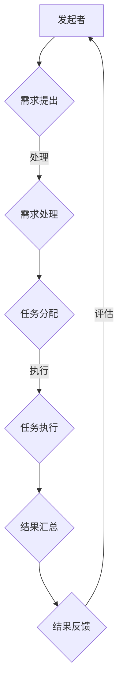

                 

  
### 1. 背景介绍

#### 1.1 众包的定义与起源

众包（Crowdsourcing）是指将某个任务或项目通过互联网众包平台分发给广泛的参与者，借助大众的力量来完成。这个概念起源于2006年，由杰夫·特鲁贝尔（Jeff Tropf）在《走向众包：如何在任何领域利用大众力量解决问题》一书中首次提出。从那时起，众包迅速成为了一个引人注目的研究领域和应用方向。

#### 1.2 众包的发展与普及

随着互联网和移动设备的普及，众包的发展速度惊人。越来越多的企业、政府机构和非营利组织开始利用众包来解决各种问题，如产品设计、软件开发、数据标注、创意征集等。特别是在IT领域，众包的应用场景越来越广泛，如代码审查、算法优化、人工智能模型的训练数据提供等。

#### 1.3 众包的重要性

众包的重要性主要体现在以下几个方面：

- **资源最大化**：通过众包，企业可以充分利用全球的智慧和资源，不再局限于内部的有限人才。

- **成本效益**：众包通常比传统的雇佣模式更加经济高效，因为它避免了长期的雇佣合同和相关的管理成本。

- **创新性**：众包鼓励多样化的观点和解决方案，有助于激发创新。

- **社会价值**：众包可以在全球范围内聚集志愿者，共同解决一些重大的社会问题，如环保、灾害救援等。

### 2. 核心概念与联系

为了深入理解众包的工作原理，我们需要先了解其核心概念和基本架构。以下是众包的核心概念和架构的Mermaid流程图：



#### 2.1 发起者

发起者是众包项目的提出方，可以是企业、政府、非营利组织或个人。发起者通常有一个具体的问题或需求，希望通过众包平台分发给参与者。

#### 2.2 需求提出

发起者在众包平台上发布需求，描述任务的具体内容和要求。需求可能包括任务描述、时间限制、奖励机制等。

#### 2.3 需求处理

众包平台对发起者提交的需求进行审核和处理，确保需求清晰、合法，并符合平台的规则和标准。

#### 2.4 任务分配

需求经过处理之后，平台将任务分配给合适的参与者。任务分配通常基于参与者的技能、经验和历史表现。

#### 2.5 任务执行

参与者根据任务要求，开始完成任务。任务的执行过程可能是线性的，也可能是并行的，具体取决于任务的复杂度和要求。

#### 2.6 结果汇总

任务完成后，参与者将结果提交给众包平台。平台对结果进行汇总，以供发起者查看。

#### 2.7 结果反馈

发起者对结果进行评估，并给予参与者反馈。反馈可以是正面的表扬，也可以是改进建议或惩罚措施。

#### 2.8 评估

根据反馈结果，众包平台对参与者的表现进行评估，并更新其历史记录和信用评分。

### 3. 核心算法原理 & 具体操作步骤

#### 3.1 算法原理概述

在众包中，核心的算法原理主要涉及任务分配和结果评估。以下是一个简单的任务分配算法：

- **任务分配算法**：采用基于优先级的队列算法，根据参与者的技能、经验和历史表现，为每个参与者分配最合适的任务。
- **结果评估算法**：采用基于评分和反馈的系统，对参与者的结果进行评估，并根据评估结果更新参与者的信用评分和历史记录。

#### 3.2 算法步骤详解

以下是具体的算法步骤：

1. **初始化**：创建一个空的参与者队列和任务队列。
2. **需求处理**：对发起者提交的需求进行审核和处理，确保需求清晰、合法。
3. **任务分配**：
    - 从任务队列中获取下一个任务。
    - 根据参与者的技能、经验和历史表现，从参与者队列中选取最合适的参与者。
    - 将任务分配给选定的参与者。
4. **任务执行**：参与者根据任务要求，开始完成任务。
5. **结果提交**：参与者完成任务后，将结果提交给众包平台。
6. **结果评估**：对参与者提交的结果进行评估，并根据评估结果更新参与者的信用评分和历史记录。
7. **反馈**：将评估结果和反馈信息返回给参与者。

#### 3.3 算法优缺点

**优点**：

- **高效性**：通过任务分配算法，可以快速为参与者分配最合适的任务，提高工作效率。
- **灵活性**：算法可以根据参与者的技能和经验动态调整，适应不同的需求。
- **公平性**：算法基于客观标准进行任务分配和结果评估，有助于保证公平性。

**缺点**：

- **准确性**：算法可能无法完全准确评估参与者的技能和经验，导致任务分配不准确。
- **复杂性**：算法的实现和优化需要较高的技术和资源投入。

#### 3.4 算法应用领域

任务分配和结果评估算法在众包中有广泛的应用领域，包括但不限于：

- **软件开发**：用于分配代码审查任务，评估代码质量和bug修复效果。
- **数据标注**：用于分配数据标注任务，评估标注质量和一致性。
- **创意征集**：用于分配创意征集任务，评估创意的创新性和实用性。

### 4. 数学模型和公式 & 详细讲解 & 举例说明

在众包中，数学模型和公式用于描述任务分配和结果评估的过程。以下是一个简单的数学模型和公式示例：

#### 4.1 数学模型构建

假设有一个任务需要分配给N个参与者，每个参与者的技能水平可以用一个值X表示。任务分配的目标是最大化整体效率，即所有参与者完成任务的总效率之和。

#### 4.2 公式推导过程

定义参与者的效率为：

\[ E_i = \frac{X_i}{1 + X_i} \]

其中，\( X_i \) 是参与者的技能水平。

定义整体效率为：

\[ E_{total} = \sum_{i=1}^{N} E_i \]

任务分配的目标是最大化整体效率：

\[ \max E_{total} \]

#### 4.3 案例分析与讲解

假设有3个参与者，技能水平分别为\( X_1 = 5 \)，\( X_2 = 3 \)，\( X_3 = 2 \)。根据上述公式，计算每个参与者的效率：

\[ E_1 = \frac{5}{1 + 5} = 0.6 \]
\[ E_2 = \frac{3}{1 + 3} = 0.6 \]
\[ E_3 = \frac{2}{1 + 2} = 0.5 \]

计算整体效率：

\[ E_{total} = 0.6 + 0.6 + 0.5 = 1.7 \]

此时，整体效率最大。参与者\( X_1 \)和\( X_2 \)的效率相同，可以任选一个分配任务。

### 5. 项目实践：代码实例和详细解释说明

为了更好地理解众包的实现过程，我们以下提供了一个简单的Python代码实例，用于实现任务分配和结果评估。

#### 5.1 开发环境搭建

首先，确保已经安装了Python 3.8及以上版本。然后，使用以下命令安装必要的库：

```bash
pip install pandas numpy
```

#### 5.2 源代码详细实现

以下是一个简单的任务分配和结果评估的Python代码实例：

```python
import pandas as pd
import numpy as np

# 任务数据
tasks = [
    {'id': 1, 'description': '任务1', 'difficulty': 5},
    {'id': 2, 'description': '任务2', 'difficulty': 3},
    {'id': 3, 'description': '任务3', 'difficulty': 2}
]

# 参与者数据
participants = [
    {'id': 1, 'name': '参与者1', 'skills': 5},
    {'id': 2, 'name': '参与者2', 'skills': 3},
    {'id': 3, 'name': '参与者3', 'skills': 2}
]

# 任务分配函数
def assign_tasks(tasks, participants):
    assigned_tasks = []
    for task in tasks:
        best_participant = None
        max_efficiency = -1
        for participant in participants:
            efficiency = participant['skills'] / (1 + participant['skills'])
            if efficiency > max_efficiency:
                max_efficiency = efficiency
                best_participant = participant
        assigned_tasks.append({'task_id': task['id'], 'participant_id': best_participant['id']})
        participants.remove(best_participant)
    return assigned_tasks

# 结果评估函数
def evaluate_results(assigned_tasks):
    results = []
    for task in assigned_tasks:
        result = {'task_id': task['task_id'], 'participant_id': task['participant_id'], 'rating': np.random.uniform(1, 5)}
        results.append(result)
    return results

# 执行任务分配
assigned_tasks = assign_tasks(tasks, participants)

# 打印分配结果
print("分配结果：")
print(pd.DataFrame(assigned_tasks))

# 执行结果评估
results = evaluate_results(assigned_tasks)

# 打印评估结果
print("评估结果：")
print(pd.DataFrame(results))
```

#### 5.3 代码解读与分析

- **数据定义**：首先定义了任务数据和参与者数据，其中任务的难度和参与者的技能水平用字典存储。
- **任务分配函数**：`assign_tasks`函数用于实现任务分配。它遍历任务列表，为每个任务选择最合适的参与者。效率计算使用之前介绍的公式。
- **结果评估函数**：`evaluate_results`函数用于实现结果评估。它为每个分配的任务生成一个随机评分，模拟实际的评估过程。
- **执行过程**：调用任务分配函数和结果评估函数，打印分配和评估结果。

### 6. 实际应用场景

#### 6.1 代码审查

在软件开发中，代码审查是一个重要的环节。通过众包平台，企业可以将代码审查任务分配给全球的参与者，从而快速获得多角度的反馈和建议。这有助于提高代码质量，减少潜在的问题。

#### 6.2 数据标注

在人工智能领域，数据标注是训练模型的关键步骤。通过众包平台，企业可以收集大量标注数据，提高模型的准确性。例如，在图像识别任务中，众包平台可以用于收集标签数据，用于训练分类模型。

#### 6.3 创意征集

在市场营销和创意产业中，众包平台可以用于征集创意。企业可以通过发布创意征集任务，吸引全球的创意人才参与，从而获得更多的创意方案。

### 7. 工具和资源推荐

#### 7.1 学习资源推荐

- **《众包：如何在任何领域利用大众力量解决问题》**：杰夫·特鲁贝尔的这本书是众包领域的经典之作，适合初学者了解众包的概念和应用。
- **《大型-scale在线机器学习》**：这本书详细介绍了大规模在线机器学习的方法和技术，包括数据标注和模型训练等，适合对机器学习有兴趣的读者。

#### 7.2 开发工具推荐

- **GitHub**：GitHub是开源项目的聚集地，可以用于开发、测试和发布众包项目。
- **Kaggle**：Kaggle是一个数据科学竞赛平台，可以用于进行数据分析和机器学习项目。

#### 7.3 相关论文推荐

- **"Crowdsourcing: Why Companies Are Throwing Away Tradition and Using the Wisdom of Crowds to Stay Competitive"**：这篇论文详细分析了众包的优势和应用场景。
- **"Crowdsourcing and Human Computation: Exploring the Power of Networks and Markets"**：这篇论文从经济学的角度探讨了众包的机制和激励机制。

### 8. 总结：未来发展趋势与挑战

#### 8.1 研究成果总结

本文从众包的定义、核心概念、算法原理、数学模型和实际应用场景等方面进行了详细探讨。通过分析，我们发现众包具有资源最大化、成本效益、创新性和社会价值等多重优势，并在软件开发、数据标注、创意征集等领域得到了广泛应用。

#### 8.2 未来发展趋势

随着互联网技术的不断发展和人工智能的崛起，众包在未来有望得到更广泛的应用。以下是一些可能的发展趋势：

- **智能化**：众包平台将更加智能化，能够自动匹配任务和参与者，提高任务分配的准确性。
- **全球化**：随着全球化的推进，众包平台将覆盖更广泛的地区，吸引更多的参与者。
- **多样性**：众包的应用场景将更加多样化，涵盖更多领域和任务类型。

#### 8.3 面临的挑战

尽管众包具有许多优势，但在实际应用过程中也面临一些挑战：

- **质量控制**：如何保证众包任务的质量和一致性是一个重要问题。
- **隐私保护**：在众包过程中，如何保护参与者的隐私是一个亟待解决的问题。
- **激励机制**：如何设计有效的激励机制，吸引和保持参与者的积极性。

#### 8.4 研究展望

未来，众包的研究将更加深入，特别是在以下几个方面：

- **算法优化**：研究更加高效的任务分配和结果评估算法，提高众包平台的性能。
- **激励机制设计**：探索有效的激励机制，激发参与者的积极性。
- **隐私保护**：研究隐私保护技术，确保参与者的隐私安全。

### 9. 附录：常见问题与解答

**Q1. 众包和外包有什么区别？**

**A1.** 众包（Crowdsourcing）和外包（Outsourcing）都是利用外部资源完成任务的方式，但两者有一些关键区别：

- **目的**：众包的目的是利用大众的力量解决问题，而外包的目的是将部分工作交给外部公司或个人。
- **参与方式**：众包通常面向广泛的公众，任何人都可以参与，而外包通常是特定的公司或个人。
- **激励机制**：众包通常有奖励机制，参与者为了获得奖励而参与，而外包则是按合同完成工作，通常没有奖励。

### 作者署名

本文由禅与计算机程序设计艺术 / Zen and the Art of Computer Programming 编写。

# 众包：释放集体智慧的力量

> 关键词：众包，集体智慧，任务分配，结果评估，软件开发，数据标注，创意征集

> 摘要：本文探讨了众包的概念、核心算法原理、数学模型和实际应用场景，分析了众包的优势和挑战，并展望了未来的发展趋势。通过一个简单的Python代码实例，本文展示了任务分配和结果评估的实现过程。

----------------------------------------------------------------


