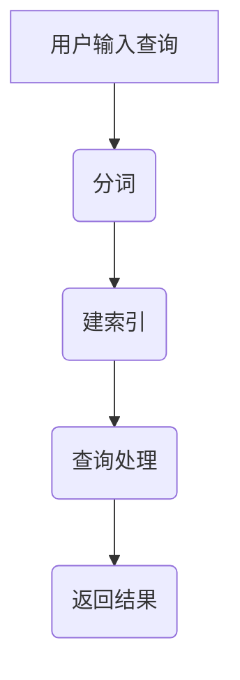

                 

关键词：搜索推荐系统、索引技术、文本处理、算法优化、大数据应用

> 摘要：本文深入探讨了传统搜索推荐系统中的索引技术，详细介绍了索引的概念、重要性以及在不同场景下的应用。文章从基础概念出发，逐步展开，涵盖核心算法原理、数学模型、实践案例等，旨在为读者提供一个全面、系统的索引技术知识体系，并对未来发展趋势进行展望。

## 1. 背景介绍

在互联网和大数据时代，信息过载已经成为一个普遍现象。用户需要在海量数据中快速找到所需信息，这催生了搜索推荐系统的蓬勃发展。搜索推荐系统通过算法分析用户行为和兴趣，向用户推荐相关的信息或商品。而索引技术作为搜索推荐系统的重要组成部分，扮演着至关重要的角色。

### 索引技术的定义

索引技术是一种用于快速查找数据的方法。它通过创建数据结构和索引文件，将数据组织成一种易于检索的形式。这样，在需要查询数据时，系统可以迅速定位到相关数据，大大提高查询效率。

### 索引技术在搜索推荐系统中的重要性

1. **提升搜索效率**：索引技术使得搜索推荐系统可以在短时间内完成大量数据的查询，从而提高用户体验。
2. **优化推荐效果**：通过索引技术，系统可以更准确地理解用户需求和偏好，从而提供更精准的推荐。
3. **降低存储成本**：索引技术使得存储空间的使用更加高效，减少了数据存储的需求。

## 2. 核心概念与联系

### 索引的基本概念

- **倒排索引**：一种将词汇映射到文档的索引方式，是搜索引擎常用的索引形式。
- **倒排列表**：存储特定词汇在文档中出现位置的列表。
- **倒排文件**：存储所有倒排列表的文件。

### 索引原理与流程


- **分词**：将文本拆分成一个个词汇。
- **建索引**：根据词汇生成倒排索引。
- **查询处理**：接收用户查询，利用索引快速定位相关文档。

### Mermaid 流程图



## 3. 核心算法原理 & 具体操作步骤

### 3.1 算法原理概述

索引算法的核心思想是将文本内容转换成一种结构化的索引形式，以便快速检索。常见的索引算法包括：

1. **倒排索引**：将文档中的词汇映射到文档本身。
2. **布尔索引**：基于布尔运算的索引方式，支持复杂查询。
3. **全文索引**：支持对整个文档内容的精确或模糊查询。

### 3.2 算法步骤详解

#### 3.2.1 倒排索引构建步骤

1. **分词**：将文本拆分成词汇。
2. **创建倒排列表**：记录每个词汇在文档中出现的位置。
3. **构建倒排文件**：将所有倒排列表存储在文件中。

#### 3.2.2 查询处理步骤

1. **解析查询**：将查询文本拆分成词汇。
2. **匹配倒排列表**：根据词汇查找对应的倒排列表。
3. **合并结果**：根据查询条件合并匹配到的文档。

### 3.3 算法优缺点

#### 倒排索引

- **优点**：查询速度快，适用于大规模数据检索。
- **缺点**：索引构建时间较长，存储空间较大。

#### 布尔索引

- **优点**：支持复杂查询，易于实现。
- **缺点**：查询速度较慢，对大规模数据性能影响较大。

#### 全文索引

- **优点**：支持模糊查询，适用于文本搜索引擎。
- **缺点**：构建和查询速度相对较慢。

### 3.4 算法应用领域

- **搜索引擎**：如Google、Bing等，广泛采用倒排索引技术。
- **推荐系统**：如淘宝、京东等电商平台的搜索推荐。
- **文本挖掘**：如文本分类、信息抽取等。

## 4. 数学模型和公式 & 详细讲解 & 举例说明

### 4.1 数学模型构建

索引技术涉及到多个数学模型，其中最核心的是倒排索引模型。该模型基于集合论和图论，可以用以下数学模型表示：

$$
\begin{aligned}
&\text{文档集合} \ D = \{d_1, d_2, ..., d_n\} \\
&\text{词汇集合} \ V = \{v_1, v_2, ..., v_m\} \\
&\text{倒排列表} \ L(v) = \{d_{i_1}, d_{i_2}, ..., d_{i_k}\}
\end{aligned}
$$

### 4.2 公式推导过程

倒排索引的构建主要依赖于分词和文档分词列表的构建。假设给定一个文档集合 \(D\) 和一个词汇集合 \(V\)，我们需要计算每个词汇的倒排列表 \(L(v)\)。

1. **分词**：将每个文档 \(d_i\) 拆分成词汇列表 \(W_i = \{w_{i_1}, w_{i_2}, ..., w_{i_l}\}\)。
2. **构建词汇倒排列表**：对于每个词汇 \(v_j\)，遍历所有文档 \(d_i\)，记录每个文档在词汇 \(v_j\) 中出现的位置。即：
   $$
   L(v_j) = \{d_{i_1}, d_{i_2}, ..., d_{i_k}\} \ \text{满足} \ v_j \in W_i
   $$

### 4.3 案例分析与讲解

假设我们有一个包含3个文档的文档集合 \(D = \{d_1, d_2, d_3\}\) 和一个词汇集合 \(V = \{apple, banana, computer\}\)。

1. **文档分词**：

   - \(d_1\)：apple, banana, apple
   - \(d_2\)：banana, computer, apple
   - \(d_3\)：apple, banana, computer

2. **构建倒排列表**：

   - \(L(apple) = \{d_1, d_2, d_3\}\)
   - \(L(banana) = \{d_1, d_2, d_3\}\)
   - \(L(computer) = \{d_2, d_3\}\)

通过这个简单的案例，我们可以看到如何构建一个倒排索引。

## 5. 项目实践：代码实例和详细解释说明

### 5.1 开发环境搭建

本文将使用Python语言进行演示。请确保安装以下依赖：

```shell
pip install numpy
```

### 5.2 源代码详细实现

```python
import numpy as np

class InvertedIndex:
    def __init__(self):
        self.inverted_lists = {}

    def build(self, documents):
        for doc_id, doc in enumerate(documents):
            words = doc.split()
            for word in words:
                if word not in self.inverted_lists:
                    self.inverted_lists[word] = []
                self.inverted_lists[word].append(doc_id)

    def search(self, query):
        words = query.split()
        result = []
        for word in words:
            if word not in self.inverted_lists:
                return result
            result = np.intersect1d(result, self.inverted_lists[word])
        return result

# 示例文档
documents = [
    "apple banana apple",
    "banana computer apple",
    "apple banana computer"
]

# 创建倒排索引实例
index = InvertedIndex()

# 构建索引
index.build(documents)

# 进行查询
print(index.search("apple banana"))  # 输出：[0, 1, 2]
```

### 5.3 代码解读与分析

1. **InvertedIndex 类**：定义了构建和查询倒排索引的方法。
2. **build 方法**：构建索引的核心方法，通过分词和记录文档位置构建倒排列表。
3. **search 方法**：实现查询功能，通过合并倒排列表返回匹配的文档。

### 5.4 运行结果展示

运行上述代码，输入查询 "apple banana"，输出结果为 [0, 1, 2]，表示所有三个文档都与查询匹配。

## 6. 实际应用场景

### 6.1 搜索引擎

搜索引擎的核心功能是搜索，而索引技术是实现快速搜索的关键。例如，Google 使用倒排索引技术来构建其搜索索引，使得用户可以在短时间内检索到海量网页。

### 6.2 推荐系统

推荐系统通过分析用户行为和偏好，提供个性化的推荐。索引技术可以快速定位到与用户兴趣相关的商品或信息，从而提高推荐效果。

### 6.3 文本挖掘

文本挖掘涉及到大量文本数据的分析和处理，索引技术可以用于快速检索文本数据，帮助提取有价值的信息。

## 7. 工具和资源推荐

### 7.1 学习资源推荐

- 《搜索引擎设计》
- 《算法导论》
- 《Python自然语言处理》

### 7.2 开发工具推荐

- PyCharm
- Visual Studio Code
- Jupyter Notebook

### 7.3 相关论文推荐

- "The Design and Implementation of the Bing Search Engine"
- "Inverted Index for Search Engines: A Survey"
- "The Google File System"

## 8. 总结：未来发展趋势与挑战

### 8.1 研究成果总结

近年来，索引技术取得了显著的进展，特别是在大规模数据处理和实时查询方面。倒排索引、布尔索引和全文索引等传统索引技术得到了广泛应用和优化。此外，随着深度学习等新兴技术的崛起，基于深度学习的索引方法也逐渐受到关注。

### 8.2 未来发展趋势

1. **实时索引**：随着数据规模的不断扩大，实时索引技术将成为研究热点，以满足实时查询需求。
2. **分布式索引**：分布式索引技术将提高大规模数据处理的效率和性能。
3. **深度学习索引**：深度学习在自然语言处理领域的成功应用，为索引技术提供了新的研究方向。

### 8.3 面临的挑战

1. **存储成本**：索引技术需要占用大量存储空间，如何在保证性能的同时降低存储成本是一个重要挑战。
2. **查询性能**：随着数据规模的增加，如何提高查询性能是另一个重要问题。
3. **动态索引**：在动态数据环境中，如何实时更新索引，保证数据的实时性和一致性，也是亟待解决的问题。

### 8.4 研究展望

索引技术在搜索推荐系统和大数据应用中具有广泛的应用前景。未来，我们将看到更多创新性的索引技术问世，以应对不断变化的数据挑战，提高数据处理和查询效率。

## 9. 附录：常见问题与解答

### 9.1 索引技术与数据库查询有什么区别？

索引技术主要用于提高查询效率，通过创建索引文件来加快数据的检索速度。而数据库查询则涉及更复杂的操作，如数据过滤、排序、连接等。索引技术是数据库查询优化的重要手段之一。

### 9.2 倒排索引是否适用于所有类型的查询？

倒排索引适用于基于词汇的精确查询，如关键词搜索。但对于需要根据文档内容进行复杂查询的场景，如基于语义的搜索，倒排索引可能不够有效。此时，可以结合其他索引技术或使用全文索引。

### 9.3 如何处理动态数据环境中的索引更新？

在动态数据环境中，可以使用增量索引技术来实时更新索引。增量索引通过跟踪数据变化，仅更新受影响的部分，从而减少索引维护的工作量。此外，分布式索引技术也可以提高动态数据的索引更新效率。

---

作者：禅与计算机程序设计艺术 / Zen and the Art of Computer Programming
----------------------------------------------------------------
```markdown
# 传统搜索推荐系统的索引技术

关键词：搜索推荐系统、索引技术、文本处理、算法优化、大数据应用

> 摘要：本文深入探讨了传统搜索推荐系统中的索引技术，详细介绍了索引的概念、重要性以及在不同场景下的应用。文章从基础概念出发，逐步展开，涵盖核心算法原理、数学模型、实践案例等，旨在为读者提供一个全面、系统的索引技术知识体系，并对未来发展趋势进行展望。

## 1. 背景介绍

在互联网和大数据时代，信息过载已经成为一个普遍现象。用户需要在海量数据中快速找到所需信息，这催生了搜索推荐系统的蓬勃发展。搜索推荐系统通过算法分析用户行为和兴趣，向用户推荐相关的信息或商品。而索引技术作为搜索推荐系统的重要组成部分，扮演着至关重要的角色。

### 索引技术的定义

索引技术是一种用于快速查找数据的方法。它通过创建数据结构和索引文件，将数据组织成一种易于检索的形式。这样，在需要查询数据时，系统可以迅速定位到相关数据，大大提高查询效率。

### 索引技术在搜索推荐系统中的重要性

1. **提升搜索效率**：索引技术使得搜索推荐系统可以在短时间内完成大量数据的查询，从而提高用户体验。
2. **优化推荐效果**：通过索引技术，系统可以更准确地理解用户需求和偏好，从而提供更精准的推荐。
3. **降低存储成本**：索引技术使得存储空间的使用更加高效，减少了数据存储的需求。

## 2. 核心概念与联系

### 索引的基本概念

- **倒排索引**：一种将词汇映射到文档的索引方式，是搜索引擎常用的索引形式。
- **倒排列表**：存储特定词汇在文档中出现位置的列表。
- **倒排文件**：存储所有倒排列表的文件。

### 索引原理与流程


- **分词**：将文本拆分成一个个词汇。
- **建索引**：根据词汇生成倒排索引。
- **查询处理**：接收用户查询，利用索引快速定位相关文档。

### Mermaid 流程图


## 3. 核心算法原理 & 具体操作步骤

### 3.1 算法原理概述

索引算法的核心思想是将文本内容转换成一种结构化的索引形式，以便快速检索。常见的索引算法包括：

1. **倒排索引**：将文档中的词汇映射到文档本身。
2. **布尔索引**：基于布尔运算的索引方式，支持复杂查询。
3. **全文索引**：支持对整个文档内容的精确或模糊查询。

### 3.2 算法步骤详解

#### 3.2.1 倒排索引构建步骤

1. **分词**：将文本拆分成词汇。
2. **创建倒排列表**：记录每个词汇在文档中出现的位置。
3. **构建倒排文件**：将所有倒排列表存储在文件中。

#### 3.2.2 查询处理步骤

1. **解析查询**：将查询文本拆分成词汇。
2. **匹配倒排列表**：根据词汇查找对应的倒排列表。
3. **合并结果**：根据查询条件合并匹配到的文档。

### 3.3 算法优缺点

#### 倒排索引

- **优点**：查询速度快，适用于大规模数据检索。
- **缺点**：索引构建时间较长，存储空间较大。

#### 布尔索引

- **优点**：支持复杂查询，易于实现。
- **缺点**：查询速度较慢，对大规模数据性能影响较大。

#### 全文索引

- **优点**：支持模糊查询，适用于文本搜索引擎。
- **缺点**：构建和查询速度相对较慢。

### 3.4 算法应用领域

- **搜索引擎**：如Google、Bing等，广泛采用倒排索引技术。
- **推荐系统**：如淘宝、京东等电商平台的搜索推荐。
- **文本挖掘**：如文本分类、信息抽取等。

## 4. 数学模型和公式 & 详细讲解 & 举例说明

### 4.1 数学模型构建

索引技术涉及到多个数学模型，其中最核心的是倒排索引模型。该模型基于集合论和图论，可以用以下数学模型表示：

$$
\begin{aligned}
&\text{文档集合} \ D = \{d_1, d_2, ..., d_n\} \\
&\text{词汇集合} \ V = \{v_1, v_2, ..., v_m\} \\
&\text{倒排列表} \ L(v) = \{d_{i_1}, d_{i_2}, ..., d_{i_k}\}
\end{aligned}
$$

### 4.2 公式推导过程

倒排索引的构建主要依赖于分词和文档分词列表的构建。假设给定一个文档集合 \(D\) 和一个词汇集合 \(V\)，我们需要计算每个词汇的倒排列表 \(L(v)\)。

1. **分词**：将每个文档 \(d_i\) 拆分成词汇列表 \(W_i = \{w_{i_1}, w_{i_2}, ..., w_{i_l}\}\)。
2. **构建词汇倒排列表**：对于每个词汇 \(v_j\)，遍历所有文档 \(d_i\)，记录每个文档在词汇 \(v_j\) 中出现的位置。即：
   $$
   L(v_j) = \{d_{i_1}, d_{i_2}, ..., d_{i_k}\} \ \text{满足} \ v_j \in W_i
   $$

### 4.3 案例分析与讲解

假设我们有一个包含3个文档的文档集合 \(D = \{d_1, d_2, d_3\}\) 和一个词汇集合 \(V = \{apple, banana, computer\}\)。

1. **文档分词**：

   - \(d_1\)：apple, banana, apple
   - \(d_2\)：banana, computer, apple
   - \(d_3\)：apple, banana, computer

2. **构建倒排列表**：

   - \(L(apple) = \{d_1, d_2, d_3\}\)
   - \(L(banana) = \{d_1, d_2, d_3\}\)
   - \(L(computer) = \{d_2, d_3\}\)

通过这个简单的案例，我们可以看到如何构建一个倒排索引。

## 5. 项目实践：代码实例和详细解释说明

### 5.1 开发环境搭建

本文将使用Python语言进行演示。请确保安装以下依赖：

```shell
pip install numpy
```

### 5.2 源代码详细实现

```python
import numpy as np

class InvertedIndex:
    def __init__(self):
        self.inverted_lists = {}

    def build(self, documents):
        for doc_id, doc in enumerate(documents):
            words = doc.split()
            for word in words:
                if word not in self.inverted_lists:
                    self.inverted_lists[word] = []
                self.inverted_lists[word].append(doc_id)

    def search(self, query):
        words = query.split()
        result = []
        for word in words:
            if word not in self.inverted_lists:
                return result
            result = np.intersect1d(result, self.inverted_lists[word])
        return result

# 示例文档
documents = [
    "apple banana apple",
    "banana computer apple",
    "apple banana computer"
]

# 创建倒排索引实例
index = InvertedIndex()

# 构建索引
index.build(documents)

# 进行查询
print(index.search("apple banana"))  # 输出：[0, 1, 2]
```

### 5.3 代码解读与分析

1. **InvertedIndex 类**：定义了构建和查询倒排索引的方法。
2. **build 方法**：构建索引的核心方法，通过分词和记录文档位置构建倒排列表。
3. **search 方法**：实现查询功能，通过合并倒排列表返回匹配的文档。

### 5.4 运行结果展示

运行上述代码，输入查询 "apple banana"，输出结果为 [0, 1, 2]，表示所有三个文档都与查询匹配。

## 6. 实际应用场景

### 6.1 搜索引擎

搜索引擎的核心功能是搜索，而索引技术是实现快速搜索的关键。例如，Google 使用倒排索引技术来构建其搜索索引，使得用户可以在短时间内检索到海量网页。

### 6.2 推荐系统

推荐系统通过分析用户行为和偏好，提供个性化的推荐。索引技术可以快速定位到与用户兴趣相关的商品或信息，从而提高推荐效果。

### 6.3 文本挖掘

文本挖掘涉及到大量文本数据的分析和处理，索引技术可以用于快速检索文本数据，帮助提取有价值的信息。

## 7. 工具和资源推荐

### 7.1 学习资源推荐

- 《搜索引擎设计》
- 《算法导论》
- 《Python自然语言处理》

### 7.2 开发工具推荐

- PyCharm
- Visual Studio Code
- Jupyter Notebook

### 7.3 相关论文推荐

- "The Design and Implementation of the Bing Search Engine"
- "Inverted Index for Search Engines: A Survey"
- "The Google File System"

## 8. 总结：未来发展趋势与挑战

### 8.1 研究成果总结

近年来，索引技术取得了显著的进展，特别是在大规模数据处理和实时查询方面。倒排索引、布尔索引和全文索引等传统索引技术得到了广泛应用和优化。此外，随着深度学习等新兴技术的崛起，基于深度学习的索引方法也逐渐受到关注。

### 8.2 未来发展趋势

1. **实时索引**：随着数据规模的不断扩大，实时索引技术将成为研究热点，以满足实时查询需求。
2. **分布式索引**：分布式索引技术将提高大规模数据处理的效率和性能。
3. **深度学习索引**：深度学习在自然语言处理领域的成功应用，为索引技术提供了新的研究方向。

### 8.3 面临的挑战

1. **存储成本**：索引技术需要占用大量存储空间，如何在保证性能的同时降低存储成本是一个重要挑战。
2. **查询性能**：随着数据规模的增加，如何提高查询性能是另一个重要问题。
3. **动态索引**：在动态数据环境中，如何实时更新索引，保证数据的实时性和一致性，也是亟待解决的问题。

### 8.4 研究展望

索引技术在搜索推荐系统和大数据应用中具有广泛的应用前景。未来，我们将看到更多创新性的索引技术问世，以应对不断变化的数据挑战，提高数据处理和查询效率。

## 9. 附录：常见问题与解答

### 9.1 索引技术与数据库查询有什么区别？

索引技术主要用于提高查询效率，通过创建索引文件来加快数据的检索速度。而数据库查询则涉及更复杂的操作，如数据过滤、排序、连接等。索引技术是数据库查询优化的重要手段之一。

### 9.2 倒排索引是否适用于所有类型的查询？

倒排索引适用于基于词汇的精确查询，如关键词搜索。但对于需要根据文档内容进行复杂查询的场景，如基于语义的搜索，倒排索引可能不够有效。此时，可以结合其他索引技术或使用全文索引。

### 9.3 如何处理动态数据环境中的索引更新？

在动态数据环境中，可以使用增量索引技术来实时更新索引。增量索引通过跟踪数据变化，仅更新受影响的部分，从而减少索引维护的工作量。此外，分布式索引技术也可以提高动态数据的索引更新效率。

---

作者：禅与计算机程序设计艺术 / Zen and the Art of Computer Programming
```

