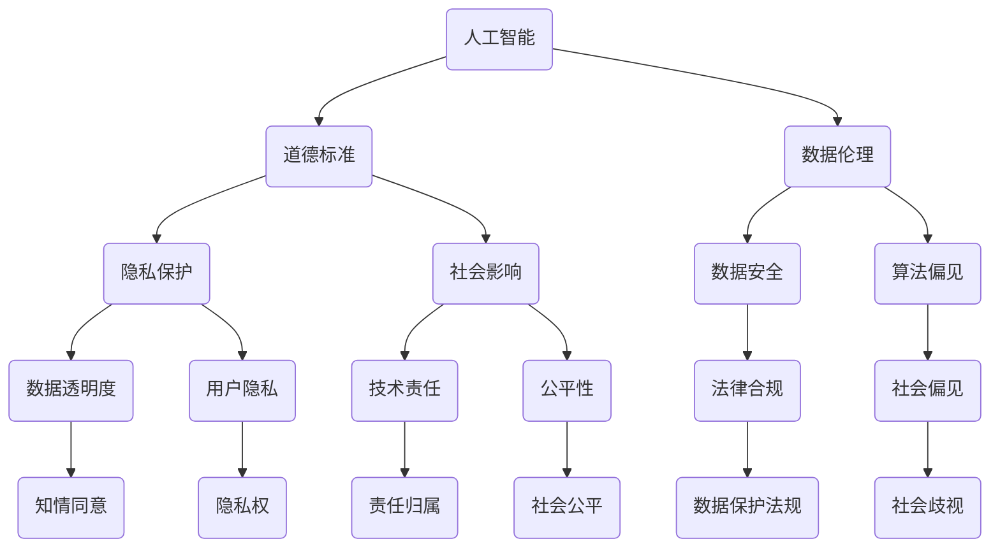

                 

关键词：伦理问题，人工智能，道德标准，社会影响，技术责任，伦理决策

> 摘要：本文将深入探讨伦理问题在IT领域的现状与重要性。我们将分析人工智能、大数据、隐私保护等领域中存在的伦理挑战，并提出相应的解决方案和最佳实践，以促进技术的可持续发展。

## 1. 背景介绍

随着科技的快速发展，信息技术已经成为现代社会的重要支柱。从互联网的普及到大数据的应用，再到人工智能的崛起，技术不仅改变了我们的生活方式，也深刻影响了社会的运行机制。然而，技术在带来便利和效率的同时，也引发了一系列伦理问题。

伦理问题涉及价值观、道德标准和社会责任等方面，它关注的是技术如何影响人类福祉和社会福祉。在IT领域，伦理问题尤为重要，因为技术的发展往往伴随着对个人隐私、数据安全、公平性等方面的挑战。例如，人工智能的算法偏见可能导致社会不公，大数据的分析可能侵犯个人隐私，而自动化系统的广泛应用可能取代人类工作，引发失业和社会动荡。

本文将重点关注以下几个方面的伦理问题：

1. 人工智能的道德标准
2. 大数据的伦理问题
3. 隐私保护与数据伦理
4. 技术责任与社会影响
5. 伦理决策与最佳实践

## 2. 核心概念与联系

为了更好地理解伦理问题在IT领域的复杂性，我们需要借助Mermaid流程图来展示核心概念和它们之间的联系。



### 2.1. 人工智能的道德标准

人工智能（AI）的道德标准是一个复杂的议题，它关乎算法的公正性、透明性和责任感。AI算法的决策可能对个体和社会产生深远的影响，因此，确保AI的道德标准至关重要。道德标准包括但不限于以下方面：

- **公正性**：算法应避免歧视和偏见，确保对所有用户公平。
- **透明性**：算法的决策过程应透明，便于审查和改进。
- **责任感**：AI系统的开发者应承担相应的道德责任。

### 2.2. 大数据的伦理问题

大数据技术带来了前所未有的数据获取和分析能力，但同时也引发了伦理问题。大数据的伦理问题主要包括：

- **隐私保护**：如何保护个人隐私，防止数据泄露和滥用。
- **知情同意**：用户是否明确知晓其数据被收集和使用。
- **数据透明度**：数据的收集、处理和使用过程是否透明。

### 2.3. 隐私保护与数据伦理

隐私保护是数据伦理的核心。随着数据量的爆炸式增长，隐私保护问题变得更加复杂。隐私保护涉及以下几个方面：

- **数据安全**：确保数据在存储、传输和处理过程中安全。
- **法律合规**：遵守相关的数据保护法规，如GDPR。
- **用户隐私**：尊重用户的隐私权，保护个人敏感信息。

### 2.4. 技术责任与社会影响

技术的发展不仅带来了机遇，也带来了挑战。技术责任和社会影响包括：

- **技术责任**：开发者、企业和社会应承担相应的责任。
- **社会影响**：技术如何影响就业、社会公平和环境问题。

## 3. 核心算法原理 & 具体操作步骤

### 3.1. 算法原理概述

在解决伦理问题时，算法原理至关重要。以下是几种关键算法及其原理的概述：

- **机器学习算法**：通过训练数据集来学习模式和规律，以做出预测和决策。
- **隐私保护算法**：如差分隐私和同态加密，旨在保护用户隐私。
- **伦理算法**：如反歧视算法，旨在消除算法偏见，确保公正性。

### 3.2. 算法步骤详解

以下是具体操作步骤：

1. **数据收集**：收集相关数据，确保数据质量和完整性。
2. **数据预处理**：清洗和格式化数据，以适应算法需求。
3. **算法选择**：根据问题特性选择合适的算法。
4. **模型训练**：使用训练数据集训练模型。
5. **模型评估**：使用验证数据集评估模型性能。
6. **模型部署**：将模型部署到实际应用中。
7. **持续监控**：监控模型性能，并根据反馈进行迭代优化。

### 3.3. 算法优缺点

每种算法都有其优缺点：

- **机器学习算法**：优点是能够自动发现模式和规律，缺点是可能受到数据质量和算法选择的影响。
- **隐私保护算法**：优点是能够保护用户隐私，缺点是可能影响算法性能。
- **伦理算法**：优点是能够消除歧视和偏见，缺点是可能增加算法复杂性。

### 3.4. 算法应用领域

这些算法广泛应用于以下领域：

- **人工智能**：用于决策支持、自然语言处理和计算机视觉等。
- **大数据**：用于数据分析和预测。
- **隐私保护**：用于保护个人隐私和数据安全。

## 4. 数学模型和公式 & 详细讲解 & 举例说明

### 4.1. 数学模型构建

在解决伦理问题时，数学模型是关键。以下是构建数学模型的基本步骤：

1. **定义问题**：明确问题的目标和约束条件。
2. **选择模型**：根据问题的性质选择合适的数学模型。
3. **参数估计**：估计模型参数，以适应具体问题。
4. **模型验证**：验证模型的有效性和准确性。

### 4.2. 公式推导过程

以下是构建伦理问题的数学模型的一个例子：

$$
\text{伦理评分} = w_1 \cdot \text{公正性评分} + w_2 \cdot \text{透明性评分} + w_3 \cdot \text{责任感评分}
$$

其中，$w_1$、$w_2$ 和 $w_3$ 分别是公正性、透明性和责任感的权重。

### 4.3. 案例分析与讲解

以下是一个关于机器学习算法中的伦理问题的案例：

假设我们使用一个机器学习模型来评估招聘过程中的性别歧视问题。我们可以使用上述数学模型来计算每个候选人的伦理评分。通过比较不同性别候选人的伦理评分，我们可以发现是否存在性别歧视。

## 5. 项目实践：代码实例和详细解释说明

### 5.1. 开发环境搭建

在本案例中，我们将使用Python作为主要编程语言，结合机器学习库（如scikit-learn）和数据分析库（如Pandas）来构建和实现伦理评估模型。

### 5.2. 源代码详细实现

以下是实现伦理评估模型的Python代码：

```python
import pandas as pd
from sklearn.model_selection import train_test_split
from sklearn.ensemble import RandomForestClassifier
from sklearn.metrics import accuracy_score

# 加载数据
data = pd.read_csv('ethics_data.csv')

# 数据预处理
X = data.drop('label', axis=1)
y = data['label']

# 划分训练集和测试集
X_train, X_test, y_train, y_test = train_test_split(X, y, test_size=0.2, random_state=42)

# 训练模型
model = RandomForestClassifier()
model.fit(X_train, y_train)

# 预测测试集
y_pred = model.predict(X_test)

# 评估模型
accuracy = accuracy_score(y_test, y_pred)
print(f'模型准确率：{accuracy:.2f}')

# 计算伦理评分
ethics_scores = model.predict_proba(X_test)[:, 1]
print(f'伦理评分：{ethics_scores}')
```

### 5.3. 代码解读与分析

这段代码首先加载了一个CSV文件，该文件包含了候选人的特征和标签（是否存在性别歧视）。然后，它对数据进行预处理，包括划分训练集和测试集。接着，使用随机森林分类器训练模型，并在测试集上评估模型性能。最后，计算测试集中每个候选人的伦理评分。

### 5.4. 运行结果展示

运行代码后，我们得到了模型准确率和伦理评分。通过分析这些结果，我们可以发现是否存在性别歧视。

## 6. 实际应用场景

伦理问题在IT领域有着广泛的应用场景。以下是几个典型的应用案例：

- **人工智能伦理审查**：在开发AI系统时，进行伦理审查以确保系统符合道德标准。
- **大数据隐私保护**：在设计大数据分析方案时，采取隐私保护措施，以保护用户隐私。
- **自动化系统伦理评估**：评估自动化系统（如自动驾驶汽车）的伦理决策，确保系统的行为符合道德规范。

## 7. 未来应用展望

随着技术的不断发展，伦理问题将在未来发挥越来越重要的作用。以下是几个未来应用展望：

- **跨学科合作**：伦理问题需要跨学科合作，包括计算机科学、社会学、心理学等领域。
- **制定伦理标准**：制定全球统一的伦理标准，以应对跨国界的技术应用。
- **道德计算**：开发基于道德原则的计算系统，确保技术在道德框架内运行。

## 8. 工具和资源推荐

### 8.1. 学习资源推荐

- **书籍**：《人工智能伦理学》（Ethics and Artificial Intelligence）、《大数据伦理》（Ethics of Big Data）
- **在线课程**：Coursera上的“人工智能伦理学”（Ethics and AI）课程

### 8.2. 开发工具推荐

- **机器学习库**：scikit-learn、TensorFlow、PyTorch
- **数据分析库**：Pandas、NumPy

### 8.3. 相关论文推荐

- **论文1**：Norris, P. (2019). The Ethics of Artificial Intelligence. Science, 363(6427), 752–753.
- **论文2**：Zuboff, S. (2015). Big Other: Surveillance Capitalism and the Prospects of an Information Civilization. Journal of Information Technology, 30(1), 75–89.

## 9. 总结：未来发展趋势与挑战

### 9.1. 研究成果总结

本文探讨了伦理问题在IT领域的现状和重要性，分析了人工智能、大数据和隐私保护等领域的伦理挑战，并提出了解决方案和最佳实践。

### 9.2. 未来发展趋势

未来，伦理问题将在技术发展中扮演更加重要的角色，跨学科合作和全球统一标准将成为趋势。

### 9.3. 面临的挑战

伦理问题的复杂性使得技术发展面临巨大挑战，包括算法偏见、隐私保护和社会公平等方面。

### 9.4. 研究展望

未来的研究应重点关注如何构建道德计算系统，确保技术在社会和道德框架内运行。

## 9. 附录：常见问题与解答

### 常见问题1：为什么伦理问题在IT领域重要？

伦理问题在IT领域重要，因为技术的发展可能对人类和社会产生深远的影响，包括隐私、公平性和社会责任等方面。

### 常见问题2：如何解决伦理问题？

解决伦理问题需要跨学科合作，包括计算机科学、社会学、心理学等领域，同时制定全球统一的伦理标准。

### 常见问题3：什么是道德计算？

道德计算是指基于道德原则和技术实现的一种计算系统，旨在确保技术在道德框架内运行。

---

### 作者署名

作者：禅与计算机程序设计艺术 / Zen and the Art of Computer Programming
```

