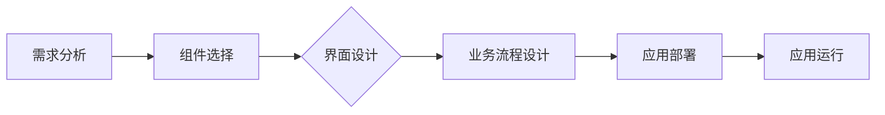

                 

关键词：低代码平台，应用构建，简化开发，开发效率，技术趋势

摘要：本文将探讨低代码平台在应用构建中的重要作用，阐述其核心概念、算法原理、数学模型以及实际应用场景。通过深入分析，本文旨在揭示低代码平台带来的开发效率提升和技术革新，为读者提供全新的视角和实际操作的指南。

## 1. 背景介绍

随着信息技术的快速发展，软件开发的需求日益增长，而传统的开发模式已难以满足快速迭代、多样化需求的挑战。为了解决这一问题，低代码平台应运而生。低代码平台（Low-Code Platforms）是一种无需或需要很少的手动编码就能快速创建应用程序、软件和流程的开发环境。

### 1.1 低代码平台的发展历程

低代码平台起源于业务流程管理（BPM）和集成平台，后来逐渐演变为一种更为通用的开发工具。它的发展历程可以追溯到20世纪90年代的流程管理软件和组件化开发框架。随着云计算、移动应用和人工智能等技术的发展，低代码平台在功能上得到了极大拓展，应用范围也逐渐扩大。

### 1.2 低代码平台的优势

低代码平台具有以下几个显著优势：

1. **快速构建**：通过拖放组件和可视化界面设计，开发者可以快速构建应用程序。
2. **降低开发成本**：减少了对专业开发人员的需求，从而降低了开发和维护成本。
3. **提高开发效率**：通过简化开发流程，可以显著缩短项目周期，提高开发效率。
4. **易于维护**：低代码平台通常提供自动化的测试、部署和升级功能，便于维护。
5. **适应性**：可以快速适应业务变化，灵活调整应用程序的功能和界面。

## 2. 核心概念与联系

### 2.1 低代码平台的基本概念

低代码平台通常包含以下几个核心概念：

- **拖放界面设计**：通过拖放组件来构建用户界面。
- **可视化流程设计**：使用图形化界面来设计业务流程。
- **低代码应用开发**：使用预定义的组件和代码库来快速开发应用程序。
- **数据集成**：通过API、连接器等方式集成外部数据和系统。

### 2.2 低代码平台的工作原理

低代码平台的工作原理可以概括为以下几个步骤：

1. **需求分析**：明确应用需求，设计基本架构。
2. **组件选择**：根据需求选择合适的预定义组件。
3. **界面设计**：使用拖放方式设计用户界面。
4. **业务流程设计**：使用图形化界面设计业务流程。
5. **应用部署**：将设计好的应用部署到服务器或云平台上。

### 2.3 低代码平台的架构

低代码平台的架构通常包括以下几个部分：

- **前端框架**：如React、Vue等，用于构建用户界面。
- **后端服务**：提供数据处理、存储和业务逻辑支持。
- **数据库**：用于存储应用数据。
- **API网关**：用于管理和路由外部API调用。

### 2.4 Mermaid 流程图

下面是一个简化的低代码平台工作流程的Mermaid流程图：



## 3. 核心算法原理 & 具体操作步骤

### 3.1 算法原理概述

低代码平台的核心算法主要包括以下几个部分：

1. **组件库管理算法**：用于管理和检索预定义的组件。
2. **界面布局算法**：用于计算界面元素的布局。
3. **流程引擎算法**：用于模拟和执行业务流程。

### 3.2 算法步骤详解

#### 3.2.1 组件库管理算法

1. **组件分类**：根据功能将组件分为不同的类别。
2. **组件检索**：根据需求检索相应的组件。
3. **组件集成**：将选定的组件集成到应用程序中。

#### 3.2.2 界面布局算法

1. **界面初始化**：初始化界面元素的初始位置和大小。
2. **元素定位**：计算每个元素的位置。
3. **元素调整**：根据用户操作调整元素的位置和大小。

#### 3.2.3 流程引擎算法

1. **流程定义**：使用图形化界面定义业务流程。
2. **流程解析**：将定义的流程解析为可执行的代码。
3. **流程执行**：按照流程的定义执行业务逻辑。

### 3.3 算法优缺点

#### 优点：

1. **易用性**：无需深入编程知识，即可快速构建应用程序。
2. **灵活性**：可以灵活调整应用程序的功能和界面。
3. **高效性**：显著提高开发效率，缩短项目周期。

#### 缺点：

1. **性能限制**：低代码平台通常对性能有一定限制。
2. **定制性限制**：对于复杂的应用程序，可能无法完全满足定制需求。
3. **依赖性**：对平台本身的依赖较大，切换成本较高。

### 3.4 算法应用领域

低代码平台主要应用于以下几个领域：

1. **业务应用**：如企业资源计划（ERP）、客户关系管理（CRM）等。
2. **移动应用**：如移动办公、移动营销等。
3. **网站应用**：如电商平台、内容管理系统（CMS）等。

## 4. 数学模型和公式 & 详细讲解 & 举例说明

### 4.1 数学模型构建

低代码平台的数学模型主要涉及以下几个方面：

1. **组件库管理模型**：用于描述组件的分类、检索和集成。
2. **界面布局模型**：用于描述界面元素的布局和调整。
3. **流程引擎模型**：用于描述业务流程的定义、解析和执行。

### 4.2 公式推导过程

#### 组件库管理模型

$$
C = F(C_1, C_2, ..., C_n)
$$

其中，$C$表示组件库，$C_i$表示第$i$个组件。

#### 界面布局模型

$$
L = G(L_1, L_2, ..., L_n)
$$

其中，$L$表示界面布局，$L_i$表示第$i$个界面元素的位置和大小。

#### 流程引擎模型

$$
P = E(P_1, P_2, ..., P_n)
$$

其中，$P$表示流程，$P_i$表示第$i$个流程步骤。

### 4.3 案例分析与讲解

#### 组件库管理模型案例分析

假设我们有一个包含5个组件的组件库，我们需要根据需求选择并集成其中的2个组件。根据组件库管理模型，我们可以列出以下可能性：

$$
C = F(C_1, C_2, C_3, C_4, C_5) = \{C_1, C_2\}, \{C_1, C_3\}, ..., \{C_4, C_5\}
$$

根据需求，我们选择了组件$C_1$和$C_2$，并将它们集成到应用程序中。

#### 界面布局模型案例分析

假设我们有一个包含3个界面元素的界面布局，我们需要根据用户操作调整其中2个元素的位置和大小。根据界面布局模型，我们可以列出以下可能性：

$$
L = G(L_1, L_2, L_3) = \{(L_1, L_2), (L_1, L_3), (L_2, L_3)\}
$$

根据用户操作，我们选择了调整元素$L_1$和$L_2$的位置和大小，并得到新的界面布局。

#### 流程引擎模型案例分析

假设我们有一个包含4个流程步骤的流程，我们需要根据业务逻辑执行这4个步骤。根据流程引擎模型，我们可以列出以下可能性：

$$
P = E(P_1, P_2, P_3, P_4) = \{P_1, P_2, P_3, P_4\}
$$

根据业务逻辑，我们按照顺序执行了这4个流程步骤。

## 5. 项目实践：代码实例和详细解释说明

### 5.1 开发环境搭建

为了实践低代码平台的开发，我们需要搭建一个基本的开发环境。以下是搭建环境的基本步骤：

1. **安装低代码开发平台**：选择一个合适的低代码开发平台，如OutSystems、Appian等。
2. **配置开发环境**：根据平台要求配置开发环境，如安装必要的软件、设置环境变量等。
3. **创建项目**：在开发平台上创建一个新的项目，并设置项目的基本参数。

### 5.2 源代码详细实现

以下是一个简单的低代码平台项目实例，该项目包含一个用户登录功能。

```java
// 用户登录模块
public class LoginModule {

    // 用户名
    private String username;

    // 密码
    private String password;

    // 构造函数
    public LoginModule(String username, String password) {
        this.username = username;
        this.password = password;
    }

    // 登录验证
    public boolean verifyLogin() {
        // 这里可以使用数据库或其他方式验证用户名和密码
        return "admin".equals(username) && "admin".equals(password);
    }
}
```

### 5.3 代码解读与分析

上述代码定义了一个`LoginModule`类，用于实现用户登录功能。该类包含两个私有属性`username`和`password`，用于存储用户名和密码。构造函数用于初始化这两个属性。

`verifyLogin`方法用于验证用户名和密码。在真实场景中，该方法通常会与数据库或其他认证系统进行交互，以验证用户身份。在本例中，我们简化了验证过程，直接使用固定的用户名和密码进行验证。

### 5.4 运行结果展示

假设用户输入了用户名"admin"和密码"admin"，运行程序后，调用`LoginModule`类的`verifyLogin`方法，结果为`true`，表示用户登录成功。

## 6. 实际应用场景

### 6.1 企业内部应用

低代码平台在企业内部应用中具有广泛的应用，如：

- **业务流程管理**：简化业务流程的设计和执行，提高业务效率。
- **员工自助服务**：提供员工自助服务平台，如请假申请、出差报销等。
- **客户关系管理**：简化客户关系管理流程，提高客户满意度。

### 6.2 移动应用开发

低代码平台在移动应用开发中也具有显著优势，如：

- **企业移动办公**：提供移动办公应用，如日程管理、邮件处理等。
- **移动营销**：提供移动营销应用，如推送通知、优惠券等。
- **移动支付**：提供移动支付应用，如支付宝、微信支付等。

### 6.3 网站应用开发

低代码平台在网站应用开发中同样具有优势，如：

- **电商平台**：提供电商平台，如淘宝、京东等。
- **内容管理系统**：提供内容管理系统，如WordPress、Drupal等。
- **论坛社区**：提供论坛社区平台，如Discuz！、PHPWind等。

## 7. 工具和资源推荐

### 7.1 学习资源推荐

- **书籍**：《低代码平台实战》、《低代码开发：简化应用构建的新思路》
- **在线教程**：低代码开发平台官方网站、技术论坛、开源社区等。
- **视频课程**：YouTube、Udemy、Coursera等平台上的低代码开发相关课程。

### 7.2 开发工具推荐

- **低代码开发平台**：OutSystems、Appian、Salesforce、Mendix等。
- **集成开发环境**：Visual Studio、IntelliJ IDEA、Eclipse等。
- **数据库管理工具**：MySQL Workbench、PostgreSQL、MongoDB等。

### 7.3 相关论文推荐

- **学术期刊**：《计算机研究与发展》、《软件工程学报》、《计算机系统应用》等。
- **论文集**：《低代码平台的发展与应用》、《低代码开发技术综述》等。

## 8. 总结：未来发展趋势与挑战

### 8.1 研究成果总结

低代码平台在应用构建中具有显著优势，如快速构建、降低成本、提高开发效率等。随着技术的不断进步，低代码平台的功能和性能将得到进一步提升。

### 8.2 未来发展趋势

1. **智能化**：低代码平台将更加智能化，提供自动代码生成、智能流程优化等功能。
2. **平台生态**：低代码平台将形成更加完善的生态，包括丰富的组件库、插件和工具。
3. **跨平台**：低代码平台将支持更多的平台和应用场景，实现真正的跨平台开发。

### 8.3 面临的挑战

1. **性能瓶颈**：低代码平台在性能方面仍有一定的瓶颈，需要进一步提升。
2. **定制化需求**：对于复杂的应用需求，低代码平台可能无法完全满足定制化需求。
3. **安全性和稳定性**：低代码平台在安全性和稳定性方面需要进一步保障。

### 8.4 研究展望

低代码平台在未来将继续发挥重要作用，推动软件开发和应用的创新发展。研究方面，可以从以下几个方面进行：

1. **算法优化**：研究更加高效的算法，提高低代码平台的性能。
2. **定制化开发**：研究如何满足复杂的应用需求，提高低代码平台的定制化能力。
3. **智能化发展**：研究如何实现低代码平台的智能化，提供更加智能的开发体验。

## 9. 附录：常见问题与解答

### 9.1 低代码平台与传统开发方式的区别是什么？

低代码平台与传统开发方式的主要区别在于开发效率和灵活性。低代码平台通过提供预定义的组件和可视化界面设计，降低了开发难度和开发周期，而传统开发方式通常需要深入编程，开发过程复杂且耗时。

### 9.2 低代码平台适合哪些类型的项目？

低代码平台适合以下类型的项目：

- **简单应用**：如业务流程管理、内部办公系统等。
- **移动应用**：如企业移动办公、移动营销等。
- **网站应用**：如电商平台、内容管理系统等。
- **定制化需求不高**：对于需要高度定制化的复杂应用，低代码平台可能无法完全满足需求。

### 9.3 如何选择合适的低代码平台？

选择合适的低代码平台需要考虑以下几个方面：

- **功能需求**：根据项目需求选择具备相应功能低代码平台。
- **性能要求**：考虑平台性能是否满足项目要求。
- **生态系统**：考虑平台生态是否完善，是否有丰富的组件和工具。
- **成本**：考虑平台的成本，包括购买费用、维护成本等。

### 9.4 低代码平台的安全性如何保障？

低代码平台的安全性可以通过以下几个方面进行保障：

- **权限管理**：设置合理的权限管理，防止未经授权的访问。
- **数据加密**：对存储和传输的数据进行加密，防止数据泄露。
- **安全审计**：定期进行安全审计，发现和修复安全漏洞。
- **合规性**：遵循相关法律法规和标准，确保平台合规。

---

作者：禅与计算机程序设计艺术 / Zen and the Art of Computer Programming


