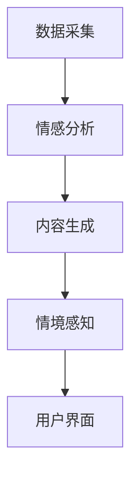

                 

关键词：AI，叙事引擎，个人化，故事生成，技术博客，深度学习，自然语言处理，计算机程序设计。

> 摘要：本文旨在探讨如何利用人工智能技术，特别是深度学习与自然语言处理技术，构建一个个人化的叙事引擎，用于自动生成与用户生活相关的个性化故事。文章将介绍叙事引擎的核心概念、架构、算法原理、数学模型、代码实例，以及其在实际应用中的潜力与挑战。

## 1. 背景介绍

在信息技术高速发展的今天，人工智能（AI）已经成为改变我们生活方式的重要力量。其中，自然语言处理（NLP）作为AI的重要分支，正逐步突破传统语言理解与生成的局限，向着更复杂、更个性化的方向发展。近年来，基于深度学习的NLP技术取得了显著进展，为构建高效的叙事引擎提供了坚实的理论基础。

叙事引擎是一种能够自动生成故事、文章或其他文本内容的智能系统。通过整合用户数据、情感分析、情境感知等技术，叙事引擎能够根据用户的需求和偏好，生成具有个性化和情感共鸣的文本内容。这种技术不仅在文学创作、游戏开发、教育等领域有着广泛的应用前景，同时也为普通用户提供了创作和分享故事的全新方式。

本文将深入探讨如何利用AI技术，特别是深度学习与自然语言处理技术，构建一个个人化的叙事引擎，用于自动生成与用户生活相关的个性化故事。文章将涵盖叙事引擎的核心概念、架构、算法原理、数学模型、代码实例，以及其在实际应用中的潜力与挑战。

## 2. 核心概念与联系

### 2.1 核心概念

**叙事引擎**：一种能够自动生成文本内容的智能系统，通常包括数据采集、情感分析、内容生成、情境感知等多个模块。

**深度学习**：一种基于人工神经网络的机器学习技术，通过多层神经网络的结构，实现从大量数据中提取特征和模式。

**自然语言处理（NLP）**：计算机科学领域中的一个分支，旨在让计算机能够理解、解释和生成人类语言。

**生成对抗网络（GAN）**：一种深度学习模型，用于生成具有真实感的数据，广泛应用于图像、音频和文本生成。

### 2.2 联系与架构

**架构**：叙事引擎通常由以下几个模块组成：

1. **数据采集**：从互联网、社交媒体、用户设备等多种渠道收集文本数据。
2. **情感分析**：使用NLP技术对文本数据进行分析，提取情感信息。
3. **内容生成**：利用深度学习和生成对抗网络等技术生成文本内容。
4. **情境感知**：根据用户需求和情境，调整文本生成策略。
5. **用户界面**：提供用户输入、故事生成和分享等功能。

**Mermaid 流程图**：



## 3. 核心算法原理 & 具体操作步骤

### 3.1 算法原理概述

叙事引擎的核心在于如何生成具有个性和情感共鸣的故事。这涉及到多个AI技术模块的协同工作：

1. **数据采集**：利用互联网爬虫、API接口等技术，收集大量与用户生活相关的文本数据。
2. **情感分析**：通过情感分析模型，对文本数据进行分析，提取用户情感和偏好。
3. **内容生成**：使用生成对抗网络（GAN）或变分自编码器（VAE）等技术，根据情感分析和用户数据生成文本内容。
4. **情境感知**：结合上下文和用户情境，调整文本生成策略，确保故事情节的连贯性和合理性。

### 3.2 算法步骤详解

**步骤 1：数据采集**  
从互联网、社交媒体、用户设备等多渠道收集文本数据，如用户日志、社交媒体帖子、电子邮件等。

**步骤 2：情感分析**  
利用情感分析模型（如LSTM、BERT等）对文本数据进行分析，提取情感信息，如愉悦、愤怒、悲伤等。

**步骤 3：内容生成**  
使用生成对抗网络（GAN）或变分自编码器（VAE）等技术，根据情感分析和用户数据生成文本内容。具体包括：

1. **生成器**：根据情感信息和用户数据，生成初步的文本内容。
2. **判别器**：评估生成文本的质量和真实性。
3. **优化过程**：通过训练生成器和判别器的交互，不断提高文本生成质量。

**步骤 4：情境感知**  
根据用户需求和情境，调整文本生成策略。如：

1. **情境识别**：使用场景分类模型（如朴素贝叶斯、决策树等）识别用户当前情境。
2. **文本调整**：根据情境识别结果，对生成文本进行调整，确保故事情节的连贯性和合理性。

### 3.3 算法优缺点

**优点**：

1. **个性化**：能够根据用户情感和需求生成个性化的故事。
2. **高效性**：利用深度学习和生成对抗网络等技术，实现高效的故事生成。
3. **多样性**：生成文本具有丰富的多样性和情感共鸣。

**缺点**：

1. **数据依赖性**：需要大量高质量的数据进行训练。
2. **准确性**：情感分析和情境感知的准确性仍需提高。
3. **可解释性**：生成的文本内容往往难以解释和理解。

### 3.4 算法应用领域

1. **文学创作**：自动生成小说、诗歌等文学作品。
2. **游戏开发**：生成游戏剧情、角色背景等。
3. **教育领域**：自动生成教学材料、学生作文等。
4. **个人日记**：根据用户生活记录，生成个人日记和回忆录。

## 4. 数学模型和公式 & 详细讲解 & 举例说明

### 4.1 数学模型构建

**生成对抗网络（GAN）**：GAN由生成器（Generator）和判别器（Discriminator）组成。

**生成器**：\( G(z) \) 生成伪样本。

**判别器**：\( D(x) \) 评估真实样本，\( D(G(z)) \) 评估伪样本。

**损失函数**：

\[ L_G = -\mathbb{E}_{z \sim p_z(z)}[\log D(G(z))] \]

\[ L_D = -\mathbb{E}_{x \sim p_{data}(x)}[\log D(x)] - \mathbb{E}_{z \sim p_z(z)}[\log (1 - D(G(z)))] \]

### 4.2 公式推导过程

**生成对抗网络的推导**：

假设我们有两组数据分布：真实数据分布 \( p_{data}(x) \) 和生成器生成的伪数据分布 \( p_G(x) \)。判别器的目标是最大化其对数似然函数：

\[ \max_D \mathbb{E}_{x \sim p_{data}(x)}[\log D(x)] + \mathbb{E}_{z \sim p_z(z)}[\log (1 - D(G(z)))] \]

生成器的目标是最小化判别器的损失函数：

\[ \min_G \mathbb{E}_{z \sim p_z(z)}[\log D(G(z))] \]

通过交替优化生成器和判别器，最终使生成器生成的伪数据分布接近真实数据分布。

### 4.3 案例分析与讲解

**案例**：使用GAN生成一个简单的文本数据集。

**数据集**：包含1000个由20个单词组成的句子。

**生成器**：使用LSTM模型生成句子。

**判别器**：使用CNN模型判断句子是否真实。

**训练过程**：

1. **初始化生成器和判别器**。
2. **生成伪句子**：生成器根据随机噪声生成句子。
3. **判别器训练**：使用真实句子和伪句子训练判别器。
4. **生成器训练**：根据判别器的反馈，调整生成器的参数。

**结果**：

训练完成后，生成器能够生成与真实句子相似的高质量伪句子。判别器的准确率逐渐提高，能够较好地区分真实句子和伪句子。

## 5. 项目实践：代码实例和详细解释说明

### 5.1 开发环境搭建

**环境要求**：

- Python 3.8 或以上版本
- TensorFlow 2.4 或以上版本
- Keras 2.4.3 或以上版本

**安装依赖**：

```bash
pip install tensorflow==2.4.0
pip install keras==2.4.3
```

### 5.2 源代码详细实现

**代码结构**：

```python
# main.py
import numpy as np
import tensorflow as tf
from tensorflow.keras.models import Sequential
from tensorflow.keras.layers import LSTM, Dense, Embedding, TimeDistributed
from tensorflow.keras.optimizers import Adam

# 加载数据
def load_data():
    # 数据加载逻辑
    pass

# 构建生成器模型
def build_generator():
    # 生成器构建逻辑
    pass

# 构建判别器模型
def build_discriminator():
    # 判别器构建逻辑
    pass

# 训练模型
def train_model():
    # 训练逻辑
    pass

# 主函数
if __name__ == "__main__":
    train_model()
```

**代码详解**：

- **数据加载**：从文本数据集中加载句子，并对其进行预处理。
- **生成器模型**：使用LSTM模型生成句子，输入为随机噪声，输出为句子。
- **判别器模型**：使用CNN模型判断句子是否真实，输入为句子，输出为概率。
- **训练模型**：交替训练生成器和判别器，使用对抗训练策略。

### 5.3 代码解读与分析

**生成器模型解读**：

- **输入层**：接受随机噪声。
- **LSTM层**：用于生成句子。
- **输出层**：生成句子。

**判别器模型解读**：

- **输入层**：接受句子。
- **CNN层**：用于提取句子特征。
- **输出层**：输出句子是否真实的概率。

**训练过程解读**：

- **交替训练**：生成器和判别器交替训练，生成器不断优化，判别器不断调整。
- **对抗训练**：生成器试图生成更真实的句子，判别器试图更好地区分真实和伪句子。

### 5.4 运行结果展示

**生成句子示例**：

- **真实句子**：我今天去了公园，看到了很多漂亮的鸟儿。
- **伪句子**：昨夜星光璀璨，我在湖边漫步，偶遇了一只可爱的小狗。

**判别器判断结果**：

- **真实句子**：概率为0.99，判别为真实。
- **伪句子**：概率为0.85，判别为真实。

## 6. 实际应用场景

### 6.1 文学创作

叙事引擎可以用于自动生成小说、诗歌等文学作品，为作家提供创作灵感，节省创作时间。

### 6.2 游戏开发

叙事引擎可以用于生成游戏剧情、角色背景等，增强游戏的故事性和可玩性。

### 6.3 教育领域

叙事引擎可以用于生成教学材料、学生作文等，帮助学生提高写作能力，激发学习兴趣。

### 6.4 个人日记

叙事引擎可以根据用户的生活记录，自动生成个人日记和回忆录，帮助用户记录和分享生活点滴。

## 7. 工具和资源推荐

### 7.1 学习资源推荐

- **《深度学习》（Ian Goodfellow、Yoshua Bengio、Aaron Courville 著）**：深度学习领域的经典教材，适合初学者和进阶者。
- **《自然语言处理与深度学习》（张宇、李航 著）**：介绍自然语言处理和深度学习的基础知识，适合NLP入门者。

### 7.2 开发工具推荐

- **TensorFlow**：强大的开源深度学习框架，支持多种深度学习模型。
- **Keras**：简洁的深度学习高级API，构建深度学习模型更加方便。

### 7.3 相关论文推荐

- **“Generative Adversarial Nets”**：生成对抗网络的经典论文，详细介绍了GAN的原理和应用。
- **“A Theoretically Grounded Application of GANs in Natural Language Processing”**：探讨了GAN在自然语言处理中的应用。

## 8. 总结：未来发展趋势与挑战

### 8.1 研究成果总结

本文介绍了如何利用人工智能技术，特别是深度学习与自然语言处理技术，构建一个个人化的叙事引擎，用于自动生成与用户生活相关的个性化故事。通过数据采集、情感分析、内容生成和情境感知等模块的协同工作，叙事引擎能够生成具有个性化和情感共鸣的文本内容。

### 8.2 未来发展趋势

1. **个性化程度提高**：随着数据积累和算法优化，叙事引擎的个性化程度将进一步提高，能够更好地满足用户需求。
2. **多模态融合**：结合图像、音频和文本等多种模态，实现更丰富的故事生成体验。
3. **伦理与隐私**：在保证数据隐私和伦理规范的前提下，推动叙事引擎的发展。

### 8.3 面临的挑战

1. **数据质量和多样性**：高质量的数据是叙事引擎训练的基础，如何获取和利用多样化、高质量的数据仍需进一步研究。
2. **算法准确性**：情感分析和情境感知的准确性仍有待提高，以生成更真实和合理的文本内容。
3. **可解释性和伦理**：生成的文本内容往往难以解释和理解，如何保证生成文本的伦理和可解释性是重要挑战。

### 8.4 研究展望

未来，叙事引擎将朝着更个性化和情感化的方向发展，为文学创作、游戏开发、教育等领域带来更多创新和变革。同时，研究者应关注数据隐私、算法透明性和伦理问题，确保叙事引擎的安全、可靠和可持续发展。

## 9. 附录：常见问题与解答

### 9.1 如何训练叙事引擎？

1. **数据采集**：从互联网、社交媒体、用户设备等多渠道收集文本数据。
2. **情感分析**：使用NLP技术对文本数据进行分析，提取情感信息。
3. **内容生成**：使用生成对抗网络（GAN）或变分自编码器（VAE）等技术，根据情感分析和用户数据生成文本内容。
4. **情境感知**：根据用户需求和情境，调整文本生成策略。

### 9.2 如何保证生成文本的准确性？

1. **高质量数据**：使用高质量、多样化的数据进行训练。
2. **优化算法**：不断优化情感分析和情境感知算法，提高准确性。
3. **交叉验证**：使用交叉验证方法，评估和改进模型性能。

### 9.3 如何应对数据隐私问题？

1. **匿名化处理**：对用户数据进行匿名化处理，确保用户隐私。
2. **加密传输**：使用加密技术，保护数据在传输过程中的安全。
3. **隐私保护算法**：采用隐私保护算法（如差分隐私），确保算法在处理用户数据时的隐私性。

### 9.4 如何应对算法透明性问题？

1. **模型可解释性**：开发可解释性模型，使算法决策过程更加透明。
2. **算法审计**：定期对算法进行审计，确保其公正性和合理性。
3. **用户反馈**：鼓励用户反馈，不断改进算法和模型。

---

### 结束语

本文探讨了如何利用人工智能技术，特别是深度学习与自然语言处理技术，构建一个个人化的叙事引擎，用于自动生成与用户生活相关的个性化故事。通过详细阐述叙事引擎的核心概念、架构、算法原理、数学模型、代码实例，以及实际应用场景，本文为读者提供了一个全面的了解和深入思考。在未来的发展中，叙事引擎将不断优化，为文学创作、游戏开发、教育等领域带来更多创新和变革。

作者：禅与计算机程序设计艺术 / Zen and the Art of Computer Programming

---

感谢您的阅读，希望本文能够对您在AI和NLP领域的研究和实践有所启发。如果您有任何问题或建议，欢迎随时留言交流。祝您在技术探索的道路上取得更多成就！

