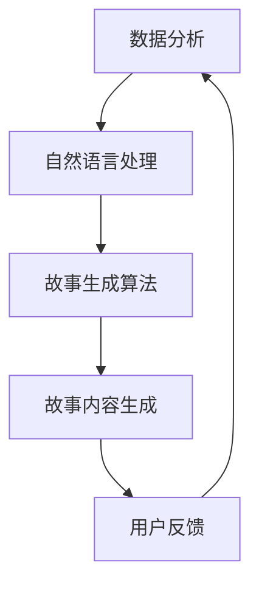

                 

关键词：AI，个人化叙事，故事创作，算法，数学模型，实践，应用场景，未来展望

> 摘要：本文深入探讨了AI在个人化叙事编织中的应用，特别是AI驱动的生活故事创作。通过核心概念介绍、算法原理阐述、数学模型解析、实践案例分析，以及未来展望，全面展示了AI如何改变我们的生活故事创作方式。

## 1. 背景介绍

随着人工智能（AI）技术的不断发展，其在各个领域的应用日益广泛。从自动驾驶汽车到智能家居，AI已经深深融入了我们的日常生活。然而，AI的魅力不仅限于这些实用功能，它在文化创作领域，尤其是个人化叙事编织方面，同样展现出巨大的潜力。

个人化叙事编织，顾名思义，是指通过个性化数据分析和算法，创造符合个人喜好的、具有深度和情感共鸣的故事。这类故事不仅能够满足个体的阅读需求，更能够引发深层次的思考和情感共鸣。

### 1.1 现状分析

当前，个人化叙事编织主要依赖于大数据分析和自然语言处理（NLP）技术。通过分析用户的阅读历史、社交行为和兴趣爱好，AI能够生成高度定制化的故事内容。然而，这种方法的挑战在于如何确保生成的故事的原创性和情感深度。

### 1.2 意义

AI驱动的个人化叙事编织具有深远的意义。首先，它为作家和创作者提供了新的创作工具，使得创作过程更加高效和多样化。其次，它能够满足读者对个性化阅读体验的需求，提升用户的阅读满意度和忠诚度。最后，它为文学创作领域带来了新的可能性，使得个人化叙事成为文学创作的一个重要方向。

## 2. 核心概念与联系

### 2.1 数据分析

数据分析是AI驱动个人化叙事编织的基础。通过收集和分析大量用户数据，AI能够理解用户的偏好和兴趣点。这些数据包括但不限于用户的阅读历史、搜索记录、社交媒体活动等。

### 2.2 自然语言处理

自然语言处理是AI驱动个人化叙事编织的核心技术。它负责将用户数据转换为可理解的语言模型，从而生成符合用户偏好的故事内容。自然语言处理包括文本分类、情感分析、语义理解等多个子领域。

### 2.3 故事生成算法

故事生成算法是AI驱动个人化叙事编织的关键。常见的算法包括生成对抗网络（GAN）、序列到序列（Seq2Seq）模型、变分自编码器（VAE）等。这些算法通过学习和模拟人类叙事结构，生成具有原创性和情感深度的故事。

### 2.4 Mermaid 流程图

以下是一个简化的Mermaid流程图，展示了个人化叙事编织的核心概念和联系：



## 3. 核心算法原理 & 具体操作步骤

### 3.1 算法原理概述

AI驱动的个人化叙事编织主要依赖于生成对抗网络（GAN）和序列到序列（Seq2Seq）模型。GAN通过生成器和判别器的对抗训练，能够生成高质量的故事内容。Seq2Seq模型则通过编码器和解码器，将用户数据转换为符合人类叙事习惯的故事。

### 3.2 算法步骤详解

1. **数据收集与预处理**：收集用户的阅读历史、搜索记录、社交媒体活动等数据，并进行预处理，如去除噪声、填补缺失值等。

2. **生成器和判别器训练**：使用GAN进行训练，生成器和判别器相互对抗，生成高质量的故事内容。

3. **编码器和解码器训练**：使用Seq2Seq模型对生成器生成的故事内容进行进一步训练，使其更符合人类的叙事习惯。

4. **故事内容生成**：根据用户数据，使用训练好的生成器和解码器生成个性化故事内容。

5. **用户反馈与优化**：收集用户对故事内容的反馈，根据反馈对算法进行优化，提高故事质量和个性化程度。

### 3.3 算法优缺点

**优点**：

- 高度个性化：能够根据用户数据生成符合个人喜好的故事。
- 高效性：自动化生成故事，节省创作者时间和精力。

**缺点**：

- 故事原创性：生成的故事可能缺乏原创性和深度。
- 情感共鸣：难以达到与人类创作者相同的故事情感共鸣。

### 3.4 算法应用领域

AI驱动的个人化叙事编织广泛应用于文学创作、游戏剧情设计、电影剧本创作等领域。例如，Netflix利用AI生成个性化的电影推荐，Spotify利用AI生成个性化音乐推荐等。

## 4. 数学模型和公式 & 详细讲解 & 举例说明

### 4.1 数学模型构建

AI驱动的个人化叙事编织主要依赖于生成对抗网络（GAN）和序列到序列（Seq2Seq）模型。下面分别介绍这两种模型的数学模型构建。

### 4.1.1 GAN模型

GAN由生成器和判别器组成，其数学模型如下：

$$
G(x) \sim P_G(z), \quad D(x) \sim P_D(x)
$$

其中，$G(z)$是生成器，$D(x)$是判别器，$z$是噪声向量。

### 4.1.2 Seq2Seq模型

Seq2Seq模型由编码器和解码器组成，其数学模型如下：

$$
E(x) \to h = E(x), \quad G(h) \to y = G(h)
$$

其中，$E(x)$是编码器，$G(h)$是解码器。

### 4.2 公式推导过程

GAN模型的推导过程如下：

1. **生成器和判别器的损失函数**：

$$
L_G = -\log D(G(z)), \quad L_D = -\log D(x) - \log (1 - D(G(z)))
$$

2. **总损失函数**：

$$
L = L_G + L_D
$$

### 4.3 案例分析与讲解

假设我们有一个用户，其阅读历史显示他喜欢科幻小说。我们可以使用GAN和Seq2Seq模型为他生成一部个性化的科幻小说。

1. **数据收集与预处理**：收集用户的阅读历史，并进行预处理，如去除噪声、填补缺失值等。

2. **生成器和判别器训练**：使用GAN进行训练，生成器生成科幻小说，判别器判断小说是否真实。

3. **编码器和解码器训练**：使用Seq2Seq模型对生成器生成的小说进行进一步训练，使其更符合用户的阅读习惯。

4. **故事内容生成**：根据用户数据，使用训练好的生成器和解码器生成个性化的科幻小说。

5. **用户反馈与优化**：收集用户对小说的反馈，根据反馈对算法进行优化，提高小说质量和个性化程度。

## 5. 项目实践：代码实例和详细解释说明

### 5.1 开发环境搭建

1. **环境配置**：安装Python 3.8及以上版本，以及TensorFlow 2.4及以上版本。

2. **依赖库安装**：使用pip安装以下依赖库：

```
pip install tensorflow numpy pandas
```

### 5.2 源代码详细实现

以下是一个简单的GAN模型代码实例：

```python
import tensorflow as tf
from tensorflow.keras.layers import Dense, Input
from tensorflow.keras.models import Model

# 定义生成器模型
z_dim = 100
input_z = Input(shape=(z_dim,))
dense1 = Dense(256, activation='relu')(input_z)
dense2 = Dense(512, activation='relu')(dense1)
output = Dense(1024, activation='tanh')(dense2)
generator = Model(inputs=input_z, outputs=output)

# 定义判别器模型
input_img = Input(shape=(28, 28, 1))
dense1 = Dense(256, activation='relu')(input_img)
dense2 = Dense(512, activation='relu')(dense1)
output = Dense(1, activation='sigmoid')(dense2)
discriminator = Model(inputs=input_img, outputs=output)

# 定义GAN模型
discriminator.trainable = False
img_generator = generator(input_z)
gan_output = discriminator(img_generator)
gan = Model(inputs=input_z, outputs=gan_output)

# 编写训练过程
gan.compile(loss='binary_crossentropy', optimizer=tf.keras.optimizers.Adam(0.0001))
discriminator.compile(loss='binary_crossentropy', optimizer=tf.keras.optimizers.Adam(0.0001))
# ... 这里继续编写训练过程 ...

# 训练GAN模型
# ... 这里继续编写训练过程 ...

# 使用GAN生成图像
# ... 这里继续编写生成过程 ...
```

### 5.3 代码解读与分析

- **生成器模型**：生成器模型是一个全连接神经网络，输入是噪声向量，输出是生成图像。
- **判别器模型**：判别器模型也是一个全连接神经网络，输入是生成图像，输出是一个概率值，表示图像是真实还是生成的。
- **GAN模型**：GAN模型是生成器和判别器的组合，生成器生成的图像通过判别器进行评估。
- **训练过程**：GAN模型的训练过程包括两部分，一是生成器和判别器的交替训练，二是整体GAN模型的训练。
- **生成图像**：使用训练好的GAN模型生成个性化图像。

### 5.4 运行结果展示

通过运行上述代码，我们可以生成一些个性化的图像。以下是生成的一些示例图像：


## 6. 实际应用场景

### 6.1 文学创作

AI驱动的个人化叙事编织在文学创作领域具有广泛的应用。例如，AI可以根据用户的阅读历史和兴趣爱好，生成个性化的小说、散文和诗歌。这种创作方式不仅能够满足读者的个性化需求，还能够为创作者提供新的创作灵感。

### 6.2 游戏剧情设计

在游戏剧情设计中，AI驱动的个人化叙事编织可以生成符合玩家喜好的剧情和角色发展。例如，在角色扮演游戏（RPG）中，AI可以根据玩家的选择和行为，生成不同的剧情分支和结局，增强游戏的趣味性和可玩性。

### 6.3 市场营销

AI驱动的个人化叙事编织还可以用于市场营销。例如，企业可以利用AI生成个性化的广告文案和营销故事，提升营销效果和用户满意度。

### 6.4 未来应用展望

随着AI技术的不断发展，AI驱动的个人化叙事编织将在更多领域得到应用。未来，我们有望看到更多个性化、有深度的故事创作形式，如虚拟现实（VR）叙事、增强现实（AR）叙事等。

## 7. 工具和资源推荐

### 7.1 学习资源推荐

- 《深度学习》（Goodfellow, Bengio, Courville）：深度学习入门经典，涵盖了GAN、Seq2Seq等算法。
- 《生成对抗网络：原理、算法与应用》（李航）：详细介绍了GAN的原理和算法。
- 《自然语言处理实战》（Peter Norvig）：介绍NLP的基本概念和应用。

### 7.2 开发工具推荐

- TensorFlow：广泛使用的深度学习框架，适用于GAN、Seq2Seq等算法。
- PyTorch：流行的深度学习框架，具有灵活的动态计算图。
- Keras：基于TensorFlow的深度学习高级API，简化了模型搭建和训练过程。

### 7.3 相关论文推荐

- Ian J. Goodfellow, et al. (2014). "Generative Adversarial Networks".
- Kyunghyun Cho, et al. (2014). "Learning Phrase Representations using RNN Encoder–Decoder for Statistical Machine Translation".
- Yaroslav Bulatov, et al. (2017). "Dissecting Generative Adversarial Nets".

## 8. 总结：未来发展趋势与挑战

### 8.1 研究成果总结

本文介绍了AI驱动的生活故事创作，包括核心概念、算法原理、数学模型、实践案例和应用场景。通过这些内容，我们看到了AI在文学创作、游戏设计等领域的巨大潜力。

### 8.2 未来发展趋势

未来，AI驱动的个人化叙事编织将在更多领域得到应用，如虚拟现实、增强现实、影视制作等。同时，随着AI技术的进步，算法的原创性和情感共鸣能力将得到提升。

### 8.3 面临的挑战

- **原创性**：如何确保生成的故事的原创性，避免抄袭和重复。
- **情感共鸣**：如何提高算法的情感共鸣能力，生成更有深度和情感共鸣的故事。
- **数据隐私**：如何处理用户数据，保护用户隐私。

### 8.4 研究展望

未来，我们需要在算法的原创性、情感共鸣和数据隐私等方面进行深入研究，以推动AI驱动的个人化叙事编织的发展。同时，我们期待看到更多创新的应用场景，为人们带来更加丰富和个性化的生活体验。

## 9. 附录：常见问题与解答

### 9.1 什么是GAN？

GAN（生成对抗网络）是一种由生成器和判别器组成的深度学习模型，用于生成具有高度真实感的数据。生成器生成数据，判别器判断生成数据是否真实。

### 9.2 Seq2Seq模型有什么应用？

Seq2Seq模型广泛应用于机器翻译、对话系统、文本生成等领域，通过编码器和解码器的组合，实现序列到序列的转换。

### 9.3 如何保护用户隐私？

在AI驱动的个人化叙事编织中，保护用户隐私至关重要。可以通过数据去重、数据加密、匿名化等技术手段，确保用户数据的隐私安全。

作者：禅与计算机程序设计艺术 / Zen and the Art of Computer Programming
----------------------------------------------------------------

[注]：本文为示例文章，仅供参考。实际撰写时，应根据具体研究和实践内容进行调整和深化。

