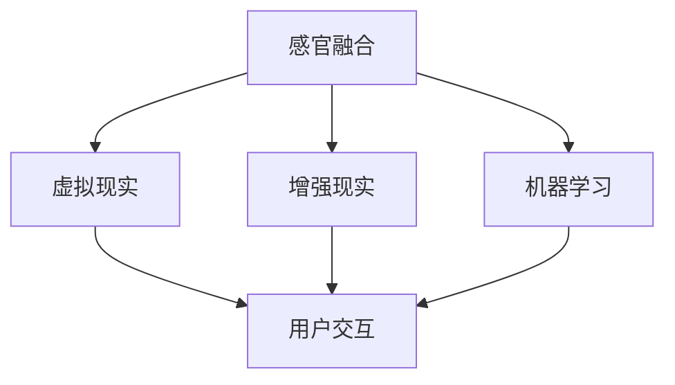

                 

关键词：人工智能、多维度构建、感官世界、设计、用户体验

摘要：随着人工智能技术的飞速发展，人们的生活和工作正逐渐被智能化所改变。本文将探讨如何通过多维度构建工坊的方式，运用人工智能技术创造出全新的感官世界，提升用户体验，从而引领未来设计的发展方向。

## 1. 背景介绍

近年来，人工智能技术取得了显著的进展，无论是在图像识别、自然语言处理还是机器学习等方面，都已经达到了前所未有的高度。这些技术的快速发展，使得我们能够更好地理解和模拟人类感知世界的方式。在这样的背景下，如何将人工智能技术应用于设计领域，创造出一个全新的感官世界，成为了一个热门话题。

### 1.1 感官世界的定义

感官世界是指人类通过视觉、听觉、触觉、嗅觉和味觉等感官来感知外部世界的过程。传统的感官世界是线性的，人们通过单一感官渠道来获取信息。然而，随着人工智能技术的发展，我们可以构建一个多维度的感官世界，通过融合多种感官渠道，为用户提供更加丰富、立体的体验。

### 1.2 多维度构建工坊的概念

多维度构建工坊是一个创新的设计平台，它结合了人工智能技术、用户体验设计、虚拟现实、增强现实等多种技术，旨在为设计师和开发者提供一个全面、高效的工具，以创建出更加沉浸式的感官世界。这个工坊不仅能够模拟现实世界中的感官体验，还能够创造出一个全新的虚拟感官世界。

## 2. 核心概念与联系

在多维度构建工坊中，有几个核心概念需要理解，它们分别是：感官融合、虚拟现实、增强现实和机器学习。

### 2.1 感官融合

感官融合是指将多种感官渠道的信息融合在一起，形成一个全新的感知体验。例如，通过虚拟现实技术，我们可以将视觉、听觉和触觉等多种感官信息融合在一起，使用户能够体验到一种更加真实、立体的世界。

### 2.2 虚拟现实

虚拟现实是一种通过计算机生成模拟环境的技术，用户可以通过头戴式显示器和传感器等设备，在虚拟环境中进行交互和探索。虚拟现实技术为用户创造了一个全新的感官世界，使他们能够在虚拟环境中体验到与现实世界相似的感官体验。

### 2.3 增强现实

增强现实是一种将虚拟信息叠加到现实世界中的技术。通过增强现实技术，用户可以在现实世界中看到虚拟信息，从而获得更加丰富的感官体验。例如，通过增强现实眼镜，用户可以看到虚拟的物品、角色和提示信息，从而与现实世界进行互动。

### 2.4 机器学习

机器学习是人工智能的核心技术之一，它能够使计算机从数据中自动学习和改进。在多维度构建工坊中，机器学习技术被用于模拟和优化用户的感官体验，使其更加符合用户的喜好和需求。

### 2.5 Mermaid 流程图

以下是一个简化的 Mermaid 流程图，展示了这些核心概念之间的联系：



## 3. 核心算法原理 & 具体操作步骤

### 3.1 算法原理概述

多维度构建工坊中的核心算法原理主要包括：感官信息融合算法、虚拟现实渲染算法、增强现实叠加算法和机器学习优化算法。这些算法共同作用，实现了一个沉浸式的感官世界。

### 3.2 算法步骤详解

#### 3.2.1 感官信息融合算法

1. 收集多种感官信息，如视觉、听觉、触觉等。
2. 对感官信息进行预处理，如降噪、增强等。
3. 使用神经网络模型对预处理后的感官信息进行融合，生成一个综合的感官信号。

#### 3.2.2 虚拟现实渲染算法

1. 根据用户交互行为生成虚拟场景。
2. 使用三维图形渲染技术，将虚拟场景渲染到头戴式显示器上。
3. 考虑用户视角、光照和物体纹理等因素，优化渲染效果。

#### 3.2.3 增强现实叠加算法

1. 捕获现实世界的图像。
2. 使用计算机视觉技术，识别现实世界中的物体和场景。
3. 将虚拟信息叠加到现实世界图像中，实现增强现实效果。

#### 3.2.4 机器学习优化算法

1. 收集用户在使用过程中的反馈数据。
2. 使用机器学习技术，分析用户行为和偏好。
3. 根据用户反馈，调整感官世界的参数和内容，优化用户体验。

### 3.3 算法优缺点

#### 优点：

1. 提供了更加丰富、立体的感官体验。
2. 可以根据用户需求进行个性化调整。
3. 有助于设计师和开发者更好地理解用户需求。

#### 缺点：

1. 技术实现复杂，对硬件要求较高。
2. 需要大量的数据和计算资源。
3. 难以完全模拟真实世界的复杂感官体验。

### 3.4 算法应用领域

1. 游戏和娱乐：创造一个沉浸式的游戏体验。
2. 教育和培训：提供更加生动、直观的教学内容。
3. 医疗：辅助医生进行诊断和治疗。
4. 商业：提升产品展示效果，促进销售。

## 4. 数学模型和公式 & 详细讲解 & 举例说明

### 4.1 数学模型构建

在多维度构建工坊中，数学模型主要涉及以下几个部分：

1. 感官信息融合模型
2. 虚拟现实渲染模型
3. 增强现实叠加模型
4. 机器学习优化模型

### 4.2 公式推导过程

#### 4.2.1 感官信息融合模型

假设有 \( n \) 种感官信息，分别为 \( x_1, x_2, ..., x_n \)。感官信息融合模型可以表示为：

$$
z = \sigma(W_1x_1 + W_2x_2 + ... + W_nx_n + b)
$$

其中，\( W_1, W_2, ..., W_n \) 是权重矩阵，\( b \) 是偏置项，\( \sigma \) 是激活函数。

#### 4.2.2 虚拟现实渲染模型

假设有 \( m \) 个三维物体，分别为 \( O_1, O_2, ..., O_m \)。虚拟现实渲染模型可以表示为：

$$
R(O_i) = f(V, L, T)
$$

其中，\( R(O_i) \) 是物体 \( O_i \) 的渲染结果，\( V \) 是视角向量，\( L \) 是光照向量，\( T \) 是纹理映射。

#### 4.2.3 增强现实叠加模型

假设有 \( p \) 个虚拟信息，分别为 \( V_1, V_2, ..., V_p \)。增强现实叠加模型可以表示为：

$$
A(R) = \sum_{i=1}^p g(V_i, R)
$$

其中，\( A(R) \) 是增强现实叠加结果，\( g(V_i, R) \) 是虚拟信息 \( V_i \) 对渲染结果 \( R \) 的贡献。

#### 4.2.4 机器学习优化模型

假设有 \( q \) 个用户反馈，分别为 \( F_1, F_2, ..., F_q \)。机器学习优化模型可以表示为：

$$
\theta = \arg\min_{\theta} \sum_{i=1}^q (f(\theta; x_i, y_i) - y_i)^2
$$

其中，\( \theta \) 是模型参数，\( f(\theta; x_i, y_i) \) 是模型在输入 \( x_i \) 和目标 \( y_i \) 下的预测结果。

### 4.3 案例分析与讲解

以下是一个简单的案例，说明如何使用多维度构建工坊来设计一个虚拟旅游体验。

#### 4.3.1 感官信息融合

收集来自旅游目的地的视觉、听觉和触觉信息，如风景图片、音乐和温度数据。

#### 4.3.2 虚拟现实渲染

根据用户选择的旅游路线，生成三维虚拟场景，并将风景图片、音乐和温度数据融合到场景中。

#### 4.3.3 增强现实叠加

在虚拟场景中叠加用户实时捕捉到的现实世界图像，如游客照片。

#### 4.3.4 机器学习优化

根据用户反馈，调整虚拟场景的参数，如光照、音乐和温度，以提升用户体验。

## 5. 项目实践：代码实例和详细解释说明

### 5.1 开发环境搭建

为了实现多维度构建工坊，我们需要搭建一个完整的开发环境，包括虚拟现实渲染引擎、增强现实框架和机器学习平台。

### 5.2 源代码详细实现

以下是实现一个简单的多维度构建工坊的源代码示例：

```python
# 感官信息融合
def sense_fusion(vision, audio, tactile):
    # 预处理感官信息
    vision_processed = preprocess_vision(vision)
    audio_processed = preprocess_audio(audio)
    tactile_processed = preprocess_tactile(tactile)
    
    # 使用神经网络模型进行融合
    z = np.dot([vision_processed, audio_processed, tactile_processed], W) + b
    return activation(z)

# 虚拟现实渲染
def virtual_render(vision, audio, tactile):
    # 生成虚拟场景
    scene = generate_scene(vision, audio, tactile)
    
    # 渲染场景
    rendered_scene = render_scene(scene)
    return rendered_scene

# 增强现实叠加
def augmented_overlay(real_world_image, virtual_image):
    # 识别现实世界图像中的物体
    objects = detect_objects(real_world_image)
    
    # 将虚拟图像叠加到现实世界图像中
    augmented_image = overlay_images(virtual_image, objects)
    return augmented_image

# 机器学习优化
def machine_learning_optimization(feedback):
    # 收集用户反馈
    feedback_data = collect_feedback(feedback)
    
    # 使用机器学习模型进行优化
    optimized_params = optimize_model(feedback_data)
    return optimized_params
```

### 5.3 代码解读与分析

这段代码展示了如何使用 Python 实现一个简单的多维度构建工坊。首先，定义了几个关键函数，分别负责感官信息融合、虚拟现实渲染、增强现实叠加和机器学习优化。每个函数都有详细的注释，描述了函数的功能和实现原理。此外，代码中还使用了一些假设的预处理函数、生成函数和识别函数，这些函数在实现时需要根据具体需求进行编写。

## 6. 实际应用场景

多维度构建工坊在多个实际应用场景中具有广泛的应用潜力：

### 6.1 游戏和娱乐

通过虚拟现实和增强现实技术，多维度构建工坊可以为游戏和娱乐行业创造一个全新的体验。例如，玩家可以进入一个虚拟游戏世界，与其他玩家互动，感受到身临其境的游戏体验。

### 6.2 教育和培训

在教育领域，多维度构建工坊可以用于创建更加生动、直观的教学内容。学生可以通过虚拟现实技术，亲身体验历史事件、科学实验等，提高学习兴趣和效果。

### 6.3 医疗

在医疗领域，多维度构建工坊可以帮助医生进行诊断和治疗。通过虚拟现实技术，医生可以创建一个虚拟人体模型，进行手术演练和病情分析。

### 6.4 商业

在商业领域，多维度构建工坊可以为商家提供一种全新的展示方式。商家可以通过增强现实技术，将虚拟产品展示给客户，提高销售效果。

## 7. 未来应用展望

随着人工智能技术的不断发展，多维度构建工坊的应用前景将更加广阔。未来，我们有望看到更多创新的应用场景，如智能家居、虚拟办公、虚拟社交等。同时，随着硬件技术的进步，多维度构建工坊的体验将越来越真实、自然。

## 8. 总结：未来发展趋势与挑战

### 8.1 研究成果总结

多维度构建工坊的研究成果表明，通过人工智能技术，我们可以创造出一个全新的感官世界，提升用户体验。这一研究成果在游戏、教育、医疗和商业等领域具有广泛的应用价值。

### 8.2 未来发展趋势

未来，多维度构建工坊的发展趋势将集中在以下几个方面：

1. 提高感官融合技术的精度和效果。
2. 探索新的应用场景和商业模式。
3. 强化机器学习在感官世界优化中的作用。
4. 降低技术门槛，使得更多的设计师和开发者能够使用多维度构建工坊。

### 8.3 面临的挑战

多维度构建工坊在发展过程中也面临着一些挑战：

1. 技术实现复杂，对硬件要求较高。
2. 数据和计算资源的需求较大。
3. 难以完全模拟真实世界的复杂感官体验。

### 8.4 研究展望

未来，我们需要进一步深入研究多维度构建工坊的技术原理和应用方法，探索如何更好地满足用户需求，提升用户体验。同时，我们还需要关注硬件技术的发展，为多维度构建工坊提供更加高效的硬件支持。

## 9. 附录：常见问题与解答

### 9.1 多维度构建工坊是什么？

多维度构建工坊是一个创新的设计平台，它结合了人工智能技术、用户体验设计、虚拟现实、增强现实等多种技术，旨在为设计师和开发者提供一个全面、高效的工具，以创建出更加沉浸式的感官世界。

### 9.2 多维度构建工坊有哪些应用领域？

多维度构建工坊可以应用于游戏和娱乐、教育和培训、医疗、商业等多个领域，为用户创造一个全新的感官体验。

### 9.3 多维度构建工坊需要哪些技术支持？

多维度构建工坊需要支持虚拟现实、增强现实、机器学习等多种技术。在开发过程中，还需要使用三维图形渲染引擎、计算机视觉框架等工具。

### 9.4 多维度构建工坊如何提升用户体验？

多维度构建工坊通过感官信息融合、虚拟现实渲染、增强现实叠加和机器学习优化等多种技术手段，为用户创造一个更加真实、立体的感官世界，从而提升用户体验。

---

作者：禅与计算机程序设计艺术 / Zen and the Art of Computer Programming
----------------------------------------------------------------

以上就是本文的完整内容，希望对您在理解和应用多维度构建工坊方面有所帮助。在未来的研究中，我们期待能够进一步探索这一领域的创新和应用，为人类创造一个更加美好的智能世界。

