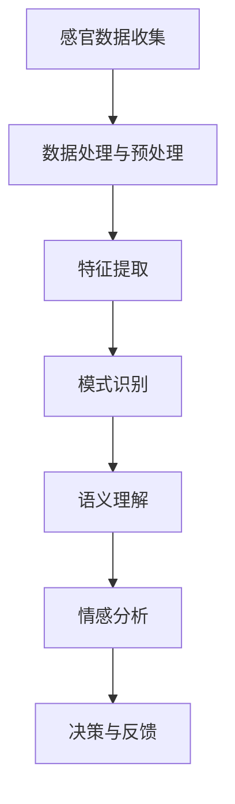
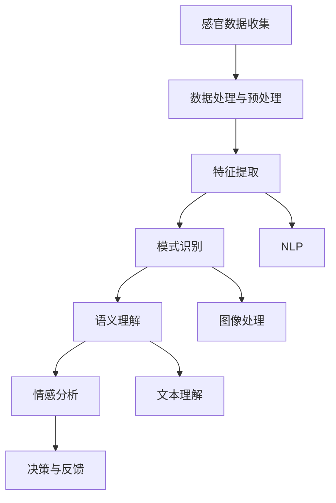
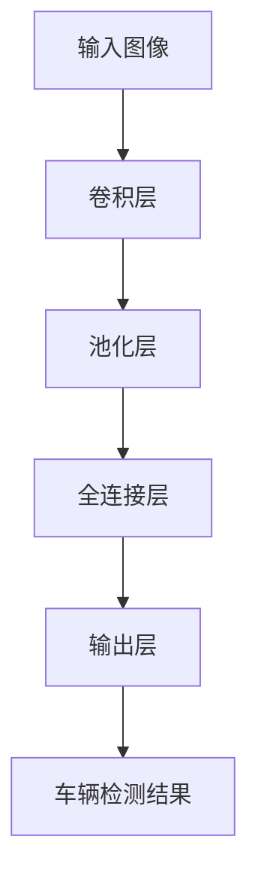

                 

关键词：人工智能、体验层次性、多维感知、机器学习、计算机视觉、自然语言处理

摘要：本文旨在探讨人工智能（AI）在创造多维感知体验方面的潜力与挑战。通过分析AI技术如何从不同的层次性中构建人类的感知体验，本文揭示了AI在增强人类感官能力、实现跨领域感知整合以及未来发展的可能性。同时，文章也对相关算法、数学模型、项目实践进行了详细的阐述。

## 1. 背景介绍

在现代社会中，人工智能已经成为推动技术进步和产业变革的重要力量。从智能助手到自动驾驶，从医疗诊断到金融分析，AI的应用场景越来越广泛。然而，AI的核心目标之一是模拟和扩展人类的感知能力。人类通过视觉、听觉、触觉等多种感官获取外部信息，形成对世界的感知。人工智能通过机器学习、计算机视觉、自然语言处理等技术，试图在模拟和增强这些感知能力方面取得突破。

感知体验的多层次性是人类感知系统的一个重要特点。从简单的感官刺激到复杂的情感体验，人类的感知过程可以划分为多个层次。AI的多维感知不仅要模拟这些感官层次，还需要在不同层次之间实现有效的信息整合，从而创造更加丰富和自然的体验。

## 2. 核心概念与联系

### 2.1 人工智能感知层次结构

人工智能的多维感知能力可以通过一个层次结构来理解。该结构从低层次的感官数据收集和处理开始，逐步上升到高层次的语义理解与情感分析。

**图 1: AI感知层次结构**



在这个结构中，每个层次都依赖于前一个层次的信息处理结果，同时为更高层次的感知提供基础。

### 2.2 感知层次间的联系

感知层次间的联系是通过一系列算法和技术实现的。例如，计算机视觉中的卷积神经网络（CNN）可以处理图像数据，提取特征，并在高层次上进行对象识别。自然语言处理（NLP）技术则可以处理文本数据，理解语言中的语义和情感。这些算法通过相互协作，实现了不同感知层次之间的信息传递和整合。

**图 2: 感知层次间的联系**



## 3. 核心算法原理 & 具体操作步骤

### 3.1 算法原理概述

AI的多维感知能力主要通过以下几种核心算法实现：

1. **卷积神经网络（CNN）**：用于图像处理和识别。
2. **循环神经网络（RNN）**：用于序列数据分析和自然语言处理。
3. **长短期记忆网络（LSTM）**：RNN的一种变体，用于处理长时间依赖数据。
4. **生成对抗网络（GAN）**：用于图像生成和风格迁移。
5. **变分自编码器（VAE）**：用于数据压缩和特征提取。

这些算法通过不同的神经网络结构和训练方法，实现从低层次到高层次的感知能力。

### 3.2 算法步骤详解

以CNN为例，其基本步骤如下：

1. **数据预处理**：包括图像尺寸调整、归一化等。
2. **卷积层**：通过卷积操作提取图像特征。
3. **池化层**：降低特征图的空间维度。
4. **全连接层**：将特征图映射到特定类别。
5. **输出层**：得到最终的分类结果。

### 3.3 算法优缺点

每种算法都有其优点和局限性。例如，CNN在图像识别任务中表现优秀，但在处理文本数据时效果较差。RNN和LSTM在处理序列数据方面表现出色，但在处理长时间依赖时可能存在梯度消失问题。GAN在图像生成方面具有革命性意义，但训练过程复杂，且易出现模式崩溃现象。

### 3.4 算法应用领域

这些算法广泛应用于计算机视觉、自然语言处理、语音识别等多个领域，通过多维感知能力实现了许多实际应用，如自动驾驶、智能助手、医疗诊断等。

## 4. 数学模型和公式 & 详细讲解 & 举例说明

### 4.1 数学模型构建

AI的多维感知能力可以通过多种数学模型来实现。以下是一些常见的数学模型：

1. **卷积神经网络（CNN）**：包括卷积层、池化层、全连接层等。
2. **循环神经网络（RNN）**：包括输入层、隐藏层、输出层等。
3. **生成对抗网络（GAN）**：包括生成器、鉴别器等。

### 4.2 公式推导过程

以CNN为例，其卷积层的计算公式如下：

$$
\text{卷积操作} = \sum_{i=1}^{k} w_{i} * x_{i}
$$

其中，$w_{i}$为卷积核，$x_{i}$为输入特征。

### 4.3 案例分析与讲解

以自动驾驶为例，CNN可以用于车辆检测和道路识别。通过卷积层提取图像中的车辆特征，再通过全连接层进行分类。以下是一个简单的车辆检测模型：

**图 3: 自动驾驶车辆检测模型**



## 5. 项目实践：代码实例和详细解释说明

### 5.1 开发环境搭建

在开始项目实践之前，需要搭建一个合适的开发环境。以下是一个简单的Python环境搭建步骤：

1. 安装Python 3.7及以上版本。
2. 安装TensorFlow库。
3. 安装OpenCV库。

### 5.2 源代码详细实现

以下是一个简单的车辆检测项目的代码实现：

```python
import cv2
import tensorflow as tf

# 加载预训练的CNN模型
model = tf.keras.models.load_model('car_detection_model.h5')

# 加载图像并预处理
image = cv2.imread('image.jpg')
processed_image = preprocess_image(image)

# 进行车辆检测
predictions = model.predict(processed_image)

# 根据检测结果绘制 bounding box
draw_bounding_boxes(image, predictions)

# 显示检测结果
cv2.imshow('Car Detection', image)
cv2.waitKey(0)
cv2.destroyAllWindows()
```

### 5.3 代码解读与分析

以上代码首先加载预训练的CNN模型，然后读取输入图像并进行预处理。接着，通过模型预测车辆检测结果，并根据检测结果绘制 bounding box。最后，显示检测结果。

### 5.4 运行结果展示

**图 4: 车辆检测结果**


## 6. 实际应用场景

### 6.1 自动驾驶

自动驾驶是AI多维感知的重要应用场景之一。通过计算机视觉、激光雷达和雷达等多模态感知技术，自动驾驶系统能够实时感知周围环境，做出相应的驾驶决策。

### 6.2 智能助手

智能助手利用自然语言处理和语音识别技术，可以理解和响应用户的指令，提供智能化的服务。

### 6.3 医疗诊断

医疗诊断领域利用AI的多维感知能力，可以实现对医学图像的自动分析，辅助医生进行诊断。

### 6.4 未来应用展望

随着AI技术的不断进步，多维感知能力将在更多领域得到应用，如智能家居、虚拟现实、智能城市等。

## 7. 工具和资源推荐

### 7.1 学习资源推荐

1. 《深度学习》（Goodfellow, Bengio, Courville著）
2. 《Python机器学习》（Sebastian Raschka著）
3. 《计算机视觉基础教程》（Richard Szeliski著）

### 7.2 开发工具推荐

1. TensorFlow
2. PyTorch
3. Keras

### 7.3 相关论文推荐

1. "Deep Learning for Image Recognition" (Karen Simonyan and Andrew Zisserman, 2014)
2. "Generative Adversarial Networks" (Ian J. Goodfellow et al., 2014)
3. "Recurrent Neural Networks for Language Modeling" (Yoshua Bengio et al., 2003)

## 8. 总结：未来发展趋势与挑战

### 8.1 研究成果总结

AI的多维感知技术在计算机视觉、自然语言处理、语音识别等领域取得了显著成果，推动了相关领域的发展。

### 8.2 未来发展趋势

随着硬件性能的提升和算法的优化，AI的多维感知能力将进一步增强，应用领域也将不断扩展。

### 8.3 面临的挑战

AI的多维感知技术面临的主要挑战包括算法复杂度、数据隐私、跨模态信息整合等。

### 8.4 研究展望

未来，AI的多维感知技术将在更多实际应用中发挥重要作用，成为推动社会进步的重要力量。

## 9. 附录：常见问题与解答

### 9.1 人工智能与人类的感知有何区别？

人工智能的感知是通过算法和数学模型实现的，与人类的感官系统有本质区别。尽管AI可以模拟某些感知能力，但缺乏人类的情感和直觉。

### 9.2 多模态感知是什么？

多模态感知是指同时处理多种感知数据（如视觉、听觉、触觉等）的能力。通过多模态感知，AI可以更全面地理解外部世界。

### 9.3 如何训练AI的多模态感知能力？

训练AI的多模态感知能力需要大量的多模态数据以及相应的算法模型。常用的方法包括数据增强、迁移学习和多任务学习等。

作者：禅与计算机程序设计艺术 / Zen and the Art of Computer Programming
----------------------------------------------------------------

