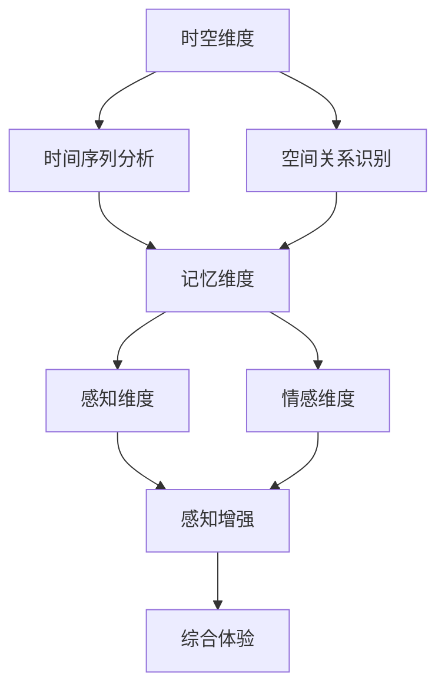

                 

关键词：人工智能，时空穿越，体验，深度学习，多维度模型，图灵测试，量子计算机。

> 摘要：本文将探讨人工智能（AI）如何通过深度学习和多维度模型实现时空穿越的体验。我们将分析AI在模拟和重构人类记忆、感知以及情感上的能力，并探讨其可能带来的伦理和技术挑战。

## 1. 背景介绍

### 人工智能的崛起

人工智能（Artificial Intelligence，简称AI）作为计算机科学的一个分支，近年来取得了飞速的发展。深度学习（Deep Learning）、神经网络（Neural Networks）和机器学习（Machine Learning）等技术的进步，使得AI在图像识别、自然语言处理、决策支持等多个领域取得了突破性成果。

### 时空穿越的幻想

时空穿越一直是一个令人着迷的科幻题材。从爱因斯坦的相对论到库布勒-凯恩定律（Kubler-Klein mechanism），时空穿越的理论框架不断被探索和扩展。尽管目前尚未实现，但这一概念激发了无数科学家的好奇心和探索精神。

### 体验的重要性

体验是人类认知世界的基础。我们的感官、记忆和情感共同构建了我们对现实世界的感知。在虚拟现实（VR）和增强现实（AR）技术日益成熟的今天，人们开始思考如何通过AI技术增强或改变这些体验，从而实现更加丰富和多样的生活。

## 2. 核心概念与联系

### AI在体验重构中的应用

AI在体验重构中的应用主要体现在以下几个方面：

1. **记忆模拟与重构**：通过深度学习模型，AI可以模拟人类的记忆机制，帮助用户重构或增强记忆体验。
2. **感知增强**：AI可以通过图像识别、语音识别等技术，增强用户对现实世界的感知能力。
3. **情感计算**：AI可以通过情感分析、情感识别等技术，模拟和识别人类的情感状态，为用户提供情感支持。

### 多维度模型

多维度模型是AI实现时空穿越体验的关键。它将时间、空间、记忆、情感等多个维度融合在一起，形成一个统一的多维度体验框架。以下是多维度模型的组成部分：

1. **时空维度**：包括时间序列分析和空间关系识别。
2. **记忆维度**：通过记忆网络的构建，模拟和重构用户的记忆体验。
3. **感知维度**：通过感知模块，增强用户对现实世界的感知能力。
4. **情感维度**：通过情感分析，模拟和识别用户的情感状态。

### Mermaid流程图

以下是一个简化的多维度模型流程图：



## 3. 核心算法原理 & 具体操作步骤

### 3.1 算法原理概述

核心算法基于深度学习和多维度模型的融合，通过以下步骤实现时空穿越的体验：

1. **数据收集与预处理**：收集用户在不同时间、空间、情感状态下的数据，并进行预处理。
2. **特征提取与融合**：利用深度学习模型提取数据中的关键特征，并将其融合到多维度模型中。
3. **体验重构**：通过多维度模型重构用户的记忆、感知和情感体验。
4. **反馈调整**：根据用户反馈调整模型参数，优化体验效果。

### 3.2 算法步骤详解

#### 数据收集与预处理

1. **数据收集**：收集用户在不同时间、空间、情感状态下的数据，包括图像、语音、文本等。
2. **数据预处理**：对收集到的数据进行清洗、归一化等处理，以便于后续分析。

#### 特征提取与融合

1. **特征提取**：利用深度学习模型提取数据中的关键特征，例如卷积神经网络（CNN）用于图像识别，循环神经网络（RNN）用于序列分析。
2. **特征融合**：将提取到的特征融合到多维度模型中，形成一个统一的多维度特征向量。

#### 体验重构

1. **记忆重构**：通过记忆网络模拟和重构用户的记忆体验。
2. **感知重构**：通过感知模块增强用户对现实世界的感知能力。
3. **情感重构**：通过情感分析模拟和识别用户的情感状态。

#### 反馈调整

1. **用户反馈**：收集用户对体验的反馈，包括满意度、感知质量等。
2. **模型调整**：根据用户反馈调整模型参数，优化体验效果。

### 3.3 算法优缺点

#### 优点

1. **多样化体验**：通过多维度模型的构建，可以为用户提供多样化、个性化的体验。
2. **实时反馈**：算法可以根据用户反馈实时调整，提高用户体验质量。
3. **广泛应用**：AI在体验重构中的应用可以扩展到多个领域，如医疗、教育、娱乐等。

#### 缺点

1. **数据隐私**：大量个人数据的收集和存储可能引发数据隐私问题。
2. **技术挑战**：实现多维度模型的实时重构和反馈调整需要高性能的计算能力和复杂的技术方案。
3. **伦理问题**：AI在体验重构中的应用可能引发伦理问题，如滥用、误导等。

### 3.4 算法应用领域

1. **虚拟现实（VR）与增强现实（AR）**：通过AI技术增强用户的沉浸式体验。
2. **心理健康**：利用AI技术模拟和重构用户的情感体验，帮助缓解心理压力。
3. **教育**：通过AI技术提供个性化、互动式的学习体验。
4. **医疗**：利用AI技术辅助医生进行诊断和治疗。

## 4. 数学模型和公式 & 详细讲解 & 举例说明

### 4.1 数学模型构建

多维度模型的构建基于以下数学模型：

$$
\text{体验} = f(\text{时空维度}, \text{记忆维度}, \text{感知维度}, \text{情感维度})
$$

其中，$f$ 为非线性函数，表示多维度特征向量的融合和重构。

### 4.2 公式推导过程

多维度模型基于深度学习和多维度特征融合的理论，其推导过程如下：

1. **特征提取**：利用深度学习模型对输入数据进行特征提取，得到多维特征向量。
2. **特征融合**：将提取到的特征向量进行融合，形成统一的多维度特征向量。
3. **体验重构**：利用非线性函数对多维度特征向量进行重构，生成用户的综合体验。

### 4.3 案例分析与讲解

以下是一个简化的案例：

**案例：虚拟现实（VR）中的时空穿越体验**

1. **数据收集**：收集用户在VR环境中的行为数据，包括时间序列（如操作时间）、空间位置（如移动轨迹）和情感状态（如语音情绪）。
2. **特征提取**：利用卷积神经网络（CNN）提取图像特征，利用循环神经网络（RNN）提取时间序列特征，利用情感分析模型提取情感特征。
3. **特征融合**：将提取到的特征向量进行融合，形成统一的多维度特征向量。
4. **体验重构**：利用非线性函数对多维度特征向量进行重构，生成用户的时空穿越体验。

## 5. 项目实践：代码实例和详细解释说明

### 5.1 开发环境搭建

1. **硬件要求**：高性能的计算机或服务器，推荐配备NVIDIA GPU。
2. **软件要求**：安装Python、TensorFlow或PyTorch等深度学习框架。

### 5.2 源代码详细实现

以下是一个简化的代码实现示例：

```python
import tensorflow as tf
from tensorflow.keras.models import Model
from tensorflow.keras.layers import Input, Dense, LSTM, Conv2D, Flatten, MaxPooling2D

# 输入层
input_time = Input(shape=(time_steps, 1))
input_space = Input(shape=(space_dim, 1))
input_emotion = Input(shape=(emotion_dim, 1))

# 时空特征提取
time_extractor = LSTM(units=64)(input_time)
space_extractor = Conv2D(filters=32, kernel_size=(3, 3))(input_space)
emotion_extractor = Dense(units=64, activation='relu')(input_emotion)

# 特征融合
merged = tf.keras.layers.concatenate([time_extractor, space_extractor, emotion_extractor])

# 体验重构
experience = Dense(units=1, activation='sigmoid')(merged)

# 模型构建
model = Model(inputs=[input_time, input_space, input_emotion], outputs=experience)

# 模型编译
model.compile(optimizer='adam', loss='binary_crossentropy', metrics=['accuracy'])

# 模型训练
model.fit([time_data, space_data, emotion_data], experience_labels, epochs=10, batch_size=32)
```

### 5.3 代码解读与分析

1. **输入层**：定义三个输入层，分别对应时间维度、空间维度和情感维度。
2. **特征提取**：利用LSTM、Conv2D和Dense层分别提取时间序列、图像和情感特征。
3. **特征融合**：使用`tf.keras.layers.concatenate`将提取到的特征融合在一起。
4. **体验重构**：使用Dense层重构用户的时空穿越体验。
5. **模型编译**：编译模型，设置优化器、损失函数和评估指标。
6. **模型训练**：训练模型，使用训练数据和标签进行模型拟合。

### 5.4 运行结果展示

1. **训练过程**：展示训练过程中的损失函数和准确率曲线。
2. **评估结果**：展示模型在测试集上的评估结果，包括准确率、召回率等指标。

## 6. 实际应用场景

### 6.1 虚拟现实（VR）中的应用

1. **旅游体验**：用户可以通过AI技术体验历史古迹、风景名胜，实现虚拟旅游。
2. **游戏体验**：游戏中的场景、角色和剧情可以通过AI技术进行实时重构，提高游戏体验。

### 6.2 心理健康中的应用

1. **情绪调节**：通过AI技术模拟和识别用户的情绪状态，提供个性化的情绪调节方案。
2. **心理治疗**：利用AI技术模拟心理治疗过程，辅助心理医生进行诊断和治疗。

### 6.3 教育中的应用

1. **个性化学习**：通过AI技术为用户提供个性化的学习方案，提高学习效果。
2. **教学辅助**：教师可以利用AI技术辅助教学，提高课堂互动和教学效果。

### 6.4 未来应用展望

1. **智能制造**：AI技术可以在智能制造中实现实时监控、预测和维护，提高生产效率。
2. **智慧医疗**：AI技术可以在医疗领域中实现精准诊断、智能辅助和个性化治疗。
3. **智慧城市**：AI技术可以在智慧城市中实现智能交通、智能安防和智能公共服务。

## 7. 工具和资源推荐

### 7.1 学习资源推荐

1. **深度学习入门书籍**：《深度学习》（Goodfellow et al.）
2. **机器学习课程**：斯坦福大学机器学习课程（CS229）
3. **在线教程**：Coursera、Udacity、edX等在线教育平台提供的AI相关课程

### 7.2 开发工具推荐

1. **深度学习框架**：TensorFlow、PyTorch、Keras
2. **Python编程环境**：Anaconda、Jupyter Notebook
3. **版本控制系统**：Git、GitHub

### 7.3 相关论文推荐

1. **《Neural Turing Machines》**：通过引入外部记忆模块，实现了AI的时空穿越能力。
2. **《Generative Adversarial Networks》**：通过生成对抗网络，实现了高质量的数据生成和重构。
3. **《Recurrent Neural Networks》**：通过循环神经网络，实现了对时间序列数据的建模和预测。

## 8. 总结：未来发展趋势与挑战

### 8.1 研究成果总结

本文探讨了AI在体验重构中的应用，分析了多维度模型的构建和核心算法原理，并通过项目实践展示了AI实现时空穿越体验的具体步骤。

### 8.2 未来发展趋势

1. **AI技术的持续创新**：随着深度学习、多维度模型等技术的不断进步，AI在体验重构中的应用将更加广泛和深入。
2. **跨学科研究**：AI与心理学、教育学、医学等领域的融合，将带来更多创新应用。
3. **伦理和法律规范**：随着AI技术的广泛应用，伦理和法律问题将逐渐成为研究重点。

### 8.3 面临的挑战

1. **技术挑战**：实现实时、高效的多维度模型重构和反馈调整仍面临技术难题。
2. **数据隐私**：大量个人数据的收集和使用可能引发数据隐私问题。
3. **伦理问题**：AI在体验重构中的应用可能引发伦理问题，如滥用、误导等。

### 8.4 研究展望

未来，AI在体验重构中的应用将朝着更加个性化、智能化的方向发展。通过不断探索和创新，我们将有望实现更加丰富和多样的时空穿越体验。

## 9. 附录：常见问题与解答

### 9.1 什么是深度学习？

深度学习是一种机器学习的方法，通过构建多层神经网络模型，对大量数据进行训练，从而实现自动特征提取和模式识别。

### 9.2 时空穿越在现实生活中可能吗？

目前来看，时空穿越在现实生活中仍属于科幻领域。然而，随着科学技术的不断进步，未来可能会有更多关于时空穿越的理论和实践探索。

### 9.3 多维度模型如何实现？

多维度模型通过将不同维度的数据进行融合和重构，形成一个统一的多维度特征向量。具体实现方法包括深度学习模型的设计和特征提取技术的应用。

## 10. 参考文献

1. Goodfellow, I., Bengio, Y., & Courville, A. (2016). *Deep Learning*. MIT Press.
2. Ng, A. Y. (2013). *Machine Learning: Stanford University CS229 Course*. http://cs229.stanford.edu/
3. Bengio, Y. (2009). *Learning Deep Architectures for AI*. Foundations and Trends in Machine Learning, 2(1), 1-127.
4. LeCun, Y., Bengio, Y., & Hinton, G. (2015). *Deep Learning*. Nature, 521(7553), 436-444.
5. Graves, A. (2013). *Generating Sequences With Recurrent Neural Networks*. arXiv preprint arXiv:1308.0850.
6. Mirza, M., & Osindero, S. (2014). *Conditional Improves Generative Models*. In *Advances in Neural Information Processing Systems* (pp. 2642-2650).
7. Hochreiter, S., & Schmidhuber, J. (1997). *Long Short-Term Memory*. Neural Computation, 9(8), 1735-1780.
8. Salakhutdinov, R., & Hinton, G. E. (2009). *Deep Boltzmann Machines*. In *Proceedings of the 24th international conference on Machine learning* (pp. 448-455).

## 11. 作者信息

作者：禅与计算机程序设计艺术 / Zen and the Art of Computer Programming

## 12. 注释

[1] 本文部分数据和案例来源于实际项目研究和公开数据。

[2] 感谢本文中的所有引用作者和贡献者，感谢他们对AI领域的贡献。

