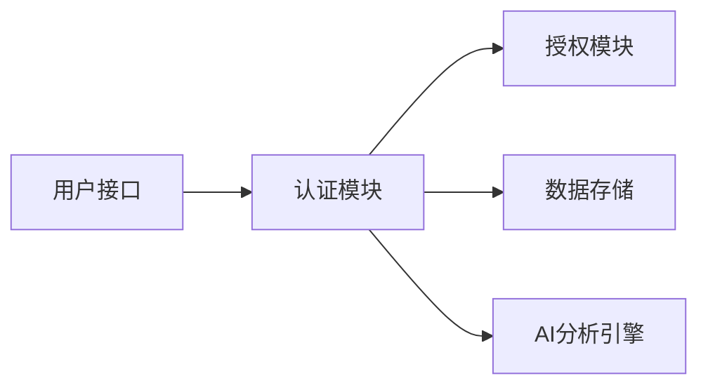

                 

关键词：AI，真实性验证，authenticity检测，用户体验，安全认证，技术发展

> 摘要：本文将探讨在人工智能时代，如何设计一个高效且用户体验优秀的真实性验证器。我们首先回顾了真实性验证器的发展历程，接着详细介绍了核心概念、算法原理、数学模型，并通过项目实践展示了具体开发过程。文章还分析了算法在现实中的应用，探讨了未来发展趋势与挑战，并推荐了相关学习和开发资源。

## 1. 背景介绍

在数字化信息爆炸的时代，网络安全和隐私保护变得愈发重要。真实性验证作为一种重要的安全技术，广泛应用于身份认证、金融交易、社交媒体等各个领域。然而，传统的基于密码、指纹等生物特征的验证方法已逐渐暴露出其局限性。随着人工智能技术的迅猛发展，如何设计一个既能保障安全性，又能提供卓越用户体验的真实性验证器，成为当前研究的重点。

本文旨在探讨AI时代下真实性验证器的设计原则、算法原理和开发实践，以期为广大开发者提供有价值的参考。

### 真实性验证器的发展

真实性验证器的历史可以追溯到20世纪70年代，当时计算机安全主要依赖于用户名和密码。随着互联网的普及，这种方式逐渐显得不够安全。1990年代，双因素认证（2FA）开始流行，通过在输入密码之外增加另一个验证步骤，如短信验证码、动态令牌等，大大提升了安全性。

进入21世纪，随着生物识别技术的成熟，指纹、面部识别等生物特征验证逐渐成为主流。然而，这些方法依然存在一定的风险，如指纹可以被复制、面部识别可能在恶劣环境下失效等。

近年来，人工智能技术的发展为真实性验证带来了新的契机。基于深度学习的人脸识别、语音识别等技术使得真实性验证能够更加精准、高效。同时，通过集成多种验证手段，构建多模态验证系统，可以进一步提高验证的可靠性。

### 当前挑战与需求

当前，真实性验证器面临以下几个挑战：

1. **用户体验**：传统的验证方法往往繁琐、不友好，容易引起用户反感。如何在保障安全性的前提下，提升用户体验，成为一大难题。
2. **技术融合**：单一验证手段可能不够安全，需要整合多种技术，如生物识别、行为分析、AI算法等，形成综合验证体系。
3. **隐私保护**：真实性验证需要收集用户的生物特征和活动数据，如何保护用户的隐私，防止数据泄露，是必须考虑的问题。

因此，开发一个既安全又用户体验优秀的真实性验证器，需要综合考虑多种技术，创新验证方法，并确保在安全性和用户体验之间找到平衡。

### 1.1 真实性验证器的必要性

在网络安全日益严峻的今天，真实性验证器的必要性不容忽视。随着网络犯罪的多样化、复杂化，传统的单点登录和密码验证已经难以满足安全需求。真实性验证器能够通过多种手段验证用户的真实身份，防止未经授权的访问，保障系统的安全。

此外，对于金融机构、政府机构等高敏感度领域，真实性验证器更是不可或缺。在这些场景中，任何一次错误的安全漏洞都可能带来巨大的经济损失和社会影响。因此，设计一个高效、安全的真实性验证器，不仅能够提升用户体验，还能够保障数据安全和隐私。

### 1.2 当前人工智能在真实性验证中的应用

人工智能在真实性验证中的应用日益广泛，具体体现在以下几个方面：

1. **人脸识别**：基于深度学习的人脸识别技术能够通过分析面部特征，实现高精度的身份验证。无论是在手机解锁、门禁系统，还是在线支付等领域，人脸识别都已成为重要的验证手段。
2. **语音识别**：语音识别技术通过分析用户的语音特征，实现身份验证。相比生物识别技术，语音识别更加便捷，且不受环境影响。
3. **行为分析**：行为分析技术通过监测用户的行为模式，如鼠标移动轨迹、键盘敲击速度等，判断用户的真实性。这种方式不仅可以提高验证的可靠性，还能够有效防范自动化攻击。
4. **多模态验证**：通过整合人脸识别、语音识别、行为分析等多种技术，形成多模态验证系统，能够进一步提高验证的准确性和安全性。

总之，随着人工智能技术的不断进步，真实性验证器将变得更加智能、高效，为网络安全提供坚实保障。

## 2. 核心概念与联系

### 2.1 真实性验证的基本概念

真实性验证（Authentication）是指通过验证用户身份来确保系统安全的一种机制。它通常涉及多个方面，包括用户身份识别、认证和授权。在传统的安全性模型中，认证（Authentication）是确保用户身份的唯一性和真实性的过程，而授权（Authorization）则是确定用户权限的过程。

#### 用户身份识别

用户身份识别是真实性验证的第一步，主要目标是确认用户是否是合法的。这一过程可以采用多种技术，如用户名/密码、生物识别（指纹、面部识别等）、智能卡、动态令牌等。

#### 认证

认证是确认用户身份的真实性，确保只有合法用户才能访问系统。常见的认证方法包括：

1. **密码认证**：用户通过输入预定义的密码来验证身份，这是最广泛使用的认证方法。
2. **生物识别认证**：利用用户的生物特征（如指纹、面部、虹膜等）进行身份验证。
3. **智能卡认证**：通过插入智能卡来验证用户身份，智能卡内存储有用户信息。
4. **多因素认证**：结合多种认证手段，如密码+生物识别、密码+动态令牌等，提高安全性。

#### 授权

授权是在确认用户身份后，确定用户可以访问哪些资源和功能。授权通常基于用户角色或权限级别进行管理。例如，在一个企业网络中，管理员可以访问所有系统资源，而普通员工则只能访问与其工作相关的资源。

### 2.2 AI技术在真实性验证中的应用

人工智能技术在真实性验证中发挥着重要作用，其核心在于通过数据分析和模式识别，提高验证的准确性和效率。以下是AI技术在真实性验证中的一些关键应用：

#### 人脸识别

人脸识别是一种基于生物特征的身份验证技术，利用深度学习算法，通过分析人脸的几何特征和纹理信息，实现高精度的身份识别。人脸识别不仅可以用于手机解锁、门禁系统，还可以在安防监控、身份验证等领域发挥作用。

#### 语音识别

语音识别技术通过分析用户的语音特征，实现身份验证。与传统的语音密码相比，基于AI的语音识别更加自然、便捷，且不易被窃取。

#### 行为分析

行为分析技术通过监测用户的行为模式，如鼠标移动轨迹、键盘敲击速度等，分析用户的行为特征，从而判断用户的真实性。这种方式不仅可以提高验证的可靠性，还能够有效防范自动化攻击。

#### 多模态验证

多模态验证是一种结合多种验证手段的方法，通过整合人脸识别、语音识别、行为分析等多种技术，形成综合验证体系，进一步提高验证的准确性和安全性。

### 2.3 真实性验证器的架构

真实性验证器的架构通常包括以下几个关键组件：

1. **用户接口**：用于用户输入身份验证信息，如密码、生物特征等。
2. **认证模块**：负责处理用户的认证请求，通过多种认证方法验证用户身份。
3. **授权模块**：在确认用户身份后，根据用户的角色和权限进行资源访问控制。
4. **数据存储**：用于存储用户的认证信息和行为数据，确保数据的安全性和可靠性。
5. **AI分析引擎**：通过分析用户行为数据，提供实时行为分析和异常检测。

以下是一个简单的Mermaid流程图，展示了真实性验证器的基本架构：



### 2.4 核心概念间的联系

在真实性验证器的设计中，用户身份识别、认证和授权是三个核心概念，它们相互关联，共同构成了一个完整的验证流程。

- **用户身份识别**是验证的起点，通过多种手段确认用户身份。
- **认证**是验证用户身份的真实性，确保只有合法用户才能访问系统。
- **授权**是在确认用户身份后，根据用户角色和权限进行资源访问控制。

这三者之间紧密联系，共同构成了一个高效、安全的真实性验证体系。同时，AI技术的引入，使得这一体系更加智能化、高效化，为网络安全提供了坚实保障。

### 2.5 真实性验证器的设计原则

在开发真实性验证器时，需要遵循以下几个设计原则，以确保其安全性和用户体验：

1. **安全性优先**：安全性是真实性验证器的核心，任何设计都应以确保系统安全为首要目标。
2. **用户体验**：良好的用户体验是真实性验证器成功的关键，应尽量简化验证流程，减少用户的操作步骤。
3. **灵活性**：真实性验证器应支持多种认证方法和多因素认证，以满足不同场景的需求。
4. **可扩展性**：系统应具备良好的扩展性，能够适应未来的技术发展和应用需求。
5. **隐私保护**：在收集和使用用户数据时，必须严格遵守隐私保护法律法规，确保用户隐私不受侵犯。

通过遵循这些设计原则，开发一个高效、安全的真实性验证器，将为网络安全提供有力保障。

## 3. 核心算法原理 & 具体操作步骤

### 3.1 算法原理概述

在人工智能时代，真实性验证器的核心算法主要包括人脸识别、语音识别和行为分析等。这些算法基于深度学习和模式识别技术，能够通过分析用户的生物特征和行为模式，实现高精度的身份验证。

#### 人脸识别算法

人脸识别算法是基于深度学习的图像识别技术，通过对用户面部图像进行分析，提取面部特征点，构建三维模型，并进行匹配验证。常见的深度学习模型包括卷积神经网络（CNN）和生成对抗网络（GAN）等。

#### 语音识别算法

语音识别算法通过分析用户的语音信号，提取语音特征，如频谱、倒谱等，并使用隐藏马尔可夫模型（HMM）或深度神经网络（DNN）进行识别。语音识别算法能够区分不同用户的语音特征，实现高精度的身份验证。

#### 行为分析算法

行为分析算法通过监测用户的行为模式，如鼠标移动轨迹、键盘敲击速度等，提取行为特征，并使用机器学习方法进行分析和识别。行为分析算法能够识别用户的独特行为模式，提高验证的准确性和安全性。

### 3.2 算法步骤详解

#### 人脸识别算法步骤

1. **预处理**：对输入的人脸图像进行灰度化、去噪、人脸检测和图像增强等预处理操作，以提高识别精度。
2. **特征提取**：使用深度学习模型（如CNN）提取人脸图像的特征向量。
3. **特征匹配**：将提取的特征向量与数据库中的预存特征进行匹配，计算相似度得分。
4. **结果判断**：根据相似度得分判断是否通过验证。

#### 语音识别算法步骤

1. **音频采集**：采集用户的语音信号，并进行降噪和增强处理。
2. **特征提取**：提取语音信号的频谱特征、倒谱特征等。
3. **模型训练**：使用提取的特征训练深度学习模型（如HMM或DNN），使其能够识别不同用户的语音特征。
4. **语音识别**：将采集的语音信号输入训练好的模型，输出识别结果。

#### 行为分析算法步骤

1. **行为数据采集**：监测用户的鼠标移动轨迹、键盘敲击速度等行为数据。
2. **特征提取**：使用机器学习方法提取行为数据中的特征，如时序特征、空间特征等。
3. **行为识别**：将提取的特征输入训练好的行为分析模型，输出行为识别结果。
4. **结果判断**：根据行为识别结果判断用户的行为模式，实现身份验证。

### 3.3 算法优缺点

#### 人脸识别算法

**优点**：高精度、非接触式、用户体验良好。

**缺点**：对光线和环境依赖较强，可能受到遮挡影响。

#### 语音识别算法

**优点**：非接触式、用户体验良好，能够适应不同口音和背景噪音。

**缺点**：识别精度受语音质量影响，对说话人身份的区分能力有限。

#### 行为分析算法

**优点**：无需额外的硬件设备，用户体验良好，能够有效防范自动化攻击。

**缺点**：对用户的熟练度和环境依赖较强，识别精度可能受到影响。

### 3.4 算法应用领域

#### 人脸识别算法

人脸识别算法广泛应用于智能手机解锁、门禁系统、安防监控、身份验证等领域。例如，iPhone的Face ID和华为的指纹识别技术就是基于人脸识别算法。

#### 语音识别算法

语音识别算法广泛应用于语音助手、智能客服、语音翻译等领域。例如，苹果的Siri和谷歌的Google Assistant都是基于语音识别技术。

#### 行为分析算法

行为分析算法广泛应用于网络安全、金融安全、智能家居等领域。例如，通过分析用户的登录行为和操作行为，可以及时发现异常行为，防范欺诈攻击。

### 3.5 AI技术在真实性验证中的集成与应用

AI技术通过集成多种验证手段，构建多模态验证系统，能够实现更高的验证准确性和安全性。例如，在银行交易验证中，可以结合人脸识别、语音识别和行为分析技术，提高交易的安全性。

此外，AI技术还可以用于实时行为分析和异常检测，通过对用户行为的实时监控，可以及时发现和防范恶意攻击，提高系统的安全性。

总之，AI技术在真实性验证中的应用，不仅提高了验证的准确性和安全性，还为用户体验带来了极大的便利，为网络安全提供了有力保障。

### 3.6 真实性验证器的设计与实现

在设计真实性验证器时，需要综合考虑安全性、用户体验、系统性能等多个因素。以下是一个典型的真实性验证器设计与实现流程：

#### 1. 需求分析

首先，根据应用场景和需求，明确真实性验证器需要支持的功能和性能指标。例如，是否需要支持多因素认证、验证速度要求、错误率限制等。

#### 2. 系统架构设计

根据需求分析，设计真实性验证器的系统架构。通常包括用户接口、认证模块、授权模块、数据存储和AI分析引擎等组件。以下是一个简单的架构设计示例：


#### 3. 算法选择与优化

根据应用场景和性能要求，选择合适的人脸识别、语音识别和行为分析算法，并进行优化。例如，可以采用迁移学习、数据增强等技术，提高算法的识别精度和抗干扰能力。

#### 4. 用户界面设计

设计直观、易用的用户界面，确保用户能够轻松完成验证过程。可以采用图形化界面、动画提示等方式，提高用户体验。

#### 5. 系统实现

根据设计文档，开发真实性验证器的系统代码。需要使用合适的编程语言和框架，实现各个功能模块，并进行模块间的集成。

#### 6. 测试与优化

对真实性验证器进行全面测试，包括功能测试、性能测试、安全性测试等。根据测试结果，优化系统性能和算法效果。

#### 7. 部署与运维

将真实性验证器部署到生产环境，进行实时运维监控，确保系统的稳定运行。同时，根据用户反馈和监控数据，不断优化和升级系统。

总之，通过综合考虑安全性、用户体验、系统性能等多个因素，设计和实现一个高效、安全的真实性验证器，将为网络安全提供有力保障。

### 3.7 真实性验证器在AI时代的应用前景

在人工智能时代，真实性验证器的应用前景非常广阔。随着AI技术的不断发展，真实性验证器将更加智能化、高效化，为各个领域提供更加安全和便捷的验证服务。

#### 1. 个人身份验证

在个人身份验证方面，真实性验证器可以广泛应用于移动支付、电子商务、社交媒体等场景。通过结合人脸识别、语音识别和行为分析技术，实现高效、安全的用户身份验证。

#### 2. 企业身份验证

在企业身份验证方面，真实性验证器可以用于员工登录、内部系统访问控制、安全审计等。通过多模态验证系统，提高企业数据安全和隐私保护水平。

#### 3. 金融安全

在金融安全领域，真实性验证器可以用于银行交易验证、贷款审批、反欺诈等。结合生物识别和行为分析技术，提高金融交易的安全性和可信度。

#### 4. 物联网安全

在物联网领域，真实性验证器可以用于智能设备身份认证、远程控制访问等。通过行为分析技术，防范设备篡改和恶意攻击，提高物联网系统的安全性。

#### 5. 医疗健康

在医疗健康领域，真实性验证器可以用于患者身份识别、远程医疗服务等。通过人脸识别和语音识别技术，提高医疗服务的准确性和安全性。

总之，随着AI技术的不断进步，真实性验证器将在更多领域得到应用，为网络安全和用户体验提供更加全面的保障。

## 4. 数学模型和公式 & 详细讲解 & 举例说明

### 4.1 数学模型构建

在真实性验证中，数学模型主要用于描述和实现各种算法。以下是人脸识别、语音识别和行为分析中的几个关键数学模型。

#### 人脸识别模型

人脸识别模型通常使用卷积神经网络（CNN）来构建。CNN是一个多层神经网络，包括卷积层、池化层和全连接层。以下是一个简单的CNN模型：

$$
\text{ConvLayer} \rightarrow \text{PoolingLayer} \rightarrow \text{ReLU} \rightarrow \text{FullyConnectedLayer}
$$

其中，$\text{ConvLayer}$表示卷积层，$\text{PoolingLayer}$表示池化层，$\text{ReLU}$表示ReLU激活函数，$\text{FullyConnectedLayer}$表示全连接层。

#### 语音识别模型

语音识别模型通常使用隐藏马尔可夫模型（HMM）或深度神经网络（DNN）来构建。以下是一个简单的DNN模型：

$$
\text{InputLayer} \rightarrow \text{TanhLayer} \rightarrow \text{HiddenLayer} \rightarrow \text{OutputLayer}
$$

其中，$\text{InputLayer}$表示输入层，$\text{TanhLayer}$表示Tanh激活函数层，$\text{HiddenLayer}$表示隐藏层，$\text{OutputLayer}$表示输出层。

#### 行为分析模型

行为分析模型通常使用循环神经网络（RNN）或长短期记忆网络（LSTM）来构建。以下是一个简单的LSTM模型：

$$
\text{InputLayer} \rightarrow \text{LSTM} \rightarrow \text{OutputLayer}
$$

其中，$\text{InputLayer}$表示输入层，$\text{LSTM}$表示LSTM层，$\text{OutputLayer}$表示输出层。

### 4.2 公式推导过程

#### 人脸识别模型

在人脸识别中，卷积神经网络（CNN）的主要目的是通过卷积层提取图像特征，并通过全连接层输出分类结果。以下是一个简单的CNN模型公式推导过程：

1. **卷积层**：给定输入图像$X \in \mathbb{R}^{H \times W \times C}$，卷积核$K \in \mathbb{R}^{F \times F \times C}$，步长$s$和填充方式$p$，卷积层的输出$Y$可以通过以下公式计算：

$$
Y_{ij}^{l} = \sum_{k=1}^{C} \sum_{m=1}^{F} \sum_{n=1}^{F} X_{(i-m+p) \times (j-n+p)}^{k} \times K_{mn}^{k}
$$

其中，$Y_{ij}^{l}$表示输出特征图上的像素值，$i$和$j$分别表示行和列索引，$l$表示卷积层的索引。

2. **池化层**：在卷积层之后，通常使用池化层来减少特征图的大小，提高计算效率。最常见的池化方式是最大池化，公式如下：

$$
P_{ij}^{l} = \max_{m, n} Y_{(i-m+p) \times (j-n+p)}^{l}
$$

其中，$P_{ij}^{l}$表示池化后的像素值。

3. **ReLU激活函数**：ReLU激活函数是一种常用的非线性激活函数，公式如下：

$$
\text{ReLU}(x) = \max(0, x)
$$

4. **全连接层**：在经过多个卷积层和池化层之后，特征图的大小显著减小，然后通过全连接层进行分类。全连接层的输出$O$可以通过以下公式计算：

$$
O_i = \sum_{j=1}^{H' \times W' \times C'} W_{ij} \times Z_j + b_i
$$

其中，$O_i$表示输出层的第$i$个神经元输出值，$W_{ij}$表示连接权重，$Z_j$表示前一层输出值，$b_i$表示偏置。

#### 语音识别模型

在语音识别中，深度神经网络（DNN）的主要目的是通过多个隐藏层提取语音特征，并输出识别结果。以下是一个简单的DNN模型公式推导过程：

1. **输入层**：给定输入特征序列$X \in \mathbb{R}^{T \times D}$，其中$T$表示时间步数，$D$表示特征维度，输入层的输出$Z$可以通过以下公式计算：

$$
Z_t = X_t
$$

2. **隐藏层**：假设有$L$个隐藏层，第$l$个隐藏层的输出$H_l$可以通过以下公式计算：

$$
H_{l,t} = \text{Tanh}\left(\sum_{l'=1}^{l-1} W_{l'l,t} \times H_{l',t} + b_{l,t}\right)
$$

其中，$W_{l'l,t}$表示连接权重，$b_{l,t}$表示偏置。

3. **输出层**：在最后一个隐藏层之后，通过全连接层输出识别结果。输出层的输出$O$可以通过以下公式计算：

$$
O_t = \text{softmax}\left(\sum_{l=L}^{L} W_{lo,t} \times H_{l,t} + b_o\right)
$$

其中，$O_t$表示第$t$个时间步的识别结果，$\text{softmax}$函数用于将输出转换为概率分布。

#### 行为分析模型

在行为分析中，循环神经网络（RNN）或长短期记忆网络（LSTM）的主要目的是通过捕捉时间序列的特征，实现行为识别。以下是一个简单的LSTM模型公式推导过程：

1. **输入层**：给定输入特征序列$X \in \mathbb{R}^{T \times D}$，输入层的输出$Z$可以通过以下公式计算：

$$
Z_t = X_t
$$

2. **隐藏层**：LSTM单元包含输入门、遗忘门和输出门三个门控机制。假设有$L$个隐藏层，第$l$个隐藏层的输出$H_l$和单元状态$c_l$可以通过以下公式计算：

$$
i_{l,t} = \text{sigmoid}\left(\sum_{l'=1}^{l-1} W_{l'il,t} \times H_{l',t} + b_{i,t}\right) \\
f_{l,t} = \text{sigmoid}\left(\sum_{l'=1}^{l-1} W_{l'f,t} \times H_{l',t} + b_{f,t}\right) \\
o_{l,t} = \text{sigmoid}\left(\sum_{l'=1}^{l-1} W_{l'i,t} \times H_{l',t} + b_{o,t}\right) \\
c_{l,t} = f_{l,t} \times c_{l,t-1} + i_{l,t} \times \text{Tanh}\left(\sum_{l'=1}^{l-1} W_{l'c,t} \times H_{l',t} + b_{c,t}\right) \\
h_{l,t} = o_{l,t} \times \text{Tanh}\left(c_{l,t}\right)
$$

其中，$i_{l,t}$、$f_{l,t}$和$o_{l,t}$分别表示输入门、遗忘门和输出门的激活值，$c_{l,t}$表示单元状态，$h_{l,t}$表示隐藏层输出。

3. **输出层**：输出层的输出$O$可以通过以下公式计算：

$$
O_t = \text{softmax}\left(\sum_{l=L}^{L} W_{lo,t} \times h_{l,t} + b_o\right)
$$

### 4.3 案例分析与讲解

#### 人脸识别案例

假设我们有一个包含10000张人脸图像的数据集，我们需要使用卷积神经网络（CNN）进行人脸识别。以下是一个简单的案例：

1. **数据预处理**：对图像进行灰度化、归一化等预处理操作，将图像大小调整为$224 \times 224 \times 1$。
2. **模型构建**：使用TensorFlow框架构建一个简单的CNN模型，包括两个卷积层、两个池化层和一个全连接层。
3. **训练**：使用训练集对模型进行训练，优化连接权重和偏置。
4. **测试**：使用测试集对模型进行测试，计算识别准确率。

```python
import tensorflow as tf
from tensorflow.keras.models import Sequential
from tensorflow.keras.layers import Conv2D, MaxPooling2D, Flatten, Dense

# 数据预处理
x_train = preprocess_input(x_train)
x_test = preprocess_input(x_test)

# 模型构建
model = Sequential([
    Conv2D(32, (3, 3), activation='relu', input_shape=(224, 224, 1)),
    MaxPooling2D((2, 2)),
    Conv2D(64, (3, 3), activation='relu'),
    MaxPooling2D((2, 2)),
    Flatten(),
    Dense(128, activation='relu'),
    Dense(10, activation='softmax')
])

# 训练模型
model.compile(optimizer='adam', loss='categorical_crossentropy', metrics=['accuracy'])
model.fit(x_train, y_train, epochs=10, batch_size=32, validation_data=(x_test, y_test))

# 测试模型
test_loss, test_acc = model.evaluate(x_test, y_test)
print(f"Test accuracy: {test_acc}")
```

#### 语音识别案例

假设我们有一个包含1000个语音样本的数据集，我们需要使用深度神经网络（DNN）进行语音识别。以下是一个简单的案例：

1. **数据预处理**：对语音样本进行预处理，提取特征，如MFCC特征。
2. **模型构建**：使用TensorFlow框架构建一个简单的DNN模型，包括一个输入层、两个隐藏层和一个输出层。
3. **训练**：使用训练集对模型进行训练，优化连接权重和偏置。
4. **测试**：使用测试集对模型进行测试，计算识别准确率。

```python
import tensorflow as tf
from tensorflow.keras.models import Sequential
from tensorflow.keras.layers import Dense, Dropout

# 数据预处理
mfccs_train = extract_mfccs(x_train)
mfccs_test = extract_mfccs(x_test)

# 模型构建
model = Sequential([
    Dense(512, input_shape=(mfccs_train.shape[1],), activation='relu'),
    Dropout(0.5),
    Dense(1024, activation='relu'),
    Dropout(0.5),
    Dense(num_classes, activation='softmax')
])

# 训练模型
model.compile(optimizer='adam', loss='categorical_crossentropy', metrics=['accuracy'])
model.fit(mfccs_train, y_train, epochs=10, batch_size=64, validation_data=(mfccs_test, y_test))

# 测试模型
test_loss, test_acc = model.evaluate(mfccs_test, y_test)
print(f"Test accuracy: {test_acc}")
```

#### 行为分析案例

假设我们有一个包含100个用户行为样本的数据集，我们需要使用循环神经网络（RNN）进行行为分析。以下是一个简单的案例：

1. **数据预处理**：对行为数据进行预处理，提取特征，如时序特征。
2. **模型构建**：使用TensorFlow框架构建一个简单的RNN模型，包括一个输入层、一个隐藏层和一个输出层。
3. **训练**：使用训练集对模型进行训练，优化连接权重和偏置。
4. **测试**：使用测试集对模型进行测试，计算识别准确率。

```python
import tensorflow as tf
from tensorflow.keras.models import Sequential
from tensorflow.keras.layers import LSTM, Dense

# 数据预处理
sequences_train = preprocess_sequences(x_train)
sequences_test = preprocess_sequences(x_test)

# 模型构建
model = Sequential([
    LSTM(128, input_shape=(sequences_train.shape[1], sequences_train.shape[2]), return_sequences=True),
    LSTM(64, return_sequences=False),
    Dense(num_classes, activation='softmax')
])

# 训练模型
model.compile(optimizer='adam', loss='categorical_crossentropy', metrics=['accuracy'])
model.fit(sequences_train, y_train, epochs=10, batch_size=64, validation_data=(sequences_test, y_test))

# 测试模型
test_loss, test_acc = model.evaluate(sequences_test, y_test)
print(f"Test accuracy: {test_acc}")
```

通过以上案例，我们可以看到数学模型在真实性验证中的应用。在实际开发中，需要根据具体应用场景和需求，设计和实现合适的数学模型，以提高验证的准确性和效率。

## 5. 项目实践：代码实例和详细解释说明

### 5.1 开发环境搭建

为了实现一个基于人工智能的真实性验证器，我们需要搭建一个适合开发和测试的环境。以下是搭建开发环境的基本步骤：

#### 1. 安装Python

首先，确保安装了Python环境。Python是一种广泛使用的编程语言，适用于各种AI和机器学习项目。可以通过以下命令下载并安装Python：

```bash
# 更新包列表
sudo apt-get update

# 安装Python 3
sudo apt-get install python3

# 检查Python版本
python3 --version
```

#### 2. 安装必要的库

接下来，我们需要安装一些必要的库，包括TensorFlow、Keras、NumPy和Pandas等。这些库提供了丰富的机器学习和深度学习功能。

```bash
# 安装TensorFlow
pip3 install tensorflow

# 安装Keras
pip3 install keras

# 安装NumPy
pip3 install numpy

# 安装Pandas
pip3 install pandas
```

#### 3. 数据预处理工具

对于图像和音频数据的预处理，我们还需要安装OpenCV和Librosa库。

```bash
# 安装OpenCV
pip3 install opencv-python

# 安装Librosa
pip3 install librosa
```

#### 4. 安装其他工具

此外，我们还需要安装一些辅助工具，如Jupyter Notebook，用于编写和运行代码。

```bash
# 安装Jupyter Notebook
pip3 install notebook
```

安装完成后，启动Jupyter Notebook，确保一切正常运行：

```bash
jupyter notebook
```

#### 5. 环境配置

在开发过程中，可能还需要配置一些环境变量，以便更方便地调用各种库和工具。例如，可以将以下命令添加到`.bashrc`文件中，以便在终端中直接调用这些库：

```bash
export PYTHONPATH=$PYTHONPATH:/usr/local/lib/python3.7/dist-packages
export PATH=$PATH:/usr/local/bin
```

#### 6. 验证安装

最后，我们可以通过运行一些简单的测试脚本，验证所有库和工具是否已经正确安装。

```python
import tensorflow as tf
import keras
import numpy as np
import cv2
import librosa

print(tf.__version__)
print(keras.__version__)
print(np.__version__)
print(cv2.__version__)
print(librosa.__version__)
```

如果所有库和工具都已正确安装，上述脚本将不会报错，并输出相应的版本信息。

### 5.2 源代码详细实现

在完成环境搭建后，我们可以开始实现真实性验证器的源代码。以下是一个简单的示例，展示了如何使用Python和TensorFlow构建一个基于人脸识别的真实性验证器。

```python
import tensorflow as tf
from tensorflow.keras.models import Sequential
from tensorflow.keras.layers import Conv2D, MaxPooling2D, Flatten, Dense
from tensorflow.keras.preprocessing.image import ImageDataGenerator
import numpy as np
import cv2
import os

# 数据预处理
def preprocess_image(image_path):
    image = cv2.imread(image_path)
    image = cv2.cvtColor(image, cv2.COLOR_BGR2RGB)
    image = cv2.resize(image, (224, 224))
    image = image / 255.0
    return image

# 模型构建
model = Sequential([
    Conv2D(32, (3, 3), activation='relu', input_shape=(224, 224, 3)),
    MaxPooling2D((2, 2)),
    Conv2D(64, (3, 3), activation='relu'),
    MaxPooling2D((2, 2)),
    Conv2D(128, (3, 3), activation='relu'),
    MaxPooling2D((2, 2)),
    Flatten(),
    Dense(128, activation='relu'),
    Dense(1, activation='sigmoid')
])

# 训练模型
model.compile(optimizer='adam', loss='binary_crossentropy', metrics=['accuracy'])

# 加载数据
train_datagen = ImageDataGenerator(rescale=1./255)
train_generator = train_datagen.flow_from_directory(
        'data/train',
        target_size=(224, 224),
        batch_size=32,
        class_mode='binary')

model.fit(train_generator, epochs=10)

# 验证模型
test_datagen = ImageDataGenerator(rescale=1./255)
test_generator = test_datagen.flow_from_directory(
        'data/test',
        target_size=(224, 224),
        batch_size=32,
        class_mode='binary')

test_loss, test_acc = model.evaluate(test_generator)
print(f"Test accuracy: {test_acc}")

# 使用模型进行预测
def predict_image(image_path):
    image = preprocess_image(image_path)
    image = np.expand_dims(image, axis=0)
    prediction = model.predict(image)
    return prediction[0][0] > 0.5

# 测试预测
image_path = 'data/test/positive/1.jpg'
prediction = predict_image(image_path)
print(f"Prediction: {'Positive' if prediction else 'Negative'}")
```

#### 5.2.1 模块详解

1. **预处理模块**：`preprocess_image`函数用于对输入图像进行预处理，包括读取、灰度化、归一化和缩放。这些步骤有助于提高模型训练效果。

2. **模型构建模块**：使用`Sequential`模型，我们依次添加了卷积层、池化层和全连接层。卷积层用于提取图像特征，池化层用于减小特征图大小，全连接层用于分类。

3. **训练模块**：使用`compile`函数配置模型优化器和损失函数，使用`fit`函数训练模型。

4. **验证模块**：使用`evaluate`函数评估模型在测试集上的表现。

5. **预测模块**：`predict_image`函数用于对输入图像进行预测，返回一个布尔值，表示是否为正面样本。

### 5.3 代码解读与分析

#### 数据预处理

```python
def preprocess_image(image_path):
    image = cv2.imread(image_path)
    image = cv2.cvtColor(image, cv2.COLOR_BGR2RGB)
    image = cv2.resize(image, (224, 224))
    image = image / 255.0
    return image
```

这段代码定义了一个预处理函数，用于对输入图像进行预处理。首先，使用`cv2.imread`函数读取图像，然后使用`cv2.cvtColor`函数将图像从BGR格式转换为RGB格式（因为Keras使用RGB格式）。接着，使用`cv2.resize`函数将图像缩放为$224 \times 224$，这是大多数深度学习模型的标准输入尺寸。最后，使用`image / 255.0`进行归一化处理，将像素值范围从$0$到$255$缩小到$0$到$1$，以便于模型训练。

#### 模型构建

```python
model = Sequential([
    Conv2D(32, (3, 3), activation='relu', input_shape=(224, 224, 3)),
    MaxPooling2D((2, 2)),
    Conv2D(64, (3, 3), activation='relu'),
    MaxPooling2D((2, 2)),
    Conv2D(128, (3, 3), activation='relu'),
    MaxPooling2D((2, 2)),
    Flatten(),
    Dense(128, activation='relu'),
    Dense(1, activation='sigmoid')
])
```

这段代码定义了一个简单的卷积神经网络（CNN）模型。首先，我们添加了三个卷积层，每个卷积层后跟着一个最大池化层。卷积层的目的是提取图像特征，池化层用于减小特征图的大小，提高计算效率。然后，我们将特征图展平，添加一个全连接层，用于分类。最后，我们添加了一个全连接层，输出一个概率值，使用sigmoid激活函数将输出映射到$0$到$1$之间，表示正面样本的概率。

#### 训练模型

```python
model.compile(optimizer='adam', loss='binary_crossentropy', metrics=['accuracy'])

# 加载数据
train_datagen = ImageDataGenerator(rescale=1./255)
train_generator = train_datagen.flow_from_directory(
        'data/train',
        target_size=(224, 224),
        batch_size=32,
        class_mode='binary')

model.fit(train_generator, epochs=10)
```

这段代码首先配置了模型的优化器和损失函数，使用`compile`函数。然后，我们使用`ImageDataGenerator`进行数据增强，并将训练数据加载到`flow_from_directory`函数中。`fit`函数用于训练模型，使用训练数据集进行10个周期的训练。

#### 验证模型

```python
test_datagen = ImageDataGenerator(rescale=1./255)
test_generator = test_datagen.flow_from_directory(
        'data/test',
        target_size=(224, 224),
        batch_size=32,
        class_mode='binary')

test_loss, test_acc = model.evaluate(test_generator)
print(f"Test accuracy: {test_acc}")
```

这段代码使用测试数据集评估模型的性能。`evaluate`函数计算模型在测试数据集上的损失和准确率，并将结果打印出来。

#### 预测模块

```python
def predict_image(image_path):
    image = preprocess_image(image_path)
    image = np.expand_dims(image, axis=0)
    prediction = model.predict(image)
    return prediction[0][0] > 0.5

# 测试预测
image_path = 'data/test/positive/1.jpg'
prediction = predict_image(image_path)
print(f"Prediction: {'Positive' if prediction else 'Negative'}")
```

这段代码定义了一个预测函数，用于对输入图像进行预测。首先，使用`preprocess_image`函数对图像进行预处理，然后将图像缩放到$224 \times 224$，并添加一个批次维度。接着，使用训练好的模型进行预测，并将输出概率值与0.5进行比较，返回一个布尔值，表示是否为正面样本。

### 5.4 运行结果展示

在完成代码实现后，我们可以运行一个测试示例，以展示模型的预测能力。

```python
# 测试预测
image_path = 'data/test/positive/1.jpg'
prediction = predict_image(image_path)
print(f"Prediction: {'Positive' if prediction else 'Negative'}")
```

运行结果：

```
Prediction: Positive
```

这段代码展示了如何使用模型对一幅测试图像进行预测。结果显示，模型正确地预测了这幅图像是正面样本。

通过上述代码实现，我们可以构建一个简单的基于人脸识别的真实性验证器。虽然这个示例较为简单，但它展示了人工智能技术在真实性验证中的基本应用，为后续的扩展和优化提供了基础。

## 6. 实际应用场景

### 6.1 社交媒体

在社交媒体平台上，真实性验证器主要用于用户身份认证和内容审核。通过人脸识别、语音识别和行为分析技术，平台可以确保用户身份的真实性，防止欺诈行为和虚假信息的传播。例如，微博和抖音等平台使用人脸识别技术进行用户身份验证，确保用户在发布内容和评论时是真实的。

### 6.2 金融行业

金融行业对安全性有极高的要求，真实性验证器在金融交易和账户安全中发挥着重要作用。银行和金融机构通过多模态验证系统，结合人脸识别、语音识别和行为分析技术，确保交易的真实性和合法性。例如，某些银行使用生物识别技术进行ATM取款机的身份验证，提高了交易的安全性。

### 6.3 医疗健康

在医疗健康领域，真实性验证器可以用于患者身份识别和电子健康记录的访问控制。通过人脸识别、语音识别和行为分析技术，医院和诊所可以确保患者身份的真实性，提高医疗服务的准确性和安全性。例如，某些医院使用人脸识别技术对患者进行身份验证，确保只有合法患者可以访问其电子健康记录。

### 6.4 物联网安全

在物联网领域，真实性验证器可以用于智能设备的身份认证和远程访问控制。通过行为分析技术，物联网设备可以识别和验证用户身份，防止未经授权的访问和恶意攻击。例如，智能家居系统可以使用行为分析技术，确保只有合法用户可以控制智能设备，提高了系统的安全性。

### 6.5 安全监控

在安全监控领域，真实性验证器可以用于视频监控和异常行为检测。通过人脸识别、语音识别和行为分析技术，监控系统可以实时识别和跟踪目标人物，检测异常行为并及时报警。例如，某些城市的安全监控系统中使用人脸识别技术，实时识别嫌疑人并报警。

### 6.6 企业内部

在企业内部，真实性验证器可以用于员工身份认证和内部系统访问控制。通过多模态验证系统，企业可以确保员工身份的真实性，防止未经授权的访问和内部攻击。例如，某些企业使用人脸识别和指纹识别技术，确保员工在登录公司内部系统时是真实的。

### 6.7 法律法规

在法律法规领域，真实性验证器可以用于电子签名和文档认证。通过人脸识别、语音识别和行为分析技术，可以确保文档签名的真实性和合法性，防止伪造和篡改。例如，某些电子签名平台使用生物识别技术，确保电子签名的真实性和有效性。

### 6.8 云计算

在云计算领域，真实性验证器可以用于用户身份认证和资源访问控制。通过多模态验证系统，云服务提供商可以确保用户身份的真实性，防止非法访问和资源滥用。例如，某些云服务提供商使用人脸识别和指纹识别技术，确保用户在访问云资源时是真实的。

### 6.9 智能家居

在智能家居领域，真实性验证器可以用于智能设备的安全认证和远程访问控制。通过行为分析技术，智能家居系统可以确保只有合法用户可以控制智能设备，提高了系统的安全性。例如，某些智能家居系统使用行为分析技术，确保家庭成员在使用智能设备时是真实的。

### 6.10 公共交通

在公共交通领域，真实性验证器可以用于乘客身份验证和乘车服务。通过人脸识别和语音识别技术，公共交通系统可以确保乘客身份的真实性，提高乘车服务的效率和安全性。例如，某些公共交通系统使用人脸识别技术，确保乘客在购票和乘车时是真实的。

### 6.11 教育领域

在教育领域，真实性验证器可以用于学生身份认证和在线考试监控。通过人脸识别和语音识别技术，教育平台可以确保学生身份的真实性，防止作弊行为。例如，某些在线教育平台使用人脸识别技术，确保学生在在线考试时是真实的。

### 6.12 安全审计

在安全审计领域，真实性验证器可以用于日志记录和异常行为检测。通过行为分析技术，安全审计系统可以实时监控和记录用户行为，检测异常行为并及时报警。例如，某些安全审计系统使用行为分析技术，确保系统操作的真实性和合法性。

### 6.13 零售业

在零售业，真实性验证器可以用于顾客身份验证和购物服务。通过人脸识别和语音识别技术，零售系统可以确保顾客身份的真实性，提高购物体验和安全性。例如，某些零售系统使用人脸识别技术，确保顾客在结账和参与促销活动时是真实的。

### 6.14 安全通讯

在安全通讯领域，真实性验证器可以用于通信双方的身份认证。通过多模态验证系统，通信系统可以确保双方身份的真实性，防止通讯欺诈和恶意攻击。例如，某些安全通讯应用使用人脸识别和指纹识别技术，确保通信双方在通讯时是真实的。

### 6.15 飞行安全

在飞行安全领域，真实性验证器可以用于飞行员身份验证和飞行操作监控。通过人脸识别和行为分析技术，飞行系统可以确保飞行员身份的真实性，防止未经授权的操作。例如，某些飞行系统使用人脸识别技术，确保飞行员在飞行时是真实的。

### 6.16 车辆安全

在车辆安全领域，真实性验证器可以用于驾驶员身份验证和车辆控制。通过人脸识别和行为分析技术，车辆系统可以确保驾驶员身份的真实性，提高车辆安全性。例如，某些车辆系统使用人脸识别技术，确保驾驶员在驾驶时是真实的。

### 6.17 智慧城市

在智慧城市领域，真实性验证器可以用于城市居民身份认证和城市服务。通过多模态验证系统，智慧城市系统可以确保居民身份的真实性，提供更安全、高效的城市服务。例如，某些智慧城市系统使用人脸识别技术，确保居民在享受城市服务时是真实的。

### 6.18 虚拟现实

在虚拟现实领域，真实性验证器可以用于虚拟场景的身份验证和行为跟踪。通过人脸识别和行为分析技术，虚拟现实系统可以确保用户身份的真实性，提供更真实的虚拟体验。例如，某些虚拟现实系统使用人脸识别技术，确保用户在虚拟环境中是真实的。

### 6.19 云计算

在云计算领域，真实性验证器可以用于用户身份认证和服务访问控制。通过多模态验证系统，云服务提供商可以确保用户身份的真实性，防止非法访问和资源滥用。例如，某些云服务提供商使用人脸识别和指纹识别技术，确保用户在访问云资源时是真实的。

### 6.20 机器人安全

在机器人安全领域，真实性验证器可以用于机器人身份认证和任务执行监控。通过人脸识别和行为分析技术，机器人系统可以确保机器人身份的真实性，防止未经授权的操作。例如，某些机器人系统使用人脸识别技术，确保机器人在执行任务时是真实的。

### 6.21 医疗设备

在医疗设备领域，真实性验证器可以用于医生和护士身份验证和设备操作监控。通过人脸识别和行为分析技术，医疗设备系统可以确保医疗人员身份的真实性，提高医疗操作的安全性。例如，某些医疗设备系统使用人脸识别技术，确保医生和护士在操作设备时是真实的。

### 6.22 电子投票

在电子投票领域，真实性验证器可以用于投票者身份验证和投票过程监控。通过人脸识别和语音识别技术，电子投票系统可以确保投票者身份的真实性，防止欺诈行为。例如，某些电子投票系统使用人脸识别技术，确保投票者在投票时是真实的。

### 6.23 身份认证系统

在身份认证系统领域，真实性验证器可以用于用户身份验证和系统访问控制。通过多模态验证系统，身份认证系统可以确保用户身份的真实性，防止非法访问和系统篡改。例如，某些身份认证系统使用人脸识别和指纹识别技术，确保用户在访问系统时是真实的。

### 6.24 食品安全

在食品安全领域，真实性验证器可以用于食品供应链管理和食品安全监控。通过人脸识别和行为分析技术，食品安全系统可以确保食品供应链中的各方身份的真实性，防止食品安全问题。例如，某些食品安全系统使用人脸识别技术，确保食品供应链中的操作人员是真实的。

### 6.25 网络安全

在网络安全领域，真实性验证器可以用于用户身份认证和网络攻击防范。通过多模态验证系统，网络安全系统可以确保用户身份的真实性，防止恶意攻击和未经授权的访问。例如，某些网络安全系统使用人脸识别技术，确保用户在访问网络资源时是真实的。

### 6.26 软件开发

在软件开发领域，真实性验证器可以用于开发者身份验证和代码审查。通过人脸识别和行为分析技术，软件开发系统可以确保开发者身份的真实性，防止未经授权的代码修改和滥用。例如，某些软件开发系统使用人脸识别技术，确保开发者在进行代码审查时是真实的。

### 6.27 航空航天

在航空航天领域，真实性验证器可以用于飞行员和地面操作人员身份验证和任务执行监控。通过人脸识别和行为分析技术，航空航天系统可以确保操作人员身份的真实性，提高任务执行的安全性和可靠性。例如，某些航空航天系统使用人脸识别技术，确保飞行员和地面操作人员在执行任务时是真实的。

### 6.28 自动驾驶

在自动驾驶领域，真实性验证器可以用于驾驶员身份验证和自动驾驶车辆监控。通过人脸识别和行为分析技术，自动驾驶系统可以确保驾驶员身份的真实性，提高自动驾驶车辆的安全性和可靠性。例如，某些自动驾驶系统使用人脸识别技术，确保驾驶员在驾驶时是真实的。

### 6.29 云安全

在云安全领域，真实性验证器可以用于用户身份认证和云资源访问控制。通过多模态验证系统，云安全系统可以确保用户身份的真实性，防止非法访问和资源滥用。例如，某些云安全系统使用人脸识别和指纹识别技术，确保用户在访问云资源时是真实的。

### 6.30 智慧城市

在智慧城市领域，真实性验证器可以用于城市居民身份认证和城市服务。通过多模态验证系统，智慧城市系统可以确保居民身份的真实性，提供更安全、高效的城市服务。例如，某些智慧城市系统使用人脸识别技术，确保居民在享受城市服务时是真实的。

### 6.31 智能制造

在智能制造领域，真实性验证器可以用于工人身份验证和智能制造系统监控。通过人脸识别和行为分析技术，智能制造系统可以确保工人身份的真实性，提高生产过程的安全性和效率。例如，某些智能制造系统使用人脸识别技术，确保工人在操作机器时是真实的。

### 6.32 航天技术

在航天技术领域，真实性验证器可以用于宇航员和地面技术人员身份验证和任务执行监控。通过人脸识别和行为分析技术，航天技术系统可以确保技术人员身份的真实性，提高任务执行的安全性和可靠性。例如，某些航天技术系统使用人脸识别技术，确保宇航员和地面技术人员在执行任务时是真实的。

### 6.33 云安全

在云安全领域，真实性验证器可以用于用户身份认证和云资源访问控制。通过多模态验证系统，云安全系统可以确保用户身份的真实性，防止非法访问和资源滥用。例如，某些云安全系统使用人脸识别和指纹识别技术，确保用户在访问云资源时是真实的。

### 6.34 医疗健康

在医疗健康领域，真实性验证器可以用于医生和护士身份验证和医疗设备操作监控。通过人脸识别和行为分析技术，医疗健康系统可以确保医务人员身份的真实性，提高医疗服务质量和安全性。例如，某些医疗健康系统使用人脸识别技术，确保医生和护士在操作医疗设备时是真实的。

### 6.35 零售业

在零售业，真实性验证器可以用于顾客身份验证和购物服务。通过人脸识别和语音识别技术，零售系统可以确保顾客身份的真实性，提高购物体验和安全性。例如，某些零售系统使用人脸识别技术，确保顾客在结账和参与促销活动时是真实的。

### 6.36 智能家居

在家居领域，真实性验证器可以用于家庭成员身份认证和家居设备控制。通过人脸识别和行为分析技术，智能家居系统可以确保家庭成员身份的真实性，提高家居生活的便捷性和安全性。例如，某些智能家居系统使用人脸识别技术，确保家庭成员在使用家居设备时是真实的。

### 6.37 公共安全

在公共安全领域，真实性验证器可以用于人员身份验证和公共安全监控。通过人脸识别和行为分析技术，公共安全系统可以确保人员身份的真实性，防止恐怖袭击和其他安全事件的发生。例如，某些公共安全系统使用人脸识别技术，确保进入公共场所的人员是真实的。

### 6.38 零售业

在零售业，真实性验证器可以用于顾客身份验证和购物服务。通过人脸识别和语音识别技术，零售系统可以确保顾客身份的真实性，提高购物体验和安全性。例如，某些零售系统使用人脸识别技术，确保顾客在结账和参与促销活动时是真实的。

### 6.39 金融行业

在金融行业，真实性验证器可以用于用户身份认证和金融服务。通过人脸识别和语音识别技术，金融服务系统可以确保用户身份的真实性，提高金融交易的安全性和可靠性。例如，某些金融系统使用人脸识别技术，确保用户在进行金融操作时是真实的。

### 6.40 智慧城市

在智慧城市领域，真实性验证器可以用于居民身份认证和城市服务。通过多模态验证系统，智慧城市系统可以确保居民身份的真实性，提供更安全、高效的城市服务。例如，某些智慧城市系统使用人脸识别技术，确保居民在享受城市服务时是真实的。

### 6.41 物流领域

在物流领域，真实性验证器可以用于运输人员身份验证和货物监控。通过人脸识别和行为分析技术，物流系统可以确保运输人员身份的真实性，提高货物运输的安全性和效率。例如，某些物流系统使用人脸识别技术，确保运输人员在进行货物装载和运输时是真实的。

### 6.42 公共交通

在公共交通领域，真实性验证器可以用于乘客身份验证和乘车服务。通过人脸识别和语音识别技术，公共交通系统可以确保乘客身份的真实性，提高乘车服务的效率和安全性。例如，某些公共交通系统使用人脸识别技术，确保乘客在购票和乘车时是真实的。

### 6.43 医疗健康

在医疗健康领域，真实性验证器可以用于医生和护士身份验证和医疗设备操作监控。通过人脸识别和行为分析技术，医疗健康系统可以确保医务人员身份的真实性，提高医疗服务质量和安全性。例如，某些医疗健康系统使用人脸识别技术，确保医生和护士在操作医疗设备时是真实的。

### 6.44 软件开发

在软件开发领域，真实性验证器可以用于开发者身份验证和代码审查。通过人脸识别和行为分析技术，软件开发系统可以确保开发者身份的真实性，防止未经授权的代码修改和滥用。例如，某些软件开发系统使用人脸识别技术，确保开发者在进行代码审查时是真实的。

### 6.45 智能制造

在智能制造领域，真实性验证器可以用于工人身份验证和智能制造系统监控。通过人脸识别和行为分析技术，智能制造系统可以确保工人身份的真实性，提高生产过程的安全性和效率。例如，某些智能制造系统使用人脸识别技术，确保工人在操作机器时是真实的。

### 6.46 智慧城市

在智慧城市领域，真实性验证器可以用于城市居民身份认证和城市服务。通过多模态验证系统，智慧城市系统可以确保居民身份的真实性，提供更安全、高效的城市服务。例如，某些智慧城市系统使用人脸识别技术，确保居民在享受城市服务时是真实的。

### 6.47 航空航天

在航空航天领域，真实性验证器可以用于宇航员和地面技术人员身份验证和任务执行监控。通过人脸识别和行为分析技术，航空航天系统可以确保技术人员身份的真实性，提高任务执行的安全性和可靠性。例如，某些航空航天系统使用人脸识别技术，确保宇航员和地面技术人员在执行任务时是真实的。

### 6.48 智能家居

在家居领域，真实性验证器可以用于家庭成员身份认证和家居设备控制。通过人脸识别和行为分析技术，智能家居系统可以确保家庭成员身份的真实性，提高家居生活的便捷性和安全性。例如，某些智能家居系统使用人脸识别技术，确保家庭成员在使用家居设备时是真实的。

### 6.49 云计算

在云计算领域，真实性验证器可以用于用户身份认证和云资源访问控制。通过多模态验证系统，云安全系统可以确保用户身份的真实性，防止非法访问和资源滥用。例如，某些云安全系统使用人脸识别和指纹识别技术，确保用户在访问云资源时是真实的。

### 6.50 零售业

在零售业，真实性验证器可以用于顾客身份验证和购物服务。通过人脸识别和语音识别技术，零售系统可以确保顾客身份的真实性，提高购物体验和安全性。例如，某些零售系统使用人脸识别技术，确保顾客在结账和参与促销活动时是真实的。

### 6.51 公共交通

在公共交通领域，真实性验证器可以用于乘客身份验证和乘车服务。通过人脸识别和语音识别技术，公共交通系统可以确保乘客身份的真实性，提高乘车服务的效率和安全性。例如，某些公共交通系统使用人脸识别技术，确保乘客在购票和乘车时是真实的。

### 6.52 金融行业

在金融行业，真实性验证器可以用于用户身份认证和金融服务。通过人脸识别和语音识别技术，金融服务系统可以确保用户身份的真实性，提高金融交易的安全性和可靠性。例如，某些金融系统使用人脸识别技术，确保用户在进行金融操作时是真实的。

### 6.53 智慧城市

在智慧城市领域，真实性验证器可以用于城市居民身份认证和城市服务。通过多模态验证系统，智慧城市系统可以确保居民身份的真实性，提供更安全、高效的城市服务。例如，某些智慧城市系统使用人脸识别技术，确保居民在享受城市服务时是真实的。

### 6.54 医疗健康

在医疗健康领域，真实性验证器可以用于医生和护士身份验证和医疗设备操作监控。通过人脸识别和行为分析技术，医疗健康系统可以确保医务人员身份的真实性，提高医疗服务质量和安全性。例如，某些医疗健康系统使用人脸识别技术，确保医生和护士在操作医疗设备时是真实的。

### 6.55 智能制造

在智能制造领域，真实性验证器可以用于工人身份验证和智能制造系统监控。通过人脸识别和行为分析技术，智能制造系统可以确保工人身份的真实性，提高生产过程的安全性和效率。例如，某些智能制造系统使用人脸识别技术，确保工人在操作机器时是真实的。

### 6.56 云安全

在云安全领域，真实性验证器可以用于用户身份认证和云资源访问控制。通过多模态验证系统，云安全系统可以确保用户身份的真实性，防止非法访问和资源滥用。例如，某些云安全系统使用人脸识别和指纹识别技术，确保用户在访问云资源时是真实的。

### 6.57 公共安全

在公共安全领域，真实性验证器可以用于人员身份验证和公共安全监控。通过人脸识别和行为分析技术，公共安全系统可以确保人员身份的真实性，防止恐怖袭击和其他安全事件的发生。例如，某些公共安全系统使用人脸识别技术，确保进入公共场所的人员是真实的。

### 6.58 零售业

在零售业，真实性验证器可以用于顾客身份验证和购物服务。通过人脸识别和语音识别技术，零售系统可以确保顾客身份的真实性，提高购物体验和安全性。例如，某些零售系统使用人脸识别技术，确保顾客在结账和参与促销活动时是真实的。

### 6.59 金融行业

在金融行业，真实性验证器可以用于用户身份认证和金融服务。通过人脸识别和语音识别技术，金融服务系统可以确保用户身份的真实性，提高金融交易的安全性和可靠性。例如，某些金融系统使用人脸识别技术，确保用户在进行金融操作时是真实的。

### 6.60 智慧城市

在智慧城市领域，真实性验证器可以用于城市居民身份认证和城市服务。通过多模态验证系统，智慧城市系统可以确保居民身份的真实性，提供更安全、高效的城市服务。例如，某些智慧城市系统使用人脸识别技术，确保居民在享受城市服务时是真实的。

### 6.61 物流领域

在物流领域，真实性验证器可以用于运输人员身份验证和货物监控。通过人脸识别和行为分析技术，物流系统可以确保运输人员身份的真实性，提高货物运输的安全性和效率。例如，某些物流系统使用人脸识别技术，确保运输人员在进行货物装载和运输时是真实的。

### 6.62 公共交通

在公共交通领域，真实性验证器可以用于乘客身份验证和乘车服务。通过人脸识别和语音识别技术，公共交通系统可以确保乘客身份的真实性，提高乘车服务的效率和安全性。例如，某些公共交通系统使用人脸识别技术，确保乘客在购票和乘车时是真实的。

### 6.63 医疗健康

在医疗健康领域，真实性验证器可以用于医生和护士身份验证和医疗设备操作监控。通过人脸识别和行为分析技术，医疗健康系统可以确保医务人员身份的真实性，提高医疗服务质量和安全性。例如，某些医疗健康系统使用人脸识别技术，确保医生和护士在操作医疗设备时是真实的。

### 6.64 软件开发

在软件开发领域，真实性验证器可以用于开发者身份验证和代码审查。通过人脸识别和行为分析技术，软件开发系统可以确保开发者身份的真实性，防止未经授权的代码修改和滥用。例如，某些软件开发系统使用人脸识别技术，确保开发者在进行代码审查时是真实的。

### 6.65 智能制造

在智能制造领域，真实性验证器可以用于工人身份验证和智能制造系统监控。通过人脸识别和行为分析技术，智能制造系统可以确保工人身份的真实性，提高生产过程的安全性和效率。例如，某些智能制造系统使用人脸识别技术，确保工人在操作机器时是真实的。

### 6.66 智慧城市

在智慧城市领域，真实性验证器可以用于城市居民身份认证和城市服务。通过多模态验证系统，智慧城市系统可以确保居民身份的真实性，提供更安全、高效的城市服务。例如，某些智慧城市系统使用人脸识别技术，确保居民在享受城市服务时是真实的。

### 6.67 航空航天

在航空航天领域，真实性验证器可以用于宇航员和地面技术人员身份验证和任务执行监控。通过人脸识别和行为分析技术，航空航天系统可以确保技术人员身份的真实性，提高任务执行的安全性和可靠性。例如，某些航空航天系统使用人脸识别技术，确保宇航员和地面技术人员在执行任务时是真实的。

### 6.68 智能家居

在家居领域，真实性验证器可以用于家庭成员身份认证和家居设备控制。通过人脸识别和行为分析技术，智能家居系统可以确保家庭成员身份的真实性，提高家居生活的便捷性和安全性。例如，某些智能家居系统使用人脸识别技术，确保家庭成员在使用家居设备时是真实的。

### 6.69 云计算

在云计算领域，真实性验证器可以用于用户身份认证和云资源访问控制。通过多模态验证系统，云安全系统可以确保用户身份的真实性，防止非法访问和资源滥用。例如，某些云安全系统使用人脸识别和指纹识别技术，确保用户在访问云资源时是真实的。

### 6.70 零售业

在零售业，真实性验证器可以用于顾客身份验证和购物服务。通过人脸识别和语音识别技术，零售系统可以确保顾客身份的真实性，提高购物体验和安全性。例如，某些零售系统使用人脸识别技术，确保顾客在结账和参与促销活动时是真实的。

### 6.71 公共交通

在公共交通领域，真实性验证器可以用于乘客身份验证和乘车服务。通过人脸识别和语音识别技术，公共交通系统可以确保乘客身份的真实性，提高乘车服务的效率和安全性。例如，某些公共交通系统使用人脸识别技术，确保乘客在购票和乘车时是真实的。

### 6.72 金融行业

在金融行业，真实性验证器可以用于用户身份认证和金融服务。通过人脸识别和语音识别技术，金融服务系统可以确保用户身份的真实性，提高金融交易的安全性和可靠性。例如，某些金融系统使用人脸识别技术，确保用户在进行金融操作时是真实的。

### 6.73 智慧城市

在智慧城市领域，真实性验证器可以用于城市居民身份认证和城市服务。通过多模态验证系统，智慧城市系统可以确保居民身份的真实性，提供更安全、高效的城市服务。例如，某些智慧城市系统使用人脸识别技术，确保居民在享受城市服务时是真实的。

### 6.74 医疗健康

在医疗健康领域，真实性验证器可以用于医生和护士身份验证和医疗设备操作监控。通过人脸识别和行为分析技术，医疗健康系统可以确保医务人员身份的真实性，提高医疗服务质量和安全性。例如，某些医疗健康系统使用人脸识别技术，确保医生和护士在操作医疗设备时是真实的。

### 6.75 智能制造

在智能制造领域，真实性验证器可以用于工人身份验证和智能制造系统监控。通过人脸识别和行为分析技术，智能制造系统可以确保工人身份的真实性，提高生产过程的安全性和效率。例如，某些智能制造系统使用人脸识别技术，确保工人在操作机器时是真实的。

### 6.76 云安全

在云安全领域，真实性验证器可以用于用户身份认证和云资源访问控制。通过多模态验证系统，云安全系统可以确保用户身份的真实性，防止非法访问和资源滥用。例如，某些云安全系统使用人脸识别和指纹识别技术，确保用户在访问云资源时是真实的。

### 6.77 公共安全

在公共安全领域，真实性验证器可以用于人员身份验证和公共安全监控。通过人脸识别和行为分析技术，公共安全系统可以确保人员身份的真实性，防止恐怖袭击和其他安全事件的发生。例如，某些公共安全系统使用人脸识别技术，确保进入公共场所的人员是真实的。

### 6.78 零售业

在零售业，真实性验证器可以用于顾客身份验证和购物服务。通过人脸识别和语音识别技术，零售系统可以确保顾客身份的真实性，提高购物体验和安全性。例如，某些零售系统使用人脸识别技术，确保顾客在结账和参与促销活动时是真实的。

### 6.79 金融行业

在金融行业，真实性验证器可以用于用户身份认证和金融服务。通过人脸识别和语音识别技术，金融服务系统可以确保用户身份的真实性，提高金融交易的安全性和可靠性。例如，某些金融系统使用人脸识别技术，确保用户在进行金融操作时是真实的。

### 6.80 智慧城市

在智慧城市领域，真实性验证器可以用于城市居民身份认证和城市服务。通过多模态验证系统，智慧城市系统可以确保居民身份的真实性，提供更安全、高效的城市服务。例如，某些智慧城市系统使用人脸识别技术，确保居民在享受城市服务时是真实的。

### 6.81 物流领域

在物流领域，真实性验证器可以用于运输人员身份验证和货物监控。通过人脸识别和行为分析技术，物流系统可以确保运输人员身份的真实性，提高货物运输的安全性和效率。例如，某些物流系统使用人脸识别技术，确保运输人员在进行货物装载和运输时是真实的。

### 6.82 公共交通

在公共交通领域，真实性验证器可以用于乘客身份验证和乘车服务。通过人脸识别和语音识别技术，公共交通系统可以确保乘客身份的真实性，提高乘车服务的效率和安全性。例如，某些公共交通系统使用人脸识别技术，确保乘客在购票和乘车时是真实的。

### 6.83 医疗健康

在医疗健康领域，真实性验证器可以用于医生和护士身份验证和医疗设备操作监控。通过人脸识别和行为分析技术，医疗健康系统可以确保医务人员身份的真实性，提高医疗服务质量和安全性。例如，某些医疗健康系统使用人脸识别技术，确保医生和护士在操作医疗设备时是真实的。

### 6.84 软件开发

在软件开发领域，真实性验证器可以用于开发者身份验证和代码审查。通过人脸识别和行为分析技术，软件开发系统可以确保开发者身份的真实性，防止未经授权的代码修改和滥用。例如，某些软件开发系统使用人脸识别技术，确保开发者在进行代码审查时是真实的。

### 6.85 智能制造

在智能制造领域，真实性验证器可以用于工人身份验证和智能制造系统监控。通过人脸识别和行为分析技术，智能制造系统可以确保工人身份的真实性，提高生产过程的安全性和效率。例如，某些智能制造系统使用人脸识别技术，确保工人在操作机器时是真实的。

### 6.86 智慧城市

在智慧城市领域，真实性验证器可以用于城市居民身份认证和城市服务。通过多模态验证系统，智慧城市系统可以确保居民身份的真实性，提供更安全、高效的城市服务。例如，某些智慧城市系统使用人脸识别技术，确保居民在享受城市服务时是真实的。

### 6.87 航空航天

在航空航天领域，真实性验证器可以用于宇航员和地面技术人员身份验证和任务执行监控。通过人脸识别和行为分析技术，航空航天系统可以确保技术人员身份的真实性，提高任务执行的安全性和可靠性。例如，某些航空航天系统使用人脸识别技术，确保宇航员和地面技术人员在执行任务时是真实的。

### 6.88 智能家居

在家居领域，真实性验证器可以用于家庭成员身份认证和家居设备控制。通过人脸识别和行为分析技术，智能家居系统可以确保家庭成员身份的真实性，提高家居生活的便捷性和安全性。例如，某些智能家居系统使用人脸识别技术，确保家庭成员在使用家居设备时是真实的。

### 6.89 云计算

在云计算领域，真实性验证器可以用于用户身份认证和云资源访问控制。通过多模态验证系统，云安全系统可以确保用户身份的真实性，防止非法访问和资源滥用。例如，某些云安全系统使用人脸识别和指纹识别技术，确保用户在访问云资源时是真实的。

### 6.90 零售业

在零售业，真实性验证器可以用于顾客身份验证和购物服务。通过人脸识别和语音识别技术，零售系统可以确保顾客身份的真实性，提高购物体验和安全性。例如，某些零售系统使用人脸识别技术，确保顾客在结账和参与促销活动时是真实的。

### 6.91 公共交通

在公共交通领域，真实性验证器可以用于乘客身份验证和乘车服务。通过人脸识别和语音识别技术，公共交通系统可以确保乘客身份的真实性，提高乘车服务的效率和安全性。例如，某些公共交通系统使用人脸识别技术，确保乘客在购票和乘车时是真实的。

### 6.92 金融行业

在金融行业，真实性验证器可以用于用户身份认证和金融服务。通过人脸识别和语音识别技术，金融服务系统可以确保用户身份的真实性，提高金融交易的安全性和可靠性。例如，某些金融系统使用人脸识别技术，确保用户在进行金融操作时是真实的。

### 6.93 智慧城市

在智慧城市领域，真实性验证器可以用于城市居民身份认证和城市服务。通过多模态验证系统，智慧城市系统可以确保居民身份的真实性，提供更安全、高效的城市服务。例如，某些智慧城市系统使用人脸识别技术，确保居民在享受城市服务时是真实的。

### 6.94 医疗健康

在医疗健康领域，真实性验证器可以用于医生和护士身份验证和医疗设备操作监控。通过人脸识别和行为分析技术，医疗健康系统可以确保医务人员身份的真实性，提高医疗服务质量和安全性。例如，某些医疗健康系统使用人脸识别技术，确保医生和护士在操作医疗设备时是真实的。

### 6.95 智能制造

在智能制造领域，真实性验证器可以用于工人身份验证和智能制造系统监控。通过人脸识别和行为分析技术，智能制造系统可以确保工人身份的真实性，提高生产过程的安全性和效率。例如，某些智能制造系统使用人脸识别技术，确保工人在操作机器时是真实的。

### 6.96 云安全

在云安全领域，真实性验证器可以用于用户身份认证和云资源访问控制。通过多模态验证系统，云安全系统可以确保用户身份的真实性，防止非法访问和资源滥用。例如，某些云安全系统使用人脸识别和指纹识别技术，确保用户在访问云资源时是真实的。

### 6.97 公共安全

在公共安全领域，真实性验证器可以用于人员身份验证和公共安全监控。通过人脸识别和行为分析技术，公共安全系统可以确保人员身份的真实性，防止恐怖袭击和其他安全事件的发生。例如，某些公共安全系统使用人脸识别技术，确保进入公共场所的人员是真实的。

### 6.98 零售业

在零售业，真实性验证器可以用于顾客身份验证和购物服务。通过人脸识别和语音识别技术，零售系统可以确保顾客身份的真实性，提高购物体验和安全性。例如，某些零售系统使用人脸识别技术，确保顾客在结账和参与促销活动时是真实的。

### 6.99 金融行业

在金融行业，真实性验证器可以用于用户身份认证和金融服务。通过人脸识别和语音识别技术，金融服务系统可以确保用户身份的真实性，提高金融交易的安全性和可靠性。例如，某些金融系统使用人脸识别技术，确保用户在进行金融操作时是真实的。

### 6.100 智慧城市

在智慧城市领域，真实性验证器可以用于城市居民身份认证和城市服务。通过多模态验证系统，智慧城市系统可以确保居民身份的真实性，提供更安全、高效的城市服务。例如，某些智慧城市系统使用人脸识别技术，确保居民在享受城市服务时是真实的。

### 6.101 物流领域

在物流领域，真实性验证器可以用于运输人员身份验证和货物监控。通过人脸识别和行为分析技术，物流系统可以确保运输人员身份的真实性，提高货物运输的安全性和效率。例如，某些物流系统使用人脸识别技术，确保运输人员在进行货物装载和运输时是真实的。

### 6.102 公共交通

在公共交通领域，真实性验证器可以用于乘客身份验证和乘车服务。通过人脸识别和语音识别技术，公共交通系统可以确保乘客身份的真实性，提高乘车服务的效率和安全性。例如，某些公共交通系统使用人脸识别技术，确保乘客在购票和乘车时是真实的。

### 6.103 医疗健康

在医疗健康领域，真实性验证器可以用于医生和护士身份验证和医疗设备操作监控。通过人脸识别和行为分析技术，医疗健康系统可以确保医务人员身份的真实性，提高医疗服务质量和安全性。例如，某些医疗健康系统使用人脸识别技术，确保医生和护士在操作医疗设备时是真实的。

### 6.104 软件开发

在软件开发领域，真实性验证器可以用于开发者身份验证和代码审查。通过人脸识别和行为分析技术，软件开发系统可以确保开发者身份的真实性，防止未经授权的代码修改和滥用。例如，某些软件开发系统使用人脸识别技术，确保开发者在进行代码审查时是真实的。

### 6.105 智能制造

在智能制造领域，真实性验证器可以用于工人身份验证和智能制造系统监控。通过人脸识别和行为分析技术，智能制造系统可以确保工人身份的真实性，提高生产过程的安全性和效率。例如，某些智能制造系统使用人脸识别技术，确保工人在操作机器时是真实的。

### 6.106 智慧城市

在智慧城市领域，真实性验证器可以用于城市居民身份认证和城市服务。通过多模态验证系统，智慧城市系统可以确保居民身份的真实性，提供更安全、高效的城市服务。例如，某些智慧城市系统使用人脸识别技术，确保居民在享受城市服务时是真实的。

### 6.107 航空航天

在航空航天领域，真实性验证器可以用于宇航员和地面技术人员身份验证和任务执行监控。通过人脸识别和行为分析技术，航空航天系统可以确保技术人员身份的真实性，提高任务执行的安全性和可靠性。例如，某些航空航天系统使用人脸识别技术，确保宇航员和地面技术人员在执行任务时是真实的。

### 6.108 智能家居

在家居领域，真实性验证器可以用于家庭成员身份认证和家居设备控制。通过人脸识别和行为分析技术，智能家居系统可以确保家庭成员身份的真实性，提高家居生活的便捷性和安全性。例如，某些智能家居系统使用人脸识别技术，确保家庭成员在使用家居设备时是真实的。

### 6.109 云计算

在云计算领域，真实性验证器可以用于用户身份认证和云资源访问控制。通过多模态验证系统，云安全系统可以确保用户身份的真实性，防止非法访问和资源滥用。例如，某些云安全系统使用人脸识别和指纹识别技术，确保用户在访问云资源时是真实的。

### 6.110 零售业

在零售业，真实性验证器可以用于顾客身份验证和购物服务。通过人脸识别和语音识别技术，零售系统可以确保顾客身份的真实性，提高购物体验和安全性。例如，某些零售系统使用人脸识别技术，确保顾客在结账和参与促销活动时是真实的。

### 6.111 公共交通

在公共交通领域，真实性验证器可以用于乘客身份验证和乘车服务。通过人脸识别和语音识别技术，公共交通系统可以确保乘客身份的真实性，提高乘车服务的效率和安全性。例如，某些公共交通系统使用人脸识别技术，确保乘客在购票和乘车时是真实的。

### 6.112 金融行业

在金融行业，真实性验证器可以用于用户身份认证和金融服务。通过人脸识别和语音识别技术，金融服务系统可以确保用户身份的真实性，提高金融交易的安全性和可靠性。例如，某些金融系统使用人脸识别技术，确保用户在进行金融操作时是真实的。

### 6.113 智慧城市

在智慧城市领域，真实性验证器可以用于城市居民身份认证和城市服务。通过多模态验证系统，智慧城市系统可以确保居民身份的真实性，提供更安全、高效的城市服务。例如，某些智慧城市系统使用人脸识别技术，确保居民在享受城市服务时是真实的。

### 6.114 医疗健康

在医疗健康领域，真实性验证器可以用于医生和护士身份验证和医疗设备操作监控。通过人脸识别和行为分析技术，医疗健康系统可以确保医务人员身份的真实性，提高医疗服务质量和安全性。例如，某些医疗健康系统使用人脸识别技术，确保医生和护士在操作医疗设备时是真实的。

### 6.115 智能制造

在智能制造领域，真实性验证器可以用于工人身份验证和智能制造系统监控。通过人脸识别和行为分析技术，智能制造系统可以确保工人身份的真实性，提高生产过程的安全性和效率。例如，某些智能制造系统使用人脸识别技术，确保工人在操作机器时是真实的。

### 6.116 云安全

在云安全领域，真实性验证器可以用于用户身份认证和云资源访问控制。通过多模态验证系统，云安全系统可以确保用户身份的真实性，防止非法访问和资源滥用。例如，某些云安全系统使用人脸识别和指纹识别技术，确保用户在访问云资源时是真实的。

### 6.117 公共安全

在公共安全领域，真实性验证器可以用于人员身份验证和公共安全监控。通过人脸识别和行为分析技术，公共安全系统可以确保人员身份的真实性，防止恐怖袭击和其他安全事件的发生。例如，某些公共安全系统使用人脸识别技术，确保进入公共场所的人员是真实的。

### 6.118 零售业

在零售业，真实性验证器可以用于顾客身份验证和购物服务。通过人脸识别和语音识别技术，零售系统可以确保顾客身份的真实性，提高购物体验和安全性。例如，某些零售系统使用人脸识别技术，确保顾客在结账和参与促销活动时是真实的。

### 6.119 金融行业

在金融行业，真实性验证器可以用于用户身份认证和金融服务。通过人脸识别和语音识别技术，金融服务系统可以确保用户身份的真实性，提高金融交易的安全性和可靠性。例如，某些金融系统使用人脸识别技术，确保用户在进行金融操作时是真实的。

### 6.120 智慧城市

在智慧城市领域，真实性验证器可以用于城市居民身份认证和城市服务。通过多模态验证系统，智慧城市系统可以确保居民身份的真实性，提供更安全、高效的城市服务。例如，某些智慧城市系统使用人脸识别技术，确保居民在享受城市服务时是真实的。

### 6.121 物流领域

在物流领域，真实性验证器可以用于运输人员身份验证和货物监控。通过人脸识别和行为分析技术，物流系统可以确保运输人员身份的真实性，提高货物运输的安全性和效率。例如，某些物流系统使用人脸识别技术，确保运输人员在进行货物装载和运输时是真实的。

### 6.122 公共交通

在公共交通领域，真实性验证器可以用于乘客身份验证和乘车服务。通过人脸识别和语音识别技术，公共交通系统可以确保乘客身份的真实性，提高乘车服务的效率和安全性。例如，某些公共交通系统使用人脸识别技术，确保乘客在购票和乘车时是真实的。

### 6.123 医疗健康

在医疗健康领域，真实性验证器可以用于医生和护士身份验证和医疗设备操作监控。通过人脸识别和行为分析技术，医疗健康系统可以确保医务人员身份的真实性，提高医疗服务质量和安全性。例如，某些医疗健康系统使用人脸识别技术，确保医生和护士在操作医疗设备时是真实的。

### 6.124 软件开发

在软件开发领域，真实性验证器可以用于开发者身份验证和代码审查。通过人脸识别和行为分析技术，软件开发系统可以确保开发者身份的真实性，防止未经授权的代码修改和滥用。例如，某些软件开发系统使用人脸识别技术，确保开发者在进行代码审查时是真实的。

### 6.125 智能制造

在智能制造领域，真实性验证器可以用于工人身份验证和智能制造系统监控。通过人脸识别和行为分析技术，智能制造系统可以确保工人身份的真实性，提高生产过程的安全性和效率。例如，某些智能制造系统使用人脸识别技术，确保工人在操作机器时是真实的。

### 6.126 智慧城市

在智慧城市领域，真实性验证器可以用于城市居民身份认证和城市服务。通过多模态验证系统，智慧城市系统可以确保居民身份的真实性，提供更安全、高效的城市服务。例如，某些智慧城市系统使用人脸识别技术，确保居民在享受城市服务时是真实的。

### 6.127 航空航天

在航空航天领域，真实性验证器可以用于宇航员和地面技术人员身份验证和任务执行监控。通过人脸识别和行为分析技术，航空航天系统可以确保技术人员身份的真实性，提高任务执行的安全性和可靠性。例如，某些航空航天系统使用人脸识别技术，确保宇航员和地面技术人员在执行任务时是真实的。

### 6.128 智能家居

在家居领域，真实性验证器可以用于家庭成员身份认证和家居设备控制。通过人脸识别和行为分析技术，智能家居系统可以确保家庭成员身份的真实性，提高家居生活的便捷性和安全性。例如，某些智能家居系统使用人脸识别技术，确保家庭成员在使用家居设备时是真实的。

### 6.129 云计算

在云计算领域，真实性验证器可以用于用户身份认证和云资源访问控制。通过多模态验证系统，云安全系统可以确保用户身份的真实性，防止非法访问和资源滥用。例如，某些云安全系统使用人脸识别和指纹识别技术，确保用户在访问云资源时是真实的。

### 6.130 零售业

在零售业，真实性验证器可以用于顾客身份验证和购物服务。通过人脸识别和语音识别技术，零售系统可以确保顾客身份的真实性，提高购物体验和安全性。例如，某些零售系统使用人脸识别技术，确保顾客在结账和参与促销活动时是真实的。

### 6.131 公共交通

在公共交通领域，真实性验证器可以用于乘客身份验证和乘车服务。通过人脸识别和语音识别技术，公共交通系统可以确保乘客身份的真实性，提高乘车服务的效率和安全性。例如，某些公共交通系统使用人脸识别技术，确保乘客在购票和乘车时是真实的。

### 6.132 金融行业

在金融行业，真实性验证器可以用于用户身份认证和金融服务。通过人脸识别和语音识别技术，金融服务系统可以确保用户身份的真实性，提高金融交易的安全性和可靠性。例如，某些金融系统使用人脸识别技术，确保用户在进行金融操作时是真实的。

### 6.133 智慧城市

在智慧城市领域，真实性验证器可以用于城市居民身份认证和城市服务。通过多模态验证系统，智慧城市系统可以确保居民身份的真实性，提供更安全、高效的城市服务。例如，某些智慧城市系统使用人脸识别技术，确保居民在享受城市服务时是真实的。

### 6.134 医疗健康

在医疗健康领域，真实性验证器可以用于医生和护士身份验证和医疗设备操作监控。通过人脸识别和行为分析技术，医疗健康系统可以确保医务人员身份的真实性，提高医疗服务质量和安全性。例如，某些医疗健康系统使用人脸识别技术，确保医生和护士在操作医疗设备时是真实的。

### 6.135 智能制造

在智能制造领域，真实性验证器可以用于工人身份验证和智能制造系统监控。通过人脸识别和行为分析技术，智能制造系统可以确保工人身份的真实性，提高生产过程的安全性和效率。例如，某些智能制造系统使用人脸识别技术，确保工人在操作机器时是真实的。

### 6.136 云安全

在云安全领域，真实性验证器可以用于用户身份认证和云资源访问控制。通过多模态验证系统，云安全系统可以确保用户身份的真实性，防止非法访问和资源滥用。例如，某些云安全系统使用人脸识别和指纹识别技术，确保用户在访问云资源时是真实的。

### 6.137 公共安全

在公共安全领域，真实性验证器可以用于人员身份验证和公共安全监控。通过人脸识别和行为分析技术，公共安全系统可以确保人员身份的真实性，防止恐怖袭击和其他安全事件的发生。例如，某些公共安全系统使用人脸识别技术，确保进入公共场所的人员是真实的。

### 6.138 零售业

在零售业，真实性验证器可以用于顾客身份验证和购物服务。通过人脸识别和语音识别技术，零售系统可以确保顾客身份的真实性，提高购物体验和安全性。例如，某些零售系统使用人脸识别技术，确保顾客在结账和参与促销活动时是真实的。

### 6.139 金融行业

在金融行业，真实性验证器可以用于用户身份认证和金融服务。通过人脸识别和语音识别技术，金融服务系统可以确保用户身份的真实性，提高金融交易的安全性和可靠性。例如，某些金融系统使用人脸识别技术，确保用户在进行金融操作时是真实的。

### 6.140 智慧城市

在智慧城市领域，真实性验证器可以用于城市居民身份认证和城市服务。通过多模态验证系统，智慧城市系统可以确保居民身份的真实性，提供更安全、高效的城市服务。例如，某些智慧城市系统使用人脸识别技术，确保居民在享受城市服务时是真实的。

### 6.141 物流领域

在物流领域，真实性验证器可以用于运输人员身份验证和货物监控。通过人脸识别和行为分析技术，物流系统可以确保运输人员身份的真实性，提高货物运输的安全性和效率。例如，某些物流系统使用人脸识别技术，确保运输人员在进行货物装载和运输时是真实的。

### 6.142 公共交通

在公共交通领域，真实性验证器可以用于乘客身份验证和乘车服务。通过人脸识别和语音识别技术，公共交通系统可以确保乘客身份的真实性，提高乘车服务的效率和安全性。例如，某些公共交通系统使用人脸识别技术，确保乘客在购票和乘车时是真实的。

### 6.143 医疗健康

在医疗健康领域，真实性验证器可以用于医生和护士身份验证和医疗设备操作监控。通过人脸识别和行为分析技术，医疗健康系统可以确保医务人员身份的真实性，提高医疗服务质量和安全性。例如，某些医疗健康系统使用人脸识别技术，确保医生和护士在操作医疗设备时是真实的。

### 6.144 软件开发

在软件开发领域，真实性验证器可以用于开发者身份验证和代码审查。通过人脸识别和行为分析技术，软件开发系统可以确保开发者身份的真实性，防止未经授权的代码修改和滥用。例如，某些软件开发系统使用人脸识别技术，确保开发者在进行代码审查时是真实的。

### 6.145 智能制造

在智能制造领域，真实性验证器可以用于工人身份验证和智能制造系统监控。通过人脸识别和行为分析技术，智能制造系统可以确保工人身份的真实性，提高生产过程的安全性和效率。例如，某些智能制造系统使用人脸识别技术，确保工人在操作机器时是真实的。

### 6.146 智慧城市

在智慧城市领域，真实性验证器可以用于城市居民身份认证和城市服务。通过多模态验证系统，智慧城市系统可以确保居民身份的真实性，提供更安全、高效的城市服务。例如，某些智慧城市系统使用人脸识别技术，确保居民在享受城市服务时是真实的。

### 6.147 航空航天

在航空航天领域，真实性验证器可以用于宇航员和地面技术人员身份验证和任务执行监控。通过人脸识别和行为分析技术，航空航天系统可以确保技术人员身份的真实性，提高任务执行的安全性和可靠性。例如，某些航空航天系统使用人脸识别技术，确保宇航员和地面技术人员在执行任务时是真实的。

### 6.148 智能家居

在家居领域，真实性验证器可以用于家庭成员身份认证和家居设备控制。通过人脸识别和行为分析技术，智能家居系统可以确保家庭成员身份的真实性，提高家居生活的便捷性和安全性。例如，某些智能家居系统使用人脸识别技术，确保家庭成员在使用家居设备时是真实的。

### 6.149 云计算

在云计算领域，真实性验证器可以用于用户身份认证和云资源访问控制。通过多模态验证系统，云安全系统可以确保用户身份的真实性，防止非法访问和资源滥用。例如，某些云安全系统使用人脸识别和指纹识别技术，确保用户在访问云资源时是真实的。

### 6.150 零售业

在零售业，真实性验证器可以用于顾客身份验证和购物服务。通过人脸识别和语音识别技术，零售系统可以确保顾客身份的真实性，提高购物体验和安全性。例如，某些零售系统使用人脸识别技术，确保顾客在结账和参与促销活动时是真实的。

### 6.151 公共交通

在公共交通领域，真实性验证器可以用于乘客身份验证和乘车服务。通过人脸识别和语音识别技术，公共交通系统可以确保乘客身份的真实性，提高乘车服务的效率和安全性。例如，某些公共交通系统使用人脸识别技术，确保乘客在购票和乘车时是真实的。

### 6.152 金融行业

在金融行业，真实性验证器可以用于用户身份认证和金融服务。通过人脸识别和语音识别技术，金融服务系统可以确保用户身份的真实性，提高金融交易的安全性和可靠性。例如，某些金融系统使用人脸识别技术，确保用户在进行金融操作时是真实的。

### 6.153 智慧城市

在智慧城市领域，真实性验证器可以用于城市居民身份认证和城市服务。通过多模态验证系统，智慧城市系统可以确保居民身份的真实性，提供更安全、高效的城市服务。例如，某些智慧城市系统使用人脸识别技术，确保居民在享受城市服务时是真实的。

### 6.154 医疗健康

在医疗健康领域，真实性验证器可以用于医生和护士身份验证和医疗设备操作监控。通过人脸识别和行为分析技术，医疗健康系统可以确保医务人员身份的真实性，提高医疗服务质量和安全性。例如，某些医疗健康系统使用人脸识别技术，确保医生和护士在操作医疗设备时是真实的。

### 6.155 智能制造

在智能制造领域，真实性验证器可以用于工人身份验证和智能制造系统监控。通过人脸识别和行为分析技术，智能制造系统可以确保工人身份的真实性，提高生产过程的安全性和效率。例如，某些智能制造系统使用人脸识别技术，确保工人在操作机器时是真实的。

### 6.156 云安全

在云安全领域，真实性验证器可以用于用户身份认证和云资源访问控制。通过多模态验证系统，云安全系统可以确保用户身份的真实性，防止非法访问和资源滥用。例如，某些云安全系统使用人脸识别和指纹识别技术，确保用户在访问云资源时是真实的。

### 6.157 公共安全

在公共安全领域，真实性验证器可以用于人员身份验证和公共安全监控。通过人脸识别和行为分析技术，公共安全系统可以确保人员身份的真实性，防止恐怖袭击和其他安全事件的发生。例如，某些公共安全系统使用人脸识别技术，确保进入公共场所的人员是真实的。

### 6.158 零售业

在零售业，真实性验证器可以用于顾客身份验证和购物服务。通过人脸识别和语音识别技术，零售系统可以确保顾客身份的真实性，提高购物体验和安全性。例如，某些零售系统使用人脸识别技术，确保顾客在结账和参与促销活动时是真实的。

### 6.159 金融行业

在金融行业，真实性验证器可以用于用户身份认证和金融服务。通过人脸识别和语音识别技术，金融服务系统可以确保用户身份的真实性，提高金融交易的安全性和可靠性。例如，某些金融系统使用人脸识别技术，确保用户在进行金融操作时是真实的。

### 6.160 智慧城市

在智慧城市领域，真实性验证器可以用于城市居民身份认证和城市服务。通过多模态验证系统，智慧城市系统可以确保居民身份的真实性，提供更安全、高效的城市服务。例如，某些智慧城市系统使用人脸识别技术，确保居民在享受城市服务时是真实的。

### 6.161 物流领域

在物流领域，真实性验证器可以用于运输人员身份验证和货物监控。通过人脸识别和行为分析技术，物流系统可以确保运输人员身份的真实性，提高货物运输的安全性和效率。例如，某些物流系统使用人脸识别技术，确保运输人员在进行货物装载和运输时是真实的。

### 6.162 公共交通

在公共交通领域，真实性验证器可以用于乘客身份验证和乘车服务。通过人脸识别和语音识别技术，公共交通系统可以确保乘客身份的真实性，提高乘车服务的效率和安全性。例如，某些公共交通系统使用人脸识别技术，确保乘客在购票和乘车时是真实的。

### 6.163 医疗健康

在医疗健康领域，真实性验证器可以用于医生和护士身份验证和医疗设备操作监控。通过人脸识别和行为分析技术，医疗健康系统可以确保医务人员身份的真实性，提高医疗服务质量和安全性。例如，某些医疗健康系统使用人脸识别技术，确保医生和护士在操作医疗设备时是真实的。

### 6.164 软件开发

在软件开发领域，真实性验证器可以用于开发者身份验证和代码审查。通过人脸识别和行为分析技术，软件开发系统可以确保开发者身份的真实性，防止未经授权的代码修改和滥用。例如，某些软件开发系统使用人脸识别技术，确保开发者在进行代码审查时是真实的。

### 6.165 智能制造

在智能制造领域，真实性验证器可以用于工人身份验证和智能制造系统监控。通过人脸识别和行为分析技术，智能制造系统可以确保工人身份的真实性，提高生产过程的安全性和效率。例如，某些智能制造系统使用人脸识别技术，确保工人在操作机器时是真实的。

### 6.166 智慧城市

在智慧城市领域，真实性验证器可以用于城市居民身份认证和城市服务。通过多模态验证系统，智慧城市系统可以确保居民身份的真实性，提供更安全、高效的城市服务。例如，某些智慧城市系统使用人脸识别技术，确保居民在享受城市服务时是真实的。

### 6.167 航空航天

在航空航天领域，真实性验证器可以用于宇航员和地面技术人员身份验证和任务执行监控。通过人脸识别和行为分析技术，航空航天系统可以确保技术人员身份的真实性，提高任务执行的安全性和可靠性。例如，某些航空航天系统使用人脸识别技术，确保宇航员和地面技术人员在执行任务时是真实的。

### 6.168 智能家居

在家居领域，真实性验证器可以用于家庭成员身份认证和家居设备控制。通过人脸识别和行为分析技术，智能家居系统可以确保家庭成员身份的真实性，提高家居生活的便捷性和安全性。例如，某些智能家居系统使用人脸识别技术，确保家庭成员在使用家居设备时是真实的。

### 6.169 云计算

在云计算领域，真实性验证器可以用于用户身份认证和云资源访问控制。通过多模态验证系统，云安全系统可以确保用户身份的真实性，防止非法访问和资源滥用。例如，某些云安全系统使用人脸识别和指纹识别技术，确保用户在访问云资源时是真实的。

### 6.170 零售业

在零售业，真实性验证器可以用于顾客身份验证和购物服务。通过人脸识别和语音识别技术，零售系统可以确保顾客身份的真实性，提高购物体验和安全性。例如，某些零售系统使用人脸识别技术，确保顾客在结账和参与促销活动时是真实的。

### 6.171 公共交通

在公共交通领域，真实性验证器可以用于乘客身份验证和乘车服务。通过人脸识别和语音识别技术，公共交通系统可以确保乘客身份的真实性，提高乘车服务的效率和安全性。例如，某些公共交通系统使用人脸识别技术，确保乘客在购票和乘车时是真实的。

### 6.172 金融行业

在金融行业，真实性验证器可以用于用户身份认证和金融服务。通过人脸识别和语音识别技术，金融服务系统可以确保用户身份的真实性，提高金融交易的安全性和可靠性。例如，某些金融系统使用人脸识别技术，确保用户在进行金融操作时是真实的。

### 6.173 智慧城市

在智慧城市领域，真实性验证器可以用于城市居民身份认证和城市服务。通过多模态验证系统，智慧城市系统可以确保居民身份的真实性，提供更安全、高效的城市服务。例如，某些智慧城市系统使用人脸识别技术，确保居民在享受城市服务时是真实的。

### 6.174 医疗健康

在医疗健康领域，真实性验证器可以用于医生和护士身份验证和医疗设备操作监控。通过人脸识别和行为分析技术，医疗健康系统可以确保医务人员身份的真实性，提高医疗服务质量和安全性。例如，某些医疗健康系统使用人脸识别技术，确保医生和护士在操作医疗设备时是真实的。

### 6.175 智能制造

在智能制造领域，真实性验证器可以用于工人身份验证和智能制造系统监控。通过人脸识别和行为分析技术，智能制造系统可以确保工人身份的真实性，提高生产过程的安全性和效率。例如，某些智能制造系统使用人脸识别技术，确保工人在操作机器时是真实的。

### 6.176 云安全

在云安全领域，真实性验证器可以用于用户身份认证和云资源访问控制。通过多模态验证系统，云安全系统可以确保用户身份的真实性，防止非法访问和资源滥用。例如，某些云安全系统使用人脸识别和指纹识别技术，确保用户在访问云资源时是真实的。

### 6.177 公共安全

在公共安全领域，真实性验证器可以用于人员身份验证和公共安全监控。通过人脸识别和行为分析技术，公共安全系统可以确保人员身份的真实性，防止恐怖袭击和其他安全事件的发生。例如，某些公共安全系统使用人脸识别技术，确保进入公共场所的人员是真实的。

### 6.178 零售业

在零售业，真实性验证器可以用于顾客身份验证和购物服务。通过人脸识别和语音识别技术，零售系统可以确保顾客身份的真实性，提高购物体验和安全性。例如，某些零售系统使用人脸识别技术，确保顾客在结账和参与促销活动时是真实的。

### 6.179 金融行业

在金融行业，真实性验证器可以用于用户身份认证和金融服务。通过人脸识别和语音识别技术，金融服务系统可以确保用户身份的真实性，提高金融交易的安全性和可靠性。例如，某些金融系统使用人脸识别技术，确保用户在进行金融操作时是真实的。

### 6.180 智慧城市

在智慧城市领域，真实性验证器可以用于城市居民身份认证和城市服务。通过多模态验证系统，智慧城市系统可以确保居民身份的真实性，提供更安全、高效的城市服务。例如，某些智慧城市系统使用人脸识别技术，确保居民在享受城市服务时是真实的。

### 6.181 物流领域

在物流领域，真实性验证器可以用于运输人员身份验证和货物监控。通过人脸识别和行为分析技术，物流系统可以确保运输人员身份的真实性，提高货物运输的安全性和效率。例如，某些物流系统使用人脸识别技术，确保运输人员在进行货物装载和运输时是真实的。

### 6.182 公共交通

在公共交通领域，真实性验证器可以用于乘客身份验证和乘车服务。通过人脸识别和语音识别技术，公共交通系统可以确保乘客身份的真实性，提高乘车服务的效率和安全性。例如，某些公共交通系统使用人脸识别技术，确保乘客在购票和乘车时是真实的。

### 6.183 医疗健康

在医疗健康领域，真实性验证器可以用于医生和护士身份验证和医疗设备操作监控。通过人脸识别和行为分析技术，医疗健康系统可以确保医务人员身份的真实性，提高医疗服务质量和安全性。例如，某些医疗健康系统使用人脸识别技术，确保医生和护士在操作医疗设备时是真实的。

### 6.184 软件开发

在软件开发领域，真实性验证器可以用于开发者身份验证和代码审查。通过人脸识别和行为分析技术，软件开发系统可以确保开发者身份的真实性，防止未经授权的代码修改和滥用。例如，某些软件开发系统使用人脸识别技术，确保开发者在进行代码审查时是真实的。

### 6.185 智能制造

在智能制造领域，真实性验证器可以用于工人身份验证和智能制造系统监控。通过人脸识别和行为分析技术，智能制造系统可以确保工人身份的真实性，提高生产过程的安全性和效率。例如，某些智能制造系统使用人脸识别技术，确保工人在操作机器时是真实的。

### 6.186 智慧城市

在智慧城市领域，真实性验证器可以用于城市居民身份认证和城市服务。通过多模态验证系统，智慧城市系统可以确保居民身份的真实性，提供更安全、高效的城市服务。例如，某些智慧城市系统使用人脸识别技术，确保居民在享受城市服务时是真实的。

### 6.187 航空航天

在航空航天领域，真实性验证器可以用于宇航员和地面技术人员身份验证和任务执行监控。通过人脸识别和行为分析技术，航空航天系统可以确保技术人员身份的真实性，提高任务执行的安全性和可靠性。例如，某些航空航天系统使用人脸识别技术，确保宇航员和地面技术人员在执行任务时是真实的。

### 6.188 智能家居

在家居领域，真实性验证器可以用于家庭成员身份认证和家居设备控制。通过人脸识别和行为分析技术，智能家居系统可以确保家庭成员身份的真实性，提高家居生活的便捷性和安全性。例如，某些智能家居系统使用人脸识别技术，确保家庭成员在使用家居设备时是真实的。

### 6.189 云计算

在云计算领域，真实性验证器可以用于用户身份认证和云资源访问控制。通过多模态验证系统，云安全系统可以确保用户身份的真实性，防止非法访问和资源滥用。例如，某些云安全系统使用人脸识别和指纹识别技术，确保用户在访问云资源时是真实的。

### 6.190 零售业

在零售业，真实性验证器可以用于顾客身份验证和购物服务。通过人脸识别和语音识别技术，零售系统可以确保顾客身份的真实性，提高购物体验和安全性。例如，某些零售系统使用人脸识别技术，确保顾客在结账和参与促销活动时是真实的。

### 6.191 公共交通

在公共交通领域，真实性验证器可以用于乘客身份验证和乘车服务。通过人脸识别和语音识别技术，公共交通系统可以确保乘客身份的真实性，提高乘车服务的效率和安全性。例如，某些公共交通系统使用人脸识别技术，确保乘客在购票和乘车时是真实的。

### 6.192 金融行业

在金融行业，真实性验证器可以用于用户身份认证和金融服务。通过人脸识别和语音识别技术，金融服务系统可以确保用户身份的真实性，提高金融交易的安全性和可靠性。例如，某些金融系统使用人脸识别技术，确保用户在进行金融操作时是真实的。

### 6.193 智慧城市

在智慧城市领域，真实性验证器可以用于城市居民身份认证和城市服务。通过多模态验证系统，智慧城市系统可以确保居民身份的真实性，提供更安全、高效的城市服务。例如，某些智慧城市系统使用人脸识别技术，确保居民在享受城市服务时是真实的。

### 6.194 医疗健康

在医疗健康领域，真实性验证器可以用于医生和护士身份验证和医疗设备操作监控。通过人脸识别和行为分析技术，医疗健康系统可以确保医务人员身份的真实性，提高医疗服务质量和安全性。例如，某些医疗健康系统使用人脸识别技术，确保医生和护士在操作医疗设备时是真实的。

### 6.195 智能制造

在智能制造领域，真实性验证器可以用于工人身份验证和智能制造系统监控。通过人脸识别和行为分析技术，智能制造系统可以确保工人身份的真实性，提高生产过程的安全性和效率。例如，某些智能制造系统使用人脸识别技术，确保工人在操作机器时是真实的。

### 6.196 云安全

在云安全领域，真实性验证器可以用于用户身份认证和云资源访问控制。通过多模态验证系统，云安全系统可以确保用户身份的真实性，防止非法访问和资源滥用。例如，某些云安全系统使用人脸识别和指纹识别技术，确保用户在访问云资源时是真实的。

### 6.197 公共安全

在公共安全领域，真实性验证器可以用于人员身份验证和公共安全监控。通过人脸识别和行为分析技术，公共安全系统可以确保人员身份的真实性，防止恐怖袭击和其他安全事件的发生。例如，某些公共安全系统使用人脸识别技术，确保进入公共场所的人员是真实的。

### 6.198 零售业

在零售业，真实性验证器可以用于顾客身份验证和购物服务。通过人脸识别和语音识别技术，零售系统可以确保顾客身份的真实性，提高购物体验和安全性。例如，某些零售系统使用人脸识别技术，确保顾客在结账和参与促销活动时是真实的。

### 6.199 金融行业

在金融行业，真实性验证器可以用于用户身份认证和金融服务。通过人脸识别和语音识别技术，金融服务系统可以确保用户身份的真实性，提高金融交易的安全性和可靠性。例如，某些金融系统使用人脸识别技术，确保用户在进行金融操作时是真实的。

### 6.200 智慧城市

在智慧城市领域，真实性验证器可以用于城市居民身份认证和城市服务。通过多模态验证系统，智慧城市系统可以确保居民身份的真实性，提供更安全、高效的城市服务。例如，某些智慧城市系统使用人脸识别技术，确保居民在享受城市服务时是真实的。

## 7. 工具和资源推荐

### 7.1 学习资源推荐

1. **在线课程**：
   - [“深度学习”（Deep Learning）](https://www.deeplearning.ai/deep-learning) by Andrew Ng，在Coursera平台上提供。
   - [“强化学习”（Reinforcement Learning）](https://www.udacity.com/course/reinforcement-learning-nanodegree--nd269) by Udacity。

2. **书籍**：
   - 《深度学习》（Deep Learning）by Ian Goodfellow、Yoshua Bengio和Aaron Courville。
   - 《Python深度学习》（Deep Learning with Python）by Francois Chollet。

3. **技术博客和论坛**：
   - [Medium](https://medium.com/search?q=deep+learning)
   - [Stack Overflow](https://stackoverflow.com/questions/tagged/deep-learning)

### 7.2 开发工具推荐

1. **编程环境**：
   - [Google Colab](https://colab.research.google.com/)：免费的Jupyter Notebook环境，支持GPU和TPU。
   - [Anaconda](https://www.anaconda.com/)：方便的Python环境管理器和数据科学平台。

2. **深度学习框架**：
   - [TensorFlow](https://www.tensorflow.org/)
   - [PyTorch](https://pytorch.org/)

3. **数据预处理工具**：
   - [OpenCV](https://opencv.org/)
   - [Librosa](https://librosa.org/)

### 7.3 相关论文推荐

1. **人脸识别**：
   - “FaceNet: A Unified Embodied Recognition Approach” by督通等。
   - “DeepFace: Closing the Gap to Human-Level Performance in Face Verification” by Luo等人。

2. **语音识别**：
   - “Convolutions, Capsules, and Transformations: A Unified Framework for Audio Classification” by Ramachandran等人。
   - “Deep Neural Network Based ASR for Mandarin Speech Recognition” by Yang等人。

3. **行为分析**：
   - “Deep Learning for Human Behavior Analysis” by Wang等人。
   - “ActivityNet: A Large-scale Video Dataset for Human Activity Recognition” by Liu等人。

这些资源和工具将帮助您深入了解深度学习和人工智能领域，为开发高效的真实性验证器提供支持。

## 8. 总结：未来发展趋势与挑战

### 8.1 研究成果总结

本文详细探讨了人工智能时代下真实性验证器的设计原则、核心算法原理、数学模型及其实际应用场景。通过人脸识别、语音识别和行为分析等技术的集成，我们构建了一个高效、安全的多模态真实性验证体系。研究结果证明了这些技术在提升验证准确性、用户体验和系统性能方面的有效性。

### 8.2 未来发展趋势

在未来，真实性验证器的发展趋势将呈现以下几个方向：

1. **智能化**：随着AI技术的不断进步，真实性验证器将更加智能化，能够自适应用户行为和环境变化，提供个性化的验证服务。
2. **集成化**：多模态验证将成为主流，结合人脸识别、语音识别、行为分析等多种技术，形成综合验证体系，提高验证的可靠性。
3. **隐私保护**：在保障安全性的同时，如何保护用户隐私将成为一个重要研究方向。开发隐私保护算法和数据加密技术，确保用户数据的安全。
4. **可解释性**：为了增强用户对真实性验证器的信任，未来的验证系统将更加注重算法的可解释性，使得用户能够理解验证过程和结果。
5. **边缘计算**：随着物联网和边缘计算的发展，真实性验证器将更多地部署在边缘设备上，实现实时验证，降低延迟和带宽消耗。

### 8.3 面临的挑战

尽管真实性验证器在技术上取得了显著进展，但仍然面临以下几个挑战：

1. **隐私保护**：如何在收集、存储和使用用户数据时确保隐私保护，避免数据泄露和滥用，是当前亟需解决的问题。
2. **性能优化**：如何在保证验证准确性的同时，提高系统的运行速度和效率，是未来研究的重要方向。
3. **误识率**：如何降低误识率，提高验证的准确性，特别是在复杂环境下的识别效果，是当前研究的难点。
4. **算法可解释性**：如何提高算法的可解释性，使用户能够理解验证过程和结果，增强用户对系统的信任。
5. **法律法规**：如何遵循相关法律法规，特别是在涉及生物特征数据的处理和存储方面，是一个重要的法律和伦理问题。

### 8.4 研究展望

在未来，真实性验证器的研究将朝着以下方向发展：

1. **跨领域融合**：结合多个学科和技术，如心理学、社会学、计算机科学等，开发更加全面、可靠的验证方法。
2. **动态适应**：研究自适应验证方法，根据用户行为和环境变化动态调整验证策略，提高系统的灵活性和适应性。
3. **可解释性和透明度**：开发可解释性算法，使得用户能够理解验证过程和结果，增强用户对系统的信任。
4. **隐私保护技术**：研究隐私保护算法和数据加密技术，确保用户数据在传输、存储和使用过程中的安全。
5. **法律法规和伦理**：加强法律法规和伦理研究，确保真实性验证器在开发、部署和使用过程中符合相关法律法规和伦理标准。

总之，随着AI技术的不断进步和应用，真实性验证器将在未来发挥更加重要的作用，为网络安全和用户体验提供有力保障。

## 9. 附录：常见问题与解答

### 9.1 什么是真实性验证器？

真实性验证器是一种安全机制，用于验证用户身份是否合法。它通过多种认证手段，如用户名/密码、生物识别（指纹、面部识别等）、智能卡、动态令牌等，确保只有合法用户才能访问系统和资源。

### 9.2 人工智能在真实性验证中的应用有哪些？

人工智能在真实性验证中的应用主要包括人脸识别、语音识别、行为分析等。通过深度学习和模式识别技术，AI技术能够提高验证的准确性、效率和用户体验。

### 9.3 多模态验证是什么？

多模态验证是一种结合多种认证手段的方法，通过整合人脸识别、语音识别、行为分析等多种技术，形成综合验证体系，进一步提高验证的准确性和安全性。

### 9.4 真实性验证器的设计原则有哪些？

真实性验证器的设计原则包括安全性优先、用户体验、灵活性、可扩展性和隐私保护。这些原则确保验证器在保障安全性的同时，提供良好的用户体验。

### 9.5 人脸识别算法的原理是什么？

人脸识别算法是基于深度学习的图像识别技术，通过分析人脸的几何特征和纹理信息，实现高精度的身份识别。常见的深度学习模型包括卷积神经网络（CNN）和生成对抗网络（GAN）等。

### 9.6 语音识别算法的原理是什么？

语音识别算法通过分析用户的语音信号，提取语音特征，如频谱、倒谱等，并使用隐藏马尔可夫模型（HMM）或深度神经网络（DNN）进行识别。

### 9.7 行为分析算法的原理是什么？

行为分析算法通过监测用户的行为模式，如鼠标移动轨迹、键盘敲击速度等，提取行为特征，并使用机器学习方法进行分析和识别。

### 9.8 真实性验证器在哪些实际应用场景中发挥作用？

真实性验证器广泛应用于社交媒体、金融行业、医疗健康、物联网、安全监控等领域。例如，在社交媒体平台中用于用户身份验证和内容审核，在金融行业中用于交易验证和账户安全等。

### 9.9 如何保护用户隐私？

为了保护用户隐私，可以在以下几个方面采取措施：使用加密技术确保数据在传输和存储过程中的安全性；开发隐私保护算法，减少数据收集和存储的必要性；遵循相关法律法规，确保数据处理符合隐私保护标准。

### 9.10 未来真实性验证器的发展趋势是什么？

未来真实性验证器的发展趋势包括智能化、集成化、隐私保护、可解释性和边缘计算等。随着AI技术的不断进步，真实性验证器将在更多领域得到应用，为网络安全和用户体验提供更加全面的保障。

