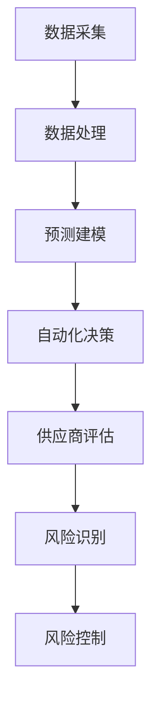

                 

关键词：供应商管理、AI、供应链效率、数据分析、预测建模

> 摘要：本文将探讨如何利用人工智能（AI）技术提升供应链管理中的供应商效率。通过分析AI在采购决策、风险管理和供应商评估等方面的应用，本文提出了一个综合性的供应商管理框架，旨在提高供应链的透明度和响应速度，从而实现供应链的持续优化。

## 1. 背景介绍

供应链管理是现代企业运营的重要组成部分，它涉及到从原材料采购到产品交付给最终用户的整个过程。高效的供应链管理能够显著降低成本、缩短交货时间、提高客户满意度。然而，随着全球化进程的加速和市场环境的日益复杂，传统的供应链管理方法面临越来越多的挑战。

传统的供应链管理通常依赖于人工经验和常规的数据分析方法，这可能导致以下问题：

- 采购决策缺乏数据支持，依赖个人判断，容易导致决策失误。
- 风险管理能力不足，无法及时识别潜在问题。
- 供应商评估缺乏客观标准，容易导致供应商选择失误。

为了解决这些问题，人工智能（AI）技术的引入成为了一种有效的手段。AI通过数据处理、模式识别和自动化决策等能力，可以显著提升供应链管理的效率和准确性。本文将重点讨论AI在供应商管理中的应用，包括采购决策优化、风险管理和供应商评估等方面。

## 2. 核心概念与联系

### 2.1 人工智能在供应链管理中的应用

在供应链管理中，AI的应用主要体现在以下几个方面：

- **数据采集与处理**：AI可以自动化地收集和分析大量供应链数据，包括库存水平、供应商绩效、市场需求等。
- **预测建模**：通过历史数据分析，AI可以预测未来的供应链需求，从而帮助企业提前做好准备。
- **自动化决策**：AI可以基于实时数据分析，自动做出采购、库存调整等决策。

### 2.2 供应商管理中的核心概念

在供应商管理中，以下几个核心概念至关重要：

- **供应商绩效评估**：通过对供应商的交货时间、产品质量、成本控制等方面的评估，确定其绩效水平。
- **风险识别与管理**：识别供应链中的潜在风险，并采取相应措施进行管理，以降低风险对供应链的影响。
- **采购决策优化**：基于数据分析和预测模型，优化采购决策，以降低成本、提高效率。

### 2.3 Mermaid 流程图

以下是一个简化的Mermaid流程图，展示了AI在供应商管理中的关键步骤：



## 3. 核心算法原理 & 具体操作步骤

### 3.1 算法原理概述

AI在供应商管理中的应用，主要依赖于以下核心算法：

- **机器学习算法**：用于数据分析和预测建模，包括回归分析、决策树、神经网络等。
- **优化算法**：用于采购决策优化，包括线性规划、遗传算法等。
- **模式识别算法**：用于风险识别和管理，包括聚类分析、关联规则挖掘等。

### 3.2 算法步骤详解

#### 3.2.1 数据采集与处理

1. **数据来源**：从企业内部系统和外部数据源（如供应商网站、市场调研等）收集相关数据。
2. **数据清洗**：去除重复数据、缺失数据和异常数据，确保数据质量。
3. **数据预处理**：进行数据标准化、归一化等处理，为后续分析做好准备。

#### 3.2.2 预测建模

1. **需求预测**：使用时间序列分析方法，预测未来的市场需求。
2. **供应商绩效评估**：使用回归分析等方法，评估供应商的交货时间、产品质量等绩效指标。
3. **风险预测**：使用聚类分析和关联规则挖掘，识别潜在的供应链风险。

#### 3.2.3 自动化决策

1. **采购策略优化**：使用线性规划等优化算法，确定最优的采购策略。
2. **库存调整**：基于预测结果，自动调整库存水平，以避免库存积压或短缺。
3. **供应商选择**：使用决策树等算法，根据绩效评估结果，选择最合适的供应商。

### 3.3 算法优缺点

#### 优点

- **高效性**：AI算法可以处理大量数据，比人工分析更快。
- **准确性**：基于历史数据的预测和分析，比个人判断更准确。
- **可扩展性**：AI算法可以轻松适应不同的业务场景和数据规模。

#### 缺点

- **数据依赖性**：算法的性能很大程度上取决于数据的质量。
- **算法复杂性**：理解和实施AI算法需要较高的技术门槛。

### 3.4 算法应用领域

AI在供应商管理中的应用非常广泛，包括但不限于以下几个方面：

- **采购决策优化**：通过预测未来的市场需求，帮助企业做出更合理的采购决策。
- **供应商评估与选择**：基于绩效评估和风险预测，选择最合适的供应商。
- **库存管理**：自动调整库存水平，以避免库存积压或短缺。
- **风险管理**：识别和应对潜在的供应链风险，降低风险对业务的影响。

## 4. 数学模型和公式 & 详细讲解 & 举例说明

### 4.1 数学模型构建

在供应商管理中，常用的数学模型包括线性回归模型、决策树模型和聚类分析模型。

#### 4.1.1 线性回归模型

线性回归模型用于预测供应商绩效，其公式如下：

$$
y = \beta_0 + \beta_1x_1 + \beta_2x_2 + ... + \beta_nx_n
$$

其中，$y$ 表示绩效指标，$x_1, x_2, ..., x_n$ 表示影响绩效的因素，$\beta_0, \beta_1, \beta_2, ..., \beta_n$ 表示模型的参数。

#### 4.1.2 决策树模型

决策树模型用于供应商选择，其公式如下：

$$
f(x) = g_0(x) \quad \text{if} \quad x \in R_0 \\
f(x) = g_1(x) \quad \text{if} \quad x \in R_1 \\
\vdots \\
f(x) = g_n(x) \quad \text{if} \quad x \in R_n
$$

其中，$f(x)$ 表示供应商选择结果，$R_0, R_1, ..., R_n$ 表示决策树中的各个分支。

#### 4.1.3 聚类分析模型

聚类分析模型用于风险识别，其公式如下：

$$
C = \{C_1, C_2, ..., C_k\}
$$

其中，$C$ 表示聚类结果，$C_1, C_2, ..., C_k$ 表示不同的风险类别。

### 4.2 公式推导过程

#### 4.2.1 线性回归模型

线性回归模型的推导过程如下：

1. **假设**：假设 $y$ 和 $x_1, x_2, ..., x_n$ 之间存在线性关系。
2. **模型构建**：根据假设，构建线性回归模型。
3. **参数估计**：使用最小二乘法估计模型参数。

#### 4.2.2 决策树模型

决策树模型的推导过程如下：

1. **特征选择**：选择对目标变量影响最大的特征。
2. **递归划分**：根据特征值对数据进行划分，构建决策树。

#### 4.2.3 聚类分析模型

聚类分析模型的推导过程如下：

1. **距离度量**：选择合适的距离度量方法，计算数据点之间的距离。
2. **聚类算法**：使用聚类算法（如K-means算法），将数据点划分为不同的类别。

### 4.3 案例分析与讲解

#### 4.3.1 案例背景

某电子产品制造商需要选择合适的供应商，以保证产品供应的稳定性和成本效益。

#### 4.3.2 模型应用

1. **线性回归模型**：使用线性回归模型预测供应商的绩效，选择绩效最高的供应商。
2. **决策树模型**：使用决策树模型根据供应商的绩效和风险水平，选择最合适的供应商。
3. **聚类分析模型**：使用聚类分析模型识别不同风险类别的供应商，针对性地进行风险管理。

## 5. 项目实践：代码实例和详细解释说明

### 5.1 开发环境搭建

为了实现AI在供应商管理中的应用，需要搭建以下开发环境：

- **Python**：作为主要的编程语言。
- **Pandas**：用于数据操作和处理。
- **Scikit-learn**：用于机器学习模型的构建和应用。
- **Matplotlib**：用于数据可视化和结果展示。

### 5.2 源代码详细实现

以下是一个简单的Python代码实例，演示了如何使用AI技术进行供应商绩效评估。

```python
import pandas as pd
from sklearn.linear_model import LinearRegression
from sklearn.model_selection import train_test_split
from sklearn.metrics import mean_squared_error

# 读取数据
data = pd.read_csv('supplier_data.csv')
X = data[['delivery_time', 'quality', 'cost']]
y = data['performance']

# 数据预处理
X_train, X_test, y_train, y_test = train_test_split(X, y, test_size=0.2, random_state=42)

# 构建线性回归模型
model = LinearRegression()
model.fit(X_train, y_train)

# 预测
y_pred = model.predict(X_test)

# 评估模型
mse = mean_squared_error(y_test, y_pred)
print(f'Mean Squared Error: {mse}')

# 可视化结果
import matplotlib.pyplot as plt

plt.scatter(y_test, y_pred)
plt.xlabel('Actual Performance')
plt.ylabel('Predicted Performance')
plt.title('Performance Prediction')
plt.show()
```

### 5.3 代码解读与分析

上述代码实现了以下步骤：

1. **数据读取**：使用Pandas读取供应商数据。
2. **数据预处理**：将数据分为特征和目标变量，并进行训练集和测试集的划分。
3. **模型构建**：使用Scikit-learn的LinearRegression构建线性回归模型。
4. **模型训练**：使用训练数据进行模型训练。
5. **模型预测**：使用测试数据进行预测。
6. **模型评估**：计算均方误差（MSE）评估模型性能。
7. **可视化结果**：使用Matplotlib绘制实际绩效与预测绩效的散点图。

## 6. 实际应用场景

AI在供应商管理中的应用场景非常广泛，以下是一些典型的应用案例：

- **采购决策优化**：通过AI预测市场需求，帮助企业制定最优的采购策略，降低库存成本。
- **供应商评估与选择**：基于AI评估供应商的绩效和风险，帮助企业选择最合适的供应商，提高供应链稳定性。
- **库存管理**：通过AI自动调整库存水平，避免库存积压或短缺，提高库存周转率。
- **风险管理**：识别和应对潜在的供应链风险，降低供应链中断的风险。

## 7. 工具和资源推荐

### 7.1 学习资源推荐

- **《人工智能：一种现代方法》（Third Edition）**：迈克尔·乔丹、彼得·莫拉维斯基、西蒙·席宾著，全面介绍了人工智能的基础知识和最新进展。
- **《Python数据分析》（Second Edition）**：威利·弗雷塞、布鲁斯·波特金著，详细讲解了Python在数据分析和处理中的应用。

### 7.2 开发工具推荐

- **Jupyter Notebook**：用于数据分析和模型构建的可视化编程环境。
- **TensorFlow**：用于机器学习和深度学习的开源框架。

### 7.3 相关论文推荐

- **“AI in Supply Chain Management: A Survey”**：综述了人工智能在供应链管理中的应用。
- **“A Machine Learning Approach to Supplier Selection in a Dynamic Supply Chain”**：探讨了机器学习在供应商选择中的应用。

## 8. 总结：未来发展趋势与挑战

### 8.1 研究成果总结

AI在供应商管理中已经取得了显著的研究成果，包括采购决策优化、供应商评估、库存管理和风险管理等方面。然而，AI技术的进一步应用仍然面临一些挑战。

### 8.2 未来发展趋势

随着AI技术的不断进步，未来供应商管理中的AI应用将呈现以下发展趋势：

- **智能化决策**：利用深度学习、强化学习等更先进的AI技术，实现更加智能化的决策。
- **协同优化**：通过AI实现供应链各环节的协同优化，提高整体供应链效率。
- **实时监控与预警**：利用实时数据分析，实现供应链的实时监控和预警，提高响应速度。

### 8.3 面临的挑战

AI在供应商管理中的应用仍然面临以下挑战：

- **数据质量**：AI的性能很大程度上取决于数据的质量，因此需要建立完善的数据质量管理机制。
- **算法透明性**：AI算法的透明性是一个重要问题，需要确保算法的可解释性和可靠性。
- **技术门槛**：AI技术的应用需要较高的技术门槛，企业需要培养相关人才。

### 8.4 研究展望

未来，研究应关注以下方向：

- **算法优化**：不断优化AI算法，提高其在供应商管理中的性能。
- **跨学科融合**：结合供应链管理、人工智能、经济学等领域的知识，实现跨学科的融合。
- **应用推广**：推动AI技术在供应商管理中的实际应用，提高供应链的整体效率。

## 9. 附录：常见问题与解答

### 9.1 问题1：AI在供应商管理中的应用有哪些？

**解答**：AI在供应商管理中的应用包括采购决策优化、供应商评估、库存管理和风险管理等方面。

### 9.2 问题2：如何保证AI算法的透明性和可靠性？

**解答**：确保AI算法的透明性和可靠性需要以下措施：

- **算法解释**：对算法的决策过程进行详细解释，使其易于理解和跟踪。
- **数据质量**：确保输入数据的准确性和一致性，提高算法的可靠性。
- **测试验证**：对算法进行充分的测试和验证，确保其性能和可靠性。

### 9.3 问题3：AI技术在供应商管理中的优势是什么？

**解答**：AI技术在供应商管理中的优势包括：

- **高效性**：AI算法可以处理大量数据，比人工分析更快。
- **准确性**：基于历史数据的预测和分析，比个人判断更准确。
- **可扩展性**：AI算法可以轻松适应不同的业务场景和数据规模。

## 作者署名

本文作者：禅与计算机程序设计艺术 / Zen and the Art of Computer Programming。感谢您的阅读！

