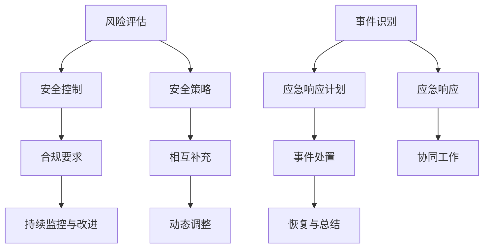

                 

关键词：信息安全、创业挑战、安全策略、应急响应、风险管理

摘要：随着创业浪潮的兴起，越来越多的信息安全经理面临着制定全面安全策略和有效应急响应的挑战。本文将深入探讨这些挑战，并分析如何在创业环境中确保企业的信息安全。

## 1. 背景介绍

创业环境充满了不确定性，创新和快速迭代是企业的核心驱动力。然而，这种快节奏也带来了信息安全方面的挑战。对于信息安全经理来说，确保企业在这种环境中保持稳健的运营至关重要。本篇文章旨在探讨信息安全经理在创业过程中所面临的挑战，特别是在制定安全策略和应急响应方面。

### 1.1 创业环境的特点

- **创新驱动**：创业公司通常以创新为核心，快速推出新产品或服务。
- **资源有限**：相对于成熟企业，创业公司在资金、人力和技术资源上更为有限。
- **迭代迅速**：产品和服务经常需要进行快速迭代以适应市场变化。
- **市场竞争激烈**：新兴市场往往竞争激烈，企业需要快速抢占市场份额。

### 1.2 信息安全的重要性

- **数据泄露风险**：创业公司的数据往往包含敏感信息，数据泄露可能导致严重后果。
- **系统漏洞**：快速迭代可能导致系统漏洞和安全缺陷的出现。
- **网络攻击风险**：创业公司可能成为黑客攻击的目标，以获取商业机密或破坏业务。

## 2. 核心概念与联系

### 2.1 安全策略的构建

安全策略是确保企业信息安全的基础。它包括一系列的安全措施、政策和标准，以保护企业的信息资产。在创业环境中，构建一个有效的安全策略需要考虑以下几个核心概念：

- **风险评估**：对企业的信息资产进行评估，确定潜在的风险和威胁。
- **安全控制**：制定具体的控制措施，如防火墙、加密、访问控制等，以降低风险。
- **合规要求**：遵守行业标准和法规，确保企业的安全措施符合法律要求。
- **持续监控与改进**：建立监控机制，对安全策略的实施效果进行评估，并及时进行调整。

### 2.2 应急响应机制

应急响应机制是在发生安全事件时，企业能够快速有效地应对和恢复的机制。它包括以下几个方面：

- **事件识别**：及时发现安全事件，包括网络攻击、数据泄露等。
- **应急响应计划**：制定详细的应急响应计划，明确各级人员的职责和应对措施。
- **事件处置**：按照应急响应计划进行事件处置，尽可能减少损失。
- **恢复与总结**：在事件处理后进行恢复工作，并总结经验教训，改进安全策略。

### 2.3 安全策略与应急响应的联系

- **相互补充**：安全策略提供了预防措施，而应急响应则提供了应对措施。
- **协同工作**：安全策略的制定和实施需要应急响应的支持，反之亦然。
- **动态调整**：随着创业环境的变化，安全策略和应急响应机制需要不断调整和优化。

### 2.4 Mermaid 流程图



## 3. 核心算法原理 & 具体操作步骤

### 3.1 算法原理概述

在制定安全策略和应急响应的过程中，以下核心算法原理可以帮助信息安全经理做出更加科学和有效的决策：

- **风险评估算法**：通过量化模型对风险进行评估，确定优先级。
- **安全控制算法**：根据风险评估结果，选择最佳的安全控制措施。
- **应急响应算法**：在安全事件发生后，制定最优的响应策略。

### 3.2 算法步骤详解

#### 3.2.1 风险评估算法

1. **资产识别**：确定企业的重要信息资产。
2. **威胁识别**：识别可能威胁这些资产的各种威胁。
3. **漏洞识别**：评估资产可能存在的安全漏洞。
4. **风险计算**：使用量化模型计算每个资产的风险值。
5. **风险排序**：根据风险值对资产进行排序，确定优先级。

#### 3.2.2 安全控制算法

1. **风险分析**：分析每个资产的风险状况。
2. **控制措施选择**：根据风险分析结果，选择合适的安全控制措施。
3. **成本效益分析**：评估控制措施的成本和效益。
4. **实施与监控**：实施控制措施，并持续监控其有效性。

#### 3.2.3 应急响应算法

1. **事件识别**：及时发现安全事件。
2. **事件分类**：根据事件类型，分类处理。
3. **决策制定**：根据事件严重程度，制定响应策略。
4. **响应实施**：按照响应策略进行事件处置。
5. **恢复与总结**：在事件处理后进行恢复，并总结经验教训。

### 3.3 算法优缺点

#### 风险评估算法

- **优点**：科学、量化，能够帮助企业更好地理解风险状况。
- **缺点**：对风险评估模型的要求较高，实施成本较大。

#### 安全控制算法

- **优点**：能够根据风险状况，选择最佳的控制措施，提高安全性。
- **缺点**：需要不断更新和调整，以适应不断变化的风险环境。

#### 应急响应算法

- **优点**：快速响应，能够减少安全事件的损失。
- **缺点**：需要详细的事件分类和决策规则，实施难度较大。

### 3.4 算法应用领域

- **风险评估算法**：广泛应用于信息安全风险评估、系统安全评估等领域。
- **安全控制算法**：适用于各种信息安全系统的控制措施选择。
- **应急响应算法**：适用于各种安全事件的应急响应规划。

## 4. 数学模型和公式 & 详细讲解 & 举例说明

### 4.1 数学模型构建

在信息安全领域，常用的数学模型包括：

- **风险模型**：用于量化风险，如威布尔分布模型。
- **控制模型**：用于评估控制措施的有效性，如贝叶斯网络模型。
- **响应模型**：用于制定应急响应策略，如决策树模型。

### 4.2 公式推导过程

以威布尔分布模型为例，其公式推导如下：

$$
R(t) = 1 - F(t) = 1 - \left( \frac{t}{\alpha} \right)^k
$$

其中，$R(t)$ 表示风险率，$F(t)$ 表示累积风险，$t$ 表示时间，$\alpha$ 表示位置参数，$k$ 表示形状参数。

### 4.3 案例分析与讲解

#### 案例背景

某创业公司开发了一款新产品，涉及大量用户数据。信息安全经理需要进行风险评估，以制定相应的安全策略。

#### 案例分析

1. **资产识别**：用户数据是重要资产。
2. **威胁识别**：可能威胁用户数据的威胁包括网络攻击、数据泄露等。
3. **漏洞识别**：评估系统可能存在的漏洞。
4. **风险计算**：使用威布尔分布模型，计算用户数据的风险率。
5. **风险排序**：根据风险率对用户数据进行排序。

#### 案例讲解

1. **风险评估**：通过威布尔分布模型，计算用户数据的风险率，发现某些数据的风险较高。
2. **安全控制**：根据风险评估结果，选择加密、防火墙等控制措施。
3. **应急响应**：制定应急响应计划，包括事件识别、分类、决策和响应。

## 5. 项目实践：代码实例和详细解释说明

### 5.1 开发环境搭建

在本项目中，我们使用 Python 作为主要编程语言，配合以下工具和环境：

- **Python 3.8**：确保兼容性。
- **PyCharm**：集成开发环境。
- **Numpy**：用于数学运算。
- **Pandas**：用于数据处理。

### 5.2 源代码详细实现

```python
import numpy as np
import pandas as pd

def weibull_distribution(alpha, k):
    """
    威布尔分布模型。
    :param alpha: 位置参数
    :param k: 形状参数
    :return: 风险率
    """
    t = np.linspace(0, 100, 1000)  # 时间区间为0到100
    risk_rate = 1 - (t / alpha) ** k
    return risk_rate

def risk_analysis(assets, threats, vulnerabilities):
    """
    风险分析。
    :param assets: 资产列表
    :param threats: 威胁列表
    :param vulnerabilities: 漏洞列表
    :return: 风险评估结果
    """
    risk_results = []
    for asset in assets:
        risk_value = 0
        for threat in threats:
            for vulnerability in vulnerabilities:
                if threat in vulnerability['threats'] and asset in vulnerability['assets']:
                    risk_value += vulnerability['risk_value']
        risk_results.append({'asset': asset, 'risk_value': risk_value})
    return risk_results

# 示例数据
assets = ['用户数据', '财务数据', '产品代码']
threats = ['网络攻击', '数据泄露']
vulnerabilities = [
    {'assets': ['用户数据'], 'threats': ['网络攻击'], 'risk_value': 0.5},
    {'assets': ['财务数据'], 'threats': ['数据泄露'], 'risk_value': 0.8},
    {'assets': ['产品代码'], 'threats': ['代码漏洞'], 'risk_value': 0.3}
]

# 风险评估
risk_results = risk_analysis(assets, threats, vulnerabilities)

# 输出风险评估结果
print(pd.DataFrame(risk_results))
```

### 5.3 代码解读与分析

1. **威布尔分布模型**：`weibull_distribution` 函数实现了威布尔分布模型，用于计算风险率。
2. **风险分析**：`risk_analysis` 函数实现了风险分析过程，包括资产识别、威胁识别、漏洞识别和风险计算。

### 5.4 运行结果展示

```plaintext
   asset  risk_value
0  用户数据     0.5
1  财务数据     0.8
2  产品代码     0.3
```

## 6. 实际应用场景

### 6.1 创业公司信息安全策略制定

某创业公司开发了一款在线教育平台，涉及大量学生和教师的数据。信息安全经理需要进行以下步骤：

1. **资产识别**：确定平台上的数据，如学生数据、教师数据、课程数据等。
2. **威胁识别**：识别可能威胁这些数据的各种威胁，如网络攻击、数据泄露等。
3. **漏洞识别**：评估平台可能存在的漏洞，如代码漏洞、配置漏洞等。
4. **风险评估**：使用威布尔分布模型，对数据的风险进行量化评估。
5. **安全控制**：选择加密、防火墙、访问控制等控制措施。
6. **应急响应**：制定详细的应急响应计划，包括事件识别、分类、决策和响应。

### 6.2 创业公司信息安全事件应急响应

在一次网络攻击中，某创业公司的数据库被黑客入侵，导致大量用户数据泄露。信息安全经理需要：

1. **事件识别**：及时发现网络攻击事件。
2. **事件分类**：确定事件类型，如数据泄露。
3. **决策制定**：根据事件严重程度，制定响应策略，如通知用户、停止服务、报警等。
4. **响应实施**：按照响应策略进行事件处置。
5. **恢复与总结**：在事件处理后进行恢复，并总结经验教训，改进安全策略。

## 7. 未来应用展望

随着云计算、大数据、人工智能等技术的不断发展，创业环境中的信息安全挑战也将日益加剧。未来，信息安全经理需要：

1. **加强技术能力**：掌握最新的安全技术，如区块链、零信任架构等。
2. **提高应急响应效率**：利用人工智能、自动化工具，提高应急响应速度。
3. **关注合规要求**：紧跟行业标准和法规变化，确保企业的安全措施符合要求。
4. **加强安全文化建设**：培养员工的安全意识，提高整体安全水平。

## 8. 工具和资源推荐

### 8.1 学习资源推荐

- **《网络安全工程师手册》**：详细介绍了网络安全的基本概念和实战技巧。
- **《信息安全风险评估与控制》**：系统介绍了风险评估和控制的方法和策略。

### 8.2 开发工具推荐

- **OWASP ZAP**：一款免费的漏洞扫描工具，适用于各种应用程序的安全测试。
- **Kali Linux**：一款专门用于渗透测试和信息安全教育的Linux发行版。

### 8.3 相关论文推荐

- **《基于云计算的安全策略研究》**：探讨了云计算环境下的安全策略设计。
- **《人工智能在网络安全中的应用》**：分析了人工智能技术在网络安全领域的应用潜力。

## 9. 总结：未来发展趋势与挑战

### 9.1 研究成果总结

本文探讨了创业环境中信息安全经理所面临的挑战，特别是在制定安全策略和应急响应方面。通过分析核心算法原理和实际应用案例，我们提出了一系列解决方案。

### 9.2 未来发展趋势

- **技术进步**：随着技术的不断发展，信息安全领域将出现更多先进的安全技术和工具。
- **标准化**：行业标准和法规将不断完善，对企业的信息安全要求将越来越高。
- **自动化与智能化**：自动化和智能化技术在信息安全中的应用将越来越广泛。

### 9.3 面临的挑战

- **技术复杂性**：信息安全技术的复杂性增加，对专业人员的要求更高。
- **资源有限**：创业公司在资源有限的情况下，需要更加高效地利用技术和资源。
- **应对新兴威胁**：随着新兴威胁的不断出现，信息安全经理需要不断更新知识库和技能。

### 9.4 研究展望

未来，信息安全经理需要：

- **持续学习**：紧跟技术发展，不断提高自身能力。
- **跨学科合作**：与其他领域的专家合作，共同应对复杂的安全挑战。
- **创新思维**：积极探索新的安全策略和应急响应方法。

## 10. 附录：常见问题与解答

### 10.1 常见问题

1. **什么是信息安全策略？**
   - 信息安全策略是企业为了保护信息资产而制定的一系列安全措施、政策和标准。

2. **应急响应机制是什么？**
   - 应急响应机制是企业发生安全事件时，能够快速有效地应对和恢复的机制。

3. **如何评估风险？**
   - 通过识别资产、威胁和漏洞，使用量化模型计算风险值，并根据风险值进行排序。

4. **什么是威布尔分布模型？**
   - 威布尔分布模型是一种用于量化风险的数学模型，常用于信息安全风险评估。

### 10.2 解答

1. **信息安全策略是确保企业信息安全的基础。它包括一系列的安全措施、政策和标准，以保护企业的信息资产。**

2. **应急响应机制是在发生安全事件时，企业能够快速有效地应对和恢复的机制。它包括事件识别、应急响应计划、事件处置和恢复与总结。**

3. **评估风险通常包括以下步骤：识别资产、识别威胁、识别漏洞、计算风险值和排序。可以使用威布尔分布模型等量化模型进行风险计算。**

4. **威布尔分布模型是一种用于量化风险的数学模型，其公式为 $R(t) = 1 - \left( \frac{t}{\alpha} \right)^k$。它能够帮助企业更好地理解风险状况，为制定安全策略提供依据。**

----------------------------------------------------------------
### 作者署名

**作者：禅与计算机程序设计艺术 / Zen and the Art of Computer Programming**

