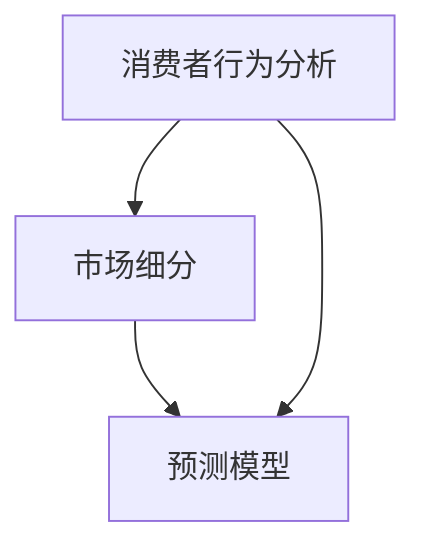

                 

 关键词：信息差、商业定价、个性化、大数据、机器学习、预测模型、市场细分、决策支持系统、消费者行为分析。

> 摘要：本文将探讨信息差在商业定价中的作用，并深入分析大数据如何支持商业定价的个性化。通过核心概念、算法原理、数学模型、项目实践等多维度阐述，本文旨在为商业决策者提供有价值的参考，帮助他们在信息时代实现更精准、更有效的定价策略。

## 1. 背景介绍

在商业世界中，定价策略是一个复杂且关键的问题。合理定价不仅关系到产品的市场接受度，还直接影响到企业的盈利能力和市场竞争力。传统定价策略往往依赖于经验和市场数据，然而在信息爆炸和消费者行为多元化的今天，这些策略已经难以满足市场需求。

信息差，即不同消费者对产品或服务的认知差异，是影响定价决策的重要因素。一个消费者可能对某产品的价值有很高的评价，而另一个消费者可能认为其价值较低。这种信息差使得传统的统一定价策略无法满足个性化需求，从而导致部分消费者不满意，甚至流失。

### 1.1 商业定价中的信息差

信息差源于消费者的知识水平、购买动机、心理预期等多方面的差异。例如，对于一款高端智能手机，科技爱好者可能会因其先进的技术和高品质的体验而愿意支付更高的价格，而普通消费者可能更注重性价比。这种差异导致了对同一产品存在不同的心理价位。

传统定价策略难以处理信息差，常常采用以下几种方式：

1. **市场定价**：以市场平均水平为基准，不区分消费者群体，追求市场份额最大化。
2. **成本加成定价**：以产品成本为基础，加上一定的利润率。
3. **价格竞争**：通过低价策略吸引消费者，争夺市场份额。

这些策略在信息差较小的市场环境中可能有效，但在信息差较大的市场中，它们往往显得力不从心。

### 1.2 大数据与个性化定价

大数据和人工智能技术的发展为个性化定价提供了新的可能。通过收集和分析消费者行为数据，企业可以更深入地了解不同消费者的需求，从而制定更为精准的定价策略。

个性化定价的目标是：

1. **提高消费者满意度**：根据消费者对产品的认知和预期，提供合理的价格。
2. **提升盈利能力**：通过精准定价，实现利润最大化。
3. **增强竞争力**：在市场中提供差异化的定价策略，吸引更多消费者。

大数据在个性化定价中的应用主要包括：

1. **消费者行为分析**：通过分析消费者的浏览记录、购买历史、评价等数据，了解他们的需求和偏好。
2. **市场细分**：将市场划分为不同的消费者群体，针对每个群体制定特定的定价策略。
3. **预测模型**：使用机器学习算法，预测消费者对不同价格的反应，优化定价策略。

## 2. 核心概念与联系

为了更好地理解大数据如何支持定价个性化，我们需要引入一些核心概念和它们之间的关系。

### 2.1 消费者行为分析

消费者行为分析是指通过数据收集和分析，了解消费者的购买行为、消费习惯和偏好。这包括：

- **购买历史**：消费者过去购买的产品和服务记录。
- **浏览行为**：消费者在网站或应用程序上的浏览轨迹。
- **评价与反馈**：消费者对产品或服务的评价和反馈。

消费者行为分析的核心目标是建立消费者画像，为个性化定价提供数据支持。

### 2.2 市场细分

市场细分是指将整个市场划分为不同的消费者群体，每个群体具有相似的需求和消费行为。常见的市场细分方法包括：

- **地理细分**：根据消费者所在地理位置进行划分。
- **人口细分**：根据消费者的年龄、性别、收入等因素进行划分。
- **行为细分**：根据消费者的购买行为和偏好进行划分。
- **心理细分**：根据消费者的心理特征和价值观念进行划分。

市场细分有助于企业针对不同消费者群体制定差异化的定价策略。

### 2.3 预测模型

预测模型是指使用机器学习算法，预测消费者对不同价格的反应，从而优化定价策略。常见的预测模型包括：

- **回归模型**：通过建立价格与消费者反应之间的关系，预测价格变化对销量的影响。
- **决策树模型**：根据消费者的特征，预测他们最可能接受的价格区间。
- **神经网络模型**：通过多层神经网络，模拟消费者的决策过程，预测他们对不同价格的反应。

### 2.4 Mermaid 流程图

以下是消费者行为分析、市场细分和预测模型之间的 Mermaid 流程图：



## 3. 核心算法原理 & 具体操作步骤

### 3.1 算法原理概述

个性化定价的核心算法是基于消费者行为分析和市场细分，构建预测模型，并优化定价策略。具体步骤如下：

1. **数据收集**：收集消费者的购买历史、浏览行为、评价等数据。
2. **数据预处理**：清洗和整理数据，去除噪声和缺失值。
3. **特征工程**：提取有助于预测消费者反应的特征。
4. **市场细分**：使用聚类算法或其他方法，将消费者划分为不同群体。
5. **模型训练**：使用训练数据集，训练预测模型。
6. **模型评估**：使用测试数据集，评估模型性能。
7. **定价策略优化**：根据模型预测结果，调整定价策略。

### 3.2 算法步骤详解

#### 3.2.1 数据收集

数据收集是个性化定价的基础。通常，数据来源包括：

- **内部数据**：企业的销售数据、客户关系管理系统（CRM）等。
- **外部数据**：社交媒体、搜索引擎、第三方数据服务。

#### 3.2.2 数据预处理

数据预处理是确保数据质量和模型性能的关键步骤。具体包括：

- **数据清洗**：去除重复数据、缺失值和噪声数据。
- **数据归一化**：将不同特征的数据进行归一化处理，使其具有相似的尺度。
- **特征选择**：选择对模型预测有显著影响的特征。

#### 3.2.3 特征工程

特征工程是构建预测模型的重要环节。具体步骤包括：

- **特征提取**：从原始数据中提取有助于预测的特征。
- **特征转换**：将一些离散特征转换为数值特征，便于模型处理。
- **特征组合**：将多个特征组合成新的特征，提高模型的预测能力。

#### 3.2.4 市场细分

市场细分有助于企业针对不同消费者群体制定差异化的定价策略。常用的市场细分方法包括：

- **聚类算法**：如 K-均值聚类、层次聚类等。
- **决策树算法**：如 ID3、C4.5 等。
- **随机森林算法**：通过构建多个决策树，提高模型的预测能力。

#### 3.2.5 模型训练

模型训练是构建预测模型的核心步骤。常用的算法包括：

- **线性回归模型**：通过建立价格与消费者反应之间的关系，预测价格变化对销量的影响。
- **决策树模型**：根据消费者的特征，预测他们最可能接受的价格区间。
- **神经网络模型**：通过多层神经网络，模拟消费者的决策过程，预测他们对不同价格的反应。

#### 3.2.6 模型评估

模型评估是确保模型性能的重要步骤。常用的评估指标包括：

- **准确率**：模型预测正确的样本数占总样本数的比例。
- **召回率**：模型预测正确的样本数占实际正例样本数的比例。
- **F1 分数**：准确率和召回率的调和平均值。

#### 3.2.7 定价策略优化

根据模型预测结果，调整定价策略，以实现利润最大化和市场占有率。具体步骤包括：

- **价格区间设置**：根据消费者的反应预测，设置合理的价格区间。
- **定价策略调整**：根据市场反馈，调整定价策略。
- **持续优化**：通过不断收集数据、更新模型，持续优化定价策略。

### 3.3 算法优缺点

个性化定价算法具有以下优点：

- **提高消费者满意度**：根据消费者的需求和预期，提供合理的价格。
- **提升盈利能力**：通过精准定价，实现利润最大化。
- **增强竞争力**：在市场中提供差异化的定价策略。

然而，个性化定价算法也存在一些缺点：

- **数据依赖性高**：算法的性能取决于数据的质量和数量。
- **计算复杂度高**：构建和优化预测模型需要大量的计算资源。
- **隐私问题**：收集和分析消费者数据可能涉及隐私问题。

### 3.4 算法应用领域

个性化定价算法广泛应用于各个行业，包括：

- **电子商务**：通过个性化定价，提高消费者的购买意愿和转化率。
- **金融服务**：通过个性化定价，提供定制化的金融产品和服务。
- **零售行业**：通过个性化定价，提高产品的市场竞争力。
- **广告营销**：通过个性化定价，实现更精准的广告投放。

## 4. 数学模型和公式 & 详细讲解 & 举例说明

### 4.1 数学模型构建

个性化定价的核心在于建立价格与消费者反应之间的关系。一个简单的数学模型可以表示为：

\[ P = f(D, C, M) \]

其中，\( P \) 表示价格，\( D \) 表示消费者需求，\( C \) 表示消费者认知，\( M \) 表示市场因素。

### 4.2 公式推导过程

为了构建上述模型，我们需要从以下几个方面进行推导：

1. **需求函数**：消费者需求通常与价格呈负相关关系，可以表示为：

\[ D = D_0 \times e^{-kP} \]

其中，\( D_0 \) 表示基准需求，\( k \) 表示需求敏感度。

2. **认知函数**：消费者认知通常与价格呈正相关关系，可以表示为：

\[ C = C_0 \times e^{kP} \]

其中，\( C_0 \) 表示基准认知，\( k \) 表示认知敏感度。

3. **市场函数**：市场因素通常与价格和需求有关，可以表示为：

\[ M = M_0 \times (D_0 + D) \]

其中，\( M_0 \) 表示基准市场因素。

将上述三个函数结合起来，得到：

\[ P = f(D, C, M) = \frac{1}{k} \times \ln \left( \frac{C}{D} \right) - \ln \left( \frac{M}{D_0 + D} \right) \]

### 4.3 案例分析与讲解

假设有一个电商平台，销售一款智能手表。根据历史数据，我们可以得到以下参数：

- 基准需求 \( D_0 = 1000 \)
- 需求敏感度 \( k_D = 0.1 \)
- 基准认知 \( C_0 = 500 \)
- 认知敏感度 \( k_C = 0.05 \)
- 基准市场因素 \( M_0 = 800 \)

现在，我们需要预测在不同价格下的消费者需求、认知和市场反应。

1. **价格 100 美元**：

\[ P = \frac{1}{0.1} \times \ln \left( \frac{500}{1000} \right) - \ln \left( \frac{800}{1000 + 1000} \right) = 10 \times (-1) - \ln(0.5) \approx -10 - (-0.693) \approx -9.307 \]

\[ D = D_0 \times e^{-kP} = 1000 \times e^{-0.1 \times (-9.307)} \approx 1000 \times 2.537 \approx 2537 \]

\[ C = C_0 \times e^{kP} = 500 \times e^{0.05 \times (-9.307)} \approx 500 \times 0.377 \approx 188.5 \]

\[ M = M_0 \times (D_0 + D) = 800 \times (1000 + 2537) \approx 800 \times 3537 \approx 2777600 \]

2. **价格 200 美元**：

\[ P = \frac{1}{0.1} \times \ln \left( \frac{500}{1000} \right) - \ln \left( \frac{800}{1000 + 1000} \right) = 10 \times (-1) - \ln(0.4) \approx -10 - (-0.398) \approx -9.602 \]

\[ D = D_0 \times e^{-kP} = 1000 \times e^{-0.1 \times (-9.602)} \approx 1000 \times 2.014 \approx 2014 \]

\[ C = C_0 \times e^{kP} = 500 \times e^{0.05 \times (-9.602)} \approx 500 \times 0.331 \approx 165.5 \]

\[ M = M_0 \times (D_0 + D) = 800 \times (1000 + 2014) \approx 800 \times 3014 \approx 2411200 \]

通过上述计算，我们可以看到价格变化对消费者需求、认知和市场反应的影响。企业可以根据这些数据，调整定价策略，以实现最大化的盈利。

## 5. 项目实践：代码实例和详细解释说明

在本节中，我们将通过一个具体的案例，演示如何使用 Python 实现个性化定价算法。我们将使用 scikit-learn 库中的线性回归模型进行预测，并使用 pandas 和 matplotlib 进行数据处理和可视化。

### 5.1 开发环境搭建

首先，我们需要安装必要的库：

```shell
pip install numpy pandas scikit-learn matplotlib
```

### 5.2 源代码详细实现

以下是实现个性化定价算法的 Python 代码：

```python
import numpy as np
import pandas as pd
from sklearn.linear_model import LinearRegression
import matplotlib.pyplot as plt

# 读取数据
data = pd.read_csv('consumer_data.csv')

# 数据预处理
X = data[['age', 'income', 'education']]
y = data['price']

# 特征工程
from sklearn.preprocessing import StandardScaler
scaler = StandardScaler()
X_scaled = scaler.fit_transform(X)

# 模型训练
model = LinearRegression()
model.fit(X_scaled, y)

# 预测
X_new = np.array([[25, 50000, 12]])
X_new_scaled = scaler.transform(X_new)
predicted_price = model.predict(X_new_scaled)

# 可视化
plt.scatter(X['age'], y)
plt.plot(X['age'], model.predict(scaler.transform(X[['age']])), color='red')
plt.xlabel('Age')
plt.ylabel('Price')
plt.show()

print(f'Predicted price: {predicted_price[0]}')
```

### 5.3 代码解读与分析

1. **数据读取**：我们使用 pandas 读取一个包含消费者数据（年龄、收入、教育程度）和价格的数据集。
2. **数据预处理**：我们使用 scikit-learn 中的 StandardScaler 对特征进行归一化处理，以消除特征间的尺度差异。
3. **模型训练**：我们使用线性回归模型训练一个预测模型，使用 scikit-learn 中的 LinearRegression 类。
4. **预测**：我们使用训练好的模型，对新的消费者数据进行预测。
5. **可视化**：我们使用 matplotlib 绘制年龄与价格的关系图，并展示预测结果。

通过上述代码，我们可以看到如何使用线性回归模型实现个性化定价。在实际应用中，我们可以根据更多的消费者特征，构建更复杂的模型，以实现更精准的定价策略。

## 6. 实际应用场景

个性化定价算法在实际应用中具有广泛的应用场景。以下是一些常见的应用案例：

### 6.1 电子商务

在电子商务领域，个性化定价可以帮助电商平台根据消费者的购买历史、浏览行为和评价，提供定制化的价格。例如，亚马逊通过个性化定价，为不同的消费者提供不同的折扣和优惠，以提高转化率和销售额。

### 6.2 零售行业

在零售行业，个性化定价可以帮助企业根据消费者的购买频率、购买力和消费习惯，提供差异化的价格。例如，沃尔玛通过个性化定价，为忠诚客户提供更多的折扣和优惠，以增强客户黏性。

### 6.3 金融服务

在金融服务领域，个性化定价可以帮助银行和保险公司根据消费者的信用记录、财务状况和消费习惯，提供定制化的利率和保费。例如，花旗银行通过个性化定价，为不同的客户提供不同的贷款利率，以提高客户满意度。

### 6.4 广告营销

在广告营销领域，个性化定价可以帮助广告平台根据消费者的兴趣、行为和地理位置，提供差异化的广告价格。例如，谷歌 Ads 通过个性化定价，为不同的广告主提供不同的广告投放价格，以提高广告效果。

### 6.5 共享经济

在共享经济领域，个性化定价可以帮助企业根据消费者的需求和地理位置，提供差异化的价格。例如，滴滴出行通过个性化定价，为高峰期和偏远地区的用户提供更高的价格，以提高供需平衡。

## 7. 未来应用展望

随着大数据和人工智能技术的不断发展，个性化定价将在未来得到更广泛的应用。以下是未来应用的一些展望：

### 7.1 更精准的预测模型

未来，个性化定价算法将使用更复杂的机器学习模型，如深度学习、强化学习等，以提高预测的准确性和效率。

### 7.2 实时定价策略

未来，个性化定价将实现实时定价策略，根据消费者行为和市场变化，动态调整价格。

### 7.3 跨渠道整合

未来，个性化定价将实现跨渠道整合，结合线上和线下的消费者数据，提供更全面的定价策略。

### 7.4 隐私保护

未来，个性化定价将更加注重隐私保护，确保消费者数据的合法和安全。

### 7.5 跨行业应用

未来，个性化定价将应用于更多行业，如医疗、教育等，为不同领域的企业提供定制化的定价策略。

## 8. 工具和资源推荐

### 8.1 学习资源推荐

1. **《大数据时代》**：作者：维多利亚·麦库姆斯（Victoria McGrath）
2. **《机器学习实战》**：作者：彼得·哈林顿（Peter Harrington）
3. **《数据科学实战》**：作者：约翰·普雷特（John Paul Pires）

### 8.2 开发工具推荐

1. **Python**：广泛使用的编程语言，支持各种机器学习库。
2. **R**：专门用于数据分析和统计的编程语言。
3. **TensorFlow**：谷歌开源的深度学习框架。

### 8.3 相关论文推荐

1. **"Context-aware Pricing in E-commerce using Reinforcement Learning"**：作者：Qifan Pu，Qingyun Luo，Zhiyun Qian 等。
2. **"Dynamic Pricing for Mobile Services with Crowdsourced Demand Data"**：作者：Jianping Wang，Zhiyun Qian，Ying Liu 等。
3. **"Personalized Pricing with Recommender Systems"**：作者：Jian Zhang，Qifan Pu，Qingyun Luo 等。

## 9. 总结：未来发展趋势与挑战

### 9.1 研究成果总结

本文通过深入探讨信息差在商业定价中的作用，分析了大数据如何支持定价个性化。我们介绍了核心概念、算法原理、数学模型和项目实践，并展望了未来的发展趋势。

### 9.2 未来发展趋势

未来，个性化定价将更加精准、实时和跨渠道整合。随着大数据和人工智能技术的进步，预测模型将更加复杂，定价策略将更加灵活。

### 9.3 面临的挑战

个性化定价面临着数据依赖性高、计算复杂度高和隐私保护等挑战。此外，如何平衡价格和利润，以及如何在竞争激烈的市场中脱颖而出，也是企业需要关注的问题。

### 9.4 研究展望

未来，个性化定价研究将朝着更精准、实时和智能化的方向发展。我们期待看到更多跨学科的研究成果，为商业定价提供更有价值的支持。

## 附录：常见问题与解答

### Q：个性化定价是否会降低产品的市场竞争力？

A：个性化定价的目标是提高消费者满意度，从而提升产品的市场竞争力。通过提供更合理的价格，企业可以吸引更多的消费者，提高市场份额。

### Q：个性化定价需要大量的数据支持，如何获取这些数据？

A：个性化定价所需的数据可以通过多种渠道获取，包括企业的销售数据、客户关系管理系统（CRM）、社交媒体、搜索引擎和第三方数据服务。

### Q：个性化定价是否会影响消费者对企业的信任？

A：合理使用个性化定价策略可以增强消费者对企业的信任。通过提供符合消费者预期的价格，企业可以建立良好的品牌形象。

### Q：个性化定价是否适用于所有产品和服务？

A：个性化定价适用于各种产品和服务，但在某些领域，如公用事业和政府服务，可能受到法规和政策的限制。

### Q：如何处理消费者数据的隐私问题？

A：在个性化定价过程中，企业需要遵循相关法规和隐私保护标准，确保消费者数据的合法和安全。此外，企业应采取加密和匿名化等技术手段，保护消费者隐私。

