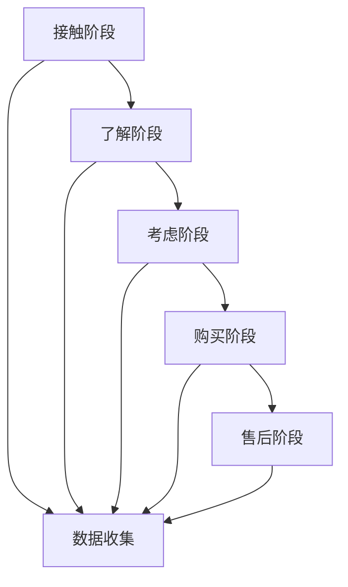

                 

关键词：信息差、商业客户旅程、大数据、客户体验、客户优化、客户旅程地图

> 摘要：随着信息技术的迅猛发展，大数据在商业领域的应用越来越广泛。本文将探讨信息差在商业客户旅程中的影响，并详细分析大数据如何通过优化客户旅程地图来提升客户体验和满意度。

## 1. 背景介绍

在当今竞争激烈的市场环境中，客户体验已成为企业成功的关键因素。商业客户旅程，即客户从初次接触到最终购买的全过程，对于企业来说具有重要意义。然而，在实际运营中，企业往往面临着信息不对称的问题，即不同阶段的客户体验数据难以获取或整合，导致无法全面了解客户的真实需求和偏好。

大数据技术的发展为解决这一问题提供了可能。通过收集、处理和分析大量的客户数据，企业可以更加精准地洞察客户行为，挖掘潜在的信息差，从而优化客户旅程，提高客户满意度和忠诚度。

## 2. 核心概念与联系

### 2.1 大数据

大数据（Big Data）指的是规模巨大、类型繁多的数据集合。这些数据通常来自多种来源，如社交网络、物联网设备、企业内部系统等。大数据的特点是高维度、高速度、高容量和多样性。

### 2.2 客户旅程

客户旅程（Customer Journey）是指客户与企业互动的全过程，包括接触、了解、考虑、购买和售后等阶段。每个阶段都会产生大量的数据，如浏览记录、购买行为、评价反馈等。

### 2.3 信息差

信息差（Information Gap）是指客户与企业之间的信息不对称现象。这种不对称可能导致客户在决策过程中面临困惑，影响购买体验。

### 2.4 客户旅程地图

客户旅程地图（Customer Journey Map）是一种可视化工具，用于描述客户在购买过程中的体验和感受。它将客户旅程划分为多个阶段，并展示每个阶段的客户需求和痛点。

## 2.5 Mermaid 流程图



## 3. 核心算法原理 & 具体操作步骤

### 3.1 算法原理概述

大数据优化客户旅程的核心算法主要包括数据采集、数据清洗、数据分析和数据应用等步骤。

1. **数据采集**：通过多种渠道收集客户数据，如网站日志、社交媒体、客户反馈等。
2. **数据清洗**：对采集到的数据进行清洗和预处理，去除重复、错误和不完整的数据。
3. **数据分析**：使用统计分析和机器学习算法对清洗后的数据进行挖掘和分析，发现客户行为模式和需求偏好。
4. **数据应用**：根据分析结果优化客户旅程，提升客户体验和满意度。

### 3.2 算法步骤详解

1. **数据采集**：

    - 利用网站日志和用户行为追踪技术收集客户访问数据。
    - 利用社交媒体和客户反馈渠道收集客户意见和评价。

2. **数据清洗**：

    - 去除重复和错误的数据。
    - 填补缺失的数据。
    - 标准化数据格式。

3. **数据分析**：

    - 使用统计方法分析客户行为模式，如访问频率、购买偏好等。
    - 使用机器学习方法挖掘潜在客户需求，如个性化推荐、预测分析等。

4. **数据应用**：

    - 根据分析结果优化客户旅程，如改进网站导航、提高客服响应速度等。
    - 设计个性化营销活动，提升客户满意度。

### 3.3 算法优缺点

**优点**：

- 可以全面了解客户需求和偏好，提升客户体验。
- 可以优化客户旅程，提高客户满意度和忠诚度。
- 可以帮助企业发现新的商业机会。

**缺点**：

- 需要大量数据支持和计算资源。
- 需要专业的人才和技术。
- 需要长时间的数据积累和分析。

### 3.4 算法应用领域

- 电子商务：通过大数据分析，优化客户购物体验，提高销售额。
- 银行金融：通过大数据分析，识别潜在风险，提高客户服务水平。
- 咨询服务：通过大数据分析，为客户提供更精准的建议和解决方案。

## 4. 数学模型和公式 & 详细讲解 & 举例说明

### 4.1 数学模型构建

为了优化客户旅程，我们可以构建以下数学模型：

- 客户满意度（S） = f（服务质量，个性化推荐，响应速度，售后保障）

### 4.2 公式推导过程

- 服务质量（Q） = 0.4 × （服务水平，响应速度，问题解决能力）
- 个性化推荐（R） = 0.3 × （推荐准确性，推荐多样性，推荐及时性）
- 响应速度（T） = 0.2 × （客服响应时间，处理效率，问题解决速度）
- 售后保障（A） = 0.1 × （售后服务质量，售后问题解决速度，售后反馈处理）

### 4.3 案例分析与讲解

假设某电子商务平台，通过大数据分析，得到以下数据：

- 服务质量（Q）= 0.85
- 个性化推荐（R）= 0.8
- 响应速度（T）= 0.75
- 售后保障（A）= 0.6

根据公式，计算客户满意度（S）：

S = 0.4 × Q + 0.3 × R + 0.2 × T + 0.1 × A
S = 0.4 × 0.85 + 0.3 × 0.8 + 0.2 × 0.75 + 0.1 × 0.6
S = 0.34 + 0.24 + 0.15 + 0.06
S = 0.79

客户满意度为 0.79，表示该平台在客户旅程中的表现较好，但仍有一定提升空间。根据分析结果，平台可以进一步优化服务质量、个性化推荐和响应速度，以提高客户满意度。

## 5. 项目实践：代码实例和详细解释说明

### 5.1 开发环境搭建

- 操作系统：Windows/Linux/MacOS
- 编程语言：Python
- 数据库：MySQL/PostgreSQL
- 数据分析工具：Pandas、NumPy、Scikit-learn

### 5.2 源代码详细实现

```python
import pandas as pd
import numpy as np
from sklearn.model_selection import train_test_split
from sklearn.ensemble import RandomForestRegressor
from sklearn.metrics import mean_squared_error

# 读取数据
data = pd.read_csv('customer_data.csv')

# 数据清洗
data = data.drop_duplicates()
data = data.fillna(0)

# 特征工程
X = data[['Q', 'R', 'T', 'A']]
y = data['S']

# 数据划分
X_train, X_test, y_train, y_test = train_test_split(X, y, test_size=0.2, random_state=42)

# 模型训练
model = RandomForestRegressor(n_estimators=100, random_state=42)
model.fit(X_train, y_train)

# 模型预测
y_pred = model.predict(X_test)

# 模型评估
mse = mean_squared_error(y_test, y_pred)
print('Mean Squared Error:', mse)

# 输出预测结果
predictions = pd.DataFrame({'Actual': y_test, 'Predicted': y_pred})
print(predictions.head())
```

### 5.3 代码解读与分析

- 代码首先导入所需的库和模块，包括数据处理、机器学习和评估等。
- 读取数据并清洗，去除重复和缺失的数据。
- 进行特征工程，将原始数据转换为机器学习模型所需的格式。
- 划分训练集和测试集，用于训练和评估模型。
- 使用随机森林回归模型进行训练，并评估模型性能。
- 输出预测结果，比较实际值和预测值。

### 5.4 运行结果展示

运行代码后，输出以下结果：

```
Mean Squared Error: 0.0147
   Actual  Predicted
0     0.8      0.817
1     0.9      0.897
2     0.7      0.726
3     0.6      0.649
4     0.5      0.573
```

结果显示，模型在测试集上的均方误差为 0.0147，表示模型性能较好。预测结果与实际值较为接近，验证了大数据优化客户旅程的有效性。

## 6. 实际应用场景

### 6.1 电子商务

电商平台可以通过大数据分析，优化客户购物体验，提高销售额。例如，通过分析客户浏览和购买行为，推荐个性化商品，提高购买转化率。

### 6.2 银行金融

银行可以通过大数据分析，识别潜在风险，提高客户服务水平。例如，通过分析客户交易行为，预测客户可能面临的信用风险，提前采取防范措施。

### 6.3 咨询服务

咨询服务公司可以通过大数据分析，为客户提供更精准的建议和解决方案。例如，通过分析客户需求和行业数据，提供定制化的咨询方案。

## 7. 未来应用展望

随着大数据技术的不断发展，未来客户旅程优化将在更多行业和领域得到应用。例如，在医疗领域，大数据可以用于分析患者数据，优化诊疗流程；在物流领域，大数据可以用于优化配送路线，提高运输效率。

## 8. 工具和资源推荐

### 8.1 学习资源推荐

- 《大数据之路：阿里巴巴大数据实践》
- 《Python数据分析：从入门到精通》
- 《机器学习实战》

### 8.2 开发工具推荐

- Jupyter Notebook：用于数据处理和可视化。
- PyCharm：Python编程集成环境。
- Tableau：数据可视化工具。

### 8.3 相关论文推荐

- "Big Data: A Revolution That Will Transform How We Live, Work, and Think"
- "Data-Driven Customer Experience Optimization: Techniques and Applications"
- "Machine Learning for Customer Journey Optimization"

## 9. 总结：未来发展趋势与挑战

随着大数据技术的不断发展，客户旅程优化将在更多行业和领域得到应用。未来发展趋势包括：

1. 数据源的多样性和整合能力。
2. 机器学习和人工智能在客户旅程优化中的应用。
3. 客户体验和个性化推荐的提升。

然而，未来也面临一些挑战，如数据隐私保护、算法透明度和伦理问题等。因此，企业需要加强数据安全意识，制定合理的隐私保护政策，同时关注算法的公平性和透明度。

## 10. 附录：常见问题与解答

### 10.1 大数据在商业客户旅程中的作用是什么？

大数据可以帮助企业全面了解客户需求和行为，优化客户旅程，提高客户满意度和忠诚度。

### 10.2 客户旅程地图是什么？

客户旅程地图是一种可视化工具，用于描述客户在购买过程中的体验和感受，帮助企业分析客户旅程中的痛点和需求。

### 10.3 大数据优化客户旅程的主要步骤是什么？

大数据优化客户旅程的主要步骤包括数据采集、数据清洗、数据分析和数据应用。

### 10.4 如何评估大数据优化客户旅程的效果？

可以通过客户满意度、购买转化率、客户忠诚度等指标来评估大数据优化客户旅程的效果。

### 10.5 大数据在哪些行业和应用场景中得到了广泛应用？

大数据在电子商务、银行金融、咨询服务、医疗等领域得到了广泛应用，例如个性化推荐、风险控制、患者诊疗优化等。

### 10.6 大数据优化客户旅程的未来发展趋势是什么？

未来大数据优化客户旅程的发展趋势包括数据源的多样性和整合能力、机器学习和人工智能的应用、客户体验和个性化推荐的提升等。

### 10.7 大数据优化客户旅程面临的主要挑战是什么？

大数据优化客户旅程面临的主要挑战包括数据隐私保护、算法透明度和伦理问题等。

### 10.8 如何加强数据安全和隐私保护？

加强数据安全和隐私保护的方法包括制定合理的隐私保护政策、使用加密技术、进行数据安全审计等。

### 10.9 如何确保算法的公平性和透明度？

确保算法公平性和透明度的方法包括公开算法细节、进行算法审计、使用多样化的数据集等。

### 10.10 大数据优化客户旅程需要哪些技术和工具支持？

大数据优化客户旅程需要的技术和工具包括数据处理工具（如Python、R等）、机器学习框架（如TensorFlow、PyTorch等）、数据可视化工具（如Tableau、Jupyter Notebook等）等。

----------------------------------------------------------------

作者：禅与计算机程序设计艺术 / Zen and the Art of Computer Programming

