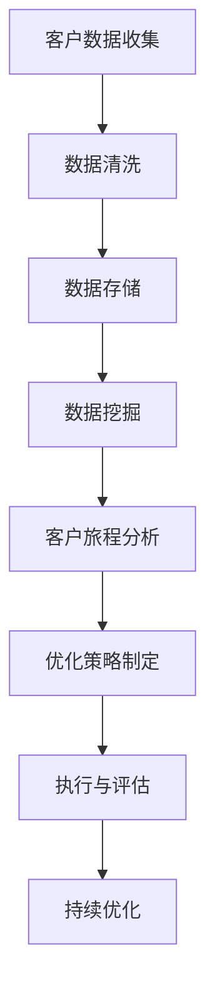

                 

关键词：大数据、客户旅程、优化、信息差、数据分析、用户体验、营销策略

摘要：随着大数据技术的飞速发展，企业能够获取和分析的用户数据越来越多。如何利用这些数据优化客户旅程，提升用户体验和营销效果，成为企业竞争的关键。本文将探讨大数据在客户旅程优化中的应用，分析信息差对于客户旅程的影响，并提供具体的优化策略和案例。

## 1. 背景介绍

在现代商业环境中，客户旅程（Customer Journey）指的是客户在购买过程中所经历的一系列步骤和互动。随着互联网和社交媒体的普及，客户旅程变得更加复杂，不仅包括传统的线下购物，还涵盖了线上搜索、社交媒体互动、电子邮件营销等多个环节。企业为了提高销售额和客户满意度，不断寻求优化客户旅程的方法。

### 1.1 大数据在商业中的应用

大数据（Big Data）指的是规模巨大、类型繁多的数据集合，这些数据包括结构化数据、半结构化数据和非结构化数据。大数据技术在商业中的应用日益广泛，可以帮助企业更深入地了解客户需求，优化业务流程，提升营销效果。

### 1.2 信息差的重要性

信息差是指客户在购买过程中所掌握的信息量与企业在销售过程中所掌握的信息量之间的差距。信息差的存在可能导致客户决策迟疑，影响购买体验。因此，如何缩小信息差，提升客户信任度，成为企业的重要课题。

## 2. 核心概念与联系

### 2.1 大数据与客户旅程的关系

大数据与客户旅程紧密相关，通过分析海量数据，企业可以了解客户的偏好、行为习惯和购买路径，从而优化客户旅程的各个环节。

### 2.2 信息差对客户旅程的影响

信息差会影响客户的购买决策，企业需要通过多种渠道提供丰富、准确的信息，缩小信息差，提升客户满意度。

### 2.3 Mermaid 流程图



## 3. 核心算法原理 & 具体操作步骤

### 3.1 算法原理概述

本文将介绍一种基于大数据的客户旅程优化算法，该算法通过数据挖掘和分析，识别出客户在购买过程中的关键节点，从而制定出针对性的优化策略。

### 3.2 算法步骤详解

#### 3.2.1 数据收集与清洗

首先，企业需要收集客户的购买行为数据、搜索记录、社交媒体互动等数据。然后，对数据进行清洗，去除无效数据和重复数据。

#### 3.2.2 数据存储

将清洗后的数据存储在数据库中，以便后续分析。

#### 3.2.3 数据挖掘

使用数据挖掘算法，分析客户数据，识别出客户在购买过程中的关键节点，如浏览页面、加入购物车、提交订单等。

#### 3.2.4 客户旅程分析

根据挖掘出的关键节点，分析客户在各个节点上的行为特征，如浏览时间、页面跳转率、转化率等。

#### 3.2.5 优化策略制定

根据分析结果，制定出针对性的优化策略，如调整页面布局、改善购物流程、提供个性化推荐等。

#### 3.2.6 执行与评估

执行优化策略，并持续评估效果，根据评估结果进行进一步调整。

### 3.3 算法优缺点

#### 优点

- 能够全面分析客户行为，提高客户满意度。
- 可以根据客户需求调整营销策略，提高营销效果。

#### 缺点

- 需要大量的数据支持，对数据处理能力要求较高。
- 算法复杂度较高，实施难度较大。

### 3.4 算法应用领域

- 电子商务
- 银行金融
- 零售行业
- 旅游行业

## 4. 数学模型和公式 & 详细讲解 & 举例说明

### 4.1 数学模型构建

本文采用马尔可夫链模型（Markov Chain Model）来分析客户在购买过程中的行为。

### 4.2 公式推导过程

设状态空间为S={s1, s2, ..., sn}，客户在状态si的概率为pi，从状态si转移到状态sj的概率为p(i, j)。

### 4.3 案例分析与讲解

以电子商务为例，分析客户在浏览商品、加入购物车、提交订单等环节的行为概率。

## 5. 项目实践：代码实例和详细解释说明

### 5.1 开发环境搭建

- Python 3.x
- Pandas
- Scikit-learn

### 5.2 源代码详细实现

```python
import pandas as pd
from sklearn.model_selection import train_test_split
from sklearn.naive_bayes import MultinomialNB

# 数据读取与预处理
data = pd.read_csv('customer_data.csv')
X = data.drop(['target'], axis=1)
y = data['target']

# 数据分割
X_train, X_test, y_train, y_test = train_test_split(X, y, test_size=0.2, random_state=42)

# 模型训练
model = MultinomialNB()
model.fit(X_train, y_train)

# 模型评估
accuracy = model.score(X_test, y_test)
print(f'Model accuracy: {accuracy:.2f}')
```

### 5.3 代码解读与分析

- 数据读取与预处理：读取客户数据，并进行特征提取。
- 数据分割：将数据分为训练集和测试集。
- 模型训练：使用朴素贝叶斯模型进行训练。
- 模型评估：评估模型在测试集上的准确率。

## 6. 实际应用场景

### 6.1 电子商务

- 根据客户浏览历史推荐相关商品。
- 优化购物车和结算流程，提高转化率。

### 6.2 银行金融

- 分析客户金融行为，提供个性化的理财建议。
- 预测客户流失风险，实施精准营销。

### 6.3 零售行业

- 优化货架布局，提高商品销售率。
- 分析顾客购物行为，优化促销策略。

### 6.4 未来应用展望

- 随着人工智能技术的发展，客户旅程优化将更加智能化。
- 多渠道整合，实现全渠道营销。

## 7. 工具和资源推荐

### 7.1 学习资源推荐

- 《大数据时代：生活、工作与思维的大变革》
- 《数据挖掘：实用工具与技术》

### 7.2 开发工具推荐

- Python
- Jupyter Notebook
- Hadoop

### 7.3 相关论文推荐

- "A Survey on Big Data Analytics for Customer Journey Optimization"
- "Customer Journey Analysis Using Big Data and Machine Learning"

## 8. 总结：未来发展趋势与挑战

### 8.1 研究成果总结

大数据技术在客户旅程优化中发挥了重要作用，通过数据挖掘和分析，企业可以更精准地了解客户需求，制定出更有效的营销策略。

### 8.2 未来发展趋势

- 人工智能和大数据技术的深度融合，实现更加智能化的客户旅程优化。
- 多渠道整合，实现全渠道营销。

### 8.3 面临的挑战

- 数据隐私和安全问题。
- 复杂的数据处理和分析技术。

### 8.4 研究展望

- 加强数据隐私保护，提高数据利用效率。
- 深入研究客户行为模式，实现更精准的营销。

## 9. 附录：常见问题与解答

### 9.1 大数据在客户旅程优化中的具体应用场景有哪些？

- 个性化推荐
- 购物车优化
- 预测客户流失
- 个性化营销

### 9.2 如何保障数据隐私和安全？

- 使用数据加密技术
- 遵循数据保护法规
- 实施数据最小化原则

## 作者署名

作者：禅与计算机程序设计艺术 / Zen and the Art of Computer Programming
----------------------------------------------------------------

以上就是文章的内容，希望对您有所帮助。如果您有任何疑问或需要进一步的讨论，请随时告知。

