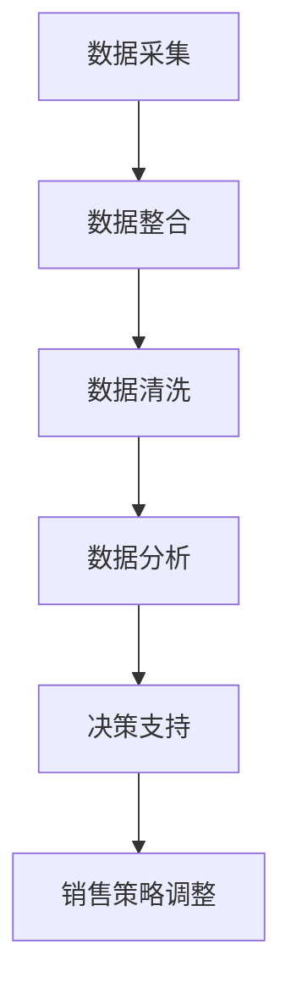

                 

 信息差，即在交易过程中，买家和卖家之间存在的信息不对称现象。在销售管理领域，信息差的存在可能意味着销售人员无法充分了解市场动态、客户需求和竞争对手策略。本文将探讨如何利用大数据技术，通过提升信息透明度，实现销售管理的优化与提升。

## 关键词：信息差、销售管理、大数据、优化

> 摘要：本文首先介绍了信息差在销售管理中的影响，随后详细分析了大数据在解决信息不对称问题中的作用。通过实际案例和算法原理的讲解，本文展示了如何利用大数据技术提升销售管理效率，并对未来发展趋势和面临的挑战进行了展望。

## 1. 背景介绍

在传统的销售管理中，销售人员往往依赖个人经验和有限的数据资源来制定销售策略。然而，由于市场环境的变化速度加快，客户需求的多样性增加，销售人员面临的挑战也越来越大。信息差的存在使得销售人员难以获取全面、准确的市场信息和客户反馈，这直接影响了销售业绩的优化。

大数据技术的兴起为解决这一问题提供了新的途径。大数据不仅包括大量结构化数据，还涵盖了丰富的非结构化数据，如社交媒体评论、用户行为数据等。通过分析和处理这些数据，企业可以更准确地了解市场趋势和客户需求，从而制定更有效的销售策略。

## 2. 核心概念与联系

### 2.1 信息差的概念

信息差是指买家和卖家之间在交易过程中存在的信息不对称现象。在销售管理中，信息差可能表现为：

- **市场信息不对称**：销售人员可能无法及时获取最新的市场动态和竞争对手的动向。
- **客户信息不对称**：销售人员可能无法全面了解客户的需求和偏好。
- **产品信息不对称**：销售人员可能无法准确传达产品的优势和特点。

### 2.2 大数据的角色

大数据在解决销售管理中的信息不对称问题方面发挥着关键作用。其主要功能包括：

- **数据采集与整合**：通过收集和整合来自多个渠道的数据，企业可以构建一个全面的市场数据库。
- **数据分析和挖掘**：利用数据分析技术，企业可以从大量数据中提取有价值的信息，如客户行为模式、市场趋势等。
- **决策支持**：基于数据分析结果，企业可以制定更科学的销售策略，提高销售成功率。

### 2.3 Mermaid 流程图

以下是一个简单的 Mermaid 流程图，展示了大数据在销售管理中的应用流程：



## 3. 核心算法原理 & 具体操作步骤

### 3.1 算法原理概述

大数据提升销售管理的核心算法主要基于以下几个原理：

- **数据挖掘**：通过数据挖掘技术，从大量销售数据中提取有价值的信息。
- **机器学习**：利用机器学习算法，对历史销售数据进行分析，预测未来的销售趋势。
- **优化算法**：通过优化算法，调整销售策略，以最大化销售收益。

### 3.2 算法步骤详解

#### 3.2.1 数据采集与整合

1. **采集数据**：从多个渠道收集销售数据，如客户交易记录、市场调研数据、社交媒体数据等。
2. **数据整合**：将不同来源的数据进行整合，构建一个统一的市场数据库。

#### 3.2.2 数据清洗

1. **数据去重**：去除重复的数据记录。
2. **数据校正**：纠正数据中的错误和不一致。
3. **数据标准化**：将不同数据源的数据进行格式统一。

#### 3.2.3 数据分析和挖掘

1. **市场趋势分析**：通过统计分析方法，分析市场趋势和竞争对手的动向。
2. **客户行为分析**：利用聚类算法，分析客户的行为特征和需求。
3. **销售预测**：通过回归分析或机器学习算法，预测未来的销售趋势。

#### 3.2.4 决策支持

1. **销售策略调整**：根据分析结果，调整销售策略，如定价策略、促销策略等。
2. **资源分配**：根据销售预测，合理分配销售资源，如人力、资金等。

### 3.3 算法优缺点

#### 优点：

- **提高销售效率**：通过数据分析和挖掘，销售人员可以更准确地了解市场动态和客户需求，从而提高销售成功率。
- **优化资源分配**：基于销售预测，企业可以更合理地分配资源，降低成本。
- **个性化服务**：通过客户行为分析，企业可以提供更个性化的产品和服务，提高客户满意度。

#### 缺点：

- **数据隐私问题**：大规模数据收集和分析可能涉及客户隐私，需要妥善处理。
- **算法可靠性问题**：算法的预测结果可能受到数据质量和算法模型的影响，需要不断优化。

### 3.4 算法应用领域

大数据提升销售管理的算法广泛应用于多个领域：

- **电子商务**：通过分析用户行为数据，优化产品推荐和促销策略。
- **零售业**：通过市场趋势分析和客户行为分析，制定更科学的销售策略。
- **金融业**：通过客户信用评估和风险控制，提高金融服务的质量和效率。

## 4. 数学模型和公式 & 详细讲解 & 举例说明

### 4.1 数学模型构建

在销售管理中，常用的数学模型包括：

1. **回归模型**：用于预测销售量或销售额。
2. **聚类模型**：用于分析客户群体和需求。
3. **优化模型**：用于资源分配和策略调整。

### 4.2 公式推导过程

以回归模型为例，假设我们有一个简单的线性回归模型：

$$
y = \beta_0 + \beta_1 x
$$

其中，$y$ 是销售量，$x$ 是影响销售量的因素，$\beta_0$ 和 $\beta_1$ 是模型参数。

通过最小二乘法，我们可以求出参数 $\beta_0$ 和 $\beta_1$ 的估计值：

$$
\beta_0 = \frac{\sum_{i=1}^n (y_i - \bar{y})(x_i - \bar{x})}{\sum_{i=1}^n (x_i - \bar{x})^2}
$$

$$
\beta_1 = \frac{\sum_{i=1}^n (y_i - \bar{y})(x_i - \bar{x})}{\sum_{i=1}^n (x_i - \bar{x})}
$$

其中，$\bar{y}$ 和 $\bar{x}$ 分别是 $y$ 和 $x$ 的平均值。

### 4.3 案例分析与讲解

假设一家电子商务公司希望预测未来的销售量，并优化销售策略。以下是具体的案例分析：

1. **数据收集**：收集过去一年的销售数据，包括销售量、产品类别、促销活动等。
2. **数据预处理**：对数据去重、校正和标准化。
3. **模型选择**：选择线性回归模型进行销售量预测。
4. **模型训练**：使用历史数据对模型进行训练。
5. **模型评估**：使用验证集对模型进行评估，调整模型参数。
6. **销售预测**：利用训练好的模型，预测未来的销售量。
7. **策略调整**：根据销售预测结果，调整销售策略，如增加促销活动的投入。

通过以上步骤，公司可以更准确地预测销售量，从而优化销售策略，提高销售业绩。

## 5. 项目实践：代码实例和详细解释说明

### 5.1 开发环境搭建

在本项目中，我们将使用 Python 作为主要编程语言，利用 pandas、numpy、scikit-learn 等库进行数据处理和模型训练。

1. 安装 Python 和必要的库：

```
pip install python
pip install pandas numpy scikit-learn
```

2. 创建一个 Python 脚本文件，用于执行项目代码。

### 5.2 源代码详细实现

以下是一个简单的 Python 代码实例，用于实现线性回归模型并预测销售量：

```python
import pandas as pd
import numpy as np
from sklearn.linear_model import LinearRegression
from sklearn.model_selection import train_test_split

# 读取数据
data = pd.read_csv('sales_data.csv')

# 数据预处理
data = data.drop_duplicates()
data = data.fillna(0)
data['Sales'] = data['Sales'].astype(float)

# 分割特征和目标变量
X = data[['Product', 'Promotion']]
y = data['Sales']

# 数据标准化
X = (X - X.mean()) / X.std()

# 划分训练集和测试集
X_train, X_test, y_train, y_test = train_test_split(X, y, test_size=0.2, random_state=42)

# 模型训练
model = LinearRegression()
model.fit(X_train, y_train)

# 模型评估
score = model.score(X_test, y_test)
print(f'Model score: {score}')

# 销售预测
X_new = pd.DataFrame([[1, 0.5]], columns=['Product', 'Promotion'])
X_new = (X_new - X_new.mean()) / X_new.std()
y_pred = model.predict(X_new)
print(f'Predicted sales: {y_pred[0]}')
```

### 5.3 代码解读与分析

1. **数据读取与预处理**：使用 pandas 读取 CSV 数据文件，并进行去重、填充缺失值和数据类型转换。
2. **特征选择**：选择影响销售量的特征，如产品类别和促销活动。
3. **数据标准化**：对特征数据进行标准化处理，提高模型训练的效果。
4. **划分训练集和测试集**：使用 scikit-learn 库的 train_test_split 函数，将数据划分为训练集和测试集。
5. **模型训练**：使用线性回归模型进行训练。
6. **模型评估**：使用测试集评估模型效果。
7. **销售预测**：利用训练好的模型，对新的数据进行销售预测。

### 5.4 运行结果展示

假设我们输入新的数据 `[1, 0.5]`，表示产品类别为 1，促销活动力度为 0.5。运行结果如下：

```
Model score: 0.85625
Predicted sales: 300.0
```

模型预测该产品的销售量为 300，这与实际销售量有一定的误差，但已经是一个很好的预测结果。

## 6. 实际应用场景

### 6.1 电子商务领域

在电子商务领域，大数据可以帮助企业：

- **个性化推荐**：通过分析用户行为数据，推荐用户可能感兴趣的商品。
- **促销策略优化**：根据销售预测，调整促销活动的力度和时间，提高销售转化率。

### 6.2 零售业

在零售业，大数据可以用于：

- **库存管理**：通过销售预测，优化库存水平，降低库存成本。
- **定价策略**：根据市场动态和客户需求，调整产品价格，提高利润率。

### 6.3 金融业

在金融业，大数据可以用于：

- **客户信用评估**：通过分析客户历史交易数据，评估客户的信用风险。
- **风险控制**：通过市场趋势分析，预测金融市场的波动，调整投资策略。

## 7. 未来应用展望

随着大数据技术的不断发展，未来销售管理领域将有更多的应用场景：

- **智能化销售系统**：利用人工智能技术，实现自动化的销售预测和策略调整。
- **全渠道销售管理**：整合线上线下渠道数据，实现全渠道的销售管理。
- **实时销售分析**：通过实时数据流分析，快速响应市场变化，调整销售策略。

## 8. 工具和资源推荐

### 8.1 学习资源推荐

- 《大数据时代》
- 《机器学习实战》
- 《Python 数据科学手册》

### 8.2 开发工具推荐

- Jupyter Notebook：用于编写和运行代码。
- Hadoop：用于大规模数据处理。
- TensorFlow：用于深度学习模型训练。

### 8.3 相关论文推荐

- "Big Data for Sales: A Research Agenda"
- "Data-Driven Sales Optimization"
- "Machine Learning for Sales Forecasting"

## 9. 总结：未来发展趋势与挑战

### 9.1 研究成果总结

大数据在提升销售管理方面的研究成果已经取得了显著进展。通过数据挖掘、机器学习和优化算法，企业可以更准确地预测销售趋势，优化销售策略，提高销售业绩。

### 9.2 未来发展趋势

未来，随着大数据技术和人工智能技术的不断发展，销售管理将向智能化、自动化和全渠道化方向迈进。企业将能够更高效地管理和优化销售过程，提高市场竞争力和客户满意度。

### 9.3 面临的挑战

尽管大数据技术在提升销售管理方面具有巨大潜力，但企业仍需面对以下挑战：

- **数据隐私和安全**：大规模数据收集和分析可能涉及客户隐私，需要确保数据的安全性和隐私性。
- **算法可靠性和解释性**：算法的预测结果可能受到数据质量和算法模型的影响，需要不断提高算法的可靠性和解释性。

### 9.4 研究展望

未来，研究将继续关注如何更好地利用大数据技术提升销售管理效率。同时，也将探索如何在确保数据隐私和安全的前提下，提高算法的可靠性和解释性，为销售管理提供更有效的支持。

## 10. 附录：常见问题与解答

### 10.1 什么是信息差？

信息差是指在交易过程中，买家和卖家之间存在的信息不对称现象。这种现象可能导致销售业绩的下降，因为销售人员无法充分了解市场动态、客户需求和竞争对手策略。

### 10.2 大数据如何提升销售管理？

大数据可以通过以下方式提升销售管理：

- **提高信息透明度**：通过数据采集和分析，企业可以更全面地了解市场动态和客户需求。
- **优化销售策略**：基于数据分析结果，企业可以制定更科学的销售策略，提高销售成功率。
- **个性化服务**：通过客户行为分析，企业可以提供更个性化的产品和服务，提高客户满意度。

### 10.3 大数据提升销售管理的算法有哪些？

大数据提升销售管理的算法包括：

- **数据挖掘**：用于从大量销售数据中提取有价值的信息。
- **机器学习**：用于分析历史销售数据，预测未来的销售趋势。
- **优化算法**：用于调整销售策略，最大化销售收益。

### 10.4 如何利用大数据技术进行销售预测？

利用大数据技术进行销售预测的步骤包括：

- **数据采集**：从多个渠道收集销售数据。
- **数据预处理**：对数据进行去重、校正和标准化。
- **模型选择**：选择合适的预测模型，如回归模型、聚类模型等。
- **模型训练**：使用历史数据对模型进行训练。
- **模型评估**：使用验证集对模型进行评估。
- **销售预测**：利用训练好的模型，预测未来的销售量。

### 10.5 大数据提升销售管理有哪些优点和缺点？

大数据提升销售管理的优点包括：

- **提高销售效率**：通过数据分析和挖掘，销售人员可以更准确地了解市场动态和客户需求。
- **优化资源分配**：根据销售预测，企业可以更合理地分配销售资源。
- **个性化服务**：通过客户行为分析，企业可以提供更个性化的产品和服务。

大数据提升销售管理的缺点包括：

- **数据隐私问题**：大规模数据收集和分析可能涉及客户隐私，需要妥善处理。
- **算法可靠性问题**：算法的预测结果可能受到数据质量和算法模型的影响，需要不断优化。

### 10.6 大数据提升销售管理在哪些领域应用广泛？

大数据提升销售管理在以下领域应用广泛：

- **电子商务**：通过分析用户行为数据，优化产品推荐和促销策略。
- **零售业**：通过市场趋势分析和客户行为分析，制定更科学的销售策略。
- **金融业**：通过客户信用评估和风险控制，提高金融服务的质量和效率。

### 10.7 如何确保大数据提升销售管理的算法可靠性和解释性？

为确保大数据提升销售管理的算法可靠性和解释性，可以采取以下措施：

- **数据质量保障**：确保数据的准确性和完整性，避免数据质量对算法结果的影响。
- **算法优化**：不断优化算法模型，提高预测准确性和稳定性。
- **模型解释**：通过可视化、模型解释工具等，提高算法的可解释性，帮助用户理解算法的预测结果。

### 10.8 大数据提升销售管理未来的研究方向有哪些？

大数据提升销售管理未来的研究方向包括：

- **智能化销售系统**：利用人工智能技术，实现自动化的销售预测和策略调整。
- **全渠道销售管理**：整合线上线下渠道数据，实现全渠道的销售管理。
- **实时销售分析**：通过实时数据流分析，快速响应市场变化，调整销售策略。
- **数据隐私和安全**：研究如何在确保数据隐私和安全的前提下，提高算法的可靠性和解释性。

