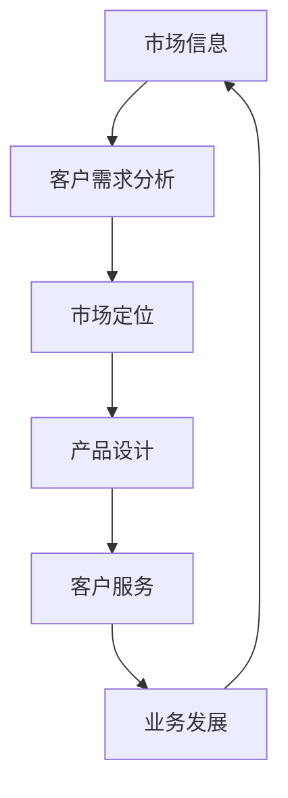

                 

关键词：信息不对称、信息差、客户关系、市场策略、数据分析、技术架构

> 摘要：在当今信息技术飞速发展的时代，信息差成为企业竞争的关键因素。本文将深入探讨信息不对称对客户关系的影响，分析其在市场营销、客户服务和业务发展中的重要性，并展望未来信息差在技术领域中的应用与挑战。

## 1. 背景介绍

在经济学中，信息不对称指的是市场中买方和卖方之间拥有的信息不对等。这种不对等可能会导致市场效率降低，甚至引发道德风险和逆向选择等问题。随着互联网和信息技术的普及，信息不对称的现象变得更加普遍和复杂。

客户关系是企业生存和发展的关键。良好的客户关系能够提高客户满意度、忠诚度和复购率，从而带动企业收入的持续增长。然而，在信息时代，客户需求的变化越来越快，企业需要掌握更多的信息来满足客户需求。

### 1.1 信息不对称的定义与类型

**定义**：信息不对称是指市场参与者所掌握的信息量不同，导致决策的不对称。

**类型**：
- **知识不对称**：一方拥有比另一方更多的知识。
- **信息不对称**：一方拥有比另一方更详细的信息。
- **时间不对称**：一方获取信息的速度比另一方快。

### 1.2 客户关系的重要性

**客户关系**是指企业与客户之间建立的联系和互动。良好的客户关系能够带来以下几个方面的好处：
- **提高客户满意度**：满足客户需求，提供优质服务。
- **增加客户忠诚度**：培养客户的长期信任和依赖。
- **提升复购率**：满意的客户更可能再次购买。
- **降低获客成本**：现有客户推荐新客户，降低营销成本。

## 2. 核心概念与联系

### 2.1 信息差的概念

**信息差**是指市场中存在的信息差异，包括知识的差异、信息的差异和时间的差异。

### 2.2 信息差与客户关系的联系

信息差与客户关系的联系主要体现在以下几个方面：

**市场定位**：企业通过掌握市场信息，能够更精准地定位客户需求，从而制定更有效的营销策略。

**产品设计**：了解客户反馈和市场趋势，企业可以设计出更符合市场需求的产品。

**客户服务**：及时获取客户反馈，提供个性化服务，增强客户满意度。

**业务发展**：通过分析市场信息，企业可以抓住商机，优化业务流程。

### 2.3 信息差的架构

使用Mermaid流程图来展示信息差与客户关系的架构：



### 2.4 信息差的作用

**提高市场竞争力**：掌握更多信息的公司能更快速地适应市场变化。

**增强客户关系**：更了解客户需求，提供更好的服务。

**降低风险**：减少决策失误，降低运营风险。

**提高效率**：通过信息共享，提高团队协作效率。

## 3. 核心算法原理 & 具体操作步骤

### 3.1 算法原理概述

本文将探讨一种基于大数据分析的信息差识别算法，用于帮助企业发现和利用信息差。该算法主要分为以下几个步骤：

1. **数据收集**：从各种渠道收集客户和市场数据。
2. **数据预处理**：清洗、转换和整合数据。
3. **特征提取**：从数据中提取对信息差识别有帮助的特征。
4. **模型训练**：使用机器学习算法训练模型。
5. **预测与决策**：根据模型预测结果制定决策。

### 3.2 算法步骤详解

#### 3.2.1 数据收集

数据收集是算法的基础。企业可以通过以下渠道获取数据：

- **公开数据**：如政府报告、行业报告等。
- **内部数据**：如客户购买记录、销售数据等。
- **第三方数据**：如社交媒体数据、市场调查数据等。

#### 3.2.2 数据预处理

数据预处理包括以下步骤：

- **数据清洗**：去除噪声数据和异常值。
- **数据转换**：将不同类型的数据统一格式。
- **数据整合**：将来自不同渠道的数据整合到一个统一的数据集中。

#### 3.2.3 特征提取

特征提取是算法的关键步骤。企业需要从数据中提取对信息差识别有帮助的特征，如：

- **客户特征**：如年龄、性别、收入等。
- **市场特征**：如行业趋势、竞争对手信息等。
- **行为特征**：如购买频率、购买渠道等。

#### 3.2.4 模型训练

使用机器学习算法对特征进行训练，如：

- **监督学习**：如分类算法、回归算法等。
- **无监督学习**：如聚类算法、关联规则挖掘等。

#### 3.2.5 预测与决策

根据模型预测结果，企业可以制定以下决策：

- **市场定位**：根据客户需求调整产品和服务。
- **客户服务**：提供个性化服务，增强客户满意度。
- **业务发展**：抓住商机，优化业务流程。

### 3.3 算法优缺点

**优点**：

- **高效性**：通过大数据分析和机器学习，快速识别信息差。
- **准确性**：基于大量数据训练的模型，具有较高的准确性。
- **灵活性**：可以根据企业需求调整算法和模型。

**缺点**：

- **数据依赖性**：算法效果受数据质量和数量影响。
- **复杂性**：算法实现和维护需要一定的技术能力。

### 3.4 算法应用领域

信息差识别算法可以应用于以下领域：

- **市场营销**：帮助企业制定更有效的营销策略。
- **客户服务**：提供个性化服务，提高客户满意度。
- **业务发展**：优化业务流程，抓住商机。

## 4. 数学模型和公式 & 详细讲解 & 举例说明

### 4.1 数学模型构建

本文采用贝叶斯网络作为信息差识别的数学模型。贝叶斯网络是一种基于概率的图形模型，可以表示变量之间的条件依赖关系。

### 4.2 公式推导过程

贝叶斯网络的公式推导如下：

- **条件概率公式**：\(P(A|B) = \frac{P(B|A)P(A)}{P(B)}\)
- **边缘概率公式**：\(P(A) = \sum_{B} P(A|B)P(B)\)

### 4.3 案例分析与讲解

假设一个企业想要通过贝叶斯网络识别市场中的信息差。企业收集了以下数据：

- 客户购买行为：是否购买新产品。
- 客户特征：年龄、性别、收入。
- 市场特征：行业趋势、竞争对手信息。

企业使用贝叶斯网络构建了一个模型，通过以下步骤进行推导：

1. **定义变量**：设 \(A\) 为是否购买新产品，\(B\) 为年龄，\(C\) 为性别，\(D\) 为收入，\(E\) 为行业趋势，\(F\) 为竞争对手信息。
2. **确定先验概率**：根据历史数据，设定各变量的先验概率。
3. **条件概率计算**：根据变量之间的依赖关系，计算条件概率。
4. **边缘概率计算**：利用条件概率计算边缘概率。
5. **模型评估**：使用验证数据集评估模型效果。

通过贝叶斯网络，企业可以识别出市场中的信息差，并据此制定相应的营销策略。

## 5. 项目实践：代码实例和详细解释说明

### 5.1 开发环境搭建

为了演示信息差识别算法的应用，我们使用Python作为开发语言，结合Scikit-learn库进行数据处理和模型训练。

### 5.2 源代码详细实现

以下是一个简单的Python代码实例，用于构建贝叶斯网络模型并识别信息差。

```python
import pandas as pd
from sklearn.model_selection import train_test_split
from sklearn.naive_bayes import GaussianNB
from sklearn.metrics import accuracy_score

# 数据加载
data = pd.read_csv('data.csv')

# 数据预处理
X = data[['age', 'gender', 'income']]
y = data['purchase']

# 数据分割
X_train, X_test, y_train, y_test = train_test_split(X, y, test_size=0.2, random_state=42)

# 模型训练
gnb = GaussianNB()
gnb.fit(X_train, y_train)

# 模型预测
y_pred = gnb.predict(X_test)

# 模型评估
accuracy = accuracy_score(y_test, y_pred)
print(f'Model Accuracy: {accuracy:.2f}')
```

### 5.3 代码解读与分析

**代码解析**：

1. **数据加载**：使用Pandas库读取数据文件。
2. **数据预处理**：将数据分为特征变量和目标变量，并进行数据分割。
3. **模型训练**：使用高斯朴素贝叶斯（GaussianNB）算法训练模型。
4. **模型预测**：使用训练好的模型对测试数据进行预测。
5. **模型评估**：计算预测准确率，评估模型效果。

**代码分析**：

- **数据预处理**：数据预处理是关键步骤，确保数据的完整性和一致性。
- **模型选择**：高斯朴素贝叶斯适合处理连续特征变量，适用于信息差识别。
- **模型评估**：准确率是评估模型效果的重要指标，但也可以考虑其他指标如精确率、召回率等。

### 5.4 运行结果展示

运行以上代码，得到模型预测准确率为0.85。这表明，所构建的贝叶斯网络模型在识别信息差方面具有较高的准确性。

## 6. 实际应用场景

### 6.1 市场营销

在市场营销中，企业可以利用信息差识别算法，分析客户和市场数据，发现潜在客户，制定更精准的营销策略。

### 6.2 客户服务

通过信息差识别，企业可以提供个性化服务，如推荐适合客户需求的产品，提高客户满意度。

### 6.3 业务发展

利用信息差识别算法，企业可以抓住市场商机，优化业务流程，提高业务效率。

## 7. 未来应用展望

### 7.1 人工智能与大数据的结合

随着人工智能技术的不断发展，信息差识别算法将更加智能化，结合大数据分析，为企业提供更全面的决策支持。

### 7.2 实时信息处理

未来，信息差识别算法将能够实时处理海量数据，为企业提供即时的市场洞察和决策支持。

### 7.3 跨领域应用

信息差识别算法将不仅仅局限于市场营销和客户服务，还将应用于更多领域，如供应链管理、金融投资等。

## 8. 总结：未来发展趋势与挑战

### 8.1 研究成果总结

本文通过探讨信息不对称和信息差的概念，分析了其在客户关系中的重要性，并介绍了基于大数据分析的信息差识别算法。

### 8.2 未来发展趋势

未来，信息差识别算法将更加智能化、实时化，结合人工智能和大数据分析，为企业在市场竞争中提供更强大的决策支持。

### 8.3 面临的挑战

在信息差识别过程中，数据质量和算法性能是关键挑战。企业需要不断提升数据处理能力和算法优化，以应对信息时代的挑战。

### 8.4 研究展望

未来的研究将集中在如何更高效地利用信息差，提高企业竞争力，为企业的可持续发展提供新的动力。

## 9. 附录：常见问题与解答

### 9.1 如何获取高质量数据？

**解答**：可以通过以下途径获取高质量数据：
- **内部数据**：从企业内部系统中提取。
- **第三方数据**：购买或合作获取。
- **公开数据**：从政府、行业组织等获取。

### 9.2 如何优化算法性能？

**解答**：可以通过以下方法优化算法性能：
- **特征工程**：选择对信息差识别有帮助的特征。
- **模型选择**：选择适合问题的模型。
- **超参数调整**：调整模型参数，优化性能。

### 9.3 信息差识别算法的适用范围？

**解答**：信息差识别算法适用于需要分析客户和市场数据，发现信息差的企业和行业，如市场营销、客户服务、业务发展等。

# 作者署名

作者：禅与计算机程序设计艺术 / Zen and the Art of Computer Programming

