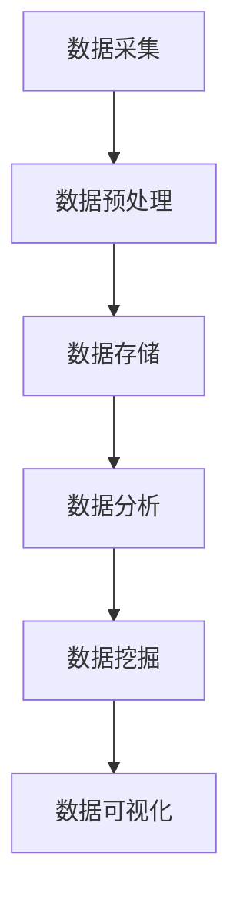

                 

## 1. 背景介绍

随着城市化进程的加快和汽车保有量的增加，城市交通问题日益严重。交通拥堵、交通事故频发、空气污染等问题已经成为影响城市可持续发展的重要因素。为了解决这些问题，智能交通系统（Intelligent Transportation System，ITS）应运而生。智能交通系统通过综合利用现代信息技术、传感器技术、通信技术、控制技术等，实现交通信息收集、处理、分析和共享，从而提高交通效率、减少事故、降低污染。

大数据技术在智能交通中的应用，为解决交通问题提供了新的思路和手段。大数据技术能够对海量的交通数据进行高效处理和分析，挖掘出隐藏在数据背后的规律和模式，为交通管理和规划提供科学依据。本文将介绍大数据在智能交通中的应用，探讨其核心概念、算法原理、数学模型、项目实践以及未来展望。

## 2. 核心概念与联系

### 2.1 数据采集与融合

数据采集是智能交通系统的核心环节，通过多种传感器设备，如摄像头、雷达、GPS等，实时获取交通流量、车辆速度、道路状况等数据。这些数据经过预处理和融合，形成一个统一、全面、实时的交通数据集。

### 2.2 数据存储与管理

交通数据量大、类型多，传统的数据库系统难以满足需求。分布式存储系统如Hadoop、Spark等，通过分布式架构和海量数据存储能力，为交通数据的存储和管理提供了有效解决方案。

### 2.3 数据分析与挖掘

数据分析与挖掘是大数据技术在智能交通中的核心应用。通过机器学习、数据挖掘等算法，对交通数据进行分析和挖掘，提取出交通规律、预测交通趋势，为交通管理和规划提供支持。

### 2.4 数据可视化

数据可视化是将复杂的数据通过图形、图表等形式进行展示，帮助人们更好地理解和分析数据。在智能交通中，数据可视化技术可以帮助交通管理者直观地了解交通状况，及时调整交通策略。

### 2.5 Mermaid 流程图



## 3. 核心算法原理 & 具体操作步骤

### 3.1 算法原理概述

大数据在智能交通中的应用主要涉及以下核心算法：

1. 聚类算法：用于发现交通数据的分布特征，为交通规划提供依据。
2. 时间序列分析：用于预测交通流量、车速等时间序列数据，为交通管理和规划提供参考。
3. 神经网络：用于交通场景识别、车辆分类等任务，为自动驾驶提供支持。

### 3.2 算法步骤详解

1. **聚类算法**

   - 数据预处理：对原始交通数据进行清洗、去噪、归一化等处理。
   - 聚类算法选择：选择合适的聚类算法，如K-Means、DBSCAN等。
   - 聚类分析：对处理后的交通数据进行分析，提取出不同类别的交通模式。

2. **时间序列分析**

   - 数据预处理：对原始交通数据进行分析，提取出时间序列特征。
   - 时间序列建模：选择合适的时间序列模型，如ARIMA、LSTM等。
   - 预测分析：利用模型对交通流量、车速等进行预测，为交通管理和规划提供支持。

3. **神经网络**

   - 数据预处理：对原始交通数据进行清洗、归一化等处理。
   - 神经网络构建：设计合适的神经网络结构，如卷积神经网络（CNN）等。
   - 训练与测试：利用训练数据和测试数据，对神经网络进行训练和评估。

### 3.3 算法优缺点

1. **聚类算法**

   - 优点：能够发现交通数据的分布特征，为交通规划提供依据。
   - 缺点：对于噪声数据敏感，可能产生噪声聚类。

2. **时间序列分析**

   - 优点：能够对交通流量、车速等进行预测，为交通管理和规划提供参考。
   - 缺点：对历史数据依赖较大，难以适应动态变化。

3. **神经网络**

   - 优点：能够处理复杂交通场景，为自动驾驶提供支持。
   - 缺点：对数据量要求较高，训练时间较长。

### 3.4 算法应用领域

- **交通流量预测**：通过时间序列分析和聚类算法，预测未来一段时间内的交通流量，为交通管理和规划提供支持。
- **交通场景识别**：通过神经网络，识别交通场景，为自动驾驶和智能交通管理提供支持。
- **交通规划**：通过数据分析与挖掘，发现交通规律，为交通规划提供科学依据。

## 4. 数学模型和公式 & 详细讲解 & 举例说明

### 4.1 数学模型构建

在智能交通中，常用的数学模型包括：

1. **线性回归模型**：用于预测交通流量、车速等线性关系。
2. **时间序列模型**：用于分析交通数据的动态变化规律。
3. **神经网络模型**：用于处理复杂交通场景。

### 4.2 公式推导过程

1. **线性回归模型**

   线性回归模型的基本公式为：

   $$y = \beta_0 + \beta_1x + \epsilon$$

   其中，$y$ 为预测值，$x$ 为自变量，$\beta_0$ 为截距，$\beta_1$ 为斜率，$\epsilon$ 为误差项。

2. **时间序列模型**

   常用的时间序列模型包括ARIMA模型、LSTM模型等。以ARIMA模型为例，其基本公式为：

   $$y_t = c + \phi_1y_{t-1} + \phi_2y_{t-2} + ... + \phi_py_{t-p} + \theta_1\epsilon_{t-1} + \theta_2\epsilon_{t-2} + ... + \theta_q\epsilon_{t-q} + \epsilon_t$$

   其中，$y_t$ 为时间序列的当前值，$\epsilon_t$ 为误差项，$\phi_i$ 和 $\theta_i$ 为模型参数。

3. **神经网络模型**

   神经网络模型的基本公式为：

   $$a_{i}^{(l)} = \sigma\left( \sum_{j=1}^{n} w_{ji}^{(l)}a_{j}^{(l-1)} + b_i^{(l)} \right)$$

   其中，$a_{i}^{(l)}$ 为第$l$层第$i$个节点的激活值，$\sigma$ 为激活函数，$w_{ji}^{(l)}$ 和 $b_i^{(l)}$ 分别为连接权重和偏置。

### 4.3 案例分析与讲解

**案例1：交通流量预测**

假设我们要预测某条道路的未来30分钟内的交通流量。我们可以采用线性回归模型进行预测。首先，收集历史交通流量数据，提取出时间序列特征。然后，利用线性回归模型对数据进行拟合，得到预测模型。最后，将当前时间序列数据输入模型，得到未来30分钟内的交通流量预测值。

**案例2：交通场景识别**

假设我们要识别某个交通场景，如红灯停车、绿灯行驶等。我们可以采用神经网络模型进行识别。首先，收集交通场景图像数据，进行预处理和标注。然后，设计合适的神经网络结构，如卷积神经网络（CNN），进行训练和测试。最后，将新的交通场景图像输入模型，得到场景识别结果。

## 5. 项目实践：代码实例和详细解释说明

### 5.1 开发环境搭建

为了实现大数据在智能交通中的应用，我们需要搭建一个合适的开发环境。这里我们使用Python编程语言和相关的开源库，如NumPy、Pandas、Scikit-learn、TensorFlow等。

1. 安装Python和Anaconda
2. 安装NumPy、Pandas、Scikit-learn、TensorFlow等库

### 5.2 源代码详细实现

**交通流量预测**

```python
import numpy as np
import pandas as pd
from sklearn.linear_model import LinearRegression
from sklearn.metrics import mean_squared_error

# 加载交通流量数据
data = pd.read_csv('traffic_data.csv')
x = data[['hour', 'day_of_week']]  # 特征
y = data['traffic_flow']  # 目标变量

# 分训练集和测试集
x_train, x_test, y_train, y_test = train_test_split(x, y, test_size=0.2, random_state=42)

# 建立线性回归模型
model = LinearRegression()
model.fit(x_train, y_train)

# 预测交通流量
y_pred = model.predict(x_test)

# 评估预测结果
mse = mean_squared_error(y_test, y_pred)
print('均方误差:', mse)
```

**交通场景识别**

```python
import tensorflow as tf
from tensorflow.keras.models import Sequential
from tensorflow.keras.layers import Conv2D, MaxPooling2D, Flatten, Dense

# 加载交通场景图像数据
images = load_images('traffic_scenes')  # 假设已经加载和预处理好的图像数据

# 数据预处理
images = preprocess_images(images)

# 切分训练集和测试集
x_train, x_test, y_train, y_test = train_test_split(images, labels, test_size=0.2, random_state=42)

# 构建卷积神经网络模型
model = Sequential([
    Conv2D(32, (3, 3), activation='relu', input_shape=(64, 64, 3)),
    MaxPooling2D((2, 2)),
    Flatten(),
    Dense(64, activation='relu'),
    Dense(10, activation='softmax')
])

# 编译模型
model.compile(optimizer='adam', loss='categorical_crossentropy', metrics=['accuracy'])

# 训练模型
model.fit(x_train, y_train, epochs=10, batch_size=32, validation_data=(x_test, y_test))

# 评估模型
loss, accuracy = model.evaluate(x_test, y_test)
print('测试集准确率:', accuracy)
```

### 5.3 代码解读与分析

**交通流量预测**

代码首先加载交通流量数据，提取特征和目标变量。然后，使用线性回归模型进行训练和预测，并评估预测结果。

**交通场景识别**

代码首先加载交通场景图像数据，进行预处理。然后，构建卷积神经网络模型，进行训练和评估。

## 6. 实际应用场景

### 6.1 城市交通管理

大数据技术在城市交通管理中的应用，可以帮助交通管理部门实时了解交通状况，优化交通信号控制，缓解交通拥堵。例如，通过分析实时交通流量数据，调整信号灯时长，提高道路通行效率。

### 6.2 交通规划

大数据技术可以为交通规划提供科学依据。通过对交通数据进行分析与挖掘，发现交通规律，预测交通发展趋势，为交通规划提供参考。例如，在城市建设新道路、地铁线路时，可以结合大数据分析结果，优化交通布局。

### 6.3 自动驾驶

大数据技术在自动驾驶领域具有广泛的应用前景。通过实时获取交通数据，自动驾驶系统可以更好地识别交通场景，做出准确的驾驶决策。例如，在自动驾驶车辆遇到路口时，可以通过分析路口交通数据，预测交通状况，决定是否停车等待。

## 6.4 未来应用展望

随着大数据技术的不断发展，其在智能交通中的应用将更加深入和广泛。未来，大数据技术在智能交通中的应用有望实现以下目标：

1. **更精准的交通预测**：利用深度学习、强化学习等先进算法，提高交通流量预测的准确性，为交通管理和规划提供更可靠的依据。
2. **更智能的交通管理**：结合物联网、车联网等技术，实现交通信息的实时共享和智能调控，提高交通效率，减少交通事故。
3. **更安全的交通环境**：利用大数据技术，实时监控交通状况，及时发现和处理安全隐患，提高交通安全水平。
4. **更环保的交通出行**：通过大数据分析，优化交通路线，降低车辆排放，减少空气污染。

## 7. 工具和资源推荐

### 7.1 学习资源推荐

- 《大数据技术基础》
- 《Python数据分析》
- 《机器学习实战》
- 《深度学习》

### 7.2 开发工具推荐

- Anaconda
- Jupyter Notebook
- PyCharm

### 7.3 相关论文推荐

- "大数据技术在智能交通中的应用"
- "基于深度学习的交通流量预测方法"
- "交通数据挖掘与智能交通系统研究"

## 8. 总结：未来发展趋势与挑战

### 8.1 研究成果总结

本文介绍了大数据在智能交通中的应用，探讨了核心概念、算法原理、数学模型、项目实践以及未来展望。通过对交通数据的分析、挖掘和预测，大数据技术为智能交通系统的发展提供了有力支持。

### 8.2 未来发展趋势

未来，大数据技术在智能交通中的应用将向更精准、更智能、更安全、更环保的方向发展。随着人工智能、物联网等技术的进步，大数据技术在智能交通中的应用将更加深入和广泛。

### 8.3 面临的挑战

大数据技术在智能交通中的应用面临以下挑战：

1. 数据质量和安全性：交通数据的真实性和安全性对智能交通系统的可靠性至关重要。
2. 算法优化：现有的算法在处理海量交通数据时，仍存在一定的局限性，需要进一步优化。
3. 法律法规：大数据技术在智能交通中的应用需要遵守相关法律法规，保护个人隐私。

### 8.4 研究展望

未来，大数据技术在智能交通中的应用将取得更多突破。通过深入研究和实践，有望实现更高效、更智能、更安全的交通管理系统，为城市可持续发展贡献力量。

## 9. 附录：常见问题与解答

### 9.1 问题1：大数据在智能交通中的应用有哪些？

答：大数据在智能交通中的应用包括交通流量预测、交通场景识别、交通规划、自动驾驶等。通过分析交通数据，可以优化交通管理、提高交通效率、减少交通事故。

### 9.2 问题2：如何保证交通数据的真实性和安全性？

答：保证交通数据的真实性和安全性需要从数据采集、存储、传输、分析等多个环节进行控制。采用加密技术、访问控制、数据备份等措施，确保数据的安全性和可靠性。

### 9.3 问题3：大数据技术在智能交通中的应用前景如何？

答：大数据技术在智能交通中的应用前景广阔。随着人工智能、物联网等技术的发展，大数据技术将为智能交通系统的发展提供强大支持，实现更高效、更智能、更安全的交通管理。|

