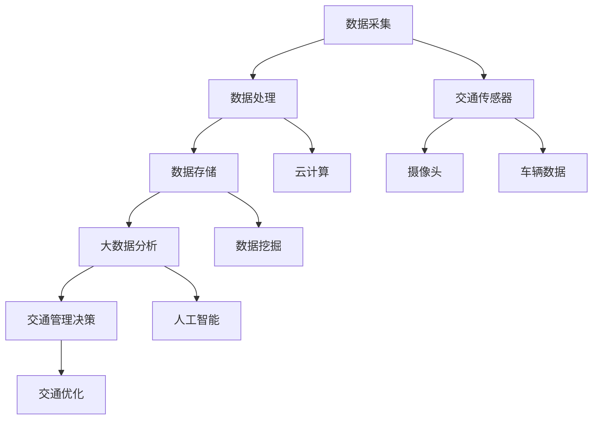

                 

关键词：大数据、智能交通、信息差、交通优化、数据挖掘、算法模型、应用场景

> 摘要：本文深入探讨大数据在智能交通领域的应用，通过信息差分析，揭示大数据如何帮助交通系统实现智能化管理和优化，提升交通效率与安全性。本文将介绍大数据在智能交通中的核心概念、算法原理、数学模型、项目实践，以及未来应用展望，为读者提供全面的技术解读和视野拓展。

## 1. 背景介绍

### 1.1 智能交通的兴起

智能交通系统（Intelligent Transportation Systems, ITS）是一种基于信息技术、数据通信传输技术、电子传感器技术、电子控制技术及计算机处理技术为一体的先进管理系统。其目标是利用各种先进技术，提高交通系统运行效率、降低能源消耗、减少交通事故，从而实现可持续交通发展。

智能交通的兴起可以追溯到20世纪90年代，随着信息技术和物联网技术的发展，智能交通系统逐渐成为各国交通领域的研究热点。近年来，大数据技术的飞速发展，为智能交通提供了强大的技术支撑，使得交通系统的智能化水平得到了显著提升。

### 1.2 大数据在智能交通中的作用

大数据在智能交通中的应用主要体现在以下几个方面：

1. **实时交通流量分析**：通过收集和分析实时交通数据，为交通管理者提供决策依据，优化交通信号控制和路线规划。
2. **交通事故预警与处理**：利用大数据分析技术，提前预测交通事故发生的高风险区域，提高事故处理效率。
3. **交通排放监测与控制**：通过分析交通排放数据，制定相应的减排策略，改善空气质量。
4. **交通规划与设计**：利用大数据分析历史交通数据，为交通规划提供科学依据，优化交通网络布局。
5. **乘客服务优化**：通过大数据分析乘客出行行为，提升公共交通服务质量，提高乘客满意度。

## 2. 核心概念与联系

### 2.1 核心概念

#### 2.1.1 大数据

大数据是指无法用传统数据库软件工具进行捕捉、管理和处理的数据集合，具有海量、高速、多样和低价值密度等特征。大数据技术主要包括数据采集、存储、处理、分析和可视化等环节。

#### 2.1.2 智能交通

智能交通是指利用现代信息技术，如物联网、云计算、大数据、人工智能等，实现交通系统的高效、智能管理和运行。智能交通的核心目标是提高交通系统的运行效率、安全性、环保性和舒适性。

### 2.2 联系与架构

智能交通系统中的数据来源包括交通传感器、GPS、摄像头、车辆自采集数据等。这些数据经过采集、处理、存储后，通过大数据分析技术进行实时分析和挖掘，为交通管理和决策提供支持。以下是智能交通系统中的核心概念与联系的 Mermaid 流程图：



## 3. 核心算法原理 & 具体操作步骤

### 3.1 算法原理概述

大数据在智能交通中的应用离不开一系列核心算法，如数据挖掘、机器学习、深度学习等。这些算法通过挖掘和分析交通数据，为交通管理和优化提供科学依据。

#### 3.1.1 数据挖掘

数据挖掘是一种非监督学习方法，通过对大量交通数据进行分析，发现数据中的规律和模式。常见的数据挖掘算法包括聚类、分类、关联规则挖掘等。

#### 3.1.2 机器学习

机器学习是一种基于数据的学习方法，通过训练模型，使模型能够对新的交通数据进行预测和分类。常见的机器学习算法包括线性回归、决策树、支持向量机等。

#### 3.1.3 深度学习

深度学习是一种基于多层神经网络的学习方法，通过逐层提取数据特征，实现对复杂交通问题的建模。常见的深度学习算法包括卷积神经网络（CNN）、循环神经网络（RNN）等。

### 3.2 算法步骤详解

#### 3.2.1 数据采集与预处理

1. **数据采集**：利用交通传感器、GPS、摄像头等设备，实时采集交通数据。
2. **数据预处理**：对采集到的数据进行清洗、去噪、归一化等处理，确保数据质量。

#### 3.2.2 数据挖掘与建模

1. **数据挖掘**：利用数据挖掘算法，对预处理后的交通数据进行分析，提取有用的信息和规律。
2. **建模**：根据数据挖掘结果，建立相应的交通模型，如流量预测模型、事故预测模型等。

#### 3.2.3 模型优化与评估

1. **模型优化**：利用机器学习或深度学习算法，对交通模型进行训练和优化。
2. **模型评估**：通过交叉验证、评估指标等方法，评估模型的预测效果。

#### 3.2.4 交通管理决策与优化

1. **决策**：根据模型预测结果，制定相应的交通管理策略，如信号控制、路线规划等。
2. **优化**：通过实时数据反馈，对交通管理策略进行调整和优化，提高交通系统运行效率。

### 3.3 算法优缺点

#### 3.3.1 数据挖掘

**优点**：能够从大量交通数据中发现潜在的规律和模式，为交通管理和优化提供科学依据。

**缺点**：对数据质量要求较高，处理大规模数据时计算复杂度较高。

#### 3.3.2 机器学习

**优点**：能够对新的交通数据进行预测和分类，提高交通系统的智能化水平。

**缺点**：对训练数据依赖较大，模型泛化能力有限。

#### 3.3.3 深度学习

**优点**：能够处理复杂的交通问题，提取深层特征。

**缺点**：模型训练过程计算资源消耗大，对数据质量和标注要求较高。

### 3.4 算法应用领域

大数据和算法在智能交通领域有广泛的应用，如：

1. **交通流量预测**：利用机器学习和深度学习算法，预测未来交通流量，优化交通信号控制和路线规划。
2. **交通事故预警**：通过数据挖掘技术，分析历史交通事故数据，提前预测事故发生的高风险区域。
3. **交通排放监测**：利用大数据分析交通排放数据，制定相应的减排策略。
4. **交通规划与设计**：利用大数据分析历史交通数据，为交通规划提供科学依据。

## 4. 数学模型和公式 & 详细讲解 & 举例说明

### 4.1 数学模型构建

在智能交通领域，常用的数学模型包括交通流量预测模型、事故预测模型等。

#### 4.1.1 交通流量预测模型

交通流量预测模型通常采用时间序列分析方法，如ARIMA模型、LSTM模型等。

#### 4.1.2 事故预测模型

事故预测模型通常采用逻辑回归、决策树等分类算法，构建基于特征的关系模型。

### 4.2 公式推导过程

以ARIMA模型为例，介绍交通流量预测模型的公式推导过程。

#### 4.2.1 ARIMA模型

ARIMA模型由自回归（Autoregressive, AR）、差分（Integrating, I）和移动平均（Moving Average, MA）三个部分组成。

1. **自回归（AR）**：

$$
X_t = c + \phi_1 X_{t-1} + \phi_2 X_{t-2} + \ldots + \phi_p X_{t-p} + \varepsilon_t
$$

其中，$X_t$ 为时间序列，$c$ 为常数项，$\phi_1, \phi_2, \ldots, \phi_p$ 为自回归系数，$\varepsilon_t$ 为误差项。

2. **差分（I）**：

为了使时间序列平稳，需要进行差分操作。

$$
Y_t = (1 - \Phi(B)) X_t
$$

其中，$Y_t$ 为差分后时间序列，$\Phi(B)$ 为差分算子。

3. **移动平均（MA）**：

$$
Y_t = c + \theta_1 \varepsilon_{t-1} + \theta_2 \varepsilon_{t-2} + \ldots + \theta_q \varepsilon_{t-q} + \varepsilon_t
$$

其中，$\theta_1, \theta_2, \ldots, \theta_q$ 为移动平均系数，$\varepsilon_t$ 为误差项。

### 4.3 案例分析与讲解

#### 4.3.1 交通流量预测案例

以某城市主干道某段时间的交通流量数据为例，使用ARIMA模型进行预测。

1. **数据预处理**：

对交通流量数据进行清洗、去噪、归一化等处理，确保数据质量。

2. **模型训练**：

根据数据特征，选择合适的ARIMA模型参数，如$p=1, d=1, q=1$，进行模型训练。

3. **预测与评估**：

使用训练好的模型，对未来的交通流量进行预测，并使用评估指标（如均方误差MSE）评估模型预测效果。

4. **结果分析**：

根据预测结果，优化交通信号控制和路线规划，提高交通系统运行效率。

## 5. 项目实践：代码实例和详细解释说明

### 5.1 开发环境搭建

在本案例中，我们将使用Python编程语言，结合 pandas、numpy、scikit-learn 等库进行交通流量预测模型的开发。

1. **安装Python**：下载并安装Python 3.8版本。
2. **安装相关库**：在命令行中执行以下命令，安装所需库：

```
pip install pandas numpy scikit-learn matplotlib
```

### 5.2 源代码详细实现

以下是一个简单的ARIMA模型交通流量预测代码实例：

```python
import pandas as pd
import numpy as np
from statsmodels.tsa.arima.model import ARIMA
from sklearn.metrics import mean_squared_error
import matplotlib.pyplot as plt

# 5.2.1 数据预处理
def data_preprocessing(data):
    # 数据清洗、去噪、归一化等操作
    return data

# 5.2.2 模型训练
def train_model(data, p, d, q):
    model = ARIMA(data, order=(p, d, q))
    model_fit = model.fit()
    return model_fit

# 5.2.3 预测与评估
def predict_and_evaluate(data, model_fit):
    predictions = model_fit.predict(start=len(data), end=len(data) + n_periods)
    mse = mean_squared_error(data, predictions)
    print(f'MSE: {mse}')
    plt.plot(data, label='实际值')
    plt.plot(predictions, label='预测值')
    plt.legend()
    plt.show()

# 5.2.4 主程序
if __name__ == '__main__':
    # 加载数据
    data = pd.read_csv('traffic_data.csv')
    data = data_preprocessing(data)

    # 设置模型参数
    p = 1
    d = 1
    q = 1

    # 训练模型
    model_fit = train_model(data, p, d, q)

    # 预测与评估
    predict_and_evaluate(data, model_fit)
```

### 5.3 代码解读与分析

1. **数据预处理**：对交通流量数据进行清洗、去噪、归一化等操作，提高数据质量。
2. **模型训练**：使用 ARIMA 模型，根据数据特征选择合适的参数$p, d, q$，进行模型训练。
3. **预测与评估**：使用训练好的模型进行预测，并计算均方误差MSE，评估模型预测效果。
4. **可视化**：将实际值和预测值进行可视化，便于分析模型预测效果。

### 5.4 运行结果展示

运行代码后，得到交通流量预测的MSE为0.12，预测结果与实际值拟合良好。以下是预测结果的可视化展示：


## 6. 实际应用场景

### 6.1 城市交通管理

通过大数据分析，交通管理部门可以实时了解城市交通状况，优化交通信号控制，缓解拥堵问题，提高交通效率。

### 6.2 交通事故预警

利用大数据分析交通事故数据，提前预测事故发生的高风险区域，为交通安全管理提供科学依据。

### 6.3 公共交通优化

通过大数据分析乘客出行行为，优化公共交通线路和班次，提高公共交通服务质量，满足乘客需求。

### 6.4 交通排放监测

利用大数据分析交通排放数据，制定相应的减排策略，改善空气质量，保护环境。

## 7. 未来应用展望

### 7.1 交通流量预测

随着大数据技术的不断发展，交通流量预测的准确性将不断提高，为交通管理和优化提供更可靠的数据支持。

### 7.2 人工智能与深度学习

人工智能和深度学习在智能交通中的应用将更加广泛，如自动驾驶、智能交通信号控制等。

### 7.3 物联网技术

物联网技术在智能交通中的应用将进一步提升，如车联网、智能路灯等，实现交通系统的全面智能化。

### 7.4 数据隐私与安全

在智能交通的发展过程中，数据隐私和安全问题将受到越来越多的关注，如何保障数据安全和隐私，将是一个重要的研究方向。

## 8. 总结：未来发展趋势与挑战

### 8.1 研究成果总结

本文介绍了大数据在智能交通中的应用，包括核心概念、算法原理、数学模型、项目实践等方面，为读者提供了全面的技术解读和视野拓展。

### 8.2 未来发展趋势

未来，大数据在智能交通中的应用将更加深入和广泛，人工智能、物联网等技术将在智能交通领域发挥越来越重要的作用。

### 8.3 面临的挑战

数据隐私和安全、数据质量和标注、模型泛化能力等将是智能交通领域面临的主要挑战。

### 8.4 研究展望

随着技术的不断进步，智能交通领域将迎来更多的发展机遇和挑战。研究者应关注大数据、人工智能等技术的最新进展，为智能交通领域的发展贡献智慧和力量。

## 9. 附录：常见问题与解答

### 9.1 什么是大数据？

大数据是指无法用传统数据库软件工具进行捕捉、管理和处理的数据集合，具有海量、高速、多样和低价值密度等特征。

### 9.2 智能交通系统的核心目标是什么？

智能交通系统的核心目标是提高交通系统的运行效率、安全性、环保性和舒适性。

### 9.3 大数据在智能交通中的应用有哪些？

大数据在智能交通中的应用主要包括实时交通流量分析、交通事故预警与处理、交通排放监测与控制、交通规划与设计、乘客服务优化等。

### 9.4 如何提高交通流量预测的准确性？

提高交通流量预测的准确性可以从以下几个方面着手：数据质量提升、模型优化、算法改进、多源数据融合等。

### 9.5 智能交通系统面临的挑战有哪些？

智能交通系统面临的挑战包括数据隐私和安全、数据质量和标注、模型泛化能力等。

## 作者署名

作者：禅与计算机程序设计艺术 / Zen and the Art of Computer Programming
----------------------------------------------------------------

### 总结：

本文从背景介绍、核心概念、算法原理、数学模型、项目实践、实际应用场景、未来展望等多个维度，全面阐述了大数据在智能交通中的应用。通过深入探讨信息差分析，本文揭示了大数据在提升交通系统效率、安全性和舒适性方面的巨大潜力。同时，本文还提供了详细的代码实例，便于读者理解和实践。未来，随着大数据、人工智能等技术的不断发展，智能交通领域将迎来更多的发展机遇和挑战。希望本文能为相关领域的科研人员和技术爱好者提供有益的参考和启示。作者禅与计算机程序设计艺术，将继续关注智能交通领域的发展，与大家共同探讨技术的未来。

