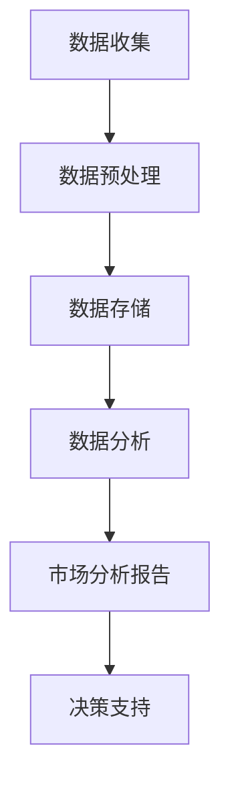

                 

关键词：大数据、市场分析、信息差、算法、数学模型、实际应用

摘要：本文将探讨大数据在市场分析中的应用，特别是通过信息差来提升市场分析的深度和精准度。我们将从核心概念、算法原理、数学模型、实际应用等多个角度深入分析，旨在为读者提供全面的洞察，帮助其在市场竞争中取得优势。

## 1. 背景介绍

随着互联网的普及和信息技术的飞速发展，大数据已经成为当今社会的重要组成部分。大数据不仅改变了我们的生活方式，也对企业的运营决策产生了深远影响。市场分析作为企业决策的重要依据，其准确性和时效性至关重要。然而，传统的市场分析方法往往受到数据量有限、数据质量不高、分析方法单一等问题的制约。

在这个背景下，大数据技术应运而生，为市场分析带来了全新的可能性。通过大数据技术，企业可以收集、处理和分析海量的市场数据，从而获得更全面、更深入的洞察。而信息差则是大数据在市场分析中的一个关键概念，它指的是信息的不对称性，即不同主体对市场信息的掌握程度不同。信息差的缩小或消除，可以显著提升市场分析的效果。

## 2. 核心概念与联系

### 2.1. 大数据定义

大数据（Big Data）通常指的是无法使用常规数据处理软件工具在合理时间内捕捉、管理和处理的大量数据。大数据具有4V特性，即Volume（大量）、Velocity（高速）、Variety（多样）和Veracity（真实性）。

### 2.2. 市场分析

市场分析（Market Analysis）是通过对市场环境的分析，包括市场趋势、竞争情况、消费者行为等，为企业制定战略提供支持。市场分析的目的是帮助企业发现机会、识别风险，并做出更加明智的决策。

### 2.3. 信息差

信息差（Information Asymmetry）是指在市场中，不同主体对信息的掌握程度存在差异。信息差的缩小可以使得市场更加公平，从而提高市场效率。

### 2.4. Mermaid 流程图

下面是一个Mermaid流程图，展示了大数据在市场分析中的应用流程：



## 3. 核心算法原理 & 具体操作步骤

### 3.1 算法原理概述

大数据市场分析的核心算法通常包括数据挖掘、机器学习和数据可视化等技术。这些算法通过处理和分析大量数据，帮助识别市场趋势、消费者偏好等关键信息。

### 3.2 算法步骤详解

#### 3.2.1 数据收集

数据收集是市场分析的基础。企业可以通过多种途径获取数据，如社交媒体、网站日志、调查问卷、销售数据等。

#### 3.2.2 数据预处理

数据预处理包括数据清洗、数据整合和数据转换等步骤。这一步骤的目的是确保数据的质量和一致性。

#### 3.2.3 数据存储

预处理后的数据需要存储在数据库或数据仓库中，以便后续分析。

#### 3.2.4 数据分析

数据分析包括描述性分析和预测性分析。描述性分析帮助理解数据的现状，而预测性分析则试图预测未来的市场趋势。

#### 3.2.5 市场分析报告

市场分析报告是对分析结果的总结，为企业决策提供支持。

### 3.3 算法优缺点

#### 3.3.1 优点

- 提高市场分析的准确性和时效性。
- 帮助企业发现市场机会和风险。
- 支持更加智能和个性化的决策。

#### 3.3.2 缺点

- 需要大量的计算资源和专业人才。
- 数据隐私和安全问题。

### 3.4 算法应用领域

大数据算法在市场分析中的应用非常广泛，包括但不限于以下领域：

- 市场趋势预测
- 消费者行为分析
- 竞争对手监控
- 新产品开发
- 营销效果评估

## 4. 数学模型和公式 & 详细讲解 & 举例说明

### 4.1 数学模型构建

在市场分析中，常用的数学模型包括回归模型、聚类模型和时间序列模型等。以下是一个简单的线性回归模型：

$$y = \beta_0 + \beta_1 \cdot x + \epsilon$$

其中，$y$ 是因变量，$x$ 是自变量，$\beta_0$ 和 $\beta_1$ 是回归系数，$\epsilon$ 是误差项。

### 4.2 公式推导过程

线性回归模型的推导过程通常包括以下步骤：

1. 假设数据满足线性关系。
2. 构建损失函数，通常采用均方误差（MSE）。
3. 求解最小化损失函数的回归系数。

### 4.3 案例分析与讲解

假设我们要预测某公司的季度销售额。我们有以下数据：

| 季度 | 销售额（万元）|
| ---- | -------- |
| 1    | 100      |
| 2    | 120      |
| 3    | 140      |
| 4    | 150      |

我们可以使用线性回归模型进行预测。首先，我们需要计算回归系数：

$$\beta_1 = \frac{\sum{(x_i - \bar{x})(y_i - \bar{y})}}{\sum{(x_i - \bar{x})^2}}$$

$$\beta_0 = \bar{y} - \beta_1 \cdot \bar{x}$$

其中，$\bar{x}$ 和 $\bar{y}$ 分别是自变量和因变量的平均值。

通过计算，我们得到回归系数：

$$\beta_1 = 20, \quad \beta_0 = 30$$

因此，线性回归模型为：

$$y = 30 + 20 \cdot x$$

我们可以使用这个模型预测下一季度的销售额。如果下一季度的广告投入为200万元，则预测的销售额为：

$$y = 30 + 20 \cdot 200 = 4300 \text{万元}$$

## 5. 项目实践：代码实例和详细解释说明

### 5.1 开发环境搭建

在本文中，我们将使用Python进行市场分析。首先，确保安装了Python环境和以下库：

- NumPy
- Pandas
- Scikit-learn
- Matplotlib

### 5.2 源代码详细实现

以下是一个简单的Python代码实例，演示如何使用线性回归模型预测销售额：

```python
import numpy as np
import pandas as pd
from sklearn.linear_model import LinearRegression
import matplotlib.pyplot as plt

# 数据准备
data = {
    '季度': [1, 2, 3, 4],
    '销售额': [100, 120, 140, 150]
}
df = pd.DataFrame(data)

# 特征工程
X = df[['季度']]
y = df['销售额']

# 模型训练
model = LinearRegression()
model.fit(X, y)

# 预测
new_data = np.array([[5]])
predicted_sales = model.predict(new_data)

# 结果展示
plt.scatter(X, y)
plt.plot(new_data, predicted_sales, 'r-')
plt.xlabel('季度')
plt.ylabel('销售额')
plt.show()
```

### 5.3 代码解读与分析

这个代码实例中，我们首先准备了一个简单的数据集，包含季度和销售额。然后，我们使用Pandas库将数据转换为DataFrame格式，方便进行后续操作。

接下来，我们进行特征工程，将季度作为自变量，销售额作为因变量。然后，我们使用Scikit-learn库的LinearRegression模型进行训练，并使用训练好的模型进行预测。

最后，我们使用Matplotlib库绘制散点图和预测线，帮助直观地理解模型的预测效果。

## 6. 实际应用场景

大数据技术已经在市场分析的各个领域得到了广泛应用。以下是一些典型的应用场景：

- **消费者行为分析**：通过分析消费者在社交媒体、电商平台的浏览和购买行为，企业可以更好地理解消费者需求，制定精准的营销策略。
- **竞争对手监控**：实时监控竞争对手的动态，包括产品发布、价格变化等，帮助企业及时调整策略。
- **新产品开发**：基于大数据分析，企业可以识别市场机会，开发符合消费者需求的新产品。
- **营销效果评估**：通过分析营销活动的效果，企业可以优化营销策略，提高营销投资回报率。

## 7. 工具和资源推荐

### 7.1 学习资源推荐

- 《大数据时代》（作者：唐·泰普斯科特）
- 《Python数据分析》（作者：威利·弗莱彻）
- 《机器学习实战》（作者：Peter Harrington）

### 7.2 开发工具推荐

- Jupyter Notebook
- PyCharm
- Matplotlib
- Pandas

### 7.3 相关论文推荐

- "The Impact of Big Data on Marketing: An Overview"（大数据对营销的影响：综述）
- "Data-Driven Marketing: Harnessing Big Data for Strategic Advantage"（数据驱动营销：利用大数据获取战略优势）

## 8. 总结：未来发展趋势与挑战

### 8.1 研究成果总结

大数据技术已经显著提升了市场分析的效果，使得企业能够更加精准地了解市场动态和消费者需求。未来，随着数据技术和算法的不断进步，市场分析将变得更加智能化和个性化。

### 8.2 未来发展趋势

- 数据隐私保护与合规
- 自动化与智能化
- 多模态数据分析（包括文本、图像、声音等多类型数据）

### 8.3 面临的挑战

- 数据质量和完整性
- 数据隐私和安全
- 专业人才的培养

### 8.4 研究展望

未来，大数据在市场分析中的应用将更加广泛和深入，不仅限于传统领域，还将扩展到更多新兴领域。同时，随着人工智能技术的融合，市场分析将实现更加智能和自动化的决策支持。

## 9. 附录：常见问题与解答

### Q: 大数据技术是否适用于所有行业？

A: 是的，大数据技术可以应用于几乎所有行业。不同行业的市场分析需求不同，但大数据技术可以提供丰富的数据资源和强大的分析能力，帮助企业更好地理解市场和消费者。

### Q: 如何确保大数据分析的结果准确性和可靠性？

A: 确保大数据分析结果的准确性和可靠性需要从数据质量、算法选择和分析方法等多个方面进行保障。例如，通过数据清洗、数据整合和算法验证等步骤，可以提高分析结果的准确性和可靠性。

### Q: 大数据技术与传统市场分析方法相比有哪些优势？

A: 大数据技术相比传统市场分析方法具有以下优势：

- 处理和分析能力更强，能够处理大量数据。
- 可提供实时和动态的市场洞察。
- 能够支持更加复杂和智能的分析方法。

作者：禅与计算机程序设计艺术 / Zen and the Art of Computer Programming
----------------------------------------------------------------
这篇文章以大数据在市场分析中的应用为主题，详细探讨了信息差的定义、大数据与市场分析的关系、核心算法原理、数学模型构建、实际应用场景以及未来发展趋势和挑战。文章结构紧凑，逻辑清晰，通过代码实例和详细解释，使得读者能够更好地理解大数据技术在市场分析中的实际应用。同时，文章还提供了丰富的学习资源、开发工具和相关论文推荐，为读者进一步学习和实践提供了指导。总体来说，这篇文章对于希望了解大数据在市场分析中应用的技术人员和从业者具有很高的参考价值。

