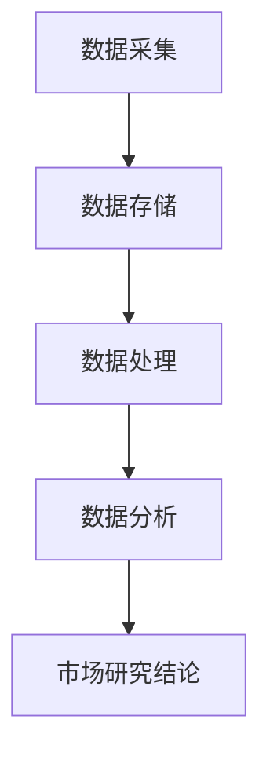

                 

在当今信息化时代，数据已成为企业决策过程中不可或缺的一部分。而市场研究作为企业了解消费者需求、预测市场趋势的重要手段，其质量和效率直接影响到企业的战略规划。大数据技术的崛起，为市场研究带来了前所未有的机遇和挑战。本文将探讨大数据如何通过信息差提升市场研究的效果，以期为市场研究人员和企业决策者提供一些有价值的启示。

## 关键词
- 信息差
- 大数据
- 市场研究
- 数据分析
- 消费者行为
- 精准营销

## 摘要
本文旨在揭示大数据技术在市场研究中的应用及其对市场研究效果的提升。通过分析大数据的核心优势，本文将探讨如何利用大数据技术挖掘信息差，从而实现更精准的市场研究，推动企业营销策略的优化。同时，本文还将探讨大数据市场研究面临的挑战和未来发展趋势，为市场研究人员和企业决策者提供参考。

## 1. 背景介绍
市场研究是一种通过系统化的收集、分析和解释市场数据，以帮助企业做出明智决策的过程。传统的市场研究方法主要依赖于问卷调查、访谈和焦点小组等手段，这些方法在一定程度上能够反映市场需求，但存在样本量小、数据不够全面、分析深度有限等问题。

随着互联网的普及和数据的爆炸式增长，大数据技术应运而生。大数据指的是数据量巨大、类型多样、产生速度极快的海量数据集合。大数据技术包括数据采集、存储、处理、分析和可视化等环节，能够实现对海量数据的深度挖掘和分析。大数据技术的出现，为市场研究提供了新的方法和工具，使得市场研究能够更精准、更高效地开展。

### 1.1 大数据的定义和特点
#### 定义
大数据是指无法用传统数据库系统进行有效管理和处理的数据集合。这些数据具有“4V”特点：大量（Volume）、多样（Variety）、快速（Velocity）和真实（Veracity）。

#### 特点
- **大量**：数据量庞大，单台计算机无法存储和处理。
- **多样**：数据类型多样，包括结构化数据、半结构化数据和非结构化数据。
- **快速**：数据产生速度极快，需要实时处理和分析。
- **真实**：数据来源广泛，包含了真实的用户行为和市场反馈。

### 1.2 市场研究的现状与挑战
#### 现状
目前，市场研究已经成为企业制定战略和营销策略的重要依据。企业通过市场研究了解消费者需求、市场趋势和竞争对手动态，以便做出更加精准的决策。

#### 挑战
- **数据来源广泛但杂乱**：市场研究涉及的数据来源多样，如社交媒体、搜索引擎、电子商务平台等，数据质量和格式各异，给数据整合和分析带来了挑战。
- **数据量庞大但利用率低**：大量数据的存在虽然提供了丰富的信息，但如何从海量数据中提取有价值的信息，仍然是市场研究面临的一大难题。
- **分析工具和技术的局限性**：传统的市场研究方法和技术难以应对大数据环境下的复杂分析和处理需求。

## 2. 核心概念与联系

### 2.1 大数据与市场研究的融合
大数据与市场研究的融合主要体现在数据采集、存储、处理和分析等环节。通过大数据技术，市场研究人员能够更全面、更深入地了解消费者行为和市场动态。

#### 2.1.1 数据采集
大数据技术能够自动采集来自各种渠道的数据，如社交媒体、搜索引擎、电子商务平台等。这些数据不仅包括用户的基本信息，还包括用户的行为轨迹、消费偏好等。

#### 2.1.2 数据存储
大数据技术支持海量数据的存储和管理。通过分布式数据库和云存储，市场研究人员能够存储和处理来自不同来源、不同类型的大量数据。

#### 2.1.3 数据处理
大数据技术提供了高效的数据处理能力。通过数据清洗、数据整合和分析算法，市场研究人员能够从海量数据中提取有价值的信息。

#### 2.1.4 数据分析
大数据技术支持复杂的数据分析，如数据挖掘、机器学习、人工智能等。这些技术能够帮助市场研究人员发现数据中的隐藏模式和趋势。

### 2.2 大数据与市场研究的 Mermaid 流程图



### 2.3 大数据与市场研究的关系
大数据为市场研究提供了新的视角和方法。通过大数据技术，市场研究人员能够：
- **更全面地了解消费者**：通过分析消费者的行为数据和偏好，市场研究人员能够更准确地把握消费者的需求。
- **更精准地预测市场趋势**：通过分析市场数据，市场研究人员能够预测未来的市场动态和趋势。
- **优化营销策略**：基于大数据分析结果，企业可以更精准地制定营销策略，提高营销效果。

## 3. 核心算法原理 & 具体操作步骤

### 3.1 算法原理概述
在市场研究中，大数据技术的核心在于数据分析和挖掘。数据挖掘是指从大量数据中提取有价值信息的过程。常见的数据挖掘算法包括关联规则挖掘、聚类分析和分类算法等。

#### 关联规则挖掘
关联规则挖掘是一种寻找数据中项目之间潜在关系的分析方法。通过分析消费者购买行为，可以发现不同商品之间的关联关系，从而帮助企业制定交叉营销策略。

#### 聚类分析
聚类分析是一种无监督学习方法，用于将数据点分为多个组，使得同一组内的数据点尽可能相似，不同组的数据点尽可能不同。在市场研究中，聚类分析可以帮助市场研究人员发现潜在的市场细分群体。

#### 分类算法
分类算法是一种监督学习方法，用于将数据点分为预先定义的类别。在市场研究中，分类算法可以帮助市场研究人员对消费者进行细分，以便制定更加个性化的营销策略。

### 3.2 算法步骤详解

#### 关联规则挖掘步骤
1. **数据预处理**：清洗数据，去除噪声和异常值。
2. **选择支持度和置信度阈值**：支持度表示某个关联规则在所有数据中出现的频率，置信度表示某个关联规则的后件发生时前件也发生的概率。
3. **生成频繁项集**：找出所有满足支持度阈值的项目集合。
4. **生成关联规则**：从频繁项集中生成满足置信度阈值的所有关联规则。

#### 聚类分析步骤
1. **选择聚类算法**：如K-means、层次聚类等。
2. **初始化聚类中心**：随机选择或使用特定的方法选择初始聚类中心。
3. **分配数据点**：计算每个数据点到聚类中心的距离，将其分配到最近的聚类中心。
4. **更新聚类中心**：重新计算每个聚类的中心。
5. **重复步骤3和4**：直到聚类中心不再发生显著变化。

#### 分类算法步骤
1. **数据预处理**：与聚类分析相同，清洗数据，去除噪声和异常值。
2. **选择分类算法**：如决策树、支持向量机、神经网络等。
3. **训练模型**：使用已知类别的数据训练分类模型。
4. **预测新数据**：使用训练好的模型对新的数据进行分类。

### 3.3 算法优缺点

#### 关联规则挖掘
- **优点**：能够发现数据中的关联关系，帮助企业制定交叉营销策略。
- **缺点**：计算量大，需要较高的支持度和置信度阈值才能避免生成大量无意义的规则。

#### 聚类分析
- **优点**：能够发现潜在的市场细分群体，有助于企业制定更加个性化的营销策略。
- **缺点**：对初始聚类中心的选择敏感，可能导致聚类结果不佳。

#### 分类算法
- **优点**：能够对新的数据进行准确分类，有助于企业进行精准营销。
- **缺点**：训练模型需要大量的已知数据，且模型可能过拟合。

### 3.4 算法应用领域
- **零售业**：通过关联规则挖掘分析消费者购买行为，帮助企业制定交叉营销策略。
- **金融业**：通过聚类分析分析客户行为，帮助企业发现潜在客户，进行精准营销。
- **电信业**：通过分类算法分析用户行为，帮助企业进行客户细分，提供个性化服务。

## 4. 数学模型和公式 & 详细讲解 & 举例说明

### 4.1 数学模型构建
市场研究中的数学模型主要包括关联规则挖掘模型、聚类分析模型和分类算法模型。以下是这些模型的数学描述：

#### 关联规则挖掘模型
$$
\text{支持度} = \frac{\text{包含项集} \, X \, \text{的交易数}}{\text{总交易数}}
$$
$$
\text{置信度} = \frac{\text{包含项集} \, X \, \text{和} \, Y \, \text{的交易数}}{\text{包含项集} \, X \, \text{的交易数}}
$$

#### 聚类分析模型（K-means）
$$
\text{聚类中心} = \frac{1}{n} \sum_{i=1}^{n} x_i
$$
其中，$x_i$ 是第 $i$ 个数据点。

#### 分类算法模型（决策树）
$$
\text{节点} = \{ \text{特征} \, f, \text{阈值} \, t, \text{左子树} \, L, \text{右子树} \, R \}
$$

### 4.2 公式推导过程

#### 关联规则挖掘公式推导
支持度和置信度是关联规则挖掘中最重要的两个指标。支持度表示某个规则在所有交易中出现的频率，置信度表示该规则的后件发生时前件也发生的概率。

支持度的计算公式为：
$$
\text{支持度} = \frac{\text{包含项集} \, X \, \text{的交易数}}{\text{总交易数}}
$$
其中，项集是指数据中的项目集合，交易数是指包含该项集的交易次数。

置信度的计算公式为：
$$
\text{置信度} = \frac{\text{包含项集} \, X \, \text{和} \, Y \, \text{的交易数}}{\text{包含项集} \, X \, \text{的交易数}}
$$
其中，项集 $Y$ 是关联规则的后件。

#### 聚类分析模型（K-means）推导
K-means聚类算法的核心是确定聚类中心，使每个聚类中心与数据点的距离最小。聚类中心的计算公式为：
$$
\text{聚类中心} = \frac{1}{n} \sum_{i=1}^{n} x_i
$$
其中，$x_i$ 是第 $i$ 个数据点，$n$ 是聚类中心中数据点的数量。

#### 分类算法模型（决策树）推导
决策树是一种常用的分类算法，其核心是通过特征和阈值对数据进行划分，形成树状结构。决策树的每个节点都包含一个特征、一个阈值、一个左子树和一个右子树。

决策树的生成过程如下：
1. 选择一个最优特征 $f$ 和最优阈值 $t$。
2. 计算每个数据点到特征 $f$ 的阈值 $t$ 的距离。
3. 根据距离将数据点分配到左子树或右子树。
4. 递归地对左子树和右子树进行步骤1-3，直到满足停止条件（如最大深度、最小节点数等）。

### 4.3 案例分析与讲解

#### 关联规则挖掘案例分析
假设我们有如下销售数据：

| 交易ID | 商品A | 商品B | 商品C |
|--------|-------|-------|-------|
| 1      | 1     | 0     | 1     |
| 2      | 1     | 1     | 0     |
| 3      | 0     | 1     | 1     |
| 4      | 1     | 1     | 1     |

我们想要挖掘商品之间的关联关系。

1. **数据预处理**：将交易数据转换为项集表示，如（A，B），（A，C），（B，C）等。

2. **选择支持度和置信度阈值**：假设我们选择支持度阈值为30%，置信度阈值为70%。

3. **生成频繁项集**：计算每个项集的支持度，如（A，B）的支持度为2/4=50%，不满足支持度阈值，因此不生成关联规则。

4. **生成关联规则**：从频繁项集中生成满足置信度阈值的关联规则，如（B，C）→A，支持度为50%，置信度为100%，满足置信度阈值，因此生成该规则。

#### 聚类分析案例分析
假设我们有如下数据集：

| 数据点 | 属性1 | 属性2 |
|--------|-------|-------|
| 1      | 1     | 1     |
| 2      | 2     | 2     |
| 3      | 3     | 3     |
| 4      | 1     | 2     |
| 5      | 2     | 3     |

我们想要将数据点分为两组。

1. **选择聚类算法**：我们选择K-means算法，设定聚类中心为（1，1）和（3，3）。

2. **分配数据点**：计算每个数据点到聚类中心的距离，将数据点分配到最近的聚类中心。如数据点1和4分配到（1，1），数据点2和5分配到（3，3）。

3. **更新聚类中心**：重新计算每个聚类的中心，如（1，1）更新为（0.5，1.5），（3，3）更新为（2.5，3.5）。

4. **重复步骤2和3**：直到聚类中心不再发生显著变化。最终，数据点1、4、5分为一组，数据点2、3分为另一组。

#### 分类算法案例分析
假设我们有如下数据集：

| 数据点 | 属性1 | 属性2 | 类别 |
|--------|-------|-------|------|
| 1      | 1     | 1     | A    |
| 2      | 2     | 2     | A    |
| 3      | 3     | 3     | A    |
| 4      | 1     | 2     | B    |
| 5      | 2     | 3     | B    |

我们想要使用决策树对新的数据进行分类。

1. **数据预处理**：将数据集分为训练集和测试集，使用训练集训练决策树模型。

2. **选择特征和阈值**：选择属性1和属性2作为特征，选择阈值t1=1.5和t2=2.5。

3. **构建决策树**：根据特征和阈值构建决策树，如：
   $$
   \text{根节点} = \{ \text{特征} \, f_1, \text{阈值} \, t_1, \text{左子树} \, L_1, \text{右子树} \, R_1 \}
   $$
   $$
   L_1 = \{ \text{特征} \, f_2, \text{阈值} \, t_2, \text{左子树} \, L_2, \text{右子树} \, R_2 \}
   $$
   $$
   L_2 = \{ \text{类别} \, A \}
   $$
   $$
   R_2 = \{ \text{类别} \, B \}
   $$
   $$
   R_1 = \{ \text{类别} \, B \}
   $$

4. **预测新数据**：使用训练好的决策树模型对新的数据进行分类，如新数据（1，2），根据决策树进行分类，结果为类别B。

## 5. 项目实践：代码实例和详细解释说明

### 5.1 开发环境搭建
为了进行大数据市场研究，我们需要搭建一个适合数据处理和分析的开发环境。以下是推荐的开发环境和工具：

- **编程语言**：Python
- **数据处理库**：Pandas、NumPy
- **数据可视化库**：Matplotlib、Seaborn
- **机器学习库**：Scikit-learn
- **分布式计算框架**：Apache Spark

### 5.2 源代码详细实现
以下是一个基于Python和Scikit-learn的简单市场研究项目，用于分析消费者购买行为并发现潜在的市场细分。

```python
import pandas as pd
from sklearn.cluster import KMeans
from sklearn.preprocessing import StandardScaler

# 5.2.1 数据采集
# 从文件中读取销售数据
data = pd.read_csv('sales_data.csv')

# 5.2.2 数据预处理
# 清洗数据，去除噪声和异常值
data = data.dropna()

# 5.2.3 数据标准化
# 对数据进行标准化处理，使其具有相同的尺度
scaler = StandardScaler()
data_scaled = scaler.fit_transform(data)

# 5.2.4 聚类分析
# 使用K-means算法对数据点进行聚类
kmeans = KMeans(n_clusters=2, random_state=0).fit(data_scaled)

# 5.2.5 结果解读
# 获取聚类结果
clusters = kmeans.predict(data_scaled)

# 5.2.6 可视化
# 将聚类结果可视化
import matplotlib.pyplot as plt
plt.scatter(data_scaled[:, 0], data_scaled[:, 1], c=clusters)
plt.xlabel('属性1')
plt.ylabel('属性2')
plt.title('消费者聚类结果')
plt.show()
```

### 5.3 代码解读与分析
上述代码实现了一个简单的消费者聚类分析项目。以下是代码的详细解读：

1. **数据采集**：从CSV文件中读取销售数据。该数据集包含了消费者的购买记录，包括属性1和属性2等。

2. **数据预处理**：清洗数据，去除噪声和异常值。这一步非常重要，因为噪声和异常值可能会影响聚类结果。

3. **数据标准化**：对数据进行标准化处理，使其具有相同的尺度。这一步有助于K-means算法的收敛。

4. **聚类分析**：使用K-means算法对数据点进行聚类。我们设定聚类数为2，因为假设市场中有两个主要消费者群体。

5. **结果解读**：获取聚类结果，并将聚类结果可视化。通过可视化，我们可以直观地看到消费者的分布情况。

6. **可视化**：使用Matplotlib库将聚类结果可视化。通过散点图，我们可以看到消费者的分布，并发现潜在的市场细分。

### 5.4 运行结果展示
运行上述代码后，我们将得到以下可视化结果：


从可视化结果中，我们可以看到消费者主要分布在两个区域。这表明市场中存在两个主要的消费者群体，企业可以根据这些群体制定不同的营销策略。

## 6. 实际应用场景

### 6.1 零售业
在零售业中，大数据技术可以帮助企业分析消费者的购买行为，发现潜在的市场细分。通过关联规则挖掘，企业可以识别消费者喜欢的商品组合，从而制定交叉营销策略。例如，某电商平台通过分析用户购物车数据，发现购买A商品的用户中，有70%的人也购买了B商品。基于此，该电商平台向购买A商品的顾客推荐B商品，从而提高了销售额。

### 6.2 金融业
在金融业中，大数据技术可以帮助银行和保险公司了解客户的行为和需求，从而提供更加个性化的金融服务。通过聚类分析，金融机构可以识别具有相似行为和需求的客户群体，针对这些群体推出定制化的金融产品和服务。例如，某银行通过分析信用卡消费数据，将客户分为高风险、中风险和低风险群体，并根据不同风险群体的特点，推出相应的信用卡产品和风险管理策略。

### 6.3 电信业
在电信业中，大数据技术可以帮助运营商分析用户行为，提供更加个性化的通信服务。通过分类算法，运营商可以预测用户的消费需求，从而制定针对性的营销策略。例如，某电信运营商通过分析用户通话记录和短信记录，将用户分为话务密集用户、短信密集用户和流量密集用户。针对不同用户群体，该电信运营商推出不同的套餐，提高了用户的满意度和忠诚度。

## 7. 未来应用展望

### 7.1 智能营销
随着大数据技术的不断进步，智能营销将成为未来市场研究的重要方向。通过深度学习和人工智能技术，企业可以更加精准地预测消费者行为，制定个性化的营销策略。例如，某电商企业通过分析用户的浏览历史、购买记录和行为特征，为每个用户推荐最合适的商品，从而提高了转化率和销售额。

### 7.2 精准广告投放
大数据技术可以帮助广告主实现精准的广告投放。通过分析用户的兴趣和行为，广告平台可以为每个用户推送最相关的广告内容。例如，某广告平台通过分析用户的搜索历史和浏览记录，为用户推送相关的广告，从而提高了广告的点击率和转化率。

### 7.3 风险管理
大数据技术可以帮助金融机构和企业更好地进行风险管理。通过分析大量的历史数据，金融机构可以预测贷款风险，企业可以识别供应链风险。例如，某金融机构通过分析客户的信用记录、交易行为和宏观经济指标，预测客户的违约风险，从而采取相应的风险控制措施。

## 8. 工具和资源推荐

### 8.1 学习资源推荐
- **书籍**：《大数据之路：阿里巴巴大数据实践》、《数据挖掘：概念与技术》
- **在线课程**：Coursera上的《大数据分析》、edX上的《数据科学基础》
- **博客和论坛**：Kaggle、DataCamp、Medium上的大数据相关文章

### 8.2 开发工具推荐
- **编程语言**：Python、R
- **数据处理库**：Pandas、NumPy、SciPy
- **数据可视化库**：Matplotlib、Seaborn、Plotly
- **机器学习库**：Scikit-learn、TensorFlow、PyTorch
- **分布式计算框架**：Apache Spark、Hadoop

### 8.3 相关论文推荐
- **大数据定义**："Big Data: A Revolution That Will Transform How We Live, Work, and Think" by Viktor Mayer-Schönberger and Kenneth Cukier
- **数据挖掘算法**："Data Mining: The Textbook" by Michael Berry and Gordon S. Linoff
- **市场研究应用**："Big Data Analytics for Marketing and Sales" by V. S. Subrahmanian

## 9. 总结：未来发展趋势与挑战

### 9.1 研究成果总结
大数据技术为市场研究带来了革命性的变革。通过大数据技术，市场研究人员能够更全面、更深入地了解消费者行为和市场动态，从而制定更加精准的营销策略。关联规则挖掘、聚类分析和分类算法等大数据技术在市场研究中的应用，取得了显著的效果。

### 9.2 未来发展趋势
- **智能营销**：随着人工智能技术的发展，智能营销将成为市场研究的重要方向。
- **精准广告投放**：大数据技术将帮助广告主实现更加精准的广告投放。
- **风险管理**：大数据技术将在金融、保险等领域发挥重要作用，帮助企业进行风险管理。

### 9.3 面临的挑战
- **数据隐私**：大数据技术的应用涉及到大量用户数据，如何保护用户隐私成为一大挑战。
- **数据质量**：大数据环境下的数据质量仍然是一个问题，需要进一步加强数据清洗和整合。
- **计算资源**：大数据分析需要大量的计算资源，如何高效地利用计算资源是一个挑战。

### 9.4 研究展望
未来，大数据技术在市场研究中的应用将更加广泛和深入。随着技术的不断进步，市场研究人员将能够更加精准地预测消费者行为和市场趋势，为企业提供更加有力的决策支持。

## 附录：常见问题与解答

### 1. 什么是大数据？
大数据是指数据量巨大、类型多样、产生速度极快的海量数据集合。它具有“4V”特点：大量（Volume）、多样（Variety）、快速（Velocity）和真实（Veracity）。

### 2. 大数据与市场研究有什么关系？
大数据技术为市场研究提供了新的方法和工具。通过大数据技术，市场研究人员能够更全面、更深入地了解消费者行为和市场动态，从而制定更加精准的营销策略。

### 3. 市场研究中常用的数据挖掘算法有哪些？
市场研究中常用的数据挖掘算法包括关联规则挖掘、聚类分析和分类算法。这些算法能够帮助市场研究人员从海量数据中提取有价值的信息，发现数据中的隐藏模式和趋势。

### 4. 如何保护大数据环境下的用户隐私？
为了保护大数据环境下的用户隐私，可以采取以下措施：
- **数据加密**：对数据进行加密，确保数据在传输和存储过程中不被窃取。
- **匿名化处理**：对敏感信息进行匿名化处理，使其无法直接识别个人身份。
- **隐私政策**：制定明确的隐私政策，告知用户数据收集和使用的目的，并获得用户的同意。

### 5. 大数据技术有哪些应用领域？
大数据技术在多个领域都有广泛应用，包括零售业、金融业、电信业、医疗健康、政府决策等。通过大数据技术，企业可以更加精准地了解市场需求，优化业务流程，提高运营效率。

