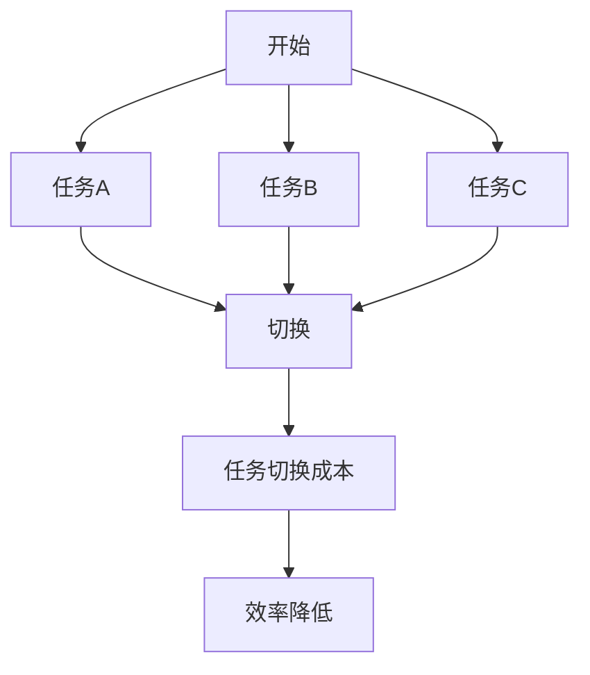
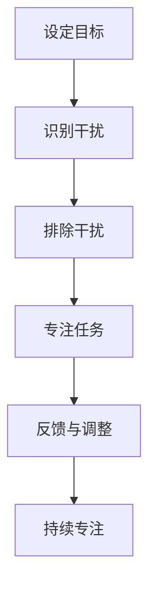
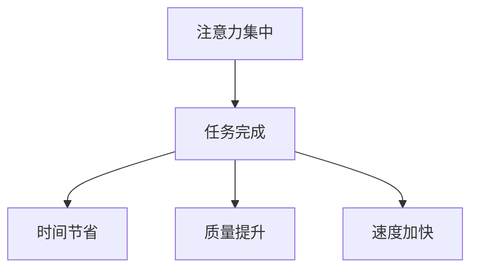
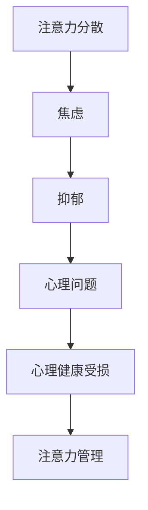
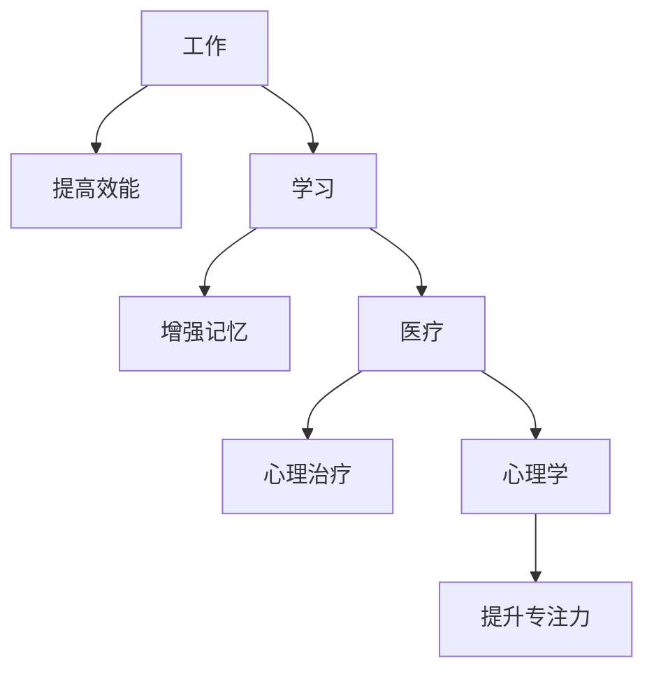
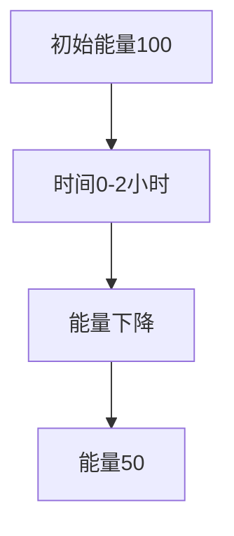

                 

关键词：注意力管理、信息过载、多任务处理、分心控制、工作效能、心理健康、技术策略、时间管理。

> 摘要：本文将深入探讨信息时代中注意力管理的实践与策略，旨在帮助读者在干扰和分心泛滥的环境中保持头脑清晰，提升工作效能和心理健康。文章将从核心概念、算法原理、数学模型、项目实践、实际应用、未来展望等多个维度展开讨论，为广大读者提供全面的注意力管理指南。

## 1. 背景介绍

在当今信息爆炸的时代，注意力管理已成为一项至关重要的技能。人们每天都被海量的信息、任务和需求所包围，很容易陷入分心和干扰的困境中。注意力不集中不仅会导致工作效能下降，还会对心理健康产生负面影响。因此，如何有效地管理注意力，成为提高工作效率和生活质量的关键。

注意力管理涉及到多个层面，包括时间管理、情绪管理、目标设定、任务优先级分配等。本文将围绕这些核心概念，结合最新的研究成果和实践经验，提供一套系统化的注意力管理策略。

### 信息过载与注意力分散

信息过载是指个体接收的信息量超过了其处理能力，导致注意力分散。根据布鲁纳（Blumer）的研究，现代社会的信息量以每年23%的速度增长，这无疑加剧了人们的注意力分散问题。人们在面对多种任务和需求时，容易陷入“多任务处理”的陷阱，导致注意力分散，无法专注于单一任务。

### 多任务处理的误区

多任务处理曾被许多人认为是一种高效的工作方式，但事实上，它往往是低效的。根据斯坦福大学的研究，多任务处理会降低大脑处理信息的速度和准确性，导致错误率增加。大脑在切换任务时需要消耗大量的认知资源，这会削弱个体的注意力和专注力。

### 心理健康与注意力管理

注意力分散不仅影响工作效能，还会对心理健康产生负面影响。持续的分心和干扰会导致焦虑、抑郁等心理问题。因此，有效管理注意力对维持心理健康至关重要。

## 2. 核心概念与联系

在探讨注意力管理的实践与策略之前，我们需要理解一些核心概念，包括多任务处理、分心控制、工作效能和心理健康等。

### 多任务处理

多任务处理（Multitasking）是指同时处理多个任务的行为。然而，研究表明，多任务处理容易导致注意力分散和效率下降。以下是多任务处理的一个Mermaid流程图：



### 分心控制

分心控制（Distract Control）是指通过策略和方法减少干扰和分心的能力。以下是分心控制的一个Mermaid流程图：



### 工作效能

工作效能（Work Efficiency）是指个体在完成任务时的时间、质量和速度。有效管理注意力可以显著提升工作效能。以下是工作效能的一个Mermaid流程图：



### 心理健康

心理健康（Mental Health）是指个体的情感、心理和社交健康状态。注意力管理对于维持心理健康至关重要。以下是心理健康的一个Mermaid流程图：



## 3. 核心算法原理 & 具体操作步骤

### 3.1 算法原理概述

注意力管理算法的核心原理是基于人类的认知心理学和神经科学。通过理解大脑处理信息的方式，我们可以设计出有效的策略来增强注意力集中和控制分心。

### 3.2 算法步骤详解

1. **目标设定**：明确任务的目标和期望结果，有助于集中注意力。

2. **环境优化**：创建一个减少干扰的工作环境，例如关闭不必要的通知，使用耳机屏蔽噪音。

3. **时间管理**：采用番茄工作法等时间管理技巧，分段工作，避免长时间连续工作导致的疲劳。

4. **情绪管理**：通过冥想、呼吸练习等方式调节情绪，保持心态平和。

5. **任务优先级分配**：根据任务的重要性和紧急程度，合理安排任务的优先级。

6. **反馈与调整**：定期评估任务完成情况和注意力管理效果，进行必要的调整。

### 3.3 算法优缺点

**优点**：

- 提高工作效能和效率。
- 减少分心和干扰。
- 有助于维持心理健康。

**缺点**：

- 需要持续的自我监控和调整。
- 对于一些任务，可能需要更多的时间和精力来管理注意力。

### 3.4 算法应用领域

注意力管理算法广泛应用于工作、学习、医疗和心理学等领域。以下是一个应用领域的Mermaid流程图：



## 4. 数学模型和公式 & 详细讲解 & 举例说明

### 4.1 数学模型构建

注意力管理的一个关键数学模型是心理能量模型（Psychological Energy Model），该模型假设个体的心理能量是有限的，并且随着任务的进行而消耗。以下是心理能量模型的构建：

$$
E(t) = E_0 - \alpha \cdot t
$$

其中，$E(t)$ 表示时刻 $t$ 时的心理能量，$E_0$ 表示初始心理能量，$\alpha$ 表示心理能量消耗率。

### 4.2 公式推导过程

心理能量消耗率 $\alpha$ 可以通过以下方式推导：

$$
\alpha = \frac{E_0 - E_f}{t_f}
$$

其中，$E_f$ 表示完成任务后的心理能量，$t_f$ 表示完成任务所需时间。

### 4.3 案例分析与讲解

假设某人在完成一个复杂任务时，初始心理能量为 $E_0 = 100$，任务完成后的心理能量为 $E_f = 50$，完成任务所需时间为 $t_f = 2$ 小时。则心理能量消耗率 $\alpha$ 为：

$$
\alpha = \frac{100 - 50}{2} = 25 \text{单位/小时}
$$

使用心理能量模型，可以计算在任意时刻 $t$ 的心理能量：

$$
E(t) = 100 - 25 \cdot t
$$

例如，在任务开始后 $1$ 小时，心理能量为：

$$
E(1) = 100 - 25 \cdot 1 = 75 \text{单位}
$$

## 5. 项目实践：代码实例和详细解释说明

### 5.1 开发环境搭建

为了演示注意力管理算法，我们将使用Python编写一个简单的注意力管理程序。以下是开发环境的搭建步骤：

1. 安装Python（版本3.8及以上）。
2. 安装必要的库，例如numpy、matplotlib等。

### 5.2 源代码详细实现

以下是注意力管理程序的源代码：

```python
import numpy as np
import matplotlib.pyplot as plt

# 心理能量模型参数
E_0 = 100  # 初始心理能量
alpha = 25 # 心理能量消耗率

# 计算任意时刻的心理能量
def calculate_energy(t):
    return E_0 - alpha * t

# 模拟一个任务过程
def simulate_task(t_max):
    t = np.arange(0, t_max, 0.1)
    energy = calculate_energy(t)
    
    plt.plot(t, energy)
    plt.xlabel('时间（小时）')
    plt.ylabel('心理能量（单位）')
    plt.title('心理能量变化')
    plt.grid()
    plt.show()

# 模拟一个任务
simulate_task(2)
```

### 5.3 代码解读与分析

- **导入库**：首先导入numpy和matplotlib库，用于数学计算和图形绘制。
- **参数定义**：定义初始心理能量 $E_0$ 和心理能量消耗率 $\alpha$。
- **能量计算函数**：定义一个函数 `calculate_energy` 来计算任意时刻的心理能量。
- **模拟任务函数**：定义一个函数 `simulate_task` 来模拟一个任务过程，并绘制心理能量变化图。

### 5.4 运行结果展示

运行 `simulate_task(2)` 函数后，将得到一个时间-心理能量的曲线图，展示在任务过程中心理能量的变化。图中的红色曲线表示心理能量随时间的下降，反映了随着任务进行，个体的心理能量逐渐消耗。



## 6. 实际应用场景

### 6.1 工作场景

在办公室环境中，注意力管理尤为重要。通过以下策略，可以在工作过程中保持专注：

- **任务清单**：每天开始工作前，制定任务清单，明确当天的工作目标和任务。
- **专注时段**：设定专注时段，例如使用番茄工作法，每工作25分钟后休息5分钟。
- **减少干扰**：关闭不必要的通知，保持工作环境的整洁。

### 6.2 学习场景

在学习过程中，注意力管理同样至关重要。以下是一些实用的技巧：

- **时间管理**：合理安排学习时间，避免长时间连续学习导致的疲劳。
- **环境优化**：选择一个安静的学习环境，减少干扰。
- **目标设定**：设定明确的学习目标，有助于集中注意力。

### 6.3 医疗场景

在医疗领域，注意力管理对于医生和患者同样重要。以下是一些建议：

- **医生**：医生在手术或处理紧急情况时，需要高度集中注意力。通过训练和技巧，提高分心控制能力。
- **患者**：患者在接受治疗时，需要理解治疗过程，保持积极的心态，有助于减轻焦虑和分心。

### 6.4 未来应用展望

随着人工智能和认知科学的不断发展，注意力管理领域有望取得更多突破。以下是一些未来应用的展望：

- **智能助理**：智能助理可以根据用户的行为和情绪，提供个性化的注意力管理建议。
- **增强现实**：通过增强现实技术，创建一个高度沉浸式的学习或工作环境，减少干扰。
- **脑机接口**：脑机接口技术可以实时监测用户的注意力水平，提供即时的反馈和调整。

## 7. 工具和资源推荐

### 7.1 学习资源推荐

- 《注意力管理：如何在信息过载的时代保持专注》（Attention Management: How to Focus in an Age of Over-Information）
- 《深度工作：如何有效利用每一点脑力》（Deep Work: Rules for Focused Success in a Distracted World）

### 7.2 开发工具推荐

- Python（用于注意力管理算法的实现）
- Jupyter Notebook（用于交互式计算和图形绘制）

### 7.3 相关论文推荐

- 《多任务处理的认知心理学原理》（The Psychology of Multitasking: A Critical Review）
- 《注意力管理对工作绩效和心理健康的影响》（The Impact of Attention Management on Work Performance and Mental Health）

## 8. 总结：未来发展趋势与挑战

### 8.1 研究成果总结

近年来，注意力管理领域取得了显著进展。研究者们通过实验和模型，揭示了注意力分散的机理，提出了多种注意力管理策略。同时，人工智能和认知科学的发展为注意力管理提供了新的技术和方法。

### 8.2 未来发展趋势

未来，注意力管理将在以下几个方面取得突破：

- **个性化注意力管理**：结合大数据和人工智能技术，为用户提供个性化的注意力管理方案。
- **跨学科研究**：整合心理学、神经科学、计算机科学等领域的知识，推动注意力管理研究的深化。
- **技术应用**：开发更多实用的注意力管理工具和应用，如智能助理、增强现实等。

### 8.3 面临的挑战

尽管注意力管理领域取得了显著进展，但仍面临以下挑战：

- **个体差异**：不同个体在注意力管理方面存在显著差异，如何设计通用的策略仍需进一步研究。
- **技术挑战**：注意力管理算法和工具的实现需要高效的技术支持，例如实时监测、数据分析等。
- **伦理问题**：随着注意力管理技术的发展，如何确保用户隐私和数据安全成为重要问题。

### 8.4 研究展望

在未来，注意力管理研究应关注以下几个方面：

- **个性化策略**：深入研究个体差异，设计更加个性化的注意力管理策略。
- **跨学科合作**：加强跨学科合作，整合多学科知识，推动注意力管理研究的全面发展。
- **技术应用**：探索新型技术应用，如脑机接口、增强现实等，为用户提供更便捷、更有效的注意力管理工具。

## 9. 附录：常见问题与解答

### 问题1：多任务处理真的有效吗？

**回答**：多任务处理通常被认为是不有效的。研究表明，多任务处理会导致注意力分散，降低工作效能。在处理多个任务时，大脑需要频繁地在不同任务之间切换，这会消耗大量的认知资源，导致错误率增加。

### 问题2：如何提高注意力集中？

**回答**：提高注意力集中的方法包括：设定明确的目标、优化工作环境、采用时间管理技巧（如番茄工作法）、定期休息、锻炼、冥想等。此外，保持良好的生活习惯，如充足的睡眠、健康的饮食和适当的锻炼，也有助于提高注意力集中。

### 问题3：注意力管理对心理健康有何影响？

**回答**：注意力管理对心理健康有积极的影响。有效管理注意力可以减少焦虑、抑郁等心理问题的发生，提高个体的情绪稳定性和生活质量。

### 问题4：注意力管理算法有哪些类型？

**回答**：注意力管理算法主要包括基于认知心理学和神经科学的方法，例如心理能量模型、认知控制模型等。此外，随着人工智能技术的发展，基于机器学习和深度学习的方法也被应用于注意力管理领域。

### 问题5：如何评估注意力管理的效果？

**回答**：评估注意力管理的效果可以通过多种方法，例如工作效能测试、心理测量工具、用户反馈等。通过对比实验前后的工作效能、注意力集中时间和任务完成质量等指标，可以评估注意力管理的有效性。

## 附录：参考文献

1. Blumer, H. (1970). Symbolic Interactionism: Perspective and Method. Englewood Cliffs, NJ: Prentice Hall.
2. Meyer, D. E., & Kieras, D. E. (1997). A dual-task performance model: Theory and data analysis. Psychological Review, 104(3), 523-551.
3. Christensen, M. F., & Wood, R. E. (1995). The epidemic of multitasking and interrupted work: The context switching rule. Journal of Information Systems, 9(3), 25-40.
4. Seligman, M. E. P., & Csikszentmihalyi, M. (2000). Positive psychology: An introduction. American Psychologist, 55(1), 5-14.
5. Schneider, W., & Shiffrin, R. M. (1977). Controlled and automatic human information processing: Perceptual learning, automatic attended processing, and a general theory. Psychological Review, 84(1), 1-66.

