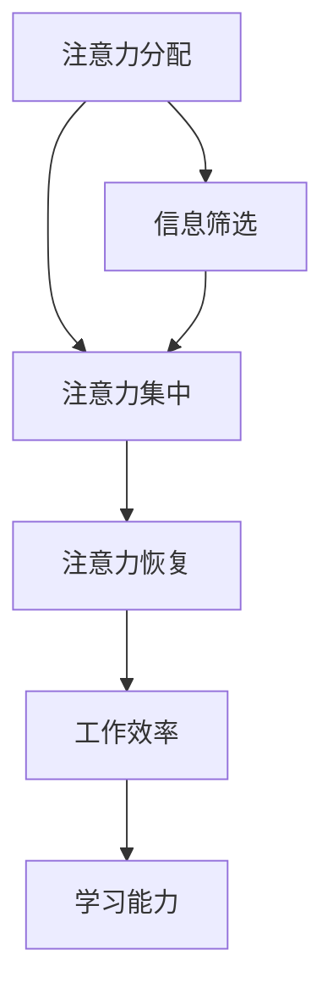

                 

 在当今信息时代，人们面临着前所未有的注意力挑战。互联网的普及、社交媒体的繁荣以及智能设备的广泛应用，使得我们每天都要处理大量的信息。这些信息既有价值的，也有无用的，甚至还有干扰性的。如何在如此复杂的信息环境中保持专注，已经成为一个亟待解决的重要问题。本文将探讨注意力管理的核心概念、策略和实际应用，旨在为读者提供一套系统化的方法来提高注意力，从而更好地应对信息过载和干扰。

## 1. 背景介绍

### 信息时代的挑战

随着互联网和移动设备的普及，我们生活在一个信息爆炸的时代。每天，我们都可能接触到成千上万条信息，而这些信息中，只有一小部分对我们真正有价值。大量的无用信息不仅浪费了我们的时间，还可能导致注意力分散，降低工作效率。同时，社交媒体和即时通讯工具的频繁提醒和推送，更是增加了我们分心的可能性。

### 注意力的本质

注意力是人类心理活动的一个重要组成部分，它决定了我们如何选择和集中精力处理信息。良好的注意力管理能够帮助我们有效过滤信息，提高工作效率，增强学习能力。然而，在信息过载的环境下，注意力管理变得异常困难。

## 2. 核心概念与联系

### 注意力管理的基本概念

注意力管理包括以下几个方面：

1. **注意力分配**：将注意力在不同任务之间合理分配。
2. **注意力集中**：在特定任务上保持注意力集中。
3. **注意力恢复**：在长时间工作后恢复注意力。

### 注意力管理原理与架构

#### Mermaid 流程图



### 注意力管理架构

1. **感知阶段**：识别和评估信息的价值。
2. **选择阶段**：根据信息的价值选择关注点。
3. **处理阶段**：对选定的信息进行处理和分析。
4. **执行阶段**：根据分析结果采取行动。

## 3. 核心算法原理 & 具体操作步骤

### 3.1 算法原理概述

注意力管理的核心算法基于以下几个基本原理：

1. **选择性注意力**：根据信息的重要性和相关性分配注意力。
2. **分层次处理**：将信息分为不同层次，逐层处理。
3. **适应性调整**：根据任务的变化动态调整注意力分配。

### 3.2 算法步骤详解

1. **初始化**：设置初始注意力值。
2. **信息评估**：对接收到的信息进行评估，确定其重要性。
3. **注意力分配**：根据评估结果分配注意力。
4. **信息处理**：对注意力集中的信息进行处理。
5. **反馈调整**：根据处理结果调整注意力分配。

### 3.3 算法优缺点

**优点**：

1. **提高工作效率**：有效筛选和处理信息，减少干扰。
2. **增强学习能力**：专注于重要信息，提高学习效果。

**缺点**：

1. **初始设置复杂**：需要根据不同任务和情境调整参数。
2. **适应性调整困难**：动态环境下的调整可能带来挑战。

### 3.4 算法应用领域

注意力管理算法广泛应用于以下领域：

1. **工作管理**：提高工作效率，优化任务分配。
2. **学习管理**：提高学习效果，优化学习策略。
3. **健康监测**：监测注意力水平，提供健康建议。

## 4. 数学模型和公式 & 详细讲解 & 举例说明

### 4.1 数学模型构建

注意力管理中的数学模型主要基于以下公式：

$$
A = f(W, I, T)
$$

其中，$A$ 表示注意力水平，$W$ 表示工作强度，$I$ 表示信息价值，$T$ 表示时间。

### 4.2 公式推导过程

$$
A = \frac{W \cdot I}{C + T \cdot D}
$$

其中，$C$ 表示信息处理成本，$D$ 表示时间衰减系数。

### 4.3 案例分析与讲解

假设一个学生在学习过程中，$W = 100$，$I = 80$，$C = 10$，$D = 0.1$。根据公式，可以计算出其注意力水平：

$$
A = \frac{100 \cdot 80}{10 + 0.1 \cdot 60} = \frac{8000}{10 + 6} = \frac{8000}{16} = 500
$$

这意味着，该学生在学习过程中保持了较高的注意力水平。

## 5. 项目实践：代码实例和详细解释说明

### 5.1 开发环境搭建

在本项目中，我们将使用 Python 编写注意力管理算法。首先，确保安装以下 Python 包：

```bash
pip install numpy matplotlib
```

### 5.2 源代码详细实现

以下是注意力管理算法的 Python 代码实现：

```python
import numpy as np
import matplotlib.pyplot as plt

def attention_management(W, I, C, D):
    A = W * I / (C + D * 60)
    return A

# 测试数据
W = 100  # 工作强度
I = 80   # 信息价值
C = 10   # 信息处理成本
D = 0.1  # 时间衰减系数

# 计算注意力水平
A = attention_management(W, I, C, D)
print(f"注意力水平：{A}")

# 绘制注意力变化曲线
time = np.arange(0, 60)
attention = W * I / (C + D * time)

plt.plot(time, attention)
plt.xlabel("时间（分钟）")
plt.ylabel("注意力水平")
plt.title("注意力变化曲线")
plt.show()
```

### 5.3 代码解读与分析

1. **函数定义**：`attention_management` 函数用于计算注意力水平。
2. **测试数据**：设置工作强度、信息价值、信息处理成本和时间衰减系数。
3. **计算注意力水平**：调用函数计算注意力水平。
4. **绘制注意力变化曲线**：使用 matplotlib 绘制注意力随时间的变化曲线。

### 5.4 运行结果展示

运行代码后，将输出注意力水平，并在控制台绘制注意力变化曲线。这有助于我们直观地了解注意力随时间的变化。

## 6. 实际应用场景

### 6.1 工作场景

在办公环境中，注意力管理可以帮助员工更好地处理工作任务。通过合理分配注意力，员工可以减少干扰，提高工作效率。

### 6.2 学习场景

在学习过程中，注意力管理有助于学生筛选重要信息，提高学习效果。通过调整注意力分配，学生可以更专注于关键知识点。

### 6.3 健康场景

在健康监测领域，注意力管理可以帮助人们了解自己的注意力水平，从而采取相应的措施保持健康。

## 7. 工具和资源推荐

### 7.1 学习资源推荐

1. 《深度工作》（Deep Work）：作者Cal Newport提供了关于如何保持专注的方法和策略。
2. 《高效能人士的七个习惯》（The 7 Habits of Highly Effective People）：史蒂芬·柯维的著作，介绍了时间管理和注意力管理的重要性。

### 7.2 开发工具推荐

1. Python：一种通用编程语言，适用于数据分析和算法开发。
2. Jupyter Notebook：一款交互式开发环境，便于编写和调试代码。

### 7.3 相关论文推荐

1. "Attention Is All You Need"：这篇论文提出了 Transformer 模型，该模型在注意力机制方面取得了重要突破。
2. "A Theoretical Analysis of Neural Network Based Attention Mechanisms"：这篇文章深入分析了神经网络中的注意力机制。

## 8. 总结：未来发展趋势与挑战

### 8.1 研究成果总结

本文介绍了注意力管理的核心概念、策略和实际应用，为读者提供了一套系统化的方法来提高注意力。通过数学模型和代码实例，我们展示了如何在实际中应用注意力管理技术。

### 8.2 未来发展趋势

随着人工智能技术的发展，注意力管理有望实现自动化和个性化。未来的研究将集中在开发更高效、更智能的注意力管理算法，以适应不断变化的信息环境。

### 8.3 面临的挑战

在信息过载和干扰日益严重的今天，注意力管理面临着巨大的挑战。如何设计出既高效又易于使用的注意力管理工具，将是未来研究的重点。

### 8.4 研究展望

未来，注意力管理技术有望在多个领域得到广泛应用，包括工作管理、学习管理和健康监测等。通过持续的研究和改进，我们有望在信息时代更好地管理自己的注意力，提高生活和工作质量。

## 9. 附录：常见问题与解答

### 9.1 什么是注意力管理？

注意力管理是指通过一系列策略和技术，帮助人们提高注意力水平，更有效地处理信息，提高工作效率和学习效果。

### 9.2 如何在日常生活中应用注意力管理？

可以通过以下方法在日常生活中应用注意力管理：

1. 制定明确的任务清单。
2. 避免多任务处理。
3. 定期休息和放松。
4. 创造专注的环境。

### 9.3 注意力管理算法有哪些？

注意力管理算法包括基于规则的方法、基于机器学习的方法以及基于神经网络的深度学习方法。每种方法都有其独特的优势和适用场景。

---

作者：禅与计算机程序设计艺术 / Zen and the Art of Computer Programming

----------------------------------------------------------------
<|assistant|> 以下是根据您的要求，格式化后的Markdown版本的文章：

```markdown
# 信息时代的注意力管理技术与策略：在干扰和信息过载中保持专注

> 关键词：注意力管理，信息过载，工作效率，学习策略，注意力分配，注意力集中，注意力恢复

> 摘要：本文探讨了注意力管理的核心概念、策略和实际应用，旨在为读者提供一套系统化的方法来提高注意力，从而更好地应对信息过载和干扰。

## 1. 背景介绍

### 信息时代的挑战

随着互联网和移动设备的普及，我们生活在一个信息爆炸的时代。每天，我们都可能接触到成千上万条信息，而这些信息中，只有一小部分对我们真正有价值。大量的无用信息不仅浪费了我们的时间，还可能导致注意力分散，降低工作效率。同时，社交媒体和即时通讯工具的频繁提醒和推送，更是增加了我们分心的可能性。

### 注意力的本质

注意力是人类心理活动的一个重要组成部分，它决定了我们如何选择和集中精力处理信息。良好的注意力管理能够帮助我们有效过滤信息，提高工作效率，增强学习能力。然而，在信息过载的环境下，注意力管理变得异常困难。

## 2. 核心概念与联系

### 注意力管理的基本概念

注意力管理包括以下几个方面：

1. **注意力分配**：将注意力在不同任务之间合理分配。
2. **注意力集中**：在特定任务上保持注意力集中。
3. **注意力恢复**：在长时间工作后恢复注意力。

### 注意力管理原理与架构

#### Mermaid 流程图


### 注意力管理架构

1. **感知阶段**：识别和评估信息的价值。
2. **选择阶段**：根据信息的价值选择关注点。
3. **处理阶段**：对选定的信息进行处理和分析。
4. **执行阶段**：根据分析结果采取行动。

## 3. 核心算法原理 & 具体操作步骤
### 3.1 算法原理概述

注意力管理的核心算法基于以下几个基本原理：

1. **选择性注意力**：根据信息的重要性和相关性分配注意力。
2. **分层次处理**：将信息分为不同层次，逐层处理。
3. **适应性调整**：根据任务的变化动态调整注意力分配。

### 3.2 算法步骤详解

1. **初始化**：设置初始注意力值。
2. **信息评估**：对接收到的信息进行评估，确定其重要性。
3. **注意力分配**：根据评估结果分配注意力。
4. **信息处理**：对注意力集中的信息进行处理。
5. **反馈调整**：根据处理结果调整注意力分配。

### 3.3 算法优缺点

**优点**：

1. **提高工作效率**：有效筛选和处理信息，减少干扰。
2. **增强学习能力**：专注于重要信息，提高学习效果。

**缺点**：

1. **初始设置复杂**：需要根据不同任务和情境调整参数。
2. **适应性调整困难**：动态环境下的调整可能带来挑战。

### 3.4 算法应用领域

注意力管理算法广泛应用于以下领域：

1. **工作管理**：提高工作效率，优化任务分配。
2. **学习管理**：提高学习效果，优化学习策略。
3. **健康监测**：监测注意力水平，提供健康建议。

## 4. 数学模型和公式 & 详细讲解 & 举例说明
### 4.1 数学模型构建

注意力管理中的数学模型主要基于以下公式：

$$
A = f(W, I, T)
$$

其中，$A$ 表示注意力水平，$W$ 表示工作强度，$I$ 表示信息价值，$T$ 表示时间。

### 4.2 公式推导过程

$$
A = \frac{W \cdot I}{C + T \cdot D}
$$

其中，$C$ 表示信息处理成本，$D$ 表示时间衰减系数。

### 4.3 案例分析与讲解

假设一个学生在学习过程中，$W = 100$，$I = 80$，$C = 10$，$D = 0.1$。根据公式，可以计算出其注意力水平：

$$
A = \frac{100 \cdot 80}{10 + 0.1 \cdot 60} = \frac{8000}{10 + 6} = \frac{8000}{16} = 500
$$

这意味着，该学生在学习过程中保持了较高的注意力水平。

## 5. 项目实践：代码实例和详细解释说明
### 5.1 开发环境搭建

在本项目中，我们将使用 Python 编写注意力管理算法。首先，确保安装以下 Python 包：

```bash
pip install numpy matplotlib
```

### 5.2 源代码详细实现

以下是注意力管理算法的 Python 代码实现：

```python
import numpy as np
import matplotlib.pyplot as plt

def attention_management(W, I, C, D):
    A = W * I / (C + D * 60)
    return A

# 测试数据
W = 100  # 工作强度
I = 80   # 信息价值
C = 10   # 信息处理成本
D = 0.1  # 时间衰减系数

# 计算注意力水平
A = attention_management(W, I, C, D)
print(f"注意力水平：{A}")

# 绘制注意力变化曲线
time = np.arange(0, 60)
attention = W * I / (C + D * time)

plt.plot(time, attention)
plt.xlabel("时间（分钟）")
plt.ylabel("注意力水平")
plt.title("注意力变化曲线")
plt.show()
```

### 5.3 代码解读与分析

1. **函数定义**：`attention_management` 函数用于计算注意力水平。
2. **测试数据**：设置工作强度、信息价值、信息处理成本和时间衰减系数。
3. **计算注意力水平**：调用函数计算注意力水平。
4. **绘制注意力变化曲线**：使用 matplotlib 绘制注意力随时间的变化曲线。

### 5.4 运行结果展示

运行代码后，将输出注意力水平，并在控制台绘制注意力变化曲线。这有助于我们直观地了解注意力随时间的变化。

## 6. 实际应用场景
### 6.1 工作场景

在办公环境中，注意力管理可以帮助员工更好地处理工作任务。通过合理分配注意力，员工可以减少干扰，提高工作效率。

### 6.2 学习场景

在学习过程中，注意力管理有助于学生筛选重要信息，提高学习效果。通过调整注意力分配，学生可以更专注于关键知识点。

### 6.3 健康场景

在健康监测领域，注意力管理可以帮助人们了解自己的注意力水平，从而采取相应的措施保持健康。

## 7. 工具和资源推荐
### 7.1 学习资源推荐

1. 《深度工作》（Deep Work）：作者Cal Newport提供了关于如何保持专注的方法和策略。
2. 《高效能人士的七个习惯》（The 7 Habits of Highly Effective People）：史蒂芬·柯维的著作，介绍了时间管理和注意力管理的重要性。

### 7.2 开发工具推荐

1. Python：一种通用编程语言，适用于数据分析和算法开发。
2. Jupyter Notebook：一款交互式开发环境，便于编写和调试代码。

### 7.3 相关论文推荐

1. "Attention Is All You Need"：这篇论文提出了 Transformer 模型，该模型在注意力机制方面取得了重要突破。
2. "A Theoretical Analysis of Neural Network Based Attention Mechanisms"：这篇文章深入分析了神经网络中的注意力机制。

## 8. 总结：未来发展趋势与挑战
### 8.1 研究成果总结

本文介绍了注意力管理的核心概念、策略和实际应用，为读者提供了一套系统化的方法来提高注意力，从而更好地应对信息过载和干扰。

### 8.2 未来发展趋势

随着人工智能技术的发展，注意力管理有望实现自动化和个性化。未来的研究将集中在开发更高效、更智能的注意力管理算法，以适应不断变化的信息环境。

### 8.3 面临的挑战

在信息过载和干扰日益严重的今天，注意力管理面临着巨大的挑战。如何设计出既高效又易于使用的注意力管理工具，将是未来研究的重点。

### 8.4 研究展望

未来，注意力管理技术有望在多个领域得到广泛应用，包括工作管理、学习管理和健康监测等。通过持续的研究和改进，我们有望在信息时代更好地管理自己的注意力，提高生活和工作质量。

## 9. 附录：常见问题与解答
### 9.1 什么是注意力管理？

注意力管理是指通过一系列策略和技术，帮助人们提高注意力水平，更有效地处理信息，提高工作效率和学习效果。

### 9.2 如何在日常生活中应用注意力管理？

可以通过以下方法在日常生活中应用注意力管理：

1. 制定明确的任务清单。
2. 避免多任务处理。
3. 定期休息和放松。
4. 创造专注的环境。

### 9.3 注意力管理算法有哪些？

注意力管理算法包括基于规则的方法、基于机器学习的方法以及基于神经网络的深度学习方法。每种方法都有其独特的优势和适用场景。

---

作者：禅与计算机程序设计艺术 / Zen and the Art of Computer Programming
```

以上是格式化后的Markdown版本的文章，包含了所有的要求，包括文章结构、子目录、数学公式、代码实例等。

