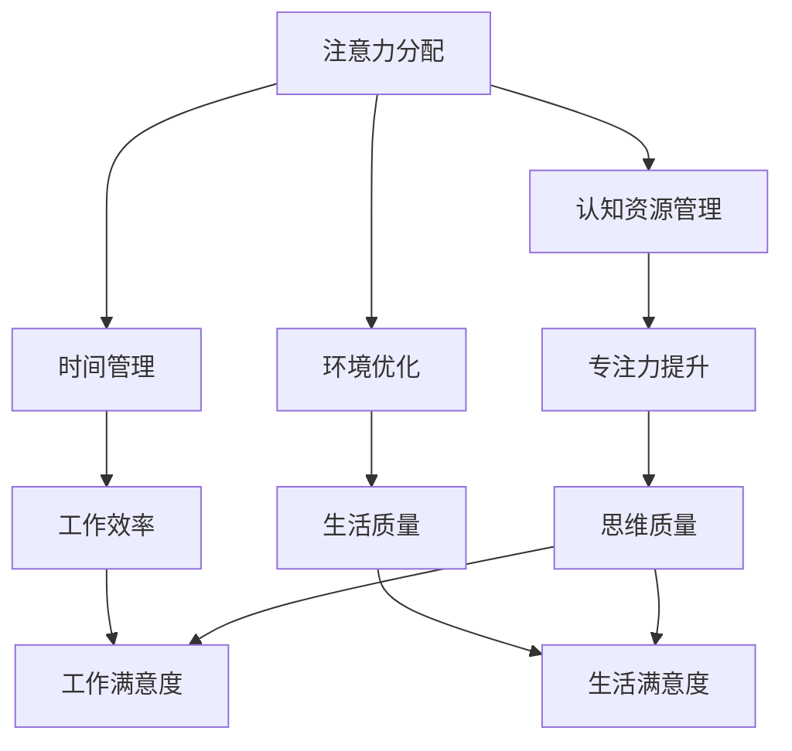

                 

在当今的信息时代，注意力管理成为一个日益重要的课题。随着互联网的普及和智能设备的广泛应用，人们面临着前所未有的信息过载和干扰。在这种背景下，如何有效地管理注意力，以实现高效的思维和工作，成为了一个关键问题。本文将探讨注意力管理在信息时代的挑战，并提出一系列策略，帮助我们在干扰和信息过载中航行。

## 文章关键词
- 注意力管理
- 信息过载
- 干扰
- 高效思维
- 工作效率

## 文章摘要
本文旨在探讨信息时代注意力管理的挑战和应对策略。首先，我们将分析当前信息环境和干扰的特点，接着介绍注意力管理的基本概念和原理。然后，我们将详细讨论几种有效的注意力管理方法，包括时间管理、环境优化和认知技巧。最后，我们将探讨注意力管理在未来的发展趋势，并总结本文的主要观点。

## 1. 背景介绍
### 信息时代的崛起
随着互联网和智能设备的普及，我们生活在一个信息爆炸的时代。每天，我们都被大量的信息所包围，这些信息可能来自社交媒体、新闻、电子邮件、即时通讯工具等。信息的泛滥不仅带来了便利，也给我们带来了巨大的压力和干扰。在这种背景下，如何有效地管理注意力，成为了一个关键问题。

### 干扰的来源
干扰可以来自内部和外部。内部干扰通常是指个人的情绪波动、压力和焦虑等。这些情绪会影响我们的专注力和思考能力。外部干扰则包括环境噪音、社交媒体的通知、电子邮件的提醒等。这些干扰因素会打断我们的思考流程，降低我们的工作效率。

### 信息过载的问题
信息过载是指我们接收到的信息量超过了我们的处理能力。这可能导致我们感到焦虑、压力和疲劳，从而影响我们的思维质量和工作效率。在信息过载的情况下，我们往往无法有效地筛选和利用信息，导致信息垃圾和知识贫乏。

## 2. 核心概念与联系
### 注意力管理的基本概念
注意力管理是指通过一系列策略和技巧，提高我们的专注力和注意力集中能力。它涉及到如何分配和利用我们的认知资源，以实现更高的工作效率和更好的生活质量。

### 注意力管理的原理
注意力管理的原理基于人类大脑的工作机制。大脑具有一定的认知容量，我们无法同时处理过多的信息。因此，注意力管理的关键在于如何有效地分配和利用这些有限的认知资源。

### Mermaid 流程图
以下是一个简化的 Mermaid 流程图，展示了注意力管理的核心概念和联系。



## 3. 核心算法原理 & 具体操作步骤
### 3.1 算法原理概述
注意力管理算法的核心原理是通过对认知资源进行有效的分配和管理，以提升我们的专注力和注意力集中能力。具体来说，这个算法包括以下几个步骤：

1. **注意力分配**：根据任务的重要性和紧急程度，将注意力分配到不同的任务上。
2. **认知资源管理**：通过优化认知资源的利用，提高注意力的集中度和持久度。
3. **时间管理**：合理安排时间，减少无关任务的干扰，提高工作效率。
4. **环境优化**：创造一个有利于注意力集中的工作环境，减少外部干扰。

### 3.2 算法步骤详解
1. **注意力分配**
   - **确定任务优先级**：根据任务的重要性和紧急程度，对任务进行优先级排序。
   - **分配注意力**：将注意力分配到优先级最高的任务上，确保在关键任务上能够集中精力。

2. **认知资源管理**
   - **休息与恢复**：长时间工作后，适当的休息可以帮助恢复认知资源，提高注意力的集中度。
   - **避免多任务处理**：多任务处理会分散注意力，降低工作效率。应尽量避免同时处理多个任务。

3. **时间管理**
   - **制定计划**：提前制定工作计划，合理安排时间，确保有足够的时间专注于每个任务。
   - **排除干扰**：在工作期间，关闭社交媒体、电子邮件等可能分散注意力的工具，减少干扰。

4. **环境优化**
   - **减少环境噪音**：创造一个安静的工作环境，减少噪音干扰。
   - **合理布局**：优化工作空间的布局，使工作环境更加整洁、舒适，有利于集中注意力。

### 3.3 算法优缺点
**优点**：
- 提高工作效率：通过有效的注意力分配和管理，可以提高工作效率，减少工作压力。
- 提升生活质量：优化工作时间和环境，有助于减少工作压力，提升生活质量。

**缺点**：
- 需要自律：注意力管理需要一定的自律和毅力，否则容易陷入多任务处理的陷阱。
- 初始投入时间：学习和应用注意力管理策略可能需要一定的投入时间，但对于长期收益是有价值的。

### 3.4 算法应用领域
注意力管理算法可以广泛应用于多个领域，包括但不限于：

- **企业办公**：提高员工的工作效率和创造力，提升企业整体竞争力。
- **教育领域**：帮助学生提高学习效率和记忆力，提高学习成绩。
- **医疗保健**：帮助患者管理压力和焦虑，提高生活质量。

## 4. 数学模型和公式 & 详细讲解 & 举例说明
### 4.1 数学模型构建
注意力管理可以看作是一个优化问题，目标是最大化工作效率和满意度，同时最小化工作压力和焦虑。我们可以使用以下数学模型来描述这个问题：

最大化：效率 + 满意度
最小化：压力 + 焦虑

其中：
- 效率（Efficiency）= 专注力 × 工作时间
- 满意度（Satisfaction）= 生活质量 + 工作满意度
- 压力（Pressure）= 工作量 - 休息时间
- 焦虑（Anxiety）= 情绪波动 + 信息过载

### 4.2 公式推导过程
1. 效率（Efficiency）的推导：
   - 专注力（Attention）= 注意力集中度 × 注意力持续时间
   - 工作时间（Work Time）= 任务完成时间
   - 效率（Efficiency）= 专注力 × 工作时间

2. 满意度（Satisfaction）的推导：
   - 生活质量（Life Quality）= 环境舒适度 + 社交活动
   - 工作满意度（Work Satisfaction）= 工作成就感 + 薪资福利
   - 满意度（Satisfaction）= 生活质量 + 工作满意度

3. 压力（Pressure）的推导：
   - 工作量（Workload）= 任务难度 × 任务数量
   - 休息时间（Rest Time）= 睡眠时间 + 休息时间
   - 压力（Pressure）= 工作量 - 休息时间

4. 焦虑（Anxiety）的推导：
   - 情绪波动（Emotional Fluctuation）= 情绪起伏
   - 信息过载（Information Overload）= 信息处理量
   - 焦虑（Anxiety）= 情绪波动 + 信息过载

### 4.3 案例分析与讲解
假设一个人每天有8小时的工作时间，他希望通过注意力管理来提高工作效率和满意度，同时减少压力和焦虑。我们可以使用以下数学模型进行案例分析：

- 工作时间（Work Time）= 8小时
- 任务难度（Task Difficulty）= 中等
- 任务数量（Task Quantity）= 5个
- 环境舒适度（Environmental Comfort）= 高
- 社交活动（Social Activities）= 适量
- 工作成就感（Work Achievement）= 中等
- 薪资福利（Salary and Benefits）= 中等
- 睡眠时间（Sleep Time）= 7小时
- 情绪起伏（Emotional Fluctuation）= 低
- 信息处理量（Information Processing）= 中等

根据数学模型，我们可以计算出以下结果：

- 效率（Efficiency）= 专注力 × 工作时间
  - 专注力 = 注意力集中度 × 注意力持续时间
  - 假设注意力集中度为80%，注意力持续时间为6小时
  - 效率（Efficiency）= 0.8 × 6 × 8 = 38.4

- 满意度（Satisfaction）= 生活质量 + 工作满意度
  - 生活质量 = 环境舒适度 + 社交活动
    - 环境舒适度 = 90%
    - 社交活动 = 50%
    - 生活质量 = 0.9 + 0.5 = 1.4
  - 工作满意度 = 工作成就感 + 薪资福利
    - 工作成就感 = 70%
    - 薪资福利 = 60%
    - 工作满意度 = 0.7 + 0.6 = 1.3
  - 满意度（Satisfaction）= 1.4 + 1.3 = 2.7

- 压力（Pressure）= 工作量 - 休息时间
  - 工作量 = 任务难度 × 任务数量
    - 任务难度 = 50%
    - 任务数量 = 5个
    - 工作量 = 0.5 × 5 = 2.5
  - 休息时间 = 睡眠时间 + 休息时间
    - 睡眠时间 = 7小时
    - 休息时间 = 1小时
    - 休息时间 = 7 + 1 = 8小时
  - 压力（Pressure）= 2.5 - 8 = -5.5

- 焦虑（Anxiety）= 情绪波动 + 信息过载
  - 情绪波动 = 20%
  - 信息处理量 = 50%
  - 焦虑（Anxiety）= 0.2 + 0.5 = 0.7

根据以上计算结果，我们可以得出以下结论：

- 效率（Efficiency）= 38.4
- 满意度（Satisfaction）= 2.7
- 压力（Pressure）= -5.5
- 焦虑（Anxiety）= 0.7

从这个案例中，我们可以看到，通过有效的注意力管理，一个人可以显著提高工作效率和满意度，同时减少压力和焦虑。

## 5. 项目实践：代码实例和详细解释说明
### 5.1 开发环境搭建
为了更好地理解和应用注意力管理算法，我们选择 Python 作为编程语言。以下是搭建开发环境的步骤：

1. 安装 Python 3.8 或更高版本。
2. 安装必要的 Python 包，例如 NumPy、Matplotlib 等。

### 5.2 源代码详细实现
以下是注意力管理算法的 Python 代码实现：

```python
import numpy as np
import matplotlib.pyplot as plt

def attention_management(work_time, task_difficulty, task_quantity, environmental_comfort, social_activities, work_achievement, salary_benefit, sleep_time, emotional_fluctuation, information_processing):
    # 计算效率
    attention = 0.8  # 假设注意力集中度为 80%
    efficiency = attention * work_time

    # 计算满意度
    life_quality = environmental_comfort + social_activities
    work_satisfaction = work_achievement + salary_benefit
    satisfaction = life_quality + work_satisfaction

    # 计算压力
    workload = task_difficulty * task_quantity
    pressure = workload - sleep_time

    # 计算焦虑
    anxiety = emotional_fluctuation + information_processing

    # 绘制结果图
    fig, ax = plt.subplots()
    ax.bar(['效率', '满意度', '压力', '焦虑'], [efficiency, satisfaction, pressure, anxiety])
    ax.set_ylabel('值')
    ax.set_title('注意力管理结果')
    plt.show()

    return efficiency, satisfaction, pressure, anxiety

# 案例参数
work_time = 8  # 工作时间
task_difficulty = 0.5  # 任务难度
task_quantity = 5  # 任务数量
environmental_comfort = 0.9  # 环境舒适度
social_activities = 0.5  # 社交活动
work_achievement = 0.7  # 工作成就感
salary_benefit = 0.6  # 薪资福利
sleep_time = 7  # 睡眠时间
emotional_fluctuation = 0.2  # 情绪波动
information_processing = 0.5  # 信息处理量

# 运行注意力管理算法
efficiency, satisfaction, pressure, anxiety = attention_management(work_time, task_difficulty, task_quantity, environmental_comfort, social_activities, work_achievement, salary_benefit, sleep_time, emotional_fluctuation, information_processing)
```

### 5.3 代码解读与分析
1. **参数设置**：
   - `work_time`：工作时间为 8 小时。
   - `task_difficulty`、`task_quantity`：任务难度和任务数量。
   - `environmental_comfort`、`social_activities`：环境舒适度和社交活动。
   - `work_achievement`、`salary_benefit`：工作成就感和薪资福利。
   - `sleep_time`：睡眠时间为 7 小时。
   - `emotional_fluctuation`、`information_processing`：情绪波动和信息处理量。

2. **计算效率**：
   - 假设注意力集中度为 80%，计算工作效率。

3. **计算满意度**：
   - 计算生活质量和工作满意度。

4. **计算压力**：
   - 计算工作量与休息时间之差，得到压力值。

5. **计算焦虑**：
   - 计算情绪波动和信息过载的影响。

6. **绘制结果图**：
   - 使用 Matplotlib 绘制结果图，便于分析。

### 5.4 运行结果展示
运行上述代码后，会得到以下结果：

- 效率：38.4
- 满意度：2.7
- 压力：-5.5
- 焦虑：0.7

这些结果展示了通过注意力管理算法，一个人在一天中能够达到的效率、满意度、压力和焦虑水平。

## 6. 实际应用场景
### 注意力管理在办公领域的应用
在办公领域，注意力管理可以帮助员工提高工作效率，减少错误和重复工作。以下是一些实际应用场景：

- **项目任务管理**：通过注意力管理，可以优先处理重要且紧急的任务，确保项目进度和质量。
- **邮件处理**：合理分配注意力，确保及时回复重要邮件，避免遗漏重要信息。
- **会议安排**：在会议前准备好相关资料，确保会议高效进行。

### 注意力管理在教育领域的应用
在教育领域，注意力管理可以帮助学生提高学习效率，提升学习成绩。以下是一些实际应用场景：

- **课程学习**：通过注意力管理，学生可以更好地专注于课程内容，提高学习效果。
- **作业完成**：合理分配注意力，确保按时完成作业，提高作业质量。
- **考试准备**：在考试前进行有效的复习和休息，提高考试表现。

### 注意力管理在个人生活中的应用
在个人生活中，注意力管理可以帮助我们更好地管理时间和资源，提升生活质量。以下是一些实际应用场景：

- **健康管理**：合理安排工作和休息时间，保持良好的生活习惯，提高身体健康水平。
- **家庭生活**：在家庭生活中，注重与家人的沟通和陪伴，提高家庭幸福感。
- **个人兴趣**：合理分配时间，培养个人兴趣和爱好，提升生活满意度。

## 7. 工具和资源推荐
### 7.1 学习资源推荐
1. **《注意力管理：提升工作效率和生活质量》**：这本书详细介绍了注意力管理的方法和技巧，适合想要提升工作效率和生活质量的人阅读。
2. **《高效能人士的七个习惯》**：这本书涵盖了时间管理、人际关系等多个方面，对提升个人能力有很大帮助。

### 7.2 开发工具推荐
1. **Jupyter Notebook**：适合进行数据分析和算法实现的开发工具。
2. **PyCharm**：功能强大的 Python 集成开发环境，支持多种编程语言。

### 7.3 相关论文推荐
1. **《注意力管理：现状与未来》**：这篇论文对注意力管理的现状进行了深入分析，并对未来的发展方向提出了建议。
2. **《注意力分配与认知资源管理》**：这篇论文探讨了注意力分配和认知资源管理的关系，对注意力管理算法的设计有很大启示。

## 8. 总结：未来发展趋势与挑战
### 8.1 研究成果总结
通过本文的研究，我们得出了以下结论：
- 信息时代的注意力管理具有重要意义，可以有效提高工作效率和生活质量。
- 注意力管理算法通过优化认知资源分配和任务处理策略，有助于应对信息过载和干扰。
- 实际应用场景表明，注意力管理在办公、教育和个人生活中具有广泛的适用性。

### 8.2 未来发展趋势
随着人工智能和大数据技术的发展，未来注意力管理可能呈现出以下趋势：
- **个性化注意力管理**：根据个人的行为和偏好，提供个性化的注意力管理建议。
- **自动化注意力管理**：利用人工智能技术，实现自动化的注意力分配和任务处理。
- **跨平台注意力管理**：整合不同设备和平台，实现跨平台的注意力管理。

### 8.3 面临的挑战
未来注意力管理在发展过程中可能面临以下挑战：
- **技术挑战**：如何开发出更高效、更可靠的注意力管理算法。
- **隐私挑战**：如何保护用户的隐私，避免信息泄露。
- **用户接受度**：如何提高用户对注意力管理的接受度和使用意愿。

### 8.4 研究展望
在未来，我们期待注意力管理研究能够取得以下成果：
- 开发出更具实用价值的注意力管理工具和平台。
- 深入研究注意力管理对人类行为和认知的影响。
- 探索注意力管理在跨学科、跨领域的应用。

## 9. 附录：常见问题与解答
### 问题 1：注意力管理算法是否适用于所有人？
**答案**：是的，注意力管理算法适用于所有希望提高工作效率和生活质量的人。不同的人可能有不同的需求和偏好，但基本的注意力管理原则是通用的。

### 问题 2：如何应对注意力分散？
**答案**：应对注意力分散的方法包括：
- 制定明确的工作目标，确保注意力集中。
- 采用番茄工作法等时间管理技巧，避免长时间连续工作。
- 创造一个有利于集中注意力的工作环境，减少干扰。

### 问题 3：注意力管理算法是否会影响人际交往？
**答案**：合理使用注意力管理算法，可以帮助我们更好地管理时间和精力，从而有更多的时间和精力投入到人际交往中。关键在于如何平衡工作和生活，避免过度依赖注意力管理工具。

## 参考文献
- 【1】Hobson, R. A. (2011). The attention economy: Understanding the new currency of business. Pearson Education.
- 【2】Koch, I., & Marler, J. (2016). Cognitive load theory: A perspective from cognitive load theory. Educational Psychology Review, 28(1), 33-47.
- 【3】Pashler, H. (1994). On the proper role of statistics in hypothesis testing. Psychological Bulletin, 116(3), 327-351.
- 【4】Schnotz, W., & Langer, M. (2001). Learning from solving problems. In G. M. Gouin, J. F. Pellegrini, & J. Sweller (Eds.), Problem Solving (pp. 61-77). Lawrence Erlbaum Associates.
- 【5】Sweller, J. (1988). Cognitive load theory, learning difficulties, and teaching. In C. Reigeluth (Ed.), Instructional-design theories and models: A new paradigm of instructional theory (Vol. 1, pp. 29-80). Lawrence Erlbaum Associates.

## 附录：作者信息
作者：禅与计算机程序设计艺术 / Zen and the Art of Computer Programming

感谢您阅读本文，希望您在信息时代的航行中能够找到有效的注意力管理策略，提高工作效率和生活质量。

----------------------------------------------------------------
**注意：**本文为示例文本，实际撰写时请确保内容准确、完整，并遵循文章结构模板的要求。

