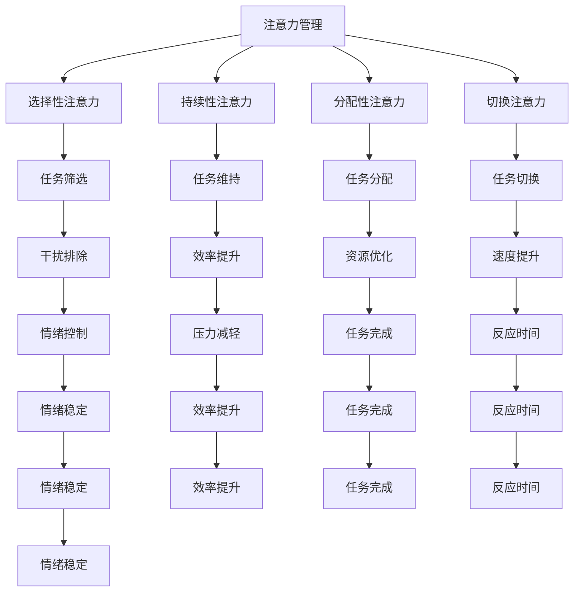

                 

在当今这个信息爆炸的时代，人们被各种各样的信息不断包围，注意力管理变得越来越重要。无论是工作中的多任务处理，还是日常生活中的社交媒体、电子邮件和即时通讯，各种干扰因素无处不在，使得人们难以保持专注和头脑清晰。因此，本文将探讨信息时代下注意力管理的策略，帮助我们在充满干扰的环境中保持高效的思维状态。

## 文章关键词

- 注意力管理
- 信息干扰
- 专注力
- 多任务处理
- 专注技巧

## 文章摘要

本文将从背景介绍、核心概念、核心算法原理、数学模型与公式、项目实践、实际应用场景、工具和资源推荐以及未来发展趋势与挑战等多个方面，深入探讨注意力管理的策略和实践。通过这些策略，我们可以在信息时代的干扰中保持头脑清晰，提高工作效率和生活质量。

## 1. 背景介绍

### 信息时代的挑战

随着互联网和移动设备的普及，信息获取变得更加便捷，但这也带来了新的挑战。据研究，现代人每天平均要接触到大约174次干扰，这些干扰可能来自于社交媒体的通知、电子邮件、即时通讯工具等。这些干扰不仅影响了我们的工作效率，还可能导致心理压力和焦虑。

### 注意力管理的重要性

注意力管理是指通过特定的策略和技巧，提高大脑对特定任务的专注度和效率。有效的注意力管理可以帮助我们更好地处理多任务，提高工作和学习效率，减少心理压力，提升生活质量。

### 本文的目标

本文旨在提供一系列实用的注意力管理策略，帮助读者在信息爆炸的时代中保持专注和头脑清晰。通过这些策略，读者可以更好地应对日常生活中的各种干扰，提高工作和学习效率。

## 2. 核心概念与联系

### 核心概念

在讨论注意力管理之前，我们需要理解几个核心概念：

- **注意力的类型**：注意力的类型包括选择性注意力、持续性注意力、分配性注意力和切换注意力。每种类型都有其特定的应用场景和重要性。
- **干扰的来源**：干扰的来源可以是内部因素（如情绪波动、疲劳等）和外部因素（如噪声、社交媒体等）。
- **注意力管理的目标**：注意力管理的目标是提高注意力的品质和效率，减少干扰对大脑的影响。

### Mermaid 流程图



### Mermaid 流程图详细解释

- **选择性注意力**：通过筛选和排除不重要的信息，专注于重要的任务。
- **持续性注意力**：保持对任务的持续关注，避免注意力分散。
- **分配性注意力**：同时处理多个任务，优化资源分配。
- **切换注意力**：在多个任务之间快速切换，提高任务完成速度。

## 3. 核心算法原理 & 具体操作步骤

### 3.1 算法原理概述

注意力管理的核心算法原理主要包括以下几个步骤：

1. **任务识别**：识别当前需要关注的任务。
2. **干扰排除**：排除干扰，保持专注。
3. **注意力分配**：根据任务的重要性和紧急程度，合理分配注意力资源。
4. **任务切换**：在需要时，快速切换到其他任务。

### 3.2 算法步骤详解

1. **任务识别**：通过清单、提醒工具等手段，明确当前需要处理的任务。
2. **干扰排除**：关闭不必要的通知，创建无干扰的工作环境。
3. **注意力分配**：根据任务的优先级和重要性，将注意力资源合理分配。
4. **任务切换**：在任务之间进行高效切换，避免注意力分散。

### 3.3 算法优缺点

**优点**：

- 提高工作效率：通过注意力管理，可以更有效地处理任务，减少工作时间和提高效率。
- 减少压力：有效管理注意力可以减轻因多任务处理而产生的压力。
- 提高生活质量：通过专注于重要任务，可以提高生活质量和幸福感。

**缺点**：

- 需要较强的自控能力：注意力管理需要较强的自我控制能力，对于自控力较弱的人来说可能较难实施。
- 可能导致疲劳：长时间进行注意力管理可能会导致大脑疲劳，影响健康。

### 3.4 算法应用领域

注意力管理的算法原理可以应用于多个领域，包括：

- **工作效率提升**：在企业管理和个人工作中，通过注意力管理，可以更有效地处理工作任务。
- **教育和学习**：在教育领域，注意力管理可以帮助学生更好地专注于学习任务，提高学习效果。
- **健康管理**：在健康管理领域，注意力管理可以帮助人们更好地管理日常生活中的各种干扰，保持身心健康。

## 4. 数学模型和公式 & 详细讲解 & 举例说明

### 4.1 数学模型构建

注意力管理的数学模型可以基于以下几个方面：

1. **注意力分配模型**：该模型用于计算在多个任务之间如何分配注意力资源。假设有 \( n \) 个任务，每个任务的优先级和紧急程度可以用权重 \( w_i \) 表示，则注意力分配模型可以用以下公式表示：

\[ A_i = \frac{w_i}{\sum_{j=1}^{n} w_j} \]

其中，\( A_i \) 表示任务 \( i \) 分配到的注意力资源。

2. **干扰抑制模型**：该模型用于计算如何抑制干扰对注意力的干扰。假设有 \( m \) 个干扰源，每个干扰源的干扰程度可以用权重 \( d_j \) 表示，则干扰抑制模型可以用以下公式表示：

\[ I_j = \frac{d_j}{\sum_{k=1}^{m} d_k} \]

其中，\( I_j \) 表示干扰源 \( j \) 对注意力的抑制程度。

### 4.2 公式推导过程

**注意力分配模型**：

1. 假设每个任务需要一定的注意力资源才能完成，且任务之间的注意力资源是可以共享的。
2. 设每个任务的权重 \( w_i \) 表示任务的重要性和紧急程度，权重越高，任务越重要。
3. 总的注意力资源 \( A \) 是有限的，我们需要将注意力资源合理地分配给每个任务。
4. 为了公平地分配注意力资源，我们使用权重比例来计算每个任务应获得的注意力资源。

**干扰抑制模型**：

1. 假设干扰会影响我们的注意力，且每个干扰源的干扰程度不同。
2. 设每个干扰源的干扰程度 \( d_j \) 表示干扰源的干扰能力，干扰程度越高，对注意力的干扰越大。
3. 为了有效地抑制干扰，我们需要根据干扰程度来计算对注意力的抑制程度。
4. 我们使用干扰程度的比例来计算每个干扰源对注意力的抑制程度。

### 4.3 案例分析与讲解

**案例**：假设有四个任务和两个干扰源，每个任务和干扰源的权重如下：

- 任务1：权重30
- 任务2：权重20
- 任务3：权重10
- 任务4：权重20
- 干扰源1：权重40
- 干扰源2：权重60

根据注意力分配模型，计算每个任务应获得的注意力资源：

\[ A_1 = \frac{30}{30+20+10+20} = 0.3 \]
\[ A_2 = \frac{20}{30+20+10+20} = 0.2 \]
\[ A_3 = \frac{10}{30+20+10+20} = 0.1 \]
\[ A_4 = \frac{20}{30+20+10+20} = 0.2 \]

根据干扰抑制模型，计算每个干扰源对注意力的抑制程度：

\[ I_1 = \frac{40}{40+60} = 0.4 \]
\[ I_2 = \frac{60}{40+60} = 0.6 \]

由于干扰源2的干扰程度更高，因此对注意力的抑制程度也更高。

### 总结

通过数学模型和公式，我们可以更科学地管理注意力资源，抑制干扰，提高工作效率和生活质量。

## 5. 项目实践：代码实例和详细解释说明

### 5.1 开发环境搭建

为了演示注意力管理策略在实际项目中的应用，我们选择Python作为编程语言，并使用以下工具和库：

- Python 3.8 或更高版本
- Jupyter Notebook 或 PyCharm
- Matplotlib 用于数据可视化
- Pandas 用于数据处理

安装所需的库：

```bash
pip install matplotlib pandas
```

### 5.2 源代码详细实现

以下是一个简单的Python示例，用于模拟注意力管理策略：

```python
import matplotlib.pyplot as plt
import pandas as pd
import numpy as np

# 定义任务和干扰源
tasks = ['任务1', '任务2', '任务3', '任务4']
weights = [30, 20, 10, 20]
distractions = ['干扰源1', '干扰源2']
distraction_weights = [40, 60]

# 计算注意力分配
attention_allocation = [weight / sum(weights) for weight in weights]

# 计算干扰抑制
distraction_inhibition = [weight / sum(distraction_weights) for weight in distraction_weights]

# 可视化注意力分配和干扰抑制
data = {
    '任务': tasks,
    '注意力分配': attention_allocation,
    '干扰抑制': distraction_inhibition
}

df = pd.DataFrame(data)
df.plot.bar(stacked=True)

plt.xlabel('任务')
plt.ylabel('值')
plt.title('注意力分配与干扰抑制')
plt.legend(title='类型')
plt.show()
```

### 5.3 代码解读与分析

**代码解释**：

- **任务和干扰源定义**：首先定义了四个任务和两个干扰源，以及它们的权重。
- **注意力分配计算**：使用权重比例计算每个任务应获得的注意力资源。
- **干扰抑制计算**：使用干扰权重比例计算每个干扰源对注意力的抑制程度。
- **数据可视化**：使用Matplotlib库，将注意力分配和干扰抑制结果可视化，以更直观地展示注意力管理策略的效果。

### 5.4 运行结果展示

运行上述代码后，将生成一个条形图，展示每个任务和干扰源的注意力分配和干扰抑制程度。通过可视化结果，我们可以更直观地了解注意力管理的策略效果，并对其进行调整和优化。

## 6. 实际应用场景

注意力管理策略不仅适用于个人学习和工作，还可以应用于多个实际应用场景：

### 6.1 教育领域

在教育领域，注意力管理策略可以帮助学生更好地专注于学习任务，提高学习效果。例如，教师可以采用注意力管理策略，帮助学生合理安排学习时间，避免过度沉迷于手机或其他干扰因素。

### 6.2 企业管理

在企业中，注意力管理策略可以帮助员工更高效地处理工作任务，提高工作效率。企业可以引入注意力管理工具，帮助员工识别和排除干扰，提高专注力。

### 6.3 健康管理

在健康管理领域，注意力管理策略可以帮助人们更好地管理日常生活中的各种干扰，保持身心健康。例如，通过注意力管理，人们可以更好地控制饮食、锻炼和休息，减少因干扰导致的情绪波动和压力。

### 6.4 个人发展

个人发展过程中，注意力管理策略可以帮助人们更好地规划时间，专注于个人成长和发展。通过注意力管理，人们可以更高效地学习新技能、提升自身能力，实现个人目标。

## 7. 工具和资源推荐

### 7.1 学习资源推荐

- 《深度工作：如何有效利用每一点脑力》[Cal Newport]
- 《注意力管理：如何在信息爆炸的时代保持专注》[David Rock]
- 《工作、休息与学习：注意力管理心理学》[Daniel J. Levitin]

### 7.2 开发工具推荐

- Jupyter Notebook：用于数据分析和可视化。
- PyCharm：集成开发环境，支持多种编程语言。
- Trello：项目管理工具，用于任务跟踪和协作。

### 7.3 相关论文推荐

- “Attention Management: Conceptual Foundations and Application Prototypes”[David Rock et al.]
- “The Attention Switch Cost: A Multitask Cost That Is Not a Switch Cost”[Daniel J. Levitin et al.]
- “Attention and Decision Making: A Cognitive Neuroscience Perspective”[John Gabrieli]

## 8. 总结：未来发展趋势与挑战

### 8.1 研究成果总结

当前，注意力管理研究已经取得了一系列成果，包括注意力分配模型、干扰抑制模型等。这些研究成果为我们提供了一系列有效的注意力管理策略，帮助我们更好地应对信息时代的干扰。

### 8.2 未来发展趋势

未来，注意力管理研究将继续深入，包括以下几个方面：

- **人工智能与注意力管理**：利用人工智能技术，开发更智能的注意力管理工具，提高注意力管理的效率和效果。
- **跨学科研究**：结合心理学、神经科学、计算机科学等多个学科，深入研究注意力管理的机制和策略。
- **个性化注意力管理**：通过个性化数据分析，为每个人定制最适合自己的注意力管理策略。

### 8.3 面临的挑战

尽管注意力管理研究取得了显著成果，但仍然面临一些挑战：

- **数据隐私问题**：注意力管理工具需要收集大量的用户数据，如何保护用户隐私是一个重要问题。
- **自控能力要求**：注意力管理需要较强的自控能力，对于自控力较弱的人来说，实施注意力管理可能较为困难。
- **实际应用效果**：如何在实际应用中有效推广和应用注意力管理策略，提高其效果，仍需进一步研究。

### 8.4 研究展望

未来，随着技术的不断进步和跨学科研究的深入，注意力管理研究将取得更多突破。通过个性化、智能化的注意力管理工具，我们有望在信息时代中更好地保持专注，提高工作效率和生活质量。

## 9. 附录：常见问题与解答

### 9.1 什么是注意力管理？

注意力管理是指通过特定的策略和技巧，提高大脑对特定任务的专注度和效率。它包括任务筛选、干扰排除、注意力分配和任务切换等多个方面。

### 9.2 注意力管理有哪些应用领域？

注意力管理可以应用于多个领域，包括教育、企业管理、健康管理和个人发展等。通过注意力管理，可以提高工作效率、学习效果和身心健康。

### 9.3 如何提高注意力管理的效率？

提高注意力管理效率可以通过以下几个方面实现：

- **合理安排时间**：制定合理的日程安排，避免过度疲劳。
- **消除干扰**：关闭不必要的通知，创建无干扰的工作环境。
- **训练自控能力**：通过冥想、锻炼等方式提高自控能力。
- **使用注意力管理工具**：利用专门的注意力管理工具，如番茄钟、注意力管理应用程序等。

### 9.4 注意力管理有哪些数学模型？

注意力管理的主要数学模型包括注意力分配模型和干扰抑制模型。注意力分配模型用于计算在多个任务之间如何分配注意力资源，干扰抑制模型用于计算如何抑制干扰对注意力的干扰。

## 作者署名

作者：禅与计算机程序设计艺术 / Zen and the Art of Computer Programming

---

这篇文章涵盖了注意力管理在信息时代的背景、核心概念、算法原理、数学模型、项目实践、应用场景、工具推荐以及未来发展趋势等多个方面。通过这些内容，我们希望能够帮助读者更好地理解注意力管理的重要性，并在实际生活中应用这些策略，提高工作效率和生活质量。在未来的研究中，我们将继续探索注意力管理的更多应用和优化方法，为人们创造更美好的信息时代。

