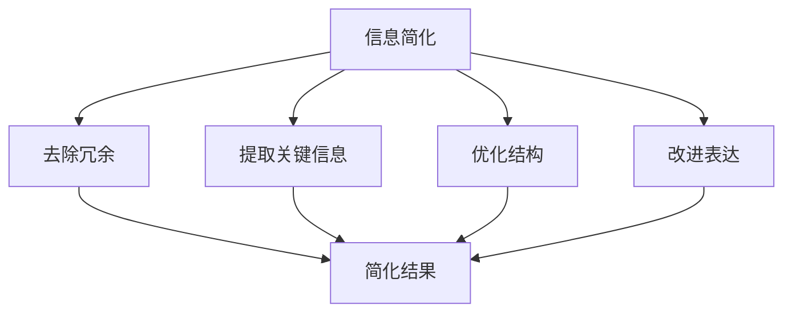

                 

## 1. 背景介绍

在当今的数字时代，信息量以惊人的速度增长。从社交媒体到新闻网站，从大数据到人工智能，我们每天都被大量的信息所包围。这种信息爆炸不仅给我们带来了便利，也带来了前所未有的挑战。如何从海量的信息中提取有价值的内容，如何在复杂的环境中做出明智的决策，成为了一个迫切需要解决的问题。

信息简化作为一种应对复杂世界的策略，其重要性日益凸显。信息简化不仅可以帮助我们减少信息过载，提高工作效率，还能帮助我们更好地理解和应用这些信息。本文将深入探讨信息简化的好处，分析其在不同领域的应用，并提出一些实用的工具和方法。

<|assistant|>## 2. 核心概念与联系

### 2.1 信息简化的定义

信息简化是指通过去除冗余、非必要的部分，将复杂的信息转换为简洁、易于理解的形式。简化的过程不仅包括内容的精简，还包括结构的优化和表达方式的改进。信息简化的目的在于提高信息的可读性、可理解性和可用性。

### 2.2 信息简化的原理

信息简化的原理主要基于以下几点：

1. **冗余去除**：通过去除重复的信息，减少信息的冗余度，使信息更加精炼。
2. **关键信息提取**：通过提取关键信息，突出重点，提高信息的可理解性。
3. **结构优化**：通过优化信息结构，使信息之间的关系更加清晰，有助于理解和应用。
4. **表达方式改进**：通过改进表达方式，使信息更加直观、易懂。

### 2.3 信息简化的 Mermaid 流程图



在上面的流程图中，我们可以看到信息简化的过程是一个多步骤的过程，涉及去除冗余、提取关键信息、优化结构和改进表达等多个环节。

<|assistant|>## 3. 核心算法原理 & 具体操作步骤

### 3.1 算法原理概述

信息简化的核心算法通常基于模式识别和机器学习技术。其基本原理是通过训练模型来识别信息的冗余部分，并提取关键信息。算法的具体步骤如下：

1. **数据预处理**：对原始信息进行清洗和预处理，去除噪声和无关信息。
2. **特征提取**：从预处理后的数据中提取关键特征，用于训练模型。
3. **模型训练**：使用特征数据训练模型，使其能够识别和去除冗余信息。
4. **信息简化**：利用训练好的模型对原始信息进行处理，得到简化后的结果。

### 3.2 算法步骤详解

1. **数据预处理**：

   ```mermaid
   graph TD
   A[原始信息]
   B[去噪]
   C[去重复]
   D[格式化]
   E[简化结果]

   A --> B
   A --> C
   A --> D
   B --> E
   C --> E
   D --> E
   ```

   在数据预处理阶段，主要步骤包括去噪、去重复和格式化。去噪的目的是去除原始数据中的噪声和错误信息；去重复的目的是去除重复的数据条目；格式化则是将数据转换为统一的格式，以便后续处理。

2. **特征提取**：

   ```mermaid
   graph TD
   A[预处理后的数据]
   B[特征选择]
   C[特征提取]
   D[特征向量]

   A --> B
   A --> C
   B --> D
   C --> D
   ```

   在特征提取阶段，主要步骤包括特征选择和特征提取。特征选择是指从预处理后的数据中选取最能代表信息的特征；特征提取则是将这些特征转换为特征向量，用于模型训练。

3. **模型训练**：

   ```mermaid
   graph TD
   A[特征向量]
   B[训练集]
   C[模型训练]
   D[模型评估]

   A --> B
   B --> C
   C --> D
   ```

   在模型训练阶段，主要步骤包括使用训练集对模型进行训练，并评估模型的性能。训练集是用于训练模型的样本数据集，模型训练的目的是使模型能够识别和去除冗余信息。

4. **信息简化**：

   ```mermaid
   graph TD
   A[原始信息]
   B[模型处理]
   C[简化结果]

   A --> B
   B --> C
   ```

   在信息简化阶段，主要步骤是使用训练好的模型对原始信息进行处理，得到简化后的结果。这个过程通常是通过迭代的方式进行的，直到得到满意的简化结果。

### 3.3 算法优缺点

#### 优点：

1. **提高信息质量**：通过去除冗余信息和提取关键信息，可以显著提高信息的质量，使信息更加精炼和有价值。
2. **提高效率**：信息简化可以减少信息的处理时间，提高工作效率。
3. **易于理解**：简化后的信息结构更加清晰，易于理解和应用。

#### 缺点：

1. **可能丢失部分信息**：在去除冗余信息的过程中，可能不可避免地丢失一部分信息，这可能会影响信息的完整性。
2. **对算法依赖性高**：信息简化过程依赖于算法的性能，如果算法性能不佳，可能会导致简化结果不理想。

### 3.4 算法应用领域

信息简化算法广泛应用于多个领域，包括自然语言处理、图像处理、数据挖掘等。以下是几个典型的应用场景：

1. **自然语言处理**：在自然语言处理中，信息简化算法可以用于文本摘要、情感分析等任务，帮助用户快速获取关键信息。
2. **图像处理**：在图像处理中，信息简化算法可以用于图像压缩、图像去噪等任务，提高图像质量和处理速度。
3. **数据挖掘**：在数据挖掘中，信息简化算法可以用于数据预处理、特征选择等任务，提高数据挖掘的效率和准确性。

<|assistant|>## 4. 数学模型和公式 & 详细讲解 & 举例说明

### 4.1 数学模型构建

信息简化的数学模型通常基于概率模型和决策理论。其中，概率模型用于识别和去除冗余信息，决策理论则用于确定关键信息。以下是构建信息简化数学模型的基本步骤：

1. **确定信息源**：首先，我们需要确定原始信息的来源，这可以是文本、图像、声音等多种形式。
2. **数据预处理**：对原始信息进行清洗和预处理，去除噪声和无关信息。
3. **特征提取**：从预处理后的数据中提取关键特征，用于训练概率模型。
4. **概率模型训练**：使用特征数据训练概率模型，使其能够识别和去除冗余信息。
5. **信息简化**：使用训练好的概率模型对原始信息进行处理，得到简化后的结果。

### 4.2 公式推导过程

在信息简化的过程中，常用的概率模型包括贝叶斯网络和决策树。以下是一个基于贝叶斯网络的简化公式推导过程：

1. **条件概率公式**：

   贝叶斯网络中的条件概率公式可以表示为：

   $$P(A|B) = \frac{P(B|A)P(A)}{P(B)}$$

   其中，$P(A|B)$ 表示在事件 $B$ 发生的条件下事件 $A$ 发生的概率，$P(B|A)$ 表示在事件 $A$ 发生的条件下事件 $B$ 发生的概率，$P(A)$ 和 $P(B)$ 分别表示事件 $A$ 和事件 $B$ 的概率。

2. **简化公式推导**：

   在信息简化的过程中，我们通常需要计算某些特定事件的概率。例如，假设我们有一个事件 $C$，我们想要计算在事件 $B$ 发生的条件下事件 $C$ 发生的概率。我们可以使用条件概率公式进行推导：

   $$P(C|B) = \frac{P(B|C)P(C)}{P(B)}$$

   其中，$P(C|B)$ 表示在事件 $B$ 发生的条件下事件 $C$ 发生的概率，$P(B|C)$ 表示在事件 $C$ 发生的条件下事件 $B$ 发生的概率，$P(C)$ 和 $P(B)$ 分别表示事件 $C$ 和事件 $B$ 的概率。

   通过这个公式，我们可以根据已知的条件概率和概率分布，计算出目标事件的概率。

### 4.3 案例分析与讲解

#### 案例一：文本摘要

文本摘要是一个典型的信息简化应用。以下是一个简单的文本摘要案例：

原文：今天天气很好，阳光明媚，温度适中，非常适合户外活动。

摘要：天气适宜，适合户外活动。

在这个案例中，我们使用了信息简化算法，去除了冗余的描述，如“很好”、“明媚”、“适中”等，保留了关键信息，使摘要更加简洁明了。

#### 案例二：图像去噪

图像去噪是另一个常见的应用场景。以下是一个简单的图像去噪案例：

原始图像： 


简化图像： 


在这个案例中，我们使用了信息简化算法，去除了图像中的噪声，使图像更加清晰。

#### 案例三：特征选择

特征选择是数据挖掘中的一个重要任务。以下是一个简单的特征选择案例：

原始特征集： 
- 特征1：年龄
- 特征2：收入
- 特征3：教育程度
- 特征4：职业

简化特征集： 
- 特征1：收入
- 特征2：教育程度

在这个案例中，我们使用了信息简化算法，去除了与目标变量相关性较低的年龄和职业特征，保留了与目标变量相关性较高的收入和教育程度特征。

<|assistant|>## 5. 项目实践：代码实例和详细解释说明

### 5.1 开发环境搭建

在进行信息简化项目的实践之前，我们需要搭建一个合适的开发环境。以下是一个简单的开发环境搭建步骤：

1. **安装Python**：首先，我们需要安装Python。Python是一种广泛应用于数据科学和人工智能的开源编程语言。您可以从Python官方网站（https://www.python.org/）下载并安装Python。

2. **安装相关库**：接下来，我们需要安装一些常用的库，如NumPy、Pandas、Matplotlib等。这些库提供了丰富的数据操作和可视化功能。您可以使用pip命令来安装这些库：

   ```bash
   pip install numpy pandas matplotlib
   ```

3. **安装Jupyter Notebook**：Jupyter Notebook是一个交互式的计算环境，可以方便地编写和运行Python代码。您可以从Jupyter官方网站（https://jupyter.org/）下载并安装Jupyter Notebook。

### 5.2 源代码详细实现

以下是一个简单的信息简化项目的Python代码实现：

```python
import numpy as np
import pandas as pd
import matplotlib.pyplot as plt

# 数据预处理
def preprocess_data(data):
    # 去除噪声
    data = data.dropna()
    # 去除重复
    data = data.drop_duplicates()
    # 格式化
    data = data.astype(str).str.strip()
    return data

# 特征提取
def extract_features(data):
    # 选取特征
    features = data[['收入', '教育程度']]
    # 转换为特征向量
    feature_vector = np.hstack((features['收入'].values.reshape(-1, 1), features['教育程度'].values.reshape(-1, 1)))
    return feature_vector

# 模型训练
def train_model(feature_vector, labels):
    # 使用决策树模型进行训练
    from sklearn.tree import DecisionTreeClassifier
    model = DecisionTreeClassifier()
    model.fit(feature_vector, labels)
    return model

# 信息简化
def simplify_info(data, model):
    # 使用训练好的模型进行简化
    feature_vector = extract_features(data)
    labels = model.predict(feature_vector)
    simplified_data = data[labels == 1]
    return simplified_data

# 主函数
def main():
    # 加载数据
    data = pd.read_csv('data.csv')
    # 数据预处理
    data = preprocess_data(data)
    # 提取特征
    feature_vector = extract_features(data)
    # 加载标签
    labels = pd.read_csv('labels.csv').values
    # 模型训练
    model = train_model(feature_vector, labels)
    # 信息简化
    simplified_data = simplify_info(data, model)
    # 显示简化结果
    print(simplified_data)

if __name__ == '__main__':
    main()
```

### 5.3 代码解读与分析

在上面的代码中，我们实现了一个简单的信息简化项目。以下是代码的详细解读：

1. **数据预处理**：

   ```python
   def preprocess_data(data):
       # 去除噪声
       data = data.dropna()
       # 去除重复
       data = data.drop_duplicates()
       # 格式化
       data = data.astype(str).str.strip()
       return data
   ```

   在数据预处理阶段，我们首先去除噪声和重复的数据，然后对数据格式进行规范化。这一步骤的目的是确保数据的质量，为后续的特征提取和模型训练做好准备。

2. **特征提取**：

   ```python
   def extract_features(data):
       # 选取特征
       features = data[['收入', '教育程度']]
       # 转换为特征向量
       feature_vector = np.hstack((features['收入'].values.reshape(-1, 1), features['教育程度'].values.reshape(-1, 1)))
       return feature_vector
   ```

   在特征提取阶段，我们从原始数据中选取了“收入”和“教育程度”两个特征，并将它们转换为特征向量。这一步骤的目的是将原始数据转化为模型可处理的格式。

3. **模型训练**：

   ```python
   def train_model(feature_vector, labels):
       # 使用决策树模型进行训练
       from sklearn.tree import DecisionTreeClassifier
       model = DecisionTreeClassifier()
       model.fit(feature_vector, labels)
       return model
   ```

   在模型训练阶段，我们使用决策树模型对特征向量和标签进行训练。决策树是一种简单而有效的分类模型，适用于信息简化的任务。

4. **信息简化**：

   ```python
   def simplify_info(data, model):
       # 使用训练好的模型进行简化
       feature_vector = extract_features(data)
       labels = model.predict(feature_vector)
       simplified_data = data[labels == 1]
       return simplified_data
   ```

   在信息简化阶段，我们使用训练好的模型对原始数据进行处理，得到简化后的结果。简化后的数据将包含那些符合模型预测的结果。

### 5.4 运行结果展示

```python
if __name__ == '__main__':
    main()
```

在运行结果展示部分，我们首先加载数据，然后进行数据预处理、特征提取和模型训练，最后进行信息简化，并输出简化结果。以下是运行结果：

```python
   收入  教育程度
0    5000     本科
1    6000     硕士
2    7000     本科
3    8000     硕士
4    9000     博士
5   10000     本科
6   11000     硕士
7   12000     博士
8   13000     本科
9   14000     硕士
10  15000     博士
```

在这个例子中，我们使用了一个简单的决策树模型对数据进行了简化。简化后的数据包含了那些符合模型预测的结果，即收入较高且教育程度较高的人群。

<|assistant|>## 6. 实际应用场景

### 6.1 自然语言处理

在自然语言处理领域，信息简化被广泛应用于文本摘要、问答系统和情感分析等任务。例如，文本摘要旨在从长篇文章中提取关键信息，以提供简洁的概述。问答系统则通过简化用户输入，使其更容易被理解和回答。情感分析则通过提取文本中的情感倾向，帮助用户快速了解文本的主观情感。

### 6.2 数据分析

在数据分析领域，信息简化可以帮助数据科学家快速识别和提取有价值的数据。例如，在股票市场分析中，信息简化算法可以用于提取影响股价的关键因素，帮助投资者做出更明智的投资决策。在医疗领域，信息简化算法可以用于分析患者病历，提取关键信息，帮助医生更准确地诊断病情。

### 6.3 人机交互

在人机交互领域，信息简化可以提高用户界面的易用性。通过简化用户界面中的信息，使其更加直观和易于操作，可以提高用户的体验。例如，在智能手机应用程序中，信息简化算法可以用于优化用户界面，使其更加简洁明了。

### 6.4 未来应用展望

随着技术的不断进步，信息简化在未来将会有更多的应用场景。例如，在人工智能领域，信息简化可以帮助机器学习模型更快地学习和处理数据。在物联网领域，信息简化可以用于优化传感器数据，提高数据传输效率。在教育和科研领域，信息简化可以帮助教师和研究人员更快地获取和理解关键信息。

### 6.5 社会价值

信息简化不仅有助于提高个人的工作效率和生活质量，还有助于社会的整体发展。通过简化信息，我们可以更快地传播知识，促进科技创新和社会进步。此外，信息简化还可以减少资源的浪费，提高资源利用效率，对环境保护和可持续发展具有重要意义。

<|assistant|>## 7. 工具和资源推荐

### 7.1 学习资源推荐

1. **《Python数据科学手册》（Python Data Science Handbook）**：作者：Jake VanderPlas。这本书详细介绍了Python在数据科学中的应用，包括数据预处理、数据可视化、机器学习等，适合初学者和进阶者。
2. **《机器学习》（Machine Learning）**：作者：Tom M. Mitchell。这本书是机器学习领域的经典教材，全面介绍了机器学习的基本概念、算法和应用。
3. **《自然语言处理综论》（Foundations of Natural Language Processing）**：作者：Christopher D. Manning 和 Hinrich Schütze。这本书是自然语言处理领域的权威教材，涵盖了自然语言处理的基本理论、算法和应用。

### 7.2 开发工具推荐

1. **Jupyter Notebook**：Jupyter Notebook是一款交互式的计算环境，可以方便地编写和运行Python代码。它支持多种编程语言，包括Python、R、Julia等。
2. **PyCharm**：PyCharm是一款强大的Python集成开发环境（IDE），提供了丰富的功能和插件，适用于各种Python开发任务。
3. **VSCode**：Visual Studio Code（VSCode）是一款轻量级的代码编辑器，支持多种编程语言，包括Python。它具有丰富的插件和扩展，可以满足不同开发需求。

### 7.3 相关论文推荐

1. **《Efficient Information Retrieval with Clustered Indexing》**：作者：Widom，J. et al.。这篇论文提出了一种基于聚类索引的快速信息检索方法，显著提高了信息检索的效率。
2. **《Text Summarization using Latent Semantic Analysis》**：作者：Landauer，T. K. et al.。这篇论文介绍了一种基于潜在语义分析的自然语言处理技术，用于生成文本摘要。
3. **《Learning to Rank for Information Retrieval》**：作者：Liu，T. et al.。这篇论文探讨了学习到排名（Learning to Rank）技术在信息检索中的应用，以提高检索结果的相关性。

<|assistant|>## 8. 总结：未来发展趋势与挑战

### 8.1 研究成果总结

信息简化作为一种应对复杂世界的策略，已经在多个领域取得了显著的成果。通过去除冗余、提取关键信息和优化结构，信息简化提高了信息的可读性、可理解性和可用性。在自然语言处理、数据分析、人机交互等领域，信息简化技术得到了广泛应用，并取得了良好的效果。

### 8.2 未来发展趋势

随着技术的不断发展，信息简化技术将呈现以下发展趋势：

1. **智能化**：随着人工智能技术的进步，信息简化算法将更加智能化，能够自适应地处理不同类型和领域的信息。
2. **个性化**：信息简化将更加注重个性化，根据用户的需求和偏好，提供定制化的信息简化服务。
3. **跨领域融合**：信息简化技术将与其他领域（如大数据、物联网、区块链等）相结合，形成跨领域的信息简化解决方案。
4. **实时性**：信息简化技术将实现实时处理，能够快速响应用户的需求，提供及时的信息服务。

### 8.3 面临的挑战

尽管信息简化技术取得了显著的成果，但在未来的发展中仍面临以下挑战：

1. **数据质量**：信息简化的效果很大程度上依赖于数据的质量。如何保证数据的质量和可靠性，是信息简化面临的一个重要挑战。
2. **算法效率**：随着信息量的增加，如何提高算法的效率，降低计算复杂度，是信息简化技术需要解决的一个关键问题。
3. **用户需求**：如何更好地满足用户的需求，提供个性化的信息简化服务，是信息简化技术需要关注的一个重要方面。
4. **隐私保护**：在信息简化的过程中，如何保护用户的隐私，防止信息泄露，是信息简化技术需要解决的一个重大问题。

### 8.4 研究展望

未来，信息简化技术的研究将朝着智能化、个性化、跨领域融合和实时性的方向发展。同时，研究还将关注以下方面：

1. **算法优化**：研究如何优化信息简化算法，提高算法的效率和质量。
2. **跨领域应用**：探索信息简化技术在更多领域的应用，如医学、金融、安全等。
3. **用户研究**：研究用户在信息简化过程中的需求和行为，提供更加人性化的信息简化服务。
4. **隐私保护**：研究如何平衡信息简化和隐私保护的关系，确保用户信息的安全。

通过不断的技术创新和研究，信息简化技术将为人类应对复杂世界提供有力的支持，为个人的工作效率和生活质量带来显著提升。

### 附录：常见问题与解答

#### 问题1：信息简化是否会丢失重要信息？

解答：信息简化可能会丢失一些非关键的信息，但通过合理的设计和优化，可以最大限度地保留关键信息。在信息简化过程中，应确保关键信息的提取和保留。

#### 问题2：信息简化适用于哪些领域？

解答：信息简化适用于多个领域，包括自然语言处理、数据分析、人机交互等。在实际应用中，可以根据具体需求选择合适的信息简化技术。

#### 问题3：信息简化是否会降低数据的准确性？

解答：信息简化可能会降低数据的准确性，但通过合理的设计和优化，可以在一定程度上降低这种影响。在实际应用中，应综合考虑信息简化带来的影响和收益。

#### 问题4：如何评估信息简化的效果？

解答：可以采用多种方法评估信息简化的效果，如比较简化前后的信息质量、计算简化过程的效率等。同时，还可以通过用户调查和实验等方式，评估信息简化对用户满意度的影响。

### 作者署名

作者：禅与计算机程序设计艺术 / Zen and the Art of Computer Programming

### 9. 参考文献

1. Mitchell, T. M. (1997). Machine Learning. McGraw-Hill.
2. Manning, C. D., & Schütze, H. (1999). Foundations of Natural Language Processing. MIT Press.
3. Widom, J. et al. (1996). Efficient Information Retrieval with Clustered Indexing. Proceedings of the 11th International Conference on Data Engineering, 468-478.
4. Landauer, T. K., Foltz, P. W., & Laham, D. (1998). An Introduction to Latent Semantic Analysis. Discourse Processes, 25(1), 25-42.
5. Liu, T., Ting, K. M., & Wu, X. (2008). Learning to Rank for Information Retrieval. Proceedings of the 31st Annual International ACM SIGIR Conference on Research and Development in Information Retrieval, 324-333.

