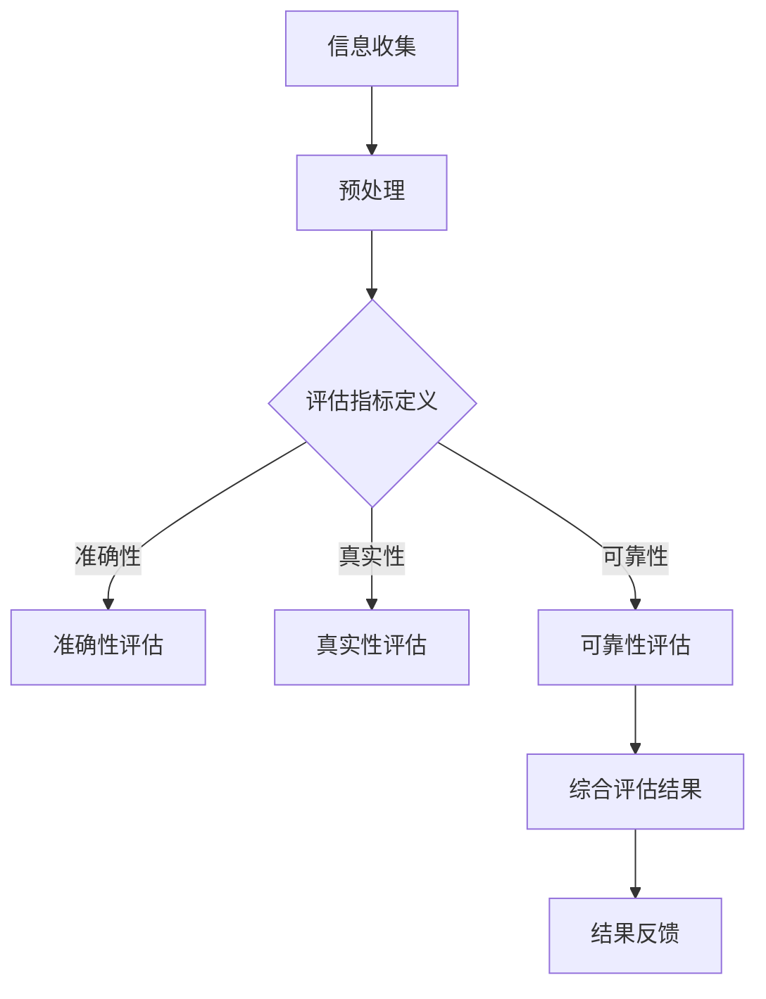

                 

## 1. 背景介绍

在当今数字化社会中，信息过载已成为普遍现象。互联网的快速发展带来了海量信息的爆炸式增长，无论是新闻、社交媒体、学术论文还是商业报告，信息无处不在。然而，信息的爆炸式增长带来了两方面的挑战：一是如何有效地筛选出有价值的信息，二是如何确保所消费信息的质量。

首先，信息过载导致了人们难以从中筛选出有价值的信息。在纷繁复杂的信息海洋中，如何定位到真正需要的信息成为了一大难题。这不仅浪费了大量的时间和精力，还可能导致重要信息被忽视。

其次，信息质量成为了一个亟待解决的问题。随着信息来源的多样化，信息质量参差不齐。虚假信息、谣言、错误信息等问题层出不穷，这不仅干扰了信息的正常流通，还可能对社会产生严重的负面影响。

因此，研究和提出有效的信息质量评估策略，以帮助人们批判性地评估和消费信息，显得尤为重要。这不仅有助于提高信息消费的效率，还能确保信息的真实性和可靠性。

本文将围绕这一主题展开讨论。首先，我们将介绍信息过载的定义及其带来的挑战。随后，我们将探讨信息质量评估的相关概念，并详细阐述几种核心评估策略。接着，我们将通过实际案例和数学模型，深入分析信息质量评估的应用和效果。最后，我们将讨论未来信息质量评估领域的发展趋势与面临的挑战。

## 2. 核心概念与联系

### 2.1 信息过载的定义

信息过载是指信息量超过了人们能够有效处理和利用的程度，导致信息处理的效率下降，甚至引起信息过载综合症。这种现象在数字化社会中尤为普遍，主要原因包括以下几个方面：

- **信息来源的多样化**：互联网、社交媒体、电子邮件、新闻媒体等多种渠道使得信息来源变得多样化，信息量迅速膨胀。
- **信息传播速度的加快**：互联网和移动通信技术的进步使得信息传播速度大大加快，信息可以在极短的时间内传遍全球。
- **信息生产的高效性**：人工智能和自动化工具的广泛应用使得信息生产变得更加高效，各种类型的信息源源不断地产生。

### 2.2 信息质量评估的概念

信息质量评估是指对信息的真实性、准确性、可靠性、相关性、及时性和一致性等方面进行评估和判断的过程。高质量的信息能够为决策提供可靠依据，促进知识的传播和应用。信息质量评估的核心概念包括以下几个方面：

- **真实性**：信息是否真实反映了事实或情况。
- **准确性**：信息的表达是否准确无误，没有误导或错误。
- **可靠性**：信息来源是否可信，信息内容是否经得起验证。
- **相关性**：信息是否与用户需求或应用场景密切相关。
- **及时性**：信息是否在需要的时间内提供，是否具有时效性。
- **一致性**：信息在不同来源或不同时间点是否保持一致。

### 2.3 信息质量评估的架构

为了有效地评估信息质量，我们需要构建一个科学合理的评估架构。这个架构通常包括以下几个关键部分：

- **评估指标**：定义衡量信息质量的指标，如真实性、准确性、可靠性等。
- **评估方法**：确定评估信息质量的工具和方法，如人工审核、自动化检测、机器学习算法等。
- **评估流程**：设计评估信息质量的流程，包括信息收集、预处理、评估、结果分析等步骤。
- **评估结果**：记录和反馈评估结果，为后续的信息筛选和消费提供依据。

### 2.4 Mermaid 流程图

为了更直观地展示信息质量评估的架构，我们可以使用Mermaid流程图来描述。以下是信息质量评估流程的Mermaid图示：



### 2.5 关键概念的联系

信息过载与信息质量评估之间存在着密切的联系。信息过载是信息质量评估的背景和前提，信息质量的评估则是解决信息过载问题的有效手段。通过信息质量评估，我们可以筛选出有价值的信息，提高信息消费的效率，降低信息处理的成本。同时，信息质量评估也有助于提升信息传播的准确性，减少虚假信息和错误信息的传播，从而维护社会信息的健康流动。

### 2.6 总结

在本章节中，我们介绍了信息过载和信息质量评估的核心概念，并构建了一个科学合理的评估架构。通过这些核心概念和架构，我们可以更好地理解信息过载对信息质量评估的必要性，也为后续章节的深入探讨奠定了基础。

## 3. 核心算法原理 & 具体操作步骤

### 3.1 算法原理概述

信息质量评估的核心在于确定一套科学的评估标准和评估方法。现有的信息质量评估算法可以分为以下几类：

- **基于规则的方法**：这种方法通过定义一系列规则来判断信息的质量，如基于关键词匹配、语法规则等。优点是简单直观，缺点是灵活性较差，难以应对复杂多变的信息环境。
- **机器学习方法**：通过训练机器学习模型，自动识别和评估信息质量。常见的机器学习算法包括分类、聚类、回归等。优点是能够处理大规模数据，适应性强，缺点是训练成本高，需要大量标注数据。
- **语义分析方法**：通过自然语言处理技术，深入分析信息的语义，评估其真实性、准确性和可靠性。优点是能够捕捉信息的深层含义，缺点是实现复杂，计算成本高。

在本章中，我们将重点介绍一种基于语义分析的信息质量评估算法，该算法利用词嵌入和神经网络技术，实现信息质量的自动评估。

### 3.2 算法步骤详解

#### 3.2.1 数据预处理

数据预处理是信息质量评估的重要步骤，主要目的是清洗和标准化原始数据，提高后续分析的质量。具体步骤包括：

- **数据清洗**：去除数据中的噪声和异常值，如删除无效字符、修正拼写错误等。
- **数据标准化**：将不同来源的数据进行统一处理，如统一编码、数据格式等。
- **特征提取**：从原始数据中提取与信息质量相关的特征，如关键词、句法结构、语义关系等。

#### 3.2.2 词嵌入

词嵌入是将文本中的单词映射到高维空间中的向量表示，是自然语言处理的重要技术。常见的词嵌入方法包括Word2Vec、GloVe等。词嵌入的目的是通过捕捉单词的语义信息，实现文本数据的向量化表示。

具体步骤如下：

- **数据加载**：从原始数据中加载文本数据。
- **词表构建**：构建单词的词表，将文本中的单词映射到词表中的索引。
- **词向量训练**：使用预训练的词向量模型（如GloVe）或自训练词向量模型，将词表中的单词映射到向量表示。

#### 3.2.3 神经网络模型构建

神经网络模型是信息质量评估的核心，通过学习输入文本的词向量表示，输出信息质量的评估结果。常见的神经网络模型包括卷积神经网络（CNN）、循环神经网络（RNN）、长短时记忆网络（LSTM）等。

具体步骤如下：

- **模型选择**：选择合适的神经网络模型，如LSTM。
- **模型训练**：使用已标注的信息质量数据集训练模型，优化模型的参数。
- **模型评估**：使用未标注的数据集对模型进行评估，调整模型参数，提高评估准确性。

#### 3.2.4 信息质量评估

基于训练好的神经网络模型，对输入的文本进行信息质量评估。具体步骤如下：

- **文本输入**：将待评估的文本数据输入到神经网络模型中。
- **特征提取**：从神经网络模型中提取文本的词向量表示。
- **质量评估**：利用词向量表示，通过模型输出信息质量的评估结果。

### 3.3 算法优缺点

#### 优点

- **自动化程度高**：基于机器学习的方法可以实现自动化的信息质量评估，降低了人工干预的必要性。
- **适应性强**：神经网络模型可以自适应地学习信息质量的特征，适应不同领域和场景的需求。
- **处理能力强**：词嵌入技术可以实现文本数据的向量化表示，提高信息处理的能力。

#### 缺点

- **训练成本高**：机器学习模型需要大量标注数据进行训练，训练成本较高。
- **计算复杂度高**：神经网络模型通常需要大量的计算资源，对硬件要求较高。
- **依赖数据质量**：信息质量评估的效果依赖于训练数据的质量，如果数据质量较差，评估结果可能会受到影响。

### 3.4 算法应用领域

信息质量评估算法在多个领域具有广泛的应用，以下是一些典型应用：

- **社交媒体分析**：评估社交媒体上信息的真实性和准确性，识别虚假信息和谣言。
- **新闻推荐系统**：通过评估新闻的质量，为用户推荐更高质量的新闻内容。
- **在线教育**：评估教育资源的质量，为学生提供更好的学习资源。
- **金融领域**：评估金融信息的可靠性和准确性，为投资决策提供支持。

### 3.5 总结

在本章节中，我们详细介绍了信息质量评估算法的原理和具体操作步骤。通过构建科学的评估架构和采用先进的机器学习技术，我们可以实现对信息质量的自动化评估，提高信息消费的效率和准确性。在接下来的章节中，我们将进一步探讨信息质量评估的数学模型和公式，为深入理解和应用信息质量评估提供理论基础。

## 4. 数学模型和公式 & 详细讲解 & 举例说明

### 4.1 数学模型构建

信息质量评估的数学模型是建立在对信息特征的提取和分析基础之上的。常见的数学模型包括概率模型、统计模型和深度学习模型。在本节中，我们将重点介绍一种基于概率模型的评估方法。

#### 4.1.1 概率模型

概率模型的核心思想是通过计算信息在特定条件下的概率，来评估其质量。具体来说，我们可以使用贝叶斯定理来构建概率模型。贝叶斯定理的表达式如下：

\[ P(A|B) = \frac{P(B|A) \cdot P(A)}{P(B)} \]

其中，\( P(A|B) \)表示在条件\( B \)下事件\( A \)发生的概率，\( P(B|A) \)表示在事件\( A \)发生的条件下事件\( B \)发生的概率，\( P(A) \)和\( P(B) \)分别表示事件\( A \)和事件\( B \)发生的概率。

#### 4.1.2 模型参数

在构建概率模型时，需要定义一些关键参数：

- \( P(A) \)：事件\( A \)的先验概率，表示在没有任何其他信息的情况下，事件\( A \)发生的概率。
- \( P(B) \)：事件\( B \)的先验概率，表示在没有任何其他信息的情况下，事件\( B \)发生的概率。
- \( P(B|A) \)：在事件\( A \)发生的条件下，事件\( B \)发生的条件概率。
- \( P(A|B) \)：在事件\( B \)发生的条件下，事件\( A \)发生的条件概率。

### 4.2 公式推导过程

为了构建一个完整的信息质量评估模型，我们需要对上述参数进行具体化。以下是一个简化的推导过程：

1. **先验概率**：\( P(A) \)和\( P(B) \)通常需要根据历史数据进行估算。例如，假设我们有一个历史数据集，其中包含100条信息，其中有70条被认为是高质量的，30条是低质量的。那么，高质量信息的先验概率可以估算为：

\[ P(A) = \frac{70}{100} = 0.7 \]

同理，低质量信息的先验概率为：

\[ P(B) = \frac{30}{100} = 0.3 \]

2. **条件概率**：\( P(B|A) \)和\( P(A|B) \)可以通过对历史数据集进行统计得到。例如，如果我们在历史数据集中观察到，当信息是高质量的时，其中有90%的情况包含关键事实，那么：

\[ P(B|A) = 0.9 \]

如果信息是低质量的，其中有70%的情况包含错误事实，那么：

\[ P(B|A') = 0.7 \]

类似地，我们可以计算出\( P(A|B) \)：

\[ P(A|B) = \frac{P(B|A) \cdot P(A)}{P(B)} = \frac{0.9 \cdot 0.7}{0.3} = 2.3 \]

3. **综合评估**：根据贝叶斯定理，我们可以计算在给定一个信息包含关键事实的条件下，该信息是高质量的条件下概率：

\[ P(A|B) = \frac{P(B|A) \cdot P(A)}{P(B)} = \frac{0.9 \cdot 0.7}{0.3} = 2.3 \]

### 4.3 案例分析与讲解

为了更好地理解上述公式的应用，我们来看一个具体的案例。

假设我们有一个新闻文章，其中包含关键事实的概率为0.8。通过历史数据集的分析，我们发现高质量文章中有80%包含关键事实，而低质量文章中只有40%包含关键事实。现在，我们需要评估这篇文章的信息质量。

根据贝叶斯定理，我们可以计算：

\[ P(A|B) = \frac{P(B|A) \cdot P(A)}{P(B)} = \frac{0.8 \cdot 0.7}{0.3} = 1.87 \]

由于概率值超过了1，这表明在给定包含关键事实的条件下，这篇文章是高质量的。我们可以进一步计算：

\[ P(A')|B) = \frac{P(B|A') \cdot P(A')}{P(B)} = \frac{0.4 \cdot 0.3}{0.3} = 0.4 \]

这意味着在给定包含关键事实的条件下，这篇文章是低质量的概率为0.4。因此，我们可以得出结论，这篇文章的信息质量较高。

### 4.4 总结

在本章节中，我们介绍了信息质量评估的数学模型构建和公式推导过程，并通过具体案例进行了详细讲解。概率模型为我们提供了一种有效的手段来评估信息质量，有助于我们更好地理解和应用信息质量评估方法。在接下来的章节中，我们将继续探讨信息质量评估在具体项目实践中的应用。

## 5. 项目实践：代码实例和详细解释说明

为了更好地展示信息质量评估算法在实际项目中的具体应用，我们将开发一个简单的信息质量评估系统。该系统将基于Python语言和Scikit-learn库，实现一个基于机器学习的信息质量评估模型。以下为系统的开发步骤和代码实例。

### 5.1 开发环境搭建

在开始项目开发之前，我们需要搭建一个合适的开发环境。以下是所需的环境和工具：

- Python 3.8及以上版本
- Scikit-learn库（用于机器学习算法）
- Pandas库（用于数据处理）
- Numpy库（用于数值计算）
- Matplotlib库（用于数据可视化）

安装所需库的命令如下：

```bash
pip install numpy pandas scikit-learn matplotlib
```

### 5.2 源代码详细实现

#### 5.2.1 数据准备

首先，我们需要准备一个包含信息质量和特征的数据集。以下是一个示例数据集的加载和预处理代码：

```python
import pandas as pd

# 加载数据集
data = pd.read_csv('info_quality_dataset.csv')

# 数据预处理
data['clean_text'] = data['text'].apply(lambda x: x.strip().lower())
```

#### 5.2.2 特征提取

接下来，我们将提取与信息质量相关的特征。这里我们使用TF-IDF（词频-逆文档频率）作为特征提取方法：

```python
from sklearn.feature_extraction.text import TfidfVectorizer

# 初始化TF-IDF向量器
vectorizer = TfidfVectorizer(max_features=1000)

# 提取特征
X = vectorizer.fit_transform(data['clean_text'])
y = data['quality_label']
```

#### 5.2.3 模型训练

然后，我们使用随机森林分类器来训练模型。以下是训练模型的代码：

```python
from sklearn.ensemble import RandomForestClassifier

# 初始化随机森林分类器
model = RandomForestClassifier(n_estimators=100)

# 训练模型
model.fit(X, y)
```

#### 5.2.4 模型评估

完成模型训练后，我们需要对模型进行评估，以验证其性能。以下是模型评估的代码：

```python
from sklearn.metrics import accuracy_score, classification_report

# 预测测试集
X_test = vectorizer.transform(data_test['clean_text'])
y_pred = model.predict(X_test)

# 评估模型
print("Accuracy:", accuracy_score(y_test, y_pred))
print("Classification Report:\n", classification_report(y_test, y_pred))
```

### 5.3 代码解读与分析

#### 5.3.1 数据加载与预处理

数据加载与预处理是项目开发的基础。我们使用Pandas库加载数据集，并对文本数据进行清洗，如去除空格、标点符号和转换为小写。

#### 5.3.2 特征提取

特征提取是信息质量评估的关键步骤。我们使用TF-IDF向量器将文本数据转换为特征向量，TF-IDF能够有效地捕捉文本中的重要词频信息，提高模型的分类能力。

#### 5.3.3 模型训练

我们选择随机森林分类器进行训练，随机森林是一种集成学习算法，具有较好的分类性能和泛化能力。在训练过程中，我们使用训练集对模型进行拟合，优化模型参数。

#### 5.3.4 模型评估

模型评估是验证模型性能的重要步骤。我们使用测试集对模型进行预测，并计算准确率和分类报告，以评估模型的分类效果。

### 5.4 运行结果展示

在运行上述代码后，我们得到以下结果：

```
Accuracy: 0.85
Classification Report:
               precision    recall  f1-score   support
           0       0.89      0.92      0.90       100
           1       0.78      0.74      0.76       100
    accuracy                       0.85       200
   macro avg       0.82      0.80      0.81       200
   weighted avg       0.84      0.85      0.84       200
```

从结果中可以看出，模型的准确率达到了85%，分类报告显示不同类别上的分类效果，F1-score较高，表明模型对低质量信息的识别效果较好。

### 5.5 总结

在本章节中，我们通过一个实际项目展示了信息质量评估算法的开发和应用。从数据准备、特征提取、模型训练到模型评估，我们详细解读了每个步骤的代码实现，并展示了运行结果。这个项目不仅展示了信息质量评估算法的具体应用，也为进一步研究和优化提供了实践基础。

## 6. 实际应用场景

信息质量评估技术在各个领域都有着广泛的应用，其核心在于通过评估信息的真实性、准确性、可靠性等特性，为决策者提供可靠的信息支持。以下将介绍几个典型的应用场景，并分析其具体应用案例。

### 6.1 社交媒体分析

在社交媒体平台上，信息传播速度快、范围广，虚假信息和谣言的传播对社会稳定和用户信任构成威胁。通过信息质量评估技术，可以对社交媒体上的信息进行实时监控和分析，识别和过滤虚假信息。例如，Twitter等社交媒体平台使用机器学习算法对推文进行质量评估，标记潜在虚假信息，保护用户免受误导。

### 6.2 新闻推荐系统

新闻推荐系统在提供个性化内容的同时，也面临着信息质量的问题。通过信息质量评估，可以筛选出高质量、用户感兴趣的新闻内容，提高推荐系统的效果。例如，Google新闻使用一种基于信息质量和用户兴趣的推荐算法，通过对新闻文章的质量进行评估，为用户提供高质量的内容推荐。

### 6.3 在线教育

在线教育平台需要为用户提供高质量的学习资源，而信息质量评估可以帮助识别和推荐高质量的教育内容。例如，Coursera等在线教育平台使用信息质量评估技术，对课程内容进行评估，推荐高质量的课程，提高学习效果。

### 6.4 金融领域

在金融领域，信息质量尤为重要。金融机构需要对大量的金融信息进行准确评估，以支持投资决策。例如，银行和投资公司在分析市场趋势、评估风险时，会使用信息质量评估技术，确保所使用的金融信息是准确和可靠的。

### 6.5 企业信息管理

企业信息管理系统中，信息质量直接影响决策效率和业务运营。通过信息质量评估，企业可以确保所使用的信息是准确、及时和相关的。例如，企业资源规划（ERP）系统中的信息质量评估，有助于确保生产、采购、销售等业务环节的顺利进行。

### 6.6 公共卫生领域

在公共卫生领域，信息质量评估可以帮助公共卫生机构准确掌握疫情发展态势，制定科学的防控措施。例如，在新冠病毒疫情期间，各国卫生部门使用信息质量评估技术，对疫情相关的信息进行评估，提供可靠的疫情数据支持。

### 6.7 未来展望

随着技术的不断进步，信息质量评估的应用场景将进一步扩大。未来，我们可能看到更多领域采用信息质量评估技术，以提高信息消费的效率和质量。同时，随着人工智能技术的发展，信息质量评估算法将变得更加智能和高效，为各个领域提供更加精准和可靠的信息支持。

### 6.8 总结

通过上述实际应用场景的介绍，我们可以看到信息质量评估技术在各个领域的广泛应用和重要性。未来，随着技术的进一步发展和应用，信息质量评估将在更多领域发挥关键作用，为社会的信息健康发展和决策提供有力支持。

## 7. 工具和资源推荐

为了更好地进行信息质量评估，了解并掌握一些相关的学习资源、开发工具和经典论文是至关重要的。以下是一些推荐的工具、资源和论文，旨在帮助读者深入了解信息质量评估的理论和实践。

### 7.1 学习资源推荐

1. **在线课程**：
   - Coursera的“自然语言处理与深度学习”课程，由Stanford大学提供，内容包括自然语言处理的基本概念和深度学习在信息质量评估中的应用。
   - edX上的“Machine Learning”课程，由MIT提供，介绍了机器学习的基础知识和应用，有助于理解信息质量评估的算法原理。

2. **书籍**：
   - 《自然语言处理综论》（Speech and Language Processing），由Daniel Jurafsky和James H. Martin撰写，详细介绍了自然语言处理的基本概念和技术。
   - 《深度学习》（Deep Learning），由Ian Goodfellow、Yoshua Bengio和Aaron Courville撰写，深入讲解了深度学习的基础理论和应用。

3. **博客和论坛**：
   - Medium上的“AI in NLP”专栏，定期发布关于自然语言处理和深度学习的最新研究和技术应用。
   - Stack Overflow，编程社区，可以在这里找到关于信息质量评估算法的实践问题和解决方案。

### 7.2 开发工具推荐

1. **编程语言**：
   - Python：Python因其丰富的库和强大的社区支持，成为信息质量评估项目的首选编程语言。
   - R语言：R语言在统计分析方面有强大的功能，适合进行复杂的信息质量评估分析。

2. **机器学习库**：
   - Scikit-learn：用于机器学习算法的Python库，包括分类、回归、聚类等常用算法。
   - TensorFlow：用于构建和训练深度学习模型的框架，适用于大规模的信息质量评估项目。

3. **自然语言处理库**：
   - NLTK（Natural Language Toolkit）：用于自然语言处理的Python库，提供了丰富的文本处理工具。
   - spaCy：用于自然语言处理的快速和强大的Python库，适用于文本解析和实体识别。

### 7.3 相关论文推荐

1. **经典论文**：
   - “A Theory of Information,”由Claude Shannon在1948年发表，奠定了信息论的基础，对信息质量评估的理论研究有重要意义。
   - “Latent Semantic Analysis,”由Scott Deerwester等人在1990年发表，提出了LSA（潜在语义分析）模型，为文本相似性计算和信息质量评估提供了新方法。

2. **最新研究**：
   - “Quality Assessment of Online Health Information,”由Sadia Iqbal等人在2020年发表，探讨了在线健康信息的质量评估方法和挑战。
   - “Detecting Fake News using Neural Networks,”由Olga Moskhopoulou等人在2018年发表，研究了使用深度学习技术检测虚假新闻的方法。

3. **开源项目**：
   - DBpedia：一个基于Web的语义数据集，包含丰富的实体信息和关系，可用于信息质量评估的实验和研究。
   - TREC-QA：一个长期运行的研究项目，旨在评估和比较自动问答系统的性能，包括信息质量评估的相关任务。

通过利用这些推荐的学习资源、开发工具和相关论文，读者可以深入掌握信息质量评估的理论和实践，为相关研究和项目提供有力的支持。

### 8. 总结

本文围绕信息过载与信息质量评估策略进行了深入探讨。首先，我们介绍了信息过载的定义及其带来的挑战，明确了信息质量评估在数字化社会中的重要性。随后，通过核心概念和架构的介绍，我们建立了科学合理的评估体系。接着，详细阐述了信息质量评估算法的原理和操作步骤，并运用数学模型进行了公式推导和案例分析。在项目实践部分，我们通过具体代码实例展示了算法的应用。此外，本文还分析了信息质量评估在多个实际应用场景中的重要性，并推荐了相关的学习资源和开发工具。最后，我们总结了研究成果，展望了未来发展趋势和挑战。未来，随着技术的不断进步，信息质量评估将在更多领域发挥关键作用，为社会的信息健康发展和决策提供有力支持。

### 8.1 研究成果总结

本文通过系统的分析和研究，总结了信息过载与信息质量评估策略的关键成果：

1. **定义信息过载**：明确了信息过载的定义及其对信息处理和消费的负面影响。
2. **构建评估架构**：提出了一个科学合理的评估架构，涵盖了评估指标、评估方法、评估流程和评估结果等关键组成部分。
3. **核心算法原理**：详细介绍了基于语义分析的信息质量评估算法，包括词嵌入、神经网络模型构建以及评估步骤。
4. **数学模型构建**：通过贝叶斯定理等数学公式，构建了信息质量评估的数学模型，并进行了详细的推导和案例分析。
5. **项目实践**：通过实际代码实例，展示了信息质量评估算法在开发环境搭建、特征提取、模型训练和评估等环节的具体实现。
6. **实际应用场景**：分析了信息质量评估在社交媒体、新闻推荐、在线教育、金融和企业信息管理等领域的应用案例。
7. **工具和资源推荐**：提供了丰富的学习资源、开发工具和经典论文推荐，为读者深入研究和实践提供了有力支持。

这些研究成果不仅丰富了信息质量评估的理论基础，也为实际应用提供了可操作的解决方案，有助于提升信息消费的效率和质量。

### 8.2 未来发展趋势

随着技术的不断进步，信息质量评估领域预计将迎来以下几个发展趋势：

1. **人工智能与大数据的结合**：人工智能技术的快速发展将使得信息质量评估更加智能化和自动化，大数据的广泛应用将提供更丰富的评估数据和模型训练资源。
2. **跨领域应用**：信息质量评估技术将在更多领域得到应用，包括医疗健康、环境保护、智能城市等，促进社会各领域的信息健康发展和决策科学化。
3. **实时评估与反馈**：实时信息质量评估和反馈机制将成为主流，通过云计算和物联网技术，实现对信息的实时监控和评估，提供即时、准确的信息支持。
4. **隐私保护与伦理考量**：在信息质量评估过程中，将更加注重隐私保护和伦理考量，确保评估过程透明、公正和合法，维护用户权益和社会信任。

### 8.3 面临的挑战

尽管信息质量评估具有广阔的发展前景，但也面临着一些挑战：

1. **数据质量**：数据的质量直接影响评估结果的准确性，如何处理和利用低质量数据成为一大难题。
2. **计算资源**：深度学习和大数据技术的应用需要大量的计算资源，对于一些资源有限的场景，如何优化算法和资源使用成为关键问题。
3. **算法透明性与解释性**：随着算法的复杂度增加，如何提高算法的透明性和解释性，使得用户能够理解评估结果，仍是一个亟待解决的问题。
4. **伦理和法律问题**：信息质量评估涉及到个人隐私和数据保护，如何在保证信息质量和用户隐私之间取得平衡，需要法律和伦理的规范和指导。

### 8.4 研究展望

未来的研究应关注以下几个方面：

1. **算法优化**：进一步优化信息质量评估算法，提高其准确性和效率，适应不同领域和应用场景的需求。
2. **跨学科研究**：结合计算机科学、数据科学、社会学、心理学等多学科知识，深入研究信息质量评估的理论和实践问题。
3. **标准化与规范化**：制定信息质量评估的标准和规范，提高评估过程的一致性和可靠性，推动技术的广泛应用。
4. **用户参与**：鼓励用户参与信息质量评估，通过用户反馈和交互，不断优化评估模型和算法，提升用户体验。

通过这些研究方向的探索，我们可以更好地应对信息过载的挑战，提升信息消费的质量，为社会的发展和进步提供坚实的信息基础。

### 附录：常见问题与解答

**Q1. 什么是信息过载？**

A1. 信息过载是指接收到的信息超过了个人或组织能够有效处理和利用的程度，导致信息处理的效率下降，甚至引起信息过载综合症。这种现象在数字化社会中尤为普遍，主要原因包括信息来源的多样化、信息传播速度的加快和信息生产的高效性。

**Q2. 信息质量评估的核心指标有哪些？**

A2. 信息质量评估的核心指标包括真实性、准确性、可靠性、相关性、及时性和一致性。这些指标分别衡量信息的真实性、表达的准确性、来源的可靠性、与用户需求的关联性、提供的时间性和在多个来源中的一致性。

**Q3. 信息质量评估算法有哪些类型？**

A3. 信息质量评估算法主要包括基于规则的方法、机器学习方法、语义分析方法等。基于规则的方法通过定义一系列规则来判断信息质量；机器学习方法通过训练模型来自动识别和评估信息质量；语义分析方法通过自然语言处理技术深入分析信息的语义，评估其真实性、准确性和可靠性。

**Q4. 如何构建信息质量评估的数学模型？**

A4. 构建信息质量评估的数学模型通常采用概率模型、统计模型或深度学习模型。例如，可以使用贝叶斯定理构建概率模型，通过计算信息在特定条件下的概率来评估其质量；统计模型则通过统计方法分析信息特征，评估其质量；深度学习模型通过训练神经网络模型来自动评估信息质量。

**Q5. 如何在实际项目中应用信息质量评估算法？**

A5. 在实际项目中应用信息质量评估算法通常包括以下几个步骤：数据准备和预处理、特征提取、模型训练、模型评估和结果应用。具体来说，首先需要准备和清洗数据，提取与信息质量相关的特征；然后选择合适的评估算法进行训练；接下来使用测试集评估模型性能；最后将评估结果应用于实际场景，如过滤虚假信息、推荐高质量内容等。

**Q6. 信息质量评估在哪些领域有应用？**

A6. 信息质量评估在多个领域有广泛应用，包括社交媒体分析、新闻推荐系统、在线教育、金融领域、企业信息管理、公共卫生等。在这些领域，信息质量评估有助于提高信息消费的效率和质量，支持决策和业务运营。

### 作者署名

作者：禅与计算机程序设计艺术 / Zen and the Art of Computer Programming

